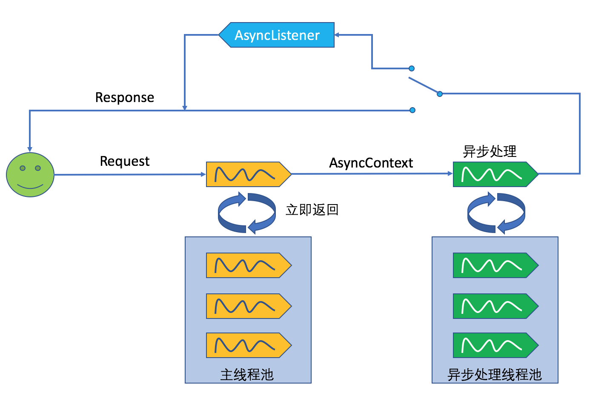
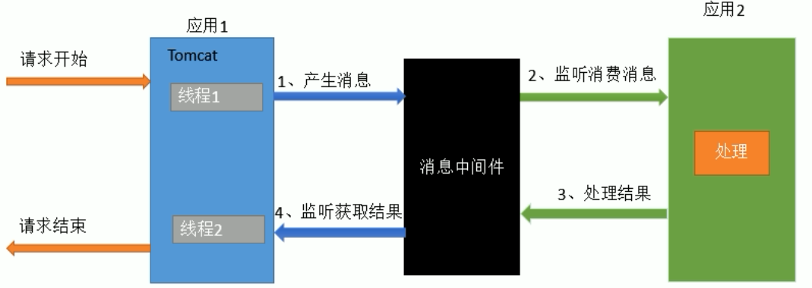

# bean 注入ioc容器汇中方式

## 从bean.xml文件中注入

1定义一个实体类，供后面测试

```java
public class TestBean {

    private String username;
    private String password;

    public String getUsername() {
        return username;
    }

    public void setUsername(String username) {
        this.username = username;
    }

    public String getPassword() {
        return password;
    }

    public void setPassword(String password) {
        this.password = password;
    }

    @Override
    public String toString() {
        return "TestBean{" +
                "username='" + username + '\'' +
                ", password='" + password + '\'' +
                '}';
    }
}
```

2 在resources下建立bean.xml文件

```xml
<!--以配置文件的方式配置bean-->
<bean id="testBean" class="com.xiao.entry.TestBean" >
    <property name="username" value="xiao"></property>
    <property name="password" value="123456"></property>
</bean>
```

3 在test类中获取

```java
@Test
public void testBeanXml(){
    //直接从bean文件获取bean
    ApplicationContext applicationContext = new ClassPathXmlApplicationContext("bean.xml");
    TestBean testBean = (TestBean) applicationContext.getBean("testBean");
    System.out.println(testBean.toString());
}
```

## 以配置类config的方式进行配置

定义一个配置类，这个方法中的bean的id默认是方法名

```java
@Configuration
public class MainConfig {
    @Bean
    public TestBean testBean(){
        TestBean testBean = new TestBean();
        testBean.setUsername("lisi");
        return testBean;
    }
}
```

test类获取bean

```java
@Test
public void testBeanConfig(){
    ApplicationContext applicationContext = new AnnotationConfigApplicationContext(MainConfig.class);
    TestBean testBean = (TestBean)applicationContext.getBean("testBean");
    System.out.println(testBean.toString());
}
```

如果想自定义bean的id

```java
@Bean("testBeanZdy")
public TestBean testBean(){
    TestBean testBean = new TestBean();
    testBean.setUsername("lisi");
    return testBean;
}
```

## 使用注解进行包扫描

将指定包下的所有标注了@Controller、@Service、@Repository，@Component扫入容器

```java
@Configuration
@ComponentScan(value = "com.xiao")
public class MainConfig {
    @Bean("testBeanZdy")
    public TestBean testBean(){
        TestBean testBean = new TestBean();
        testBean.setUsername("lisi");
        return testBean;
    }
}
```

排除controller注解，将其不纳入扫描范围

```java
@Configuration
@ComponentScan(value = "com.xiao",excludeFilters = {
        @ComponentScan.Filter(type= FilterType.ANNOTATION, classes = {Controller.class}),
})
```

只扫描controller组件

```java
@Configuration
@ComponentScan(value = "com.xiao",includeFilters = {
        @ComponentScan.Filter(type = FilterType.ANNOTATION, classes = {Controller.class})
}, useDefaultFilters = false)
```

## 组件的过滤规则

FilterType.ANNOTATION：按照注解
FilterType.ASSIGNABLE_TYPE：按照给定的类型（如:指定某个接口的实现类，就只扫描这个接口的实现类）；
FilterType.ASPECTJ：使用ASPECTJ表达式
FilterType.REGEX：使用正则指定
FilterType.CUSTOM：使用自定义规则

自定义规则示例

```java
public class MyTestFilter implements TypeFilter {
    /**
     *
     * @param metadataReader 获取当前扫描类的信息
     * @param metadataReaderFactory 获取其他所有类的信息
     * @return
     * @throws IOException
     */
    public boolean match(MetadataReader metadataReader, MetadataReaderFactory metadataReaderFactory) throws IOException {
        //获取当前类注解信息
        AnnotationMetadata annotationMetadata = metadataReader.getAnnotationMetadata();
        //获取当前类信息
        metadataReader.getClassMetadata();
        //获取当前类资源， 如类路径等
        metadataReader.getResource();
        //如果返回true，则意味着将当前类加入容器中
        return false;
    }
}
```

## 懒加载

第一次获取bean的时候加载bean的对象，默认时初始化的时候就把bean对象创建好了

```java
@Bean
@Lazy
public TestBean testBean(){
    System.out.println("创建对象bean、、、、");
    TestBean testBean = new TestBean();
    testBean.setUsername("lisi");
    return testBean;
}
```

## 满足条件则加载bean（condition）

@condition注解，spring 4.0后产生，大量运用于spring boot中

比如，某两个bean，我们需要一个在Windows环境下注入，另一个需要在linux环境下注入

配置windows的condition，如果matches返回true，则注入bean

```java
public class WindowsCondition implements Condition {
    /**
     * 如果为false，被bean不生效
     * @param conditionContext
     * @param annotatedTypeMetadata
     * @return
     */
    public boolean matches(ConditionContext conditionContext, AnnotatedTypeMetadata annotatedTypeMetadata) {
        //获取bean上下文的工厂
        ConfigurableListableBeanFactory beanFactory = conditionContext.getBeanFactory();
        //获取当前环境信息
        Environment environment = conditionContext.getEnvironment();
        //判断是否时windows环境
        if(environment.getProperty("os.name").contains("Windows")){
            return true;
        }
        return false;
    }
}
```

linux的condition，这里直接写了false

```java
public class LinuxConfition implements Condition {
    public boolean matches(ConditionContext conditionContext, AnnotatedTypeMetadata annotatedTypeMetadata) {
        return false;
    }
}
```

config类的方法上加入对应的@Conditional， @Conditional可以加在类上，如果加在类上，则对整个congfig类中配置的bean都生效，Conditional配置时数组类型，可以配置多个

```java
@Bean
@Conditional({WindowsCondition.class})
public TestBean testBeanWindows(){
    TestBean testBean = new TestBean();
    testBean.setUsername("windows");
    return testBean;
}

@Bean
@Conditional({LinuxConfition.class})
public TestBean testBeanLinux(){
    TestBean testBean = new TestBean();
    testBean.setUsername("Linux");
    return testBean;
}
```

## @import导入组件

这里improt导入的组件，默认bean的id是全类名

如：com.xiao.entry.TestImport

```java
@Configuration
@ComponentScan(value = "com.xiao",includeFilters = {
        @ComponentScan.Filter(type = FilterType.ANNOTATION, classes = {Controller.class})
}, useDefaultFilters = false)
@Import({TestImport.class})
public class MainConfig 
```

```java
public class TestImport {
}
```

## ImportSelector

自定义逻辑返回需要的组件

写一个自己的selector，将要导入的组件全类名写入返回的数组中

```java
public class TestImportSelector implements ImportSelector {
    /**
     * AnnotationMetadata:当前标注@Import注解的类的所有注解信息
     * @param annotationMetadata
     * @return 导入到容器中的组件全类名
     */
    public String[] selectImports(AnnotationMetadata annotationMetadata) {
        //这里不能返回null，要么就返回空数组
        //return new String[0];
        return new String[]{"com.xiao.entry.MySelectorBean"};
    }
}
```

配置类中导入

```java
@Import({TestImport.class, TestImportSelector.class})
public class MainConfig
```

打印可以看到对应的组件

mainConfig
testController
com.xiao.entry.TestImport
com.xiao.entry.MySelectorBean
testBean
testBeanWindows

## ImportBeanDefinitionRegistrar

手动的根据容器中条件注入bean

```java
public class MyImprotBeanDef implements ImportBeanDefinitionRegistrar {
    /**
     * 手动的注入bean信息
     * @param annotationMetadata
     * @param beanDefinitionRegistry 所有注入容器的bean信息
     */
    public void registerBeanDefinitions(AnnotationMetadata annotationMetadata,
                                        BeanDefinitionRegistry beanDefinitionRegistry) {
        //判断是否存在testBean
        boolean testBean = beanDefinitionRegistry.containsBeanDefinition("testBean");
        if(testBean){
            //如果存在则注入myDefBean
            RootBeanDefinition rootBeanDefinition 
                = new RootBeanDefinition(TestImport.class);
            beanDefinitionRegistry
                .registerBeanDefinition("myDefBean", rootBeanDefinition);
        }
    }
}
```

```java
@Import({TestImport.class, TestImportSelector.class, MyImprotBeanDef.class})
public class MainConfig
```

打印结果：

```console
mainConfig
testController
com.xiao.entry.TestImport
com.xiao.entry.MySelectorBean
testBean
testBeanWindows
myDefBean
```

## spring的工厂bean

```java
public class TestFactoryBean implements FactoryBean<TestBean> {
    //创建对象注入ioc容器中
    public TestBean getObject() throws Exception {
        return new TestBean();
    }

    //是否单例模式
    public boolean isSingleton() {
        return false;
    }

    public Class<?> getObjectType() {
        return TestBean.class;
    }
}
```

```java
@Bean
public TestFactoryBean testFactoryBean(){
    return new TestFactoryBean();
}
```

```java
@Test
public void testBeanConfig2(){

    ApplicationContext applicationContext = new AnnotationConfigApplicationContext(MainConfig.class);
    //TestBean testBean = (TestBean)applicationContext.getBean("testBean");
    System.out.println("容器已加载完");
    //TestBean testBean = (TestBean)applicationContext.getBean("testBean");
    TestBean testBean = (TestBean)applicationContext.getBean("testFactoryBean");
    System.out.println(testBean.getClass());
}
```

输出结果，可以看到虽然获取的是testFactoryBean，但其类型时testbean类型

容器已加载完
class com.xiao.entry.TestBean ...

## spring 的生命周期

### 第一种方式

在注入bean的时候，执行初始化方法，在销毁容器时，执行bean的销毁方法

如果时多实例的，只会执行初始化方法

```java
public class TestInit {
    public void init(){
        System.out.println("test init");
    }

    public void destroy(){
        System.out.println("test destroy");
    }
}
```

```java
@Bean(initMethod = "init", destroyMethod = "destroy")
public TestInit testInit(){
    return new TestInit();
}
```

### 第二种方式

实现InitializingBean，DisposableBean接口，实现对应方法，将类注入ioc容器中

```java
@Component
public class Cat implements InitializingBean,DisposableBean {
    //容器销毁时执行方法
    public void destroy() throws Exception {
        System.out.println("Cat.....destroy");
    }
    //加载完属性执行方法，也就是初始化
    public void afterPropertiesSet() throws Exception {
        System.out.println("Cat ... init ...");
    }
}
```

### 第三种方式 JSR250

利用jsr250注解

```java
@Component
public class TestJsr250 {
    //bean初始化完成，并且赋值完成调用
    @PostConstruct
    public void init(){
        System.out.println("TestJsr250 ... init");
    }
    //容器销毁bean时调用
    @PreDestroy
    public void destroy(){
        System.out.println("TestJsr250 ... destroy");
    }
}
```

### 所有bean初始化前后调用(后置处理器)

所有bean在调用初始化方法前后时都会调用下面的方法

这个在底层大量运用，如

bean赋值，注入其他组件，@Autowired，生命周期注解功能，@Async,xxx BeanPostProcessor;

```java
/**
 * 所有bean初始化前后调用
 * Created by Administrator on 2019/6/29.
 */
@Component
public class TestBeanPropersecor implements BeanPostProcessor {
    /**
     * bean调用初始化方法之前调用
     * @param o bean对象
     * @param s bean id名
     * @return
     * @throws BeansException
     */
    public Object postProcessBeforeInitialization(Object o, String s) throws BeansException {
        System.out.println("BeforeInitialization.. "+o.getClass() + " bean name："+s);
        //返回bean对象，这里可以根据一些操作，返回处理后的bean
        return o;
    }

    public Object postProcessAfterInitialization(Object o, String s) throws BeansException {
        System.out.println("AfterInitialization.. "+o.getClass() + " bean name："+s);
        return o;
    }
}
```

## @value注入属性值

 @Value("张三"):直接赋值方式

 @Value("#{2+3}")：SPEL表达方式

 @Value("${}"):直接取配置文件属性值

```java
public class TestBean {

    @Value("张三")
    private String username;
    @Value("#{2+3}")
    private String password;
```

## 获取配置文件属性值

建立配置文件testBean.properties

testBean.realName=真实的张三

建立实体bean，使用${testBean.realName}获取配置文件信息

```java
public class TestBean {

    @Value("张三")
    private String username;
    @Value("#{2+3}")
    private String password;
    @Value("${testBean.realName}")
    private String realname;
```

在配置java类中，获取配置文件信息，不要手贱加空格哈，我就加了，哈哈哈哈。。。。

```java
@Configuration
@PropertySource(value = "classpath:/testBean.properties")
public class MainConfig2 {
    @Bean
    public TestBean testBean(){
       return  new TestBean();
    }
}
```

也可以通过applicationContext获取配置信息

打印：

TestBean{username='张三', password='5', realname='真实的张三'}
真实的张三

```java
@Test
public void testBeanConfig1(){
    AnnotationConfigApplicationContext applicationContext = new AnnotationConfigApplicationContext(MainConfig2.class);
    //获取这个配置类中的容器中的所有bean
    TestBean testBean = (TestBean)applicationContext.getBean("testBean");
    System.out.println(testBean.toString());
    //还可以通过这种方式获取配置信息
    ConfigurableEnvironment environment = applicationContext.getEnvironment();
    String realname =  environment.getProperty("testBean.realName");
    System.out.println(realname);
    applicationContext.close();
}
```

## @Primary首选bean

@autowired注解注入bean时，默认的时先找同class类型的bean，如果有多个bean，则按照名称注入，此时可以指定@qualifile来注入，但如果不想这样写时，可以用@Primary方式，让这个产生的bean优先注入

```
@Bean
@Primary
public TestBean testBean(){
   return  new TestBean();
}
```

## @autowired

自动装配位置：构造函数、set方法上、参数上

在有参构造方法中，默认会寻找参数所注入的bean，如：这个时候，默认注入的就是testBean

```java
@Service
public class TestService {
    private TestBean testBean;

    public TestService(TestBean testBean) {
        this.testBean = testBean;
    }
```

在@bean中，也可以为参数默认注入bean，这个@autowired可以省略

```java
@Bean
@Primary
public TestBean testBean(@Autowired Cat cat){
   return  new TestBean();
}
```

## 注入spring底层组件（awar）

只需要实现awar下面的各类接口，就可以调用底层的组件

```java
@Component
public class Red implements ApplicationContextAware, BeanNameAware,EmbeddedValueResolverAware {

    public void setApplicationContext(ApplicationContext applicationContext) throws BeansException {
        System.out.println("获取容器信息:"+applicationContext.getClass());
    }

    public void setBeanName(String s) {
        System.out.println("获取该类的beanname："+s);
    }

    public void setEmbeddedValueResolver(StringValueResolver stringValueResolver) {
        System.out.println("取出容器加载配置文件的属性值："+stringValueResolver.resolveStringValue("${testBean.realName}"));
    }
}
```

输出结果：

获取该类的beanname：red
取出容器加载配置文件的属性值：真实的张三
获取容器信息:class org.springframework.context.annotation.AnnotationConfigApplicationContext

## 生产、测试、开发环境切换

建立一个config，用@profile标注个个环境产生的bean（如果不标示，则标示默认产生）

```java
@Configuration
public class TestProfile {

    @Profile(value = "test")
    @Bean("testTestBean")
    public TestBean testBeanTest(){
        return new TestBean();
    }

    @Profile(value = "prod")
    @Bean("prodTestBean")
    public TestBean testBeanPro(){
        return new TestBean();
    }

    @Profile(value = "dev")
    @Bean("devTestBean")
    public TestBean testBeanDev(){
        return new TestBean();
    }
}
```

1、使用命令行动态参数: 在虚拟机参数位置加载 -Dspring.profiles.active=test

2、代码的方式切换产生对应的bean 

```java
@Test
public void testBeanConfig2(){
    AnnotationConfigApplicationContext applicationContext = new AnnotationConfigApplicationContext();
    //设置激活的环境
    applicationContext.getEnvironment().setActiveProfiles("prod");
    //配置主配置类
    applicationContext.register(TestProfile.class);
    //启动刷新容器
    applicationContext.refresh();

    String[] beanNamesForType = applicationContext.getBeanNamesForType(TestBean.class);
    for(String beanName : beanNamesForType){
        System.out.println(beanName);
    }
    applicationContext.close();
}
```

# 注解 aop

## aop功能的测试

1 导入依赖包

```xml
<dependency>
    <groupId>org.springframework</groupId>
    <artifactId>spring-aspects</artifactId>
    <version>4.3.12.RELEASE</version>
</dependency>
```

2 建立一个aop需要拦截的类

```java
public class AopClass {
    public String aopMethod(String name){
        return "进过aop method 方法处理："+name;
    }
}
```

3 定义日期切面方法

通知方法：
 * 前置通知(@Before)：logStart：在目标方法(div)运行之前运行
 * 后置通知(@After)：logEnd：在目标方法(div)运行结束之后运行（无论方法正常结束还是异常结束）
 * 返回通知(@AfterReturning)：logReturn：在目标方法(div)正常返回之后运行
 * 异常通知(@AfterThrowing)：logException：在目标方法(div)出现异常以后运行
 * 环绕通知(@Around)：可以在方法之前、之后、发生异常时执行，手动推进目标方法运行（joinPoint.procced()）

给切面类的目标方法标注何时何地运行（通知注解:@Aspect）

```java
@Aspect
public class LogAspects {
    // * 表示所有方法， .. 表示多个参数
    @Pointcut("execution(public String com.xiao.aop.AopClass.*(..)) ")
    public void pointCut(){
    }
    @Before("pointCut()")
    public void logStart(JoinPoint joinPoint){
        Object[] args = joinPoint.getArgs();
        System.out.println(joinPoint.getSignature().getName()+"方法开始切入之前：参数："+args);
    }
    @After("pointCut()")
    public void logEnd(JoinPoint joinPoint){
        System.out.println(""+joinPoint.getSignature().getName()+"结束。。。@After");
    }
    @AfterReturning(value = "pointCut()", returning ="result")
    public void logReturn(JoinPoint joinPoint, Object result){
        System.out.println(""+joinPoint.getSignature().getName()+"正常返回。。。@AfterReturning:运行结果：{"+result+"}");
    }
    @AfterThrowing(value = "pointCut()", throwing = "execution")
    public void logException(JoinPoint joinPoint, Exception execution){
        System.out.println(""+joinPoint.getSignature().getName()+"异常返回。。。@AfterThrowing:运行结果：{"+execution+"}");
    }
}
```

配置配置类

```java
@EnableAspectJAutoProxy
@Configuration
public class MainConfigAop {
    @Bean
    public LogAspects logAspects(){
        return new LogAspects();
    }
    @Bean
    public AopClass aopClass(){
        return new AopClass();
    }
}
```

调用：

```java
@Test
public void testBeanConfig3(){
    AnnotationConfigApplicationContext applicationContext = new AnnotationConfigApplicationContext(MainConfigAop.class);
    //获取这个配置类中的容器中的所有bean
    AopClass aopClass = (AopClass)applicationContext.getBean("aopClass");
    aopClass.aopMethod("老小");
    applicationContext.close();
}
```

输出：

aopMethod方法开始切入之前：参数：[Ljava.lang.Object;@1465398
进入方法
aopMethod结束。。。@After
aopMethod正常返回。。。@AfterReturning:运行结果：{进过aop method 方法处理：老小}

### 环绕通知

```java
public class SurroundMethod implements MethodInterceptor{
    public Object invoke(MethodInvocation invocation) {
        Object result = null;
        try {
            System.out.println("环绕通知里面的【前置通知】。。。");
            result = invocation.proceed();  //这里相当于执行目标方法 如果不写目标方法就不会执行
            // result是目标方法的返回值
            System.out.println("环绕通知里面的【后置通知】...");
        } catch (Throwable e) {
            System.out.println("这里是执行环绕通知里面的【异常通知】。。。");
            e.printStackTrace();
        } finally{
　　　　　　　System.out.println("这里是执行环绕通知里面的【最终通知】");
　　　　　}
        return result;
        //也可以返回其他  return “123”;  那么目标方法的返回值就是 "123"
    } 
}
```


## 总结

1 @Aspect 标示切面类，在切面方法中标示对应的处理时机

2 将切面类和被切类注入容器中

3 在配置类启动切面注解@EnableAspectJAutoProxy

## aop原理

总体概括：@EnableAspectJAutoProxy注解给容器创建和注册AnnotationAwareAspectJAutoProxyCreator的bean（后置处理器，意味着以后任何组件创建时，都要执行这个后置处理器方法）

在@EnableAspectJAutoProxy注解中，有一个@Import(AspectJAutoProxyRegistrar.class)注解

它导入了AspectJAutoProxyRegistrar组件

AspectJAutoProxyRegistrar注入了org.springframework.aop.config.internalAutoProxyCreator（AnnotationAwareAspectJAutoProxyCreator类） 的bean（自动代理处理器）

AnnotationAwareAspectJAutoProxyCreator：父类一层层的看的它实现了SmartInstantiationAwareBeanPostProcessor后置处理器，BeanFactoryAware自动装配BeanFactory

后置处理器创建过程：

1 传入配置类，创建ioc容器

2 注册配置类，调用refresh();刷新容器

3 进入refresh方法

```java
// Register bean processors that intercept bean creation.
registerBeanPostProcessors(beanFactory);
```

注册后置处理器方法

---

1) 进入registerBeanPostProcessors方法，先获取ioc容器已经定义了的需要创建对象的所有BeanPostProcessor

```java
String[] postProcessorNames =
 beanFactory.getBeanNamesForType(BeanPostProcessor.class, true, false);
```


2) 优先注册实现了PriorityOrdered接口的BeanPostProcessor

3) 再给容器中注册实现了Ordered接口的BeanPostProcessor

4) 注册没实现优先级接口的BeanPostProcessor

​		注册BeanPostProcessor，实际上就是创建BeanPostProcessor对象，保存在容器中

在注册processor里面循环方法中getBean这个方法进入可以看到，所以这个时候已经穿件BeanPostProcessor的bean

```java
BeanPostProcessor pp = beanFactory.getBean(ppName, BeanPostProcessor.class);
```

```java
@Override
public Object getBean(String name) throws BeansException {
   return doGetBean(name, null, null, false);
}
```

doGetBean先尝试获取单实例bean

```java
if (mbd.isSingleton()) {
  sharedInstance = getSingleton(beanName, new ObjectFactory<Object>() {
						@Override
						public Object getObject() throws BeansException {
							try {
								return createBean(beanName, mbd, args);
							}
							catch (BeansException ex) {
								destroySingleton(beanName);
								throw ex;
							}
						}
					})
```

在getSingleton方法中，这个object就是new ObjectFactory中的方法，它去创建了一个bean

```java
singletonObject = singletonFactory.getObject();
```

**如何创建BeanPostProcessor**

进入createBean的方法中

```java
@Override
protected Object createBean(String beanName, RootBeanDefinition mbd, Object[] args) throws BeanCreationException {
   if (logger.isDebugEnabled()) {
      logger.debug("Creating instance of bean '" + beanName + "'");
   }
```

进入doCreateBean方法，看到instanceWrapper = createBeanInstance(beanName, mbd, args);

```java
protected Object doCreateBean(final String beanName, final RootBeanDefinition mbd, final Object[] args)
      throws BeanCreationException {

   // Instantiate the bean.
   BeanWrapper instanceWrapper = null;
   if (mbd.isSingleton()) {
      instanceWrapper = this.factoryBeanInstanceCache.remove(beanName);
   }
   if (instanceWrapper == null) {
      instanceWrapper = createBeanInstance(beanName, mbd, args);
   }
   populateBean(beanName, mbd, instanceWrapper);
```

**populateBean(beanName, mbd, instanceWrapper)**给bean初始化

初始化流程：

这在initializeBean方法中看到invokeAwareMethods方法，这个方法是用来awar接口的方法回调

```java
protected Object initializeBean(final String beanName, final Object bean, RootBeanDefinition mbd) {
   if (System.getSecurityManager() != null) {
      AccessController.doPrivileged(new PrivilegedAction<Object>() {
         @Override
         public Object run() {
            invokeAwareMethods(beanName, bean);
            return null;
         }
      }, getAccessControlContext());
   }
   else {
			invokeAwareMethods(beanName, bean);
		}

		Object wrappedBean = bean;
		if (mbd == null || !mbd.isSynthetic()) {
			wrappedBean = applyBeanPostProcessorsBeforeInitialization(wrappedBean, beanName);
		}
```

我们可以看到，applyBeanPostProcessorsBeforeInitialization方法，这个后置处理器处理方法，调用所有的后置处理器的postProcessBeforeInitialization方法

然后执行invokeInitMethods(beanName, wrappedBean, mbd);初始化方法

然后执行applyBeanPostProcessorsAfterInitialization(wrappedBean, beanName);方法，执行所有的后置处理器的postProcessAfterInitialization（）方法

**我们的BeanPostProcessor(AnnotationAwareAspectJAutoProxyCreator)创建成功；得到aspectJAdvisorsBuilder**

---

5) 把BeanPostProcessor注册到BeanFactory中

4 finishBeanFactoryInitialization(beanFactory);完成BeanFactory初始化工作；

创建剩下的单实例bean， **刚才上面创建的是后置处理器bean**

```java
// Instantiate all remaining (non-lazy-init) singletons.
finishBeanFactoryInitialization(beanFactory);
```

初始化过程：

---

在finishBeanFactoryInitialization方法中，调用beanFactory.preInstantiateSingletons();创建方法

进入preInstantiateSingletons方法

 new ArrayList<String>(this.beanDefinitionNames)获取所有bean定义的bean名

遍历获取容器中所有的Bean，依次创建对象getBean(beanName);

getBean->doGetBean()->getSingleton()->

创建bean

先从缓存中获取当前bean（只要创建好的Bean都会被缓存起来），如果能获取到，说明bean是之前被创建过的，直接使用，否则再创建

```java
@Override
public void preInstantiateSingletons() throws BeansException {
   if (this.logger.isDebugEnabled()) {
      this.logger.debug("Pre-instantiating singletons in " + this);
   }
   List<String> beanNames = new ArrayList<String>(this.beanDefinitionNames);

   // Trigger initialization of all non-lazy singleton beans...
   for (String beanName : beanNames) {
```

创建bean过程protected Object createBean(String beanName, RootBeanDefinition mbd, Object[] args)：

​	在createBean方法中

resolveBeforeInstantiation(beanName, mbdToUse);解析BeforeInstantiation

希望后置处理器在此能返回一个代理对象；如果能返回代理对象就返回

拿到所有后置处理器，如果是InstantiationAwareBeanPostProcessor;

就执行**postProcessBeforeInstantiation**

- 【BeanPostProcessor是在Bean对象创建完成初始化前后调用的】

- 【InstantiationAwareBeanPostProcessor是在创建Bean实例之前先尝试用后置处理器返回对象的】

  **AnnotationAwareAspectJAutoProxyCreator**实现的就是InstantiationAwareBeanPostProcessor后置处理器，所以，他会在任何bean创建之前，去尝试拦截

  在创建的时候它去调用

```java
Object bean = resolveBeforeInstantiation(beanName, mbdToUse);
```

如果不能就继续进入

doCreateBean(final String beanName, final RootBeanDefinition mbd, final Object[] args)

这个才是真正的去创建一个bean实例，和之前说创建后置处理器bean一样

**所以， AnnotationAwareAspectJAutoProxyCreator，在所有bean创建之前会有一个拦截，因为实现了InstantiationAwareBeanPostProcessor，所以会调用postProcessBeforeInstantiation()返回一个代理的bean

---

5 **AopClass(我们的被切面的类)和LogAspects我们的切面类创建bean过程**

这两个bean是通过postProcessBeforeInstantiation来创建的

1 判断当前bean是否在advisedBeans中（保存了所有需要增强bean）

2 isInfrastructureClass(beanClass) 判断是否时切面类（AopClass不是）（@Aspect）

3 shouldSkip(beanClass, beanName)判断是否需要跳过

​	1）获取候选的增强器（切面里面的通知方法）【List<Advisor> candidateAdvisors】


```java
@Override
	public Object postProcessBeforeInstantiation(Class<?> beanClass, String beanName) throws BeansException {
		Object cacheKey = getCacheKey(beanClass, beanName);

		if (beanName == null || !this.targetSourcedBeans.contains(beanName)) {
			if (this.advisedBeans.containsKey(cacheKey)) {
				return null;
			}
			if (isInfrastructureClass(beanClass) || shouldSkip(beanClass, beanName)) {
				this.advisedBeans.put(cacheKey, Boolean.FALSE);
				return null;
			}
		}
		if (beanName != null) {.
				Object proxy = createProxy(beanClass, beanName, specificInterceptors, targetSource);
				this.proxyTypes.put(cacheKey, proxy.getClass());
				return proxy;
			}
		}

		return null;
	}
```

判断是否切面的方法

```java
public class AnnotationAwareAspectJAutoProxyCreator extends AspectJAwareAdvisorAutoProxyCreator {
@Override
protected boolean isInfrastructureClass(Class<?> beanClass) {
   // Previously we setProxyTargetClass(true) in the constructor, but that has too
   // broad an impact. Instead we now override isInfrastructureClass to avoid proxying
   // aspects. I'm not entirely happy with that as there is no good reason not
   // to advise aspects, except that it causes advice invocation to go through a
   // proxy, and if the aspect implements e.g the Ordered interface it will be
   // proxied by that interface and fail at runtime as the advice method is not
   // defined on the interface. We could potentially relax the restriction about
   // not advising aspects in the future.
   return (super.isInfrastructureClass(beanClass) || this.aspectJAdvisorFactory.isAspect(beanClass));
}
```

创建完AopClass类之后，调用postProcessAfterInitialization方法

return wrapIfNecessary(bean, beanName, cacheKey);//包装如果需要的情况下
 * 1）、获取当前bean的所有增强器（通知方法）  Object[]  specificInterceptors
      * 1、找到候选的所有的增强器（找哪些通知方法是需要切入当前bean方法的）
      *2、获取到能在bean使用的增强器。
      *3、给增强器排序
 * 2）、保存当前bean在advisedBeans中；
 * 3）、如果当前bean需要增强，创建当前bean的代理对象；
      *1）、获取所有增强器（通知方法）
      * 2）、保存到proxyFactory
      * 3）、创建代理对象：Spring自动决定
           *JdkDynamicAopProxy(config);jdk动态代理；
           * ObjenesisCglibAopProxy(config);cglib的动态代理；
 * 		4）、给容器中返回当前组件使用cglib增强了的代理对象；
 * 		5）、以后容器中获取到的就是这个组件的代理对象，执行目标方法的时候，代理对象就会执行通知方法的流程；

```java
public abstract class AbstractAutoProxyCreator extends ProxyProcessorSupport
		implements SmartInstantiationAwareBeanPostProcessor, BeanFactoryAware {
@Override
public Object postProcessAfterInitialization(Object bean, String beanName) throws BeansException {
   if (bean != null) {
      Object cacheKey = getCacheKey(bean.getClass(), beanName);
      if (!this.earlyProxyReferences.contains(cacheKey)) {
         return wrapIfNecessary(bean, beanName, cacheKey);
      }
   }
   return bean;
}
```

目标方法执行:

容器中保存了组件的代理对象（cglib增强后的对象），这个对象里面保存了详细信息（比如增强器，目标对象，xxx）；
 * 1）、CglibAopProxy.intercept();拦截目标方法的执行
 * 2）、根据ProxyFactory对象获取将要执行的目标方法拦截器链；
      * List<Object> chain = this.advised.getInterceptorsAndDynamicInterceptionAdvice(method, targetClass);
      * 如何获取拦截器链
           * 1）、List<Object> interceptorList保存所有拦截器 5
                * 一个默认的ExposeInvocationInterceptor 和 4个增强器；
           * 2）、遍历所有的增强器，将其转为Interceptor；
                *registry.getInterceptors(advisor);
           * 3）、将增强器转为List<MethodInterceptor>；
                * 如果是MethodInterceptor，直接加入到集合中
                * 如果不是，使用AdvisorAdapter将增强器转为MethodInterceptor；
                * 转换完成返回MethodInterceptor数组；

* 3）、如果没有拦截器链，直接执行目标方法;
     * 拦截器链（每一个通知方法又被包装为方法拦截器，利用MethodInterceptor机制）
 * 4）、如果有拦截器链，把需要执行的目标对象，目标方法，
      * 拦截器链等信息传入创建一个 CglibMethodInvocation 对象，
      * 并调用 Object retVal =  mi.proceed();

*5）、拦截器链的触发过程（CglibMethodInvocation.proceed()方法过程 ）
     * 1)、如果没有拦截器执行执行目标方法，或者拦截器的索引和拦截器数组-1大小一样（指定到了最后一个拦截器）执行目标方法；
          *2)、链式获取每一个拦截器，拦截器执行invoke方法，每一个拦截器等待下一个拦截器执行完成返回以后再来执行；
          *拦截器链的机制，保证通知方法与目标方法的执行顺序；
拦截器链时拍好续的，递归调用invoke方法，最后一个调用invoke，执行方法前的拦截器链，执行后返回，执行方法执行后的拦截器链，如果没抛出异常，返回后执行returning拦截器链

## 总结

 *1）、  @EnableAspectJAutoProxy 开启AOP功能
 * 2）、 @EnableAspectJAutoProxy 会给容器中注册一个组件 AnnotationAwareAspectJAutoProxyCreator
 * 3）、AnnotationAwareAspectJAutoProxyCreator是一个后置处理器；
 * 4）、容器的创建流程：
    * 1）、registerBeanPostProcessors（）注册后置处理器；创建AnnotationAwareAspectJAutoProxyCreator对象

    * 2）、finishBeanFactoryInitialization（）初始化剩下的单实例bean

       * 1）、创建业务逻辑组件和切面组件

       * 2）、AnnotationAwareAspectJAutoProxyCreator拦截组件的创建过程

       * 3）、组件创建完之后，判断组件是否需要增强

         是：切面的通知方法，包装成增强器（Advisor）;给业务逻辑组件创建一个代理对象（cglib）；
 * 5）、执行目标方法：
    * 1）、代理对象执行目标方法
    *2）、CglibAopProxy.intercept()；
         * 	1）、得到目标方法的拦截器链（增强器包装成拦截器MethodInterceptor）
         * 2）、利用拦截器的链式机制，依次进入每一个拦截器进行执行；
            *3）、效果：
              * 正常执行：前置通知-》目标方法-》后置通知-》返回通知
              *  出现异常：前置通知-》目标方法-》后置通知-》异常通知

# 声明式事务

## 环境搭建

```java
@Configuration
@ComponentScan("com.xiao.tx")
//开始事务管理
@EnableTransactionManagement
public class TxConfig {

    //注入数据源
    @Bean
    public DataSource dataSource() throws Exception{
        DruidDataSource dataSource = new DruidDataSource();
        dataSource.setUsername("root");

        dataSource.setPassword("123456");
        dataSource.setDriverClassName("com.mysql.jdbc.Driver");
        String url = "jdbc:mysql://192.168.94.129:3306/mytest1" +
                "?serverTimezone=UTC&useUnicode=true&characterEncoding=utf-8";
        dataSource.setUrl(url);
        return dataSource;
    }
    @Bean
    public JdbcTemplate jdbcTemplate() throws Exception{
        //传人dataSource(),Spring对@Configuration类会特殊处理；
        // 给容器中加组件的方法，多次调用都只是从容器中找组件
        return new JdbcTemplate(dataSource());
    }
    @Bean
    public PlatformTransactionManager transactionManager() throws Exception {
        return new DataSourceTransactionManager(dataSource());
    }
}
```

```java
@Service
public class UserService {
    @Autowired
    public UserDao userDao;
    @Transactional
    public void insert(){
        userDao.insert(UUID.randomUUID().toString());
        int i = 1/0;
    }
}
```

## 原理

@EnableTransactionManagement注解中import了TransactionManagementConfigurationSelector选择器

它导入了两个组件

 * AutoProxyRegistrar

 * ProxyTransactionManagementConfiguration

### AutoProxyRegistrar

 * 给容器中注册一个 InfrastructureAdvisorAutoProxyCreator 组件；

 * InfrastructureAdvisorAutoProxyCreator：

   利用后置处理器机制在对象创建以后，包装对象，返回一个代理对象（增强器），代理对象执行方法利用拦截器链进行调用；

```java
public abstract class AbstractAutoProxyCreator extends ProxyProcessorSupport
      implements SmartInstantiationAwareBeanPostProcessor, BeanFactoryAware
```

### ProxyTransactionManagementConfiguration

它是一个config

* 给容器中注册事务增强器
  * 事务增强器要用事务注解的信息，在AnnotationTransactionAttributeSource解析事务注解
  * 事务拦截器，
    * TransactionInterceptor：保存了事务属性信息，事务管理器；

```java
@Configuration
public class ProxyTransactionManagementConfiguration extends AbstractTransactionManagementConfiguration {
    @Bean(name = TransactionManagementConfigUtils.TRANSACTION_ADVISOR_BEAN_NAME)
	@Role(BeanDefinition.ROLE_INFRASTRUCTURE)
	public BeanFactoryTransactionAttributeSourceAdvisor transactionAdvisor() 
        
        
        @Bean
	@Role(BeanDefinition.ROLE_INFRASTRUCTURE)
	public TransactionAttributeSource transactionAttributeSource() {
        //解析注解的信息
		return new AnnotationTransactionAttributeSource();
	}
    //事务拦截器
    @Bean
	@Role(BeanDefinition.ROLE_INFRASTRUCTURE)
	public TransactionInterceptor transactionInterceptor() {
		TransactionInterceptor interceptor = new TransactionInterceptor();
		interceptor.setTransactionAttributeSource(transactionAttributeSource());
		if (this.txManager != null) {
			interceptor.setTransactionManager(this.txManager);
		}
		return interceptor;
	}
```

* 从TransactionInterceptor可以看到，他是一个 MethodInterceptor（方法拦截器），在目标方法执行的时候，执行拦截器链；

```java
public class TransactionInterceptor extends TransactionAspectSupport implements MethodInterceptor, Serializable
```

* 从MethodInterceptor接口实现的invoke方法下的invokeWithinTransaction方法可以看到
  * 它先获取事务相关的属性
  * 再获取PlatformTransactionManager，如果事先没有添加指定任何transactionmange(@Transactional(transactionManager = ""))，最终会从容器中按照类型获取一个PlatformTransactionManager

```java
	protected Object invokeWithinTransaction(Method method, Class<?> targetClass, final InvocationCallback invocation)
			throws Throwable {

		// If the transaction attribute is null, the method is non-transactional.
		final TransactionAttribute txAttr = getTransactionAttributeSource().getTransactionAttribute(method, targetClass);
		final PlatformTransactionManager tm = determineTransactionManager(txAttr);
		final String joinpointIdentification = methodIdentification(method, targetClass, txAttr);
        //我们要执行的事务方法
        if (txAttr == null || !(tm instanceof CallbackPreferringPlatformTransactionManager)) {
// Standard transaction demarcation with getTransaction and commit/rollback calls.
            //开启事务
			TransactionInfo txInfo = createTransactionIfNecessary(tm, txAttr, joinpointIdentification);
			Object retVal = null;
			try {
				// This is an around advice: Invoke the next interceptor in the chain.
				// This will normally result in a target object being invoked.
				retVal = invocation.proceedWithInvocation();
			}
			catch (Throwable ex) {
				// target invocation exception
                //回滚事务
				completeTransactionAfterThrowing(txInfo, ex);
				throw ex;
			}
			finally {
				cleanupTransactionInfo(txInfo);
			}
            //提交事务
			commitTransactionAfterReturning(txInfo);
			return retVal;
		}
```

# BeanFactoryPostProcessor

 * BeanPostProcessor：bean后置处理器，bean创建对象初始化前后进行拦截工作的
 * BeanFactoryPostProcessor：beanFactory的后置处理器；
    * 在BeanFactory标准初始化之后调用，来定制和修改BeanFactory的内容；
    * 所有的bean定义已经保存加载到beanFactory，但是bean的实例还未创建

```java
@Component //要想生效，则加入ioc容器中
public class MyBeanFactoryProcessor implements BeanFactoryPostProcessor {
    public void postProcessBeanFactory(ConfigurableListableBeanFactory beanFactory) throws BeansException {
        //获取所有的bean信息
        String[] beanDefinitionNames = beanFactory.getBeanDefinitionNames();
        System.out.println("MyBeanFactoryProcessor ....");
        for(String beanDefinitionName : beanDefinitionNames){
            System.out.println("MyBeanFactoryProcessor:"+beanDefinitionName);
        }
    }
}
```

```java
@ComponentScan("com.xiao.Ext")
@Configuration
public class ExtConfig {
    @Bean(initMethod = "init", destroyMethod = "destroy")
    public TestInit testInit(){
        return new TestInit();
    }
}
```

## 原理

进入refresh() 方法，可以看到invokeBeanFactoryPostProcessors(beanFactory);方法，这个方法会找到所有BeanFactoryPostProcessor并执行,在invokeBeanFactoryPostProcessors方法中，执行invokeBeanFactoryPostProcessors方法

```java
class PostProcessorRegistrationDelegate {
   public static void invokeBeanFactoryPostProcessors(
   invokeBeanFactoryPostProcessors(nonOrderedPostProcessors, beanFactory);
```

```java
private static void invokeBeanFactoryPostProcessors(
      Collection<? extends BeanFactoryPostProcessor> postProcessors, ConfigurableListableBeanFactory beanFactory) {
    //获取BeanFactoryPostProcessor的名
    String[] postProcessorNames =
				beanFactory.getBeanNamesForType(BeanFactoryPostProcessor.class, true, false);
    //获取所有未排序的BeanFactoryPostProcessor（源码上面还有其他排序的等，这里不贴出了）
    List<BeanFactoryPostProcessor> nonOrderedPostProcessors = new ArrayList<BeanFactoryPostProcessor>();
		for (String postProcessorName : nonOrderedPostProcessorNames) {
			nonOrderedPostProcessors.add(beanFactory.getBean(postProcessorName, BeanFactoryPostProcessor.class));
		}
   for (BeanFactoryPostProcessor postProcessor : postProcessors) {
      postProcessor.postProcessBeanFactory(beanFactory);
   }
}
```

# BeanDefinitionRegistryPostProcessor

* postProcessBeanDefinitionRegistry();
   - 在所有bean定义信息将要被加载，bean实例还未创建的；
   -  优先于BeanFactoryPostProcessor执行，并且先触发postProcessBeanDefinitionRegistry方法；
   -  利用BeanDefinitionRegistryPostProcessor给容器中再额外添加一些组件；

实例：

```java
@Component
public class MyBeanDefinitionRegistryPostProcessor implements BeanDefinitionRegistryPostProcessor {
    public void postProcessBeanDefinitionRegistry(BeanDefinitionRegistry registry) throws BeansException {
        System.out.println("postProcessBeanDefinitionRegistry...");
        AbstractBeanDefinition beanDefinition =
                BeanDefinitionBuilder.rootBeanDefinition(Cat.class).getBeanDefinition();
        registry.registerBeanDefinition("hello", beanDefinition);
    }

    public void postProcessBeanFactory(ConfigurableListableBeanFactory beanFactory) throws BeansException {
        System.out.println("MyBeanDefinitionRegistryPostProcessor count:"+beanFactory.getBeanDefinitionCount());
    }
}
```

# 事件监听

## 用法

在下面的代码中，我们在启动容器和close容器时，可以看到，分别收到两个发布的事件事件

ContextRefreshedEvent和ContextClosedEvent

```java
@Component
public class MyApplicationLisener implements ApplicationListener<ApplicationEvent> {
    public void onApplicationEvent(ApplicationEvent event) {
        System.out.println("收到事件："+event);
    }
}
```

发布自定义事件，获得结果：

收到事件：Test2$1[source=发布事件]

```java
@Test
public void testBeanConfig5(){
    AnnotationConfigApplicationContext applicationContext = new AnnotationConfigApplicationContext(ExtConfig.class);
    applicationContext.publishEvent(new ApplicationEvent(new String("发布事件")) {

    });
    applicationContext.close();
}
```

## 原理

### 事件发布流程

-  进入refresh()方法，执行finishRefresh();方法，再执行publishEvent(new ContextRefreshedEvent(this));发布事件
-  进入getApplicationEventMulticaster().multicastEvent(applicationEvent, eventType);方法（获取事件的多播器（派发器）：getApplicationEventMulticaster()）
-  进入multicastEvent()方法派发事件

```java
@Override
public void multicastEvent(final ApplicationEvent event, ResolvableType eventType) {
   ResolvableType type = (eventType != null ? eventType : resolveDefaultEventType(event));
   for (final ApplicationListener<?> listener : getApplicationListeners(event, type)) {
      Executor executor = getTaskExecutor();
      if (executor != null) {
         executor.execute(new Runnable() {
            @Override
            public void run() {
               invokeListener(listener, event);
            }
         });
      }
      else {
         invokeListener(listener, event);
      }
   }
}
```

### 事件多播器

在refresh（）方法中，在其他bean创建之前，执行initApplicationEventMulticaster();方法，来初始化事件多播器

## 注解的方式建立监听

```java
@Component
public class MyListener {
    @EventListener(classes = ApplicationEvent.class)
    public void listener(ApplicationEvent event){
        System.out.println("收到注解的事件监听:"+event);
    }
}
```

## SmartInitializingSingleton

在初始化容器，创建完所有单实例非懒加载bean之后，会执行实现了SmartInitializingSingleton接口的bean的afterSingletonsInstantiated方法，具体可见refresh()方法里的finishBeanFactoryInitialization(beanFactory);方法

```
public interface SmartInitializingSingleton {
   void afterSingletonsInstantiated();

}
```

# Spring容器的refresh()

1 prepareRefresh()刷新前的预处理;

- initPropertySources()初始化一些属性设置;子类自定义个性化的属性设置方法；

- getEnvironment().validateRequiredProperties();检验属性的合法等

- earlyApplicationEvents= new LinkedHashSet<ApplicationEvent>();保存容器中的一些早期的事件

2 obtainFreshBeanFactory();获取BeanFactory；

- refreshBeanFactory();刷新【创建】BeanFactory；

  - 创建了一个this.beanFactory = new DefaultListableBeanFactory();

  - 设置一个序列化id；

- getBeanFactory();返回刚才GenericApplicationContext创建的BeanFactory对象；
- 将创建的BeanFactory【DefaultListableBeanFactory】返回；

3 prepareBeanFactory(beanFactory);BeanFactory的预准备工作（BeanFactory进行一些设置）；

- 设置BeanFactory的类加载器、支持表达式解析器...
- 添加部分BeanPostProcessor【ApplicationContextAwareProcessor】
- 设置忽略的自动装配的接口EnvironmentAware、EmbeddedValueResolverAware、xxx；
- 注册可以解析的自动装配；我们能直接在任何组件中自动注入：BeanFactory、ResourceLoader、ApplicationEventPublisher、ApplicationContext
- 添加BeanPostProcessor【ApplicationListenerDetector】
- 添加编译时的AspectJ；
- 给BeanFactory中注册一些能用的组件(我们要使用直接autowied就可以，因为在这里注入进来了)；environment【ConfigurableEnvironment】、systemProperties【Map<String, Object>】、systemEnvironment【Map<String, Object>】

4 invokeBeanFactoryPostProcessors(beanFactory);执行BeanFactoryPostProcessor的方法；

- BeanFactoryPostProcessor：BeanFactory的后置处理器。在BeanFactory标准初始化之后执行的
- 它有两个接口：BeanFactoryPostProcessor、BeanDefinitionRegistryPostProcessor
- 先执行BeanDefinitionRegistryPostProcessor的方法；
- 再执行BeanFactoryPostProcessor的方法

5 registerBeanPostProcessors(beanFactory);注册（仅仅只是将其注册进入beanfactory中）BeanPostProcessor（Bean的后置处理器）：拦截bean的创建过程

- 获取所有的 BeanPostProcessor;后置处理器都默认可以通过PriorityOrdered、Ordered接口来执行优先级
   - BeanPostProcessor有这些接口：每个接口执行时间不同
       - BeanPostProcessor、DestructionAwareBeanPostProcessor、InstantiationAwareBeanPostProcessor、SmartInstantiationAwareBeanPostProcessor、MergedBeanDefinitionPostProcessor
- 先注册PriorityOrdered优先级接口的BeanPostProcessor，把每一个BeanPostProcessor；添加到BeanFactory中
- 最后注册没有实现任何优先级接口的
- 注册MergedBeanDefinitionPostProcessor
- 最后注册一个ApplicationListenerDetector；来在Bean创建完成后检查是否是ApplicationListener，这个家伙是用来检测那个时监听器的，如果是，添加到容器中

6 initMessageSource();初始化MessageSource组件（做国际化功能；消息绑定，消息解析）；

- 把创建好的MessageSource注册在容器中，以后获取国际化配置文件的值的时候，可以自动注入MessageSource；
- MessageSource.getMessage(String code, Object[] args, String defaultMessage, Locale locale);

7 initApplicationEventMulticaster();初始化事件派发器

- 将创建的ApplicationEventMulticaster添加到BeanFactory中，以后其他组件直接自动注入

8 registerListeners();给容器中将所有项目里面的ApplicationListener注册进来

- 将每个监听器添加到事件派发器中
- 派发之前步骤产生的事件

9 finishBeanFactoryInitialization(beanFactory);初始化所有剩下的单实例bean

- beanFactory.preInstantiateSingletons();初始化后剩下的单实例bean
	-  获取容器中的所有Bean，依次进行初始化和创建对象
	-  获取Bean的定义信息；RootBeanDefinition
	- 判断 Bean不是抽象的，是单实例的，是懒加载
		- 判断是否是FactoryBean；是否是实现FactoryBean接口的Bean（工厂bean的话直接调用getobject来获取bean，之前笔记有）
		- getBean(beanName)；方法，其实就是 ioc.getBean();，之前我们用context.getBean()就是这个
		- 先获取缓存中保存的单实例Bean。如果能获取到说明这个Bean之前被创建过（所有创建过的单实例Bean都会被缓存起来），从private final Map<String, Object> singletonObjects = new ConcurrentHashMap<String, Object>(256);获取的
		- 缓存中获取不到，开始Bean的创建对象流程
		- 获取当前Bean依赖的其他Bean;如果有按照getBean()把依赖的Bean先创建出来；比如之前我们有在在配置文件中配置dependsOn
<bean id="testBean" class="com.xiao.entry.TestBean" depends-on="book" >
		- String[] dependsOn = mbd.getDependsOn();
		- 启动单实例Bean的创建流程

```java
// Create bean instance.
if (mbd.isSingleton()) {
   sharedInstance = getSingleton(beanName, new ObjectFactory<Object>() {
      @Override
      public Object getObject() throws BeansException {
         try {
            return createBean(beanName, mbd, args);
         }
         catch (BeansException ex) {
            destroySingleton(beanName);
            throw ex;
         }
      }
   });
   bean = getObjectForBeanInstance(sharedInstance, name, beanName, mbd);
}
```

进入createBean(beanName, mbd, args)方法

进入resolveBeforeInstantiation方法，尝试获取BeanPostProcessors（InstantiationAwareBeanPostProcessor类型）的后置方法，方法代理对象

先触发：postProcessBeforeInstantiation()；

如果有返回值：触发postProcessAfterInitialization()；

```java
try {
			//试获取BeanPostProcessors的后置方法，方法代理对象
			Object bean = resolveBeforeInstantiation(beanName, mbdToUse);
			if (bean != null) {
				return bean;
			}
		}
		catch (Throwable ex) {
			throw new BeanCreationException(mbdToUse.getResourceDescription(), beanName,
					"BeanPostProcessor before instantiation of bean failed", ex);
		}
		//创建单实例bean
		Object beanInstance = doCreateBean(beanName, mbdToUse, args);
		if (logger.isDebugEnabled()) {
			logger.debug("Finished creating instance of bean '" + beanName + "'");
		}
```


---

进入Object beanInstance = doCreateBean(beanName, mbdToUse, args);创建Bean方法创建bean

【创建Bean实例】；createBeanInstance(beanName, mbd, args)

applyMergedBeanDefinitionPostProcessors(mbd, beanType, beanName)：调用MergedBeanDefinitionPostProcessor的postProcessMergedBeanDefinition(mbd, beanType, beanName);

```java
protected Object doCreateBean(final String beanName, final RootBeanDefinition mbd, final Object[] args)
      throws BeanCreationException {
   if (instanceWrapper == null) {
      instanceWrapper = createBeanInstance(beanName, mbd, args);
   }
   synchronized (mbd.postProcessingLock) {
	if (!mbd.postProcessed) {
		try {
            //创建了bean，未初始化之前
            //MergedBeanDefinitionPostProcessor.postProcessMergedBeanDefinition
		    applyMergedBeanDefinitionPostProcessors(mbd, beanType, beanName);
		}
	Object exposedObject = bean;
	try {
        //进行属性赋值
		populateBean(beanName, mbd, instanceWrapper);
```

进入【Bean属性赋值】populateBean(beanName, mbd, instanceWrapper);方法

赋值之前：

拿到InstantiationAwareBeanPostProcessor后置处理器；执行postProcessAfterInstantiation()；

拿到InstantiationAwareBeanPostProcessor后置处理器；postProcessPropertyValues()；**我们可以利用这个来额外的设置一些属性**

```java
protected void populateBean(String beanName, RootBeanDefinition mbd, BeanWrapper bw) {
    if (!mbd.isSynthetic() && hasInstantiationAwareBeanPostProcessors()) {
	for (BeanPostProcessor bp : getBeanPostProcessors()) {
	if (bp instanceof InstantiationAwareBeanPostProcessor) {
		InstantiationAwareBeanPostProcessor ibp = (InstantiationAwareBeanPostProcessor) bp;
                   //执行后置处理器方法
		if (!ibp.postProcessAfterInstantiation(bw.getWrappedInstance(), beanName)) {
           
```

赋值前工作完成

进入 applyPropertyValues(beanName, mbd, bw, pvs);方法，进行一些属性的赋值

**回到doCreateBean方法**

进行bean初始化工作

```java
try {
   populateBean(beanName, mbd, instanceWrapper);
   if (exposedObject != null) {
      //进行bean的初始化
      exposedObject = initializeBean(beanName, exposedObject, mbd);
   }
}
```

进入initializeBean方法

【执行Aware接口方法】invokeAwareMethods(beanName, bean);执行xxxAware接口的方法

​		BeanNameAware\BeanClassLoaderAware\BeanFactoryAware

在初始化之前，执行后置处理器beanProcessor.postProcessBeforeInitialization(result, beanName);


【执行初始化方法】invokeInitMethods(beanName, wrappedBean, mbd);

执行初始化之后方法

applyBeanPostProcessorsAfterInitialization

```java
protected Object initializeBean(final String beanName, final Object bean, RootBeanDefinition mbd) {
    else {
			invokeAwareMethods(beanName, bean);
	}
    wrappedBean = applyBeanPostProcessorsBeforeInitialization(wrappedBean, beanName);
    try {
		invokeInitMethods(beanName, wrappedBean, mbd);
	}
    if (mbd == null || !mbd.isSynthetic()) {
	wrappedBean = applyBeanPostProcessorsAfterInitialization(wrappedBean, beanName);
	}
```

**回到doCreateBean方法**, 执行注册Bean的销毁方法


ioc容器就是这些Map；很多的Map里面保存了单实例Bean，环境信息。。。


所有Bean都利用getBean创建完成以后；
检查所有的Bean是否是SmartInitializingSingleton接口的；如果是；就执行afterSingletonsInstantiated()；

# spring初始化总结

1）、Spring容器在启动的时候，先会保存所有注册进来的Bean的定义信息；
		1）、xml注册bean；<bean>
		2）、注解注册Bean；@Service、@Component、@Bean、xxx
	2）、Spring容器会合适的时机创建这些Bean
		1）、用到这个bean的时候；利用getBean创建bean；创建好以后保存在容器中；
		2）、统一创建剩下所有的bean的时候；finishBeanFactoryInitialization()；
	3）、后置处理器；BeanPostProcessor
		1）、每一个bean创建完成，都会使用各种后置处理器进行处理；来增强bean的功能；
			AutowiredAnnotationBeanPostProcessor:处理自动注入
			AnnotationAwareAspectJAutoProxyCreator:来做AOP功能；
			xxx....
			增强的功能注解：
			AsyncAnnotationBeanPostProcessor
			....
	4）、事件驱动模型；
		ApplicationListener；事件监听；
		ApplicationEventMulticaster；事件派发：

# servlet3.0

3.0可以不使用传统的web.xml，直接使用注解，就可以搭建器web项目

使用idea示例：

建立web项目


pom文件：

```xml
<dependencies>
    <dependency>
        <groupId>javax.servlet</groupId>
        <artifactId>javax.servlet-api</artifactId>
        <version>3.0.1</version>
        <!--打包时不带入-->
        <scope>provided</scope>
    </dependency>
</dependencies>

<build>
    <plugins>
        <plugin>
            <groupId>org.apache.maven.plugins</groupId>
            <artifactId>maven-war-plugin</artifactId>
            <version>2.4</version>
            <configuration>
                <!--表示不使用web.xml-->
                <failOnMissingWebXml>false</failOnMissingWebXml>
            </configuration>
        </plugin>
    </plugins>
</build>
```

新建一个servlet

```java
@WebServlet("/hello")
public class HelloServlet extends HttpServlet {
    @Override
    protected void doGet(HttpServletRequest req, HttpServletResponse resp) throws ServletException, IOException {
        resp.getWriter().print("hello.....");
    }
}
```

直接访问servlet，就能获得对应的输出结果

# 整合springmvc

进入spring mvc 官网：<https://docs.spring.io/spring/docs/current/spring-framework-reference/web.html>参考，这里我们利用servlet30的方式来整合spring mvc

引入jar包

```xml
<dependency>
    <groupId>org.springframework</groupId>
    <artifactId>spring-webmvc</artifactId>
    <version>4.3.11.RELEASE</version>
</dependency>
```

我们spring-web的jar包下可以看到：META-INF/services/javax.servlet.ServletContainerInitializer文件

在web容器启动时，会扫描每个jar包下的这个文件

加载这个文件的启动类org.springframework.web.SpringServletContainerInitializer

```java
@HandlesTypes(WebApplicationInitializer.class)
public class SpringServletContainerInitializer implements ServletContainerInitializer {
    @Override
	public void onStartup(Set<Class<?>> webAppInitializerClasses, ServletContext servletContext)
			throws ServletException {
```

它回去加载所有实现了WebApplicationInitializer接口的组件

并且为WebApplicationInitializer组件创建对象（组件不是接口，不是抽象类）

- AbstractContextLoaderInitializer：创建根容器；createRootApplicationContext()；
- AbstractDispatcherServletInitializer：

  - 创建一个web的ioc容器；createServletApplicationContext();

  - 创建了DispatcherServlet；createDispatcherServlet()；

  - 将创建的DispatcherServlet添加到ServletContext中；getServletMappings()来自定义mapping
- AbstractAnnotationConfigDispatcherServletInitializer：注解方式配置的DispatcherServlet初始化器
  - 创建根容器：createRootApplicationContext()：getRootConfigClasses();传入一个配置类
  - 创建web的ioc容器： createServletApplicationContext();：获取配置类；getServletConfigClasses();
## 总结

以注解方式来启动SpringMVC；继承AbstractAnnotationConfigDispatcherServletInitializer；
实现抽象方法指定DispatcherServlet的配置信息；

## 开工

```xml
<dependencies>
    <dependency>
        <groupId>org.springframework</groupId>
        <artifactId>spring-webmvc</artifactId>
        <version>4.3.13.RELEASE</version>
    </dependency>
    <dependency>
        <groupId>javax.servlet</groupId>
        <artifactId>javax.servlet-api</artifactId>
        <version>3.0.1</version>
        <!--打包时不带入-->
        <scope>provided</scope>
    </dependency>
</dependencies>
```

配置两个配置类，相当于配置web.xml里面的：根容器的配置类；（Spring的配置文件） 、web容器的配置类（SpringMVC配置文件）

```java
//SpringMVC只扫描Controller；子容器
//useDefaultFilters=false 禁用默认的过滤规则；
@ComponentScan(value = "com.xiao", includeFilters = {
        @ComponentScan.Filter(type = FilterType.ANNOTATION, classes = {RestController.class, Controller.class})
},useDefaultFilters = false)
public class AppConfig {
}
```

```java
//根容器只扫描service和reposity, Controller
@ComponentScan(value = "com.xiao", excludeFilters = {
        @ComponentScan.Filter(type= FilterType.ANNOTATION, classes={Controller.class, RestController.class})
})
public class RootConfig {
}
```


```java
//web容器启动的时候创建对象；调用方法来初始化容器以前前端控制器
public class MyWebAppInitializer extends AbstractAnnotationConfigDispatcherServletInitializer {

    //获取根容器的配置类；（Spring的配置文件）   父容器；
    @Override
    protected Class<?>[] getRootConfigClasses() {
        return new Class<?>[]{RootConfig.class};
    }

    //获取web容器的配置类（SpringMVC配置文件）  子容器；
    @Override
    protected Class<?>[] getServletConfigClasses() {
        return new Class<?>[]{AppConfig.class};
    }

    //获取DispatcherServlet的映射信息
    //  /：拦截所有请求（包括静态资源（xx.js,xx.png）），但是不包括*.jsp；
    //  /*：拦截所有请求；连*.jsp页面都拦截；jsp页面是tomcat的jsp引擎解析的；
    @Override
    protected String[] getServletMappings() {
        // TODO Auto-generated method stub
        return new String[]{"/"};
    }
}
```

```java
@RestController
public class HelloController {
    @Autowired
    private HelloService helloService;
    @RequestMapping("/hello")
    @ResponseBody
    public String sayHello(){
        return helloService.sayHello();
    }
}
```

# servlet 异步请求

概念图：用户发起的请求首先交由Servlet容器主线程池中的线程处理，在该线程中，我们获取到AsyncContext，然后将其交给异步处理线程池，Servlet 3.0对请求的处理虽然是异步的，但是对InputStream和OutputStream的IO操作却依然是阻塞的，对于数据量大的请求体或者返回体，阻塞IO也将导致不必要的等待。因此在Servlet 3.1中引入了非阻塞IO

```java
//设置支持异步请求的servlet
@WebServlet(value = "/synServlet", asyncSupported = true)
public class SynServlet extends HttpServlet {
    @Override
    protected void doGet(final HttpServletRequest req, HttpServletResponse resp) throws ServletException, IOException {
        final AsyncContext startAsync = req.startAsync();
        System.out.println("主线程开始:"+Thread.currentThread().getName());
        startAsync.start(new Runnable() {
            public void run() {
                System.out.println("副线程开始:"+Thread.currentThread().getName());
                try {
                    Thread.sleep(3000l);

                    //获取异步上下文
                    //AsyncContext asyncContext = req.getAsyncContext();
                    ServletResponse response = startAsync.getResponse();
                    response.getWriter().write("hello asyn");
                    System.out.println("副线程结束:"+Thread.currentThread().getName());
                } catch (Exception e) {
                    e.printStackTrace();
                }finally {
                    startAsync.complete();
                }
            }
        });
        System.out.println("主线程结束:"+Thread.currentThread().getName());
    }
}
```

# Spring Mvc 异步请求

第一种方式：返回Callable方式

```java
@ResponseBody
@RequestMapping("/async01")
public Callable<String> async01(){
    System.out.println("主线程开始..."+Thread.currentThread()+"==>"+System.currentTimeMillis());

    Callable<String> callable = new Callable<String>() {
        public String call() throws Exception {
            System.out.println("副线程开始..."+Thread.currentThread()+"==>"+System.currentTimeMillis());
            Thread.sleep(2000);
            System.out.println("副线程结束..."+Thread.currentThread()+"==>"+System.currentTimeMillis());
            return "Callable<String> async01()";
        }
    };

    System.out.println("主线程结束..."+Thread.currentThread()+"==>"+System.currentTimeMillis());
    return callable;
}
```


第二种方式： 先将DeferredResult对象存入一个队列（消息中间件）中，然后另外一个线程取出对象，设置result，则createOrder将返回信息



```java
@ResponseBody
@RequestMapping("/createOrder")
public DeferredResult<Object> createOrder(){
    DeferredResult<Object> deferredResult = new DeferredResult((long)100000, "create fail...");

    DeferredResultQueue.save(deferredResult);

    return deferredResult;
}


@ResponseBody
@RequestMapping("/create")
public String create(){
    String order = UUID.randomUUID().toString();
    DeferredResult<Object> deferredResult = DeferredResultQueue.get();
    deferredResult.setResult(order);
    return "success===>"+order;
}
```