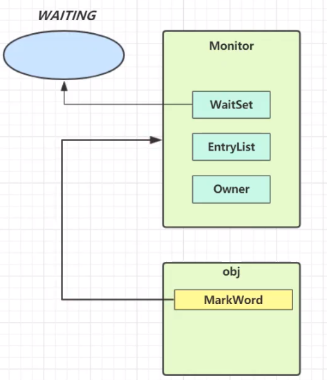
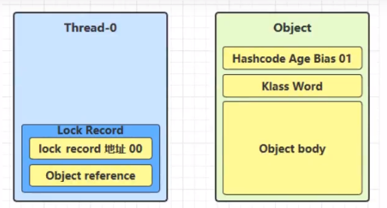

# Java对象头

一般我们new的对象，都由对象头和对象的成员属性组成

> 普通对象头结构

- 一个对象的大小
  - 此处以32位虚拟机为例-----如：一个Integer：8个字节对象头+4个字节的数据，int 只有4个字节数据

> Klass Word

存储了对象类型的指针：如：String类型， Student的类型

> Mark Word结构

- age: 垃圾回收的年龄
- biased_lock：是否是偏向锁
- 最后两位：锁状态

# Monitor对象

## 简介

- monitor是操作系统提供的对象
- 每个Java对象都可以关联一个Monitor对象，如果使用synchronized给对象上锁〈重量级)之后，该对象头的Mark Word 中就被设置指向**Monitor对象的指针**

## 结构

- monitor里面的owner属性指向抢到锁的线程
- 此时另外一个线程来抢这个锁，则monitor的的EntryList指向抢锁的线程
- 当线程执行完，将EntryList中的线程全部唤醒，继续抢锁
- waitSet:存放wait状态的线程集合

# 轻量级锁

## 使用场景

- 如果一个对象虽然有多线程访问，但多线程访问的时间是错开的（也就是没有竞争)，那么可以使用轻量级锁来优化。
- 即，线程A加锁解锁 完了以后， 线程B再加锁解锁
- 轻量级锁是没有阻塞的概念的

## 轻量级锁加锁过程

1. 当执行到加锁模块时，栈帧中生成一个锁记录的结构，内部存储锁定的对象和Mark Word

