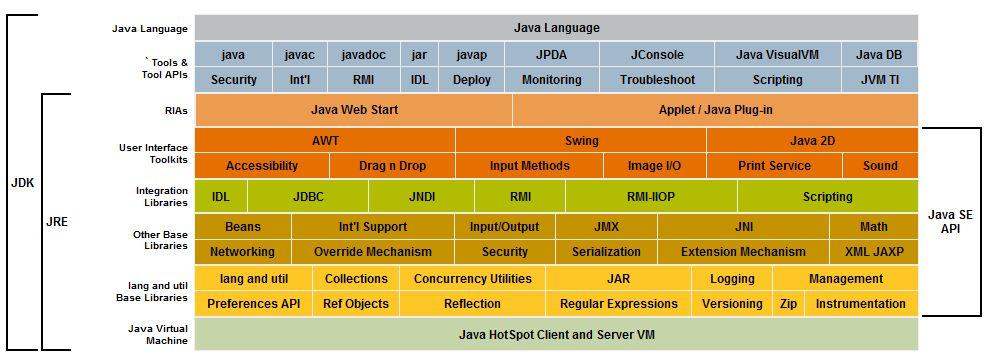

# jRE JDK关系

- JDK包含了JRE,JDK有编译器等

```
JDK(Java Development Kit)又称J2SDK(Java2 Software Development Kit)，是Java开发工具包，它提供了Java的开发环境(提供了编译器javac等工具，用于将java文件编译为class文件)和运行环境(提 供了JVM和Runtime辅助包，用于解析class文件使其得到运行)。如果你下载并安装了JDK，那么你不仅可以开发Java程序，也同时拥有了运 行Java程序的平台。JDK是整个Java的核心，包括了Java运行环境(JRE)，一堆Java工具tools.jar和Java标准类库 (rt.jar)。
```

- JRE中包含虚拟机JVM

```tex
JRE(Java Runtime Enviroment)是Java的运行环境。面向Java程序的使用者，而不是开发者。如果你仅下载并安装了JRE，那么你的系统只能运行Java程序。JRE是运行Java程序所必须环境的集合，包含JVM标准实现及 Java核心类库。它包括Java虚拟机、Java平台核心类和支持文件。它不包含开发工具(编译器、调试器等)。
```





# JVM内存结构

