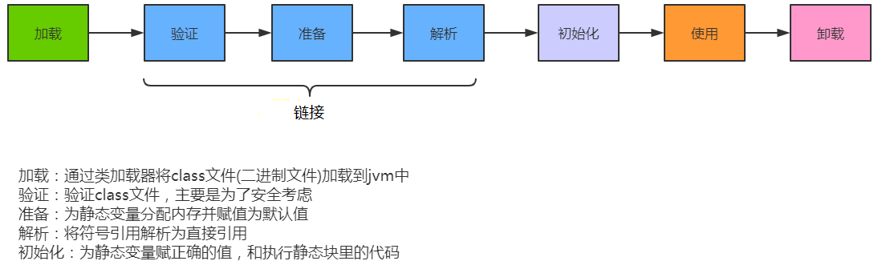
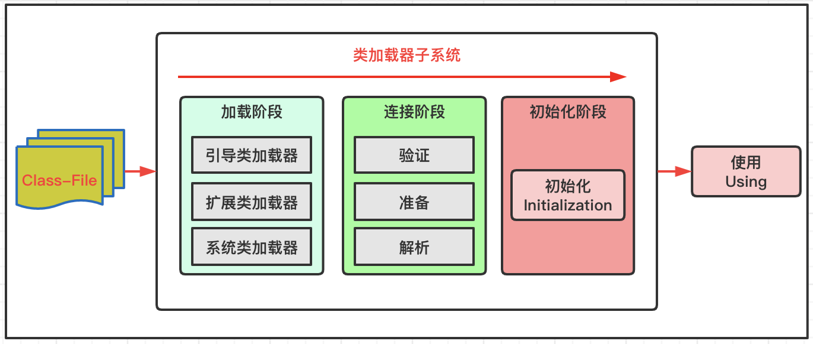
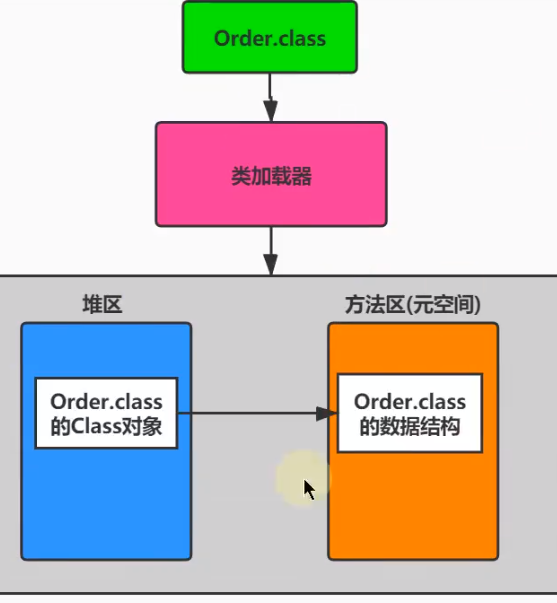

# 加载过程

- 类加载子系统只负责从文件系统加载class文件，
- 加载的类信息存在方法区的内存空间，方法区还存放运行时的常量池信息
- 类加载子系统只负责加载，能不能运行由执行引擎决定





> 细节图




# 加载class文件方式

**基本数据类型由虚拟机预先定义，引用数据类型则需要进行类的加载**

将Java类的字节码文件加载到机器内存中，并在内存中构建出]ava类的原型（类模板对象），JVM将从字节码文件中解析出的常量池、类字段、类方法等信息存储到类模板中

- 通过类的全名，获取类的二进制数据流。
  - 从文件系统读取
  - 从jar，zip等中读取
  - 网络读取
  - 运行时计算生成，如动态代理
  - 从加密文件中获取，如一些防止反编译的措施
- 解析类的二进制数据流为方法区内的数据结构（**Java类模型**)
- 创建java.lang.Class类的实例，表示该类型。作为方法区这个类的各种数据的访问入口

> 类模板

- 加载的类在VM中创建相应的类结构，类结构会存储在方法区
- 但是他的class是在堆空间的



- 例如加载string：

```java
//局部变量表存储引用指向堆中的Class实例，class实例指向方法区的String模板
Class<?> clazz = Class.forName("java.lang.String");
```

## 链接过程

> 验证

- 当类加载系统中后，开始验证，它的目的是保证加载的字节码是合法、合理并符合规范的。
  - 格式检查（其实加载阶段就开始格式检查了）：魔数检查，版本检查，长度检查(*所有的字节码起始开头都是 CA FE BA BE*)
  - 语义检查：
    - 是否所有的类都有父类的存在
    - 是否一些被定义为final的方法或者类被重写或继承了
    - 非抽象类是否实现了所有抽象方法或者接口方法
  - 字节码检查
    - 字节码执行过程是否跳转了了不存在指令
  - 符号引用验证

> 准备

- 为类的静工**变量**（不是常量）分配内存，并将其初始化为默认值。
  - 如int类型，一开始才是0
  - 为**类变量**分配内存并且设置该类的初始值
- **这里不包含基本数据类型的字段用static final修饰的情况，因为final在编译的时候就会分配了，准备阶段会显式赋值。**（没有初始化赋值这个代码执行）
- 如果使用字面量方式给String的常量赋值，也是在准备阶段**显示赋值**的