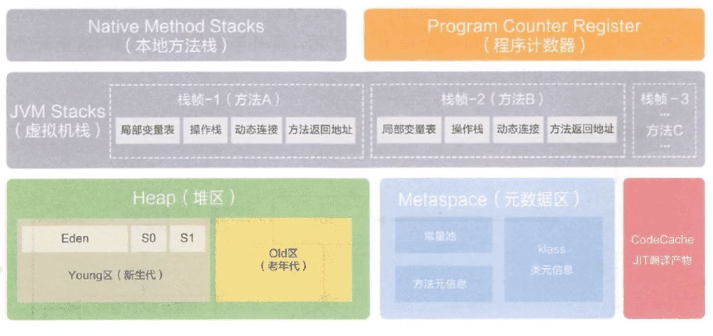
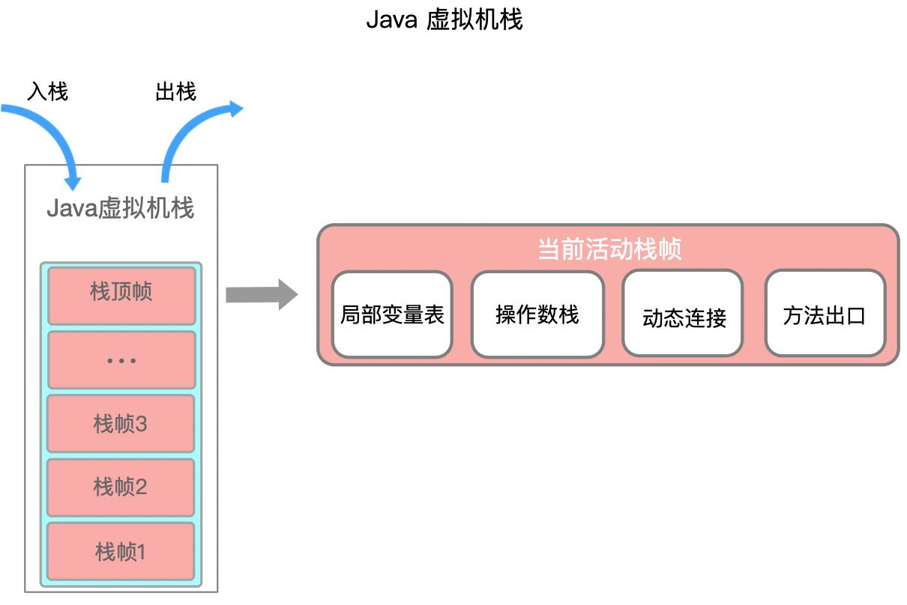
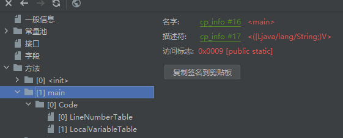
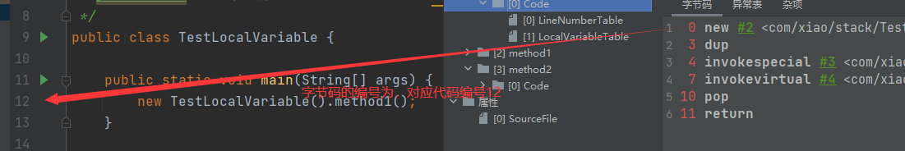
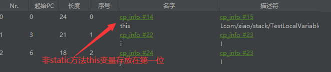
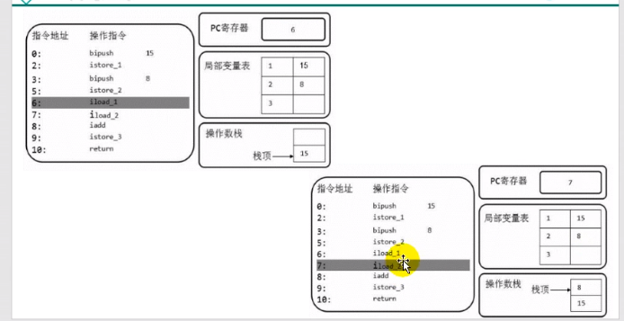
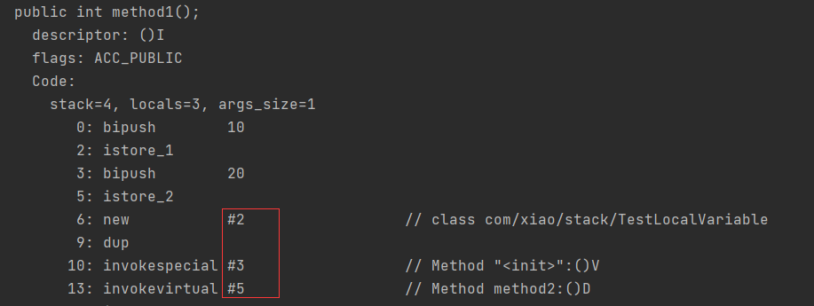
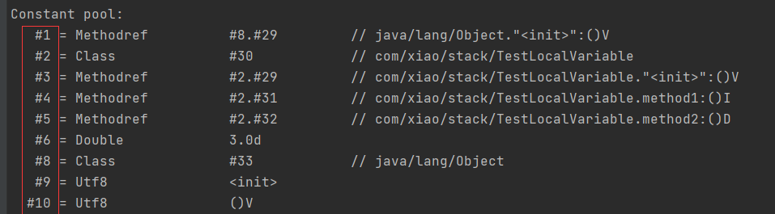
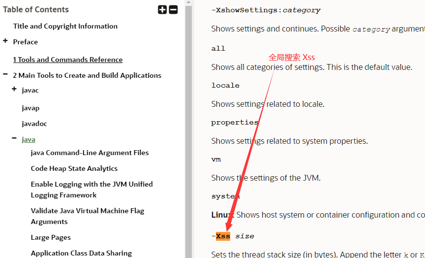

# 描述
通过类加载子系统初始化加载后，运行时的类数据保存到方法区

- 程序计数器、栈、本地栈是线程私有的
- JIT编译缓存在非堆空间




# 程序计数器

## 简介

程序计数器可以在多线程切换上下文时，保存当前线程执行的指令地址

- （PC Registery）/PC 寄存器

- 用来存储指向下一条指令的地址（代码的指令存放在栈帧当中）
- 一个很小的内存空间
- 线程私有的

## 举例

```java
public static void main(String[] args) {
    int a=10;
    int b=20;
    String c ="abc";
}
```

1. 反编译class

```shell
0 bipush 10
2 istore_1
3 bipush 20
5 istore_2
6 ldc #2 <abc>
8 astore_3
9 return
```

最左边的数字就是偏移地址（指令地址），中间的是操作指令

假如：执行到5时，PC寄存器将5存入（**程序计数器记录的是左边的序号**）

执行引擎通过PC寄存器记录的地址读取对应的操作指令，然后操作栈结构，局部变量表，实现存取计算等

将字节码指令翻译成机器指令，到cpu做计算

## 常见问题

- 为什么要使用pc寄存器记录当前线程的执行地址

cpu需要不停的切换线程，这个时候切换回来，知道它执行到哪了

- pc寄存器为什么是线程私有的

如果不是私有，那么寄存器公有，则切换线程时，是无法找到切换回来的线程下个执行的步骤的


# 虚拟机栈

## 概述

- 由栈帧组成

- 一个栈帧对应着一个方法
- 生命周期和线程一致
- 主要用于保存方法的局部变量（8种基本数据类型/引用类型地址）和部分结果和返回
- 正常的函数返回（使用return指令）或者抛出异常，都会导致栈帧被弹出

## 结构

- 当我们每执行一个方法的时候，当前执行方法的局部变量等相当于一个栈帧，执行入栈操作
- 栈帧1、2、3 相当于method1、2、3



> 栈的存储单位
>
> **一个栈能放多少个栈帧取决于栈针的大小**
1. 栈的数据是以栈帧的格式存在的
2. 每个方法对应一个栈针

> 栈帧的内部结构
1. 局部变量表
2. 操作数栈
3. 动态链接(指向运行时常量池的方法引用)
4. 方法返回地址
5. 一些附加信息

### 局部变量表

- 也称局部变量数组
- 一个数字数组（存放**8种基本数据类型、对象引用地址**）
- 在编译的时候，就确定了局部变量表的长度

```tex
在栈帧中，与性能调优关系最为密切的部分就是局部变量表。
局部变量表中的变量也是重要的垃圾回收根节点（jvm垃圾回收采用可达性分析法），
只要被局部变量表中直接或间接引用的对象都不会被回收。
```

- 一个方法开始，局部变量表会存储几个数据（**this**、形参）


> 从jclasslib看结构

看class



*linenumbertable*：

- 编译后的字节码对应的编号（start pc）与java代码的对应行号关系




*localvaribletable*：

- 局部变量相关信息
- start pc 变量起始的位置
- 长度（长度的每个index对应着字节码编号），slot存储坐标

> 基本单位

- 局部变量表最基本存储单元slot（槽）
- 32位类型占一个slot，64位占两个槽（一个字节8位）
- 局部变量安装声明顺序存储
- 如果是非static方法，this存放到0的位置（**为什么static不能使用this，因为static 的局部变量表中不存在this**）



- **局部变量表中的变量是重要的垃圾回收根节点，只要被局部变量表中直接或者间接引用的对象，就不会被回收**

```java
//java的非static方法的local
LocalVariableTable:
        Start  Length  Slot  Name   Signature
            0       4     0  this   LDataTest1;
            3       1     1     a   Ljava/lang/String;

```

> slot重复利用问题

定义一个代码

```java
public void test1(){
    int a = 1;
    {
        int b=0;
        b=a+1;
    }
    int c = a+2;
}
```

查看，发现局部变量b先使用了slot，然后c又使用了b的slot

因为b在代码块结束就销毁了，但是slot长度编译时就定义了，不能减少

```java
 Start  Length  Slot  Name   Signature
            4       4     2     b   I
            0      13     0  this   LDataTest1;
            2      11     1     a   I
           12       1     2     c   I

```


### 操作数栈

- 又称表达式栈
- 主要用于保存计算过程的中间结果或者计算过程中的变量的临时存储空间
- 当一个方法刚开始执行的时候，新的栈帧随之被创建，这个方法的操作数栈是空的

`如下示例`：

```java
public void test2() {
    byte i = 15;
    int b = 10;

    int j = i+b;
}
```

*stack*：栈深度

*locals*：局部变量表的深度

```shell
  stack=2, locals=4, args_size=1
  		## 将15入栈，
         0: bipush        15
         #弹出操作数栈栈顶元素，保存到局部变量表第1个位置
         2: istore_1
         3: bipush        10
         5: istore_2
         # 第1，2个变量从局部变量表压入操作数栈
         6: iload_1
         7: iload_2
         ## 出栈相加，放入操作数栈中
         8: iadd
         9: istore_3
        10: return

```




### 动态链接

- 栈帧中,当前使用了常量池的变量的引用

- 在字节码文件中，有个constant pool（常量池，当运行时，就会将其存储到方法区）

- 编译后，所有的变量和方法引用都作为符号引用（#开头的数字），保存到class文件的常量池中

- 当方法调用另一个方法时，就用常量池的指向方法的符号引用表示

- **作用就是将符号引用转化为直接引用**





> 方法的调用

- 静态链接
  - 如果被调用方法，在编译期间就可以确定符号引用，那么它就是静态链接

```java
public class TestBing extends TestLocalVariable {
    public TestBing() {
        //如这个super，已经确定调用父类的方法
        super();
    }
}
```

> 虚方法与非虚方法

- 非虚方法
  - 编译期就确定了调用的方法
  - 静态方法，私有方法、final方法，实例构造器，父类方法都是非虚方法
  
- 虚方法

  - 不确定调用的方法，如重写的方法
  - java因为**重写**而有了虚方法的概念

- 虚方法表
  - 因为虚方法会循环的寻找父类（如果没有重写）
  - 所以在类加载的链接阶段，建立了

## 栈常见异常

- stackoverflowerror
  - 栈如果是固定的，栈满了，就会抛出
  - 一般递归
- outofmemoryerror
  - 栈如果是动态扩展，如果去申请内存，没有内存了就会抛出

## 设置栈大小
> 查看文档

https://docs.oracle.com/en/java/javase/11/tools/tools-and-command-reference.html



> 具体命令

-Xss size （size=大小）

```shell

##举例
-Xss1m
-Xss1024k
-Xss1048576

```

# 本地方法栈

- 他是调用C相关的方法的存储
- 管理**本地方法**的调用

- native 方法，是一个java方法，但是是由非java语言实现的

## 本地方法

- 用native修饰的方法是**本地方法**

```java
public static native void yield();
public static native void sleep(long millis) throws InterruptedException;
```