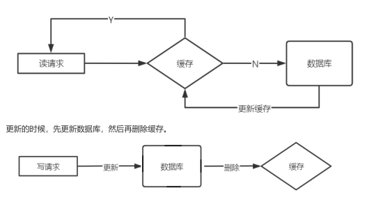
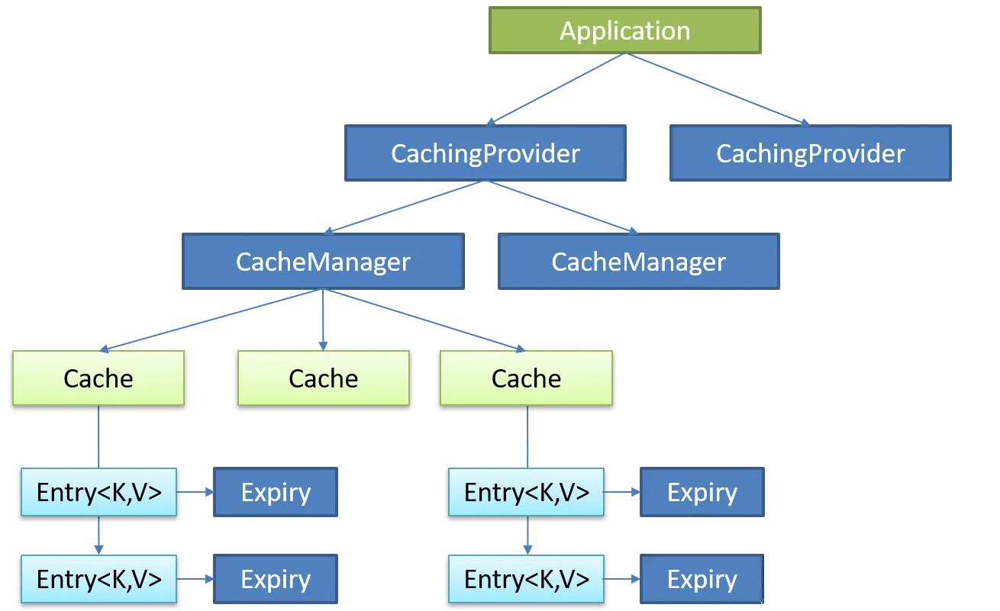
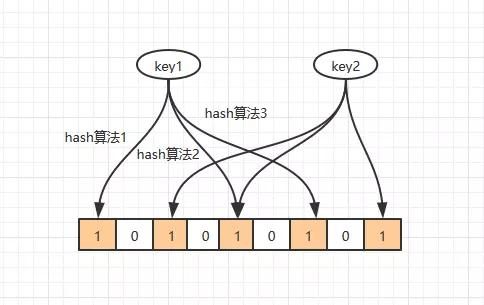

# 

# 缓存的读写模式

## 旁路缓存

是最经典的缓存+数据库读写模式

读的时候，先读缓存，缓存没有的话，就读数据库，然后取出数据后放入缓存，同时返回响应




> 为什么先删再查

1. 缓存的值是一个结构：hash、list，更新数据需要遍历

2. 懒加载，使用的时候才更新缓存
3. 如果更新了数据库，提交失败了，则还要考虑回滚缓存的数据（修改缓存这种方式）

> 延时双删


## 直读直写

应用程序只操作缓存，缓存操作数据库。
Read-Through（穿透读模式/直读模式）：应用程序读缓存，缓存没有，由缓存回源到数据库，并写入
缓存。（guavacache）
Write-Through（穿透写模式/直写模式）：应用程序写缓存，缓存写数据库。（很复杂）


## 缓存以后再更

应用程序只更新缓存。
缓存通过异步的方式将数据批量或合并后更新到DB中
不能时时同步，甚至会丢数据

# 常用缓存淘汰算法

## FIFO:先进先出

> **如果一个数据最先进入缓存，则应该最早淘汰掉**


## LRU:最不常用数据

1. 判断数据最近使用的时间，时间最远的数据优先被淘汰掉

2. 查询和删除应该都说O(1)；*采用 hash + 双向链表的结构*
   1. 查询的时候，通过hash查询到指定的key对应的值
   2. 删除的时候，删除队列里头部数据，同时删除hash里的值

> 为什么使用双向链表？

1. 在添加数据时候，如果遇到重复数据，需要将链表中的数据删除，然后将当前数据入队（放入队列）

   1. 删除数据：这里应用时间复杂度O（1）

      ```java
      node.prev.next = node.next;
      node.next.prev = node.prev;
      ```

> 为什么使用hash

在查询数据的时候，时间复杂度能够达到O（1）

## LFU:最近最少使用

> **一段时间内，数据被使用的次数最少，优先被淘汰**


# 缓存技术选型

1、凌晨突然涌入的巨大流量。【队列削峰】【限流】
2、高并发场景秒杀、抢红包、抢优惠券，快速存取。【缓存】
3、高并发场景超卖、超额抢红包。
4、高并发场景重复抢单。【缓存解决】  


# 缓存应用

> Memcached 

优点：高性能读写，单一的数据类型（key【String】-value【Object】），支持客户端式分布式集群，多线程读写性能
高。
缺点：无持久化，服务端无法实现集群，跨机房数据同步困难，架构扩容复杂度高，不适合处理大规模数据量  

> Redis 

优点：高性能读写，多数据类型支持，数据持久化，高可用架构，支持分布式分片集群，单线程读写性能极高（6.x版本支持
多线程）。
缺点：多线程读写较Mencached慢，不适合处理大规模数据量。  

> Tair

优点：高性能读写，支持三种存储引擎（ddb/rdb/ldb），支持高可用，支持分布式分片集群，支撑了几乎所有淘宝业务的
缓存。
缺点：单机情况下，读写性能较上两种较慢，适合处理大规模数据缓存。  

# JSR107缓存规范

> Java Caching定义了5个核心接口，分别是CachingProvider,CacheManager, Cache, Entry 和 Expiry

*CachingProvider*：定义了创建、配置、获取、管理和控制多个CacheManager。一个应用可以在运行期访问多个CachingProvider
*CacheManager*：定义了创建、配置、获取、管理和控制多个唯一命名的Cache，这些Cache存在于CacheManager的上下文中。一个CacheManager仅被一个CachingProvider拥有。
*Cache*：类似Map的数据结构并临时存储以key为索引的值。一个Cache仅被一个CacheManager所拥有
*Entry*：是一个存储在Cache中的key-value对
*Expiry*：每一个存储在Cache中的条目有一个定义的有效期。一旦超过这个时间，条目为过期的状态。一旦过期，条目将不可访问、更新和删除。缓存有效期可以通过ExpiryPolicy设置




# 常见的缓存方案

## 本地缓存方案

1. 常用于万年不变的数据
   1. 比如：一些配置选项等数据，可以通过配置文件的方式，直接通过容器初始化的时候加载到内存中（caffie或者map）
2. 数据不是很重要的数据
   1. 比如：允许短时间内，各个容器节点短暂的不一致
3. 变化很少的数据，但访问很高
   1. 比如：商品的信息，一个商品一旦设置，基本很少更改，则可以使用j2cache的方式、

## 异步缓存的方案

这种缓存方案即：查询永远不会查询到DB，只会查询到缓存这一级别，通过异步的方式将数据刷入到缓存中

常用的方案

1. 使用消息中间件的方式，将新增/修改的数据刷入到缓存中
2. 使用定时器的方式，刷入到缓存中
   1. 缺点：这种方式，可能需要全量的扫描db数据，进行缓存的刷新

异步方案的缺点：

1. 数据到缓存是有延迟的，也就是说延迟这段时间，查询到的数据是旧版本的数据
2. 这种缓存，要考虑缓存的过期时间，如果说，永久不过期，则要考虑这个数据是否后期真的会有用到，否则，缓存会越来越大，最终触发redis的LRU

## 懒加载的方案

即：需要查询的时候，先查询缓存，缓存没有，则前往数据库查询，查询到再放入缓存中

缺点：

1. 可能会出现缓存穿透/击穿/雪崩等常见的缓存问题（技术上可解决）


# 缓存常见问题

## 缓存穿透

> 概念

一般的缓存系统，都是按照key去缓存查询，如果不存在对应的value，就应该去后端系统查找（比如DB）。一些恶意的请求会故意查询不存在的key,请求量很大，就会对后端系统造成很大的压力。这就叫做缓存穿透。

**恶意请求数据库不存在的数据**

> 如何避免

1. 对查询结果为空的情况也进行缓存，缓存时间设置短一点，如（key-null）
2. 使用布隆过滤器: `在gateway中判断，当前地址请求的商品存不存在，不存在，就不去请求后端的微服务了`

## 缓存雪崩

> 概念

当缓存服务器重启或者大量缓存集中在某一个时间段失效，这样在失效的时候，会给后端系统带来很大压力。导致系统崩溃。

**大量的缓存突然失效**

> 如何避免

1. 不同的key，设置不同的过期时间，让缓存失效的时间点尽量均匀
2. 在缓存失效后，通过加锁或者队列来控制读数据库写缓存的线程数量。比如对某个key只允许一个线程查询数据和写缓存，其他线程等待。

## 缓存击穿

> 概念

如果你的应用中有一些**访问量很高的热点数据**，我们一般会将其放在缓存中以提高访问速度。

另外，为了保持时效性，我们通常还会设置一个过期时间。但是对于这些访问量很高的KEY，我们需要考虑一个问题：当热点KEY在失效的瞬间，海量的请求会不会产生大量的数据库请求，从而导致数据库崩溃？

**某一个热点key失效，直接查询了数据库**

> 解决方案

1. 互斥锁,互斥锁指的是在缓存KEY过期去更新的时候，先让程序去获取锁，只有获取到锁的线程才有资格去更新缓存KEY。（也可以分布式的锁，抢到锁的去更新缓存，没有抢到的先阻塞一下，等待缓存更新完毕）。这个查询DB的并发只有一个，其他的都查询缓存了
2. 永远不过期。（不太好）
3. 使用定时器定时刷新缓存，防止缓存过期
4. **队列术**操作：将请求放入队列中，第一个请求去缓存中查，如果没有，则第一个请求去后端查，其余请求查询缓存

# 布隆过滤器

`布隆过滤器可以判断这个值存不存在`

1. 布隆过滤器由一个二进制的数组组成
2. 当一个字符串，通过hash计算当前字符串的坐标，则将当前坐标至1



如：key，通过三个hash算法，计算了三个位置，下次key再来时，发现这三个1就会判断当前这个值存在

3. 布隆会有误差问题：因为不同的值，hash的坐标可能是相同的

> 解决缓存穿透问题

当数据库查询这个值不存在时候，直接将当前key放入布隆过滤器中

如果下次这个key还来查询，直接不查数据库，通过布隆过滤器进行返回（redisson里有直接封装好的）


## 使用场景

1. 网页爬虫对URL的去重，避免爬取相同的URL地址（在爬取网页时，先再过滤器中判断是否存在，如果存在就不去爬取网站了）
2. 反垃圾邮件，从数十亿个垃圾邮件列表中判断某邮箱是否垃圾邮箱  
3. 缓存穿透

## 缺陷

1. 代码复杂度增大
2. 需要另外维护一个集合来存放缓存的Key
3. 布隆过滤器不支持**删值**操作  
