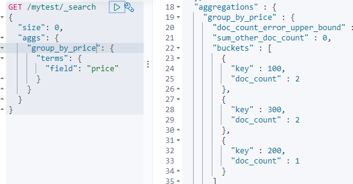
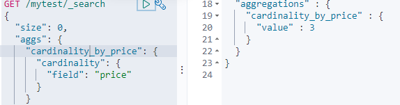
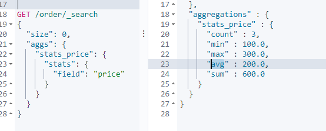
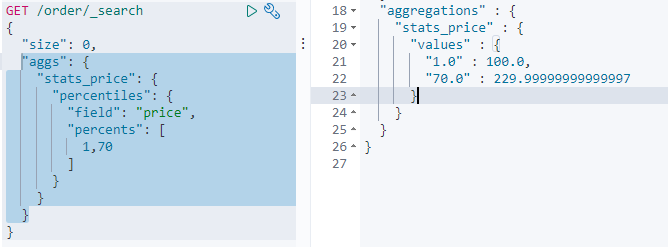

# 功能

- 分布式的搜索引擎

如：百度等

- 全文检索，结构化检索
  - 文章的关键字检索
  - 电商的分类查询

# 核心概念

- Document&field

文档，es中的最小数据单元，一个document可以是一条客户数据，一条商品分类数据，一条订单数据，通常用JSON数据结构表示

- type

每个索引都有多个或者一个type，一个type下的document，有着相同的字段

- index:索引

包含一堆有相似结构文档的数据，如：订单索引

| es       | 数据库 |
| -------- | ------ |
| document | 行     |
| type     | 表     |
| index    | 数据库 |

- share

如果一个index有3t的数据，它把他分为三份，每一个share存1t，这样，查询就增加了速度

share是最小的工作单元

每个share其实就是一个Lucene实例

share分为primary share和replica share，每个document只能存在于某个primary share以及对应的replica share中

- replica share

其实就是share的一个副本

优点：查询的时候，也可以查到replica上面

​			share挂了，可以让replica顶上

**share不能和replica同一个服务器，所以es一般两个服务器以上**

- master

master 选举，将一个node变为master

新master间隔primary share的replica 变为primary

# 特性

- 对复杂的分布式机制的透明隐藏特性
  - 我们不需要考虑数据怎么进行分片，数据分配到了哪个shard占用，
  - 集群可以自己发现node
  - shard复杂均衡

- 垂直扩容和水平扩容，扩容对应用程序透明
  - 垂直扩容：购置强大的服务器，将新的服务器代替老服务器
  - 水平扩容：购置服务器，加入老的集群之中
- 增加或者减少节点，会自动将数据平衡
- master节点
  - 创建、删除索引；增加删除节点
  - 默认自动选择一台节点作为master
- 节点平等的分布式架构
  - 每个节点都可以接受所有请求
  - 可能请求a share，但a可以发给b，让b给数据给a，最后返回

# 安装

## 安装ES

国内镜像

<https://thans.cn/mirror/elasticsearch.html>

### 文件目录

- config
  - log4j2 日志文件
  - jvm 
  - elasticsearch.yml 配置文文件

修改配置文件

```yaml
## 集群名字，同一个集群必须相等
cluster.name: myes
## 当前节点名字
node.name: node-1
cluster.initial_master_nodes: ["node-1"]
network.host: 192.168.1.131

## 解决跨域问题
http.cors.enabled: true
http.cors.allow-origin: "*"
```

可能需要修改

**注：这一步是为了防止启动容器时，报出如下错误：bootstrap checks failed max virtual memory areas vm.max_map_count [65530] likely too low, increase to at least [262144]**

```shell
[root@localhost ~]# vim /etc/security/limits.conf
myes soft nofile 65536
myes hard nofile 100000
[root@localhost ~]# vim /etc/sysctl.conf 
vm.max_map_count=655360
##执行让其生效
[root@localhost ~]#sysctl -p
```


```shell
#建立myes用户，es要非root用户启动
[root@localhost home]# adduser myes
[root@localhost home]# passwd myes

[root@localhost home]# chown -R myes:myes elasticsearch-7.3.2
#进入myes启动
[root@localhost home]# su myes
[myes@localhost home]$ ./elasticsearch-7.3.2/bin/elasticsearch
```

访问<http://192.168.1.131:9200/>

### elasticsearch-.yml详解

- 6.x

```yaml
# ======================== Elasticsearch Configuration =========================
#
# NOTE: Elasticsearch comes with reasonable defaults for most settings.
# Before you set out to tweak and tune the configuration, make sure you
# understand what are you trying to accomplish and the consequences.
#
# The primary way of configuring a node is via this file. This template lists
# the most important settings you may want to configure for a production cluster.
#
# Please see the documentation for further information on configuration options:
# <http://www.elastic.co/guide/en/elasticsearch/reference/current/setup-configuration.html>
#
# ---------------------------------- Cluster -----------------------------------
#
# Use a descriptive name for your cluster:
# 集群名称，默认是elasticsearch
# cluster.name: my-application
#
# ------------------------------------ Node ------------------------------------
#
# Use a descriptive name for the node:
# 节点名称，默认从elasticsearch-2.4.3/lib/elasticsearch-2.4.3.jar!config/names.txt中随机选择一个名称
# node.name: node-1
#
# Add custom attributes to the node:
#
# node.rack: r1
#
# ----------------------------------- Paths ------------------------------------
#
# Path to directory where to store the data (separate multiple locations by comma):
# 可以指定es的数据存储目录，默认存储在es_home/data目录下
# path.data: /path/to/data
#
# Path to log files:
# 可以指定es的日志存储目录，默认存储在es_home/logs目录下
# path.logs: /path/to/logs
#
# ----------------------------------- Memory -----------------------------------
#
# Lock the memory on startup:
# 锁定物理内存地址，防止elasticsearch内存被交换出去,也就是避免es使用swap交换分区
# bootstrap.memory_lock: true
#
#
#
# 确保ES_HEAP_SIZE参数设置为系统可用内存的一半左右
# Make sure that the `ES_HEAP_SIZE` environment variable is set to about half the memory
# available on the system and that the owner of the process is allowed to use this limit.
#
# 当系统进行内存交换的时候，es的性能很差
# Elasticsearch performs poorly when the system is swapping the memory.
#
# ---------------------------------- Network -----------------------------------
#
#
# 为es设置ip绑定，默认是127.0.0.1，也就是默认只能通过127.0.0.1 或者localhost才能访问
# es1.x版本默认绑定的是0.0.0.0 所以不需要配置，但是es2.x版本默认绑定的是127.0.0.1，需要配置
# Set the bind address to a specific IP (IPv4 or IPv6):
#
# network.host: 192.168.0.1
#
#
# 为es设置自定义端口，默认是9200
# 注意：在同一个服务器中启动多个es节点的话，默认监听的端口号会自动加1：例如：9200，9201，9202...
# Set a custom port for HTTP:
#
# http.port: 9200
#
# For more information, see the documentation at:
# <http://www.elastic.co/guide/en/elasticsearch/reference/current/modules-network.html>
#
# --------------------------------- Discovery ----------------------------------
#
# 当启动新节点时，通过这个ip列表进行节点发现，组建集群
# 默认节点列表：
# 127.0.0.1，表示ipv4的回环地址。
# [::1]，表示ipv6的回环地址
#
# 在es1.x中默认使用的是组播(multicast)协议，默认会自动发现同一网段的es节点组建集群，
# 在es2.x中默认使用的是单播(unicast)协议，想要组建集群的话就需要在这指定要发现的节点信息了。
# 注意：如果是发现其他服务器中的es服务，可以不指定端口[默认9300]，如果是发现同一个服务器中的es服务，就需要指定端口了。
# Pass an initial list of hosts to perform discovery when new node is started:
#
# The default list of hosts is ["127.0.0.1", "[::1]"]
#
# discovery.zen.ping.unicast.hosts: ["host1", "host2"]
#
#
#
#
# 通过配置这个参数来防止集群脑裂现象 (集群总节点数量/2)+1
# Prevent the "split brain" by configuring the majority of nodes (total number of nodes / 2 + 1):
#
# discovery.zen.minimum_master_nodes: 3
#
# For more information, see the documentation at:
# <http://www.elastic.co/guide/en/elasticsearch/reference/current/modules-discovery.html>
#
# ---------------------------------- Gateway -----------------------------------
#
# Block initial recovery after a full cluster restart until N nodes are started:
# 一个集群中的N个节点启动后,才允许进行数据恢复处理，默认是1
# gateway.recover_after_nodes: 3
#
# For more information, see the documentation at:
# <http://www.elastic.co/guide/en/elasticsearch/reference/current/modules-gateway.html>
#
# ---------------------------------- Various -----------------------------------
# 在一台服务器上禁止启动多个es服务
# Disable starting multiple nodes on a single system:
#
# node.max_local_storage_nodes: 1
#
# 设置是否可以通过正则或者_all删除或者关闭索引库，默认true表示必须需要显式指定索引库名称
# 生产环境建议设置为true，删除索引库的时候必须显式指定，否则可能会误删索引库中的索引库。
# Require explicit names when deleting indices:
#
# action.destructive_requires_name: true
```

- 7.x

```yaml
cluster.name: elasticsearch-cluster
node.name: es-node3
network.bind_host: 0.0.0.0
network.publish_host: 192.168.1.134
http.port: 9202
#内部节点通信端口
transport.tcp.port: 9302
#跨域
http.cors.enabled: true
http.cors.allow-origin: "*"
#集群节点
discovery.seed_hosts: ["192.168.1.134:9300","192.168.1.134:9301", "192.168.1.134:9302"]
#有资格成为主节点的节点配置
cluster.initial_master_nodes: ["es-node1","es-node2","es-node3"]

```


## 安装Kibana

国内镜像

<https://www.newbe.pro/Mirrors/Mirrors-Kibana/#toc-heading-1>

修改配置文件

```shell
[root@localhost ~]# vim /home/kibana-7.3.2/config/kibana.yml 
```

```yaml
server.host: "192.168.1.131"
elasticsearch.hosts: ["http://192.168.1.131:9200"]
#语音为中文
i18n.locale: "zh-CN"
```

启动

```shell
myes@localhost home]$ ./kibana-7.3.2/bin/kibana
```

访问dev_tool

<http://192.168.1.131:5601/app/kibana#/dev_tools/console?_g=()>

## 可视化HEAD


## 横向扩容

扩容之后，当个节点的share变少，性能变得更好

---

如果只有6个share（三个primary， 三个replica），怎么突破瓶颈（极限：有多少个share，就多少个机器），增加到9台机器

增加replica share，因为primary share是不能变得， 如：replica=2,

---


# 索引

```shell
# 查看所有索引相关信息
GET /_cat/indices?v

# 查看索引数量
GET table_4182d99ae22f4c55a487d886d71f42df/_count
## 查看索引前十条了解索引结构
POST table_4182d99ae22f4c55a487d886d71f42df/_search
{
}
```


# 简单的CRUD

**在7.X后，官方废弃type,默认type为_doc**

故：
ES 的Type 被废弃后，库表合一，Index 既可以被认为对应 MySQL 的 Database，也可以认为对应 table。

## 简单的集群管理

- 快速检查进群的健康状态

```
GET /_cat/health?v
```

- 查看集群index

```
GET /_cat/indices?v
```

## 新增操作

- 这种操作是幂等的

```
PUT /index/type/documentid
{
	json 数据
}
```

新增一条数据
```shell
PUT /order/product/1
{
  "name":"iphone",
  "price":"3000",
  "desc": "Simple to use and cheap to use"
}
```

- post方式， 不指定documentid 新增(采用GUID算法生成)

```shell
POST /order/product/
{
  "name":"phone",
  "price":"2000",
  "ooprice":2000,
  "desc": "Simple to use and cheap to use"
}
```

- PUT 和POST用法

```
PUT是幂等方法，POST不是。
– PUT，DELETE操作是幂等的。所谓幂等是指不管进行多少次操作，结果都一样。比如我用PUT修改一篇文章，然后在做同样的操作，每次操作后的结果并没有不同，DELETE也是一样。
– POST操作不是幂等的，比如常见的POST重复加载问题：当我们多次发出同样的POST请求后，其结果是创建出了若干的资源。
– 还有一点需要注意的就是，创建操作可以使用POST，也可以使用PUT，区别在于POST是作用在一个集合资源之上的（/articles），而PUT操作是作用在一个具体资源之上的（/articles/123），比如说很多资源使用数据库自增主键作为标识信息，而创建的资源的标识信息到底是什么只能由服务端提供，这个时候就必须使用POST。
```

## 修改操作

- 替换的方式

这有一点不好，就是需要将所有字段都带上

```
PUT /order/product/1
{
  "name":"iphone",
  "price":"4000",
  "desc": "Simple to use and cheap to use"
}
```

返回

```json
"_index" : "order",
"_type" : "product",
"_id" : "5", //可以不手动设置，es会自动设置
```

- 修改的方式（post）

```
POST /order/product/1/_update
{
  "doc":{
    "name":"huawei iphone"
  }
}
```

## 查询

```
GET /order/product/1
```

## 删除

不是物理删除，只是标记，如果数据越来越多，则会后台自动物理删除

```shell
DELETE /order/product/1
```

- 带查询方式的删除

```json
POST /sys_org_company/_delete_by_query
{
   "query": {
        "match_all": {
        }
    }
}
```


# 结构化查询

## 基本知识

> 结构化查询（Query DSL）  

query的时候，会先比较查询条件，然后计算分值，最后返回文档结果  

```json
GET /test_index/test_type/_search?scroll=1m
{
  "query": {
    "match_all": {}
  }
}
```

> 结构化过滤（Filter DSL）  

过滤器，对查询结果进行缓存，不会计算相关度，避免计算分值，执行速度非常快  

```json
GET /order/product/_search
{
  "query":{
    "bool": {
      "must": [
        {"match":{"name": "iphone"}}
      ],
      "filter": [
      {"range":{"price":{"gt":"3000"}}}  
      ]
    }
  }
```

## 结构化过滤（Filter DSL）  

> term 过滤  

term 主要用于精确匹配哪些值，比如数字，日期，布尔值或 not_analyzed 的字符串（未经分析的文本数据类型），相当于sql age=26  

```json
{ "term": { "age": 26 }}
{ "term": { "date": "2014-09-01" }}
```

> terms 过滤  

terms 允许指定多个匹配条件。如果某个字段指定了多个值，那么文档需要一起去做匹配。相当于sql： age in  

```json
{"terms": {"age": [26, 27, 28]}}
```

> range 过滤  

range 过滤允许我们按照指定范围查找一批数据 

```json
{
    "range": {
        "price": {
            "gte": 2000,
            "lte": 3000
            }
        }
    }
}
```

> exists 和 missing 过滤  

exists 和 missing 过滤可以用于查找文档中是否包含指定字段或没有某个字段  

```json
{
	"exists": {
    	"field": "title"
    }
}
```

> bool 过滤  

用来合并多个过滤条件查询结果的布尔逻辑：

1. must：多个查询条件的完全匹配，相当于 and。

2. must_not： 多个查询条件的相反匹配，相当于 not；

3. should：至少有一个查询条件匹配，相当于 or；

   相当于sql and 和or  

```json
{
    "bool": {
        "must": { "term": { "folder": "inbox" }},
        "must_not": { "term": { "tag": "spam" }},
        "should": [
                { "term": { "starred": true }},
                { "term": { "unread": true }}
            ]
    }
}
```

## 结构化查询（Query DSL）  


# 多重查询方式

## search

- 查询全部

```shell
GET /order/product/_search
```

返回参数解释

took： 消耗时间

timed_out:是否超时

hits.total : 查询结果数量

hits.max_score: 相关度匹配

- 查询全部(带查询条件)

```shell
GET /order/product/_search?q=name:iphone
关键字必须包含
GET /order/product/_search?q=name:+iphone
关键字必须不包含
GET /order/product/_search?q=name:-iphone
任意的字段都包含关键字
GET /order/product/_search?q=iphone
```

- 默认的情况下是没有timeout的，所以如果查询时间慢，那么会一直等待，timeout机制，指定每个shard，在指定的时间内，返回搜索到的数据

```json
GET /_search?timeout=10m
```


## query DSL

就是将条件放入body中

- 查询全部

```
GET /order/product/_search?ignore_unavailable=true
{
  "query":{
    "match_all": {}
  }
}
```

- 带条件查询

```json
GET /order/product/_search
{
  "query":{
    "match": {
      "name":"iphone"
    }
  }
}
```

- 查指定字段
  - 只包含name，price两个字段
  - source指定查询的字段

```json
GET /order/product/_search
{
  "query":{
    "match": {
      "name":"iphone"
    }
  },
  "_source":["name", "price"]
}
```

- 范围查询

```json
GET /order/_search
{
  "query": {
    "range": {
      "ooprice": {
        "gte": 1000,
        "lte": 2000
      }
    }
  }
}
```

### 分页

- 从0开始，一页2条

```
GET /order/product/_search
{
  "query":{
    "match_all": {}
  },
  "from": 0,
  "size": 2
}
```


## query filter

- 多个组合条件搜索

must:必须满足

should：里面有一个条件满足就可以

filter： 过滤要求

filter只会过滤数据，不会计算相关度，所以，性能要高些

```shell
GET /order/product/_search
{
  "query":{
    "bool": {
      "must": [
        {"match":{"name": "iphone"}}
      ],
      "filter": [
      {"range":{"price":{"gt":"3000"}}}  
      ]
    }
  }
}
```

### 全文检索

他会将搜索的词进行拆分，然后在进行匹配

当然，如果想一个字段多个条件，也可以用空格隔开，只要有一个结果，就会被查出来

```shell
GET /order/product/_search
{
  "query":{
    "match": {
      "desc":"simple use"
    }
  }
}
```

### phrase query（短语检索）

搜索的词不会进行拆分,并且对desc字段进行高亮

```json
GET /order/product/_search
{
  "query":{
    "match_phrase": {
      "desc":"simple"
    }
  },
  "highlight":{
    "fields": {
      "desc": {}
    }
  }
}
```

### 字段不分词

**term**表示字段不能进行分词，一定要全部匹配

```json
GET /order/_search
{
  "query": {
    "term": {
      "desc": {
        "value": "Simple to use"
      }
    }
  }
}
```

## 不合法查询定位

```json
GET /order/_search?explain
{
  "query": {
    "range1": {
      "ooprice": {
        "gte": 1000,
        "lte": 2000
      }
    }
  }
}
```

### 排序

在使用 ElasticSearch 的时候，如果索引中的字段是 text 类型，针对该字段聚合、排序和查询的时候常会出现 `Fielddata is disabled on text fields by default. Set fielddata=true` 的错误

所以一般排序字段，不使用text类型

```json
POST index/_search
{
  "sort": [
    {
      "field": {
        "order": "desc"
      }
    }
  ]
}
```


# 聚合查询

## 聚合的概念

```text
Metric(指标)：指标分析类型，如计算最大值、最小值、平均值等（对桶内的文档进行聚合分析的操作）
Bucket(桶)：分桶类型，类似sql中的group by语法（满足特定条件的文档的集合）
Pipeline(管道)：管道分析类型，基于上一级的聚合分析结果进行再分析
Matrix(矩阵)：矩阵分析类型（聚合是一种面向数值型的聚合，用于计算一组文档字段中的统计信息）
```

### 指标（Metric）

- Metric聚合分析分为单值分析和多值分析两类

```text
#1、单值分析，只输出一个分析结果
min, max, avg, sum, cardinality

#2、多值分析，输出多个分析结果
stats, extended_stats, percentile_rank, top hits
```

### 基本语法

- 常见报错
  - 执行完后会报错： Set fielddata=true on [price]，是因为**默认es不支持对text字段聚合** ，这个时候，我们需要修改这个字段的属性

```json
PUT /order/_mapping
{
  "properties":{
    "price":{
      "type":"text",
      "fielddata":true
    }
  }
}
```

### 分组聚合

- 按照价格分组查询每个价格的数量

group_by_price:给聚合起个名字

size：指定size的个数，默认为10，即返回10条聚合查询结果，**这里size=0表示普通查询的字段不显示出来**

结果按照聚合信息返回price的数量



- 查询出不同价格种类的数量



- **stats 关键字**: 统计，请求后会直接显示各种聚合结果



- **Percentiles 关键字**: 对指定字段的值按从小到大累计每个值对应的文档数的占比，返回指定占比比例对应的值，默认按照[1,5,25,50,75,95,99]来统计



### 嵌套聚合

- 先分组，再计算查询平均值

先按照name分组，然后在按照ooprice进行算平均值，然后在按照平均值进行排序

```json
GET /order/product/_search
{
  "size": 0,
  "aggs":{
    "group_by_price":{
      "terms": {
        "field": "name",
        "order": {
          "avg_price": "desc"
        }
      },
      "aggs": {
        "avg_price": {
          "avg": {
            "field": "ooprice"
          }
        }
      }
    }
  }
}
```

## 批量查询

### 多个index查询

```json
GET /_mget
{
  "docs":[
    {"_index": "order", "_type": "product", "_id": "1"}
  ]
}
```

### 同一个index查询

```json
GET /order/_mget
{
  "docs":[
    {"_type": "product", "_id": "1"}
  ]
}
```

## Search查询

| 语法                       | 描述                      |
| -------------------------- | ------------------------- |
| GET /_search               | 查询所有index             |
| GET /index1,index2/_search | 查询index1, index2的index |
| GET /index*/_search        | 查询index开头的           |

- 忽略错误索引，查询两个索引，一个不存在则忽略
- ignore_unavailable=true表示不存在的索引会忽略

```json
POST /test_index,404_index/_search?ignore_unavailable=true
{
    "profile": true,
    "query": {
        "match_all": {}
    }
}
```

## 嵌套查询

https://blog.csdn.net/weixin_40341116/article/details/80778599

## 如何定制排序

默认情况下，是按照score排序的

sort可以定制查询

```shell
GET /order/_search?explain
{
  "query": {
    "match": {
      "desc": "use"
    }
  }
  , "sort": [
    {
      "_id": {
        "order": "desc"
      }
    }
  ]
}
```

## 对已经分词的字符串排序

默认情况下，排序会按照分词后的某个词来排序

如果我们想安装完整的字符串排序，可以建立两个field，一个分词用来搜索，一个不分词用来排序

建立：

"fields": {
            "raw": {
              "type": "string",
              "index": "not_analyzed"
            }
          },
          "fielddata": true

来进行不分词

```json
PUT /website 
{
  "mappings": {
    "article": {
      "properties": {
        "title": {
          "type": "text",
          "fields": {
            "raw": {
              "type": "string",
              "index": "not_analyzed"
            }
          },
          "fielddata": true
        },
        "content": {
          "type": "text"
        },
        "post_date": {
          "type": "date"
        },
        "author_id": {
          "type": "long"
        }
      }
    }
  }
}
```

查询的时候

```json
GET /website/article/_search
{
  "query": {
    "match_all": {}
  },
  "sort": [
    {
      "title.raw": {
        "order": "desc"
      }
    }
  ]
}

```

## bouncing results问题

## 使用scoll滚动查询大量数据

使用scoll搜索一批又一批数据

```
GET /test_index/test_type/_search?scroll=1m
{
  "query": {
    "match_all": {}
  },
  "sort": [ "_doc" ],
  "size": 3
}
```

第二次搜去带scorell_id

```json
GET /_search/scroll
{
    "scroll": "1m", 
    "scroll_id" : ""
}
```

## 高亮查询

- 通过对查询的字段加对应的标签，来进行前端的高亮

```json
GET /sys_org_company/_search
{
  "query": {
    "bool": {
      "must": [
        {"match": {
          "companyName": "腾讯"
        }}
      ]
    }
  },
  "highlight": {
    "fields": {
      "companyName": {"pre_tags": "<tag>", "post_tags": "</tag>"}
    }
  }
}
```

## 通过http请求查询


# 批量增删改

1）delete:删除，只需要一个json串

2）create 相当于put  /_create， 强制创建

3）index 相当于put， 可创建可全量替换

4)  update 相当于 partial update， 修改

**除了delete，其他语法必须两个json串**

{“action”: {metadata}}

{data}

**bulk api 每个json串不能换行，但json串和json串之间，必须换行**,执行过程，有一个报错，不影响其他执行

```json
POST /_bulk
{"delete":{"_index" : "order","_type" : "product","_id" : "1"}}
{"create":{"_index" : "order_test","_type" : "product","_id" : "1"}}
{"name":"test_create_bulk"}
```


# ES REST风格总结

| method | URL                    | DESC                            |
| ------ | ---------------------- | ------------------------------- |
| PUT    | /index/type/id         | 创建文档（指定文档id）/替换文档 |
| POST   | /index/type            | 创建文档（随机文档id）          |
| POST   | /index/type/id/_update | 修改文档（修改某个字段）        |
| POST   | /index/type/_search    | 查询所有数据                    |
| DELETE | /index/type/id         | s删除                           |
| GET    | /index/type/id         | c查询                           |


# 并发处理方案

ES中用的是乐观锁并发方案

每次修改，ES都会去修改_version

如果A线程操作数据，version=1，回写数据后version=2

B线程修改数据，version=1，回写数据发现version不相等，则会将这条数据扔掉，不会让后修改的数据覆盖


## 乐观锁

A线程操作数据，A拿到vesion1的数据，B线程拿到的也是vesion1的数据

A线程修改数据后，判断库中vesion与自己拿到的数据是否一致，如果一致则回写成功，数据vesion+1

B线程修改数据，回写发现vesion不一致，重新读取数据，再次操作，判断版本号，进行回写

## 悲观锁

A线程操作数据，其他线程无法获取数据，其他线程阻塞，直到A线程操作完并且将数据回写之后

## ES乐观锁处理

- 手动处理

如果执行失败，则我们需要去重新获取version,再次执行，_version=1时，修改才能成功

```json
PUT /order/product/4?version=1
```

- 只有当你提供的version比es中的_version大的时候，才能完成修改

```json
?version=1&version_type=external
```

- partial update会内置乐观锁,下面的语句表示乐观锁重试5次

```json
post、index/type/id/_update?retry_on_conflict=5
```

## ES写一致性原理

consistency，one（primary shard），all（all shard），quorum（default）

- 我们在发送任何一个增删改操作的时候，比如说put /index/type/id，都可以带上一个consistency参数，指明我们想要的写一致性是什么？

```bash
put /index/type/id?consistency=quorum
```

one：要求我们这个写操作，只要有一个primary shard是active活跃可用的，就可以执行
 all：要求我们这个写操作，必须所有的primary shard和replica shard都是活跃的，才可以执行这个写操作
 quorum：默认的值，要求所有的shard中，必须是大部分的shard都是活跃的，可用的，才可以执行这个写操作

# 深入查询

## 搜索模式

告诉你如何一次性搜索多个index和多个type下的数据

/_search：所有索引，所有type下的所有数据都搜索出来
/index1/_search：指定一个index，搜索其下所有type的数据
/index1,index2/_search：同时搜索两个index下的数据
/*1,*2/_search：按照通配符去匹配多个索引
/index1/type1/_search：搜索一个index下指定的type的数据
/index1/type1,type2/_search：可以搜索一个index下多个type的数据
/index1,index2/type1,type2/_search：搜索多个index下的多个type的数据
/_all/type1,type2/_search：_all，可以代表搜索所有index下的指定type的数据

## 分页搜索

从第二页查询，每页2条数据

```json
GET /order*/_search?from=2&size=2
```

- deep paging问题（深度分页）

# Mapping（映射规则）


## dynamic mapping

## 手动创建索引

创建一个my_index的索引

shard数量为1，副本数量为0

```json
PUT /my_index
{
  "settings": {
    "number_of_shards": 1
    , "number_of_replicas": 0
  }
  , "mappings": {
    "properties": {
      "my_field":{
        "type": "text"
      }
    }
  }
}
```

## 自定义dynamic策略

**elasticsearch7默认不在支持指定索引类型，默认索引类型是_doc**

true：遇到陌生字段，就进行dynamic mapping
false：遇到陌生字段，就忽略
strict：遇到陌生字段，就报错

```json
PUT /my_index
{
  "mappings": {
    "dynamic": "strict",
      "properties": {
        "name":{
          "type": "text"
        }
      }
  }
}
```

- put数据，如果超过字段就会报错(mapping set to strict)

```json
PUT /my_index/_doc/1
{
  "name":"xiaoxiao"
}
```


## 定制mapping策略

- date_detection

默认会按照一定格式识别date，比如yyyy-MM-dd。但是如果某个field先过来一个2017-01-01的值，就会被自动dynamic mapping成date，后面如果再来一个"hello world"之类的值，就会报错。可以手动关闭某个type的date_detection，如果有需要，自己手动指定某个field为date类型。

```json
PUT /my_index
{
  "mappings": {
    "date_detection": false
  }
}
```

- 通配符来匹配不同的模板

当某个字段是*en时，用下面这个模板，分词用English

```json
PUT /my_index
{
  "mappings": {
    "dynamic_templates":[
      {
        "en":{
          "match":"*en",
          "match_mapping_type":"string",
          "mapping":{
            "type":"text",
            "analyzer":"english"
          }
        }
      }  
    ] 
  }
}
```

插入数据

```json
PUT /my_index/_doc/1
{
  "name_en":"my name is xiaoxiao",
  "name":"my name is xiaoxiao"
}
```

 如果查询，name_en，is是停用词，是查询不到的，而name是可以查询到的

## 修改索引setting

## 定制自己的分词器

默认的分词器

standard

standard tokenizer：以单词边界进行切分
standard token filter：什么都不做
lowercase token filter：将所有字母转换为小写
stop token filer（默认被禁用）：移除停用词，比如a the it等等

## 修改分词器

```json
PUT /my_indexs
{
  "settings": {
    "analysis": {
      "es_sta":{
        "type": "standard",
         "stopwords": "_english_"
      }
    }
  }
}
```

## 重建索引

索引是不能修改的，如果想要修改，。则需要重新建立索引，然后将旧索引数据导入新的索引

- 建立新索引

```json
PUT /my_index_new
{
  "mappings": {
    "properties": {
      "name":{
        "type": "text"
      }
    }  
  }
}
```

- 采用scoll查询出批量数据，然后再采用bulk将数据批量插入

- 先给新索引取别名，删除旧索引的别名，让java应用能无缝切换新索引

```json
POST /_aliases
{
  "actions": [
    {
      "add": {
        "index": "my_index_new",
        "alias": "goodindex"
      },
      "remove": {
        "index": "my_index",
        "alias": "goodindex"
      }
    }
  ]
}
```


# TF/IDF算法相关度评分

- 搜索的词条在文本中出现的次数越多，相关度越高
- 搜索的的词条，在整个索引中，所有文档中，次数越多，越不相关


# 优化

数据写入os cache，并被打开搜索的过程，叫做refresh，默认是1秒

如果我们对数据的时效性要求比较低，那么可以时间设长

```json
PUT /my_index
{
  "settings": {
    "refresh_interval": "30s" 
  }
}

```

fsync+清空translog，将os cache数据写入disk，这就是flush，默认30异常，或者translog过大执行一次

tanslog每隔5s会写入磁盘，当且是同步的

如果，我我们允许部分数据丢失，可以设置异步的写入

```json
PUT /my_index/_settings
{
    "index.translog.durability": "async",
    "index.translog.sync_interval": "5s"
}
```

# java 操作

- 引入pom

```xml
<dependency>
    <groupId>org.elasticsearch.client</groupId>
    <artifactId>elasticsearch-rest-high-level-client</artifactId>
</dependency>
```

## insert

```json
 public static void main(String[] args) throws Exception {
        RestHighLevelClient client = new RestHighLevelClient(
                RestClient.builder(
                        new HttpHost("192.168.1.131", 9200, "http")));

        Test test = new Test();
        test.sourceIndex(client);
        client.close();
    }

    public IndexResponse sourceIndex(RestHighLevelClient client) {
        try{
            IndexRequest request = new IndexRequest("post");
            Map map = new HashMap();
            map.put("user", "laoxiao");
            request.index("test_index").id("1").source(map, XContentType.JSON);
            IndexResponse response = client.index(request, RequestOptions.DEFAULT);
            return response;
        }catch (Exception e){
        }
        return null;
    }
```

# ELK

ELK是Elasticsearch、Logstash、Kibana的简称，这三者是核心套件，但并非全部

Logstash是一个用来搜集、分析、过滤日志的工具


# 自动补全 

suggest就是一种特殊类型的搜索

分为四种

1. Term suggester ：词条建议器。对给输入的文本进进行分词，为每个分词提供词项建议
2. Phrase suggester ：短语建议器，在term的基础上，会考量多个term之间的关系
3. Completion Suggester，它主要针对的应用场景就是"Auto Completion"。
4. Context Suggester：上下文建议器  

 ## Term suggester 

拼写纠错；可以用来：我们搜索为华 然后显示：我们为您显示“华为”相关的商品。仍然搜索：“为华”

1. 建立mapping

```json
PUT s1
{
  "mappings": {
    "properties": {
        "title":{
          "type":"text",
          "analyzer":"standard"
        }
      }
  }
}
```

2. 添加词条

```json
PUT s1/_doc/1
{
  "title": "Lucene is cool"
}
```

3. 进行错误的词条搜索

```json
GET s1/_doc/_search
{
  "suggest": {
    "my_s1": {
      "text": "lucne",
      "term": {
        "field": "title"
      }
    }
  }
}
```

4. 返回正确的词条


## Phrase suggester

与Term 不同的是，Phrase是对一连串的短语进行纠错

如:在词库，我们有两个 “Lucene is cool”， “Elasticsearch builds on top of lucene”词语，

如果我们搜索:lucne的单词错误，elasticsear的单词错误

```json
GET s1/_doc/_search
{
  "suggest": {
    "my_s1": {
      "text": "lucne and elasticsear rock",
      "phrase": {
        "field": "title",
        "highlight":{
          "pre_tag":"<em class='xxxx'>",
          "post_tag":"</em>"
        }
      }
    }
  }
}
```

那么返回的是：，此时我们对options可以取评分最高的短语进行操作


## Completion Suggester

`可以用来做自动补全操作`, 如：京东的搜索，我们搜索，小米，下拉框出来小米10，小米11等下拉选项

1. 使用此类型，首先我们要使用特殊的mapping映射
   1. 建立一个mapping，其中title使用的类型是自动补全类型

```json
PUT s2
{
  "mappings": {
    "properties": {
      "title":{
          "type":"completion",
          "analyzer":"ik_smart"
      }
    }
  }
}
```

2. 批量的添加一些数据,这些数据，就是我们后面的自动补全 的数据

```json
POST _bulk/?refresh=true
{ "index": { "_index": "s2", "_type": "_doc" }}
{ "title": "项目"}
{ "index": { "_index": "s2", "_type": "_doc" }}
{ "title": "项目进度"}
{ "index": { "_index": "s2", "_type": "_doc" }}
{ "title": "项目管理"}
{ "index": { "_index": "s2", "_type": "_doc" }}
{ "title": "项目进度及调整 汇总.doc_文档"}
{ "index": { "_index": "s2", "_type": "_doc" }}
{ "title": "项目3"}

## 我们也可以给参数加入权重，这样查询靠前
POST s2/_doc
{
  "title":{
    "input": "项目4",
    "weight": 2
  }
}
```

3. 进行自动补全查询

```json 
GET s2/_doc/_search
{
  "suggest": {
    "my_s1": {
      "prefix": "项",
      "completion": {
        "field": "title"
      }
    }
  }
}
```

4. 获取的结果如图


# 快照

## 备份

- 每个节点都要配置
- 修改配置文件

```
[root@localhost ES]# vim node3/es3.yml 
```

```yaml
path.repo: ["/usr/share/elasticsearch/data/backups/my_backup"]
```

- 建立备份目录

```shell
[root@localhost ES]# mkdir -p data/backups/my_backup
[root@localhost ES]# chmod -R 777 data
```

- 重启每一个节点
- 查看是否生效

```shell
GET _snapshot?pretty
## 注册仓库
POST _snapshot/myback_up
{
  "type": "fs",
  "settings": {
    "location": "/usr/share/elasticsearch/data/backups/my_backup"
  }
}
```

```json
{
  "myback_up" : {
    "type" : "fs",
    "settings" : {
      "location" : "/usr/share/elasticsearch/data/backups/my_backup"
    }
  }
}

```

- 执行备份,执行完后会返回备份的索引

```shell
PUT /_snapshot/myback_up/snapshot_1?wait_for_completion=true
```


