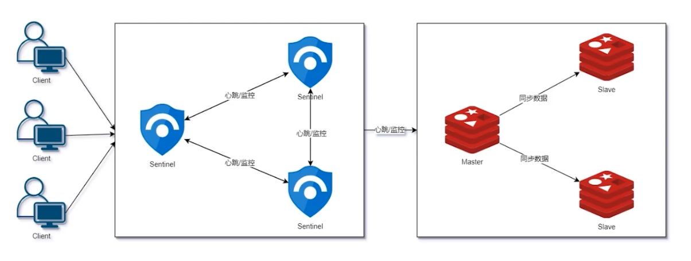
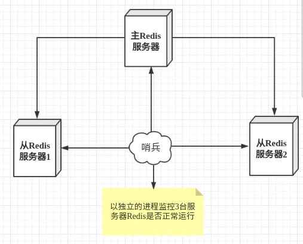

#

1. 通过发送命令，让Redis服务器返回监控其运行状态，包括主服务器和从服务器
2. 当哨兵监测到**master宕机，会自动将slave切换成master**，然后通过**发布订阅模式**通知其他的从服务器，修改配置文件，让它们切换主机
3. 哨兵模式基于[主从复制](/java/database/redis/5-replication)进行补充



哨兵就是特殊的<b id="blue">redis节点</b>，只不过它不存储数据

# 哨兵须知

1. 端口26379
2. 至少是基数倍的节点（选举）
3. 运行必须指定配置文件


# 单哨兵模式



1. 配置sentinel配置

```shell
[root@localhost conf]# vim sentinel.conf
# sentinel监听端口，默认是26379，可以更改
port 26379
# 让 sentinel 去监控一个地址为 ip:port 的主服务器
# 自定义监控主节点名称
# 1：至少有一个sentinel来投票才能成为主节点，这里单哨兵，所以为1
Sentinel monitor redis-master 127.0.0.1 6379 1
```

2. 启动配置文件，能看到配置文件

```shell
[root@localhost redis-6.2.1]# redis-sentinel conf/sentinel.conf
```

能够看到日志

```console
16816:X 27 Mar 2021 00:54:35.398 # +monitor master redis-master 127.0.0.1 6379 quorum 1
16816:X 27 Mar 2021 00:54:35.399 * +slave slave 192.168.1.131:6381 192.168.1.131 6381 @ redis-master 127.0.0.1 6379
16816:X 27 Mar 2021 00:54:35.400 * +slave slave 192.168.1.131:6380 192.168.1.131 6380 @ redis-master 127.0.0.1 6379
```

3. 关闭主节点，稍等能看到从节点有一个选举为主节点

```
16816:X 27 Mar 2021 00:56:35.055 * +slave slave 127.0.0.1:6379 127.0.0.1 6379 @ redis-master 192.168.1.131 6381
```

# 多哨兵模式


```shell
## 告诉sentinel去监听地址为ip:port的一个master，
## 这里的master-name可以自定义，quorum是一个数字，
## 指明当有多少个sentinel认为一个master失效时，master才算真正失效
## quorum 选举仲裁的节点数(一般总节点/2+1)
sentinel monitor <master-name> <ip> <redis-port> <quorum>

## 设置连接master和slave时的密码，
## 注意的是sentinel不能分别为master和slave设置不同的密码，
## 因此master和slave的密码应该设置相同
sentinel auth-pass <master-name> <password>

## 这个配置项指定了需要多少失效时间，
## 一个master才会被这个sentinel主观地认为是不可用的。 \
## 单位是毫秒，默认为30秒
sentinel down-after-milliseconds <master-name> <milliseconds> 

## 发生failover主备切换时最多可以有多少个slave同时对新的master进行同步，
## 这个数字越小，完成failover所需的时间就越长，
## 但是如果这个数字越大，就意味着越 多的slave因为replication而不可用。
## 可以通过将这个值设为 1 来保证每次只有一个slave 处于不能处理命令请求的状态
sentinel parallel-syncs <master-name> <numslaves> 

##  同一个sentinel对同一个master两次failover之间的间隔时间
##  当一个slave从一个错误的master那里同步数据开始计算时间。
## 直到slave被纠正为向正确的master那里同步数据时
## 默认3分钟
sentinel failover-timeout <master-name> <milliseconds>
```