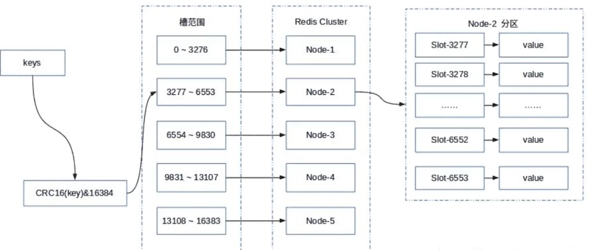

# 

Redis的哨兵模式基本已经可以实现高可用，读写分离 ，但是在这种模式下每台redis服务器都存储相同的数据，很浪费内存，因为一个master节点并不能放海量数据，而且单个Redis的实例过大时，会导致rdb文件过大，当执行主从同步时时间过长，所以在redis3.0上加入了cluster模式，实现的redis的分布式存储，也就是说每台redis节点上存储不同的内容。

> Redis-Cluster采用无中心结构,它的特点如下

- 所有的redis节点彼此互联(PING-PONG机制),内部使用二进制协议优化传输速度和带宽。

- 节点的fail是通过集群中超过半数的节点检测失效时才生效。

- 客户端与redis节点直连,不需要中间代理层.客户端不需要连接集群所有节点,连接集群中任何一个可用节点即可。

并发量大了-->主从复制解决
主从稳定性-->哨兵解决
单节点存储能力/写能力-->集群cluster解决

# 数据分区

redis 采用<b id="blue">虚拟槽分区</b>， redis 确定每个节点的槽范围



`优点`:每个node均匀的分配了slot，缩小增减节点影响的范围

`缺点`: 每个节点需要存储node和slot的对应信息

# 环境搭建

redis官网建议：集群最少3主3从节点

## 配置文件

```properties
#是否开启集群模式，默认no
cluster-enabled yes
#(会自动生成一个文件，保存节点信息)
#集群节点信息文件，会保存在dir 配置对应目录下
cluster-config-file nodes-6371.conf
#集群节点连接超时时间
cluster-node-timeout 15000
#集群节点IP
cluster-announce-ip 192.168.10.101
#集群节点映射端口
cluster-announce-port 6371
#集群节点总线端口
#一个二进制的集群到集群的通道
#节点通过这个端口进行故障检测，通信等
cluster-announce-bus-port 16371

```

## 客户端执行命令

-a : 指定密码

create： 后面要创建集群的节点

```shell
redis-cli -a 654321 --cluster create 192.168.1.31:8001 192.168.1.31:8002 192.168.1.31:8003 192.168.1.31:8004 192.168.1.31:8005 192.168.1.31:8006 --cluster-replicas 1
```

# 集群的常用命令

```shell
# 查询各个节点的槽
cluster nodes
```

# 节点管理

## 添加新节点

1. 添加主节点

new_host: 新增的节点的ip和port

existing_host：最后的节点的ip和port

node_id: 最后的节点的id

```shell
redis-cli --cluster add-node new_host:new_port existing_host:existing_port --cluster-master-id node_id
```

2. 重新分片

reshard host:port  === 连接集群用的，所以随便那个ip即可

--cluster-from node_id --cluster-to node_id ====从某个节点取槽，给某个节点

--cluster-slots <args>  ====分片槽的数量

--cluster-yes  ==== 是否确定分配


```shell
redis-cli --cluster reshard host:port --cluster-from node_id --cluster-to node_id --cluster-slots <args> --cluster-yes
```

## 添加从节点

new_host:new.port === 要添加的从节点

existing.host:existing_port === 给哪个主节点添加从节点

--cluster-master-id node_id === 主节点的id

```shell
redis-cli --cluster add-node new_host:new.port existing.host:existing_port --cluster-slave --cluster-master-id node_id
```

## 删除从节点

```shell
redis-cli --cluster del-node host:port node_id
```

## 删除主节点

