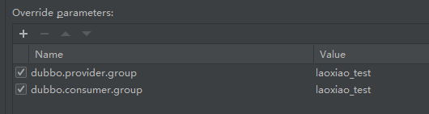

# Spring Boot与Dubbo

## 基础配置

- pom引入

```xml
<dependency>
    <groupId>com.alibaba.nacos</groupId>
    <artifactId>nacos-client</artifactId>
    <version>${nacos.version}</version>
</dependency>
<dependency>
    <groupId>org.apache.dubbo</groupId>
    <artifactId>dubbo-spring-boot-starter</artifactId>
    <version>${dubbo.version}</version>
</dependency>
<dependency>
    <groupId>org.apache.dubbo</groupId>
    <artifactId>dubbo</artifactId>
    <version>${dubbo.version}</version>
</dependency>
```

> 服务器端

- 需要配置暴露的协议和端口（-1表示随机）
- 需要配置扫描的service的目录

```yml
nacos:
  server-address: 127.0.0.1
  port: 8848
  username: nacos
  password: nacos

dubbo:
  scan:
    base-packages: com.xiao.manager
  registry:
    address: nacos://${nacos.server-address}:${nacos.port}/?username=${nacos.username}&password=${nacos.password}
  protocol:
    port: -1
    name: dubbo
```

启动类配置，注意通过EnableDubbo注解来开启dubbo注解

```java
@EnableDubbo
@SpringBootApplication
public class Application {
    public static void main(String[] args){
        SpringApplication.run(Application.class, args);
    }
}
```

服务端的暴露的service

```java
@DubboService(version = "1.0.0")
@Slf4j
public class DemoManagerImpl implements DemoManager {
    @Override
    public String sayHello(String name) {
        log.debug("来自{} 的请求...{}", LocalDateTime.now());
        return "收到:"+name;
    }
}
```

> 消费端

```yaml
nacos:
  host: 127.0.0.1
  port: 8848
  username: nacos
  password: nacos

dubbo:
  registry:
    address: nacos://${nacos.host}:${nacos.port}/?username=${nacos.username}&password=${nacos.password}
```

```java
@DubboReference(version = "1.0.0")
public DemoManager demoManager;


@GetMapping("/sayHello/{name}")
public String sayHello(@PathVariable("name") String name) {
    return demoManager.sayHello(name);
}
```

## 超时配置

消费端：reference默认使用的超时为 consumer的timeout:1000

​				可也以如此配置@Reference(timeout = 6000)

也可在服务端设置timeout

方法级别>类级别

**消费端>服务端**

`一般情况下，我们都是在服务器端配置超时时间`

## 多版本

provide端：

定义两个service提供服务

```java
@com.alibaba.dubbo.config.annotation.Service(version = "2.0.0")
@Service(value ="userService2" )
public class UserService2Impl implements UserService
```

```java
@com.alibaba.dubbo.config.annotation.Service(version = "1.0.0")
@Service
public class UserServiceImpl implements UserService 
```

comsumer端指定版本

```java
@Reference(version = "2.0.0")
private UserService userService;
```

## 本地存根

本地存根（Stub）是Dubbo中的一个功能，允许在客户端执行部分逻辑。比如参数校验、缓存或者容错处理。看起来它类似于AOP的环绕通知，在调用远程服务前后添加自定义逻辑

比如：在consumer端调用provide端的service时，先经过consumer层的service，判断是否符合条件，再调用provide端的service

代码（consumer）:

stub：指向consumer自定义逻辑的实现类

```java
@Reference(stub = "com.xiao.service.impl.UserServiceImp")
private UserService userService;
```

```java
public class UserServiceImp implements UserService {
    private UserService userService;
    public UserServiceImp(UserService userService) {
        this.userService=userService;
    }

    @Override
    public TUser getUser() throws Exception {
        System.out.println("本地存根");
        //在存根方法中远程调用服务
        return userService.getUser();
    }
}
```

# 集群容错

> 重试次数

Dubbo 服务在尝试调用一次之后，如出现非业务异常(服务突然不可用、超时等)，Dubbo 默认会进行额外的最多2次重试.（也就是3次）

重试次数支持两种自定义配置: 1.通过注解/xml进行固定配置；2.通过上下文进行运行时动态配置

在**服务端**的注入注解配置重试次数（消费端也可以配偶之，一般服务器端配置）

```java
@DubboService(retries = 1)
```

> 容错模式

- Failover Cluster

失败自动切换，当出现失败，重试其它服务器。通常用于读操作，但重试会带来更长延迟。可通过 `retries="2"` 来设置重试次数(不含第一次)。

- Failfast Cluster

快速失败，只发起一次调用，失败立即报错。通常用于非幂等性的写操作，比如新增记录。

- Failsafe Cluster

失败安全，出现异常时，直接忽略。通常用于写入审计日志等操作。

- Failback Cluster

失败自动恢复，后台记录失败请求，定时重发。通常用于消息通知操作。

# 服务降级

`当服务器压力剧增的情况下根据实际业务情况及流量，对这些服务和页面有策略的不处理或换成简单的方式处理,从而释放服务器资源以保证核心交易正常运作或高效运作。`

需要在admin的控制台配置

> 屏蔽

mock=force:return+null表示消费方对该服务的方法调用都直接返回null值，不发起远程调用。用来屏蔽不重要服务不可用时对调用方的影响。


> 容错

还可以改为mock=fail:return+null表示消费方对该服务的方法调用在失败后，再返回 null值，不抛异常。用来容忍不重要服务不稳定时对调用方的影响。（如**超时**等操作）


# 整合Hystrix断路器

# dubbo原理

## RPC的过程


1. *Client 客户端* 通过调用本地服务的方式调用需要消费的服务
2. *Client Stub 代理* 接收到调用请求后负责将方法，入参等信息序列化(组装)成能够进行网络传输的消息体
3. *Client Stub 代理* 找到远程的服务地址，并且将消息通过网络发送给服务端
4. *Server Stub 服务端骨架* 收到消息后进行解码(反序列化操作)
5. *Server Stub 服务端骨架* 根据解码结果调用本地的服务进行相关处理
6. *Server 服务端* 执行具体业务逻辑并将处理结果返回给 *Server Stub 服务端骨架*
7. *Server Stub 服务端骨架* 将返回结果重新打包成消息(序列化)并通过网络发送至消费方
8. *Client Stub 存根* 接收到消息，并进行解码(反序列化);
9. *Client Stub 存根*  将解码后的结果返回给 *Client 客户端*


## 整体设计


1. service：暴露给用户调用的一层，通过接口，调用远程的方法
2. config: 配置层，配置层收集配置信息
3. proxy: 代理层，通过代理的方式，生成客户端的代理对象
4. registry：注册中心层，生产者服务注册进入注册中心，消费者从注册中心发现注册服务
5. cluster:路由层，调用者通过路由的算法负载均衡的方式调用消费者
6. monitor:监控层，每一次调用都能在监控中心看到，监控层可以以监控数据的方式提供界面查阅
7. protoco: 远程调用层，封装整个RPC调用
8. exchange：通信层，架起NIO的通信管道
9. transport： 传输层，通过transporter传输
10. serialize: 序列化层


## 初始化流程

### Spring Boot 版本

1. @EnableDubbo impot <b id="blue">DubboConfigConfigurationRegistrar</b>bean
2.  DubboConfigConfigurationRegistra注入DubboConfigConfiguration

```java
registerBeans(registry, DubboConfigConfiguration.Single.class);
```


```java
@EnableConfigurationBeanBindings({
        @EnableConfigurationBeanBinding(prefix = "dubbo.application", type = ApplicationConfig.class),
        @EnableConfigurationBeanBinding(prefix = "dubbo.module", type = ModuleConfig.class),
        @EnableConfigurationBeanBinding(prefix = "dubbo.registry", type = RegistryConfig.class),
        @EnableConfigurationBeanBinding(prefix = "dubbo.protocol", type = ProtocolConfig.class),
        @EnableConfigurationBeanBinding(prefix = "dubbo.monitor", type = MonitorConfig.class),
        @EnableConfigurationBeanBinding(prefix = "dubbo.provider", type = ProviderConfig.class),
        @EnableConfigurationBeanBinding(prefix = "dubbo.consumer", type = ConsumerConfig.class),
        @EnableConfigurationBeanBinding(prefix = "dubbo.config-center", type = ConfigCenterBean.class),
        @EnableConfigurationBeanBinding(prefix = "dubbo.metadata-report", type = MetadataReportConfig.class),
        @EnableConfigurationBeanBinding(prefix = "dubbo.metrics", type = MetricsConfig.class),
        @EnableConfigurationBeanBinding(prefix = "dubbo.ssl", type = SslConfig.class)
})
```

EnableConfigurationBeanBinding解析：例如第一条：将dubbo.application下的所有属性值都映射到`ApplicationConfig`这个类里面

那么，上面的代码含义就是，将相关的属性配置映射到实体类中

3. @EnableDubbo同时是@DubboComponentScan子注解，@DubboComponentScan注解import了DubboComponentScanRegistrar
   1.  DubboComponentScanRegistrar实现了ImportBeanDefinitionRegistrar（[importbeandefinitionregistrar](/java/spring/3-springbean?id=importbeandefinitionregistrar)），可以编程的方式注入beandefinition
   1.  这个注解注入了一些BeanPostProcessor后置处理器，如：ServiceAnnotationBeanPostProcessor、ReferenceAnnotationBeanPostProcessor等
   1.  可以在bean定义结束后，再新增一些bean的定义

<b id="blue">ServiceAnnotationBeanPostProcessor</b>：这个bean其实跟`@ComponentScan`注解的处理类逻辑是差不多的，扫描`@Service`等注解，除了这些之外，这个bean还添加了处理Dubbo的`com.alibaba.dubbo.config.annotation.Service`注解

<b id="blue">ReferenceAnnotationBeanPostProcessor</b>：这个bean是用来给`@Reference`注解标注的属性中注入值的


ServiceAnnotationBeanPostProcessor：

老版本：

1. 主要将 @DubboService 标注的服务创建BeanDefinitionHolder，用于后续生成 ServiceBean 定义。

```java
Set<BeanDefinitionHolder> beanDefinitionHolders =
        findServiceBeanDefinitionHolders(scanner, packageToScan, registry, beanNameGenerator);
```

2. 注册 ServiceBean 定义并做属性绑定。ServiceBean 主要作用Spring启动后的服务暴露，每一个服务都会对应一个ServiceBean，主要封装的服务的一些标签属性如 interfaceClass、methods、retries等。（老版本）

```java
for (BeanDefinitionHolder beanDefinitionHolder : beanDefinitionHolders) {
    registerServiceBean(beanDefinitionHolder, registry, scanner);
}
```

新版本：

注入了DubboBootstrapApplicationListener

```java
// @since 2.7.5
registerInfrastructureBean(registry, DubboBootstrapApplicationListener.BEAN_NAME, DubboBootstrapApplicationListener.class);
```

## 服务暴露流程

> ~~ServiceBean是服务标签的核心类~~

~~它实现了：~~

~~InitializingBean：在属性设置完以后会回调afterPropertiesSet~~

~~它通过exported方法发布事件来进行暴露服务~~

上面的是老版本

<b id="blue">DubboBootstrapApplicationListener</b>

它实现了ApplicationListener，发布事件onApplicationEvent调用DubboBootstrap#start

1. 如果是ApplicationContextEvent事件，则进行调用

```java
public final void onApplicationEvent(ApplicationEvent event) {
    if (isOriginalEventSource(event) && event instanceof ApplicationContextEvent) {
        onApplicationContextEvent((ApplicationContextEvent) event);
    }
}
```

调用：容器刷新或者容器调用触发对应方法

```java
public void onApplicationContextEvent(ApplicationContextEvent event) {
    if (event instanceof ContextRefreshedEvent) {
        onContextRefreshedEvent((ContextRefreshedEvent) event);
    } else if (event instanceof ContextClosedEvent) {
        onContextClosedEvent((ContextClosedEvent) event);
    }
}
```

2. 在onContextRefreshedEvent中，调用DubboBootstrap#start

```java
private void onContextRefreshedEvent(ContextRefreshedEvent event) {
    dubboBootstrap.start();
}
```

1. 在start方法中调用exportServices，然后exportServices中调用ServiceConfig#export，然后在ServiceConfig#doExportUrls中获取暴露的协议，进行循环暴露

```java
for (ProtocolConfig protocolConfig : protocols) {
    doExportUrlsFor1Protocol(protocolConfig, registryURLs);
}
```

2. 在ServiceConfig#doExportUrlsFor1Protocol调用PROTOCOL.export(wrapperInvoker)进行服务暴露
   1. PROTOCOL是通过spi加载的对象，dubbo协议的就是DubboProtocol类对象
3. 先到RegistryProtocol#export
4. 在RegistryProtocol的doLocalExport方法中调用DubboProtocol#export,进行服务的地址的绑定
5. DubboProtocol#export的openServer方法中，在createServer使用Transporters.bind进行netty的服务创建

6. 回到RegistryProtocol#export来进行对应的信息注册进入注册中心

## 服务引用流程

> 服务引用先看ReferenceBean

1. 他是FactoryBean的实现这，在注入bean的时候会调用FactoryBean#getObject方法
2. 在ReferenceConfig#init创建代理对象

```java
ref = createProxy(map);
```

3. 调用invoker = REF_PROTOCOL.refer(interfaceClass, urls.get(0));方法

4. 进入RegistryProtocol#refer方法获取注册中心的信息

```java
//通过这个方法获取注册中心的地址信息
Invoker<T> invoker = cluster.join(directory);
```

# 异步调用

`接口处理`：

```java
@DubboService(version = "1.0.0", cluster = "failfast", retries = 1, methods = {@Method(name = "sayHello", async = true)})
@Slf4j
public class DemoManagerImpl implements DemoManager
```

`调用示例`

```
result = demoManager.sayHello(name);
Future<Object> future = RpcContext.getContext().getFuture();//获取异步执行结果Future
result = future.get();//获取具体的异步执行结果
```

# Dubbo执行流程

 start: 启动Spring容器时,自动启动Dubbo的Provider

1、register: Dubbo的Provider在启动后自动会去注册中心注册内容.注册的内容包括:

1. Provider的 IP
2. Provider 的端口.
3. Provider 对外提供的接口列表.哪些方法.哪些接口类

1.4 Dubbo 的版本.

1.5 访问Provider的协议.

2、subscribe: 订阅.当Consumer启动时,自动去Registry获取到所已注册的服务的信息.

3、notify: 通知.当Provider的信息发生变化时, 自动由Registry向Consumer推送通知.

4、invoke: 调用. Consumer 调用Provider中方法

4.1 同步请求.消耗一定性能.但是必须是同步请求,因为需要接收调用方法后的结果.

5、count:次数. 每隔2分钟,provoider和consumer自动向Monitor发送访问次数.Monitor进行统计.

# 注册中心挂了可以继续通信吗

*可以，因为刚开始初始化的时候，消费者会将提供者的地址等信息拉取到本地缓存，所以注册中心挂了可以继续通信*

# SPI

## 基本使用

1. 定义一个接口,添加注解@SPI

```java
@SPI
public interface Car {
    void sayHello();
}
```

2. 在META-INF/dubbo（或者/META-INF/dubbo/internal或META-INF/services/ ）下面定义一个文件，文件名为接口的全限定名(如:com.xiao.spi.Car)
   1. 内容为Car接口的实现类为value，key可以随便取

```tex
car=com.xiao.spi.impl.CarImpl
```

3. 加载：按照key可以加载出Car的实现类，并且调用
   1. 这个功能类似java的spi

```java
ExtensionLoader<Car> loader = ExtensionLoader.getExtensionLoader(Car.class);
Car car = loader.getExtension("car");
car.sayHello();
```

## @Adaptive作用

一个接口有三个方法，分别是methodA，methodB，methodC。此接口有三个实现类impl1，impl2，impl3。接口通过@SPI注解指定默认实现为impl1，通过@Adaptive注解及URL参数生成一个动态类，可以完成以下动作。

1. 接口能将每个方法的实现都对应不同实现类。例如接口可以的methodA由impl1执行，methodB由impl2执行，methodC由impl3执行。
2. 接口能让方法按一定优先级选择实现类来执行。例如methodA方法上有注解@Adaptive({"key1","key2","key3"})先尝试查找参数URL中key1对应的实现类，未指定则取key2，还未指定则key3，再没指定则使用SPI注解规定的默认实现类去执行方法

如：

1. 定义一个接口

```java
@SPI
public interface Person {
    @Adaptive({"key1"})
    void sayHello(URL url);

}
```

2. 在配置文件专供配置对应key

```
person=com.xiao.spi.impl.PersonImpl
person2=com.xiao.spi.impl.Person2Impl
```

3. 加载

```java
URL url = URL.valueOf("dubbo://0.0.0.0/test?key1=person2");
Person person = ExtensionLoader.getExtensionLoader(Person.class).getAdaptiveExtension();
person.sayHello(url);
```

## 加载原理

> getExtension

```JAVA
public T getExtension(String name, boolean wrap) {
    //如果为true，则使用默认的
    //即@SPI注解上的value值
    if ("true".equals(name)) {
        return getDefaultExtension();
    }
    final Holder<Object> holder = getOrCreateHolder(name);
    Object instance = holder.get();
    if (instance == null) {
        synchronized (holder) {
            instance = holder.get();
            if (instance == null) {
                instance = createExtension(name, wrap);
                holder.set(instance);
            }
        }
    }
    return (T) instance;
}
```

> createExtension

```java
private T createExtension(String name, boolean wrap) {
    //获取当前name对应的class
    Class<?> clazz =  	().get(name);
    if (clazz == null) {
        throw findException(name);
    }
    try {
        T instance = (T) EXTENSION_INSTANCES.get(clazz);
        if (instance == null) {
            //创建实例
            EXTENSION_INSTANCES.putIfAbsent(clazz, clazz.newInstance());
            instance = (T) EXTENSION_INSTANCES.get(clazz);
        }
        //依赖注入
        injectExtension(instance);
        //aop的处理
        if (wrap) {

            List<Class<?>> wrapperClassesList = new ArrayList<>();
            if (cachedWrapperClasses != null) {
                wrapperClassesList.addAll(cachedWrapperClasses);
                wrapperClassesList.sort(WrapperComparator.COMPARATOR);
                Collections.reverse(wrapperClassesList);
            }

            if (CollectionUtils.isNotEmpty(wrapperClassesList)) {
                for (Class<?> wrapperClass : wrapperClassesList) {
                    Wrapper wrapper = wrapperClass.getAnnotation(Wrapper.class);
                    if (wrapper == null
                        || (ArrayUtils.contains(wrapper.matches(), name) && !ArrayUtils.contains(wrapper.mismatches(), name))) {
                        instance = injectExtension((T) wrapperClass.getConstructor(type).newInstance(instance));
                    }
                }
            }
        }
```

>  loadExtensionClasses

通过SPI加载接口对应的所有实现类

```java
//将对应的路径的文件进行挨个的加载
for (LoadingStrategy strategy : strategies) {
    loadDirectory(extensionClasses, strategy.directory(), type.getName(), strategy.preferExtensionClassLoader(), strategy.overridden(), strategy.excludedPackages());
    loadDirectory(extensionClasses, strategy.directory(), type.getName().replace("org.apache", "com.alibaba"), strategy.preferExtensionClassLoader(), strategy.overridden(), strategy.excludedPackages());
}
```

>  loadClass逻辑

```java
if (clazz.isAnnotationPresent(Adaptive.class)) {
    cacheAdaptiveClass(clazz, overridden);
} else if (isWrapperClass(clazz)) {
    //判断是不是wrapper类，如果是，则放入set集合的缓存
    //作为下次的包装类使用
    cacheWrapperClass(clazz);
} else {
    clazz.getConstructor();
    if (StringUtils.isEmpty(name)) {
        name = findAnnotationName(clazz);
        if (name.length() == 0) {
            throw new IllegalStateException("No such extension name for the class " + clazz.getName() + " in the config " + resourceURL);
        }
    }

    String[] names = NAME_SEPARATOR.split(name);
    if (ArrayUtils.isNotEmpty(names)) {
        cacheActivateClass(clazz, names[0]);
        for (String n : names) {
            cacheName(clazz, n);
            saveInExtensionClass(extensionClasses, clazz, n, overridden);
        }
    }
}
```

> 依赖注入逻辑

```java
for (Method method : instance.getClass().getMethods()) {
    if (!isSetter(method)) {
        //判断是不是set方法
        continue;
    }
    if (method.getAnnotation(DisableInject.class) != null) {
        //如果set方法上标识了注解
        //@DisableInject则不进行设置
        continue;
    }
    Class<?> pt = method.getParameterTypes()[0];
    if (ReflectUtils.isPrimitives(pt)) {
        //判断类型
        continue;
    }

    try {
        //得到setXxx中的XXX
        String property = getSetterProperty(method);
        //根据参数类型或属性名，从objectFactory中获取到对象，然后调用set方法进行注入
        Object object = objectFactory.getExtension(pt, property);
        if (object != null) {
            //调用set方法
            method.invoke(instance, object);
        }
    } catch (Exception e) {
        logger.error("Failed to inject via method " + method.getName()
                + " of interface " + type.getName() + ": " + e.getMessage(), e);
    }

}
```

# 开发环境如何避免冲突

## dubbo直连

> 注解的方式（不推荐）

```java

@Reference(url="127.0.0.1:20881")
private UserService userService;

```

> 配置文件方式

1. 定义一个<b id="gray">dubbo.properties</b>文件

```properties
com.laoxiao.userService1=dubbo://127.0.0.1:20880
com.laoxiao.userService2=dubbo://127.0.0.1:20880
```

2. 启动是指向文件

```shell
 java -jar xxx.jar -Ddubbo.resolve.file=E://config//dubbo.properties 
```

## 修改group的方式

在idea中的parameters添加对应自己的group，这样就不会和开发环境其他开发人员产生调用冲突了





或者，直接添加vm参数
```shell

-Ddubbo.consumer.group=lx -Ddubbo.provider.group=lx 

```