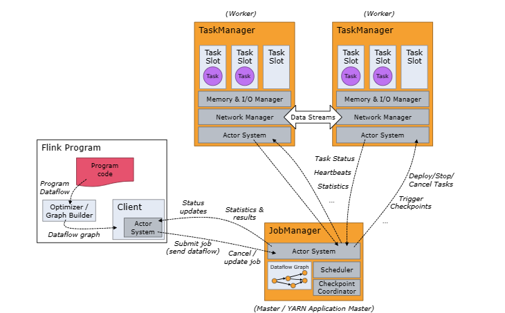

# 相关文档

https://nightlies.apache.org/flink/flink-docs-master/zh/docs/dev/datastream/overview/

# flink特性
1. 基于jvm实现自己的内存管理，将内存管理从jvm剥离出来
2. 内存可以超出主内存的大小限制，对象序列化存储

# 集群架构

- Job Manager: 管理节点，每个集群至少一个，管理整个集群计算资源，Job管理与调度执行，以及Checkpoint协调
- Task Manager: 每个集群有很多Task Manager， 负责计算资源提供
- Client: 本地执行应用main()方法解析Job Graph对象，病最终将Job Gragh提交到Job Manager运行，同时监控job执行的状态
  

Actor System：akka的rpc通信框架

# 集群模式

## Session 模式

在 Flink Session 集群中，客户端连接到一个预先存在的、长期运行的集群，该集群可以接受多个作业提交。即使所有作业完成后，集群（和 JobManager）仍将继续运行直到手动停止 session 为止。因此，Flink Session 集群的寿命不受任何 Flink 作业寿命的约束。

> 1. Job manager与Task manager共享
> 2. 需要生产job graph, 并提交到管理节点
> 3. JobManager生命周期不受job影响

## 单作业模式（per-job mode）

单作业模式也很好理解，就是严格的一对一，集群只为这个作业而生

同样由客户端运行应用程序，然后启动集群，作业被提交给 JobManager，进而分发给 TaskManager 执行。作业完成后，集群就会关闭，所有资源也会释放

> - 单个Job独享JobManager 与 TaskManager
> - Client会首先向集群管理器请求资源来启动JobManager，并将job提交给其内部的Dispatcher。
> - TaskManager根据job的资源请求延迟分配启动的。
> - 集群生命周期和job绑定，job停止后集群也会被停止

### 优点

每个作业都有它自己的 JobManager管理，占用独享的资源，即使发生故障，它的 TaskManager 宕机也不会影响其他作业。

## 应用模式（Application Mode）

前面提到的两种模式下，应用代码都是在客户端上执行，然后由客户端提交给 JobManager的。但是这种方式客户端需要占用大量网络带宽，去下载依赖和把二进制数据发送给JobManager；加上很多情况下我们提交作业用的是同一个客户端，就会加重客户端所在节点的资源消耗。

> - jar包的下载和资源下载交给集群，客户端只是提交命令
> - main()方法运行JobManager 中，将JobGraph的生成放在集群上运行，客户端压力降低;

### 缺点

仅支持 Yarn和Kubunetes