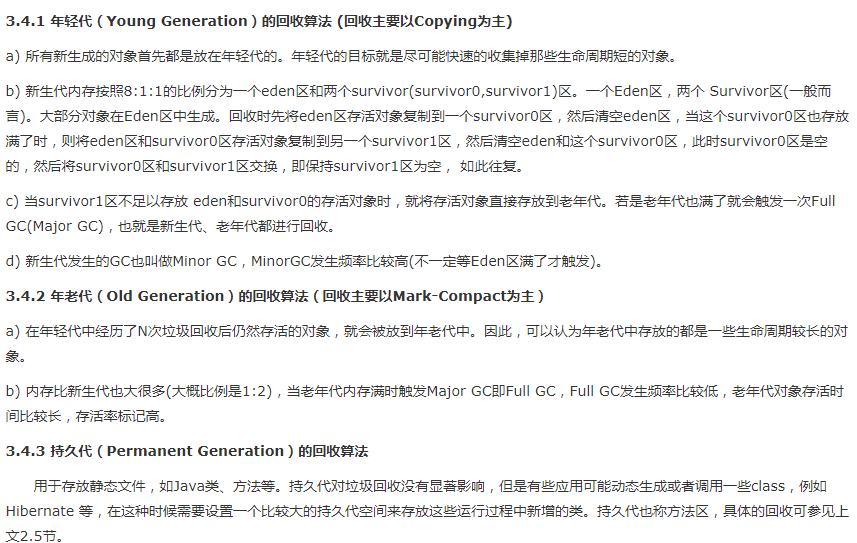

**本笔记为观看周阳老师视频/其他博客等所作笔记**


# CAS
## CAS 是什么

- 比较并交换,

```java
class CASDemo {
    public static void compareAndSet() {
       
        AtomicInteger atomicInteger = new AtomicInteger(5);
         //某个线程从主内存拿到5，赋值到自己的工作内存中
        //在刷回主内存的时候，与主内存中的值匹配，如果=5，将值该成20
        System.out.println(atomicInteger.compareAndSet(5,20)+ " " + atomicInteger.get());
        System.out.println(atomicInteger.compareAndSet(5,21)+ " " + atomicInteger.get());
        //输出结果:因为第二个进行匹配时，
        //主内存值已经时20了， 所以不进行替换
        //true 20           false 20
    }
}
```

- 底层原理

我们看下源码，它调用了unsafe类，unsafe里面方法是native的，它可以像c的指针一样，操作内存。

```java
public final int getAndIncrement() {
    //当前对象，内存地址， 值
    return unsafe.getAndAddInt(this, valueOffset, 1);
}
```

- CAS是什么

CAS的全称compare-and-Swap, 是一条cpu的并发原语（原语的执行必须时连续的，在执行过程不允许被中断，只有等原语操作完成，别人才有机会去获取或执行）

他的功能就是判断内存某个位置是否有预期值，如果有，则进行替换新的值，这个过程时原子的

unsafe.getAndAddInt代码：

```java
public final int getAndAddInt(Object var1, long var2, int var4) {
    int var5;
    do {
        //获取var1对象 var2地址的值
        var5 = this.getIntVolatile(var1, var2);
        //var1对象，var2地址是否存在var5的值，存在，则进行替换(CAS)
    } while(!this.compareAndSwapInt(var1, var2, var5, var5 + var4));

    return var5;
}
```
## CAS缺点

- 循环时间长，开销大

- 只能保证一个共享变量的原子性

- 引起ABA问题

  - 什么时ABA 问题： 加入主内存有值A， T1和T2线程同时获取在自己的工作内存，T1执行修改4s，t2 时间2s，这时 t2将主内存值改为B，t1线程还没操作完，然后t2将值又该成A，这个时候t1执行，发现值还是A，则以为内存中的值没人动过，将其改成C。t1 的  CAS操作是成功的，但并不代表，这个过程没有问题

  - 原子引用：如果我所要的atomicxxx不满足自己，则我们可以自定义原子类

```java
@Test
public void test2(){
    User user1 = new User("zs","123");
    User user2 = new User("ls", "456");
    //任何类想要包装成原子类，需要使用AtomicReference
    AtomicReference<User> atomicReference = new AtomicReference<User>();
    atomicReference.set(user1);
    System.out.println(atomicReference.
            compareAndSet(user1,user2) + " " + atomicReference.get());
    System.out.println(atomicReference.
            compareAndSet(user1,user2) + " " + atomicReference.get());
    //输出结果
    //true User{username='ls', password='456'}
    //false User{username='ls', password='456'}
}
```

  - ABA问题解决：曾加版本号来标记处理过程

```java
//设置值为1 ， 版本号为1， 解决ABA问题
AtomicStampedReference<Integer> atomicStampedReference
        = new AtomicStampedReference<Integer>(1, 1);
//设置更改值，并且设置版本号与更改后的版本号
atomicStampedReference.compareAndSet(1,2,atomicStampedReference.getStamp(),
        atomicStampedReference.getStamp()+1);
```


# 锁

## 公平和非公平锁

公平：过个线程去抢一把锁，有序（排队）的获取锁 ； 非公平：允许某个线程插队获取锁，synchronized也是非公平锁

```java
//非公平锁
Lock lock1 = new ReentrantLock();
//公平锁
Lock lock2 = new ReentrantLock(true);
```

## 可重入锁（递归锁）

线程可以进入任何一个它已经拥有的锁所同步着的代码块

就是线程进入method1后，如果method2与method1锁时相同的，则可以进入;ReentrantLock/synchronized是可重入锁

作用：防止死锁

## 自旋锁

获取锁的线程不会立即阻塞，而是采用循环的方式去获取锁（如：CAS）

作用:减少线程上下文切换的消耗，但循环会消耗CPU

如果线程执行时间短，线程数少，可以考虑使用

## 独占锁（写锁）、共享锁（读锁）、

独占锁：该锁一次只能被一个线程所持有（ReentrantLock/synchronized）

共享锁：该锁可以被多个线程占有

- 多个线程同时读一个线程可以同时进行

- 如果有线程想去写共享资源，就不应该有其他线程可以对该资源进行读和写

```java
ReentrantReadWriteLock rw = new ReentrantReadWriteLock();
//写锁
rw.writeLock().lock();
//读写
rw.readLock().lock();
```

# 几个场景的并发工具类

## Countdownlatch

```java
CountDownLatch(int count) //实例化一个倒计数器，count指定计数个数
countDown() // 计数减一
await() //等待，当计数减到0时，所有线程并行执行
```

## CyclicBarrier

让一组线程到达一个屏障点进入阻塞线程

示例：集结7颗龙珠召唤神龙

```java
Runnable runnable = new Runnable() {
    public void run() {
        System.out.println("召唤神龙");
    }
};
//当达到7时，进入阻塞线程
final  CyclicBarrier cyclicBarrier = new CyclicBarrier(7, runnable);
for(int i=1; i<=7; i++){
    final int tmp = i;
    new Thread(new Runnable() {
        public void run() {
            System.out.println("第"+tmp);
            try{
                //使cyclicBarrier+1
                cyclicBarrier.await();
            }catch(Exception e){
            }
        }
    }).start();
}
```

## Semaphore

信号量主要用于：1 多个共享资源的互斥使用，2并发线程数的控制

示例：多个人抢少数车位（走一辆车进一辆）

```java
public static void main(String[] args) {
    //模拟3个车位
    final Semaphore semaphore = new Semaphore(3);
    //模拟6个人抢车位
    for(int i=1; i<=6; i++){
        new Thread(new Runnable() {
            public void run() {
                try{
                    semaphore.acquire();                   
                    System.out.println(Thread.currentThread().getName()+"抢到车位");
                    //模拟停车3s
                    Thread.sleep(3000);                    
                    System.out.println(Thread.currentThread().getName()+"离开车位");
                }catch (Exception e){
                }finally {
                    //离开
                    semaphore.release();
                }
            }
        }, String.valueOf(i)).start();
    }
}
```

## 阻塞队列

- 什么是阻塞队列： 队列为空，获取数据被阻塞、队列满，插入数据被阻塞

  - ArrayBlockingQueue：由数组结构构成的有界阻塞队列

  - LinkedBlockingQueue：由链表结构组成的有界阻塞队列

  - SynchronousQueue：不存储元素的阻塞队列（单个元素的队列!）,，每一个put操作必须要等待一个tacke操作


## 生产者消费者模式

### 传统类型

当生产者生产一个数据后，再调用，则进行阻塞

当消费者消费完数据后，进行阻塞，等待生产

```java
//模拟传统的消费者生产者
public class TraditionalConsumer {
    public static void main(String[] args) {
        //一个生产(+1), 一个消费(-1)
        final MyData myData = new MyData();
        new Thread(new Runnable() {
            public void run() {
                for(int i=0; i<5; i++){
                    myData.increment();
                }
            }
        }, "A").start();
        new Thread(new Runnable() {
            public void run() {
                for(int i=0; i<5; i++){
                    myData.decrement();
                }
            }
        }, "B").start();
    }
}

class MyData{
    private Integer i= 0; //初始化为0，还没生产
    private  Lock lock = new ReentrantLock();
    private Condition condition = lock.newCondition();
    //模拟生产数据
    public void increment(){
        lock.lock();
        try{
            while (i!=0){
                //如果已经生产数据，进行等待
                condition.await();
            }
            i++;
            System.out.println(Thread.currentThread().getName()+" 生产数据");
            condition.signalAll();
        }catch (Exception e) {
            e.printStackTrace();
        }finally {
            lock.unlock();
        }
    }

    public void decrement(){
        lock.lock();
        try{
            while (i==0){
                //如果没有数据，无法消费，进行等待
                condition.await();
            }
            i--;
            System.out.println(Thread.currentThread().getName()+" 消费数据");
            condition.signalAll();
        }catch (Exception e) {
            e.printStackTrace();
        }finally {
            lock.unlock();
        }
    }
}
```

## synchronized和lock的区别

1 原始构想

syns

- 是关键字，属于jvm层面

​			它底层汇编使用的是：

​                   monitorenter

​						代码块

​				monitorexit ##正常退出

​                 monitorexit ##异常退出

- 因为它有两次退出，所以一般不会有死锁现象，它不需要手动释放锁
- 不可中断，除非抛出异常或者正常运行完
- 非公平锁

​	Lock :

  ReentrantLock获取锁定与三种方式：
    a)  lock(), 如果获取了锁立即返回，如果别的线程持有锁，当前线程则一直处于休眠状态，直到获取锁

​    b) tryLock(), 如果获取了锁立即返回true，如果别的线程正持有锁，立即返回false；

​    c)**tryLock**(long timeout,[TimeUnit](http://houlinyan.iteye.com/java/util/concurrent/TimeUnit.html) unit)，   如果获取了锁定立即返回true，如果别的线程正持有锁，会等待参数给定的时间，在等待的过程中，如果获取了锁定，就返回true，如果等待超时，返回false；

​    d) lockInterruptibly:如果获取了锁定立即返回，如果没有获取锁定，当前线程处于休眠状态，直到或者锁定，或者当前线程被别的线程中断

- 具体类，是api层面的锁
- 可以中断，1 设置超时方法 tryLock 2 lock.lockInterruptibly();放代码块中，调用t1.interrupt();（t1为该线程对象）
- 可以是公平锁也可以时非公平锁
- Reentrantlock 可以用多个condition来实现分组精准唤醒需要唤醒的线程，而syn只能随机唤醒一个或者唤醒所有

## 生产者消费者-阻塞队列模式

```java
//资源操作类
class MyResource {
    //用来判断是否正常的生产和消费
    private volatile boolean FLAG=true;
    //获取外部传入阻塞队列，类型由调用者判断
    private BlockingQueue<String> blockingQueue=null;
    //模拟生产出来的数据
    private AtomicInteger atomicInteger = new AtomicInteger();
    public MyResource(BlockingQueue<String> blockingQueue){
        this.blockingQueue=blockingQueue;
    }

    public void prod() throws Exception {
        String data;
        boolean retValue;
        while (FLAG){
            //为true则一直工作
            data = String.valueOf(atomicInteger.incrementAndGet());
            //如果队列已满，返回false
            retValue = blockingQueue.offer(data, 2, TimeUnit.SECONDS);
            if(retValue){
                System.out.println("生产数据成功："+data);
            }else {
                System.out.println("生产数据失败："+data);
            }
            Thread.sleep(1000);
        }
        System.out.println("生产线程停止...");
    }

    public void consumer() throws Exception {
        String result = null;
        while (FLAG) {
            result = blockingQueue.poll(2, TimeUnit.SECONDS);
            if(result==null || result == ""){
                FLAG = false;
                System.out.println("消费失败");
                return;
            }
            System.out.println("消费成功："+result);
        }
    }

    public void stop(){
        this.FLAG=false;
    }

}

//生产者消费者队列版本，要求没有await和signal
public class ProdComsumerBlockQueueDemo {
    public static void main(String[] args) {
        BlockingQueue<String> blockingQueue = new ArrayBlockingQueue<String>(5);
        final MyResource myResource = new MyResource(blockingQueue);

        new Thread(new Runnable() {
            public void run() {
                try{
                    myResource.prod();
                }catch (Exception e){
                }
            }
        }).start();
        new Thread(new Runnable() {
            public void run() {
                try{
                    myResource.consumer();
                }catch (Exception e){
                }
            }
        }).start();
        try {
            Thread.sleep(5000);
            myResource.stop();
            System.out.println("5秒时间到，停止生产");
        }catch (Exception e){
        }
    }
}
```

## Callable实现多线程(future模式)

通过future能异步执行方法并最终获取返回值：

应用场景：财务方法结算，需要执行一个有一个存储过程，执行过程时间有长有短，这时，可以将这些存储过程放入异步执行方法中，最终获取返回值一起计算

```java
class MyCallable implements Callable<Integer>{
    public Integer call() throws Exception {
        System.out.println("执行call线程。。。。");
        return 100;
    }
}
public class CallableDemo {
    public static void main(String[] args) throws Exception {
        //FutureTask实现了Runable，同时通过构造方法传入Callable
        FutureTask<Integer> futureTask = new FutureTask<Integer>(new MyCallable());
        Thread t = new Thread(futureTask);
        t.start();
        //等待异步执行后获取返回值
        System.out.println("返回值："+ futureTask.get());
    }
}
```

# 线程池

底层实现： ThreadPoolExecutor

一池5线程：ExecutorService executorService = Executors.newFixedThreadPool(5); 适用执行长期任务

一池一线程：ExecutorService executorService = Executors.newSingleThreadExecutor();适用一个任务一个任务执行场景

一池N线程：ExecutorService executorService = Executors.newCachedThreadPool();适用执行很多短期的异步小程序

## 线程池七大参数

corePoolSize: 核心线程数，既执行外部请求的线程数量，当线程池的数目达到core值后，任务会放入缓存的队列中。

maximumPoolSize：最大的同步执行的线程数量，如果线程大于max，则采用拒绝策略（队列满了才会使用这个参数）

keepAliveTime：当线程数超过core，并且这个线程的空闲时间超过keep，则销毁线程到core这个数量

TimeUnit：keepAliveTime的时间单位

workQueue：一个阻塞队列

- 如果是有界队列，则线程数少于core时，创建线程，如果大于core，则任务加入本队列中。如果队列满了但是，线程数小于max，则开始创建线程
- 如果时无界队列，则max没有用

ThreadFactory： 生产线程的工厂，一般默认

RejectedExecutionHandler：拒绝策略

所以，**最大线程数=max+阻塞队列数**

```java

public ThreadPoolExecutor(int corePoolSize,
                          int maximumPoolSize,
                          long keepAliveTime,
                          TimeUnit unit,
                          BlockingQueue<Runnable> workQueue) {
    this(corePoolSize, maximumPoolSize, keepAliveTime, unit, workQueue,
         Executors.defaultThreadFactory(), defaultHandler);
}
```

## 线程池拒绝策略

AbortPolicy（默认）: 直接抛出RejectedExecutionException异常阻止系统正常运行。

CallerRunsPolicy: 不会抛弃任务，也不会抛出异常，而是将某些任务返回给调用的线程执行，如main方法的线程调用的线程池，则返回给main方法执行

ThreadPoolExecutor.DiscardPolicy：也是丢弃任务，但是不抛出异常。 
ThreadPoolExecutor.DiscardOldestPolicy：丢弃队列最前面的任务（它放弃最旧的未处理请求），然后重新尝试执行任务（重复此过程）

## 如何配置max

调用Runtime.getRuntime().availableProcessors()方法，获取CPU核心数

cup密集型：任务时大量的运算，没有阻塞，cpu一直全速运行

​		max=cpu核数+1

io密集型：

- max=cpu*2
- max=cpu/(1-阻塞系数)   阻塞系数一般0.8-0.9

## 死锁定位与分析

死锁是指两个或者两个以上的线程在执行过程中，因争夺资源而造成的一种互相等待的现象

既：A线程有A锁，去获取B的锁，这时，B线程有B锁，却想获取A锁

查看死锁类：

- jps -l 获取到死锁的进程编号
- jstack 进程编号 获取故障信息

# jvm

- #### 按照功能


一般GC只与方法去和堆区有关

java7和java8jvm是有区别的

- 如何确定垃圾回收，什么时GC ROOTS

java使用了对象可达方法来判断是否被引用：

所谓的GC ROOTS 其实就是一组必须活跃的应用

基本思路时，通过一系列（引用的集合）GC roots的对象作为起始点，往下搜索，如果对象到达GC ROOTS没有任何引用链相连时，判断此对象不可用。


如上图所示，object1~object4对GC Root都是可达的，说明不可被回收，object5和object6对GC Root节点不可达，说明其可以被回收

跟对象必须是GC ROOTS 

## GC过程


- **Eden区内存满时**（其他不会触发），这时候触发一次Minor GC，把Eden区的存活对象转移到From区，非存活对象进行清理，然后给新创建的对象分配空间，存入Eden区

- 随着分配对象的增多，Eden区的空间又不足了，这时候再触发一次Minor GC，清理掉Eden区和S1区的死亡对象，把存活对象转移到S2区，然后再给新对象分配内存
- From区和To区是相对的关系，哪个区中有对象，哪个区就是From区，比如，再进行一次Minor GC，会把存活对象转移到S1区，再为转移之前，S2区是From区，S1区是To区，转移后，S2区中没有存活对象，变为To区，而S1区变为From区
- （大对象直接进入老年代）假设新创建的对象很大，比如为5M(这个值可以通过PretenureSizeThreshold这个参数进行设置，默认3M)，那么即使Eden区有足够的空间来存放，也不会存放在Eden区，而是直接存入老年代
- 长期存活的对象将进入老年代（15岁）
- 如果某个(些)对象(原来在内存中存活的对象或者新创建的对象)由于以上原因需要被移动到老年代中，而老年代中没有足够空间容纳这个(些)对象，那么会触发一次Full GC

## 垃圾回收算法



## 哪些是GC root

- 虚拟机栈中引用的对象

  如方法是在栈中

- 方法区中的类静态属性引用的对象

- 方法区中常量引用的对象

- 本方法栈中JNI（Native 方法）中引用的对象 

## jvm的标配参数和x参数

### jvm的参数类型

- 标准参数

C:\Users\Administrator>java -version
java version "1.8.0_201"
Java(TM) SE Runtime Environment (build
Java HotSpot(TM) Client VM (build 25.2

C:\Users\Administrator>java -help

- x参数

- xx参数

  - boolean类型

  公式：-XX: +/-  某个属性值   +表示开启， -表示关闭

  如：-XX:-PrintGCDetails/-XX:-PrintGCDetails
  - KV设值类型

  公式： -XX:属性key=属性值value

  示例：-XX:MetaspaceSize=1024m

打印元空间大小

```shell
D:\git\mybook>jps                                
3488                            
5616 Launcher                               
5428 RemoteMavenServer                             
6900 Jps                                                     5596 AppMain  主线程号
##获取元空间大小
D:\git\mybook>jinfo -flag MetaspaceSize 5596                 -XX:MetaspaceSize=12582912
```

### jinfo查询所有配置项

```shell
D:\git\mybook>jinfo -flags 3100
Attaching to process ID 3100, please wait...
Debugger attached successfully.
Client compiler detected.
JVM version is 25.201-b09
Non-default VM flags: -XX:InitialHeapSize=16777216 -XX:MaxHeapSize=268435456 -XX:MaxNewSize=89456640 -XX:MetaspaceSize=1073741824 -XX:MinHeapDeltaBytes=131
072 -XX:NewSize=5570560 -XX:OldSize=11206656 -XX:+UseFastUnorderedTimeStamps -XX:-UseLargePagesIndividualAllocation
Command line:  -agentlib:jdwp=transport=dt_socket,address=127.0.0.1:50104,suspend=y,server=n -XX:MetaspaceSize=1024m -Dfile.encoding=UTF-8

```

### -Xms与-Xmx

-Xms 等于 -XX:InitialHeapSize  初始化的堆内存

-Xmx 等于 -XX：MaxHeapSize 

## jdk

```shell
##查看jdk环境的所有初始化参数，如果不晓得那个参数该怎么配，是什么类型，可以用这个命令
D:\git\mybook>java -XX:+PrintFlagsInitial -version
[Global flags]

```

```shell
## 查看更新
D:\git\mybook>java -XX:+PrintFlagsFinal -version
## :=  表示修改过这参数值
```

```shell
# 打印常用的参数
D:\git\mybook>java -XX:+PrintCommandLineFlags -version
-XX:InitialHeapSize=16777216 -XX:MaxHeapSize=268435456 -XX:+PrintCommandLineFlags -XX:-UseLargePagesIndividualAllocation
java version "1.8.0_201"
Java(TM) SE Runtime Environment (build 1.8.0_201-b09)
Java HotSpot(TM) Client VM (build 25.201-b09, mixed mode, sharing)

```


## jvm内存 1.8


java8中，永久带被移除，取而代之的时元空间，元空间不再属于jvm的堆内存，而是使用本机的物理内存

- 老年代 ： 三分之二的堆空间
- 年轻代 ： 三分之一的堆空间
  - eden区： 8/10 的年轻代空间
  - survivor0 : 1/10 的年轻代空间
  - survivor1 : 1/10 的年轻代空间

## jvm 常用参数

**-Xmx**    java虚拟机堆区内存可被分配的最大上限，通常为操作系统可用内存的1/4；

**-Xms**    java虚拟机堆区内存初始内存分配的大小，通常为操作系统可用内存的1/64；

-Xss 设置单个线程栈的大小， 一般默认为512K~1024K

​			等价与 -XX:ThreadStackSize

-Xmn  新生代的大小（一般不调整）

-XX:MetaspaceSize  设置元空间大小， 默认情况下，元空间大小受本地内存限制（16G的内存也仅仅用了20多M，所以有时候避免oom异常，需要配置）

## -XX:+PrintGCDetails

[GC (Allocation Failure) [PSYoungGen: 22716K->680K(33280K)] 22716K->7810K(110080K), 0.0929256 secs] [Times: user=0.13 sys=0.00, real=0.09 secs]

PSYoungGen: 22716K->680K(33280K):[ GC类型：GC前新生代内存占用->GC后新生代占用（新生代总大小）]GC前jvm堆内存占用->GC后内存占用（堆内存总占用），GC耗时]GC用户耗时，系统耗时，实际耗时


规律： GC前内存占用->GC后内存占用（该区内存总大小)

## -XX:SurvivorRatio

对内存模型


SurvivorRatio：调整eden和from/to的空间比例默认时8:1:1

调整：-XX:SurvivorRatio=4,则比例变为：4:1:1

## -XX:NewRatio

配置新生代老年代的占比 默认时1:2

如 -XX:NewRatio=4. 则新生代占1，老年代占4

## -XX:MaxTenuringThreshold

设置垃圾的最大年龄，默认15岁

# 四大引用

可以看到，object->reference（强引用）->其他引用


## 强引用

当内存不足，jvm开始垃圾回收，对于强引用对象，**就算出现OOM也不会对该对象进行回收**，把一个对象，赋值给一个引用变量，它就是强引用

## 软引用（SoftReference）

内存不足，则对其进 行回收

```java
Object o1 = new Object();
SoftReference<Object> o2 = new SoftReference<Object>(o1);
System.out.println("软引用："+ o2.get());
```

## 弱引用（WeakReference）

只要发生GC，jvm就会将其回收(可以使用在读取图片设置使用弱引用/软引用，用一个hashmap作为缓存，将图片路径为键，以图片流对象为值，建立软引用关系）

```java
Object o3 = new Object();
WeakReference o4 = new WeakReference(o3);
//这里为什么要=null? 因为不等于null则
//有两个引用指向这个堆内存，做GC时，这个03是强引用
o3=null;
System.out.println("弱引用："+o4.get());
System.gc();
System.out.println("弱引用："+o4.get());
```

输出：

```console
弱引用：java.lang.Object@b8f8f4
弱引用：null
```


## WeakHashMap（弱引用缓存）

当它的key无效之后，GC就会删除这个map中的key-value

```java
Integer key = new Integer("1");
WeakHashMap<Integer, String> weakHashMap = new WeakHashMap<Integer, String>();
String value="WeakHashMap";
weakHashMap.put(key, value);
key=null;
System.out.println(weakHashMap+"\t"+weakHashMap.size());
System.gc();
System.out.println(weakHashMap+"\t"+weakHashMap.size());
```

输出：

```console
{1=WeakHashMap}	1
{}	1
```

## 引用队列

在GC回收之前，会把GC对象放入引用队列中

```java
Object o3 = new Object();
ReferenceQueue<Object> referenceQueue = new ReferenceQueue<Object>();
WeakReference<Object> o4 = new WeakReference<Object>(o3,referenceQueue);
o3=null;
System.out.println("弱引用："+o4.get()+" 队列："+ referenceQueue.poll());
System.gc();
System.out.println("弱引用："+o4.get()+" 队列："+ referenceQueue.poll());
```

输出：

```console
弱引用：java.lang.Object@b8f8f4 队列：null
弱引用：null 队列：java.lang.ref.WeakReference@1b0f6b2
```


## PhantomReference(虚引用)

如果一个队列持有虚引用，那么他和没有引用一样，他的作用仅仅是这个对象被GC时，收到一个系统通知或者做后续操作，它必须和引用队列一起使用,如果程序发现某个虚引用被放入队列中，那么可以在所在的对象内存回收之前采取操作

# OOM的认识


## java.lang.StackOverflowError

栈溢出,在递归调用时可能会产生，它属于ERROR，如：

```java
public static void main(String[] args) {
    stactOverFlow();
}
public static void stactOverFlow(){
    stactOverFlow();
}
```

## java.lang.OutOfMemoryError: Java heap space

堆内存溢出

```java
String a = "11";
while(true){
    a=a+a;
    //字符串常量池，若没有又会到堆中再去查询并存储堆的引用，然后返回
    a.intern();
}
```

## GC overhead limit exceeded

一直在GC，但是GC后内存回收有限，几乎等于没有GC，就会报这个错

## java.lang.OutOfMemoryError: Direct buffer memory

堆外内存溢出，写NIO程序经常使用ByteBuffer读取数据或者写入数据，它可以直接使用堆外内存，然后通过在java堆中存储一个directBytebuffer对象作为这块内存的引用，避免java堆和native堆中来回复制数据

使用堆内内存：ByteBuffer.allocate()

使用堆外内存：ByteBuffer.allocateDirect(6*1024*1024);

由于堆外是不归属GC管的，所以一直分配，则可能造成这个异常

配置：-Xmx15m -Xmx15m -XX:+PrintGCDetails -XX:MaxDirectMemorySize=5m

```java
//获取堆外内存的大小
System.out.println((sun.misc.VM.maxDirectMemory() / (double)1024)/1024);
try {
    Thread.sleep(6*1000);
} catch (InterruptedException e) {
    e.printStackTrace();
}
ByteBuffer bb = ByteBuffer.allocateDirect(6*1024*1024);
```

## unable to create new native thread

Exception in thread "main" java.lang.OutOfMemoryError: unable to create new native thread

高并发下，请求服务器时，创建线程过多，会报这个错误，这个异常与平台有关

解决办法：降低应用的线程数量、或者修改系统的线程配置

错误代码：

```java
while (true){
    new Thread(new Runnable() {
        public void run() {
            try {
                Thread.sleep(Integer.MAX_VALUE);
            } catch (InterruptedException e) {
                e.printStackTrace();
            }
        }
    }).start();
}
```

## Metaspace

metaspace存储：

- 虚拟机加载的类信息

- 常量池

- 静态变量

- 及时编译后的代码

# GC垃圾回收种类

- GC算法（引用记数/复制/标记清除/标记压缩）时内存回收的方法论，垃圾收集器时算法的落地实现
  - 标记清除法：先标记出要回收的对象，然后统一回收这些对象（节约内存空间，但留下内存碎片，标记清除时无法整理空间碎片的，老年代也会随着应用时长逐步被耗尽，不得不进行压缩Full GC）

## java四种垃圾回收器


- 串行垃圾回收器（Serial Garbage Collector）
  - 为单线程环境设计，只使用一个线程进行垃圾回收，会暂停所有的用户线程，所以不适合服务器环境
- 并行垃圾回收器（Parallel Garbage Collector）
  - 多个垃圾收集线程并发工作，此时线程时暂停的
- 并发标记扫描垃圾回收器（CMS Garbage Collector）
  - 用户线程和垃圾回收线程可以同时执行
- G1垃圾回收器（G1 Garbage Collector）
  - 将堆内存分割成不同的区域，然后并发的对其进行垃圾回收（jdk8开始使用，jdk9默认垃圾）

## 查看默认的垃圾回收器

java -XX:+PrintCommandLineFlags -version

## 6中垃圾回收配置

UseSerialGC：串行垃圾

UseParallelGC:并行垃圾

UseConcMarkSweepGC：并发

UseG1GC：


## jvm server 与 client模式

java -version 可以看到对应的模式

32 windows操作系统， 都是client模式

## 新生代\老年代

新生代配置了垃圾回收，老年代自动启动对应的垃圾回收

- 串行GC：Serial

对应jvm参数：+XX:+UseSerialGC

开启后：Serial(Young)+Serial old(Old区) 的收集器组合

**新生代使用复制算法，老年代使用标记-整理算法**

- 并行GC：ParNew(并行收集器)

对应jvm参数： -XX:+UseParNewGC 启动parnew只影响新生代，不会影响老年代，

开启后：parnew(Young)+Serial Old组合使用，但这在jdk8中不建议使用

限制收集线程数量： -XX:Paralle;GCThreads

- 并发标记清除GC（CMS）:用在old区，

适合对内存大，CPU核数多

并发收集停顿低，

jvm参数：-XX:UseConcMarkSweepGC

开启后：自动将-XX:+UseParNewGC打开

ParNew(Young)+CMS(Old区）+Serial Old 收集器组合，Serial Old 将作为CMS出错的后备收集器

分为四步骤：

- 初始标记（CMS initial mark）: 并行的（用户线程停顿）
- 并发标记（CMS concurrent mark）：不停顿
- 重新标记（remark）:停顿，正式清理前做二次纠正
- 并发清除（concurent sweep）：不停顿


并发进行，CMS收集会增加堆内存占用， CMS必须在老年代堆内存用尽前执行，否则，CMS失败，出发串行老年代收集器以STW方式进行一次GC，从而造成较大停顿

## 如何选择垃圾收集器

- 单 CPU 或者小内存，单机程序：-XX:UseSerialGC
- 多 CPU 需要最大吞吐量，如后台计算型应用：-XX:UseParallelGC 或者 -XX:UseParallelOldGC
- 多 CPU 追求低停顿时间，需要快速响应，如互联网应用：-XX:+UseConcMarkSweepGC


## G1垃圾收集器

以前收集器特点：

- 年轻代和老年代是各自独立且连续的内存块
- 年轻代使用单eden+s0+s1进行复制算法
- 老年代必须扫描整个老年代区域

G1是面向服务端的垃圾收集器，应用于多处理器和大容量内存环境

像CMS一样，能并发执行

整理空闲空间更快

需要更多的时间来预测GC停顿时间

- 与CMS相比：

它不会产生内存碎片，在停顿时间添加预测机制，用户可以指定期望停顿时间

- 改变：

Eden,from to 和Tenured 内存区域不再是连续，而是变成了一个个大小一样的region（每个1-32M）,每个region可能属于Eden/survivor/tenured

- 启动时可以通过参数-XX:G1HeapRegionSize=n指定分区大小（1m-32m,且必须时2的幂），默认将整堆分为2048个分区
- 每个Region被标记成E、S、O、H，分别表示Eden、Survivor、Old、Humongous

## G1回收步骤


主要是小区域范围收集

### Young GC

Young GC 回收的是所有年轻代的Region。**当E区不能再分配新的对象时就会触发**。E区的对象会移动到S区，当S区空间不够的时候，E区的对象会直接晋升到O区，同时S区的数据移动到新的S区，如果S区的部分对象到达一定年龄，会晋升到O区

### Mixed GC

Mixed GC 翻译过来叫混合回收。之所以叫混合是因为回收所有的年轻代的Region+部分老年代的Region。
 1、为什么是老年代的**部分**Region？
 2、什么时候触发Mixed GC?
 这两个问题其实可以一并回答。回收**部分**老年代是参数`-XX:MaxGCPauseMillis`，用来指定一个G1收集过程目标停顿时间，默认值200ms，当然这只是一个期望值。G1的强大之处在于他有一个停顿预测模型（Pause Prediction Model），他会有选择的挑选**部分**Region，去尽量满足停顿时间，关于G1的这个模型是如何建立的，这里不做深究。
 Mixed GC的触发也是由一些参数控制。比如`XX:InitiatingHeapOccupancyPercent`表示老年代占整个堆大小的百分比，默认值是45%，达到该阈值就会触发一次Mixed GC。

Mixed GC主要可以分为两个阶段：
 1、全局并发标记（global concurrent marking）
 全局并发标记又可以进一步细分成下面几个步骤：

- 初始标记（initial mark，STW）。它标记了从GC Root开始直接可达的对象。初始标记阶段借用young GC的暂停，因而没有额外的、单独的暂停阶段。
- 并发标记（Concurrent Marking）。这个阶段从GC Root开始对heap中的对象标记，标记线程与应用程序线程并行执行，并且收集各个Region的存活对象信息。过程中还会扫描上文中提到的SATB write barrier所记录下的引用。
- 最终标记（Remark，STW）。标记那些在并发标记阶段发生变化的对象，将被回收。
- 清除垃圾（Cleanup，部分STW）。这个阶段如果发现完全没有活对象的region就会将其整体回收到可分配region列表中。 清除空Region。

2、拷贝存活对象（Evacuation）
 Evacuation阶段是全暂停的。它负责把一部分region里的活对象拷贝到空region里去（并行拷贝），然后回收原本的region的空间。Evacuation阶段可以自由选择任意多个region来独立收集构成收集集合（collection set，简称CSet），CSet集合中Region的选定依赖于上文中提到的**停顿预测模型**，该阶段并不evacuate所有有活对象的region，只选择收益高的少量region来evacuate，这种暂停的开销就可以（在一定范围内）可控。

### Full GC

G1的垃圾回收过程是和应用程序并发执行的，当Mixed GC的速度赶不上应用程序申请内存的速度的时候，Mixed G1就会降级到Full GC，使用的是Serial GC。Full GC会导致长时间的STW，应该要尽量避免。
 导致G1 Full GC的原因可能有两个：

1. Evacuation的时候没有足够的to-space来存放晋升的对象；
2. 并发处理过程完成之前空间耗尽

## GC G1参数配置

-XX:+UseG1GC


## G1与cms优势

- G1没有空间碎片
- G1可以指定精确的停顿时间

# JVMGC +SpringBoot微服务的生产部署和调参优化

公式：

java -server jvm各种参数 -jar jar包或war包名字

# linux命令

## 查看cpu使用率

- top：查看整机性能

- uptime: 系统性能命令精简版

- vmstat:

```shell
## 每两秒采样一次，共采样3此
[root@localhost ~]# vmstat -n 2 3
procs -----------memory---------- ---swap-- -----io---- -system-- ------cpu-----
 r  b   swpd   free   buff  cache   si   so    bi    bo   in   cs us sy id wa st
 2  0      0 3275456   3140 359724    0    0  1228   150  379 1335 11 14 69  6  0
 0  0      0 3275456   3140 359756    0    0     0     0   60   96  0  1 100  0  0
 0  0      0 3275456   3140 359756    0    0     0     0   50   82  0  1 100  0  0

```


- free:查看内存

```shell
[root@localhost ~]# free -m
              total        used        free      shared  buff/cache   available
Mem:           3770         217        3066          11         486        3260
Swap:          2047           0        2047

```

- iostat:查看磁盘IO， rkB/s每秒读取数据量KB； wkB/s每秒写入数据量KB；svctm 请求的平均服务时间；util 一秒中有百分几的时间用于io操作，接近100%表示磁盘带宽跑满 

```shell
[root@localhost ~]# iostat -xdk 2 3
Linux 3.10.0-957.el7.x86_64 (localhost.localdomain) 	2019年07月15日 	_x86_64_	(1 CPU)

Device:         rrqm/s   wrqm/s     r/s     w/s    rkB/s    wkB/s avgrq-sz avgqu-sz   await r_await w_await  svctm  %util
sda               0.00     0.18    6.19    1.39   237.07    54.29    76.83     0.09   11.91    9.43   22.88   2.99   2.26
scd0              0.00     0.00    0.01    0.00     0.66     0.00   114.22     0.00   11.44   11.44    0.00  10.33   0.01

```

网络IO: ifstat

## CPU占用过高的定位与分析


# ConcurrentHashMap

与HashTable区别，hashtable将整个方法加了锁


# TCP

## 三次握手


第一次握手：建立连接时，客户端发送syn（Synchronize Sequence Numbers：同步序列编号）包（sny=1）到服务器，并进入SYN_SEND（请求连接）状态，等待服务器确认;**Server确认了对方发送正常**

 第二次握手：服务器接收到syn包，必须确认客户的syn（ack=j+1）（ack：确认字符，表示发来的数据已确认接收无误），同时自己也发送一个syn包（sny=k），既ack+syn包，此时服务器进入SYN_RECV（发送了ACK时的状态）状态。**Client确认了：自己发送、接收正常，对方发送、接收正常；Server确认了：自己接收正常，对方发送正常**

 第三次握手：客户端收到服务端发送的syn+ack包，向服务端发送确认包ack（sny+1既ack=k+1），此包发送完毕，客户端与服务器进入ESTABLISHED（TCP连接成功）状态，完成三次握手；**Server确认了：自己发送、接收正常，对方发送接收正常。**

## 四次挥手


- 主机1（可以使客户端，也可以是服务器端），设置Sequence Number和Acknowledgment Number，向主机2发送一个FIN报文段；此时，主机1进入FIN_WAIT_1状态；这表示主机1没有数据要发送给主机2了。
- 主机2收到了主机1发送的FIN报文段，向主机1回一个ACK报文段，Acknowledgment Number为Sequence Number加1；主机1进入FIN_WAIT_2状态；主机2告诉主机1，我“同意”你的关闭请求。 
- 主机2向主机1发送FIN报文段，请求关闭连接，同时主机2进入LAST_ACK状态。 
- 主机1收到主机2发送的FIN报文段，向主机2发送ACK报文段，然后主机1进入TIME_WAIT状态；主机2收到主机1的ACK报文段以后，就关闭连接；此时，主机1等待2MSL后依然没有收到回复，则证明Server端已正常关闭，那好，主机1也可以关闭连接了。 

# Redis

什么是缓存穿透？如何避免？什么是缓存雪崩？何如避免？

- 缓存穿透

一般的缓存系统，都是按照key去缓存查询，如果不存在对应的value，就应该去后端系统查找（比如DB）。一些恶意的请求会故意查询不存在的key,请求量很大，就会对后端系统造成很大的压力。这就叫做缓存穿透。

如何避免？

1：对查询结果为空的情况也进行缓存，缓存时间设置短一点

2：对一定不存在的key进行过滤。可以把所有的可能存在的key放到一个大的Bitmap中，查询时通过该bitmap过滤。

- 缓存雪崩

当缓存服务器重启或者大量缓存集中在某一个时间段失效，这样在失效的时候，会给后端系统带来很大压力。导致系统崩溃。

如何避免

不同的key，设置不同的过期时间，让缓存失效的时间点尽量均匀

在缓存失效后，通过加锁或者队列来控制读数据库写缓存的线程数量。比如对某个key只允许一个线程查询数据和写缓存，其他线程等待。

- 缓存击穿

如果你的应用中有一些访问量很高的热点数据，我们一般会将其放在缓存中以提高访问速度。另外，为了保持时效性，我们通常还会设置一个过期时间。但是对于这些访问量很高的KEY，我们需要考虑一个问题：当热点KEY在失效的瞬间，海量的请求会不会产生大量的数据库请求，从而导致数据库崩溃？

现在常用的解决方式有这么两种：互斥锁、永远不过期。

互斥锁指的是在缓存KEY过期去更新的时候，先让程序去获取锁，只有获取到锁的线程才有资格去更新缓存KEY。

## Redis有哪些数据结构

字符串String、字典Hash、列表List、集合Set、有序集合SortedSet

# HashCode

## hashcode简介

public int hashCode()：hashCode是根类Obeject中的方法。默认情况下，Object中的hashCode() 返回对象的32位jvm内存地址。也就是说如果对象不重写该方法，则返回相应对象的32为JVM内存地址。 

## hashCode作用

从Object角度看，JVM每new一个Object，它都会将这个Object丢到一个Hash表中去，这样的话，下次做Object的比较或者取这个对象的时候（读取过程），它会根据对象的HashCode再从Hash表中取这个对象。这样做的目的是提高取对象的效率。若HashCode相同再去调用equal。 

HashCode是用于查找使用的，而equals是用于比较两个对象的是否相等的。

## 为什么重写

实际开发的过程中在hashmap或者hashset里如果不重写的hashcode和equals方法的话会导致我们存对象的时候，把对象存进去了，取的时候却取不到想要的对象。 
重写了hashcode和equals方法可以迅速的在hashmap中找到键的位置； 
1、重写hashcode是为了保证相同的对象会有相同的hashcode； 
2、重写equals是为了保证在发生冲突的情况下取得到Entry对象（也可以理解是key或是元素）；

## 线程生命周期

- 新建状态： 
  新建一个线程的对象。 
  实现Runnable接口和继承Thread可以得到一个线程类，new一个实例出来，线程就进入了初始状态 
- 就绪状态： 
  当线程有资格运行，但调度程序还没有把它选定为运行线程时线程所处的状态。
- 运行状态： 
  可运行的线程获取了cpu的使用权，执行程序代码 
- 阻塞状态： 
  所谓阻塞状态是正在运行的线程没有运行结束，暂时让出CPU，这时其他处于就绪状态的线程就可以获得CPU时间，进入运行状态。 
  ① 线程通过调用sleep方法进入睡眠状态； 
  ② 线程调用一个在I/O上被阻塞的操作，即该操作在输入输出操作完成之前不会返回到它的调用者； 
  ③ 线程试图得到一个锁，而该锁正被其他线程持有； 
  ④ 线程在等待某个触发条件； 
- 死亡状态： 
  有两个原因会导致线程死亡： 
  ① run方法正常退出而自然死亡； 
  ② 一个未捕获的异常终止了run方法而使线程猝死； 
  ③ 线程调用 stop()方法、destory()方法或 run()方法 
  为了确定线程在当前是否存活着（就是要么是可运行的，要么是被阻塞了），需要使用isAlive方法，如果是可运行或被阻塞，这个方法返回true；如果线程仍旧是new状态且不是可运行的，或者线程死亡了，则返回false。 

# 设计模式

- 单例模式
- 观察者模式
- 适配器模式

# 数据库事务

- 原子性（atomicity）

事务执行过程中时不可分割的,它所做的对数据修改操作要么全部执行，要么完全不执行。 

- 一致性 （ c）

事务执行前和执行后数据完整性必须一致

- 隔离性( i )

事务的隔离性是指多个用户并发访问数据库时，一个用户的 事务不能被其它用户的事务所干扰，多个并发事务之间数据要相互隔离。 

- 持久性( d )

持久性是指一个事务一旦被提交，它对数据库中数据的改变 就是永久性的，接下来即使数据库发生故障也不应该对其有任何影响。

# 事务隔离级别

- 如果不考虑事务隔离级别，会产生以下问题

1、脏读：B事务读取到了A事务尚未提交的数据 
2、不可重复读：一个事务中两次读取的数据的内容不一致 
3、幻读/虚读：一个事务中两次读取的数据的数量不一致 

- 四大隔离级别

1、read uncommitted : 读未提交 ：哪个问题都不能解决 
2、read committed：读已提交 ：可以解决脏读 —- oracle默认的 
3、repeatable read：可重复读：可以解决脏读和不可重复读 —mysql默认的 

4、serializable：串行化：可以解决脏读不可重复读和虚读—相当于锁表

# mysql引擎

**MyISAM引擎** 

如果表的读操作远远多于写操作且不需要数据库事务的支持，那么MyIASM也是很好的选择

**Innodb引擎** 

Innodb引擎提供了对数据库ACID事务的支持，并且实现了SQL标准的四种隔离级别

# JVM类加载

JVM类加载机制分为五个部分：加载，验证，准备，解析，初始化

## 加载

通过类的全限定名来获取定义此类的二进制字节流

## 类加载器的双亲委派加载机制（重点）

当一个类收到了类加载请求，他首先不会尝试自己去加载这个类，而是把这个请求委派给父类去完成，每一个层次类加载器都是如此，因此所有的加载请求都应该传送到启动类加载其中，只有当父类加载器反馈自己无法完成这个请求的时候（在它的加载路径下没有找到所需加载的Class），子类加载器才会尝试自己去加载。