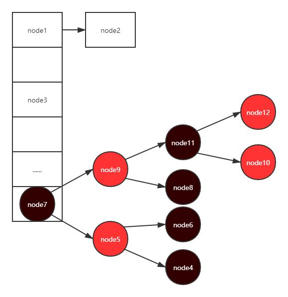

# JDK API

## hashMap

### HashMap 数据结构

整体上可以看作是数组+链表的形式。数组是为了进行快速检索，而如果hash函数冲突了的话，就会在同一个位置处后面进行挂链表的操作

转换红黑树：

其中MIN_TREEIFY_CAPACITY的值为64，也就是说当前数组中的长度（也就是桶bin的个数）必须大于等于64的时候，同时当前这个链表的长度大于等于8（TREEIFY_THRESHOLD）的时候，才能转化

### 1.7&1.8的区别

| 不同         | 1.7                        | 1.8                                |
| ------------ | -------------------------- | ---------------------------------- |
| 存储结构     | 数组+链表                  | 数组+链表+红黑树                   |
| 存放规则     | 无冲突放数组，有冲突放链表 | 无冲突放数组，有冲突放 链表/红黑树 |
| 链表插入方式 | 头插法                     | 尾插法                             |

### Hashmap扩容为什么都是二倍扩容，容量总为2的n次幂

因为Hashmap计算存储位置时，使用了(n - 1) & [hash](https://so.csdn.net/so/search?q=hash&spm=1001.2101.3001.7020)。只有当容量n为2的幂次方，n-1的二进制会全为1，位运算时可以充分散列，避免不必要的哈希冲突，所以扩容必须2倍就是为了维持容量始终为2的幂次方。

### HashMap和Hashtable的区别

- 相同点

1. hashmap和Hashtable都实现了map、Cloneable（可克隆）、Serializable（可序列化）这三个接口

- 不同点

1. Hashtable 是不允许键或值为 null 的，HashMap 的键值则都可以为 null
2. Hashtable是同步(synchronized)的，适用于多线程环境

## ThreadLocal

- ThreadLocal叫做***线程变量***，意思是ThreadLocal中填充的变量属于**当前线程**，该变量对其他线程而言是隔离的

- 实际上 ThreadLocalMap 中使用的 key 为 ThreadLocal 的弱引用，弱引用的特点是，如果这个对象只存在弱引用，那么在下一次垃圾回收的时候必然会被清理掉。

  所以如果 ThreadLocal 没有被外部强引用的情况下，在垃圾回收的时候会被清理掉的，这样一来 ThreadLocalMap中使用这个 ThreadLocal 的 key 也会被清理掉。但是，value 是强引用，不会被清理，这样一来就会出现 key 为 null 的 value

## FastThreadLocal

