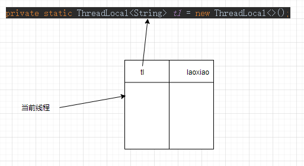
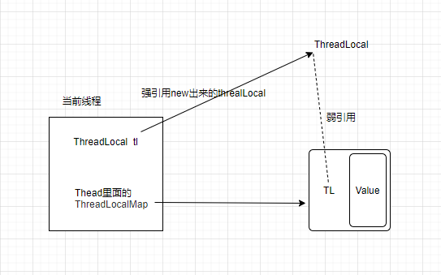

#

# ThreadLocal

## 使用方式


```java
private static ThreadLocal<String> tl = new ThreadLocal<>();

public void before() {
    tl.set("laoxiao");
}
```

## 基本结构

- 如下：每个线程类都有一个成员变量，ThreadLocal.ThreadLocalMap，里面存储的就是key-value的threadlocalset的值

```java
public
class Thread implements Runnable {
    //每个thread都会有这个属性
    ThreadLocal.ThreadLocalMap threadLocals = null;
```


- 当set的时候，先获取当前线程的ThreadLocalMap

```java
public void set(T value) {
    Thread t = Thread.currentThread();
    //从当前线程中获取map
    ThreadLocalMap map = getMap(t);
    if (map != null)
        map.set(this, value);
    else
        createMap(t, value);
}
```

- 在set的时候，可以看到new了一个Entry

```java
private void set(ThreadLocal<?> key, Object value) {
    Entry[] tab = table;
    tab[i] = new Entry(key, value);
}
```

- Entry，实现了弱引用，而弱应用指向了当前的key（ThreadLocal）

```java
static class Entry extends WeakReference<ThreadLocal<?>> {  
    Object value;
    Entry(ThreadLocal<?> k, Object v) {
        super(k);
        value = v;
    }
}
```

- value 即我们set的值
- 当threadlocal强引用（即定义的时候）断开后，弱引用GC后就会垃圾回收，value还没有被回收，所以还是需要手动remove



## Hash冲突解决

1. 初始化ThreadLocalMap

```java
ThreadLocalMap(ThreadLocal<?> firstKey, Object firstValue) {
    // 初始化table
    table = new Entry[INITIAL_CAPACITY];
    //计算缩影
    int i = firstKey.threadLocalHashCode & (INITIAL_CAPACITY - 1);
    //设置值
    table[i] = new Entry(firstKey, firstValue);
    size = 1;
    setThreshold(INITIAL_CAPACITY);
}
```

2.  firstKey.threadLocalHashCode的计算方式

```java
private static AtomicInteger nextHashCode =
    new AtomicInteger();
//每次获取值都会 加上一个hash散列值
private static int nextHashCode() {
    return nextHashCode.getAndAdd(HASH_INCREMENT);
}
```

3. set方法中，采用线性探测法解决冲突

```java
for (Entry e = tab[i];
     e != null;
     e = tab[i = nextIndex(i, len)]) {
    ThreadLocal<?> k = e.get();
```

该方法一次探测下一个地址，直到有空的地址后插入，若整个空间都找不到空余的地址，则产生溢出。
举个例子，假设当前table长度为16，也就是说如果计算出来key的hash值为14，如果table[14]上已经有值，并且其key与当前key不一致，那么就发生了hash冲突，这个时候将14加1得到15，取table[15]进行判断，这个时候如果还是冲突会回到0，取table[0],以此类推，直到可以插入。

## ThreadLocalMap扩容机制

添加了元素后，会判断当前下标往后的元素是否存在需要value回收的，如果不存在需要回收并且当前总元素大于等于阈值，那么就会调用rehash()扩容。扩容之前还会再重新对key已经被GC了的元素进行回收，回收后如果总数还是大于等于阈值的3/4，那么就会调用resize()进行真正的扩容

```java
tab[i] = new Entry(key, value);
int sz = ++size;
if (!cleanSomeSlots(i, sz) && sz >= threshold)
    rehash();
```
## 总结

ThreadLocal通过每个线程持有的ThreadLocalMap实现数据隔离。该Map的Key是ThreadLocal的弱引用，Value是线程本地变量。当调用get()时，通过当前线程获取Map，再以ThreadLocal实例为Key查找值

# FastThreadLocal

在java线程中，每个线程都有一个ThreadLocalMap实例变量（如果不使用ThreadLocal，不会创建这个Map，一个线程第一次访问某个ThreadLocal变量时，才会创建）。该Map是使用线性探测的方式解决hash冲突的问题，如果没有找到空闲的slot，就不断往后尝试，直到找到一个空闲的位置，插入entry，这种方式在经常遇到hash冲突时，影响效率。

FastThreadLocal(下文简称ftl)直接使用数组避免了hash冲突的发生，具体做法是：每一个FastThreadLocal实例创建时，分配一个下标index；分配index使用AtomicInteger实现，每个FastThreadLocal都能获取到一个不重复的下标。当调用ftl.get()方法获取值时，直接从数组获取返回，如return array[index]


Netty 的 FastThreadLocal 是一个高性能的线程本地变量实现，它与 Java 标准库中的 ThreadLocal 类似，但具有更高的性能和更低的内存消耗

# LinkedeList和ArrayList

> ArrayList

ArrayList内部是一个elementData的数组

在初始化指定或不指定是，ArrayList的大小size=0

```java
public ArrayList(int initialCapacity) {
    if (initialCapacity > 0) {
        this.elementData = new Object[initialCapacity];
    } else if (initialCapacity == 0) {
        this.elementData = EMPTY_ELEMENTDATA;
    } else {
        throw new IllegalArgumentException("Illegal Capacity: "+
                                           initialCapacity);
    }
}

/**
 * Constructs an empty list with an initial capacity of ten.
 */
public ArrayList() {
    this.elementData = DEFAULTCAPACITY_EMPTY_ELEMENTDATA;
}
```


> LinkedList

LinkedList的成员变量有Node<E> first和Node<E> last，Node.class是LinkedList内部私有静态类

```java
//指向第一个节点
transient Node<E> first;
//指向最后一个节点
transient Node<E> last;
 private static class Node<E> {
        //当前节点
        E item;
        //下一个节点
        Node<E> next;
        //上一个节点
        Node<E> prev;

        Node(Node<E> prev, E element, Node<E> next) {
            this.item = element;
            this.next = next;
            this.prev = prev;
        }
    }
```

注意点：

1. 遍历LinkedList必须使用iterator不能使用for循环，因为每次for循环体内通过get(i)取得某一元素时都需要对list重新进行遍历，性能消耗极大。
2. 另外不要试图使用indexof等返回元素索引，并利用其进行遍历，使用indexlOf对list进行了遍历，当结果为空时会遍历整个列表。

> 总结

1. LinkedList是一个双向链表，内部维护了Node节点，分别指向prev上一个节点和item当前节点，next下一个节点
2. LinkedList就插入(add(index))，删除(remove(index))，查找(get(index))都要进行循环遍历节点，去获取index位置的节点，这里采用的node函数判断了长度的一半，进行前后遍历才节省遍历时间
3. ArrayList：就插入，和删除，都要进行数组的System.arrayCopy操作，进行数组的挪移，插入还要校验扩容

# final

1. 修饰类:表示类不可被继承

2. 修饰方法:表示方法不可被子类覆盖，但是可以重载修饰变量

3. 修饰变量：—旦被赋值就不可以更改它的值。
   1. 全局变量：必须声明的时候赋值或者构造器/代码块赋值
   2. 全局静态变量：必须声明/静态代码块赋值
   3. 局部变量：在使用之前赋值（只能赋值一次，定义的时候没赋值没关系，但使用之前一定要赋值一次）

> 为什么局部内部类和匿名类只能访问局部final变量

1. 局部内部类和匿名内部类编译在编译之后会生成两个class,所以，内部类和外部类都是同一级别，不会随着外面的方法执行完了，里面的class回收
2. 如果外部类方法结束，局部变量就销毁了，但是内部类对象还存在，此时如果内部类使用这个变量就会有问题
3. jvm为了解决这个这个问题，就将局部变量复制一份放到内部类中，此时，为了保证两个变量一致，所以外面的就不能再修改

# HashMap和HashTable

HashMap方法没有synchronized修饰，线程非安全，

HashTable线程安全;HashMap允许key和value为null，而HashTable不允许