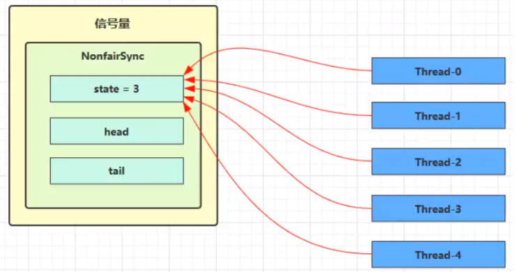

# 
# AQS

全称是AbstractQueuedSynchronizer，是阻塞式锁(如synchronized 就是阻塞的锁，cas不是)和相关的同步器工具的框架

## 三个核心内容

> state

1. **用state属性来表示资源的状态**（分独占模式（只有一个线程可以占用）和共享模式)，子类需要定义如何维护这个状态，控制如何获取锁和释放锁
   1. 对于独占锁，state 表示锁的持有状态（0 表示未持有，1 表示持有）。
   2. 对于共享锁，state 表示当前持有的读锁数量。

> Node组成的双向链表

1. 提供了基于FIFO（先进先出）的等待队列，类似于Monitor的EntryList
2. 为什么要双向链表：如过非公平锁，则从尾部开始寻找等待唤醒的节点


> Node组成的单向链表

条件变量来实现等待、唤醒机制，支持多个条件变量，类似于Monitor的WaitSet


AQS定义两种资源共享方式：Exclusive（独占，只有一个线程能执行，如ReentrantLock）和Share（共享，多个线程可同时执行，如Semaphore/CountDownLatch）

## 模板方法

isHeldExclusively()：该线程是否正在独占资源。只有用到condition才需要去实现它。
tryAcquire(int)：独占方式。尝试获取资源，成功则返回true，失败则返回false。
tryRelease(int)：独占方式。尝试释放资源，成功则返回true，失败则返回false。
tryAcquireShared(int)：共享方式。尝试获取资源。负数表示失败；0表示成功，但没有剩余可用资源；正数表示成功，且有剩余资源。
tryReleaseShared(int)：共享方式。尝试释放资源，如果释放后允许唤醒后续等待结点返回true，否则返回false。


## 加锁基本原理

重写AbstractQueuedSynchronizer.tryAcquire,来对AbstractQueuedSynchronizer.state状态进行修改

调用AbstractQueuedSynchronizer.tryAcquire判断能不能修改成功，用来判断是否加锁成功

```java
// 如果获取锁失败
if (!tryAcquire(arg)) {
// 入队, 可以选择阻塞当前线程 park unpark
}
```

- 释放锁的姿势

```java
// 如果释放锁成功
if (tryRelease(arg)) {
// 让阻塞线程恢复运行
}
```

## AQS基本实现

getState()、setState()和 compareAndSetState()，均是原子操作,用来对state字段进行操作

### 基本流程


### 代码片段

这段代码，在compareAndSetState失败后，没有做wait处理，如果想看wait处理可以参考ReentrantLock

```java
public static void main(String[] args) {
    MyLock lock = new MyLock();
    new Thread(() -> {
        lock.lock();
        log.debug("线程执行中....");
        sleep(2000);
        lock.unlock();
    }).start();
    new Thread(() -> {
        lock.lock();
        log.debug("线程执行中....");
        lock.unlock();
        log.debug("解锁成功");
    }).start();
}

static class MyLock implements Lock {
    //自定义同步器
    class MySync extends AbstractQueuedSynchronizer {
        @Override
        protected boolean tryAcquire(int arg) {
            //尝试加锁，
            if(compareAndSetState(0, arg)) {
                //设置锁拥有的线程为当前线程
                setExclusiveOwnerThread(Thread.currentThread());
                return true;
            }
            return false;
        }

        @Override
        protected boolean tryRelease(int arg) {
            //尝试解锁
            setExclusiveOwnerThread(null);
            //此处不需要cas是因为只有一个线程会释放锁
            setState(0);
            return true;
        }

        @Override
        protected boolean isHeldExclusively() {
            //是否持有独占锁
            return getState()==1;
        }

        public Condition newCondition() {
            return new ConditionObject();
        }
    }

    MySync mySync = new MySync();
    @Override
    public void lock() {
        //尝试，不成功，进入等待队列
        mySync.acquire(1);
    }

    @Override
    public void lockInterruptibly() throws InterruptedException {
        //尝试一次，不成功返回，不进入队列
        mySync.acquireInterruptibly(1);
    }

    @Override
    public boolean tryLock() {
        //尝试一次，不成功返回，不进入队列
        return mySync.tryAcquire(1);
    }

    @Override
    public boolean tryLock(long time, TimeUnit unit) throws InterruptedException {
        //尝试，不成功，进入等待队列，有时限
        return mySync.tryAcquireNanos(1, unit.toNanos(time));
    }

    @Override
    public void unlock() {
        mySync.release(1);
    }

    @Override
    public Condition newCondition() {
        return mySync.newCondition();
    }
}
```

# ReentrantLock

## 特点

1. 可中断（如A线程持有锁，B线程可以中断他）

trylock也可以被打断，被打断抛出异常

```java
//尝试去获取锁，当有竞争时，进入阻塞队列
//当其他线程调用打断时，抛出异常
lock.lockInterruptibly();
```


2. 设置超时时间

超时未获取到锁则返回false

```java
lock.tryLock(1, TimeUnit.SECONDS)
```

3. 可以设置为公平锁（可以防止线程饥饿问题） 
4. 支持多个条件变量 
5. 可重入   

```java
public static void method1() {
    lock.lock();
    try {
        method2();
    } finally {
        lock.unlock();
    }
}
public static void method2() {
    lock.lock();
    try {

    } finally {
        lock.unlock();
    }
}
```

## 公平锁

- 按照获取尝试获取锁的顺序给予资源（*先尝试获取锁的线程优先持有锁，*）
- 通过构造方法创建公平锁

```java
ReentrantLock lock = new ReentrantLock(true);
```

- 公平锁会降低并发度

## 条件变量

- 类似synchronized的wait
- 使用方式：

1. 必须在lock中使用
2. 创建某个条件（将来调用await方法的线程都会进入这个条件中阻塞）
3. 调用await方法，进入阻塞
4. 另外一个线程调用signal唤醒，线程去竞争锁

```java
//一把锁可以创建多个条件
Condition condition1 = lock.newCondition();
Condition condition2 = lock.newCondition();

condition1.await();
//唤醒某一个锁
condition1.signal();
```

# ReentrantLock原理

ReentrantLock，有个内部抽象类Sync，Sync有两个实现，公平锁和非公平锁的实现

## 非公平锁原理

- 构造器中，默认实现的sync是一个非公平的锁，他们都继承自AQS

```java
public ReentrantLock() {
    sync = new NonfairSync();
}
```

### 加锁过程

1. 没有锁竞争的时候


公平锁和非公平锁的区别

下面是非公平锁，有一个CAS替换state的操作，公平锁没有

```java
final void lock() {CAS替换
    if (compareAndSetState(0, 1))
        //CAS替换将状态改为1，线程设置当前线程
        setExclusiveOwnerThread(Thread.currentThread());
    else
        acquire(1);
}
```
2. 出现第一个锁竞争的时候   
   1.  acquire是AQS提供的，不区分公平和非公平了
   2. tryAcquire：再次尝试拿锁，子类公平锁和非公平锁有具体实现
   3. addWaiter：没拿到锁，构造 Node 队列  ，进行排队操作，进入双向链表中
   4. acquireQueued：

```java
public final void acquire(int arg) {
    
    if (!tryAcquire(arg) &&
        acquireQueued(addWaiter(Node.EXCLUSIVE), arg))
        selfInterrupt();
}
```
 

#### tryAcquire流程

tryAcquire流程：下面是非公平锁代码

1. c==0,没线程持有锁，cas将state改为1，成功将当前线程赋值给<b id="blue">exclusiveOwnerThread</b>
2. 锁被某个线程持有，如果是自己线程，[则进入重入锁流程](/java/java-base/concurrent/4-juc-lock?id=重入锁原理)

```java
final boolean nonfairTryAcquire(int acquires) {
    final Thread current = Thread.currentThread();
    int c = getState();
    if (c == 0) {
        if (compareAndSetState(0, acquires)) {
            setExclusiveOwnerThread(current);
            return true;
        }
    }
    else if (current == getExclusiveOwnerThread()) {
        int nextc = c + acquires;
        if (nextc < 0) // overflow
            throw new Error("Maximum lock count exceeded");
        setState(nextc);
        return true;
    }
    return false;
}
```

非公平锁逻辑：就多了hasQueuedPredecessors()代码

hasQueuedPredecessors:查询双向链表有没有线程排队，如果有线程排队，则不能抢这个锁

```java
protected final boolean tryAcquire(int acquires) {
    final Thread current = Thread.currentThread();
    int c = getState();
    if (c == 0) {
        if (!hasQueuedPredecessors() &&
            compareAndSetState(0, acquires)) {
            setExclusiveOwnerThread(current);
            return true;
        }
    }
```

####  addWaiter过程

1. 当还没有线程进入上下链表的时候，pred=null,进入enq流程

```java
private Node addWaiter(Node mode) {
    Node node = new Node(Thread.currentThread(), mode);
    // Try the fast path of enq; backup to full enq on failure
    Node pred = tail;
    if (pred != null) {
        node.prev = pred;
        if (compareAndSetTail(pred, node)) {
            pred.next = node;
            return node;
        }
    }
    enq(node);
    return node;
}
```

2.  enq流程
   1. 第一次，设置一个空的Node（称为 Dummy（哑元）或哨兵）,进行占位， 并不关联线程，CAS方式head设置成空node    
   2. 第二次以后得循环，通过CAS的方式，将当前的Node赋值成尾部节点

```java
private Node enq(final Node node) {
    for (;;) {
        Node t = tail;
        if (t == null) { 
            //如果头结点=null,则设置node
            if (compareAndSetHead(new Node()))
                tail = head;
        } else {
            node.prev = t;
            //如果为节点=t,则将尾节点设置成node
            if (compareAndSetTail(t, node)) {
                // 原尾节点后继指向新节点
                t.next = node;
                return t;
            }
        }
    }
}
```

0表示正常状态，-1表示有责任唤醒下一个线程


#### 线程挂起流程

其实就是acquireQueued流程

1. 如果当前节点的上一个节点==Head,那么再尝试tryAcquire尝试拿锁
   1. 拿锁成功，抛弃之前的头结点，将当前的节点设置成头结点（就是当前node的线程设置成null）
2. 拿锁失败，shouldParkAfterFailedAcquire：做挂起前的准备

```java
final boolean acquireQueued(final Node node, int arg) {
    //拿锁的标识
    boolean failed = true;
    try {
        for (;;) {
            //获取当前线程节点的上一个节点
            final Node p = node.predecessor();
            if (p == head && tryAcquire(arg)) {
                setHead(node);
                p.next = null; // help GC
                failed = false;
                return interrupted;
            }
            if (shouldParkAfterFailedAcquire(p, node) &&
                parkAndCheckInterrupt())
                interrupted = true;
        }
    } finally {
        if (failed)
            cancelAcquire(node);
    }
}
```

进入 parkAndCheckInterrupt， park当前线程， Thread-1 park（灰色表示park当前线程）  


### 释放锁原理

需要注意unparkSuccessor方法，如果唤醒线程时，发现要唤醒的head.next为取消状态（waitStatus>0）,他是从尾部开始往前寻找可以唤醒的节点

```java
public final boolean release(int arg) {
    if (tryRelease(arg)) {
        Node h = head;
        if (h != null && h.waitStatus != 0)
            unparkSuccessor(h);
        return true;
    }
    return false;
}
```
Thread-0 释放锁，进入 tryRelease 流程，如果成功  
1. 设置 exclusiveOwnerThread 为 null ,state =0 
2. 当前队列不为 null，并且 head 的 waitStatus = -1，进入unparkSuccessor 流程,找到队列中离 head 最近的一个 Node（没取消的），unpark 恢复其运行，本例中即为 Thread-1  

3. 此时如果有另外一个线程来竞争，则会体现非公平锁的特征(thread1和thread4同时竞争)


## 重入锁原理

### 加锁原理
当发现锁重入时，state+1
```java
final boolean nonfairTryAcquire(int acquires) {
    final Thread current = Thread.currentThread();
    int c = getState();
    if (c == 0) {
        if (compareAndSetState(0, acquires)) {
            setExclusiveOwnerThread(current);
            return true;
        }
    }
    //如果已经获得了锁, 线程还是当前线程, 表示发生了锁重入
    else if (current == getExclusiveOwnerThread()) {
        // state++
        int nextc = c + acquires;
        if (nextc < 0) //超过Interge.Max,反制锁冲入太深
            throw new Error("Maximum lock count exceeded");
        setState(nextc);
        return true;
    }
    return false;
}
```

### 解锁流程

```java
protected final boolean tryRelease(int releases) {
    int c = getState() - releases;
    if (Thread.currentThread() != getExclusiveOwnerThread())
        throw new IllegalMonitorStateException();
    boolean free = false;
    // 支持锁重入, 只有 state 减为 0, 才释放成功
    if (c == 0) {
        free = true;
        setExclusiveOwnerThread(null);
    }
    setState(c);
    return free;
}
```

## 条件变量实现原理 
### await原理
由图可以看到 ConditionObject 结构也是个双向链表
1. 开始 Thread-0 持有锁，Thread-0 调用 await，进入 ConditionObject 的 addConditionWaiter 流程；创建新的 Node 状态为-2（Node.CONDITION），关联 Thread-0，加入等待队列尾部  
2. park 阻塞 Thread-0 ，  阻塞队列Thread-1，竞争到锁    

### signal原理 
假设 Thread-1 要来唤醒 Thread-0  

1. 进入 ConditionObject 的 doSignal 流程，取得等待队列中第一个 Node，即 Thread-0 所在 Node  
2. 将该 Node 加入 AQS 队列尾部，将 Thread-0 的 waitStatus 改为 0，Thread-3 的waitStatus 改为 -1  （表示它有责任唤醒THread-0） 


# 读写锁

1. ReentrantReadWriteLock  
2. 让读-读并发，其他的互斥  
3. **需要注意的是，readlock里面，在unlock之间，不能嵌套WriteLock**
## 使用示例
```java
static class Container {
    ReentrantReadWriteLock rw =  new ReentrantReadWriteLock();
    ReentrantReadWriteLock.ReadLock r = rw.readLock();
    ReentrantReadWriteLock.WriteLock w = rw.writeLock();
    public void read() {
        r.lock();
        try {
            log.debug("开始读.....");
            sleep(1000);
        } finally {
            r.unlock();
        }
    }
    public void writer() {
        w.lock();
        try {
            log.debug("开始写.....");
            sleep(1000);
        } finally {
            w.unlock();
        }
    }
}
```

## 注意事项

- 读锁不支持条件变量  
- 重入时升级不支持：即持有读锁的情况下去获取写锁，会导致获取写锁永久等待 
- 重入时降级支持：即持有写锁的情况下去获取读锁  

## 应用

- 读写锁可以应用在缓存中
- 如：查询的时候只需要加读锁，当进行缓存更新时，添加写锁

## 原理

- 成功上锁，流程与 ReentrantLock 加锁相比没有特殊之处，不同是写锁状态占了 state 的低 16 位，而读锁使用的是 state 的高 16 位  

# StampedLock
1. 该类自 JDK 8 加入，是为了进一步优化读性能，它的特点是在使用读锁、写锁时都必须配合【搓】使用  
2. 读的时候先验证下戳，如果戳没有改动，则证明，没有其他锁产生，此时不需要再进行加锁 

- StampedLock 不支持条件变量  
- StampedLock 不支持可重入 

```java
public static class Container {
    StampedLock lock = new StampedLock();
    public String read() {
        //进行乐观读，获取戳
        long stamp = lock.tryOptimisticRead();
        //模拟做了很多不可描述的事情
        //此时可能发生其他锁产生
        sleep(1000);
        //验戳
        if(lock.validate(stamp)) {
            log.debug("==> 中间没有发生其他锁");
            return "直接读出来的";
        }
        //验证失败，此时锁升级成读锁
        try {
            log.debug("==> 开始锁升级");
            stamp = lock.readLock();
            sleep(1000);
            log.debug("==> 读锁后产生的数据");
            return "==> 读锁后产生的数据";
        } finally {
            lock.unlock(stamp);
        }
    }
    public void writer() {
        long stamp = lock.writeLock();
        try {
            sleep(2000);
            log.debug("==> 开始写事件");
        } finally {
            lock.unlock(stamp);
        }
    }
}
```
# Semaphore 
信号量，用来限制能同时访问共享资源的线程上限（同一个时刻，范围这个资源的限制）

- 只能限制线程数，不能限制资源数
- 如果线程数和资源数对应（如连接池），可以采用

```java
//当线程满了三个之后，线程阻塞
Semaphore semaphore = new Semaphore(3);
for(int i=0; i < 30; i++) {
    new Thread(() -> {
        try {
            semaphore.acquire();
        } catch (InterruptedException e) {
            e.printStackTrace();
        }
        try {
            log.debug("==> 开始执行");
            sleep(1000);
        } finally {
            semaphore.release();
        }
    }).start();
}
```

## 原理

- permits(线程的限制数量)赋值给state
- 当state<0时，其他线程阻塞
- 如：thread3 thread4竞争失败，进入AQS队列park阻塞




# Countdownlatch

用来进行线程同步协作，等待所有线程完成倒计时  
其中构造参数用来初始化等待计数值，await() 用来等待计数归零，countDown() 用来让计数减一  

## API
```java
CountDownLatch(int count) //实例化一个倒计数器，count指定计数个数
countDown() // 计数减一
await() //等待，当计数减到0时，所有线程并行执行
```

## 示例

```java
CountDownLatch countDownLatch = new CountDownLatch(3);
for (int i=1; i<=3; i++) {
    int iTmp = i;
    new Thread(() -> {
        sleep(iTmp*1000);
        countDownLatch.countDown();
        log.debug("==> 一个线程执行");
    }).start();
}
try {
    log.debug("==> waiting");
    countDownLatch.await();
    log.debug("==> 等待结束");
} catch (InterruptedException e) {
    e.printStackTrace();
}
```

## 使用场景

- 如：游戏组队，需要所有的队员都加载完毕才能进入游戏

# CyclicBarrier

- 让一组线程到达一个屏障点进入阻塞线程，阻塞线程执行完再唤醒业务线程
- 它是可以重用的

```java
Runnable runnable = new Runnable() {
    public void run() {
        System.out.println("召唤神龙");
    }
};
//当达到7时，进入阻塞线程
final  CyclicBarrier cyclicBarrier = new CyclicBarrier(7, runnable);
for(int i=1; i<=7; i++){
    final int tmp = i;
    new Thread(new Runnable() {
        public void run() {
            System.out.println("第"+tmp);
            try{
                //使cyclicBarrier+1
                cyclicBarrier.await();
            }catch(Exception e){
            }
        }
    }).start();
}
```

