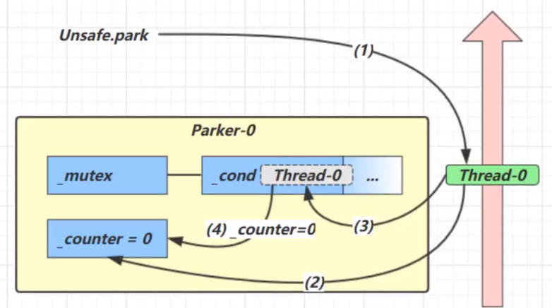
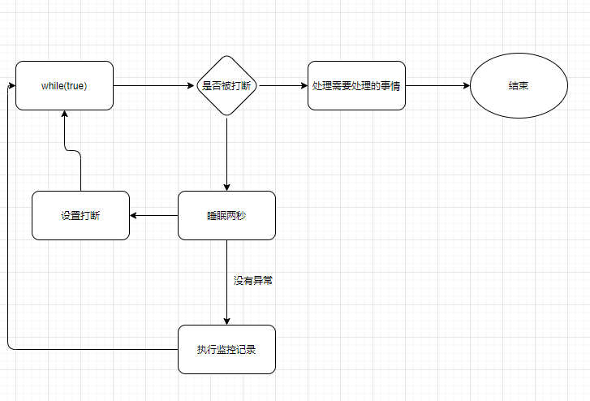
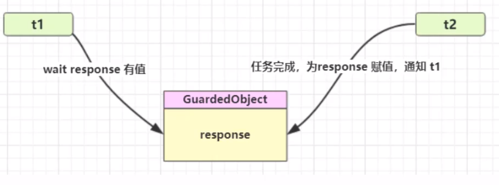

# 线程间通信


# yield

- 可以使线程从Running进入Runnable状态 

# join

- 阻塞等待线程结束

```java
//主线程同步等待t1线程
Thread t1 = new Thread(() -> {
    try {
        TimeUnit.SECONDS.sleep(1);
    } catch (InterruptedException e) {
        e.printStackTrace();
    }
    log.debug("t1 执行结束");
});
t1.start();
//等待t1线程结束后，在执行下面的代码
t1.join();
log.debug("main 执行结束");
```

- 有时效的等待
  - java.lang.Thread#join(long)
  - 最多等待long毫秒

# interrupt

- 打断sleep，wait, join 的线程
- 当睡眠中打断后，打断标识：false，正常过程，设置打断，标识为true

```java
Thread t1 = new Thread(() -> {
    try {
        TimeUnit.SECONDS.sleep(1);
    } catch (InterruptedException e) {
        e.printStackTrace();
    }
    log.debug("t1 执行结束");
});
t1.start();
t1.interrupt();
log.debug("打断标识： {}", t1.isInterrupted());
```

输出结果

```tex
打断标识： true
t1 执行结束
```

-  isInterrupted:判断是否打断，执行后不清除标记
-  Thread.interrupted()：返回打断标记，但是返回打断标记以后会清除打断标记


# wait | notify

- Monitor中Owner线程发现条件不满足，调用wait方法，即可进入WaitSet变为WAITING状态
- WAITING线程会在Owner线程调用notify或notifyAll 时唤醒，但唤醒后并不意味者立刻获得锁，仍需进入**EntryList重新竞争**

> Api

- obj.wait()让进入object 监视器的线程到waitSet等待

```java
synchronized (LOCK) {
    //当前线程必须要获得了这个锁才能调用
    LOCK.wait();
}
```

- notify()仅唤醒一个等待该对象锁的线程，而notifyAll()会唤醒所有等待该对象锁的线程

> sleep和wait区别

- sleep不会释放锁，wait会释放锁
- sleep是 Thread方法，而wait是Object的方法
- sleep不需要强制和synchronized配合使用，**但wait需要和synchronized一起用**

> 虚假唤醒

- 同一个锁下面，其他线程调用了notifyAll，但是当前线程并不满足唤醒条件，这时，就导致了虚假唤醒
  -  比如：仓库有货了才能出库，突然仓库入库了一个货品；这时所有的线程（货车）都被唤醒，来执行出库操作；实际上只有一个线程（货车）能执行出库操作，其他线程都是虚假唤醒 

比如这段代码，在wait后唤醒，两个线程同时执行--product，此时，可能导致两个product为负数，因为此时没有再判断product的值

```java
if (product <= 0) {
    System.out.println(Thread.currentThread().getName() + ": " + "库存不足，无法出库");
    try {
        this.wait();
    } catch (InterruptedException e) {
        // ignore exception
    }
}
--product;
```

-  解决方法
  - 使用while循环去循环判断一个条件，而不是使用if只判断一次条件；即wait()要在while循环中。 

  - 使用正确姿势

```java
synchronized (LOCK) {
    while(条件不成立) {
    	LOCK.wait();
    }
    //做事情
}
//另一个线程
synchronized (LOCK) {
    LOCK.notifyall();
}
```

> wait | notify 原理

*wait: 将线程放入monitor的wait队列中，进行阻塞
notifyall: 将monitor的wait队列中的待处理线程放入entrylist，让其也可以继续竞争锁*


# park$unpark

- 基本用法

```java
//暂停当前线程
LockSupport.park();
//回去暂停的线程
LockSupport.unpark(暂停的线程);
```

- unpark可以在park之前调用
  - 如下：park之后能里面通过

```java
Thread t1 = new Thread(() -> {
    sleep(2000);
    log.debug("==>park");
    LockSupport.park();
    log.debug("==>has unpark");
});
t1.start();
sleep(1000);
log.debug("==>unpark");
LockSupport.unpark(t1);
```

- park是以线程为单位，更加精准；notify是所有线程都通知

> park$unpark原理

- 每个thread都有一个park对象

- 当前线程调用Unsafe.park()方法

1. 检查_counter，如果counter=0，这时，获得_mutex互斥锁
2. 进入阻塞队列_cond条件变量阻塞
3. 再设置_counter = 0



- 调用unpark

1. 设置_counter=1
2. 唤醒条件变量中_cond对应的线程
3. thread0恢复运行之后，设置counter=0

- 先调用unpark再调用park

1. 调用unpark，设置_counter=1
2. 调用park，发现_counter=1,线程无需阻塞，继续运行，然后设置__couter=0


# interrupt对park的影响

- park作用是让线程阻塞

```java
Thread t1 = new Thread(() -> {
    //线程阻塞，等待打断
    LockSupport.park();
    log.debug("interrupt: {}", Thread.currentThread().isInterrupted());
    //线程不阻塞，因为线程打断标识=true
    LockSupport.park();
    //清除打断标识
    log.debug("interrupt: {}", Thread.interrupted());
    //线程阻塞
    LockSupport.park();
    log.debug("interrupt: {}", Thread.currentThread().isInterrupted());
});
t1.start();
Thread.sleep(1000);
t1.interrupt();
Thread.sleep(1000);
```


# 两阶段终止模式

- 在线程t1中，优雅的结束线程t2(优雅指的是：让t2做完自己该做的事情后结束线程)

## 错误思路

- 使用线程对象的stop方法
  - 会真正的杀死线程，当线程锁住某个资源时被杀死，那么此线程会没法释放锁
- 使用System.exit方法
  - 会停止整个程序

## 常见解决方案

- 如：需要做一个监控，当需要停止这个监控时，只需要对这个线程设置打断
- 睡眠2秒为了避免循环耗尽资源
- 出现异常设置打断是因为：睡眠阶段打断标识会抛出异常，并且打断标识为false



```java
private static Thread monitor;
public static void main(String[] args) throws InterruptedException {
    start();
    TimeUnit.SECONDS.sleep(10);
    stop();
}
public static void start() {
    monitor = new Thread(() -> {
        while (true) {
            Thread thread = Thread.currentThread();
            if(thread.isInterrupted()) {
                log.debug("==>处理一些事情后退出线程...");
                break;
            }
            try {
                TimeUnit.SECONDS.sleep(3);
            } catch (InterruptedException e) {
                thread.interrupt();
            }
            log.debug("==>正在执行监控记录...");
        }
    });
    monitor.start();
}
public static void stop() {
    monitor.interrupt();
}
```


# 保护性暂停模式

用在一个线程等待另一个线程的执行结果



```java
public class TestGuardedObject {

    public static void main(String[] args) {
        GuardedObject object = new GuardedObject();
        new Thread(() -> {
            log.debug("获取到结果：{}", object.get());
        }).start();

        new Thread(() -> {
            log.debug("开始运行设置结果...");
            object.set("laoxiao");
        }).start();
    }

}

class GuardedObject {
    private Object response;

    public Object get() {
        synchronized (this) {
            while (response == null) {
                try {
                    this.wait();
                } catch (InterruptedException e) {
                    e.printStackTrace();
                }
            }
            return response;
        }
    }
    public void set(Object object) {
        synchronized (this) {
            try {
                TimeUnit.SECONDS.sleep(10);
            } catch (InterruptedException e) {
                e.printStackTrace();
            }
            this.response = object;
            this.notify();
        }
    }
}
```


# 消费者生产者模式

- 与前面的保护性暂停中的GuardObject 不同，不需要产生结果和消费结果的线程一一对应

代码示例中，一个消费者，对应多个生产者

```java
@Slf4j
public class TestMessage {

    public static void main(String[] args) {
        MessageQueue<Message> queue = new MessageQueue<>(2);
        for(int i=0; i<3; i++) {
            int id = i;
            new Thread(() -> {
                queue.put(new Message(id, "消息："+id));
            }).start();
        }

        new Thread(() -> {
            while (true) {
                Message message = queue.pop();
                log.debug("获取到消息: {}", message);
            }
        }).start();
    }
}

class MessageQueue<T> {
    private LinkedList<T> list;

    private int capacity;

    public MessageQueue(int capacity) {
        this.list = new LinkedList();
        this.capacity = capacity;
    }

    public void put(T message) {
        synchronized (list) {
            while (capacity < list.size()) {
                try {
                    list.wait();
                } catch (InterruptedException e) {
                    e.printStackTrace();
                }
            }
            list.addLast(message);
            list.notifyAll();
        }

    }

    public T pop() {
        synchronized (list) {
            while (list.size() <= 0) {
                try {
                    list.wait();
                } catch (InterruptedException e) {
                    e.printStackTrace();
                }
            }
            T message = list.remove();
            list.notifyAll();
            return message;
        }
    }

}

@ToString
@Getter
@Setter
@AllArgsConstructor
class Message {
    private int id;
    private String message;
}
```


# Condition

condition对象是依赖于lock对象的，意思就是说condition对象需要通过lock对象进行创建出来(调用Lock对象的newCondition()方法)

```java
class TaskQueue {
    private final Lock lock = new ReentrantLock();
    private final Condition condition = lock.newCondition();
    private Queue<String> queue = new LinkedList<>();

    public void addTask(String s) {
        lock.lock();
        try {
            queue.add(s);
            condition.signalAll();
        } finally {
            lock.unlock();
        }
    }

    public String getTask() {
        lock.lock();
        try {
            while (queue.isEmpty()) {
            condition.await();
        }
            return queue.remove();
        } finally {
            lock.unlock();
        }
    }
}
```

await() ：造成当前线程在接到信号或被中断之前一直处于等待状态。

boolean await(long time, TimeUnit unit) ：造成当前线程在接到信号、被中断或到达指定等待时间之前一直处于等待状态---》是否超时，超时异常

awaitNanos(long nanosTimeout) ：造成当前线程在接到信号、被中断或到达指定等待时间之前一直处于等待状态。返回值表示剩余时间，如果在nanosTimesout之前唤醒，那么返回值 = nanosTimeout - 消耗时间，如果返回值 <= 0 ,则可以认定它已经超时了。

awaitUninterruptibly() ：造成当前线程在接到信号之前一直处于等待状态。【注意：该方法对中断不敏感】。

awaitUntil(Date deadline) ：造成当前线程在接到信号、被中断或到达指定最后期限之前一直处于等待状态。如果没有到指定时间就被通知，则返回true，否则表示到了指定时间，返回返回false。

signal() ：唤醒一个等待线程。该线程从等待方法返回前必须获得与Condition相关的锁。

signalAll() ：唤醒所有等待线程。能够从等待方法返回的线程必须获得与Condition相关的锁。