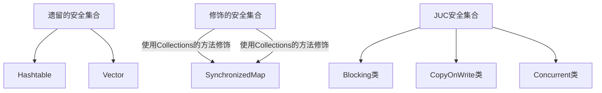
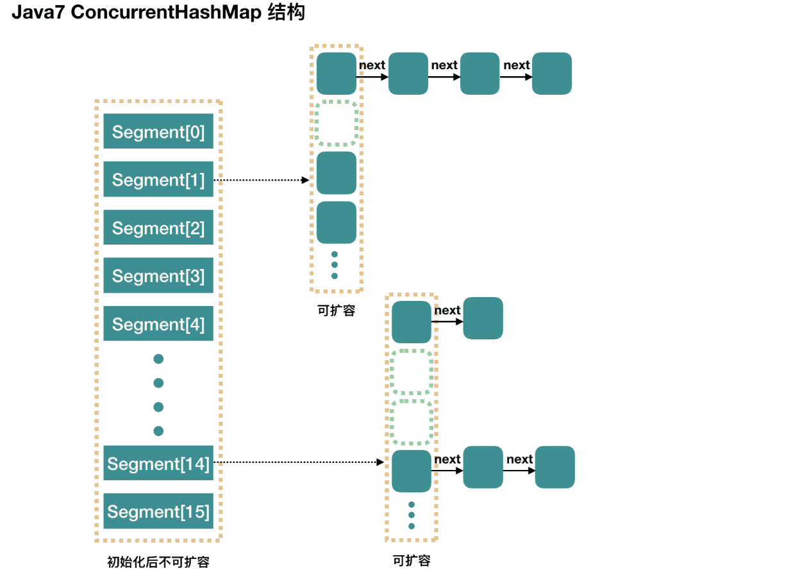

# 集合类



- Blocking 大部分实现基于锁，并提供用来阻塞的方法  
- CopyOnWrite 之类容器修改开销相对较重  
- Concurrent 类型的容器  

1. 内部很多操作使用 cas 优化，一般可以提供较高吞吐量  
2. 弱一致性  
   1. 遍历时弱一致性，例如，当利用迭代器遍历时，如果容器发生修改，迭代器仍然可以继续进行遍
      历，这时内容是旧的  
   2. 求大小弱一致性，size 操作未必是 100% 准确  

# ConcurrentHashMap

## 1.7版本



它维护了一个segment 数组，每个segment对应一把锁，Segment 通过继承 ReentrantLock 来进行加锁，所以每次需要加锁的操作锁住的是一个 segment，这样只要保证每个 Segment 是线程安全的，也就实现了全局的线程安全。

- 优点:如果多个线程访问不同的segment，实际是没有冲突的，这与jdk8中是类似的
- 缺点：Segments 数组默认大小为16，这个容量初始化指定后就不能改变了，并且不是懒惰初始化  

## 1.8版本

使用数组+链表+红黑树数据结构和CAS原子操作实现;

### 重要属性

```java
// 默认为 0
// 当初始化时, 为 -1
// 当扩容时, 为 -(1 + 扩容线程数)
// 当初始化或扩容完成后，为 下一次的扩容的阈值大小
private transient volatile int sizeCtl;
// 整个 ConcurrentHashMap 就是一个 Node[]
static class Node<K,V> implements Map.Entry<K,V> {}
// hash 表
transient volatile Node<K,V>[] table;
// 扩容时的 新 hash 表
private transient volatile Node<K,V>[] nextTable;
// 扩容时如果某个 bin 迁移完毕, 用 ForwardingNode 作为旧 table bin 的头结点
static final class ForwardingNode<K,V> extends Node<K,V> {}
// 用在 compute 以及 computeIfAbsent 时, 用来占位, 计算完成后替换为普通 Node
static final class ReservationNode<K,V> extends Node<K,V> {}
// 作为 treebin 的头节点, 存储 root 和 first
static final class TreeBin<K,V> extends Node<K,V> {}
// 作为 treebin 的节点, 存储 parent, left, right
static final class TreeNode<K,V> extends Node<K,V> {}
```


构造方法

- 参数：初始化大小，扩容的阈值（默认3/4）， 并发度
- 可以看到实现了懒惰初始化(JDK8)，在构造方法中仅仅计算了table的大小，以后在第一次使用时才会真正创建

```java
public ConcurrentHashMap(int initialCapacity,
                         float loadFactor, int concurrencyLevel) {
    if (!(loadFactor > 0.0f) || initialCapacity < 0 || concurrencyLevel <= 0)
        throw new IllegalArgumentException();
    //如果初始化大小小于并发度，那么就将并发度赋值给初始化大小
    if (initialCapacity < concurrencyLevel)
        initialCapacity = concurrencyLevel;   
    long size = (long)(1.0 + (long)initialCapacity / loadFactor);
    //因为size计算出来可能不是2^n,此处保证他是2^n（计算hash的要求）
    //所以我们构造传入的大小不一定是真实大小（current特点）
    int cap = (size >= (long)MAXIMUM_CAPACITY) ?
        MAXIMUM_CAPACITY : tableSizeFor((int)size);
    this.sizeCtl = cap;
}
```

### put流程

table 为存储hash数组，存储k-v的数据数组

```java
final V putVal(K key, V value, boolean onlyIfAbsent) {
    //key不能有空值（与hashmap不同）
    if (key == null || value == null) throw new NullPointerException();
    int hash = spread(key.hashCode());
    //用于记录相应链表的长度
    int binCount = 0;
    for (Node<K,V>[] tab = table;;) {
        Node<K,V> f; int n, i, fh;
        //hash表还没有创建，初始化hash表
        if (tab == null || (n = tab.length) == 0)
            //采用cas初始化hash表
            tab = initTable();
        //创建链表头结点（找该 hash 值对应的数组下标，得到第一个节点 f）
        else if ((f = tabAt(tab, i = (n - 1) & hash)) == null) {
            //cas的方式创建头结点
            if (casTabAt(tab, i, null,
                         new Node<K,V>(hash, key, value, null)))
                break;                   // no lock when adding to empty bin
        }
        //锁住当前链表，去帮忙扩容
        else if ((fh = f.hash) == MOVED)
            tab = helpTransfer(tab, f);
        else {
            //发生桶下标的冲突 (到这里就是说，f 是该位置的头节点，而且不为空)
            V oldVal = null;
            //锁住链表头部
            synchronized (f) {
                //确保头结点没有被移动过，则进行put操作
                if (tabAt(tab, i) == f) {
                    //普通结点的hash>0，
                    if (fh >= 0) {
                        binCount = 1;
                        //遍历链表
                        for (Node<K,V> e = f;; ++binCount) {
                            K ek;
                            //寻找相同的key，如果相同则进行更新value
                            if (e.hash == hash &&
                                ((ek = e.key) == key ||
                                 (ek != null && key.equals(ek)))) {
                                oldVal = e.val;
                                if (!onlyIfAbsent)
                                    e.val = value;
                                break;
                            }
                            Node<K,V> pred = e;
                            if ((e = e.next) == null) {
                                pred.next = new Node<K,V>(hash, key,
                                                          value, null);
                                break;
                            }
                        }
                    }
                    //红黑树
                    else if (f instanceof TreeBin) {
                        Node<K,V> p;
                        binCount = 2;
                        if ((p = ((TreeBin<K,V>)f).putTreeVal(hash, key,
                                                       value)) != null) {
                            oldVal = p.val;
                            if (!onlyIfAbsent)
                                p.val = value;
                        }
                    }
                }
            }
            //bincout!=0，说明有hash冲突，则进行了链表操作
            if (binCount != 0) {
                //如果cout>=8则进行树化
                //数化前先扩容，hash表超过64,才考虑树化
                if (binCount >= TREEIFY_THRESHOLD)
                    treeifyBin(tab, i);
                if (oldVal != null)
                    return oldVal;
                break;
            }
        }
    }
    addCount(1L, binCount);
    return null;
}
```


### get流程

- 整个get流程没有锁，因为数组被valitalex修饰，然后使用sun.misc.Unsafe#getObjectVolatile来保证数组元素的可见性

```java
public V get(Object key) {
    Node<K,V>[] tab; Node<K,V> e, p; int n, eh; K ek;
    //保证计算的hash值是一个正整数
    int h = spread(key.hashCode());
    if ((tab = table) != null && (n = tab.length) > 0 &&
        //定位到数组下标
        (e = tabAt(tab, (n - 1) & h)) != null) {
        //判断头结点是不是要查找的key
        if ((eh = e.hash) == h) {
            if ((ek = e.key) == key || (ek != null && key.equals(ek)))
                return e.val;
        }
        else if (eh < 0)
            return (p = e.find(h, key)) != null ? p.val : null;
        while ((e = e.next) != null) {
            if (e.hash == h &&
                ((ek = e.key) == key || (ek != null && key.equals(ek))))
                return e.val;
        }
    }
    return null;
}
```


### 初始化hash表

- 采用cas的方式进行创建表

```java
private final Node<K,V>[] initTable() {
    Node<K,V>[] tab; int sc;
    while ((tab = table) == null || tab.length == 0) {
        if ((sc = sizeCtl) < 0)
            Thread.yield();
        //SIZECTL=-1 表示正在创建当前表
        else if (U.compareAndSwapInt(this, SIZECTL, sc, -1)) {
            try {
                if ((tab = table) == null || tab.length == 0) {
                    int n = (sc > 0) ? sc : DEFAULT_CAPACITY;
                    @SuppressWarnings("unchecked")
                    Node<K,V>[] nt = (Node<K,V>[])new Node<?,?>[n];
                    table = tab = nt;
                    sc = n - (n >>> 2);
                }
            } finally {
                sizeCtl = sc;
            }
            break;
        }
    }
    return tab;
}
```

### addCount

**增加元素表的计数**

- 当hash表数量超过sizeCtl则对数组执行扩容操作； 将数组长度扩大为原来的2倍；
- 记录当前hash表的数量；

```java
//计数值，当前链表的长度
private final void addCount(long x, int check) {
    //设置多个累加单元
    CounterCell[] as; long b, s;
    //如果有累加单元，则往累加单元操作
    if ((as = counterCells) != null ||
        //如果还没有累加单元，则往基础值累加（cas操作）如果cas失败，证明有竞争，则进行累加单元操作
        !U.compareAndSwapLong(this, BASECOUNT, b = baseCount, s = b + x)) {
        CounterCell a; long v; int m;
        boolean uncontended = true;
        if (as == null || (m = as.length - 1) < 0 ||
            (a = as[ThreadLocalRandom.getProbe() & m]) == null ||
            //执行累加单元的累加操作，并判断是否成功
            !(uncontended =
              U.compareAndSwapLong(a, CELLVALUE, v = a.value, v + x))) {
            //创建累加单元cell的数组
            fullAddCount(x, uncontended);
            return;
        }
        //检测链表操作
        if (check <= 1)
            return;
        s = sumCount();
    }
    if (check >= 0) {
        Node<K,V>[] tab, nt; int n, sc;
        //判断元素的个数是否大于阈值
        while (s >= (long)(sc = sizeCtl) 
               && (tab = table) != null &&
               (n = tab.length) < MAXIMUM_CAPACITY) {
            int rs = resizeStamp(n);
            if (sc < 0) {
                if ((sc >>> RESIZE_STAMP_SHIFT) != rs || sc == rs + 1 ||
                    sc == rs + MAX_RESIZERS || (nt = nextTable) == null ||
                    transferIndex <= 0)
                    break;
                if (U.compareAndSwapInt(this, SIZECTL, sc, sc + 1))
                    transfer(tab, nt);
            }
            //需要扩容操作
            else if (U.compareAndSwapInt(this, SIZECTL, sc,
                                         (rs << RESIZE_STAMP_SHIFT) + 2))
                //扩容： 原来的hash表，新的hash表（新hash表示懒触发的）
                transfer(tab, null);
            s = sumCount();
        }
    }
}
```

### size计算

- size计算实际发生在put，remove改变集合元素的操作之中（addcount）
- 没有竞争发生，向baseCount 累加计数
- 有竞争发生，新建counterCells，向其中的一个 cell累加计数(类似longadder  )
  - counterCells初始有两个cell
  - 如果计数竞争比较激烈，会创建新的cell来累加计数

```java
public int size() {
    long n = sumCount();
    return ((n < 0L) ? 0 :
            (n > (long)Integer.MAX_VALUE) ? Integer.MAX_VALUE :
            (int)n);
}
```

```java
final long sumCount() {
    CounterCell[] as = counterCells; CounterCell a;
    long sum = baseCount;
    if (as != null) {
        //汇总所有的累加单元进行相加
        for (int i = 0; i < as.length; ++i) {
            if ((a = as[i]) != null)
                sum += a.value;
        }
    }
    return sum;
}
```

## 一些面试题

1. 为什么HashTable慢? 它的并发度是什么? 那么ConcurrentHashMap并发度是什么?

2. ConcurrentHashMap在JDK1.7和JDK1.8中实现有什么差别? JDK1.8解決了JDK1.7中什么问题

3. ConcurrentHashMap JDK1.7实现的原理是什么? 分段锁机制

4. ConcurrentHashMap JDK1.8实现的原理是什么? 数组+链表+红黑树，CAS

5. ConcurrentHashMap JDK1.7中Segment数(concurrencyLevel)默认值是多少? 为何一旦初始化就不可再扩容?

6. ConcurrentHashMap JDK1.7说说其put的机制?

7. ConcurrentHashMap JDK1.7是如何扩容的? rehash(注：segment 数组不能扩容，扩容是 segment 数组某个位置内部的数组 HashEntry<K,V>[] 进行扩容)

8. ConcurrentHashMap JDK1.8是如何扩容的? tryPresize

9. ConcurrentHashMap JDK1.8链表转红黑树的时机是什么? 临界值为什么是8?

10. ConcurrentHashMap JDK1.8是如何进行数据迁移的? transfer


# CopyOnWriteArrayList


## 一些面试题

- 请先说说非并发集合中Fail-fast机制?

```tex
Fail-fast（快速失败）是 Java 集合框架中一种错误检测机制，用于检测非并发集合在迭代过程中被意外修改的情况。其核心原理是：

​modCount 与 expectedModCount
每个集合内部维护一个 modCount 变量，记录集合结构修改次数（如增删元素）。迭代器初始化时会记录 expectedModCount = modCount，后续每次操作（如 next()、remove()）都会检查两者是否一致。
​触发条件
当集合在迭代期间被其他线程（或单线程）修改结构（如直接调用 List.add() 而非迭代器的 add()），modCount 会增加，导致与 expectedModCount 不一致，抛出 ConcurrentModificationException。
```


- 对比ArrayList说说CopyOnWriteArrayList的增删改查实现原理? COW基于拷贝

```tex
核心机制:写时复制（Copy-On-Write, COW）：所有写操作（增删改）均基于 ​复制新数组，修改后替换原数组引用，保证读写分离。
​具体实现
​增（add）：加锁 → 复制原数组 → 新数组追加元素 → 替换引用。
​删（remove）：加锁 → 复制新数组 → 移除元素 → 替换引用。
​查（get）：直接读取原数组，无需锁（volatile 保证可见性）。
​改（set）：加锁 → 复制新数组 → 修改元素 → 替换引用。
```


- 再说下弱一致性的迭代器原理是怎么样的? `COWIterator<E>`

```tex
快照机制
迭代器 COWIterator<E> 在创建时保存当前数组的快照，后续遍历基于该快照，不受写操作影响。
​弱一致性表现
迭代期间原数组可能被修改，但迭代器仍遍历旧数据，不抛异常。
数据更新仅在下次迭代时可见，实现最终一致性
```


- CopyOnWriteArrayList为什么并发安全且性能比Vector好?
- CopyOnWriteArrayList有何缺陷，说说其应用场景?

# ConcurrentLinkedQueue


## 一些面试题

