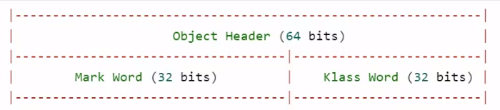
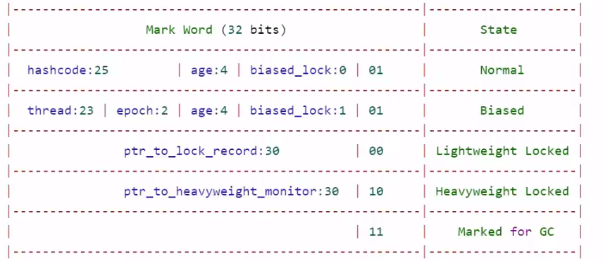
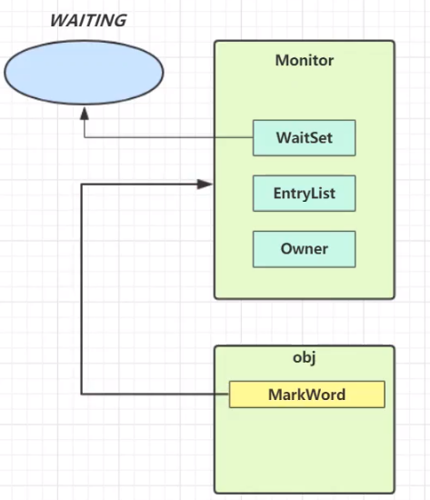
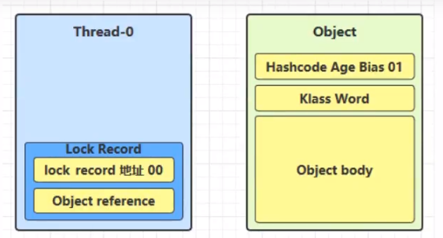
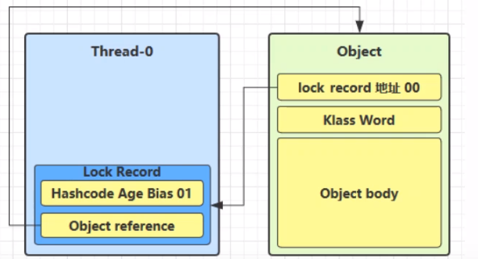
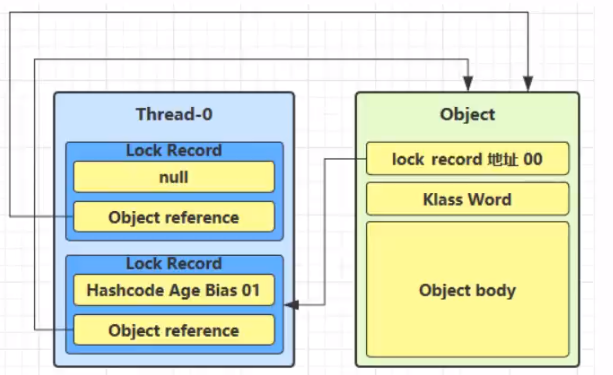
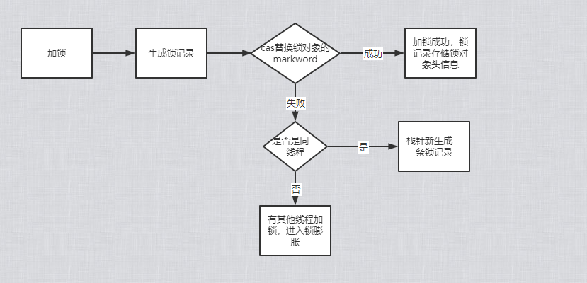
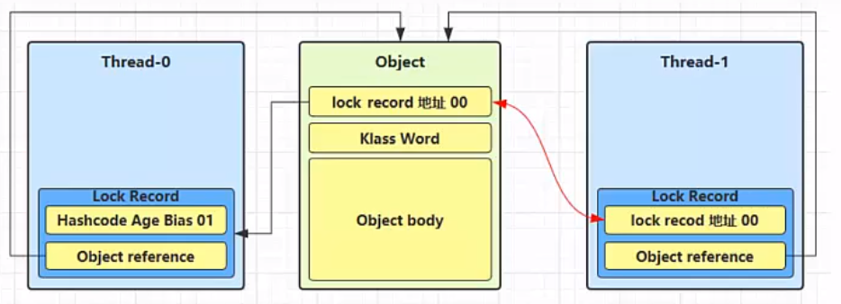
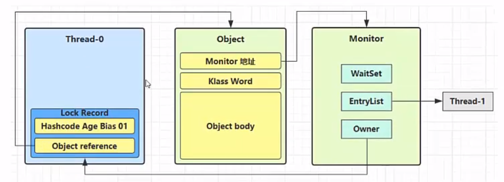
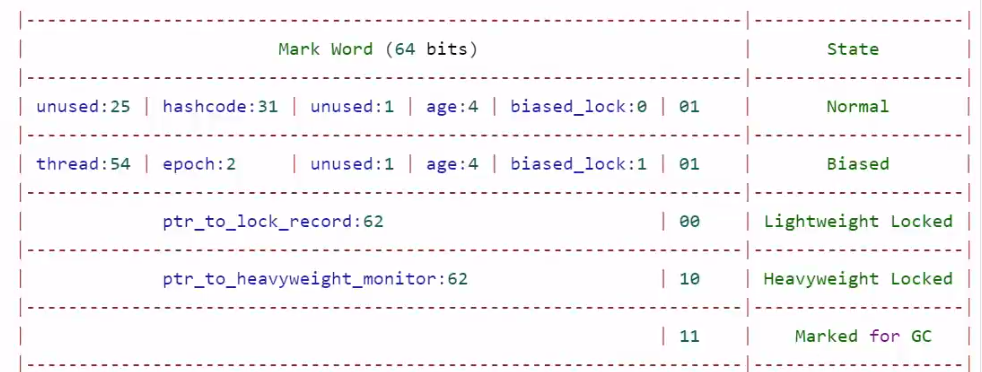

# 
# Java对象头

一般我们new的对象，都由对象头和对象的成员属性组成

> 普通对象头结构

- 一个对象的大小
  - 此处以32位虚拟机为例-----如：一个Integer：8个字节对象头+4个字节的数据，int 只有4个字节数据



> Klass Word

存储了对象类型的指针：如：String类型， Student的类型

> Mark Word结构（存储对象的hashcode或者锁信息）

- age: 垃圾回收的年龄
- biased_lock：是否是偏向锁
- 最后两位：锁状态
  - normal
  - 00:轻量级锁
  - 10：重量级锁



# Monitor对象

## 简介

- monitor是操作系统提供的对象
- 每个Java对象*都关联一个*Monitor对象，
- 如果使用synchronized(object)给对象上锁〈重量级)之后，该对象头的Mark Word 中就被设置指向**Monitor对象的指针**



## 结构

- monitor里面的owner属性指向抢到锁的线程
- 此时另外一个线程来抢这个锁，则monitor的的EntryList指向抢锁的线程
- 当线程执行完，将EntryList中的线程全部唤醒，继续抢锁
- waitSet:存放wait状态的线程集合


# 加锁过程
下面，进入加锁的过程以及优化过程
## 轻量级锁

### 使用场景

- 如果一个对象虽然有多线程访问，但多线程访问的时间是错开的（也就是没有竞争)，那么可以使用轻量级锁来优化。
- 即，线程A加锁解锁 完了以后， 线程B再加锁解锁
- 轻量级锁是没有阻塞的概念的

### 轻量级锁加锁过程

1. 当执行到加锁模块时，栈帧中生成一个锁记录的结构，内部存储锁定的对象和Mark Word



2. 让锁记录中Object reference指向锁对象，并尝试用cas替换Object的Mark Word，将Mark Word 的值存入锁记录
3. 如果cas替换成功，对象头中存储了锁记录地址和状态00，表示由该线程给对象加锁(此时，obj的分带年龄，锁标识等都存储到锁记录中，将来解锁可以恢复过去)



4. 如果CAS失败，则有一下两种情况
   1. 如果是其它线程已经持有了该Object的轻量级锁，这时表明有竞争，进入锁膨胀过程
   2. 如果是自己执行了synchronized锁重入，那么再添加一条Lock Record作为重入的计数



5. 当退出synchronized代码块（解锁时）锁记录的值不为null（为null表示为锁重入），这时使用cas将 Mark Word的值恢复给对象头
   1. 成功，解锁成功
   2. 失败，说明轻量级锁进行了锁膨胀或已经升级为重量级锁，进入重量级锁解锁流程

> 简单的流程图




## 锁膨胀

如果在尝试加轻量级锁的过程中，CAS操作无法成功，这时一种情况就是有其它线程为此对象加上了轻量级锁(**有竞争**)，这时需要进行锁膨胀，将轻量级锁变为重量级锁。

1. 当Thread1 去申请轻量锁的时候，发现obj锁状态是00（轻量级）



2. 此时进入锁膨胀流程
   1. Object对象申请monitor锁，让Object指向monitor重量级锁地址，owner指向已经申请好锁的Thread0,Entrylist阻塞队列存储一个Thread1
   2. monitor地址状态变为10（重量级锁）



3. Thread0解锁的时候，发现锁膨胀，则它进入重量级锁解锁流程
   1. Owner设置为空
   2. 唤醒EntryList的线程

## 自旋优化

重量级锁竞争的时候，还可以使用自旋(循环等待,然后不断的判断锁是否被获取,直到获取到锁的时候退出循环)来进行优化，如果当前线程自旋成功(即这时候持锁线程已经退出了同步块，释放了锁)，这时当前线程就可以避免阻塞。

在Java6之后自旋锁是自适应的，比如对象刚刚的一次自旋操作成功过，那么认为这次自旋成功的可能性会高，就多自旋几次;反之，就少自旋甚至不自旋，总之，比较智能。

## 偏向锁

### 概念

- 轻量级锁在没有竞争时(就自己这个线程，每次重入仍然需要执行CAS(每一次都要看一下是不是**自己线程的锁**)操作。
- Java 6中引入了偏向锁来做进一步优化:只有第一次使用CAS将**线程ID设置到对象的 Mark Word头**，之后发现这个线程ID是自己的就表示没有竞争，不用重新CAS。以后只要不发生竞争，这个对象就归该线程所有

重入锁示例：

```java
static Object LOCK = new Object();
public void method1() {
    synchronized (LOCK) {
        method2();
    }
}
public void method2() {
    synchronized (LOCK) {
    }
}
```
### 解析


- 由图可见：
  - 如果开启了偏向锁（默认开启)，那么对象创建后，markword值为0x05即最后3位为101，这时它的thread、epoch、age都为0
  - 当加锁之后，前54位就是线程id(即 thread:54)，后三位为101
- 如果调用hashcode方法后，就是撤销该对象的偏向状态

### 撤销偏向锁的场景

1. 调用hashcode方法（调用hashcode方法需要将hashcode赋值）
2. 其他线程使用对象（两个线程锁同一个对象，顺序执行场景）（obj的markword不知道记录哪个线程的id，所以无法使用偏向锁）
3. 调用wait/notify


# 锁消除

- JIT即使编译器会将锁进行优化
- 当代码上判断锁的对象没有竞争时，会对锁进行消除优化

