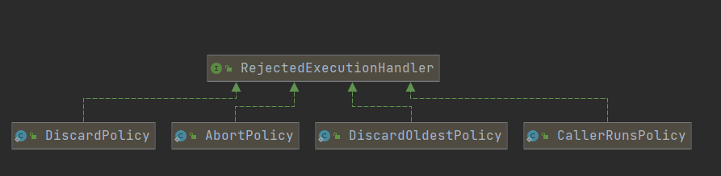

# 自定义连接池

## 分析

1. 连接池是享元模式的体现
2. 定义一个连接池Pool
   1. 拥有连接池大小定义
   2. 连接对象的数组

# 自定义线程池

## 分析

> 阻塞队列：线程池可能一下子有很多任务，也可能任务很少，这个任务丢给线程则需要阻塞队列来进行平衡

1. 队列的存储数组
2. 锁（如果有多个线程，那么肯定只能有一个线程来获取头部的任务，则这个时候需要一把锁）
3. 生产者条件变量和消费者条件变量（如果线程池工作满了，则消费者阻塞，如果队列满了，则生产者阻塞）
4. 容量上限（队列的容量上限）

> 线程池主类：

1. 任务队列：用于存储待执行的线程
2. 线程集合：使用set集合，用于存储work（正在工作的线程集合）
3. 核心线程数
4. 超时时间：超过这个时间没有使用这个线程就停掉这个线程

> > 线程池主类方法

1. execute方法：接收runable参数，提交给work对象执行/加入任务队列暂存任务

> work类设计

1. 定义一个class继承Thread，这里这个Thread是用于线程的start执行
2. 定义一个属性Runable，这里是用于接收线程的参数，到时直接调用run方法，不会直接作为多线程执行

## 代码部分

```java
public class MyThreadPool {

    //存储待执行的线程
    private Queue<Runnable> queue;
    //存储正在工作的线程
    private Set<Worker> workers = new HashSet<>();
    //核心线程大小
    private int coreSize;

    public MyThreadPool(int coreSize, int queueSize) {
        queue = new ArrayBlockingQueue<Runnable>(queueSize);
        this.coreSize = coreSize;
    }

    public void execute(Runnable task) {
        synchronized (workers) {
            if(workers.size() < coreSize) {
                //当核心线程没满，交给work对象执行线程任务
                Worker worker = new Worker(task);
                workers.add(worker);
                worker.start();
            } else {
                queue.add(task);
            }
        }
    }

    class Worker extends Thread {
        private Runnable task;
        public Worker(Runnable task) {
            this.task = task;
        }
        @Override
        public void run() {
            //当任务不为空，则执行当前任务，任务为空，则从队列获取任务
            while (task != null || (task = queue.poll()) != null ) {
                try {
                    task.run();
                    task = null;
                }catch (Exception e) {

                }
            }
        }
    }
}
```


# 线程池七大参数

```java
public ThreadPoolExecutor(int corePoolSize,
                          int maximumPoolSize,
                          long keepAliveTime,
                          TimeUnit unit,
                          BlockingQueue<Runnable> workQueue,
                          ThreadFactory threadFactory,
                          RejectedExecutionHandler handler)
```

*corePoolSize*: 核心线程数，既执行外部请求的线程数量，当线程池的数目达到core值后，任务会放入缓存的队列中。

相当于我们上面的work数组的大小

*maximumPoolSize*：最大的同步执行的线程数量，如果线程大于max，则采用拒绝策略（队列满了才会使用这个参数）

- 这里面包含了**救急线程数**，所以：救急线程数=max-核心线程数
- 如果阻塞队列放不下了，那么那个任务就会丢入救急线程work线程中

*keepAliveTime*：当线程数超过core，并且这个线程的空闲时间超过keep，则销毁线程到core这个数量

- 对应的是救急线程（救急线程空闲时间超了，则销毁当前线程）

TimeUnit：keepAliveTime的时间单位

- 对应的是救急线程

workQueue：一个阻塞队列

- 如果是有界队列，则线程数少于core时，创建线程，如果大于core，则任务加入本队列中。如果队列满了但是，线程数小于max，则开始创建线程
- 如果时无界队列，则max没有用（**因为队列永远不会满**）

ThreadFactory： 生产线程的工厂，一般默认(可以为线程起一个好名字)

RejectedExecutionHandler：拒绝策略

- 如果救急线程都满了，那么才会触发拒绝策略

# 线程池拒绝策略

AbortPolicy（默认）: 直接抛出RejectedExecutionException异常阻止系统正常运行。

CallerRunsPolicy: 不会抛弃任务，也不会抛出异常，而是将某些任务返回给调用的线程执行，如main方法的线程调用的线程池，则返回给main方法执行

ThreadPoolExecutor.DiscardPolicy：也是丢弃任务，但是不抛出异常。 
ThreadPoolExecutor.DiscardOldestPolicy：丢弃队列最前面的任务（它放弃最旧的未处理请求），然后重新尝试执行任务（重复此过程）




# 关闭线程池

```java
/*
线程池状态变为 SHUTDOWN
- 不会接收新任务
- 但已提交任务会执行完
- 此方法不会阻塞调用线程的执行
*/
void shutdown();
```

- 返回值为队列中的任务

```java
/*
线程池状态变为 STOP
- 不会接收新任务
- 会将队列中的任务返回
- 并用 interrupt 的方式中断正在执行的任务
*/
List<Runnable> shutdownNow();
```

# 线程池的工厂方法

## newFixedThreadPool  

- 核心线程数 == 最大线程数（没有救急线程被创建），因此也无需超时时间
- 阻塞队列是无界的，可以放任意数量的任务  

` 适用于任务量已知，相对耗时的任务`

```java
public static ExecutorService newFixedThreadPool(int nThreads) {
        return new ThreadPoolExecutor(nThreads, nThreads,
                                      0L, TimeUnit.MILLISECONDS,
                                      new LinkedBlockingQueue<Runnable>());
    }
```


## newCachedThreadPool  

- 核心线程数是 0， 最大线程数是 Integer.MAX_VALUE，救急线程的空闲生存时间是 60s，意味着全部都是救急线程（60s 后可以回收）  
- 队列采用了 SynchronousQueue 实现特点是，它没有容量，没有线程来取是放不进去的（一手交钱、一手交货）  

`适合任务数比较密集，但每个任务执行时间较短的情况  `

```java
public static ExecutorService newCachedThreadPool() {
    return new ThreadPoolExecutor(0, Integer.MAX_VALUE,
                                  60L, TimeUnit.SECONDS,
                                  new SynchronousQueue<Runnable>());
}
```

## newSingleThreadExecutor

`希望多个任务排队执行。线程数固定为 1，任务数多于 1 时，会放入无界队列排队。任务执行完毕，这唯一的线程也不会被释放。  `

```
public static ExecutorService newSingleThreadExecutor() {
    return new FinalizableDelegatedExecutorService
        (new ThreadPoolExecutor(1, 1,
                                0L, TimeUnit.MILLISECONDS,
                                new LinkedBlockingQueue<Runnable>()));
}
```


# 线程池提交任务

```java
// 执行任务
void execute(Runnable command);
// 提交任务 task，用返回值 Future 获得任务执行结果
<T> Future<T> submit(Callable<T> task);
// 提交 tasks 中所有任务
<T> List<Future<T>> 
    invokeAll(Collection<? extends Callable<T>> tasks)
					throws InterruptedException;
// 提交 tasks 中所有任务，带超时时间
<T> List<Future<T>> 
    invokeAll(Collection<? extends Callable<T>> tasks,
					long timeout, TimeUnit unit)
					throws InterruptedException;
// 提交 tasks 中所有任务，哪个任务先成功执行完毕，返回此任务执行结果，其它任务取消
<T> T invokeAny(Collection<? extends Callable<T>> tasks)
			throws InterruptedException, ExecutionException;

// 提交 tasks 中所有任务，哪个任务先成功执行完毕，返回此任务执行结果，其它任务取消，带超时时间
<T> T invokeAny(Collection<? extends Callable<T>> tasks,
				long timeout, TimeUnit unit)
		throws InterruptedException, ExecutionException, TimeoutException;
```
