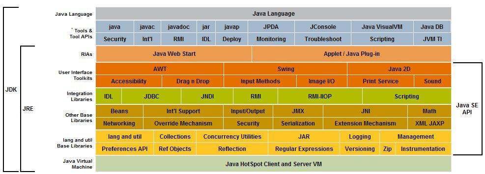
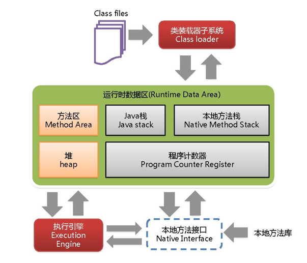
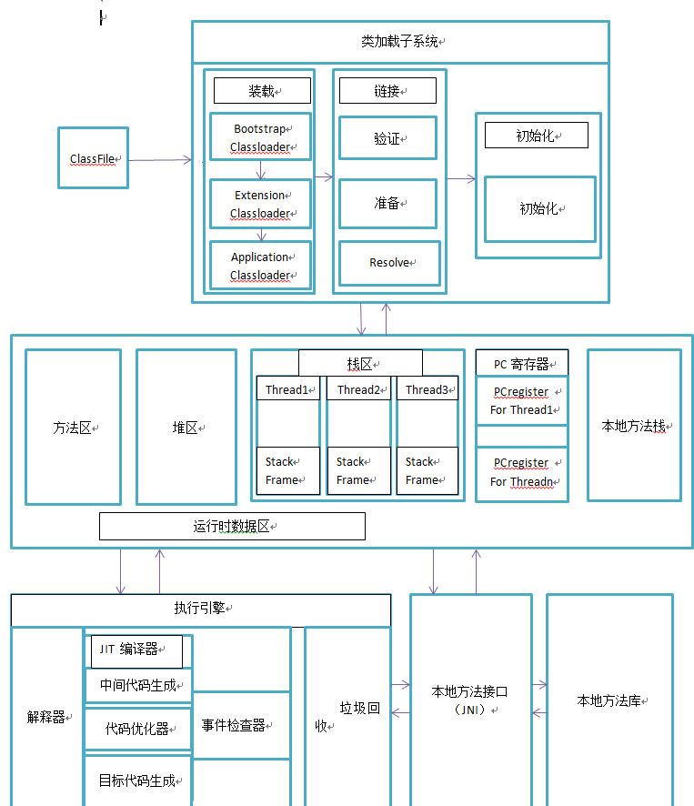

# JVM架构模型

- java指令是根据栈来设计的
- 栈
  - 跨平台性，指令集小
  - 指令多，执行性能比寄存器差

# JVM生命周期

- 虚拟机启动
  - java虚拟机启动是通过引导类加载器创建一个初始类来完成的
- 虚拟机的执行
  - 执行一个java程序，真正的执行的是一个java虚拟机的进程
- 虚拟机的退出
  - 正常退出
  - 某线程调用Runtime或者System类的exit方法

**类在JVM中的生命周期为：加载，连接，初始化，使用，卸载**

可以参考：[加载过程](/java/java-base/jvm/doc/2-jvm?id=加载过程)

# JRE JDK关系

- JDK包含了JRE,JDK有编译器等（java开发工具）
  - Java 工具：javac、java、 jsonsole等


```
JDK(Java Development Kit)又称J2SDK(Java2 Software Development Kit)，是Java开发工具包，它提供了Java的开发环境(提供了编译器javac等工具，用于将java文件编译为class文件)和运行环境(提 供了JVM和Runtime辅助包，用于解析class文件使其得到运行)。如果你下载并安装了JDK，那么你不仅可以开发Java程序，也同时拥有了运 行Java程序的平台。JDK是整个Java的核心，包括了Java运行环境(JRE)，一堆Java工具tools.jar和Java标准类库 (rt.jar)。
```

- JRE中包含虚拟机JVM（java运行时环境）
  - bin(jvm)
  - lib(java核心的类库)


```tex
JRE(Java Runtime Enviroment)是Java的运行环境。面向Java程序的使用者，而不是开发者。如果你仅下载并安装了JRE，那么你的系统只能运行Java程序。JRE是运行Java程序所必须环境的集合，包含JVM标准实现及 Java核心类库。它包括Java虚拟机、Java平台核心类和支持文件。它不包含开发工具(编译器、调试器等)
```

- JVM：java虚拟机
  - .class 在jvm上运行




# JVM结构

- class 文件通过class loader加载到内存中
- 在内存中
  1. 多线程之间，方法区和堆是共享的
  2. 每个线程独有一份计数器和栈
  3. java的指令是基于栈实现的（**主要考虑夸平台性**）

# 类加载过程

[类加载大致过程](/java/java-base/jvm/doc/2-jvm?id=加载过程)





> 详细图




# JVM线程（了解）

- JVM允许一个应用多个线程**并行**执行
- JVM线程分类
  - 虚拟机线程
  - 周期任务线程
  - GC线程（后台线程/守护线程）


