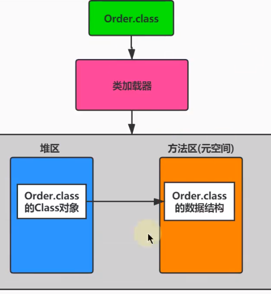
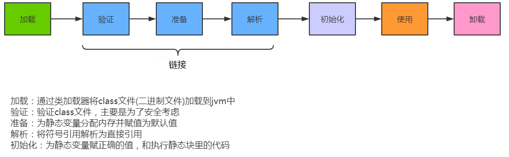
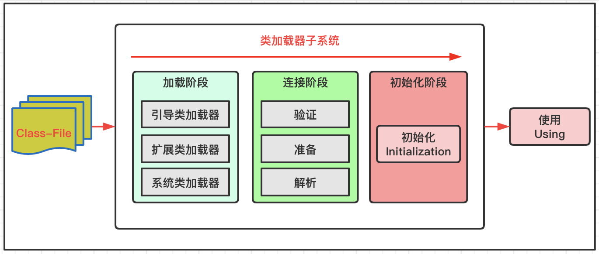
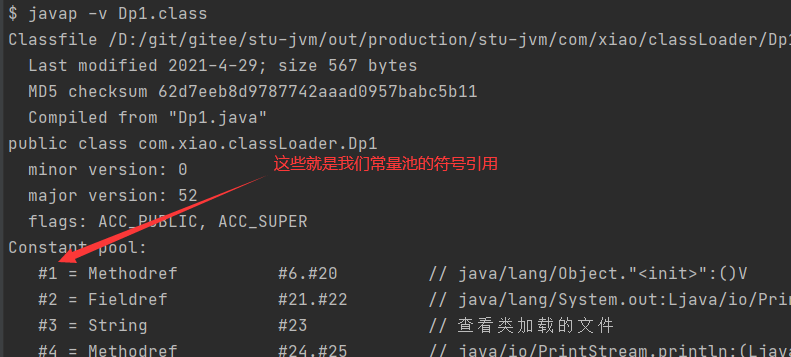
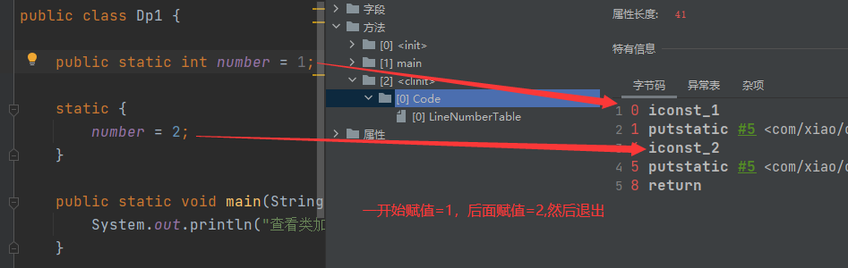

# 加载class文件方式

> 理解基本数据类型由虚拟机预先定义，引用数据类型则需要进行类的加载

## 基本数据类型
Java 的 8 种基本数据类型（byte、short、int、long、float、double、char、boolean）由 ​JVM 预先定义，无需开发者手动加载。它们的特性包括：
1. 内存固定：每种类型的大小和取值范围由语言规范严格规定（如 int 固定为 4 字节），与操作系统无关。
2. 直接存储值：基本类型变量直接在栈内存中存储数据值，无需引用堆内存。
3. 默认值规则：类成员变量自动初始化默认值（如 int 默认为 0），而局部变量必须显式初始化

*基本类型操作高效，因为其数据直接存储在栈内存中，避免了堆内存分配和垃圾回收的开销*

## 引用数据类型
引用数据类型（如类、接口、数组、枚举等）的创建和使用依赖于 <b id="blue">​类加载机制</b>

引用类型的定义需要通过 ​字节码加载、链接、初始化 等步骤才能被 JVM 识别

> 将Java类的字节码文件加载到机器内存中，并在内存中构建出将java类的原型（类模板对象），JVM将从字节码文件中解析出的常量池、类字段、类方法等信息存储到类模板中过程：

- 通过类的全名，获取类的二进制数据流。
  - 从文件系统读取
  - 从jar，zip等中读取
  - 网络读取
  - 运行时计算生成，如动态代理
  - 从加密文件中获取，如一些防止反编译的措施
- 解析类的二进制数据流为方法区内的数据结构（**Java类模型**)
- 创建java.lang.Class类的实例，表示该类型。作为方法区这个类的各种数据的访问入口

> 类模板

- 加载的类在VM中创建相应的类结构，类结构会存储在方法区
- 但是他的class对象是在堆空间的



- 例如加载string：

```java
//局部变量表存储引用指向堆中的Class实例，class实例指向方法区的String模板
Class<?> clazz = Class.forName("java.lang.String");
```


# 加载过程

- 类加载子系统只负责从文件系统加载class文件，
- 加载的类信息存在方法区的内存空间，方法区还存放运行时的常量池信息
- 类加载子系统只负责加载，能不能运行由执行引擎决定





> 细节图




## 链接过程

> 验证

- 当类加载系统中后，开始验证，它的目的是保证加载的字节码是合法、合理并符合规范的。
  - 格式检查（其实加载阶段就开始格式检查了）：魔数检查，版本检查，长度检查(*所有的字节码起始开头都是 CA FE BA BE*)
  - 语义检查：
    - 是否所有的类都有父类的存在
    - 是否一些被定义为final的方法或者类被重写或继承了
    - 非抽象类是否实现了所有抽象方法或者接口方法
  - 字节码检查
    - 字节码执行过程是否跳转了了不存在指令
  - 符号引用验证

> 准备

- 为类的静态**变量**（不是常量，常量编译阶段生成符号引用，由解析阶段负责转为直接引用）分配内存，并将其初始化为默认值。
  - 如int类型，一开始才是0
  - 为**类变量**分配内存并且设置该类的初始值
- **这里不包含基本数据类型的字段用static final修饰的情况，因为final在编译的时候生成符号引用。**（没有初始化赋值这个代码执行）
- 如果使用字面量方式给String的常量赋值，也是在准备阶段**显示赋值**的

> 解析

- 将符号引用转为对应直接引用
  - 就是将前面说的编译阶段分配内存

- 一个类可能会引用很多其他类



## 初始化阶段

为类的静态变量赋予正确的初始值。

- 初始化阶段的重要工作是执行类的初始化方法:<clinit>()方法。

```java
class A {
    static{
        //clinit
    }
}  
```

- 他不需要定义，是javac编译器自动收集类中所有变量的赋值动作和静态代码块中的语句合并而来




- 他是按照代码的顺序执行的
  - 因为声明的对象在后面，而使用的代码在前面
  - staic里面能赋值是因为jvm会把static赋值过程自己编译成一个clinit方法，在链接阶段赋值

> 例子

1. num的赋值过程  num=0 ---> num = 3 ---->num=4
2. 非法前向应用：因为num下面由在初始化阶段赋值，所以在此处不能引用他

```java
static {
    number = 2;
    num = 3;
    //这里是不允许使用的，非法的前向引用
    System.out.println(num);
}
//这里最终输出的结果是4
private static int num = 4;
```

- 虚拟机保证每个类的clinit在多线程下都是同步加锁的（只会有一个线程加载一个类的clinit方法）
  - **如果加载过程中 出现这个问题，会造成线程加载阻塞 **
- 如果存在父类，会先执行父类的clinit


由代码可见，初始化阶段会执行clinit方法,有静态代码块，或者静态变量，就会有clinit（静态常量不会产生）

```java
public static int i = 1;
public static int j;
static {
    j = 2;
    System.out.println(j);
}
```


```shell
 0 iconst_1
 1 putstatic #2 <com/xiao/classLoader/TestStatic.i>
 4 iconst_2
 5 putstatic #3 <com/xiao/classLoader/TestStatic.j>
 8 getstatic #4 <java/lang/System.out>
11 getstatic #3 <com/xiao/classLoader/TestStatic.j>
14 invokevirtual #5 <java/io/PrintStream.println>
17 return
```

> 注意

```tex
在加载一个类之前，虚拟机总是会试图加载该类的父类，因此父类的<clinit>总是在子类<clinit>之前被调用。也就是说，父类的static块优先级高于子类。
口诀:由父及子，静态先行。
```

引用类型的不管是不是final，是static就是在clinit中赋值

> 没有clinit场景

```java
//非静态变量
public int i;
//静态变量未赋值
public static int j;
//常量
public static final int k = 1;
```

**clinit虚拟机加锁了，是线程安全的**

