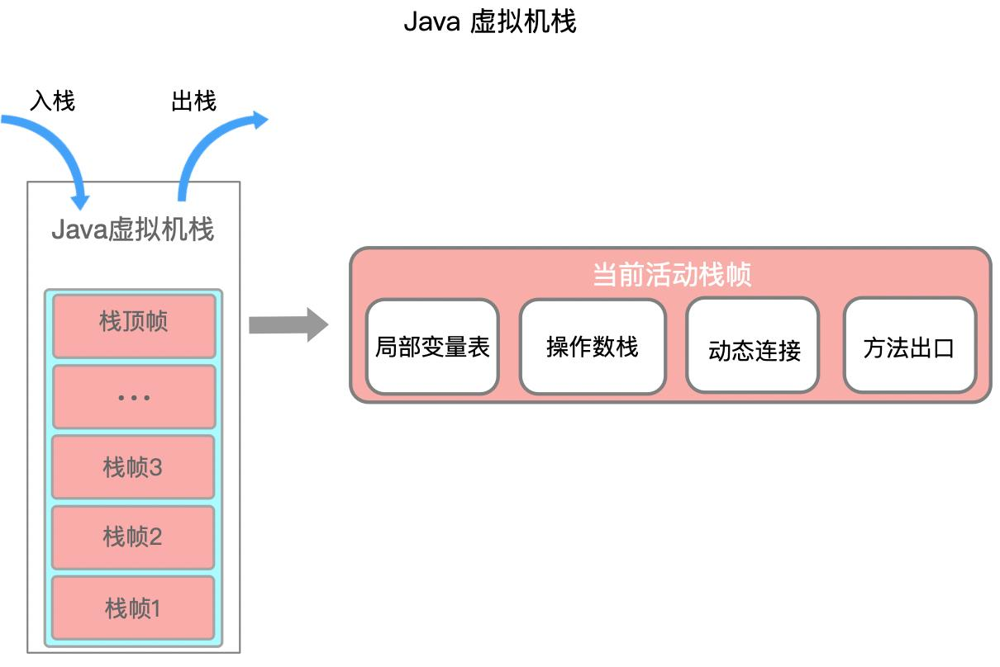
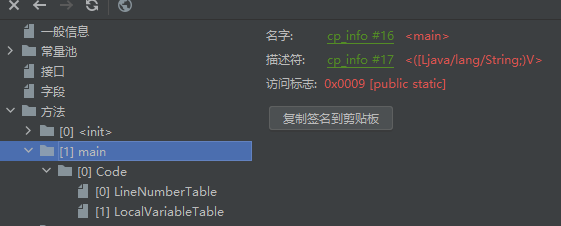
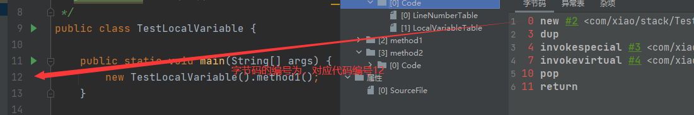
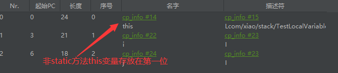
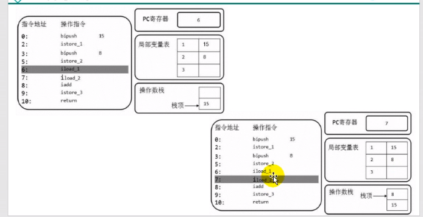
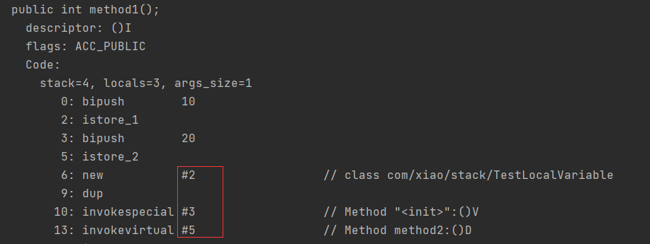
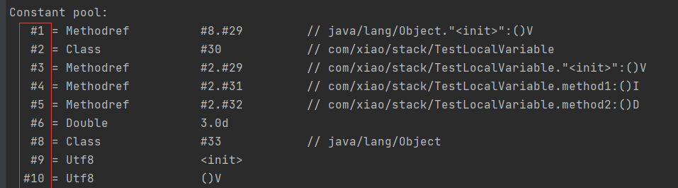
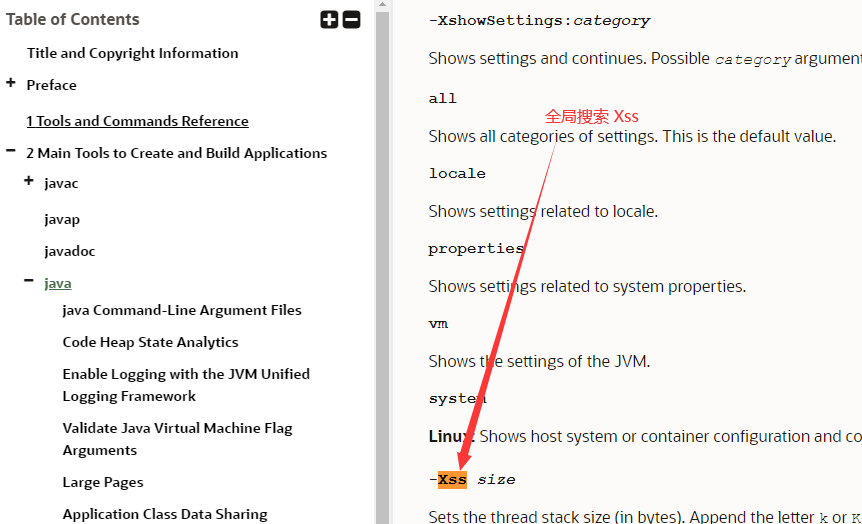
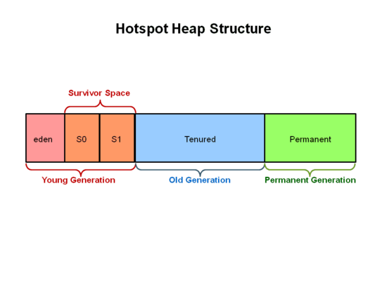
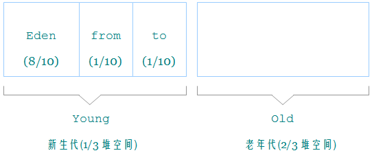

#
# 运行时数据区
# 描述
通过类加载子系统初始化加载后，运行时的类数据保存到方法区

- 程序计数器、栈、本地栈是线程私有的
- JIT编译缓存在非堆空间


# 程序计数器

## 简介

程序计数器可以在多线程切换上下文时，保存当前线程执行的指令地址

- （PC Registery）/PC 寄存器

- 用来存储指向下一条指令的地址（代码的指令存放在栈帧当中）
- 一个很小的内存空间
- 线程私有的

## 举例

```java
public static void main(String[] args) {
    int a=10;
    int b=20;
    String c ="abc";
}
```

1. 反编译class

```shell
0 bipush 10
2 istore_1
3 bipush 20
5 istore_2
6 ldc #2 <abc>
8 astore_3
9 return
```

最左边的数字就是偏移地址（指令地址），中间的是操作指令

假如：执行到5时，PC寄存器将5存入（**程序计数器记录的是左边的序号**）

执行引擎通过PC寄存器记录的地址读取对应的操作指令，然后操作栈结构，局部变量表，实现存取计算等

将字节码指令翻译成机器指令，到cpu做计算

## 常见问题

- 为什么要使用pc寄存器记录当前线程的执行地址

cpu需要不停的切换线程，这个时候切换回来，知道它执行到哪了

- pc寄存器为什么是线程私有的

如果不是私有，那么寄存器公有，则切换线程时，是无法找到切换回来的线程下个执行的步骤的


# 虚拟机栈

## 概述

- 由栈帧组成

- 一个栈帧对应着一个方法
- 生命周期和线程一致
- 主要用于保存方法的局部变量（8种基本数据类型/引用类型地址）和部分结果和返回
- 正常的函数返回（使用return指令）或者抛出异常，都会导致栈帧被弹出

## 结构

- 当我们每执行一个方法的时候，当前执行方法的局部变量等相当于一个栈帧，执行入栈操作
- 栈帧1、2、3 相当于method1、2、3



> 栈的存储单位
>
> **一个栈能放多少个栈帧取决于栈针的大小**
1. 栈的数据是以栈帧的格式存在的
2. 每个方法对应一个栈针

> 栈帧的内部结构
1. 局部变量表
2. 操作数栈
3. 动态链接(指向运行时常量池的方法引用)
4. 方法返回地址
5. 一些附加信息

### 局部变量表

- 也称局部变量数组
- 一个数字数组（存放**8种基本数据类型、对象引用地址**）
- 在编译的时候，就确定了局部变量表的长度

```tex
在栈帧中，与性能调优关系最为密切的部分就是局部变量表。
局部变量表中的变量也是重要的垃圾回收根节点（jvm垃圾回收采用可达性分析法），
只要被局部变量表中直接或间接引用的对象都不会被回收。
```

- 一个方法开始，局部变量表会存储几个数据（**this**、形参）


> 从jclasslib看结构

看class



*linenumbertable*表示：

- 编译后的字节码对应的编号（start pc）与java代码的对应行号关系




*localvaribletable*表示：

- 局部变量相关信息
- start pc 变量起始的位置
- 长度（长度的每个index对应着字节码编号），slot存储坐标

> 基本单位

- 局部变量表最基本存储单元slot（槽）
- 32位类型占一个slot，64位占两个槽（一个字节8位）
- 局部变量按照声明顺序存储
- 如果是非static方法，this存放到0的位置（**为什么static不能使用this，因为static 的局部变量表中不存在this**）



- **局部变量表中的变量是重要的垃圾回收根节点，只要被局部变量表中直接或者间接引用的对象，就不会被回收**

```java
//java的非static方法的local
LocalVariableTable:
        Start  Length  Slot  Name   Signature
            0       4     0  this   LDataTest1;
            3       1     1     a   Ljava/lang/String;

```

> slot重复利用问题

定义一个代码

```java
public void test1(){
    int a = 1;
    {
        int b=0;
        b=a+1;
    }
    int c = a+2;
}
```

查看，发现局部变量b先使用了slot，然后c又使用了b的slot

因为b在代码块结束就销毁了，但是slot长度编译时就定义了，不能减少

```java
 Start  Length  Slot  Name   Signature
            4       4     2     b   I
            0      13     0  this   LDataTest1;
            2      11     1     a   I
           12       1     2     c   I

```


### 操作数栈

- 又称表达式栈
- 主要用于保存计算过程的中间结果或者计算过程中的变量的临时存储空间
- 当一个方法刚开始执行的时候，新的栈帧随之被创建，这个方法的操作数栈是空的

`如下示例`：

```java
public void test2() {
    byte i = 15;
    int b = 10;

    int j = i+b;
}
```

*stack*：栈深度

*locals*：局部变量表的深度

```shell
  stack=2, locals=4, args_size=1
  		## 将15入栈，
         0: bipush        15
         #弹出操作数栈栈顶元素，保存到局部变量表第1个位置
         2: istore_1
         3: bipush        10
         5: istore_2
         # 第1，2个变量从局部变量表压入操作数栈
         6: iload_1
         7: iload_2
         ## 出栈相加，放入操作数栈中
         8: iadd
         9: istore_3
        10: return

```




### 动态链接

- 栈帧中,当前使用了常量池的变量的引用

  - 在字节码文件中，有个constant pool（常量池，当运行时，就会将其存储到方法区）

- 编译后，所有的变量和方法引用都作为符号引用（#开头的数字），保存到class文件的常量池中

- 当方法调用另一个方法时，就用常量池的指向方法的符号引用表示

- **作用就是将符号引用转化为直接引用**





> 方法的调用

- 静态链接
  - 如果被调用方法，在编译期间就可以确定符号引用，那么它就是静态链接

```java
public class TestBing extends TestLocalVariable {
    public TestBing() {
        //如这个super，已经确定调用父类的方法
        super();
    }
}
```

> 虚方法与非虚方法

- 非虚方法
  - 编译期就确定了调用的方法
  - 静态方法，私有方法、final方法，实例构造器，父类方法都是非虚方法
  
- 虚方法

  - 不确定调用的方法，如重写的方法
  - java因为**重写**而有了虚方法的概念

- 虚方法表
  - 因为虚方法会循环的寻找父类（如果没有重写）
  - 所以在类加载的链接阶段，建立了

## 栈常见异常

- stackoverflowerror
  - 栈如果是固定的，栈满了，就会抛出
  - 一般递归
- outofmemoryerror
  - 栈如果是动态扩展，如果去申请内存，没有内存了就会抛出

## 设置栈大小
> 查看文档

https://docs.oracle.com/en/java/javase/11/tools/tools-and-command-reference.html



> 具体命令

-Xss size （size=大小）

```shell

##举例
-Xss1m
-Xss1024k
-Xss1048576

```

# 堆



## 核心概述

- 堆是线程共享的，但还是有划分私有的堆空间（JMM-Java内存模型概念）
- 堆可以是物理上不连续，但逻辑上连续的内存空间
- 并非所有的堆是线程共享的，小块的**TLAB空间**是线程私有的

## 内存细分

- 7以前：新生代+老年代+永久区
- 8以后：新生代+老年代+元空间（本地内存）

> 新生代老年代

https://docs.oracle.com/javase/8/

- 存储jvm中的java对象可以被划分为两类
  - 一类是生命周期短
  - 一类是生命周期长，甚至与jvm生命周期保持一致
- 堆区细分的话，分为年轻代和老年代
- 比例2:1(老年代:年轻代)
- 年轻代分为eden区/S0区，S1区（有时叫from和to区）
  - 新生的对象在eden，没有被第一次GC，则进入S区





> 设置新生代老年代比例

https://docs.oracle.com/javase/8/docs/technotes/tools/unix/java.html#BGBCIEFC

- 默认设置比例为2  新生代/老年代=1/ 2
- 一般不调整，如果知道明细的很多对象周期长，则可以将老年代增大

```shell
-XX:NewRatio=2
```

- 默认的`Eden:S0:S1`在官方文档中是`8:1:1`,但是因为自适应问题，不会绝对的按照这个比例，如果需要按照比例分配,可以配置参数

```shell
-XX:SurvivorRatio=8
```

## 设置堆空间大小

**建议设置xms和xmx设置一样大**，避免GC之后造成堆内存减少，消耗性能

- 设置的是年轻代+老年代
- -Xms:堆区的起始内存，默认 **物理/64**
  - -X：jvm运行参数，ms是缩写，既memory start
- -Xmx:堆区最大的内存， 默认 **物理/4**

```java
public static void main(String[] args) {
    //堆内存总量
    long totalMemory = Runtime.getRuntime().totalMemory() / 1024 / 1024;
    //最大堆内存
    long maxMemory = Runtime.getRuntime().maxMemory() / 1024 / 1024;

    System.out.println("-Xms:" + totalMemory + "M");
    System.out.println("-Xmx:" + maxMemory + "M");

    System.out.println("系统内存大小:" + totalMemory*64 + "M");
    System.out.println("系统内存大小:" + maxMemory*4 + "M");
}
```

## 堆内存分配策略

- 优先分配Eden
- 大对象直接分配到老年代
  - 尽量避免程序出现过多的大对象
  - 尤其是那种朝生即死的大对象
- 长期存活的对象存入老年代（15岁）
- s区相同年龄的对象大小大于s区的一半，则直接进入老年代

## TLAB内存区域

- 为每个线程在Eden区分配了一部分（默认eden的1%）私有的内存区
- 增加内存吞吐量
- 避免线程安全问题
- 不是所有对象都能在tlab区分配对象（他比较少）
- 命令行 jinfo -flag UseTLAB 进程号  可以查看是否开启
- 一旦对象分配TLAB区域失败，JVM就会尝试使用**加锁**的机制，确保数据的原子性

# 本地方法栈

- 他是调用C相关的方法的存储
- 管理**本地方法**的调用

- native 方法，是一个java方法，但是是由非java语言实现的

## 本地方法

- 用native修饰的方法是**本地方法**

```java
public static native void yield();
public static native void sleep(long millis) throws InterruptedException;
```

# 方法区
https://docs.oracle.com/javase/specs/jvms/se8/html/index.html


## 栈堆方法区交互关系

- 类结构放在方法区
- new的对象放在堆空间
- 对象所在的方法的栈帧存在栈区

## 方法区介绍

- jdk7称之为 永久代 Per ,  JDK8则叫元空间 MetaspaceSize

- 创建在线程启动的时候**类加载器**加载类到方法区
- 过多的生成放射类可能导致方法区OOM

- 线程共享的
- 方法区（Metaspace）大小，决定系统可以保存多少个类

## 设置方法区固定大小

https://docs.oracle.com/javase/8/docs/technotes/tools/unix/java.html#BGBCIEFC

```tex
##设置元空间最大值（默认-1，无限制）
-XX:  MaxMetaspaceSize=size
##设置初始大小（默认21M）
-XX:MetaspaceSize=size
```

- -XX: Metaspacesize:设置初始的元空间大小。对于一个64位的服务器端JVM来说其默认的-XX:MetaspaceSize值为21MB。这就是初始的高水位线，一旦触及这个水位线，Full Gc将会被触发并卸载没用的类（即这些类对应的类加载器不再存活)然后这个高水位线将会重置。新的高水位线的值取决于Gc后释放了多少元空间。如果释放的空间不足，那么在不超过MaxMetaspacesize时，适当提高该值。如果释放空间过多，则适当降低该值。
- 如果初始化的高水位线设置过低，上述高水位线调整情况会发生很多次。通过垃圾回收器的日志可以观察到Full GC多次调用。为了避免频繁地GC ，建议将-XX:Metaspacesize设置为一个相对较高的值。

## 方法区的溢出
方法区存的是类的定义

可以通过ClassWriter来动态生成类/CGlib生成动态代理类来模拟溢出
（如果一个程序，频繁发生GC，可以从是否频繁生成代理类来入手//当然，GC有很多种原因）


## 内部结构

### 存储内容

- 类型信息
  - 类class，接口。枚举，注解
  - 域（Field）信息：名称，类型，修饰符（public,private,static,final等）
  - 方法信息
- 常量
- 静态变量
- 及时编译的代码缓存

## 全局常量

- 既**static final **修饰的常量

```java
static int a=1;
static final int b=2;
```

- 这种常量在**编译阶段**就已经赋值了

- 其他static 变量在init阶段赋值

## 运行时常量池

- 类加载之后，从字节码读取的常量存储在方法区中

- constant pool(常量池)

  - 字面量信息
  - 类型、域、方法的符号引用

- 为什么需要常量池

  - 常量池是字节码一部分

  - jvm 在栈帧(frame) 中进行操作数和方法的动态链接(link)，为了便于链接，jvm 使用常量池来保存跟踪当前类中引用的其他类及其成员变量和成员方法。
  
    每个栈帧(frame)都包含一个运行常量池的引用，这个引用指向当前栈帧需要执行的方法，jvm使用这个引用来进行动态链接
  
  - 当真正的需要使用时，通过引用来调用常量（减少了代码文件大小），加载到内存中

## 方法区GC

- 虚拟机规范并没有要求方法区GC

- 方法区GC收集主要回收：
  - 常量池废弃的常量（字面量，符号引用）
  - 不再使用的类型（类卸载）

## 方法区的演进

- 首先明确，只有HotSpot才有永久代

| 版本         | 描述                                                         |
| ------------ | ------------------------------------------------------------ |
| jdk1.6及之前 | 有永久代（permanent generation） ，静态变量存放在永久代上    |
| jdk1.7       | 有永久代，但已经逐步“去永久代”，字符串常量池、静态变量移除，保存在堆中 |
| jdk1.8及之后 | 无永久代，类型信息、字段、方法、常量保存在本地内存的元空间，**但字符串常量池、静态变量仍在堆** |

- 为什么设置永久代被元空间代替
  - 永久代设置空间是很难确定的，因为工作中可能加载很多动态类
  - 减少full gc

## 字符串常量

- String table为什么要变化
  - 永久代GC频率低，导致String table回收效率不高，导致永久代不足
  - 把字符串常量放到堆里能够和堆一起回收
