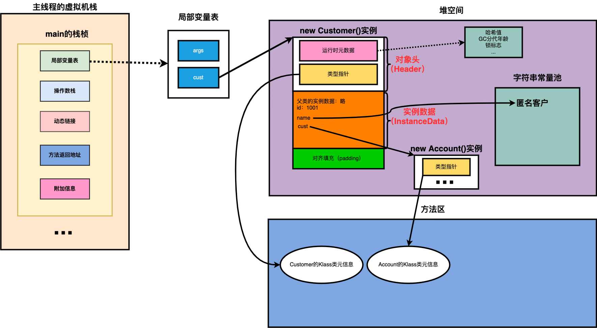
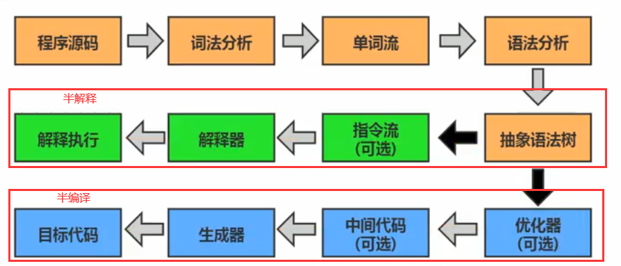

# 对象实例化

## 对象创建方式

1. new 
   1. 变形1：xxx的静态方法
   2. 变性2：xxxbuilder/xxxfactory

2. Class的newInstance()(反射的方式，只能调用空参的构造器，权限必须是public)
3. Constructor的newInstance()
   1. 可以调用空参和带参的构造器
   2. 权限没有要求


```java
//调用有参的构造方法生成类实例
Constructor<InternalClass> constructor
        = InternalClass.class.getDeclaredConstructor(new Class[] {Integer.class});
InternalClass instance = constructor.newInstance(new Integer[] {1});
log.debug("instance {}", instance);
```

- 使用clone()
  - 当前类需要实现Cloneable的接口
- 使用反序列化
  - 从文件中/网络中获取对象的二进制流

## 创建对象步骤

1. 判断对应的类是否加载、链接、初始化
    - new指令，首先检查这个指令的参数能不能在Metasoace常量池定位到符号引用，检测到了证明这个类被加载了， 就直接使用
    - 没有，在双亲委派模式下加载类
2. 为对象分配内存
    - 规整内存------指针碰撞
    - 不规整内存--------虚拟机维护列表，记录哪些可用，哪些不可用
3. 处理并发安全问题
    - 采用CAS
    - 每个线程分配一个TLAB
4. 初始化分配到空间(属性的默认初始化，零值初始化)
5. 设置对象头
    - 记录当前所属的类
    - 记录hash值
6. 执行init方法进行初始化(类构造器<init>)


# 对象内存布局


## 对象头

1. 运行时元数据
    - hash值（hashcode）
    - GC分代年龄
    - 锁状态标志
2. 类型指针
    - 指向类元数据instanceKlass，确定该对象的类型
3. 如果创建的是数组，还需要记录数组的长度

## 实例数据
instance data

*说明*

- 他是对象的真正存储有效信息

*规则*

- 相同宽度的字段总是被分配在一起
- 父类定义的变量会出现在子类之前

## 对齐填充

- 不是必须，就起到占位符作用


## 简单的示例

```java
public class CustomerTest {
    public static void main(String[] args) {
        Customer cust = new Customer();
    }
}
```

- 局部变量表存了一个cust的变量
- cust指向堆空间




# 对象访问定位

- jvm如何通过栈帧中的对象引用访问到对象的实例?
  - 通过栈上reference访问

# 对象访问方式

- 句柄访问(效率低，要访问先得访问句柄，然后再访问对象) 
  - 一个对象有一个句柄


- 直接访问(hotspot)
  - 如果对象地址发生移动（复制算法回收垃圾时），就要去更改reference


# 执行引擎

## 概述

- jvm主要任务
  - 负责装载字节码到其内部
  - 只要编译成jvm可以识别的字节码，都可以在jvm上执行 
- 执行引擎任务
  - 将**字节码指令**解释/翻译为平台上的本地机器指令

## 为什么java是半编译半解释语言？

```tex
因为java既可以用解释器解释
又可以用JIT编译器编译
```

- 解释器
  - 虚拟机启动时，对字节码逐行的解释方式执行，翻译成机器指令执行
- JIT编译器
  - 虚拟机将源代码直接编译成机器相关的机器语言（并不会马上执行）




# 本地内存

- 直接内存在java堆外的，直接向系统申请的内存区间
- 来源于NIO
- 有时候，我们将虚拟机内存分配过大，却忽略了直接内存的存在，从而导致了本地内存的OOM
- 如果不指定，则默认值于堆空间最大值（-Xmx）一样大小


# 四种引用

## 强引用

最传统的“引用”的定义，是指在程序代码之中普遍存在的引用赋值，即类似“object obj=new object()”这种引用关系。无论任何情况下，只要强引用关系还存在，垃圾收集器就永远不会回收掉被引用的对象。

## 软引用

- 内存不足既回收

在系统将要发生内存溢出之前，将会把这些对象列入回收范围之中进行第二次回收。如果这次回收后还没有足够的内存，才会抛出内存溢出异常。

```java
Object o = new Object();
SoftReference<Object> reference = new SoftReference<>(o);
//销毁强引用
o = null;
//获取软引用对象
Object o1 = reference.get();
```

## 弱引用

- GC既回收

弱引用(weakReferehce):被弱引用关联的对象只能生存到下一次垃圾收集之前。当垃圾收集器工作时，无论内存空间是否足够，都会回收掉被弱引用关联的对象。

```java
Object o = new Object();
WeakReference<Object> weakReference = new WeakReference<>(o);
o = null;
Object o1 = weakReference.get();
```

- 相关类：WeakHashMap

## 虚引用

虚引用(PhantomReference) :一个对象是否有虚引用的存在，完全不会对其生存时间构成影响，也无法通过虚引用来获得一个对象的实例。**为一个对象设置虚引用关联的唯一目的就是能在这个对象被收集器回收时收到一个系统通知。**（用来对象回收跟踪）

```java
Object o = new Object();
ReferenceQueue<Object> referenceQueue = new ReferenceQueue<>();
PhantomReference<Object> reference = new PhantomReference<>(o, referenceQueue);
//一旦将Object对象回收，就会将虚引用存放到ReferenceQueue队列
o = null;
```


