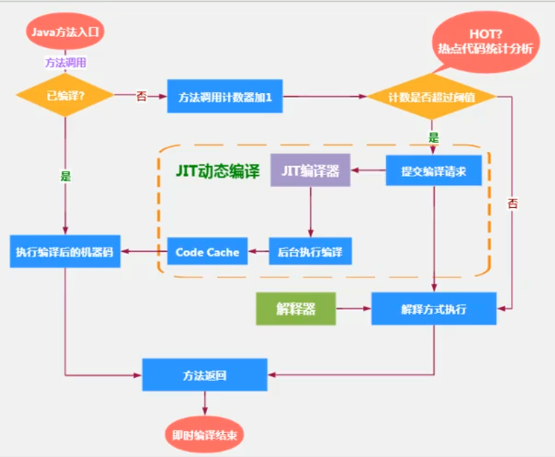
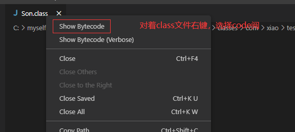

#

# 指令等概念

- 机器码
  - 机器指令码，就是010101这种
  - 和cpu密切相关
- 指令
  - 把0 1 简化成对应的指令，如： mov inc等
- 指令集
  - 针对不同的平台，指令不同，每个平台支持的指令集称之为对应平台的指令集
- 汇编
  - 用助记符代替机器指令的操作码
  - 用地址符号和标号代替指令或者操作数的地址
  - 汇编需要**翻译成机器指令码才能识别**
- 高级语言
  - 翻译成汇编（编译过程）->机器指令（汇编过程）->cpu


# 解释器

- 解释器，程序启动，翻译成机器指令，**节省运行时编译时间**，响应快

# JIT编译器

- 执行频率高的代码（热点代码），使用JIT编译器 
- JIT及时翻译成机器指令，翻译后速度快
- 速度快
- code cache 在元空间

## 编译器分类

- 前端编译器
  - 将.java文件编译成class字节码
- 后端运行器编译器
  - 将字节码编译成机器码指令

## 热点代码

- 一个被多次调用的方法，或者方法体内部循环多次的循环体都称之为热点代码
- Hotspot 基于计数器的热点探测
  - 方法调用计数器
  - 回边计数器：统计循环体的计数




## 设置程序执行模式

- 默认是混合模式，可以通过参数的方式设置

```tex
## 完全解释器
-Xint

## 完全编译器
-Xcomp

## 混合模式
-Xmixed
```


# Graal编译器

- JDK10开始，加入hotspot
- 还在试验阶段

# 新时代的GC
- ZGC（JDK14）:主打低延迟


# 字节码指令

- java虚拟机指令由一个字节长度，代表某个特定操作含义的操作码+0到多个代表此操作需要的参数操作数所构成
- 操作码 [操作数]

# 查看字节码的方式
通过相关插件可以查看
- vscode插件
  - JVM Bytecode Viewer
  - Binary Viewer




- idea插件
  - jclasslib Bytecode


# 字节码文件结构
## 基本结构

```shell
ClassFile {
    u4             magic;
    u2             minor_version;
    u2             major_version;
    u2             constant_pool_count;
    cp_info        constant_pool[constant_pool_count-1];
    u2             access_flags;
    u2             this_class;
    u2             super_class;
    u2             interfaces_count;
    u2             interfaces[interfaces_count];
    u2             fields_count;
    field_info     fields[fields_count];
    u2             methods_count;
    method_info    methods[methods_count];
    u2             attributes_count;
    attribute_info attributes[attributes_count];
}
```

| 字节长度 | 名称（英文）        | 名称（中文）                   | 描述                          |
| -------- | ------------------- | ------------------------------ | ----------------------------- |
| u4       | magic               | 魔数                           | 用于区分是否是class字节码文件 |
| u2       | minor_version       | 主版本                         |                               |
| u2       | major_version       | 副版本                         |                               |
| u2       | constant_pool_count | 常量池计数器                   | 记录常量池有多少项            |
| cp_info  | constant_pool       | 常量池                         |                               |
| u2       | access_flags        | 访问标识                       |                               |
|          |                     | 类索引，父类索引，接口索引集合 |                               |
| u2       |                     | 字段计数器                     |                               |
|          |                     | 字段                           |                               |
|          |                     | 方法计数器                     |                               |
|          |                     | 方法表                         |                               |
|          |                     | 属性表信息                     |                               |

```shell
ca fe ba be ## 魔数  
00 00 00 34 ## JDK主版本.副版本
```

## 常量池

- 常量池是不固定的，所以需要有一个常量池计数器记录常量池有多少项
- 常量池表项中，存放编译产 生的字面量和符号引用，部分内容加载后进入方法区的**运行时常量池**中

```shell
## 常量池计数器，表示有21个常量池（16转换为10进制=22）
00 16
```

### 常量池数据

- 字面量
  1. 文本字符串（string str = "xxx"）
  2. 声明为final的常量值（final int num = 1）
- 符号引用
  1. 类和接口的全限定名（com/xiao/classLoader/Demo）
  2. 字段和方法的名称
  3. 字段的和方法的描述符（字段的数据类型，方法的参数和放回值）

### 常量池结构

- 常量池11种数据类型


- 0a对应10，代表表中的CONSTANT_Mehtodref_info，后面两个index，个占两个字节，如此对应21个（对应常量池计数器）
- 注意如果是01字符串，则他的bytes长度是有前两个字节的length决定的

```shell
0a 00 04 00 12 
```


# 成员变量赋值过程

1. 默认初始化
2. 显示初始化/代码块中初始化
3. 构造器中初始化
4. 对象中赋值

## 直接父类的方式赋值

```java
class Father {
    int i= 10;
    Father() {
        this.print();
        i = 20;
    }
    public void print() {
        System.out.println(i);
    }
}
//输出结果 10
```

- 字节码指令

```shell
 ## 加载this指针
 0 aload_0
 #默认调用父类初始化方法
 1 invokespecial #1 <java/lang/Object.<init>>
 4 aload_0
 ##将10push到操作数栈
 5 bipush 10
 ## 赋值
 7 putfield #2 <com/xiao/classLoader/Father.i>
10 aload_0
11 invokevirtual #3 <com/xiao/classLoader/Father.print>
14 aload_0
15 bipush 20
17 putfield #2 <com/xiao/classLoader/Father.i>
20 return

```


## 子类的方式赋值

father的代码如上

```java
class Son extends Father {
    int i = 30;
    Son() {
        this.print();
        i = 40;
    }
    public void print() {
        System.out.println(i);
    }
}
//输出： 0   30
```

- 构造方法初始化(就是调用<init>)

```shell
 0 aload_0
 ## 调用父类的初始化，此时i还没有初始化，所以i=0
 1 invokespecial #1 <com/xiao/classLoader/Father.<init>>
 4 aload_0
 5 bipush 30
 ## 将30弹出赋值给子类的i
 7 putfield #2 <com/xiao/classLoader/Son.i>
10 aload_0
11 invokevirtual #3 <com/xiao/classLoader/Son.print>
14 aload_0
15 bipush 40
17 putfield #2 <com/xiao/classLoader/Son.i>
20 return
```


# 几个常见面试题

- Integer比较

```java
Integer i1 = 5;
Integer i2= 5;
System.out.println(i1 == i2);
```

解析：

1. 从字节码指令解析

```shell
 ## 将5放入操作数栈
 0 iconst_5 
 ## 调用 valueOf方法
 1 invokestatic #2 <java/lang/Integer.valueOf>
```

2. 从valueOf可以看出，如果超过了某个长度（[-128, 127] ），则会直接new一个，否则从缓存（**内部数组初始化的值**）中取一个数，也就是说，这个范围内的数的地址都是相等的

```java
public static Integer valueOf(int i) {
    if (i >= IntegerCache.low && i <= IntegerCache.high)
        return IntegerCache.cache[i + (-IntegerCache.low)];
    return new Integer(i);
}
```

- 拆箱比较

```java
Integer i3 = 128;
int i4 = 128;
System.out.println(i3 == i4);
```

1. 因为i3会调用Integer.intValue自动拆箱，所以不在Integer缓存范围也会相等

```shell
invokevirtual #5 <java/lang/Integer.intValue>
```