#

# GC过程

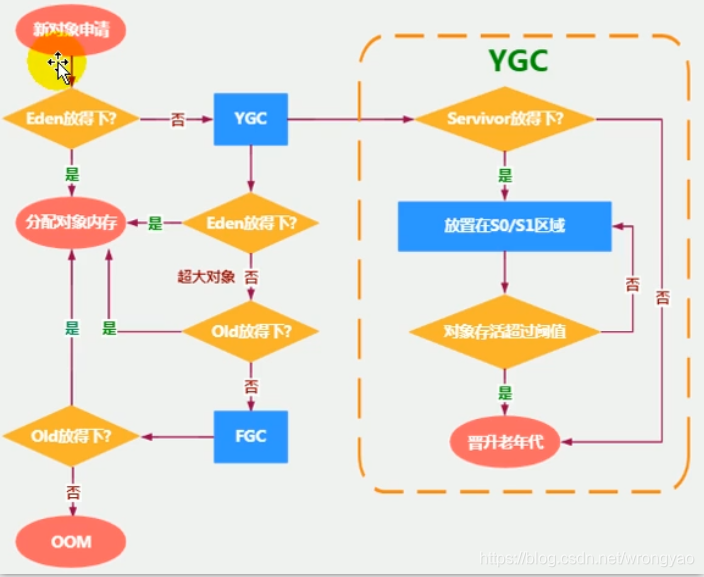

1. Eden区内存满时，这时候触发一次**Minor GC**，把Eden区的存活对象转移到From区，非存活对象进行清理，然后给新创建的对象分配空间，存入Eden区
2. 随着分配对象的增多，Eden区的空间又不足了，这时候再触发一次Minor GC，清理掉Eden区和S1区的死亡对象，把存活对象转移到S2区，然后再给新对象分配内存
3. From区和To区是相对的关系，哪个区中有对象，哪个区就是From区，比如，再进行一次Minor GC，会把存活对象转移到S1区，再为转移之前，S2区是From区，S1区是To区，转移后，S2区中没有存活对象，变为To区，而S1区变为From区
4. 如果S区无法存放，则进入Old区
5. 大对象直接进入老年代，假设新创建的对象很大，比如为5M(这个值可以通过PretenureSizeThreshold这个参数进行设置，默认3M)，那么即使Eden区有足够的空间来存放，**也不会存放在Eden区，而是直接存入老年代**
6. 长期存活的对象将进入老年代（默认15岁）

```shell
-XX:MaxTenuringThreshold=15
```
7. 如果某个(些)对象(原来在内存中存活的对象或者新创建的对象)由于以上原因需要被移动到老年代中，而老年代中没有足够空间容纳这个(些)对象，那么会触发一次Full GC

*总结*：**复制之后有交换，谁空谁是to.**(Eden采用复制算法/  Eden的存活对象少，所以需要复制的对象也少)

# GC日志查看示例

OutOfMemeryError之前一定发生FullGC，因为FullGC之后，老年代内存不够才会报错误

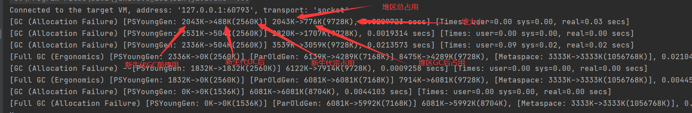

# GC算法

- 年轻代（YoungGeneration）的回收算法（回收主要以Copying为主）
  1. 所有新生成的对象首先都是放在年经代的。年轻代的目标就是尽可能快速的收集掉那些生命周期短的对象
  2. 新生代内存按照8 : 1 : 1的比例分为一个eden区和两个survivor(s0,s1）区。大部分对象在eden区中生成．回收时先将eden区存活对象复制到一个s0区，然后清空eden区，当下一次eden区又满了时，则将eden区和s0区存活对象复制到另一个s1区，然后清空eden和这个s0区，此时s0区是空的，然后将s0区和s1区交换，即保持s1区为空，如此往复.(**谁空谁是to**））。
  3. 当s1区不足以存放eden和survivoro的存活对象时，就将存活对象直接存放到老年代。若是老年代也满了就会触发一次fulIGC(MajorGC)，也就是新生代、老年代都进行回收．
  4. 新生代发生的GC也叫做MinorGC,MinorGC发生频率比较高（不一走等Eden区满了才触发）.
- 老年代（OldGeneration）的回收算法（回收主要以Mark一Colnpact为主）
     1. 在年轻代中经历了N次垃圾回收后仍然存活的对象，就会被放到年老代中．因此，可以认为年老代中存放的都是一些生命周期较长的对象。
     2. 内存比新生代也大很多（大概比例是1:2)，当老年代内存满时触发MajorGC，发生频率比较低，老年代对象存活时间比较长，存活率标记高。
- 持久代（pernlallentGelleration）的回收算法
  用于存放静态文件，如java类、方法等。持久代对垃圾回收没有显著影响，但是有些应用可能动态生成或者调用一些dass，例如Hibernate等，在这种时侯需要设置一个比较大的持久代空间来存放这些运行过程中新增的类。持久代也称方法区
  
  

## Minor GC

- 只是新生代的垃圾回收
- 当年轻代**Eden区**空间不足，触发gc，回收eden和s0
  - **Survivol区满了不会触发GC**
- Minor GC时会引发STW，暂停其他用户线程

## Major GC

- 只是老年代的收集
  - CMS GC会单独收集老年代行为
  - 很多时候Major GC会和Full GC混淆使用，需要区分是老年代收集还是整堆收集
- 执行时间是Minor的10倍以上，停顿时间更长

## Full GC

- 整堆和方法区的垃圾回收
- 老年代空间不足，**方法区**空间不足，触发


# 算法优劣

## 复制算法

当这一块的内存用完了，就将还存活着的对象复制到另外一块内存上面，然后再把已使用过的内存空间一次清理掉

## 标记清除

首先标记出所需回收的对象，在标记完成后统一回收掉所有被标记的对象，**它的标记过程其实就是前面的可达性分析算法中判定垃圾对象的标记过程**

# 逃逸分析

- 堆不是分配对象存储的唯一选择（也可以**栈上分配**/标量替换/同步消除）

## 栈上分配
- 一个对象，如果没有发生逃逸，则他的内存可以在栈上分配
- 判断逃逸：如果一个方法里的对象，可能被其他方法调用，则new 的对象发生逃逸
  （看new的对象是不是在外部表用）

```java
//这里A没有方法外部调用，没有发生逃逸
public void method() {
  A a =  new A();
    ....
  a = null;
}
```

- 结论：能使用局部变量的，不要在方法外定义（堆上分配不需要GC）

```tex
Java8 逃逸分析默认是打开的，也可通过开关控制

-XX:+DoEscapeAnalysis开启逃逸分析
-XX:-DoEscapeAnalysis 关闭逃逸分析
```
## 标量替换

- Hotspot 并未开启栈上分配，但是开启了标量替换

如下：Point 这个聚合量经过逃逸分析后，发现他并没有逃逸，就被替换成两个标量了
替换前代码
```java

public static void main(String args[]) {
    alloc();
}
class Point {
    private int x;
    private int y;
}
private static void alloc() {
    Point point = new Point(1,2);
    System.out.println("point.x" + point.x + ";point.y" + point.y);
}

```
替换后的代码

```java

private static void alloc() {
    int x = 1;
    int y = 2;
    System.out.println("point.x = " + x + "; point.y=" + y);
}

```

# 垃圾回收

## 垃圾回收的相关算法

- 标记阶段
  - 引用计数算法
  - 可达性分析算法
- 清除阶段
  - 标记- 清除算法
  - 复制算法
  - 标记-压缩算法

## 引用计数算法

- 对于一个对象A，只要有任何一个对象引用了A，则A的引用计数器就加1；当引用失效时，引用计数器就减1。只要对象的引用计数器的值为0，即表示对象A不能在被使用，可进行回收。
- **java未使用该算法**（因为无法处理循环引用）
```java
MyObject myObject1 = new MyObject();
MyObject myObject2 = new MyObject();
myObject1.ref = myObject2;
myObject2.ref = myObject1;
myObject1 = null;
myObject2 = null;
```
当代码执行完line7时，两个对象的引用计数均为2。此时将myObject1和myObject2分别置为null，以前一个对象为例，它的引用计数将减1。
若要满足垃圾回收的条件，需要清除myObject2中的ref这个引用，而要清除掉这个引用的前提条件是myObject2引用的对象被回收，
可是该对象的引用计数也为1，因为myObject1.ref指向了它。

- python使用了引用计数（1.手动解除，2.弱引用）

## 可达性分析

- java c#的垃圾回收选择
- 通过一系列称为GC Roots的对象作为起点，然后向下搜索，搜索所走过的路径称为引用链/Reference Chain，当一个对象到GC Roots没有任何引用链相连时，即该对象不可达，也就说明此对象是不可用的

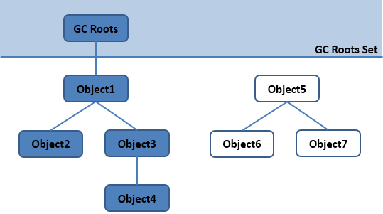

> GC Roots

- GC Roots可以理解为由堆外指向堆内的引用， 一般而言，GC Roots包括（但不限于）以下几种：

1. Java 方法栈桢中的局部变量；
2. 已加载类的静态变量；
3. JNI handles；
4. 已启动且未停止的 Java 线程。

- 比如说：

```tex
虚拟机栈中引用的对象（参数，局部变量等）
方法区中类静态变量
方法区中常量引用的对象
本地方法栈中引用的对象
被同步锁（synchronized）持有的对象
```


# finalization机制

- GC之前自动的调用 java.lang.Object#finalize方法
- finalize调用是逃离死亡的最后机会
- finalize只会被调用一次

# 清除算法

## 标记-清除

> 描述

当堆中的有效内存空间(available memory）被耗尽的时候，就会停止整个程序（也被称为stop the world， 简称**STW**)，然后进行两项工作，第一项则是标记，第二项则是清除。

- 标记：从引用根节点遍历，标记所有被引用对象（**既不可回收对象**），将标记结果记录在对象的header中
- 清除：将所有对象线性遍历，如果发现没有被标记，则回收

> 缺点

- 效率不算高
- GC时需要停止整个应用
- 清理内存时不连续的，容易产生内存碎片（这样需要维护一个虚拟列表）

## 复制算法

- 适用于存活对象少，垃圾多的场景（新生代）

- 核心思想

```tex

将活着的内存空间分为两块，每次只使用其中一块，在垃圾回收时将正在使用的内存中的存活对象复制到未被使用的内存块中，之后清除正在使用的内存块中的所有对象，交换两个内存的角色，最后完成垃圾回收。
```

- 优点

```tex
没有标记和清除过程，实现简单，运行高效
复制过去以后保证空间的连续性，不会出现“碎片”问题
```

- 缺点

```tex
此算法的缺点也是很明显的，就是需要两倍的内存空间。
对于G1这种分拆成为大量region的GC，复制而不是移动，意味着GC需要维护region之间对象引用关系(意味着对象引用需要更改引用地址)，不管是内存占用或者时间开销也不小。
```

## 标记-压缩

- 执行过程

1. 第一阶段和标记-清除算法一样,从根节点开始标记所有被引用对象
2. 第二阶段将所有的存活对象压缩到内存的一端，按顺序排放。
3. 清理边界外所有的空间。

- 优点

```tex
消除了复制算法当中，内存减半的高额代价。
没有碎片化的内存
```

- 缺点

```tex
效率低
移动对象的同时，需要更改对象引用地址
移动过程，需要STW
```


# 复合算法

## 分代收集算法

- 将区域划分成新生代、老年代
- 新生代
  - 区域相对老年代较小，对象生命周期短、存活率低，回收频繁
  - 适用复制算法
- 老年代
  - 区域较大，对象生命周期长、存活率高，回收不及年轻代频繁
  - 一般使用标记清除/标记-压缩算法

## 增量收集算法

- 基本思想

```tex
每次，垃圾收集线程只收集一小片区域的内存空间，接着切换到应用程序线程。依次反复，直到垃圾收集完成。
```

- 缺点

```tex
由于在垃圾回收过程中，间断性地还执行了应用程序代码，所以能减少系统的停顿时间。但是，因为线程切换和上下文转换的消耗，会使得垃圾回收的总体成本上升，造成系统吞吐量的下降。
```

## 分区算法

*基本思想*:

```tex
分区算法将整个堆空间划分成连续的不同小区间region。
每个小区间都独立使用，独立回收
```

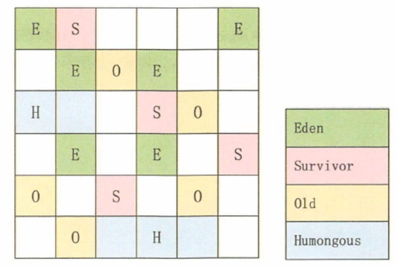


# 垃圾回收器

## GC分类

- 按线程数分
  - 串型垃圾回收
  - 并行垃圾回收

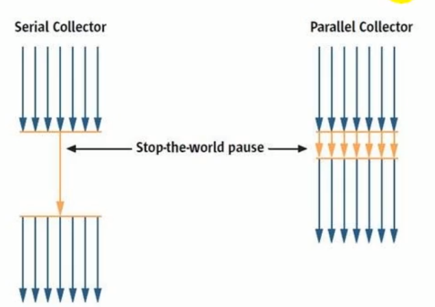

- 按工作模式分
  - 独占式
  - 并发式：工作线程和GC线程能同时进行

- 碎片处理方式
  - 压缩式
  - 非压缩式

## 评估GC的性能指标

- 吞吐量
  - 运行用户代码的时间占总运行时间的比例
  - 总运行时间:程序的运行时间＋内存回收的时间
- 暂停时间
  - 执行垃圾收集时，程序的工作线程被暂停的时间。
- 内存占用 
  - Java 堆区所占的内存大小

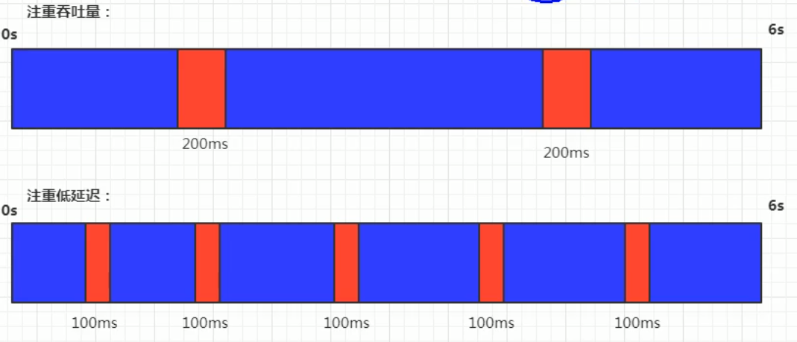

## 并行和并发概念

对于垃圾回收；来说

- **并行（Parallel）**：指多条垃圾收集线程并行工作，但此时用户线程仍然处于等待状态。
- **并发（Concurrent）**：指用户线程与垃圾收集线程同时执行（但不一定是并行，可能会交替执行），用户程序在继续运行，而垃圾收集器运行在另一个 CPU 上


## 七种经典回收器

1. 新生代收集器：Serial（复制算法）、ParNew、Parallel Scavenge；

2. 老年代收集器：Serial Old（标记-整理）、Parallel Old、CMS（标记-清除）；

3. 整堆收集器：G1（标记-整理）；

- 搭配关系图
  - 红色虚线：jdk8移除
  - 绿色虚线：jdk14移除
  - 青色虚线：jdk14移除（删除CMS垃圾回收）

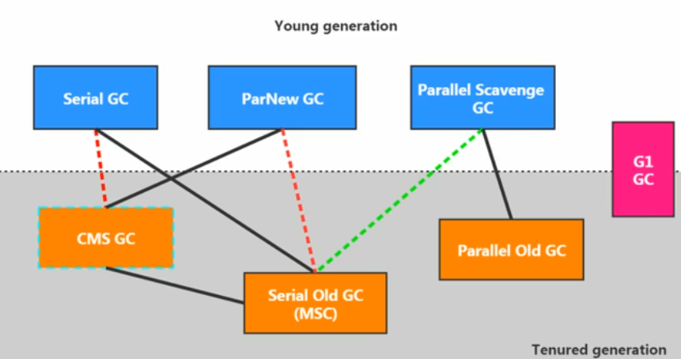


### Serial回收器

- 高延迟
- Serial收集器采用复制算法、串行回收和"Stop-the-World"机制的方式执行内存回收。

Serial old：

- 除了年轻代之外，Serial收集器还提供用于执行老年代垃圾收集的Serial old收集器。serial old收集器同样也采用了串行回收(标记-压缩算法)
  - Serial old是运行在client模式下默认的老年代的垃圾回收器
  - Serial old在Server模式下主要有两个用途:
    - 与新生代的Parallelscavenge配合使用
    - 作为老年代CMS收集器的后备垃圾收集方案

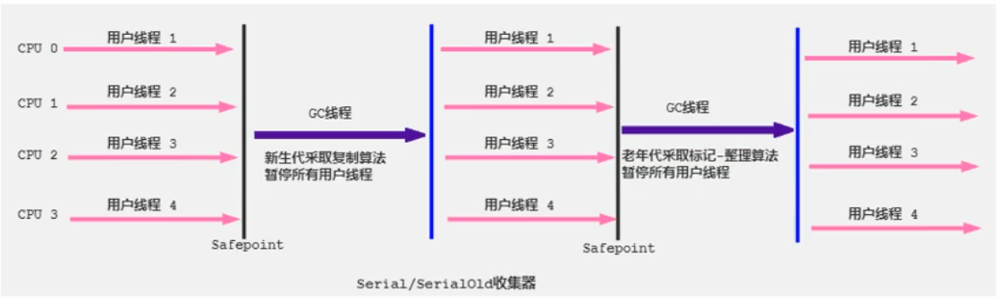


### ParNew 回收器

- ParNew 收集器其实就是 Serial 收集器的多线程版本，除了使用多线程进行垃圾收集外，其余行为（控制参数、收集算法、回收策略等等）和 Serial 收集器完全一样
- 采用并行回收的方式执行内存回收
- 年轻代采用复制算法
- JDK14删除了该算法

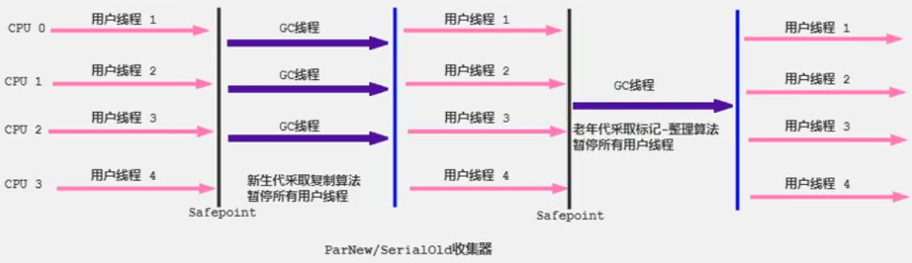


### Parallel Scavenge回收器

- **吞吐量优先**
- JDK8默认垃圾回收
- 适合在后台运算而不需要太多交互的任务的业务场景（例如：那些执行批量处理、订单处理、工资支付、科学计算的应用程序。）
- Parallel 收集器在JDK1.6时提供了用于执行老年代垃圾收集的Parallel old收集器，用来代替老年代的Serial old收集器。
- Parallel old收集器采用了**标记-压缩算法**，但同样也是基于**并行回收**

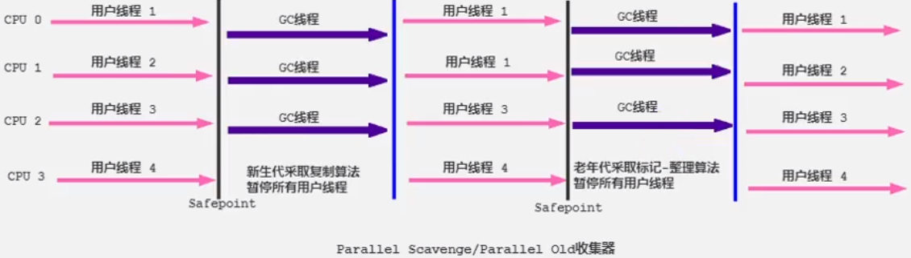


### CMS 回收器

- **低延迟**

- 第一款真正意义上的并发收集器（用户线程和GC线程并发执行）
- 采用标记-清除算法

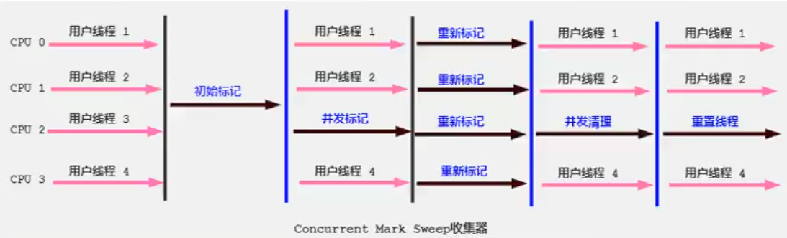

- GC阶段
  - 初始标记：标记出GC Roots能直接关联到的对象
  - 并发标记(Concurrent-Mark)阶段:从GC Roots的直接关联对象开始遍历整个对象图的过程（ 同时开启 GC 和用户线程，用一个闭包结构去记录可达对象。但在这个阶段结束，这个闭包结构并不能保证包含当前所有的可达对象。因为用户线程可能会不断的更新引用域，所以 GC 线程无法保证可达性分析的实时性。所以这个算法里会跟踪记录这些发生引用更新的地方）
  - 重新标记
  - 并发清除

```tex
有人会觉得既然Mark Sweep会造成内存碎片,那么为什么不把算法换成Mark Compact呢?

因为在清除阶段，用户线程还在使用
```

#### CMS的缺点

1. CMS收集器对CPU资源非常敏感。在并发阶段，虽然不会导致用户线程停顿，但是会占用CPU资源而导致引用程序变慢，总吞吐量下降
2. CMS收集器无法处理浮动垃圾，由于CMS并发清理阶段用户线程还在运行，伴随程序的运行自然会有新的垃圾不断产生，这一部分垃圾出现在标记过程之后，称为“浮动垃圾”，CMS 无法在本次收集中处理它们，只好留待下一次GC时将其清理掉
2. 如果浮动垃圾过多，老年代内存超过一定的阈值（90%默认），那么CMS会有一个长时间的stw,串行化的回收垃圾
2. remark 阶段（参考三色标记法），是一个stw的过程
3. CMS是基于“标记-清除”算法实现的收集器，会产生大量不连续的内存碎片。当老年代空间碎片太多时，如果无法找到一块足够大的连续内存存放对象时，将不得不提前触发一次Full GC，为了解决这个问题，CMS收集器提供了一个-XX:UseCMSCompactAtFullCollection开关参数（默认就是true了），用于在Full  GC之后增加一个碎片整理过程，还可通过-XX:CMSFullGCBeforeCompaction参数设置执行多少次不压缩的Full  GC之后，跟着来一次碎片整理过程
   


### G1垃圾回收器

*官方给G1设定的目标是在延迟可控的情况下获得尽可能高的吞吐量*
所以才担当起“全功能收集器”的重任与期望。

- G1是一个并行回收器，它把堆内存分割为很多不相关的区域(Region),使用不同的Region来表示Eden、幸存者0区，幸存者1区，老年代等
- 后台维护一个优先列表，每次根据允许的收集时间，优先回收价值最大的Region(比如有些region，回收过后依旧还占很大内存，那么这个回收价值不大)
- JDK9默认垃圾回收

#### G1结构图

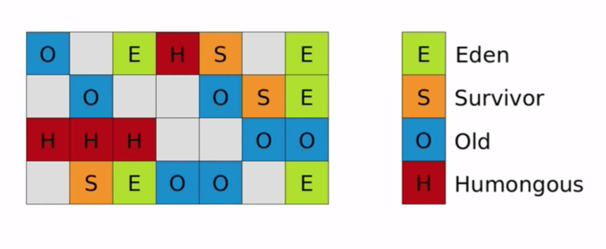

1. G1 算法将堆划分为若干个区域（Region)，它仍然属于分代收集器（物理上不分代，逻辑上分代）
   1. G1的eden区和Old区不是固定的
2. Humoungous:大对象存储区域
   1. 对于堆中的大对象,默认直接会被分配到老年代，但是如果它是一个短期存在的大对象就会对垃圾收集器造成负面影响。为了解决这个问题，G1划分了一个Humongous区,它用来专门存放大对象。如果一个H区装不下一个大对象，那么G1会寻找连续的H区来存储。为了能找到连续的H区，有时候不得不启动Full GC。G1的大多数行为都把H区作为老年代的一部分来看待。

#### Card Table

1. 问题：如果我们扫描年轻代的垃圾对象，判断这个对象是不是被老年代的对象引用，那么，将要扫描老年代所有对象，判断其是否指向这个对象，这是一个非常恐怖的

2. 解决方案：它将堆内存划分为一系列固定大小的区域（卡片：类似与一个个的page）,如果说，有一个老年代的card，这个card区域有对象指向了年轻代的对象，那么这个老年代的card标记为<b id="gray">dirty</b>
3. 卡表通常在 JVM 中实现为单字节数组。当我们把 JVM 划分成不同区域的时候，每一个区域（通常是4k字节）就得到了一个标志位。每一位为 1 的时候，表明这个区域为 dirty，持有新生代对象，否则，这个区域不持有新生代对象

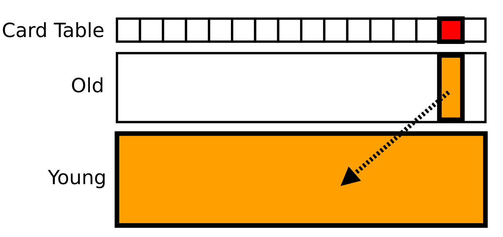

#### CSET

G1划分了很多个region，而Cset存储的就是这些待回收的Region,到了回收阶段，那么从CSet 寻找


#### RSet

记录了其他Reqion中的对象到本Region的引用

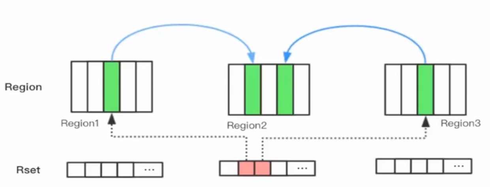

RSet的价值在于: 使得垃圾收集器不需要扫描整个堆找到谁引用了当前分区中的对象，只需要扫描RSet即可。

1. 注意 Remember Set 不是直接记录对象地址，而是记录了那些对象所在的 Card 编号
2. RSet 其实是一个 Hash Table，Key 是别的 Region 的起始地址，Value 是一个集合，里面的元素是 Card Table 的 Index


#### GC模式

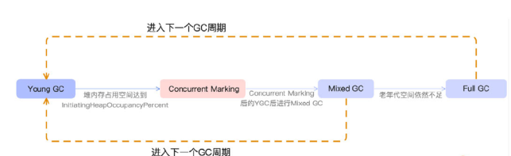

1. 当Eden区的内存空间无法支持新对象的内存分配时，G1 会触发 Young GC

2. 当垃圾的占比达到-XX:G1HeapWastePercent中所设置的G1HeapWastePercent 比例时（默认45%）,在下次YoungGC后会触发一次MixedGC。所谓MixedGC是指回收年轻代的Region以及一部分老年代中的Region。
   1. MixedGC的GC过程类似CMS
3. FullGC
   1. g1的调优目标：尽量没有FullGC
   2. 在MixedGC过程中，如果发现老年代空间还是不足，此时如果G1HeapWastePercent设定过低，可能引l发FullGC。-XX:G1HeapWastePercent默认是5

#### 缺点

额外内存占用比较大（小内存应用上CMS表现要好点，6-8Gb）

#### 参数设置

-XX:+UseG1GC：手动指定G1垃圾回收

-XX:G1HeapRegionsize设置每个Region的大小值是2的幂，范围是1MB到32MB之间，目标是根据最小的Java堆大小划分出约2048个区域。默认是堆内存的1/2000。

-XX:MaxGCPauseMillis:设置期望达到的最大GC停顿时间指标(JVM会尽力,实现，但不保证达到)。默认值是200ms

#### G1常见调优

如果G1产生FGC，你应该做什么

1. 扩内存
2. 提高CPU性能（回收的快，业务逻辑产生对象的速度固定，垃圾回收越快，内存空间越大）
3. 降低MixedGC触发的阅值，让MixedGC提早发生(默认是45%)

#### 适用场景

- 面向服务端应用，针对具有大内存、多处理器的机器。(在普通大小的堆里表现并惊喜)

- 最主要的应用是需要低GC延迟，并具有大堆的应用程序提供解决方案;


##  垃圾回收器总结

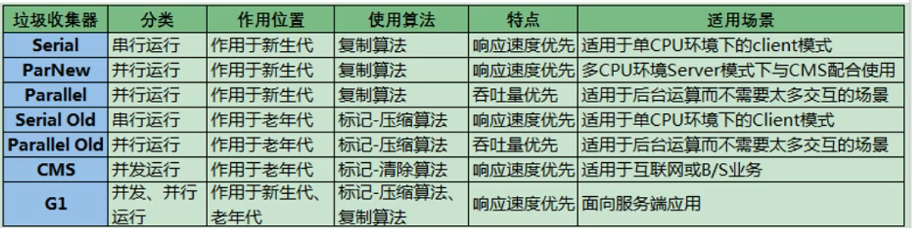

## 指针碰撞

如果Java堆中内存是绝对规整的，所有用过的内存都放在一边，空闲的内存放在另一边，中间放着一个指针作为分界点的指示器，那分配内存就仅仅是把那个指针向空闲空间那边挪动一段与对象大小相等的距离，这种分配方式称为"指针碰撞"。

指针碰撞适用于Serial和ParNew等不会产生内存碎片的垃圾收集器

## 空闲列表

如果Java堆中的内存并不是规整的，已使用的内存和空闲的内存相互交错，那就没有办法简单地进行指针碰撞了，虚拟机就必须维护一个列表，记录上哪些内存块是可用的，在分配的时候从列表中找到一块足够大的空间划分给对象实例，并更新列表上的记录，这种分配方式称为"空闲列表"。

## 查看垃圾回收器

- 添加参数：-XX:+PrintCommandLineFlags
  - 可以看到UseParallelGC垃圾回去

```tex
-XX:InitialHeapSize=6291456 -XX:MaxHeapSize=6291456 -XX:+PrintCommandLineFlags -XX:+PrintGCDetails -XX:+UseCompressedClassPointers -XX:+UseCompressedOops -XX:-UseLargePagesIndividualAllocation -XX:+UseParallelGC 
```

- jinfo -flag UseParallelGC 进程号

# 三色标记法

## 产生原因

为了解决垃圾收集过程中用户线程停顿时间过长的问题，三色标记法允许垃圾回收过程与程序<b id="red">并发执行</b>，实现了增量式垃圾回收。

CMS 回收器/G1回收器，采用的并发标记的过程，比如 有三个对象， 有一个已经扫描过，有一个只扫描了一半，有一个完全没有扫描，那么另一个线程再次扫描的时候，不需要扫描黑色的对象了

## 描述

三色标记算法指的是将所有对象分为白色、黑色和灰色<b id="blue">三种类型状态</b>。

- 黑色表示从 GCRoots 开始，已扫描过它全部引用的对象
- 灰色指的是扫描过对象本身，还没完全扫描过它全部引用的对象
- 白色指的是还没扫描过的对象

## 扫描过程

- 初始标记阶段，指的是标记 GCRoots 直接引用的节点，将它们标记为灰色，这个阶段需要 「Stop the World」。
- 并发标记阶段，指的是从灰色节点开始，去扫描整个引用链，然后将它们标记为黑色，这个阶段不需要「Stop the World」。
- 重新标记阶段，指的是去校正并发标记阶段的错误，这个阶段需要「Stop the World」。
- 并发清除，指的是将已经确定为垃圾的对象清除掉，这个阶段不需要「Stop the World」

## 多标问题

多标问题指的是原本应该回收的对象，被多余地标记为黑色存活对象，从而导致该垃圾对象没有被回收，多标问题会导致内存产生浮动垃圾，但好在其可以再下次 GC 的时候被回收，因此问题还不算很严重。

比如 A(黑)->B(黑),在并发调度过程,用户线程将 A->B 断开，那么 B就是个垃圾，但是B应该被回收的，只能下次扫描回收了

## 漏标问题

漏标问题指的是被标记为黑色的A对象，在并发的执行过程中，指向了一个白色对象，由于此时A对象是黑色的，那么，这个白色对象则永远不会被扫描到了

比如：

在并发调度过程，D（黑）->E（灰）->G（白）, 此时，时间调度当前垃圾回收暂停，用户线程将E->G断开，D->G引用上

那么，当垃圾回收线程恢复时间片的时候，G则不会被扫描到了，那么扫描不到，则G被当成垃圾回收掉

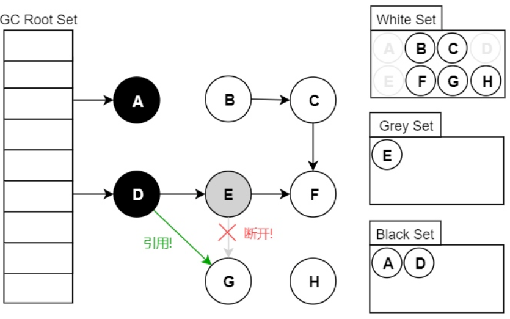

## 漏标解决方案

### CMS 解决方案

CMS 回收器采用的是增量更新方案：

当白色对象被重新指定引用时，如果被指定的对象被标记成黑色，就将这个引用关系记录下来

比如，D（黑色）指向G的时候

等并发标记结束后，将记录下来的这些引用关系重新扫描一遍，以黑色对象为根，相当黑色对象又变成了灰色对象（remark阶段）。

### G1 解决方案

G1 回收器采用的是原始快照的方案：

1. 当如果一个白色对象要和灰色对象断开关系时，就将这对关系也记录下来
2. 在并发标记结束之后，就从记录里面找出这些对象，以灰色对象为根，重新扫描，目的就是为了再次扫描白色对象，看有没有其他引用指向他(怎么找有没有黑对象指向他？)
