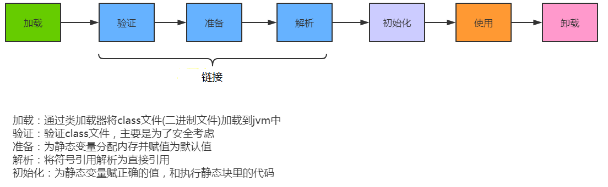

#

相关代码；[stu-java-base/stu-java8/src/main/java/com/xiao/jvm/classLoader · 小肖/learning - 码云 - 开源中国](https://gitee.com/xiaojihao/learning/tree/master/stu-java-base/stu-java8/src/main/java/com/xiao/jvm/classLoader)

# 类生命周期


## 解析

将类、接口f字段和方法的符号引用转为直接引用。


## 初始化阶段

为类的静态变量赋予正确的初始值。


- 初始化阶段的重要工作是执行类的初始化方法:<clinit>()方法。

由代码可见，初始化阶段会执行clinit方法,有静态代码块，或者静态变量，就会有clinit（静态常量不会产生）

```java
public static int i = 1;
public static int j;
static {
    j = 2;
    System.out.println(j);
}
```

```shell
 0 iconst_1
 1 putstatic #2 <com/xiao/classLoader/TestStatic.i>
 4 iconst_2
 5 putstatic #3 <com/xiao/classLoader/TestStatic.j>
 8 getstatic #4 <java/lang/System.out>
11 getstatic #3 <com/xiao/classLoader/TestStatic.j>
14 invokevirtual #5 <java/io/PrintStream.println>
17 return
```


*注意*：

1. 在加载一个类之前，虚拟机总是会试图加载该类的父类，因此父类的<clinit>总是在子类<clinit>之前被调用。也就是说，父类的static块优先级高于子类。
口诀:由父及子，静态先行。
2. 引用类型的不管是final还是不是，是static就是在clinit中赋值

*没有clinit场景*：
1. 非静态变量
2. 静态变量未赋值
3. 常量赋值

```java
//非静态变量
public int i;
//静态变量未赋值
public static int j;
//常量
public static final int k = 1;
```

**clinit虚拟机加锁了，是线程安全的**


# 主动使用

- 只有主动使用的类才能执行clinit

主动使用场景：

1. 当创建一个类的实例时，比如使用new关键字，或者通过反射、克隆、反序列化,序列化。
2. 调用类的静态方法
3. 当使用java.Lang.reflect包中的方法反射类的方法时。比如:Class.forName( "com.atguigu.java.Test")
4. 当初始化子类时，如果发现其父类还没有进行过初始化，则需要先触发其父类的初始化。（由父及子）
5. 如果一个接口定义了default方法，那么直接实现或者间接实现该接口的类的初始化，该接口要在其之前被初始化。（**如果没有default，父接口就不会初始化**）
6. 当虚拟机启动时，用户需要指定一个要执行的主类（包含main()方法的那个类），虚拟机会先初始化这个主类。

# 被动使用

- 被动使用不会调用cliinit

场景：

1. 调用常量的基础字段

```java
    @Test
    public void test() {
        System.out.println(Order.num);
    }
}
class Order {
    static {
        System.out.println("输出...");
    }
    public static final int num = 1;
}
```

2. 从子类调用父类的静态变量，子类不会初始化
3. 数组类引用，不会初始化
4. ClassLoader加载不会触发

```java
ClassLoader.getSystemClassLoader().loadClass("com.xiao.classLoader.Order");
```


# 类加载分类

*显示加载*:

- 显式加载指的是在代码中通过调用classLoader加载class对象，如直接使用class.forName(name)或this.getclass().getclassLoader().loadClass()加载class对象。

*隐式加载*:

实际就是不用我们代码主动声明，而是JVM在适当的时机自动加载类。比如主动引用某个类时，会自动触发类加载和初始化阶段。
1. 创建类对象
2. 使用类的静态域
3. 创建子类对象


# 命名空间

- 比较两个类是否相等，只有在这两个类是由同一个类加载器加载的前提下才有意义。
- 即同一个Class文件，被不同加载器加载，则他们的类必定是不相同的

```tex
在同一命名空间中，不会出现类的完整名字（包括类的包名）相同的两个类
在不同的命名空间中，有可能会出现类的完整名字（包括类的包名）相同的两个类
```

# 类加载器结构

类加载器都继承ClassLoader

- 他们的父子结构是特殊的，通过属性来确定的，而不是通过继承的关系来实现的
- 这个属性，定义在顶级的ClassLoader中

```java
public ClassLoader {
    //通过这个属性来记录父的加载器，
    private final ClassLoader parent;
}

```

# 类加载器分类

## 引导类加载器

- Bootstrap ClassLoader

- 使用C/C++实现的，嵌套JVM内部
- 用来加载java的核心库（JAVA_HOME/jre/lib/rt.jar或sun.boot.class.path路径下的内容）
- 加载扩展和应用类加载器

获取引导类加载器可以加载的jar包

```java
URL[] urLs = Launcher.getBootstrapClassPath().getURLs();
Stream.of(urLs).forEach(url -> System.out.println(url.toExternalForm()));
```


- 启动类加载器， 自定义类加载器没办法获取到引导类加载器

- 它用来加载java的核心库(例如：String 类型)
- 它没有父类加载器

```java
//String 类使用引导类加载器
//java核心库使用引导类加载器
ClassLoader loader = String.class.getClassLoader();
//输出null（凡是这里是null的都是引导类加载器）
System.out.println(loader);
```

## 扩展类加载器

- Extension ClassLoader

- Java语言编写，由sun.misc.Launcher$ExtClassLoader实现。


获取扩展类加载器目录

```java
String property = System.getProperty("java.ext.dirs");
Arrays.stream(property.split(";")).forEach(System.out::println);
```

输出：

```tex
C:\Program Files\Java\jdk1.8.0_131\jre\lib\ext
C:\Windows\Sun\Java\lib\ext
```

## 系统类加载器

- App ClassLoader


# 代码获取类加载器

```java
//获取系统类加载器
ClassLoader systemClassLoader = ClassLoader.getSystemClassLoader();
//sun.misc.Launcher$AppClassLoader@18b4aac2
System.out.println(systemClassLoader);
//获取自定义类加载器（可以发现他默认使用的是系统类加载器）
ClassLoader classLoader = TestClassLoader.class.getClassLoader();
//sun.misc.Launcher$AppClassLoader@18b4aac2
System.out.println(classLoader);
```

1. Clasz.getClassLoader()

 String类型由于是引导类加载器加载的，所以获取classLoader是null

```java
Class.forName("java.lang.String").getClassLoader();
```

2. 线程的方式获取上下文的loader

```java
Thread.currentThread().getContextClassLoader()
```

3. 获取当前系统类加载器

```java
ClassLoader.getSystemClassLoader()
```

# 获取类加载器能够加载的jar包

```java
URL[] urLs = Launcher.getBootstrapClassPath().getURLs();
Stream.of(urLs).forEach(url -> System.out.println(url.toExternalForm()));
```

# 自定义类加载器

- ·什么时候需要自定义类加载器

  - 隔离加载器
  - 修改类的加载方式
  - 扩展加载源
  - 防止源码泄露

- 自定义类加载器方式

  - 继承URLClassLoader即可/继承ClassLoader
  - 重写loadClass() /findClass()方法
  - loadClass重写可能会破坏双亲委派机制

# 双亲委派机制

## 原理

1. 如果一个类加载器收到请求，它不会自己先去加载，而是把这个加载委托给父类的加载器，如果父类加载器还存在父类加载器，就会依次递归，直到最顶层的启动类加载器
2. 如果父类加载器加载返回失败，则子类才会自己尝试去加载


如果一个类加载器在接到加载类的请求时，它首先不会自己尝试去加载这个类，而是把这个请求任务委托给父类加载器去完成，依次递归，如果父类加载器可以完成类加载任务，就成功返回。只有父类加载器无法完成此加载任务时，才自己去加载。

- 如果重写loadClass，可以破坏双亲委派机制，但是，自定义的ClassLoader无法加载核心类，因为jvm有保护机制


## 优势

1. 避免类的重复加载,确保一个类的全局唯一性（如：String类型只能被Bootstrap加载，不能被其他类加载器加载）
2. 保护程序加载，避免核心API被恶意篡改

## 判断用一个类的条件

1. 包目录类名相同
2. 类加载器相同

## 破坏双亲委派

1. 重写loadClass方法

- 自定义类加载器重写loadClass可以破坏loadClass
  - 不过我们尽量重写findClass，不要破坏

```java
public class MyClassLoader extends ClassLoader {
    @Override
    public Class<?> loadClass(String name) throws ClassNotFoundException {
        // 跳过父类委派，直接加载指定类
        if (name.startsWith("com.example")) {
            return findClass(name);
        }
        return super.loadClass(name);
    }
}
```


2. JAVA SPI 方式

- Serverloader.load里优先使用当前线程的类加载器而不是自身使用的类加载器来加载类

3. 双亲委派模型的第三次“被破坏”是由于用户对程序动态性的追求而导致的。如:代码热替换(Hot Swap〉、模块热部署（Hot Deployment）等

- 热替换：修改程序文件立即生效（如：js）
- 热部署

## 相关面试题

1. 在java.lang包下建立一个自定义String类，直接去new，能使用么？

答：不能，因为java.lang.String是由引导类加载的，此时，自定义类的不会被加载（父类加载器能被加载，子类加载器就不会再加载了）