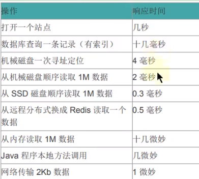
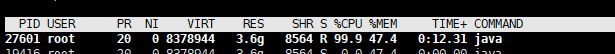
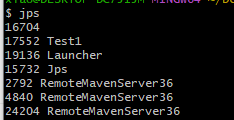
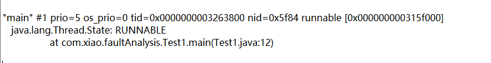
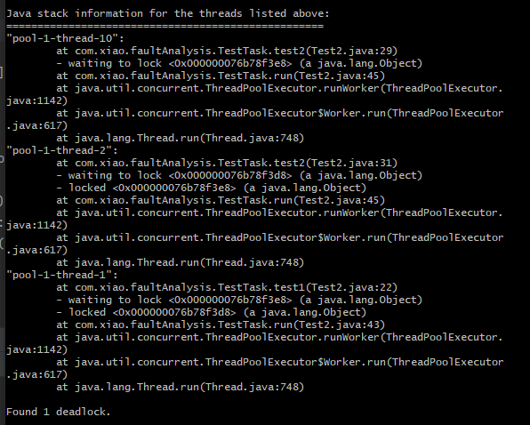

#

# 为什么调优

- 防止出现OOM
- 解决OOM
- 减少full GC出现

# 性能调优步骤

1. 性能监控

- GC频繁

2. 性能分析（开发环境）
3. 性能调优

- 适当增加内存
- 优化代码，控制内存的使用

# 性能指标

1. 停顿时间



2. 吞吐量

- 单位时间内，完成的工作量

- GC中，运行用户代码的时间占总运行时间的比例

3. 并发数：同一时刻，服务器实际交互的请求数
4. 内存占用


# GC信息的排查

## 常用参数

https://docs.oracle.com/javase/8/docs/technotes/tools/unix/java.html

```
-Xms 设置堆的初始值(默认物理内存的1/64)
-Xmx 设置堆的最大值（默认物理内存的1/4）
-Xmn 设置新生代的大小
-XX:NewRatio 新生代与老年代的比例
-XX:+PrintGCDetails 打印 垃圾回收 的细节
```

- 查看默认值

```shell

## 查看某个参数的设置值
$ jinfo -flag NewRatio 8884
-XX:NewRatio=2
```


## 查看GC

- 方式1
  - S0和S1只会有一个同一时刻存储数据
  - 代码中Runtime.getRuntime().totalMemory()只会计算一个S区的内存

```shell
C:\Users\alonePc>jps
12192
14296 Jps
15192 HeapSpace
9720 Launcher
# 老年代， OC:总量 OU：使用的数量（kb）/1024=M
C:\Users\alonePc>jstat -gc 15192
 S0C    S1C    S0U    S1U      EC       EU        OC         OU       MC     MU    CCSC   CCSU   YGC     YGCT    FGC    FGCT     GCT
10752.0 10752.0  0.0    0.0   65536.0   5243.8   175104.0     0.0     4480.0 781.2  384.0   75.9       0    0.000   0      0.000    0.000
```

- 方式2

  - 设置启动参数
  - 他是程序执行之后打印的

```shell
## 打印详细信息
-XX:+PrintGCDetails
## 打印简要信息
-XX:+PrintGC
```
## GC日志分析

> 常用参数

```shell
## 输出GC日志
-XX:+PrintGC
## 输出GC详细信息
-XX:+PrintGCDetails
## 输出GC时间蹉
-XX:+PrintGCTimeStamps
## 输出GC时间（以日期为基准）
-XX:+PrintGCDateStamps
## -在GC前后打印堆的信息
-XX：+PrintHeapAtGC
## 日志文件输出
-Xloggc:../logs/gc.log
```

  *-XX:+PrintGC*
  - GC/Full GC: GC的类型
  - Allocation Failure：GC原因
  - 3708K->3844K：GC前后大小
  - (5632K)：堆大小

```tex
[GC (Allocation Failure)  3708K->3844K(5632K), 0.0007932 secs]
[Full GC (Ergonomics)  3844K->3305K(5632K), 0.0071881 secs]
```

*-XX:+PrintGCDetails*
  - (Allocation Failure) :GC的原因
  - PSYoungGen:对应新生代垃圾回收（Parallel）
  -  [PSYoungGen: 1512K->488K(1536K)] ：新生代内容，GC前后大小（新生代大小）
  - Times: user=0.06 sys=0.00, real=0.01 secs: 执行时间，系统时间，垃圾实际时间

```tex
[GC (Allocation Failure) [PSYoungGen: 1512K->488K(1536K)] 3764K->3900K(5632K), 0.0011602 secs] [Times: user=0.00 sys=0.00, real=0.00 secs] 
[Full GC (Ergonomics) [PSYoungGen: 488K->0K(1536K)] [ParOldGen: 3412K->3407K(4096K)] 3900K->3407K(5632K), [Metaspace: 3330K->3330K(1056768K)], 0.0087257 secs] [Times: user=0.06 sys=0.00, real=0.01 secs] 

```

- 由于多核的原因，一般的Gc事件中，real time是小于sys + user time的，因为一般是多个线程并发的去做Gc，所以real time是要小于sys+user time的。如果real>sys+user的话，则你的应用可能存在下列问题:IO负载非常重或者是CPU不够用。

# 一些基础命令

## jps

- 查看正在运行的java进程
  - -q：只看进程id
  - -m: 获取对应的启动的形参信息
  - -v : 获取启动时jvm的参数，如：-Xms等

```shell
$ jps -help
usage: jps [-help]
       jps [-q] [-mlvV] [<hostid>]

Definitions:
    <hostid>:      <hostname>[:<port>]

```

```shell
## 对应全限定名
$ jps -l
10616 sun.tools.jps.Jps
4956
9036 org.jetbrains.jps.cmdline.Launcher

```

## jstat

常用于查看内存泄漏和垃圾回收问题

```shell
## -t ：输出时间
## -h : -h3表示每隔3条数据打印一个表头
jstat -<option> [-t] [-h<lines>] <vmid> [<interval> [<count>]]
```

*垃圾回收相关的*

1. -gc的 GCT列如果配合 -t来使用，就能计算出 gc时间占使用时间的比例

如果该比例超过20%，则说明目前堆的压力较大;如果该比例超过9o%，奥说明堆里几乎没有可用空间，随时都可能抛出OOM异常。

2. -gc如果OU列一直在涨，那么可能会爆发oom的危险

```shell
# 打印内存的使用相关信息，包括s区 eden区 older区
$ jstat -gc 4956
## 内存空间的占比情况
$ jstat -gcutil 4956
## 关注gc产生的原因
$ jstat -gccause 4956

```


### option说明

*class相关的*

```shell
# 加载类的个数 字节数 卸载类个数 字节数 花费时间
$ jstat -class 4956
Loaded  Bytes  Unloaded  Bytes     Time
 51499 105773.3       60    56.5     349.93

```

*与JIT及时编译相关的参数*：

```shell
## 编译的数量 失败数 
$ jstat -compiler 4956
Compiled Failed Invalid   Time   FailedType FailedMethod
   34830      0       0    85.18          0
# 打印被JIT编译的方法
$ jstat -printcompilation 4956
Compiled  Size  Type Method
   35289     22    1 com/jediterm/terminal/ProcessTtyConnector read

```

### interval

数字，用于循环打印，每隔多少毫秒打印一次

### count

用于查询的总次数

```shell
### 每隔1秒输出，输出3次
$ jstat -class 4956 1000 3
Loaded  Bytes  Unloaded  Bytes     Time
 51506 105792.0       60    56.5     349.95
 51506 105792.0       60    56.5     349.95
 51506 105792.0       60    56.5     349.95

```

## jinfo

查看虚拟机配置参数信息，也可用于调整虚拟机的配置参数。

- 如果是修改，只有  manageable类型的才能被修改

```shell
jinfo [option] <pid>

where <option> is one of:
    -flag <name>        是否使用了当前name的配置
    -flag [+|-]<name>   使某个参数生效或者失效（boolean类型）
    -flag <name>=<value> 设置数值类型的参数
    -flags               显示设置过得参数
    -sysprops            显示当前系统的属性信息
    <no option>          to print both of the above
    -h | -help           to print this help message

```

- 一些拓展参数

```shell
## 查看jvm的初始值
java -XX:+PrintFlagsInitial 4956
## 最终值， :=表示修改过
java -XX:+PrintFlagsFinal 4956
```


## jmap

到处内存映像文件/内存的使用情况

jmap命令是在**安全点**才能执行的

- -dump

1. 生成java堆的快照：dump文件

2. -dump:live 保存堆中存活的对象

- -heap

输出整个堆空间的详细信息，包括GC的使用、堆配置信息，以及内存的使用信息

- -histo

输出堆中对象的统计信息，包括类、实例数量和合计容量

### 导出对象的快照文件

由于生成dump文件比较耗时，因此大家需要耐心等待，尤其是大内存镜像生成dump文件则需要耗费更长的时间来完成。

- 手动的方式

```shell
##
jmap -dump:format=b,file=d:\1.hprof 3676
Dumping heap to D:\1.hprof ...
Heap dump file created
## 打印存活的堆空间对象
jmap -dump:live,format=b,file=d:\2.hprof 3676
Dumping heap to D:\2.hprof ...
Heap dump file created
```

- 自动的方式

程序在报OOM的时候，导出dump文件

```shell
-XX:+HeapDumpOnOutOfMemoryError -XX:HeapDumpPath=${目录}
```

### 查看堆占用

```shell
### 显示那一刻堆的使用
jmap -heap 3676
```

```shell
## 对象占用内存的情况
jmap -histo 3676
```

# GC工具分析日志

### gceasy

1. -Xloggc:gc.log进行GC日志输出
2. 使用工具上传文件（gcviewer/https://gceasy.io/）

### gcviewer


# GC的分类

- 新生代收集（Minor GC / Young GC）:只是新生代（Eden\S0,s1）的垃圾收集
- 老年代收集（Major GC / 0ld GC）:只是老年代的垃圾收集。
  - 目前，只有CMS GC会有单独收集老年代的行为。
- 混合收集（Mixed GC):收集整个新生代以及部分老年代的垃圾收集。
  - 目前，只有G1 GC会有这种行为
- 整堆收集（Full GC):收集整个java堆和方法区的垃圾收集。

```tex
什么时候触发Full GC

老年代空间不足
方法区空间不足
大对象直接进入老年代，而老年代的可用空间不足
```

# CPU100%

一般来说，Cpu100%有一下几种情况

1. GC太过频繁，GC时间过长
2. 某个线程有死循环或者N循环操作

## 服务器排查方式

1. top命令，查询对应cpu100%对应的进程， 获取到pid
2.  top -Hp 某个pid，查看对应的线程占用cpu



3.  jstack 进程pid >> k.txt 命令输出当前的线程信息
4. 讲线程的pid转为16进制,进入K文件，进行搜索查询代码快

# 死循环排查示例

```java
public static void main(String[] args) throws InterruptedException {
    while (true) {

    }
}
```

执行之后，通过jps命令获取当前进程id



通过命令

```shell
$ jstack 17552 >> test1.txt
```

排查正在允许的runable代码块，来跟进当前的运行代码



# 死锁

```java
class TestTask implements Runnable {
    private Object obj1;
    private Object obj2;
    private int order;

    public TestTask(int order, Object obj1, Object obj2) {
        this.order = order;
        this.obj1 = obj1;
        this.obj2 = obj2;
    }

    public void test1() throws InterruptedException {
        synchronized (obj1) {
            //建议线程调取器切换到其它线程运行
            Thread.yield();
            synchronized (obj2) {
                System.out.println("test。。。");
            }

        }
    }
    public void test2() throws InterruptedException {
        synchronized (obj2) {
            Thread.yield();
            synchronized (obj1) {
                System.out.println("test。。。");
            }

        }
    }

    @Override
    public void run() {

        while (true) {
            try {
                if(this.order == 1){
                    this.test1();
                }else{
                    this.test2();
                }
                
            } catch (InterruptedException e) {
                e.printStackTrace();
            }
        }

    }
}

public class Test2 {

    public static void main(String[] args) throws InterruptedException {
        Object obj1 = new Object();
        Object obj2 = new Object();

        ExecutorService ex = Executors.newFixedThreadPool(10);
        // 起10个线程
        for (int i = 0; i < 10; i++) {
            int order = i%2==0 ? 1 : 0;
            ex.execute(new TestTask(order, obj1, obj2));
        }

    }
}
```

jstack查看死锁代码块

