# JVM结构

- class 文件通过class loader加载到内存中
- 内存中
  - 多线程之间，方法区和堆是共享的
  - 每个线程独有一份计数器和栈
  - java的指令是基于栈实现的（**主要考虑夸平台性**）
- 执行引擎（加载内存后，解释运行，将字节码文件解释成**机器指令**）
  - 解释器
    - 逐行解释字节码进行执行
    - 响应时间快
  - JIT编译器
    - 寻找热点代码进行缓存，然后编译执行
    - 性能好
  - 垃圾回收器

- 程序计数器
  - 线程私有的
  - 字节码解释器工作时就是通过改变这个计数器的值来选取下一条需要执行的字节码指令
  - 如果线程正在执行的是一个Java方法，这个计数器记录的是正在执行的虚拟机字节码指令的地址
  - 如果正在执行的是本地（Native）方法，这个计数器值则应为空（Undefined）

# JVM生命周期

- 虚拟机启动
  - java虚拟机启动是通过引导类加载器创建一个初始类来完成的
- 虚拟机的执行
  - 执行一个java程序，真正的执行的是一个java虚拟机的进程
- 虚拟机的退出
  - 正常退出
  - 某线程调用Runtime或者System类的exit方法


### 动态语言与静态语言区别

- 区别在于类型的检查是**编译期间还是运行期间**
- java因为引入了Lambda表达式而引入了动态语言

静态语言定义变量是根据类型来确定变量类型的

动态语言是根据值来确定类型的，如js

## 方法返回地址

- 存放调用该方法的pc寄存器的值
  - 如果是正常退出，则是调用该方法的下条指令值
  - 异常退出，返回地址是要通过异常表来确定的
- 本质上，方法的退出就是当前栈帧出栈的过程，此时需要恢复上层方法的局部变量表、操作数栈，将返回值压入调用者栈针的操作数栈，设置pc寄存器等（将返回值返回给调用的方法）


## 相关面试题

- 局部变量是线程安全的么？
  - 如果方法里的多线程去共用局部变量，则不是安全的


- 虚拟机空间担保策略

```tex
在发生Minor GC之前，虚拟机会检查老年代最大可用的连续空间是否大于新生代所有对象的总空间，

如果大于，则此次Minor GC是安全的

如果小于，则虚拟机会查看HandlePromotionFailure设置值是否允许担保失败。
如果HandlePromotionFailure=true，那么会继续检查老年代最大可用连续空间是否大于历次晋升到老年代的对象的平均大小，如果大于，则尝试进行一次Minor GC，但这次Minor GC依然是有风险的；如果小于或者HandlePromotionFailure=false，则改为进行一次Full GC。

上面提到了Minor GC依然会有风险，是因为新生代采用复制收集算法，假如大量对象在Minor GC后仍然存活（最极端情况为内存回收后新生代中所有对象均存活），而Survivor空间是比较小的，这时就需要老年代进行分配担保，把Survivor无法容纳的对象放到老年代。老年代要进行空间分配担保，前提是老年代得有足够空间来容纳这些对象，但一共有多少对象在内存回收后存活下来是不可预知的，因此只好取之前每次垃圾回收后晋升到老年代的对象大小的平均值作为参考。使用这个平均值与老年代剩余空间进行比较，来决定是否进行Full GC来让老年代腾出更多空间。

取平均值仍然是一种概率性的事件，如果某次Minor GC后存活对象陡增，远高于平均值的话，必然导致担保失败，如果出现了分配担保失败，就只能在失败后重新发起一次Full GC。虽然存在发生这种情况的概率，但大部分时候都是能够成功分配担保的，这样就避免了过于频繁执行Full GC。
```


## System.gc()

- System.gc()可以手动的触发FULL GC，但是无法保证立即GC/无法保证执行

### 可达性分析

- 调用GC时不会回收buffer，因为此时，局部变量表的solt(01)还被buffer占用

```java
public  void gc1() {
    {
        byte[] buffer = new byte[1024*1024];
    }
    System.gc();
}
```

- 会回收buffer，因为此时定义了变量i，占用了01号槽为，（00）号被this占用

```java
public  void gc2() {
    {
        byte[] buffer = new byte[1024*1024];
    }
    int i = 10;
    System.gc();
}
```

## 内存泄漏

- 严格来说，只有对象不会再被程序用到了，但是GC又不能回收他们的情况，才叫内存泄漏。
- 尽管内存泄漏并不会立刻引起程序崩溃，但是一旦发生内存泄漏，程序中的可用内存就会被逐步蚕食，直至耗尽所有内存，最终出现OutOfMemory异常导致程序崩溃。

### 举例

- 单例模式

```java
单例的生命周期和应用程序是一样长的，所以单例程序中，如果持有对外部对象的引用的话，那么这个外部对象是不能被回收的，则会导致内存泄漏的产生。
```

- 一些资源未close

```java
数据库连接（dataSourse.getConnection( ))，网络连接(socket)和IO连接必须手动close，否则是不能被回收的。
```

## Stop the Word

- 可达性分析算法中枚举根节点(GC Roots）会导致所有Java执行线程停顿
- 被STW中断的应用程序线程会在完成GC之后恢复

## 垃圾回收的并行与并发

- 众所周知，cpu的并发及一个CPU在执行多个线程的工作时，只能有个线程在同一时刻执行，并行即多核cpu在同一时刻执行多个线程
- 垃圾回收并行并发

```tex
并行(Parallel):指多条垃圾收集线程并行工作，但此时用户线程仍处于等待状态。

串行(Serial)：相较于并行的概念，单线程执行。

并发：指用户线程与垃圾收集线程同时执行
```

## 安全点

程序执行时并非在所有地方都能停顿下来开始GC，只有在**特定的位置**才能停顿下来开始Gc，这些位置称为“安全点（ safepoint) ”。

- 如何在GC发生时，检查所有线程都跑到最近的安全点停顿下来呢?

```tex
抢先式中断:（目前没有虚拟机采用了)
首先中断所有线程。如果还有线程不在安全点，就恢复线程，让线程跑到安全点。

主动式中断:
设置一个中断标志，各个线程运行到safe Point的时候主动轮询这个标志,如果中断标志为真，则将自己进行中断挂起。
```

## 安全区域

- 一个程序，在某个执行区域内都是安全的，则在这个区域内可停下来执行GC


# 常用调优工具

## JDK命令行

## VisualVM

安装对应的插件 [Visual GC](https://visualvm.github.io/archive/downloads/release136/com-sun-tools-visualvm-modules-visualgc_1.nbm)

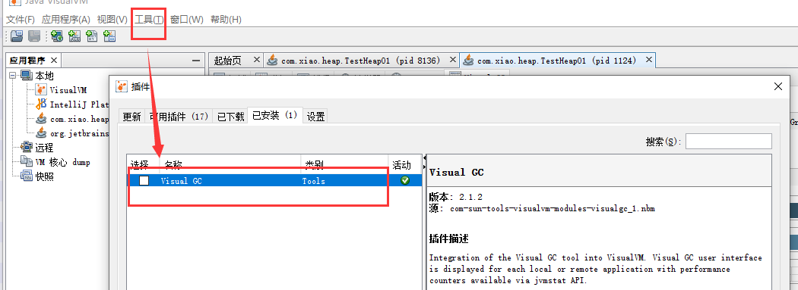

- 插件中心

https://visualvm.github.io/pluginscenters.html

## jprofiler

- 先装jprofiler
- 再在idea上装jprofiler插件
- 在启动项目旁边有个jprofiler启动工具

### 集成idea

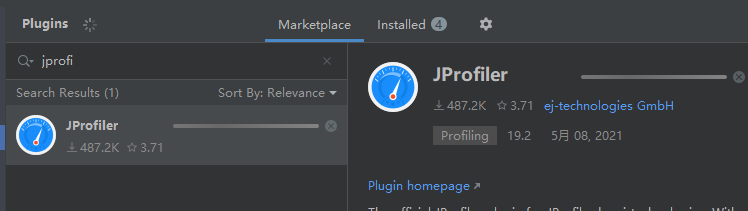

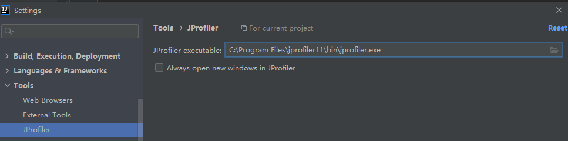

### 两种模式

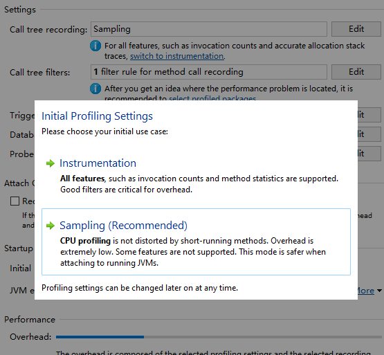

- Instrumentation
  - 对正在运行的jvm有影响
- Sampling
  - 类似于样本统计,每隔一定时间（5ms)将每个线程栈中方法栈中的信息统计出来

### 查看OOM

- 在命令行加入命令：

```shell
-XX:+HeapDumpOnOutOfMemoryError -XX:HeapDumpPath=${目录}
```

- 当出现OOM时会生成dump文件


- 查看超大对象

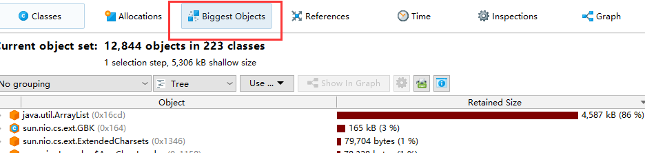

## 内存查看

- 当点击MarkCurrent之后，会将当前内存暂停，后续产生的内存变成红色

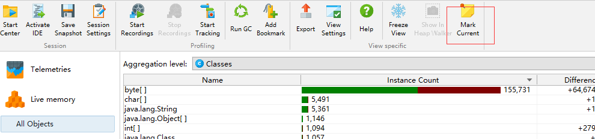

1.如果我们看到的count比较多，size比较大，则可能产生了死循环无限创建对象

- 内存泄漏分析

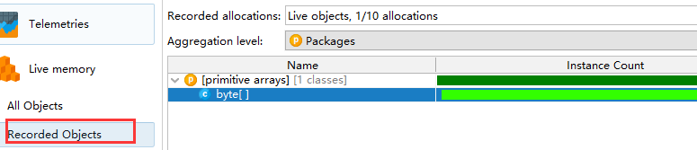

1. 当我们点击run gc之后发现内存还未被回收，则这个对象有内存泄漏风险

- 对对应的对象分析出引用和入引用

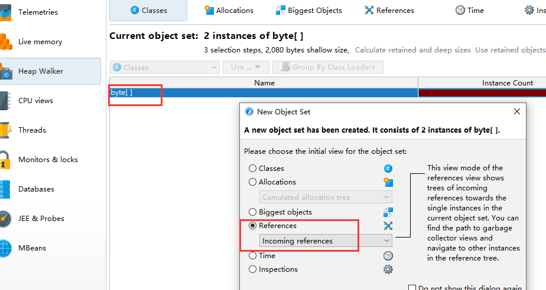

## Eclipse MAT

- 主要用于查看dump文件

- 下载地址：http://www.eclipse.org/downloads/download.php

所能看到的信息

- 所有的对象信息，包括对象实例、成员变量、存储于栈中的基本类型值和存储于堆中的其他对象的引用值。
- 所有的类信息，包括classloader、类名称、父类、静态变量等GCRoot到所有的这些对象的引用路径
- 线程信息，包括线程的调用栈及此线程的线程局部变量（TLS)

打开文件后图示

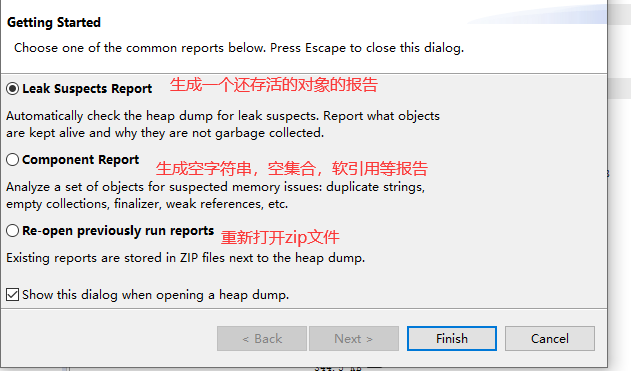


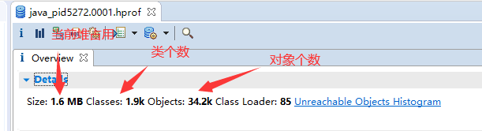

### Histogram

### thread overview

- 出引用：从该对象出去的引用
- 入引用：

- 浅堆：对象本身的大小
- 深堆：对象以及对象能访问的浅堆之和，即对象真实释放空间

如图：A的深堆即：A+B,C因为还被B引用，所以不是A的深堆 

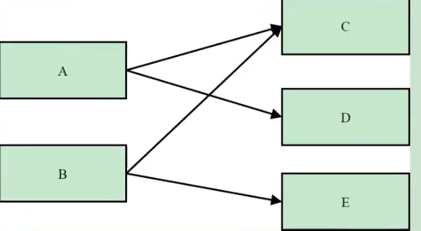

### 支配树

Dominator Tree

```tex
MAT提供了一个称为支配树（Dominator Tree）的对象图。支配树体现了对象实例间的支配关系。在对象引用图中，所有指向对象B的路径都经过对象A，则认为对象A支配对象B。如果对象A是离对象B最近的一个支配对象，则认为对象A为对象B的直接支配者。支配树是基于对象间的引用图所建立的
```

如图，我们说E的支配者是C，因为想访问E，必须通过C

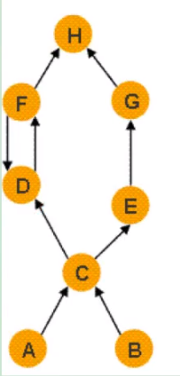

# Arthas

### 安装

- 下载：https://arthas.aliyun.com/arthas-boot.jar
- 启动

```shell
$ java -jar arthas-boot.jar
[INFO] arthas-boot version: 3.5.1
[INFO] Found existing java process, please choose one and input the serial number of the process, eg : 1. Then hit ENTER.
* [1]: 5924 C:\Program
  [2]: 1288
  [3]: 5736 org.jetbrains.jps.cmdline.Launcher
  [4]: 3388 com.xiao.heap.TestHeap01
##选择对应的进程选项后进入对应的操作界面
pid        3388
time       2021-06-08 21:26:49

[arthas@3388]$

```

- 也可以对应进程号直接进入

```shell
$ java -jar arthas-boot.jar 11052
[INFO] arthas-boot version: 3.5.1
```

- 查看帮助文档

```shell
$ java -jar arthas-boot.jar -h
```

### 基础命令

```shell
## 查看帮助文档
[arthas@11052]$ help
## 间隔500ms打印一次
[arthas@11052]$ dashboard -i 500
## 打印两次
[arthas@11052]$ dashboard -n 2

```

### 查看源码

```shell
## 查看某个类的反编译源码
[arthas@11052]$ jad com.xiao.heap.TestHeap01
## 查看某个方法
[arthas@11052]$ jad com.xiao.heap.TestHeap01 main
```

### 火焰图

在追求极致性能的场景下，了解你的程序运行过程中cpu在干什么很重要，火焰图就是一种非常直观的展示cpu在程序整个生命周期过程中时间分配的工具。

# JAVA虚拟机规范

https://docs.oracle.com/javase/specs/index.html

# 字节码文件


### 访问标志

在常量池后，紧跟着访问标记。该标记使用两个字节表示，用于识别一些类或者接口层次的访问信息，包括:这个Class是类还是接口;是否定义为public类型;是否定义为 abstract类型，如果是类的话，是否被声明为 final等。各种访问标记如下所示:


- 表示ACC_PUBLIC+ACC_SUPER(表明这个类是public的)

```shell
00 21
```

### 类索引，父类索引，接口索引集合

- 表示当前这个类是什么名字，父类有哪些，接口有哪些


### 字段表集合

- 用于描述接口或类中声明的变量。字段(field)包括类级变量以及实例级变量，但是不包括方法内部、代码块内部声明的局部变量。
- 字段叫什么名字、字段被定义为什么数据类型，这些都是无法固定的，只能引用常量池中的常量来描述。
- 它指向常量池索引集合，它描述了每个字段的家整信息。比如字段的标识符、访问修饰符〈public、private或protected)、是类变量还是实例变量(static修饰符)、是否是常量(final修饰符）等。

1. 字段计数器：记录字段的个数

2. 字段表


- 属性
  - 一个字段还可能拥有一些属性，用于存储更多的额外信息。比如初始化值（常量的初始化值）、一些注释信息等。属性个数存放在attribute_count中，属性具体内容存放在attributes数组中。
  
  
### 方法表集合

指向常量池索引集合，它完整描述了每个方法的签名。

- 方法计数器
- 方法表

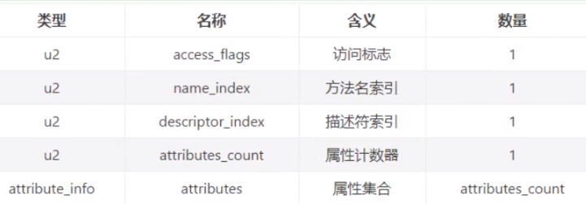

#### code结构

- code存储的是字节码指令
- 里面有若干属性集合

##### LineNumberTable

- code中的属性的名字
- 描述的是字节码指令和实际代码的对应关系

结构：

```java
LineNumberTable_attribute {
    u2 attribute_name_index;
    u4 attribute_length;
    u2 line_number_table_length;
    {   u2 start_pc;
        u2 line_number;	
    } line_number_table[line_number_table_length];
}
```

##### LocalVariableTable

- 描述变量作用的长度

```shell
LocalVariableTable_attribute {
    u2 attribute_name_index;
    u4 attribute_length;
    u2 local_variable_table_length;
    {   u2 start_pc;
        u2 length;
        u2 name_index;
        u2 descriptor_index;
        u2 index;
    } local_variable_table[local_variable_table_length];
}
```


### 属性表集合

- 方法表集合之后的属性表集合，指的是class文件所携带的辅助信息，比如该 class文件的**源文件的名称**。以及任何带有RetentionPolicy.CLASS或者RetentionPolicy.RUNTINE的注解。这类信息通常被用于Java虚拟机的验证和运行，以及Java程序的调试，一般无须深入了解。
- 字段表、方法表都可以有自己的属性表。用于描述某些场景专有的信息 


(比较复杂，后续再回过头补充 p230)

- 属性表结构

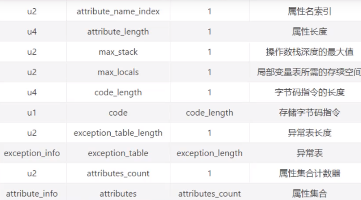

# 常用命令

## JAVAC命令

- 直接javac xx.java，就不会在生成对应的局部变量表等信息，如果你使用javac -g xx.java就可以生成所有相关信息了。

- 如果你使用的eclipse或IDEA，则默认情况下，eclipse、IDEA在编译时会帮你生成局部变量表、指令和代码行偏移量映射表等信息的。

## JAVAP命令

```shell
javap <options> <classes>
```

- options

```tex
 -version         当前javap所在的jdk的version版本
  -v  -verbose    输出附加信息（行号，本地变量表，反汇编等详细信息，不包括私有的方法）
```

- 包括私有的方法

```shell
javap -v -p classes
```

- 解析的文件解读

```tex
//字节码文件地址
Classfile /D:/git/gitee/stu-jvm/out/production/stu-jvm/com/xiao/stack/TestBing.class
//最后修改时间， 文件大小
  Last modified 2021-5-15; size 299 bytes
//MD5散列值
  MD5 checksum 8fd1a35f261c9f5a2f18ed40907f5c6f
  //源文件名称
  Compiled from "TestBing.java"
  //全类名
public class com.xiao.stack.TestBing extends com.xiao.stack.TestLocalVariable
//对应的主版本和副版本编号
  minor version: 0
  major version: 52
  
  flags: ACC_PUBLIC, ACC_SUPER
Constant pool:
   #1 = Methodref          #3.#13         // com/xiao/stack/TestLocalVariable."<init>":()V
   #2 = Class              #14            // com/xiao/stack/TestBing
   #3 = Class              #15            // com/xiao/stack/TestLocalVariable
   #4 = Utf8               <init>
   #5 = Utf8               ()V
   #6 = Utf8               Code
   #7 = Utf8               LineNumberTable
   #8 = Utf8               LocalVariableTable
   #9 = Utf8               this
  #10 = Utf8               Lcom/xiao/stack/TestBing;
  #11 = Utf8               SourceFile
  #12 = Utf8               TestBing.java
  #13 = NameAndType        #4:#5          // "<init>":()V
  #14 = Utf8               com/xiao/stack/TestBing
  #15 = Utf8               com/xiao/stack/TestLocalVariable
{
  public com.xiao.stack.TestBing();
    descriptor: ()V //方法描述符（形参，返回类型）
    //访问标识
    flags: ACC_PUBLIC
    Code:
    //操作数栈最大深度， 局部变量表长度， 方法接受参数的个数（包括this）
      stack=1, locals=1, args_size=1
      //编译量：操作码 操作数  #执行常量池索引
         0: aload_0
         1: invokespecial #1                  // Method com/xiao/stack/TestLocalVariable."<init>":()V
         4: return
      //行号表
      LineNumberTable:
        line 11: 0
        line 12: 4
      //局部变量表
      LocalVariableTable:
      	//局部变量的开始位置， 长度， 占用槽
        Start  Length  Slot  Name   Signature
            0       5     0  this   Lcom/xiao/stack/TestBing;
}
SourceFile: "TestBing.java"

```

# 字节码指令

## 执行模型

- 字节码大概执行的流程

```java
do{
    自动计算PC寄存器的值加1;
    根据PC寄存器的指示位置，从字节码流中取出操作码;
    if(字节码存在操作数)
        从字节码流中取出操作数;
    执行操作码所定义的操作;
}while(字节码长度小O):
```

## 字节码与数据类型

- 强相关的类型
  - 对于 bytem boolean 都是使用i标识

```shell
i代表对int类型的数据操作，
l代表long
s代表short
c代表char
f代表float
d代表double
```

- 隐含的数据类型

```tex
也有一些指令的助记符中没有明确地指明操作类型的字母，
如arraylength指令，它没有代表数据类型的特殊字符，
但操作数永远只能是一个数组类型的对象.
```

- 无任何关系的

```tex
还有另外一些指令，如无条件跳转指令goto则是与数据类型无关的。
```

## 加载与存储指令

作用：加载和存储指令用于将数据从栈帧的局部变量表和操作数栈之间来回传递。

```tex
如果看到 load push  ldc const 相关的指令，
那么他就是将局部变量表/常量池的数据压入操作数栈中
如果看到store相关的，那么他就是将数据存入局部变量表中
```

- 特殊的操作数
  - 有些操作数（一般0-3是和操作码一起的）
  - 如：iload_0 , 表示将局部变量表索引0的**数据**加载到操作数栈中

### 局部变量压栈指令

- 局部变量压栈指令将给定的局部变量表中的数据压入操作数栈
- xload_n / xload
- x: i(integer类型)、l、f、d、a（引用类型）
- n: 0-3

### 常量入栈指令

常量入栈指令的功能是将常数压入操作数栈，根据数据类型和入栈内容的不同，又可以分为const系列、push系列和ldc指令。

- 指令const系列:用于对特定的常量入栈，入栈的常量隐含在指令本身里

```tex
iconst_m1将-1压入操作数栈;
iconst_x (x为0到5）将x压入栈:
fconst_0、fconst_1、fconst_2分别将浮点数0、1、2压入栈;
dconst_0和dconst_1分别将double型0和1压入栈。
aconst_null将null压入操作数栈;
```

- 指令push系列:主要包括bipush和sipush。它们的区别在于接收数据类型的不同，bipush接收8位整数作为参数，sipush接收16位整数，它们都将参数压入栈。
- 指令ldc系列:如果以上指令都不能满足需求，那么可以使用万能的ldc指令，它可以接收一个8位的参数，该参数指向常量池中的int、 float或者string的索引，将指定的内容压入堆栈。

---

int的复制举例

```java
public void pushConstLdc() {
    int i = -1;
    int a = 5;
    int b = 6;
    int c = 127;
    int d = 128;
    int e = 32767;
    int f = 32768;
}
```

```shell
## -1 m1
0 iconst_m1
 1 istore_1
 ##const的范围0-5
 2 iconst_5
 3 istore_2
 # const无法使用，尝试使用bipush
 4 bipush 6
 6 istore_3
 ## bipush最大127(8位)
 7 bipush 127
 9 istore 4
 ## 超过8为sipush
11 sipush 128
14 istore 5
## 最大16位
16 sipush 32767
19 istore 6
## 超过使用常量池中的引用
21 ldc #2 <32768>
23 istore 7
25 return
```

---

### 装入局部变量表

出栈装入局部变量表指令用于将操作数栈中栈顶元素弹出后，装入局部变量表的指定位置，用于给局部变量赋值。

- 这类指令主要以store的形式存在，比如xstore (x为i、1、f、d、a)、 xstore_n (x为 i、1、f、d、a，n为至3）。
- 当store到局部变量表时，操作数栈做的是出栈操作

- 当有代码块时，需要考虑**槽位复用问题**

## 算数运算符

- 算术指令用于对两个操作数栈上的值进行某种特定运算，并把结果重新压入操作数栈。
- 大体上算术指令可以分为两种:对**整型数据**进行运算的指令与对**浮点类型数据**进行运算的指令。

### NaN值使用

当一个操作产生溢出时，将会使用有符号的无穷大表示，如果某个操作结果没有明确的数学定义的话，将会使用NaN值来表示。而且所有使用NaN值作为操作数的算术操作，结果都会返回 NaN;

```java
int i = 10;
double j = i / 0.0;
//Infinity
System.out.println(j);
//NaN
System.out.println(0.0/0.0);
```

### 所有运算符


### ++运算符

- ++i 和 i++在没有赋值的时候，是一样的
-  i++是先赋值，++i是先计算

```shell
 0 bipush 10
 2 istore_1
 3 iload_1
 4 iinc 1 by 1
 ## i++，先赋值后自增 （此时store的是1的10）
 7 istore_2
 8 bipush 20
10 istore_3
11 iinc 3 by 1
## 将3位置的自增过得数压入栈
14 iload_3
## ++j, 此时store的是操作数栈刚添加的自增的21
15 istore 4
17 return
```

- i++是先将值放入操作数栈，然后再进行slot的自增指令操作

```java
int i=10;
i=i++;
//10
System.out.println(i);
```

```shell
 ## 操作数栈压入10
 0 bipush 10
 ## 将10放入局部变量表1位置
 2 istore_1
 ## 将 1位置的10压入栈
 3 iload_1
 ## 在局部变量表中的1 槽位自增1,于栈无关
 4 iinc 1 by 1
 ## 将栈中的10赋值到1槽位的i
 7 istore_1
 8 getstatic #2 <java/lang/System.out>
11 iload_1
```


## 比较指令

- 比较指令的作用是比较栈顶两个元素的大小，并将比较结果入栈

## 类型转换指令

- 类型转换指令可以将两种不同的数值米型进行相互转换。
- 这些转换操作一般用于实现用户代码中的显式类型转换操作,

### 宽化类型转换

- 小范围类型向大范围类型的安全转换
  - 从int类型到long、float或者double类型。对应的指令为: i2l、i2f、i2d
  - 从long类型到float、double类型。对应的指令为:l2f、l2d
  - 从float类型到double类型。对应的指令为:f2d
  - 简化为: int --> long --> float --> double

### 窄化类型

## 对象指令

### 创建指令

- 虽然类实例和数组都是对象，但]ava虚拟机对类实例和数组的创建与操作使用了不同的字节码指令:
- 创建类实例指令：new
  - 它接收一个操作数，为指向常量池的索引，表示要创建的类型，执行完成后，将对象的引用压入栈。

- 创建数组： newarray（基本类型数组）、 anewarray（引用数据类型）、multianewarray（多维数组）。

### 字段访问指令

对象创建后，就可以通过对象访问指令获取对象实例或数组实例中的字段或者数组元素。

- 访问类字段(static字段，或者称为类变量）的指令: getstatic、putstatic
- 访问类实例字段（非static字段，或者称为实例变量）的指令: getfield、putfield

举例代码：

```java
public void method4() {
    System.out.println("hello");
}
```

```shell
##将out的引用放入操作数栈
0 getstatic #2 <java/lang/System.out>
## 将常量池中的hello压入栈
3 ldc #8 <hello>
5 invokevirtual #9 <java/io/PrintStream.println>
8 return
```

### 数组操作指令

数组操作指令主要有:xastore和xaload指令。具体为:

- 把一个数组元素加载到操作数栈的指令: baload、caload、saload、iaload、laload、faload、daload、aaload
- 将一个操作数栈的值存储到数组元素中的指令: bastore、 castore、sastore、iastore、lastore,fastore、dastore、aastore

说明：

```tex
xaload在执行时，
要求操作数中栈顶元素为数组索引i,
栈顶顺位第2个元素为数组引用a,
该指令会弹出栈顶这两个元素，并将a[i]重新压入栈。
```

```tex
xastore则专门针对数组操作，
以iastore为例，它用于给一个int数组的给定索引赋值。
在iastore执行前，
操作数栈顶需要以此准备3个元素:值、索引、数组引用，
iastore会弹出这3个值，并将值赋给数组中指定索引的位置。
```

### 类型检查指令

检查类实例或数组类型的指令:instanceof、checkcast。

- 指令checkcast用于检查类型强制转换是否可以进行。如果可以进行，那么checkcast指令不会改变操作数栈，否则它会抛出ClassCastException异常。

### 方法调用

- invokeinterfacr指令
  - 用于调用接口方法，它会在运行时搜索由特定对象所实现的这个接口方法，并找出适合的方法进行调用。
- invokespecial指令
  - 用于调用一些需要特殊处理的实例方法，包括以实例**初始化方法（构造器)、私有方法和父类方法**。这些方法都是静态类型绑定的，不会在调用时进行动态派发。
- invokestatic指令
  - 用于调用命名类中的类方法(static方法）。这是静态绑定的。
- invokevirtual指令
  - 用于调用对象的实例方法，根据对象的实际类型进行分派（虚方法分派），支持多态。这也是Java语言中最常见的方法分派方式。
- invokedynamic:调用动态绑定的方法,

### 方法返回

需要进行返回。方法返回指令是根据返回值的类型区分的。

- 通过ireturn指令,将当前函数操作数栈的顶层元素弹出，并将这个元素压入调用者函数的操作数栈中

### 操作数栈管理指令

以用于直接操作操作数栈的

- 将一个或两个元素从栈顶弹出，并且直接废弃:pop，pop2;（操作了之后不会向局部变量表设置值）
- 复制栈顶一个或两个数值并将复制值或双份的复制值重新压入栈顶: dup， dup2

### 比较指令

比较栈顶两个元素的大小，并将比较结果入栈。

- 比较指令有: dcmpg,dcmpl、 fcmpg、 fcmpl、lcmp。

举例：

- 指令fcmpg和fcmpl都从栈中弹出两个操作数，并将它们做比较，设栈顶的元素为v2,栈顶顺位第2位的元素为v1,若v1=v2,则压入0;若v1>v2则压入1;若v1<v2则压入-1。
- 两个指令的不同之处在于，如果遇到NaN值，fcmpg会压入1,而fcmpl会压入-1。

### 条件跳转指令

条件跳转指令通常和比较指令结合使用。在条件跳转指令执行前，一般可以先用**比较指令**进行栈顶元素的准备，然后进厅条件跳转。

- ifeq， iflt， ifle, ifne, ifgt, ifge, ifnull, ifnonnull

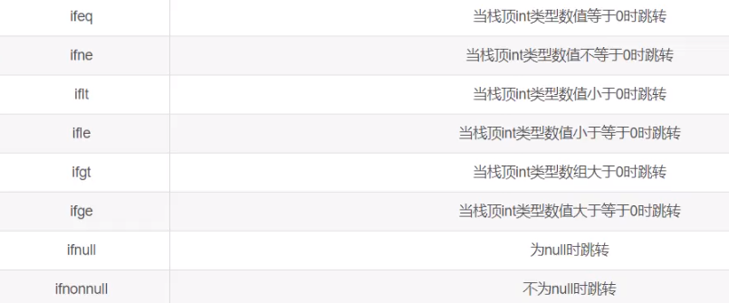

举例：

- int比较

```java
int a=10;
if(a == 0) {
    return 20;
} else {
    return 5;
}
```

```shell
 ## 压入10
 0 bipush 10
 2 istore_1
 3 iload_1
 ## 如果!=0则跳转10位置
 4 ifne 10 (+6)
 7 bipush 20
 9 ireturn
10 iconst_5
11 ireturn
```

### 比较跳转指令

主要用于：int(byte,short)， 引用数据类型

- 在操作数栈中取出两个，比较后直接跳转

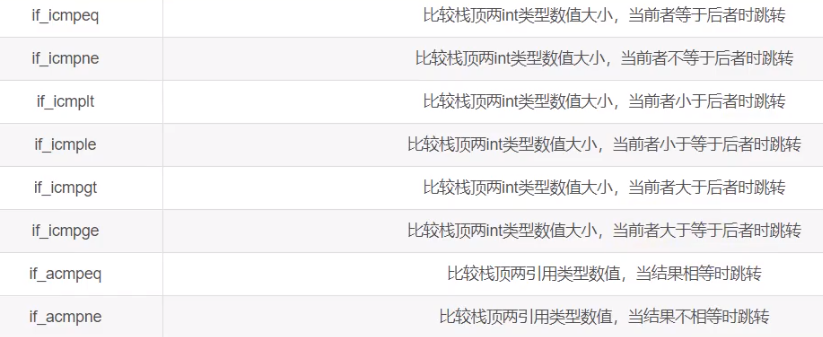

### 多条件指令

多条件分支跳转指令是专为switch-case语句设计的，主要有tableswitch和lookupswitch。

| 指令         | 描述                      |
| ------------ | ------------------------- |
| tableswitch  | case连续的（1,2,3,4这种） |
| lookupswitch |                           |

```shell
 ## 2 表示这个有多少个条件
 1 lookupswitch 2
 1:  28 (+27)
 2:  34 (+33)
 default:  40 (+39)
```

### 抛出异常指令

- athrow
  - 在Java程序中显示抛出异常的操作（throw语句）都是由athrow指令来实现。

### 异常处理

- 处理异常
  - 在Java虚拟机中，处理异常(catch语句）不是由字节码指令来实现的〈早期使用jsr、ret指令），而是采用异常表来完成的。
- 异常表
  - 如果一个方法定义了一个try-catch或者try-finally的异常处理，就会创建一个异常表。

一个面试题：返回为hello，从字节码层面看，return先执行，再执行finally

```java
public String method7() {
    String str = "hello";
    try {
        return str;
    } finally {
        str = "laoxiao";
    }
}
```

## 同步控制指令

java虚拟机支持两种同步结构:方法级的同步和方法内部一段指令序列的同步，这两种同步都是使用monito来支持的。

### 方法级同步

是隐式的，即无须通过字节码指令来控制，它实现在方法调用和返回操作之中。虚拟机可以从方法常量池的方法表结构中的 ACC_SYNCHRONIZED **访问标志**得知一个方法是否声明为同步方法;

- 可以看到他的访问标识是 同步

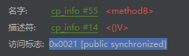

### 代码块同步

同步一段指令集序列:通常是由java中的synchronized语句块来表示的。jvm的指令集有 monitorenter和monitorexit两条指令来支持synchronized关键字的语义。


- 当一个线程进入同步代码块时，它使用monitorenter指令请求进入。如果当前对象的监视器计数器为0（每个对象header中都有一个同步标识）,则它会被准许进入，若为1,则判断持有当前监视器的线程是否为自己，如果是，则进入，否则进行等待，直到对象的监视器计数器为0,才会被允许进入同步块。
- 当线程退出同步块时，需要使用monitorexit声明退出，同步标识至0。


# 类加载器


## ClassLoader分析

### 常用方法

- 加载全限定名为name的类

```java
public Class<?> loadClass(String name)
```

```java
//校验当前类是否已经加载
Class<?> c = findLoadedClass(name);
if (c == null) {
    long t0 = System.nanoTime();
    try {
        if (parent != null) {
            //传递给父类加载器进行加载
            c = parent.loadClass(name, false);
        } else {
            //尝试给bootstrap类加载器进行加载
            c = findBootstrapClassOrNull(name);
        }
    } catch (ClassNotFoundException e) {
    }

    if (c == null) {
        //父类加载器/bootstrap加载器无法加载
        //当前类进行加载
        long t1 = System.nanoTime();
        c = findClass(name);
        }
}
if (resolve) {
    resolveClass(c);
}
return c;
```

- 根据网络地址或者全限定名获取class的二进制，获取class的实例

```java
protected Class<?> findClass(final String name)
```

- 使用byte字节解析成Class对象，一般由findClass调用

```java
protected final Class<?> defineClass(byte[] b, int off, int len)
```

- Class.forName()与ClassLoader. loadClass()的区别
  - Class.forName()方法在将 Class 文件加载到内存的同时,会执行类的初始化。
  - ClassLoader. loadClass()并不会执行类的初始化,直到这个类第一次使用时才进行初始化。


## 沙箱安全机制

- 保护程序安全
- 保护java原生的代码

### 各个版本的策略

- 1.0

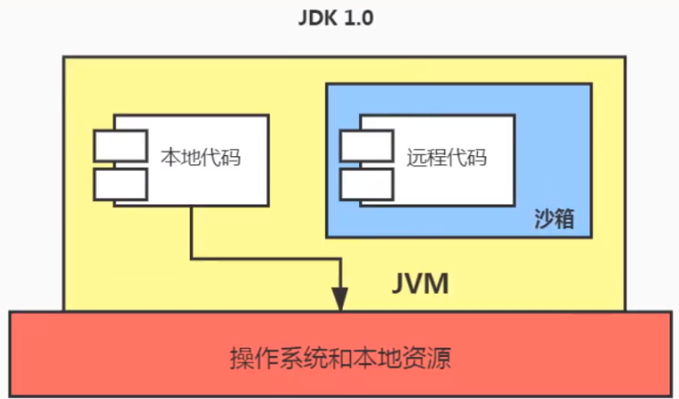


# 调优与监控


### jhat

jdk自带的堆分析文件

- 它一般和jmap搭配使用

- 使用了jhat命令，就启动了一个http服务，端口是7000，即http://localhost:7oea就可以在浏览器里分析。
- jdk9已经删除

### jstack

打印线程的快照

- 线程快照就是当前虚拟机内指定进程的每一条线程正在执行的方法堆栈的集合

作用：

- 可用于定位线程出现长时间停顿的原因，如线程间死锁、死循环、请求外部资源导致的长时间等待等问题。这些都是导致线程长时间停顿的常见原因。当线程出现停顿时,就可以用jstack显示各个线程调用的堆栈情况。

```shell
### 故意造两个死锁线程，由此可见，Thread-1 -0 处于 blocked状态
$ jstack 8740
2021-06-06 16:58:24
Full thread dump Java HotSpot(TM) 64-Bit Server VM (25.131-b11 mixed mode):

"DestroyJavaVM" #16 prio=5 os_prio=0 tid=0x0000000002eae800 nid=0x2410 waiting on condition [0x0000000000000000]
   java.lang.Thread.State: RUNNABLE

"Thread-1" #15 prio=5 os_prio=0 tid=0x000000001fb84000 nid=0x3b08 waiting for monitor entry [0x000000002046f000]
   java.lang.Thread.State: BLOCKED (on object monitor)
"Thread-0" #14 prio=5 os_prio=0 tid=0x000000001fb7f000 nid=0x1e30 waiting for monitor entry [0x000000002036f000]
   java.lang.Thread.State: BLOCKED (on object monitor)

```

- 参数信息
  - -l : 显示锁的附加信息

### jcmd

它是一个多功能的工具，可以用来实现前面除了jstat之外所有命令的功能。比如:用它来导出堆、内存使用、查看Java进程、导出线程信息、执行Gc、JVM运行时间等。

- jcmd -l
  - 查看所有jvm进程

- 列出 pid支持的命令

```shell
$ jcmd 2872 help
```

- jcmd pid 具体命令
  - 根据help查出来的命令执行，获取结果

### jstatd

远程主机信息收集

## 图形化界面

- JDK自带

1. jconsole:JDK自带的可视化监控工具。查看Java应用程序的运行概况、监控堆信息、永久区(或元空间）使用情况、类加载情况等
2. Visual VM:Visual VM是一个工具，它提供了一个可视界面，用于查看Java虚拟机上运行的基于Java技术的应用程序的详细信息。
3. JMC: Java Mission Control，内置Java Flight Recorder。能够以极低的性能开销收集]ava虚拟机的性能数据。

- 第三方

1. MAT: MAT(Memory Analyzer Tool)是基于Eclipse的内存分析工具，是一个快速、功能丰富的Java heap分析工具，它可以帮助我们查找内存泄漏和减少内存消耗
2. JProfiler:商业软件，需要付费。功能强大。
3. Arthas:libaba开源的Java诊断工具。深受开发者喜爱。
4. Btrace:Java运行时追踪工具。可以在不停机的情况下，跟踪指定的方法调用、构造函数调用和系统内存等信息。

# 内存泄漏

- 内存泄漏
  - 程序不使用了，但是GC又不能回收它
- 内存溢出

## 内存泄漏的情况

- 静态集合类

```java
static List list = new ArrayList();

public void add() {
    list.add(new Object());
}
```

- 单例模式
- 内部类持有外部类
  - 如：一个对象持有一个内部类对象，那么，他的外部类则一直不能回收
- 各种连接，如数据库、IO流等
  - 没有关闭资源，GC是无法回收的
- 变量不合理的作用域
- 改变hash值
  - 如我们往set中插入值，如果中途修改了hash值，则我们没办法再删除set中的对应这个元素了 ，则导致这个元素一直没被回收
- 缓存泄漏
  - 内存泄漏的另一个常见来源是缓存，一旦你把对象引用放入到缓存中，他就很容易遗忘。比如:之前项目在一次上线的时候，应用启动奇慢直到夯死，就是因为代码中会加载一个表中的数据到缓存（内存)中，测试环境只有几百条数据，但是生产环境有几百万的数据。
- 监听器和回调

# JVM运行时参数

## jvm参数类型

1. 标准参数选项

```shell
## 以-开头，比较稳定，java -help可以看到对应标准
```

2. -X参数选项
   1. 设置编译模式（禁用JIT等操作）
   2. 设置初始堆内存等

```shell
## 使用 -X查看
D:\git\gitee\xiaoxiao>java -X
    -Xmixed           混合模式执行 (默认)
    -Xint             仅解释模式执行
    -Xbootclasspath:<用 ; 分隔的目录和 zip/jar 文件>
```

```shell
-Xms<size>        设置初始 Java 堆大小
-Xmx<size>        设置最大 Java 堆大小
-Xss<size>        设置 Java 线程堆栈大小
```

3. -XX参数类型
   1. 用户开发和调试jvm

- Boolean类型格式

```shell
-XX:+option 表示启动option属性
-XX:-option 表示启动option属性
```

- 非Boolean类型

```shell
-XX:option=param 设置option为param
```

- -XX:+PrintFlagsFinal : 输出所有参数的名称和默认值

- 在程序运行中，可以用jinfo命令查看和相关的flag

## 常用的参数选项

- 栈

```shell
## 设置线程的栈的大小
-Xss128k
## 等价于
-XX:ThreadStackSize=128k
```

- 堆内存

```shell
-Xms1024m
-Xmx1024m
## 设置年轻代大小，官方推荐为整个堆大小的3/8
## 它设置的是初始值和最大大小
-Xmn2g
## 自动选择各个区大小比例
## 默认是打开的，所以eden区和s区不是我们想象的8:1：1
## 如果想要eden:s区生效，则必须关闭这个
## 而且还需要显示的打开配置
## -XX:SurvivorRatio=8
-XX:+UseAdaptiveSizePolicy

## 设置老年代于新生代比例，默认是2
-XX:NewRatio=4
```

- 方法区

```shell

```

- OutofMemory相关

```shell
## 出现outofMemory的时候生成dump文件
-XX:+HeapDumpOnOutOfMemoryError
## 发生fullGC之前生成dump文件
-XX:+HeapDumpBeforeFullGC
##指定生成的dump文件路径
-XX :HeapDumpPath=d:\xxx.hprof
## 发生oom的时候执行一个脚本
-XX:OnOutOfMemoryError
```

## GC日志参数

- -verbose:gc或-XX:+PrintGC
  - 输出简单的日志回收日志
- -XX:+PrintGCDetails
  - 详细的GC日志输出
- -XX:+PrintGCTimeStamps
  - 输出GC发生的时间戳，必须配合Print相关参数配置
- -XX: +PrintGCDateStamps
  - 输出以日期为准的参数
- -XX:+PrintHeapAtGC
  - 打印垃圾回收之前和之后的信息
- -Xloggc:<file>
  - gc日志输出到文件中

## 其他参数

- XX:+DisableExplicitGC
  - 禁止hotspot执行System.gc()，默认禁用