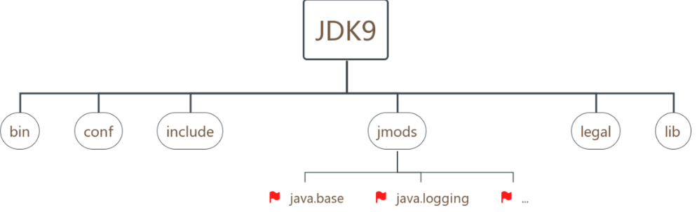

# Java 8-N的版本的相关点

> 每 3 年发布一个 LTS（Long-Term Support），长期维护版本。意味着只有Java 8 ，Java 11， Java 17，Java 21 才可能被大规模使用。


# JAVA8

## Idea环境使用

新项目：project  sdk(1.8)   level(8)->modules level（8）->java compile version(1.8)


## 接口变化

1. 添加的default 方法，但是，必须要通过实现类才能够访问
   1. 使用原则为类优先原则，意思就是优先执行类中的同名方法
2. 添加了接口static方法，可以通过接口直接访问

## Lambda表达式

其本质是接口（只有一个方法的接口）的实现

### 使用规范

格式：

- -> :lambda操作符
- (o1,o2)：lambda形参列表 其实就是抽象方法的形参
- Integer.compare(o1,o2) ： lambda体： 就是重写的抽象方法的方法体

```java
@Test
public void test1(){
    Comparator<Integer> comparator = new Comparator<Integer>() {
        public int compare(Integer o1, Integer o2) {
            return Integer.compare(o1,o2);
        }
    };
    System.out.println(comparator.compare(1,2));

    Comparator<Integer> comparator1 = (o1,o2) -> Integer.compare(o1,o2);
    System.out.println(comparator1.compare(1,2));
}
```

### Lambda 表达式语法

第一种方式，没有参数

```java
Runnable runnable = () -> {
    System.out.println("第一种表达方式，没有参数");
};
runnable.run();
```

第二种表达式，有形参没有返回值

```java
Consumer<String> consumer = new Consumer<String>() {
    @Override
    public void accept(String s) {
        System.out.println(s);
    }
};
consumer.accept("人生真是无奈啊");
Consumer<String> consumer1 = (String s)-> System.out.println(s);
consumer1.accept("还是要调整心态");

//优化：类型推断，泛型里传了String，形参推荐是String
Consumer<String> consumer2 = (s)-> System.out.println(s);
```

第三种：如果只有一个参数，可以省略括号

```java
Consumer<String> consumer2 = s-> System.out.println(s);
```

第四种情况：如果有多行语句，return和{}不能省略

> 函数式接口

1. 如果一个接口只声明了一个接口方法，那么它就是函数式接口

2. 当然，如果标注@FunctionalInterface方法，则可以显示的告诉读者

> java四大函数式接口

- 消费型接口 Consumer<T>     void accept(T t)
  - 消费型接口，只有入参没有返回值
- 供给型接口 Supplier<T>     T get()
- 函数型接口 Function<T,R>   R apply(T t)
- 断定型接口 Predicate<T>    boolean test(T t)
  - 如果存在某个值，返回true


Consumer：消费型接口，只有入参没有返回值

```java
@Test
public void Test2() {
    Double price = 9.99;
    consumer(price, new Consumer<Double>() {
        @Override
        public void accept(Double aDouble) {
            System.out.println("我消费了："+aDouble);
        }
    });
    //相当于我传值和代码进去，做什么操作你给我执行
    consumer(price, aDouble-> System.out.println("我又消费了："+aDouble));
}

public void consumer(Double price, Consumer<Double> consumer){
    consumer.accept(price);
}
```

Predicate:如果存在某个值，返回true

```java
@Test
public void Test3(){
    Predicate<String> predicate = new Predicate<String>() {
        @Override
        public boolean test(String s) {
            return s.contains("a");
        }
    };
    Predicate<String> predicate1 = s -> s.contains("a");
    List list = predicate(Arrays.asList("a", "bb", "ab"), predicate1);
    System.out.println(Arrays.asList(list).toString());
}

public List<String> predicate(List<String> list, Predicate<String> predicate){
    List<String> list1 = new ArrayList();
    for(String str : list){
        if(predicate.test(str)){
            list1.add(str);
        }
    }
    return list1;
}
```

> lambda的原理

java.lang.invoke.LambdaMetafactory#metafactory

### 方法引用

方法引用可以看做是Lambda表达式深层次的表达

要求：实现接口的抽象方法的参数列表和返回值类型，必须与方法引用的方法的参数列表和返回值类型保持一致！

使用情况：

- 对象::实例方法名

```java
Consumer<String> consumer = x -> System.out.println(x);
//方法引用使用方式
PrintStream out = System.out;
//out为对象，调用println方法
Consumer<String> consumer1 = out::println;
consumer1.accept("hahah");
```

- 类::静态方法名

```java
//java使用方式
Comparator<Integer> comparator = (x,y)-> Integer.compare(x,y);
//方法引用
Comparator<Integer> comparator1 = Integer::compare;
int compare = comparator1.compare(1, 2);
```

- 类::实例方法名(形参列表可以不一致)

注意：当函数式接口方法的第一个参数是需要引用方法的调用者，并且第二个参数是需要引用方法的参数(或无参数)时：ClassName::methodName

```java
BiPredicate<String, String > biPredicate = (y, x)-> y.equals(x);
BiPredicate<String, String > biPredicate1 = String::equals;
biPredicate1.test("1","1");
```

```java
//传入user对象，返回字符串
Function<User, String> function = u->u.getUsername();
String s = function.apply(new User("萧", "2222"));
Function<User, String> function1 = User::getUsername;
System.out.println(function1.apply(new User("萧", "2222")));
```

### 构造器引用

构造器和方法的引用类似，函数式接口的抽象方法的形参列表和构造器的形参列表一直。抽象方法的返回值类型即为构造器所属的类的类型

- 无参构造

```java
//T get();无参，new出来的为空参构造器
Supplier<User> supplier = ()->new User();
Supplier<User> supplier1 = User::new;
```

- 有参构造器

```java
//R apply(T t); 传入String 类型，构造器参数也是一个String
Function<String, User> function = x->new User(x);
Function<String, User> function1 = User::new;
function1.apply("耨人");
```

- 数组引用

```java
Function<Integer, String[]> function2 = length->new String[length];
Function<Integer, String[]> function3 = String[]::new;
```

## Stream

Stream 关注的是计算

Stream 自己不会存储元素。

Stream 不会改变源对象。相反，他们会返回一个持有结果的新Stream。

Stream 操作是延迟执行的。这意味着他们会等到需要结果的时候才执行

### Stream 执行流程

- Stream的实例化
- 一系列的中间操作（过滤、映射、...)
- 终止操作

说明：

- 4.1 一个中间操作链，对数据源的数据进行处理
- 4.2 一旦执行终止操作，就执行中间操作链，并产生结果。之后，不会再被使用

### 创建Stream的方式

- 从集合中获取

```java
List<User> users = UserData.getUsers();
//获取顺序流
Stream<User> stream = users.stream();
//获取并发流
Stream<User> userStream = users.parallelStream();
```

- 通过数组

```java
int [] arr = {1,2,3,4};
IntStream stream1 = Arrays.stream(arr);
User[] users1 = {new User("1", "2")};
Stream<User> stream2 = Arrays.stream(users1);
```

- 通过steam.of

```java
Stream<Integer> integerStream = Stream.of(1, 2, 3, 4);
```

## Stream穿件无限流

- static <T> Stream<T> generate(Supplier<T> s)
- 可以利用泛型的方法来创建无限流(示例来源：on java8)

```java
public class BasicSupplier<T> implements Supplier<T> {
	private Class<T> type;
    public BasicSupplier(Class<T> type) {
        this.type = type;
    }
	@Override
	public T get() {
    	return type.newInstance();
    }
    public static <T> Supplier<T> create(Class<T> type) {
        return new BasicSupplier<>(type);
    }
} 
```

```java
public static void main(String[] args) {
    Stream.generate(
    	BasicSupplier.create(CountedObject.class))
    	.limit(5)
    	.forEach(System.out::println);
}
```


### Stream的中间操作

#### 筛选与切片

- 过滤：filter为过滤操作，传入Predicate类型进去test判断

```java
List<User> users = UserData.getUsers();
//获取顺序流
Stream<User> stream = users.stream();
//判断数组中的username是否存在 马
stream.filter(user->user.getUsername().contains("马")).forEach(System.out::println);
```

- 截断：只获取指定数量的数据 limit

```java
System.out.println("**************");
users.stream().limit(3).forEach(System.out::println);
```

- 跳过元素 skip

```java
users.stream().skip(3).forEach(System.out::println);
```

- 筛选：去重，通过流所生成元素的 hashCode() 和 equals() 去除重复元素所以我们的实体类要重写equals和hashcode方法

```java
@Override
public boolean equals(Object o) {
    if (this == o)
        return true;
    if (o == null || getClass() != o.getClass())
        return false;

    User user = (User) o;

    if (username != user.username)
        return false;
    if (password != user.password)
        return false;
    if (Double.compare(user.price, price) != 0)
        return false;
    return true;
}

@Override
public int hashCode() {
    int result;
    long temp;
    result = 17;
    result = 31 * result + (username != null ? username.hashCode() : 0);
    result = 31 * result + (username != null ? username.hashCode() : 0);
    temp = Double.doubleToLongBits(price);
    result = 31 * result + (int) (temp ^ (temp >>> 32));
    return result;
}
```

则此时输出的为u1/u3

```java
User u1 = new User("张三", "123", 1.0);
User u2 = new User("张三", "123", 1.0);
User u3 = new User("张三", "1234", 1.0);
Stream.of(u1,u2,u3).distinct().forEach(System.out::println);

```

#### 映射

- map： 将每一个元素做一系列操作后再返回

```java
//将每一个元素转化为大写
Stream.of("a","b","c").map(s -> s.toUpperCase()).forEach(System.out::println);

```

```java
//获取名称大于2的名字
Stream<String> userNames = UserData.getUsers()
        .stream()
        .map(User::getUsername);
userNames.filter(userName->userName.length()>2).forEach(System.out::println);

```

- flatmap ： 将流中的每个值都换成另一个流，然后把所有流连接成一个流

```java
@Test
public void test4() {
    //toStream会产生stream集合，Stream<Stream<Character>>类型
    // flatmap就是将stream里面的stream集合元素拿出了，组成一个新stream
    UserData.getUsers().stream().flatMap(user->SteamTest.toStream(user.getUsername())).forEach(System.out::println);
}

//产生一个有单个字符组成的stream集合
public static Stream<Character> toStream(String str){
    ArrayList<Character> list = new ArrayList<>();
    for(Character c : str.toCharArray()){
        list.add(c);
    }
    return list.stream();
}

```

#### 排序

```java
Stream.of(2, 1,  3, 4).sorted().forEach(System.out::println);

```

如果时对对象排序

```java
UserData.getUsers().stream()
        .sorted((d1,d2)->Double.compare(d1.getPrice(),d2.getPrice()))
        .forEach(System.out::println);

```

Stream的终止操作

### 匹配和查找

- allMatch(Predicate p)——检查是否匹配所有元素。

```java
//所有元素的username是否存在马
boolean t1 = UserData.getUsers()
        .stream()
        .allMatch(user -> user.getUsername().contains("马"));

```

- anyMatch(Predicate p)——检查是否至少匹配一个元素。

```java
//是否存在元素username存在马
boolean t2 = UserData.getUsers()
        .stream()
        .anyMatch(user -> user.getUsername().contains("马"));

```

- noneMatch(Predicate p)——检查是否没有匹配的元素。

```java
//是否所有元素不含有马
boolean t3 = UserData.getUsers()
        .stream()
        .noneMatch(user -> user.getUsername().contains("马"));

```

- 返回第一个元素

```java
Optional<User> first = UserData.getUsers()
        .stream()
        .findFirst();
System.out.println(first);

```

- 返回当前流中的任意元素

```java
Optional<User> any = UserData.getUsers()
        .parallelStream()
        .findAny();

```

- count——返回流中元素的总个数

```java
//计算价格大于2的数量
long count = UserData.getUsers()
        .stream()
        .filter(user -> user.getPrice() > 2.0).count();

```

- 获取最大值

```
//获取最大的价格
Optional<User> max = UserData.getUsers()
        .stream().max((u1, u2) -> Double.compare(u1.getPrice(), u2.getPrice()));

```

### 归约（reduce）

map是最元素进行映射，那么reduce可以看成时对这些映射后的元素求和

reduce(T identity, BinaryOperator)——可以将流中元素反复结合起来，得到一个值。返回 T

```java
List<Integer> list = Arrays.asList(1,2,3,4,5,6,7,8,9,10);
        Integer sum = list.stream().reduce(0, Integer::sum);
        System.out.println(sum);

```

### 收集

collect(Collector c)——将流转换为其他形式。接收一个 Collector接口的实现，用于给Stream中元素做汇总的方法

```java
//返回list集合 
List<Employee> employees = EmployeeData.getEmployees();
        List<Employee> employeeList = employees.stream().filter(e -> e.getSalary() > 6000).collect(Collectors.toList());

        employeeList.forEach(System.out::println);

//返回set集合
        Set<Employee> employeeSet = employees.stream().filter(e -> e.getSalary() > 6000).collect(Collectors.toSet());

        employeeSet.forEach(System.out::println);

```

## Optional类

Optional<T> 类(java.util.Optional) 是一个容器类，它可以保存类型T的值，代表这个值存在。或者仅仅保存null，表示这个值不存在

目的：为了避免空指针异常的存在

### 创建Optional类对象

```java
// 1、创建一个包装对象值为空的Optional对象
Optional<String> optStr = Optional.empty();
// 2、创建包装对象值非空的Optional对象
Optional<String> optStr1 = Optional.of("optional");
// 3、创建包装对象值允许为空的Optional对象
Optional<String> optStr2 = Optional.ofNullable(null);

```

### 判断Optional容器中是否包含对象

- boolean isPresent() : 判断是否包含对象
- void ifPresent(Consumer<? super T> consumer) ：如果有值，就执行Consumer接口的实现代码，并且该值会作为参数传给它。

```java
public static void printName(Student student)
{
    Optional.ofNullable(student).ifPresent(u ->  System.out.println("The student name is : " + u.getName()));
}

```

### 内容处理

- ##### filter

- ##### map

- ##### flatMap

### 获取Optional容器的对象

- T get(): 如果调用对象包含值，返回该值，否则抛异常
- T orElse(T other) ：如果有值则将其返回，否则返回指定的other对象。
- T orElseGet(Supplier<? extends T> other) ：如果有值则将其返回，否则返回由Supplier接口实现提供的对象。
- T orElseThrow(Supplier<? extends X> exceptionSupplier) ：如果有值则将其返回，否则抛出由Supplier接口实现提供的异常。

## 日期操作

### 时间点

<b id="gray">Instant </b>用于表示时间线上的点，即一个瞬间。它是不可变的，以纳秒为单位精确表示时间，可以用于在不考虑时区的情况下进行时间的计算和比较。

Instant 一般用于以下场景：

1. 计算事件发生的时间戳，无论时区如何。
2. 进行时间计算，如计算时间差、定时任务等

```java
Instant start = Instant.now();
//模拟做一些操作
Thread.sleep(1000);
Instant end = Instant.now();
log.info("use time {}", Duration.between(start, end).toMillis());
```
### 时间段

<b id="gray">Period </b>是用于处理日期间隔的类，但是，他有缺限

比如：这里返回的是1，计算的是月与月的间隔

```java
LocalDate start = LocalDate.of(2023,5, 6);
LocalDate end = LocalDate.of(2024,6, 6);
Period between = Period.between(start, end);
log.info("相隔{}月", between.getMonths());
```
如果想要计算返回的天数间隔,则用<b id="gray">ChronoUnit.DAYS.between</b>

```java
LocalDate start = LocalDate.of(2023,5, 6);
LocalDate end = LocalDate.of(2024,6, 6);
long daysBetween = ChronoUnit.DAYS.between(start, end);
System.out.println("两个日期之间的天数差为: " + daysBetween);
```
## CompletableFuture

### 使用场景

```markmap
# 
## 创建异步任务
## 简单异步回调
## 多任务组合
```


### 创建

---

>  初始创建(有返回值和没返回值)

1. <b id="gray">supplyAsync</b>: 有返回值

```java
CompletableFuture.supplyAsync(() -> {
    log.info("第一个-有返回值");
    return "supplyAsync-1-res";
})
```


2. <b id="gray">runAsync</b>没有返回值。
   1. 如果咱们不关心异步任务的结果，只想执行一个异步操作

```java
CompletableFuture.runAsync(() -> log.info("第一个任务"))
```


---

> 链式调用

- `thenApply`用于处理和转换CompletableFuture的结果。
- `thenAccept`用于消费CompletableFuture的结果，不返回新的CompletableFuture。

```java
CompletableFuture.supplyAsync(() -> {
        log.info("第一个-有返回值");
        return "supplyAsync-1-res";
    }).thenApply(var -> {
        log.info("接收上一个任务，有返回值：{}",var);
        return "thenApply-2-res";
    }).thenAccept(v -> log.info("接收上一个任务的值，没有返回值：{}", v));
Thread.sleep(10000);
```


- `thenRun`则不关心前一个任务的结果，只是在前一个任务执行完后，执行一些后续操作。


```java
CompletableFuture.runAsync(() -> log.info("第一个任务"))
    .thenRun(() -> log.info("第二个任务"))
    .thenRunAsync(() -> log.info("第三个任务"));
Thread.sleep(1000);
```


---


# JAVA9

## 新特性

```markmap

# jdk9目录不包含jre
# 模块化系统
# JSHELL
# 多版本兼容jar包

```

## JSHELL

- REPL工具：jShell命令
  - 以交互式的方式，对语句和表达式进行求值
  - 如同scala之类一样
- 帮助文档：/help

```shell
##进入jshell
λ ./jshell
## 执行java代码
jshell> System.out.println("hello word");
hello word

## 导入java包，导入后可以调用对应包下的方法
jshell> import java.util.*
## 查看已导入的包
jshell> /import
|    import java.io.*
|    import java.math.*
|    import java.net.*
|    import java.nio.file.*
|    import java.util.concurrent.*
|    import java.util.function.*
|    import java.util.prefs.*
|    import java.util.regex.*
|    import java.util.stream.*
|    import java.util.*

## 查看已输入的语句
jshell> /list

   1 : System.out.println("hello word");
   2 : import java.util.*;
```

1. 导入java文件

```java
void printHello() {
    System.out.println("hello word! java9");
}
printHello();
```

2. 打开编写的文件

```shell
jshell> /open D:\softinstall\jdk-9\bin\HelloWord.java
hello word! java9
```

## 多版本兼容jar包

多版本兼容 JAR 功能能让你创建仅在特定版本的 Java 环境中运行库程序时选择使用的 class 版本。


## 模块化

> 可以简单地将它理解为 `package` 的上一级单位，是多个 `package` 的集合

- 好处：安全、加载更快一点

下图可见：Java 9 中没有`jre`，没有`rt.jar`，没有`tools.jar`，而是多了一个 `jmods`，该文件夹下都是一个一个的模块

Java 9 之前的工程，他们都是单体模式，一个简单的 hello world，都需要引入 `rt.jar`，导致这个简单的 hello world 的 jar 变得很大， Java 9 引入模块后，它只需要引入它所依赖的即可




### 使用方式

> 导出模块

1. 建立一个模块exprot-module，这个模块是用来导出的，在根路径下建立module-info.java文件

```java
module exprot.module {
    exports com.xiao.exprot ;
}
```

2. 建立实体类(用于在另一个模块引入)

```java
package com.xiao.exprot;

public class Person {
    private String name;
    private Integer age;
}
```

> 引用模块

1. 建立引入模块，建立module-info.java文件

```java
module improt.module{
    requires exprot.module;
}
```

2. test使用， 我们在这个模块中，只能选择导出模块exports的包下的类，其他的无法

```java
public class Test {
    public static void main(String[] args) {
        Person person = new Person();
    }
}
```


## 接口私有方法

- http://openjdk.java.net/jeps/213
- 为啥会出现：jdk8出现了接口方法可以写deafult 的方法体，方法可以调用，则出现了private类型，能够在接口内直接调用方法

```java
interface MyInterface {
    // jdk7
    void method1();

    //jdk8: 可以定义static方法和default方法
    static void method2() {
        System.out.println("method 2");
    }

    default void method3() {
        System.out.println("method3");
    }
    //jdk9: 可以定义private方法
    private void method4() {
        System.out.println("method4");
    }
}
```

## 钻石操作符提升

```java
public void DiamondMethod() {
    new HashMap<>() {
        //可以在子类的匿名方法中编写代码
        @Override
        public Object get(Object key) {
            //重写父类的方法等操作
            return super.get(key);
        }
    };
}
```


## String 类型由byte数组存储，由**coder**存储字符编码

- 大部分的string存储的是拉丁文，这样char一样占用了两个字节，这样浪费了空间
- 使用byte就不会这样问题
- 如果不是拉丁文，用utf-16存储

## 创建只读集合（不可变集合）

- set、map等，都可以通过of来创建不可变的集合

- java8和java9对比

```java
// java8
List<String> list1 = new ArrayList<>();
list1.add("a");
List<String> list2 = Collections.unmodifiableList(list1);
//java9
List<String> list3 = List.of("a", "b");
```
## Strem提升

- takeWhile操作

```java
List<Integer> list = Arrays.asList(1, 2, 3, 4, 5, 6);
//如果满足条件则通过，当第一次不满足时，则终止循环
list.stream().takeWhile(num -> num > 3).forEach(System.out::println);
//返回剩余的
list.stream().dropWhile(num -> num>3).forEach(System.out::println);
//iterate多了个重载方法来判断是否停止
Stream.iterate(0, x -> x < 10, x -> x+1).forEach(System.out::println);
//Optional多了一个Stream方法，返回一个集合，可以调用flatmap变为集合操作
Optional.ofNullable(Arrays.asList(1,2,3,4)).stream().forEach(System.out::println);
```


## HTTP/2 Client

- 对应110 http://openjdk.java.net/jeps/110
- 使用姿势

1. 引入模块

```java
module stu.java9 {
    requires jdk.incubator.httpclient;
}
```

2. 使用

```java
public static void main(String[] args) throws IOException, InterruptedException {
    HttpClient httpClient = HttpClient.newHttpClient();
    HttpRequest httpRequest = HttpRequest.newBuilder(URI.create("https://www.baidu.com")).GET().build();

    HttpResponse<String> httpResponse = httpClient.send(httpRequest, HttpResponse.BodyHandler.asString());

    System.out.println("status:"+ httpResponse.statusCode());
    System.out.println("Http version: "+ httpResponse.version());
    System.out.println("Http body: \n" + httpResponse.body());
}
```

## 默认使用G1垃圾回收


# JAVA11

## 局部变量的类型推断

**java10开始出现**

- var其实就是从右边推断类型，并不是弱类型（比如： 我们右边定义一个String， 左边直接定义一个var，就可以直接推断出这个变量的类型）
- 它的作用可以看做：定义当一个很长的类名时，我们可以用var来代替

```shell
public static void main(String[] args) {
    var list = "var自动推断类型";
    log.info(list);
}
```

## FileAPI

>  两个路径是否指向文件系统中的同一个文件，可以用来检查符号链接或文件快捷方式是否指向同一个文件

```java
Path path1 = Paths.get( Paths.get("").toAbsolutePath()+"/src/main/java/com/xiao/f/1.txt");
Path path2 = Paths.get(Paths.get("").toAbsolutePath()+"/src/main/java/com/xiao/f/2.txt");
//两个路径是否指向文件系统中的同一个文件，可以用来检查符号链接或文件快捷方式是否指向同一个文件
boolean b = Files.isSameFile(path1, path2);
log.info("FileApi {}", b);
```


# JAVA12

> <b id="gray">mismatch</b>用于比较两个文件的内容。它返回两个文件内容第一次不匹配的位置的索引。

```java
Path path1 = Paths.get( Paths.get("").toAbsolutePath()+"/src/main/java/com/xiao/f/1.txt");
Path path2 = Paths.get(Paths.get("").toAbsolutePath()+"/src/main/java/com/xiao/f/2.txt");
long b = Files.mismatch(path1, path2);
System.out.println(b);
```

# Java13

## 文本块

文本块，是一个多行字符串，它可以避免使用大多数转义符号，自动以可预测的方式格式化字符串，并让开发人员在需要时可以控制格式。

```java
public static void main(String[] args) {
    String query = """
           SELECT * from USER \
           WHERE `id` = 1 \
           ORDER BY `id`, `name`;\
           """;
    System.out.println(query);
}
```

# Java14

##  Instanceof增强

str直接是String类型了，不需要再进行强制转换

```java
Object a = "不需要显示的强制转换";
if (a instanceof String str) {
   
}
```

# JAVA15

ZGC 是Java 11引入的新的垃圾收集器，经过了多个实验阶段，在 Java 15 终于成为正式特性。ZGC 是一种可伸缩的低延迟垃圾收集器，旨在为大型应用程序和系统提供高性能的内存管理，同时保持极低的延迟。其主要为了满足如下目标进行设计：

- GC 停顿时间不超过 10ms
- 即能处理几百 MB 的小堆，也能处理几个 TB 的大堆
- 应用吞吐能力不会下降超过 15%（与 G1 回收算法相比）
- 方便在此基础上引入新的 GC 特性和利用 colord
- 针以及 Load barriers 优化奠定基础

主要特点如下：

1. **低延迟**：ZGC 旨在提供极低的停顿时间，即使是在处理几十到几百 GB 的堆内存时也是如此。这使其非常适合需要低延迟的应用，如实时系统、大型服务端应用等。
2. **可伸缩性**：ZGC 能够高效地管理从几百 MB 到数 TB 的堆内存，保持一致的低延迟性能，不会随着堆大小的增加而显著增加停顿时间。
3. **无锁并发算法**：ZGC 使用无锁的数据结构和算法，减少了线程间的竞争，从而提高了效率和吞吐量。
4. **分代收集**：尽管 ZGC 不是一个传统的分代垃圾收集器，但它在内部使用了类似分代收集的技术来优化性能。
5. **动态堆内存压缩**：ZGC 能够在运行时动态地压缩堆内存，减少内存占用，并且无需长时间停顿。

通过 JVM 参数 `-XX:+UseZGC` 启用 ZGC。

# Java17 

因为我们引入了`sealed` `class`或`interfaces`，这些class或者interfaces只允许被指定的类或者interface进行扩展和实现。即其他类不允许继承或者实现它

```java
// 添加sealed修饰符，permits后面跟上只能被继承的子类名称
public sealed class Person permits Teacher, Worker, Student{ }
```

