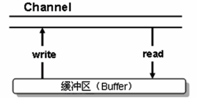
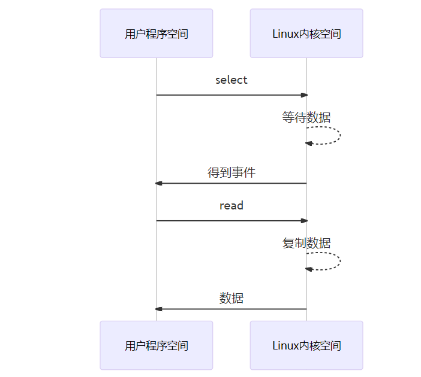

# 

读写模式


# 网络编程变迁

## 多线程版

1. 一个线程对应一个socket
2. 当来了多个连接时建立多个线程进行连接


> 弊端

1. 内存占用高
2. 线程上下文切换成本高
3. 只适合连接数少的场景

## 线程池版

一个线程处理多个socket


> 弊端

1. 阻塞模式，一个线程只能在socket开始到结束阻塞执行，只能对接一个socket
2. 仅适合短连接场景

## Selector版

1. selector的作用就是配合一个线程来管理多个channel，获取这些channel上发生的事件
2. 当channel有事件（如：连接等一些）处理时，selector才让线程对接
3. 如果channel1 没有事件，可以让thread处理channel2的事件


# 三大组件

## Channel

> 简介

1. 读写的**双向通道**

2. 既可以从通道中读取数据，又可以写数据到通道。但流的读写通常是单向的

3. 通道中的数据总是要先读到一个Buffer，或者总是要往一个Buffer中写入




> 常见的channel

1. *FileChannel*用来对本地文件进行IO操作
2. *DatagramChannel* 常用于UDP的channel
3. *SocketChannel*/*ServerSocketChannel*TCP时的网络通道

> 读取

1. 从File中获取channel

2. flip操作将bytebuffer从写状态转换到读状态

```java
try (FileInputStream fi = new FileInputStream("./1.text");
     FileChannel fileChannel = fi.getChannel()) {
    ByteBuffer buffer = ByteBuffer.allocate(10);
    while (true) {
        int read = fileChannel.read(buffer);
        if (read == -1) {
            break;
        }
        buffer.flip();
        while (buffer.hasRemaining()) {
            log.info("read:{}", (char) buffer.get());
        }
        buffer.clear();
    }
} catch (Exception e) {
    log.error("invoke main error ", e);
}
```

> 写入

写入的正确姿势:因为我们内存是有限的，所以，我们需要循环的从网络中读取数据，直到读完

```java
ByteBuffer buffer = ...;
buffer.put(...);//存入数据
buffer.flip();//切换读模式
while(buffer.hasRemaining()){
    channe1.write(buffer) ;
}
```

> channel的关闭

当关闭channel后，内部会去调用流的关闭

## Buffer

当向buffer写入数据时，buffer会记录下写了多少数据。

一旦要读取数据，需要通过flip()方法将Buffer从写模式切换到读模式。

在读模式下，可以读取之前写入到buffer的所有数据

> 以Intbuffer为例

*allocate*： 分配空间

*flip*: 转换操作

```java
//创建一个buffer，可以存放5个int
IntBuffer intBuffer = IntBuffer.allocate(5);
//将i设置进入buffer，将buffer塞满
for(int i=0; i<intBuffer.capacity(); i++){
    intBuffer.put(i);
}
//转化读操作
intBuffer.flip();
//判读是否还有数据
while (intBuffer.hasRemaining()) {
    log.info("取出数据：{}", intBuffer.get());
}
```

> Buffer源码几个参数

```java
//标记
private int mark = -1;
//当前下标
private int position = 0;
//操作过程中，下标不能超过limit，当前数据的大小
//作用：读数据不能超过这个数，flip时，会将position赋值给limit
private int limit;
//容量
private int capacity;
```

参数解释

capacity: 相当于当前的容量，是不能超过的

limit：读模式下，当前具体存了多少数据， 写模式下，等于容量


> 创建的方式与**分配的内存**

*HeapByteBuffer*：受GC的影响

*DirectByteBuffer*：使用完以后，要合理的回收

```java
//class java.nio.HeapByteBuffer
//使用堆内存，读写效率低，受GC影响
ByteBuffer.allocate(5).getClass();
//class java.nio.DirectByteBuffer
//直接内存，读写效率高（少一次拷贝）
ByteBuffer.allocateDirect(5).getClass();    
```

> 读和存

*buffer#get(i)*：读取指定位置，读取后position不会变化

*buffer#rewind*：将position重置为0

*buffer#mark*: 记录当前position的位置，调用*buffer#reset*方法，将position重置到mark标记的位置

```java
ByteBuffer buffer = ByteBuffer.allocate(10);
//存入数据，也可以用 channel.read(buffer)
buffer.put(new byte[] {'a', 'b', 'c', 'd', 'e'});
buffer.flip();
buffer.get(new byte[4]);
//[pos=4 lim=5 cap=10]
//位置已经读取到了4位置
System.out.println(buffer);
//获取坐标1的数据，但是pos不会动
System.out.println((char)buffer.get(1));
//读取坐标重置
buffer.rewind();
System.out.println((char)buffer.get());
//标记当前位置
buffer.mark();
//中间做N个读取操作后，指针回到mark标记处
buffer.reset();
```

> 字符串和buffer转换

```java
//这些方式都是直接切换到读模式的

//将字符串直接读取成buffer
ByteBuffer buffer1 = StandardCharsets.UTF_8.encode("hello");
//将字符串先转为bytes，然后放入byteBuffer中
ByteBuffer buffer2 = ByteBuffer.wrap("hello".getBytes());

//将buffer读取成String
String str = StandardCharsets.UTF_8.decode(buffer1).toString;
```

> 正确使用姿势

1. 向buffer 写入数据，例如调用channel.read(buffer)
2. 调用flip()切换至读模式
3. 从buffer读取数据，例如调用buffer.get()
4. 读完之后，想要再写入，调用clear()或compact()切换至写模式（clear：position回到0索引位置， compact：把当前未读取的压缩）

## Selector

1. 一般称 为选择器 ,也可以翻译为 多路复用器 。

2. 它是用于检查一个或多个NIO Channel（通道）的状态是否处于可读、可写。如此可以实现单线程管理多个channels,也就是可以管理多个网络链接

3. 当有事件发生时，返回select Key 数组，通过selectKey可以获取对应channel

> 对应方法

```java
int select()：阻塞到至少有一个通道在你注册的事件上就绪了。
int select(long timeout)：和select()一样，但最长阻塞时间为timeout毫秒。
int selectNow()：非阻塞，只要有通道就绪就立刻返回。
```

```java
//获取有事件发生的key
Set selectedKeys = selector.selectedKeys();
//获取所有注册的key
Set<SelectionKey> keys = selector.keys();
```

> Selector Key

*SelectionKey.OP_ACCEPT*:有新的网络连接

*SelectionKey.OP_CONNECT*:连接已建立

*SelectionKey.OP_READ*: 读操作

*SelectionKey.OP_WRITE*:写操作

> 分散聚合

*分散*：我们读取一个文件，分多个bytebuffer去读取**一个文件**

*聚合*：将多个buffer聚合起来，写入一个文件中

> 读取文件编程步骤

1. ServerSocketChannel绑定服务器端口
2.  ServerSocketChannel注册selector，将selector与channel关联、
3.  SelectionKey 注册一个连接事件
4. 一个while循环，去获取事件
   1. 通过 selector.selectedKeys().iterator()获取所有事件的集合
   2. 发现一个事件，则进行处理

## 组件读取示例

> 文件读取

```java
File file = new File("d:\\1.txt");
FileInputStream fileInputStream = new FileInputStream(file);
FileChannel channel = fileInputStream.getChannel();
ByteBuffer buffer = ByteBuffer.allocate(10);
while (true) {
    //从管道中读取内容
    int read = channel.read(buffer);
    if(read == -1) {
        break;
    }
    //切换读模式
    buffer.flip();
    //查询是否还有数据没读
    while (buffer.hasRemaining()) {
        System.out.println(buffer.get());
    }
    //清空缓存区
    buffer.clear();
}
```

> 文件拷贝

1. 方式1

```java
public static void main(String[] args) throws Exception {
    FileInputStream input = new FileInputStream("E:\\1.avi");
    FileChannel channelSource = input.getChannel();
    FileOutputStream outputStream = new FileOutputStream("d:\\1.mp4");
    FileChannel channelTarget = outputStream.getChannel();
    ByteBuffer byteBuffer = ByteBuffer.allocate(5);
    while (true) {
        byteBuffer.clear();
        //从channel读取
        int read = channelSource.read(byteBuffer);
        if(read == -1){
            //读取完成
            break;
        }
        byteBuffer.flip();
        //写入channel中
        channelTarget.write(byteBuffer);
    }
    input.close();
    outputStream.close();
}
```

2. 方式二
   1. 一次，最多传输2g内容
   2. 想要优化，可以采用多次传输

*transferTo*：从一个channel读取到另一个channel

```java
try(FileChannel from = new FileInputStream("d:\\1.txt").getChannel();
    FileChannel to = new FileOutputStream("d:\\2.txt").getChannel();
) {
    //操作效率高，底层会调用0拷贝进行优化
    from.transferTo(0,from.size(), to);
} catch (Exception e) {
    e.printStackTrace();
}
```


# 黏包半包

## 问题的产生

网络发送三条数据

```tex
hello \n
world \n
zhangsang \n
```

结果接收的时候变成了下面的两条(黏包，半包)

```tex
hello\nworld\nzhan
gsang\n
```

# NIO编程（单线程版）

## 无Selector示例

- 可以看到，accept是阻塞的，read也是阻塞的
- 如果没有selector的配置，那么线程会一直阻塞，直到有连接产生，有数据发送

```java
ByteBuffer buffer = ByteBuffer.allocate(16);
try (ServerSocketChannel socketChannel = ServerSocketChannel.open();) {
    socketChannel.bind(new InetSocketAddress(80));
    while (true) {
        log.debug("连接中....");
        //连接的过程中是阻塞的，只有有连接了才会进行下一步操作
        SocketChannel channel = socketChannel.accept();
        log.debug("连接完成");
        //read的过程也是阻塞的
        channel.read(buffer);
        buffer.flip();
        log.debug("获取到客户端数据: {}", new String(buffer.array()));
        buffer.clear();
    }
} catch (Exception e) {
}
```

## <span id = "fzsio">非阻塞模式</span>

*socketChannel.configureBlocking(false)*将模式设置为非阻塞

- 当没有连接时，socketChannel.accept()返回为null
- read方法也变成非阻塞的，只有i>0时，表示有数据读取

```java
ByteBuffer buffer = ByteBuffer.allocate(16);
try (ServerSocketChannel socketChannel = ServerSocketChannel.open();) {
    socketChannel.bind(new InetSocketAddress(80));
    socketChannel.configureBlocking(false);
    while (true) {
        //连接的过程中不是是阻塞的
        SocketChannel channel = socketChannel.accept();
        if(ObjectUtil.isNotNull(channel)) {
            log.debug("连接完成");
            int i = channel.read(buffer);
            if(i>0) {
                buffer.flip();
                log.debug("获取到客户端数据: {}", new String(buffer.array()));
                buffer.clear();
            }
        }
    }
} catch (Exception e) {
}
```

## <span id="dlfy">Selector版本</span>

### 服务器端

<b id="blue">socketChannel.register</b>：将selector注册事件（如果想要这个channel当前selector接下来关注什么事件，就得先注册）

<b id="blue">sscKey.interestOps(SelectionKey.OP_ACCEPT)</b>： 指明当前这个key只关注连接事件

<b id="blue">selector.select</b>： 没有事件发生，就会阻塞（如果是带参的则在指定事件内等待）

<b id="blue">selector.selectedKeys()</b>: 获取所有的事件集合

<b id="blue">keys.remove()</b>: 为什么要remove? 因为如果当前处理的事件不删除，下次这个集合还会存在这个key，重复操作，所以，处理可事件后，还要往Iterator集合中删除当前key

<b id="blue">key.cancel()</b>： 如果selector不去处理事件，则下一次**selector.select**就不会阻塞，认为上一次事件没有执行

`源码地址：`（stu-io）：com.xiao.nio.NIOServer

```java
ServerSocketChannel socketChannel = ServerSocketChannel.open();
//绑定一个服务器监听端口
socketChannel.bind(new InetSocketAddress(7070));
//设置为非阻塞
socketChannel.configureBlocking(false);
Selector selector = Selector.open();
//将selector与channel关联
//SelectionKey: 之后发生的事件都集中这里
SelectionKey sscKey = socketChannel.register(selector, 0, null);
//注册一个连接事件
sscKey.interestOps(SelectionKey.OP_ACCEPT);
//循环获取连接事件
while (true) {
    //1s没有获取到事件就重新获取
    if(selector.select(1000) == 0) {
        //System.out.println("没有人连接....");
        continue;
    }
    //获取发生的事件集合
    Iterator<SelectionKey> keys = selector.selectedKeys().iterator();
    while (keys.hasNext()) {
        SelectionKey key = keys.next();
        //将当前事件从集合中删除
        keys.remove();
        //如果是连接事件，注册读事件,并关联一个buffer
        if(key.isAcceptable()){
            //有新的客户端连接，注册一个生成一个channel，
            SocketChannel socketChannelRead = socketChannel.accept();
            socketChannelRead.configureBlocking(false);
            //当前这个注册一个读事件(如果接下来需要写，可以注册写事件)
            socketChannelRead.register(selector, SelectionKey.OP_READ, ByteBuffer.allocate(1024));
        } else if(key.isReadable()) {
            try {
                SocketChannel channel = (SocketChannel) key.channel();
                ByteBuffer buffer = (ByteBuffer) key.attachment();
               int i = channel.read(buffer);
                if(i ==-1) {
                    //客户端正常断开
                    key.cancel();
                } else {
                    System.out.println("客户端传来： "+ new String(buffer.array()));
                }
            } catch (IOException e) {
                //将当前事件消除，否则select()方法会认为这个事件还没有处理
                key.cancel();
            } 
        }
    }
} 
```

> 几个事件的解释

*accept*：会在有连接请求时触发

*connect*:客户端建立连接后触发

*read*： 可读事件

*write*:  可写事件

> 读事件操作

1. 客户端异常断开，则需要catch掉
2. 如果客户端正常断开int i = channel.read(buffer); **i == -1**

> 消息边界问题

> > 上述代码有编辑值处理问题

- 如：如果客户端发送的字节超过1024（buffer的大小），则服务器端需要分多次接收，这时，则会产生拆包黏包的问题

> > 解决方案

1. 服务器端和客户端都约定一个长度，如果超过这个长度，则做两次发送

- 弊端：如果数据不超过这个预定长度，则每次都会浪费空间

2. 按分隔符拆分，每一段结束，都给定一个特殊的分隔符，服务器端按照这个特定的分隔符来进行解析

- 如： hello word \n 你好\n
- 弊端：效率低，每次都要一次一次的去寻找分隔符

3. 每段字符分为两段：头部和数据部，头部标记数据部的长度

- 如： 5bytehello(前五个字符表示后面字符的长度)

> 事件附件

1. 从上面可以看出，如果我们的字符串超过长度，则可以多次读，但是，此时buffer又是一个局部变量，如果使用全局变量，则会导致每个channel都关联一个buffer
2. 使用事件附件可以解决**将当前buffer关联channel**，从此，这个buffer随着channel就关联到这个selectorkey

- 注册附件

```java
socketChannelRead.register(selector, SelectionKey.OP_READ, ByteBuffer.allocate(1024));
```

- 如果事件没有读取完，下一次读取，可以对这个bytebuffer进行重新的扩容处理(`让key关联新的buffer`)

```java
//....读取buffer的内容，发现没有换行符(即这段字符串字符还没有读完，当前buffer容量太小)
//当压缩之后发现buffer没有读完
buffer.capacity();
if(buffer.position() == buffer.limit()) {
    ByteBuffer bufferTemp = ByteBuffer.allocate(buffer.capacity() * 2);
    //将老的buffer设置到新的buffer中
    bufferTemp.put(buffer);
    key.attach(bufferTemp);
}
```

- 获取附件内容

```java
key.attachment()
```

> ByteBuffer大小分配

- 每个channel都需要记录可能被切分的消息，因为ByteBuffer 不能被多个channel共同使用，因此需要为每个channel维护一个独立的ByteBuffer

- ByteBuffer不能太大，比如一个ByteBuffer 1Mb的话，要支持百万连接就要1Tb内存，因此需要设计大小可变的ByteBuffer
  - 一种思路是首先分配一个较小的buffer，例如4k，如果发现数据不够，再分配8k的buffer，将4kbuffer内容拷贝至8k buffer，优点是消息连续容易处理，缺点是数据拷贝耗费性能，参考实现
  - 另一种思路是用多个数组组成buffer，一个数组不够，把多出来的内容写入新的数组，与前面的区别是消息存储不连续解析复杂，优点是避免了拷贝引起的性能损耗

> 一次写入数据过多的问题
>
> `因为缓冲区的大小是有限的，所以，推送的写入数据可能会分很多批次推送`

- 错误示例

可以看到*buffer.hasRemaining()*方法一直在循环，占用着线程，知道数据完全发送结束，这样会造成某个channel一直阻塞

```java
if(key.isAcceptable()) {
    SocketChannel socketChannel = ssc.accept();
    socketChannel.configureBlocking(Boolean.FALSE);
    //如果是连接事件,造出大量的数据，模拟发送客户端
    StringBuffer sb = new StringBuffer();
    for (int i=0; i<3000000; i++) {
        sb.append("a");
    }
    ByteBuffer buffer = Charset.defaultCharset().encode(sb.toString());
    //只要缓存区还有数据，就一直发送
    while(buffer.hasRemaining()) {
        int write = socketChannel.write(buffer);
        log.info("发送数据：{}", write);
    }
}
```

- 解决方式

当发送大量的数据的时候，我们让ServerSocketChannel再关注一个写事件

`可以看到，当写不完的时候，当前key关注一个可写事件，下次循环这个事件的时候，继续写`不让一个线程一直阻塞这里

```java
SelectionKey key = keyIterator.next();
keyIterator.remove();
if(key.isAcceptable()) {
    SocketChannel socketChannel = ssc.accept();
    socketChannel.configureBlocking(Boolean.FALSE);
    SelectionKey sk = socketChannel.register(selector, SelectionKey.OP_READ);
    //如果是连接事件,造出大量的数据，模拟发送客户端
    StringBuffer sb = new StringBuffer();
    for (int i=0; i<30000000; i++) {
        sb.append("a");
    }
    ByteBuffer buffer = Charset.defaultCharset().encode(sb.toString());
    /*//只要缓存区还有数据，就一直发送
    while(buffer.hasRemaining()) {
        int write = socketChannel.write(buffer);
        log.info("发送数据：{}", write);
    }*/
    int i = socketChannel.write(buffer);
    log.info("第一次发送数据：{}", i);
    if(buffer.hasRemaining()) {
        //如果还有没有写完的数据，则关注一个可写事件，用于下次处理
        //这里的意思：同时关注原来关注的事件和可写事件
        sk.interestOps(sk.interestOps() + SelectionKey.OP_WRITE);
        //并且将当前没发完的保存起来
        sk.attach(buffer);
    }
}else if(key.isWritable()) {
    //如果是可写事件，继续发送数据

    SocketChannel channel = (SocketChannel)key.channel();
    //取出上一次可写事件的key关联的数据
    ByteBuffer byteBuffer = (ByteBuffer) key.attachment();
    int i = channel.write(byteBuffer);
    log.info("再次写入数据： {}", i);
    if(!byteBuffer.hasRemaining()) {
        //没有数据了则清空，避免内存泄露
        key.attach(null);
        //同时不再关注可写事件
        key.interestOps(key.interestOps() - SelectionKey.OP_WRITE);
    }
}
```

### 客户端

```java
public static void main(String[] args) throws Exception {
    //打开选择器
    Selector selector = Selector.open();
    //打开套字接通道
    SocketChannel channel = SocketChannel.open();
    //设置非阻塞
    channel.configureBlocking(false);
    //注册通道，设置为链接就绪
    channel.register(selector, SelectionKey.OP_CONNECT);
    //绑定IP，端口
    if(!channel.connect(new InetSocketAddress("127.0.0.1", 7070))){
        while (!channel.finishConnect()) {
            System.out.println("客户端还未连接，不会阻塞，可以做其他事");
        }
    }
    ByteBuffer byteBuffer = ByteBuffer.wrap("hello, 老肖".getBytes());
    channel.write(byteBuffer);
    System.out.println("写入完毕");
}
```

# 多线程版本

## 设计

1. boss线程只处理客户端的accept事件（关注建立连接的事件）
2. 当有读/写事件发生时，交给work线程池处理（一个work线程表示一个selectorkey事件集合）


## 代码示例

> Work类构造

*selector*: 一个work对应一个selector，用于关注当前work线程的事件

*thread*: 当前用于启动事件线程的对象

*isStart*：标记当前work有没有被使用过，如果是新使用，则启动新的线程，否则，只是关联新的可读事件

*queue*： 用与在work线程中关联boss的可读事件

**register方法中，为什么要执行selector.wakeup()方法？**

`因为此处不像单线程那样，第一次客户建立连接后，有连接事件，所以此处的selector.wakeup()就是在boss方法中唤醒阻塞中的selector.select()方法`

**为什么要在selector.select()后面读取queue的方法执行关联事件？**

`因为在selector.select()方法会阻塞，如果不关注事件，则会一直执行，所以结束阻塞后，需要在同一个线程中顺序关注一个可读事件`

> 代码@see:com.xiao.nio.nio.ThreadServer

```java
public class ThreadServer {

    public static void main(String[] args) throws IOException {
        ServerSocketChannel ssc = ServerSocketChannel.open();
        ssc.bind(new InetSocketAddress(80));
        ssc.configureBlocking(Boolean.FALSE);
        Selector selector = Selector.open();
        ssc.register(selector, SelectionKey.OP_ACCEPT);
        Worker worker = new Worker("work-1");
        while (true) {
            selector.select();
            Iterator<SelectionKey> keyIterator = selector.selectedKeys().iterator();
            while (keyIterator.hasNext()) {
                SelectionKey key = keyIterator.next();
                keyIterator.remove();
                if(key.isAcceptable()) {
                    SocketChannel socketChannel = ssc.accept();
                    socketChannel.configureBlocking(Boolean.FALSE);
                    worker.register(socketChannel);
                }
            }
        }
    }

    static class Worker implements Runnable {
        private String name;
        //一个线程对应一个selector，一个selector关联多个key
        private Selector selector;
        private Thread thread;
        //是否开始
        private volatile boolean isStart = false;

        private ConcurrentLinkedQueue<Supplier> queue = new ConcurrentLinkedQueue();

        public Worker(String name) {
            this.name = name;
        }

        public void register(SocketChannel sc) throws IOException {
            if(!isStart) {
                selector = Selector.open();
                thread = new Thread(this, name);
                thread.start();
                isStart = true;
            }
            queue.add(() -> {
                SelectionKey key = null;
                try {
                    key = sc.register(selector, SelectionKey.OP_READ);
                } catch (ClosedChannelException e) {
                    e.printStackTrace();
                }
                return key;
            });
            selector.wakeup();
        }

        @Override
        public void run() {
            while (true) {
                try{
                    selector.select();
                    Supplier supplier = queue.poll();
                    if(Objects.nonNull(supplier)) {
                        supplier.get();
                    }
                    Iterator<SelectionKey> keyIterator = selector.selectedKeys().iterator();
                    if(keyIterator.hasNext()) {
                        SelectionKey key = keyIterator.next();
                        keyIterator.remove();
                        try{
                            if(key.isReadable()) {
                                SocketChannel socketChannel = (SocketChannel) key.channel();
                                ByteBuffer buffer = ByteBuffer.allocate(1024);
                                int read = socketChannel.read(buffer);
                                log.info("read data: {}", Charset.defaultCharset().decode(buffer));
                                if(read == -1) {
                                    key.cancel();
                                }
                            }
                        }catch (Exception e) {
                            e.printStackTrace();
                            key.cancel();
                        }
                    }
                }catch (Exception e) {
                    e.printStackTrace();
                }
            }
        }
    }
}
```

# IO模型

> 阻塞非阻塞

*阻塞IO*：从read到获取数据是一个阻塞过程，用户线程是被阻塞的


*非阻塞IO*：用户在read数据时，发现没有数据，立马返回，然后再去尝试获取[跳转示例](#fzsio)

*多路复用*：用户在等待数据是阻塞的，用户在读取数据是阻塞的,[代码示例](#dlfy)



> 同步与异步

*同步*：线程自己去获取结果

*异步*：当前线程申请结果，另一个线程推送结果（`回调方法的方式`）

# 零拷贝问题

> 传统IO的拷贝流程
>
> **四次拷贝三次切换**

1. `由用户态切换到内核态`：由磁盘拷贝到内核缓冲区
2. `内核态切换到用户态`：由内核缓冲区拷贝到用户缓冲区， 由用户缓冲区拷贝到socket缓冲区
3. `用户态切换到内核态`:由socket缓冲区拷贝到网卡


> NIO优化
>
> `ByteBuffer.allocateDirect(10) DirectByteBuffer使用的是操作系统内存`

少了内核缓冲区拷贝到用户缓冲区的过程，其他都一样

> 进一步优化

1. java调用transferTo方法后，要从java程序的用户态切换至内核态，使用DMA将数据读入内核缓冲区，不会使用cpu
2. 数据从内核缓冲区传输到socket缓冲区，cpu会参与拷贝
3. 最后使用DMA将socket缓冲区的数据写入网卡，不会使用cpu


