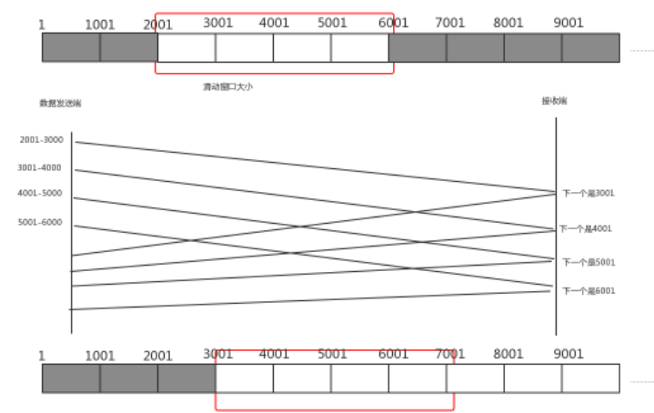

#

# 三次握手

## 流程

客户端发送SYN（seq=x）→ 服务端回复SYN+ACK（seq=y, ack=x+1）→ 客户端发送ACK（ack=y+1）

## 核心意义

- 防止历史连接（旧SYN报文干扰）
- 同步双方初始序列号（ISN）
- 两次握手无法确保服务端确认能力，四次则冗余

# 四次挥手

主动方发送FIN→被动方ACK→被动方FIN→主动方ACK

# 黏包半包

**只要我们使用**<b id="blue">TCP-IP</b>**协议，都会产生这个现象**

> 黏包现象
>
> `有10个10k数据，我希望是10k发一次，但是服务器一次性把这10个10k一次发过去了`

> 半包现象
>
> `有10K一个完整的数据，我希望一次发送过去，但是服务器将10K分为两次发送过去`

## TCP滑动窗口

1. TCP以一个段(segment)为单位，每发送一个段就需要进行一次确认应答(ack)处理，但如果这么做，缺点是包的往返时间越长性能就越差
2. 为了解决此问题，引入了窗口概念，窗口大小即决定了无需等待应答而可以继续发送的数据最大值

> 图解

1. 窗口大小为4格，当从2001开始发送消息，一直到6001都不需要无需ACK应答
2. 等到7001时，则不能再发送，因为受到了滑动窗口的大小限制
3. 当接收到2001的应答后，窗口右移，此时7001可以发送
4. 窗口越大，则网络的吞吐率就越高

> 窗口造成半包现象

如果一段数据，发送的时候，正好只能发送一部分就达到了窗口的大小，那么这个时候就会造成半包的现象

> 窗口造成黏包现象

如果多段数据都在窗口内，则可能造成黏包现象（窗口缓存了多段报文）

## Nagle算法

`会造成黏包现象`

> 发送数据不会来一条发一条，而是缓存到一定大小，发送

## 总结

> 黏包

1. 应用层:接收方 ByteBuf 设置太大(Netty默认1024)
2. 滑动窗口:假设发送方256 bytes 表示一个完整报文，但由于接收方处理不及时且窗口大小足够大，这256 bytes字节就会缓冲在接收方的滑动窗口中，当滑动窗口中缓冲了多个报文就会粘包
3. Nagle算法:会造成粘包

> 半包

1. 应用层:接收方ByteBuf 小于实际发送数据量
2. 滑动窗口:假设接收方的窗口只剩了128 bytes，发送方的报文大小是256 bytes，这时放不下了，只能先发送前128 bytes，等待ack后才能发送剩余部分，这就造成了半包
3. MSS限制:当发送的数据超过MSS限制后，会将数据切分发送，就会造成半包

## 解决方案（解码器）

> 短连接
>
> **可以解决粘包问题，不能解决拆包问题**

在发送完数据之后，就断开连接

> 定长的消息解码器

1. 客户端和服务器端约定一个长度N，如果消息不满N，则用特殊字符填充
2. 约定的长度一定要是所有字符串中最长的那个

3. netty中的解码器：io.netty.handler.codec.FixedLengthFrameDecoder

> 分割符解码器 

1. netty中的解码器（使用换行符作为分隔符）：io.netty.handler.codec.LineBasedFrameDecoder
2. netty中的解码器（自定义分隔符）：io.netty.handler.codec.DelimiterBasedFrameDecoder

> 基于字段长度（LTC）
>
> `分为两个部分：内容长度+实际内容`

1. io.netty.handler.codec.LengthFieldBasedFrameDecoder
2. 字段解析
   1.  lengthFieldOffset：长度字段偏移量
   2.  lengthFieldLength：长度字段的长度
   3.  lengthAdjustment：以长度字段为基准，再过*lengthAdjustment*字节是内容
   4.  initialBytesToStrip：从头剥离几个字节，剩下的字节作为解析字节

lengthAdjustment：

1. 如果报文 length = 10，content真正的长度为10，后续报文 = content = 10，那 lengthAdjustment = 0，报文长度无修修正
2. 如果报文 length = 15，content真正的长度为10（说明length代表整个报文的长度，也就是 length + header+ content ），后续报文 = content = 10，后续报文和length（15）不等，所以报文长度需要修正，lengthAdjustment = -5