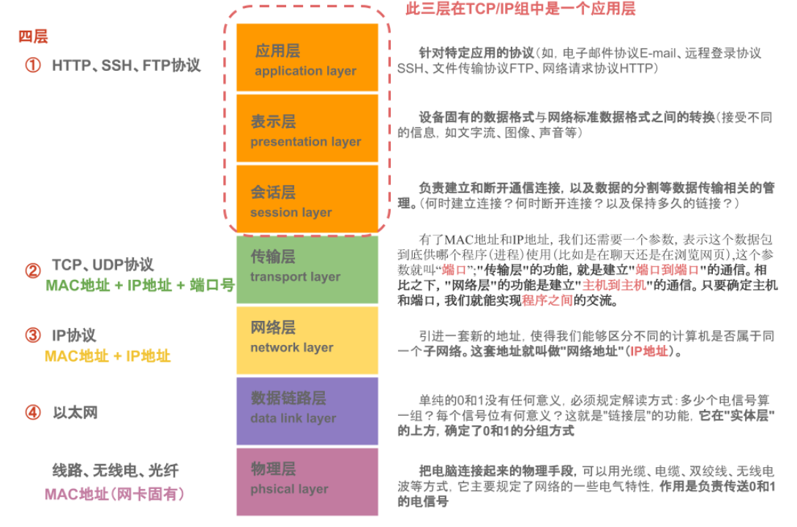
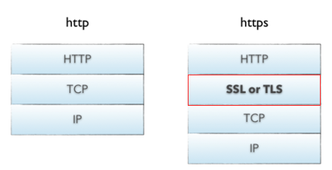
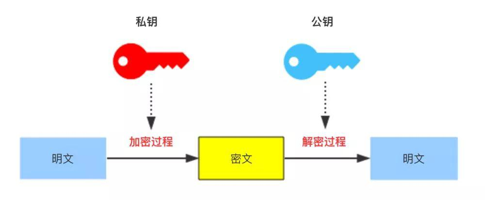
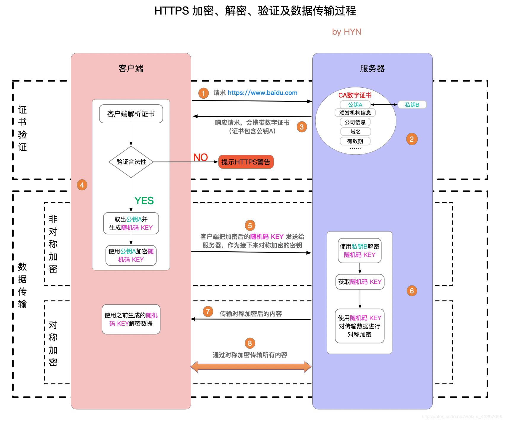

#

# 三次握手

## 流程

客户端发送SYN（seq=x）→ 服务端回复SYN+ACK（seq=y, ack=x+1）→ 客户端发送ACK（ack=y+1）

1. 客户端到服务端: 我要连接  
   1. 客户端向服务端发送SYN标志位，目的是与服务端建立连接 
2. 服务端到客户端: 好的，已经连接上了  
   1. 服务端向客户端发送 SYN ACK 标志位，其中ACK标志位表示是对收到的数据包的确
      认，说明服务端接收到了客户端的连接  
3. 服务端到客户端: 好的，已经连接上了  
   1. 客户端向服务端发送的ACK标志位为1 

## 核心意义

- 防止历史连接（旧SYN报文干扰）
- 同步双方初始序列号（ISN）
- 两次握手无法确保服务端确认能力，四次则冗余

# 四次挥手

主动方发送FIN→被动方ACK→被动方FIN→主动方ACK

1. 客户端到服务端：我关了  
2. 服务端到客户端：好的，收到  
3. 服务端到客户端：我也关了  
4. 客户端到服务端：好的，收到  

# 黏包半包

**只要我们使用**<b id="blue">TCP-IP</b>**协议，都会产生这个现象**

> 黏包现象
>
> `有10个10k数据，我希望是10k发一次，但是服务器一次性把这10个10k一次发过去了`

> 半包现象
>
> `有10K一个完整的数据，我希望一次发送过去，但是服务器将10K分为两次发送过去`

## TCP滑动窗口

1. TCP以一个段(segment)为单位，每发送一个段就需要进行一次确认应答(ack)处理，但如果这么做，缺点是包的往返时间越长性能就越差
2. 为了解决此问题，引入了窗口概念，窗口大小即决定了无需等待应答而可以继续发送的数据最大值

> 图解

1. 窗口大小为4格，当从2001开始发送消息，一直到6001都不需要无需ACK应答
2. 等到7001时，则不能再发送，因为受到了滑动窗口的大小限制
3. 当接收到2001的应答后，窗口右移，此时7001可以发送
4. 窗口越大，则网络的吞吐率就越高

> 窗口造成半包现象

如果一段数据，发送的时候，正好只能发送一部分就达到了窗口的大小，那么这个时候就会造成半包的现象

> 窗口造成黏包现象

如果多段数据都在窗口内，则可能造成黏包现象（窗口缓存了多段报文）

## Nagle算法

`会造成黏包现象`

> 发送数据不会来一条发一条，而是缓存到一定大小，发送

## 总结

> 黏包

1. 应用层:接收方 ByteBuf 设置太大(Netty默认1024)
2. 滑动窗口:假设发送方256 bytes 表示一个完整报文，但由于接收方处理不及时且窗口大小足够大，这256 bytes字节就会缓冲在接收方的滑动窗口中，当滑动窗口中缓冲了多个报文就会粘包
3. Nagle算法:会造成粘包

> 半包

1. 应用层:接收方ByteBuf 小于实际发送数据量
2. 滑动窗口:假设接收方的窗口只剩了128 bytes，发送方的报文大小是256 bytes，这时放不下了，只能先发送前128 bytes，等待ack后才能发送剩余部分，这就造成了半包
3. MSS限制:当发送的数据超过MSS限制后，会将数据切分发送，就会造成半包

## 解决方案（解码器）

> 短连接
>
> **可以解决粘包问题，不能解决拆包问题**

在发送完数据之后，就断开连接

> 定长的消息解码器

1. 客户端和服务器端约定一个长度N，如果消息不满N，则用特殊字符填充
2. 约定的长度一定要是所有字符串中最长的那个

3. netty中的解码器：io.netty.handler.codec.FixedLengthFrameDecoder

> 分割符解码器 

1. netty中的解码器（使用换行符作为分隔符）：io.netty.handler.codec.LineBasedFrameDecoder
2. netty中的解码器（自定义分隔符）：io.netty.handler.codec.DelimiterBasedFrameDecoder

> 基于字段长度（LTC）
>
> `分为两个部分：内容长度+实际内容`

1. io.netty.handler.codec.LengthFieldBasedFrameDecoder
2. 字段解析
   1.  lengthFieldOffset：长度字段偏移量
   2.  lengthFieldLength：长度字段的长度
   3.  lengthAdjustment：以长度字段为基准，再过*lengthAdjustment*字节是内容
   4.  initialBytesToStrip：从头剥离几个字节，剩下的字节作为解析字节

lengthAdjustment：

1. 如果报文 length = 10，content真正的长度为10，后续报文 = content = 10，那 lengthAdjustment = 0，报文长度无修修正
2. 如果报文 length = 15，content真正的长度为10（说明length代表整个报文的长度，也就是 length + header+ content ），后续报文 = content = 10，后续报文和length（15）不等，所以报文长度需要修正，lengthAdjustment = -5

# 网络分层模型

> 浏览器打开网址做了哪些事
>
> > DNS解析

1. 输入域名，浏览器查询本地缓存，看域名有没有对应的ip
2. 如果没有，去host里查询，没有则发起一个DNS请求
3. 通过的是UDP协议向DNS的53端口发起请求，这个请求是递归的请求，也就是运营商的DNS服务器必须得提供给我们该域名的IP地址
4. 得到了这个IP后，本地域名服务器返回IP给操作系统，同时将IP缓存下来，操作系统在还给浏览器，同时缓存IP

> > 与服务器建立连接

> > ##### 发起HTTP连接

> > ##### 服务器响应HTTP请求，浏览器得到html代码

> > ##### 浏览器解析html代码，并请求html代码中的资源

> > ##### 浏览器对页面进行渲染呈现给用户

> > ##### TCP断开连接

## TCP四层模型与网络七层模型对比

# 网络编程安全

## https安全协议

> http 和https 的区别

> 访问的基本流程

## 加密算法

> 对称加密

- 也叫单钥加密，是指加密密钥和解密密钥相同的加密方式。  

- 加密和解密都是通过一个公钥进行处理的

代表算法：AES算法、DES算法、RC4，3DES 、Triple-DES, RC2等；   

> 非对称加密  

加密使用的密钥和解密使用的密钥是不相同的，分别称为：公钥、私钥，

公钥和算法都是公开的，私钥是保密的  

非对称加密算法性能较低，但是安全性超强，由于其加密特性，非对称加密算法能加密的数据长度也是有限的。
例如：RSA、DSA、ECDSA、 DH、ECDHE  

：用私钥加密之后，就要用公钥解密；用公钥加密之后，就得用私钥解密

> 散列算法  

Hash算法特别的地方在于它是一种单向（输出不依赖于输入）算法，用户可以通过hash算法对目标信息生成一段特定长度的唯一hash值，却不能通过这个hash值重新获得目标信息。
因此Hash算法常用在不可还原的密码存储、信息完整性校验等。
将任意长度的信息转换为较短的固定长度的值，通常其长度要比信息小得多，且算法不可逆。
例如：MD5、SHA-1、SHA-2、SHA-256 等  

## HTTPS加密ssl的过程

1. 服务端用非对称加密算法RSA生成公钥和私钥，把公钥放在证书里发送给客户端，私钥自己保存
2. 客户端接收到公钥后，首先向一个权威的服务器检查证书的合法性，如果证书合法，客户端产生一段随机数，这个随机数就作为通信的密钥，我们称之为对称密钥 
3. 用公钥加密这段随机数，然后发送到服务器服务器用密钥解密获取对称密钥，然后，双方就已对称密钥进行加密解密通信了  

# TCP拥塞控制

TCP拥塞控制是防止过多的数据注入到网络中，避免网络拥塞的一种机制

## 拥塞窗口（cwnd）

发送方除了考虑接收方的接收窗口外，还会维护一个拥塞窗口。拥塞窗口是根据网络的拥塞情况动态调整的。发送方在发送数据时，需要同时考虑接收窗口和拥塞窗口，实际的发送窗口大小=接收窗口和拥塞窗口中的最小值。

**慢启动阶段**：在连接刚建立或者发生拥塞后恢复时，发送方会将拥塞窗口设置为一个较小的值（通常是1个最大报文段长度MSS）。每收到一个确认，拥塞窗口就增加1个MSS

**拥塞避免阶段**：当拥塞窗口达到一个阈值后，进入拥塞避免阶段。这个阶段窗口增长速度变慢，每收到一个确认，拥塞窗口增加1/cwnd（cwnd是当前拥塞窗口大小）

**拥塞发生时的处理**：如果发送方发现有丢包（通过超时重传或者收到重复确认等方式判断），就会认为网络拥塞发生了。此时，发送方会将拥塞窗口减半，并且将阈值设置为当前拥塞窗口的一半，然后重新进入慢启动阶段
