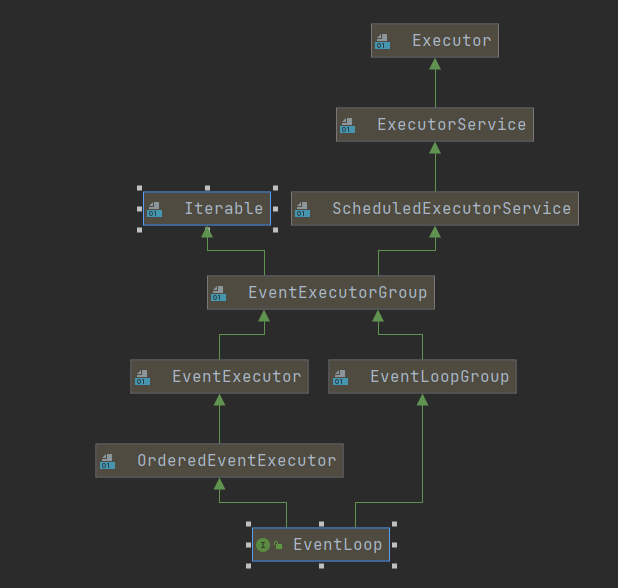
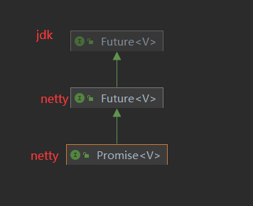
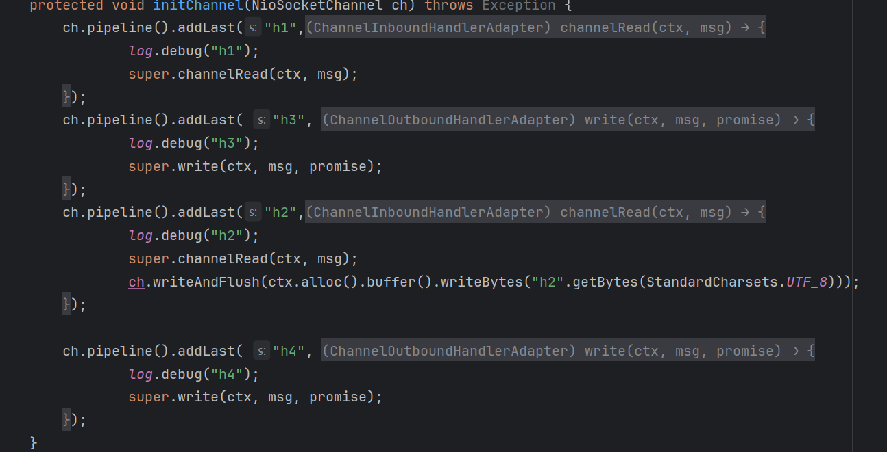
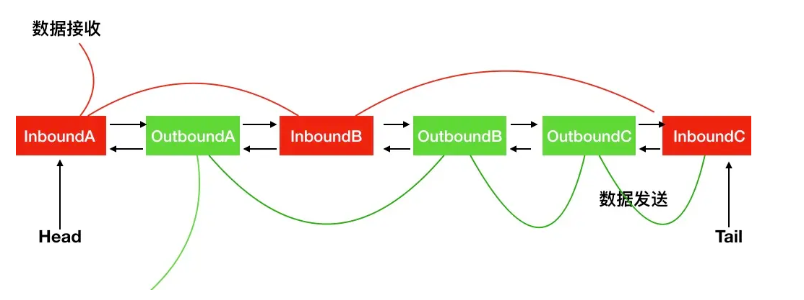

# 入门

## 服务器端

*new ServerBootstrap()*: 启动器，负责组装netty组件，启动服务器

*NioEventLoopGroup*：BossEventLoop ,WorkerEventLoop  循环处理事件组

*channel(NioServerSocketChannel.class)*: 选择SocketChannel实现

*childHandler*：告诉WorkerEventLoop ，将来发生事件处理哪些逻辑

*ChannelInitializer*： 根客户端读写的通道，并且添加别的handler

```java
public static void main(String[] args) {
    new ServerBootstrap()
            .group(new NioEventLoopGroup())
            .channel(NioServerSocketChannel.class)
            .childHandler(new ChannelInitializer<NioSocketChannel>() {
                @Override
                protected void initChannel(NioSocketChannel ch) throws Exception {
                    ch.pipeline().addLast(new StringDecoder());
                    ch.pipeline().addLast(new ChannelInboundHandlerAdapter(){
                        @Override
                        public void channelRead(ChannelHandlerContext ctx, Object msg) throws Exception {
                            log.info("收到数据：{}",msg);
                        }
                    });
                }
            })
            .bind(80);
}
```

## 客户端

<b id="blue">sync()</b>：等待连接建立

<b id="blue">channel()</b>： 获取连接对象

<b id="blue">writeAndFlush</b>：发送数据，之后进入*initChannel*方法中

```java
public static void main(String[] args) throws InterruptedException {
    new Bootstrap()
            .group(new NioEventLoopGroup())
            .channel(NioSocketChannel.class)
            .handler(new ChannelInitializer<NioSocketChannel>() {
                @Override
                protected void initChannel(NioSocketChannel ch) throws Exception {
                    ch.pipeline().addLast(new StringEncoder());
                }
            }).connect("127.0.0.1", 80)
            .sync()
            .channel()
            .writeAndFlush("hello word");
}
```

# Netty核心组件

## EventLoop

1. <b id="blue">EventLoop</b>本质是一个单线程执行器（同时维护了一个Selector)，里面有run方法处理Channel上源源不断的io事件。

2. 其实相当于我们我们[NIO笔记里的worker](/java/java-io/1-nio?id=%e5%a4%9a%e7%ba%bf%e7%a8%8b%e7%89%88%e6%9c%ac)定义

3. 服务器<b id="blue">EventLoop</b>处理了某个客户端的<b id="gray">channel</b>连接后，就会绑定，以后处理这个客户端的这个<b id="gray">channel</b>都是这个线程来处理




## EventLoopGroup 

1. 一组*EventLoop*
2. NioEventLoopGroup可以处理io事件，普通任务，定时任务

```java
NioEventLoopGroup executors = new NioEventLoopGroup();
//普通任务
executors.next().submit(() -> {
    System.out.println(Thread.currentThread().getId());
});
//定时任务
//任务，初始延迟时间， 时间间隔， 时间单位
executors.next().scheduleAtFixedRate(() -> {
    log.debug("定时任务");
}, 0, 1, TimeUnit.SECONDS);
```

3. NioEventLoopGroup默认的子线程`线程数是：cpu核心数*2`，new NioEventLoopGroup构造方法默认使用了NettyRuntime.availableProcessors() * 2

   如果构造参数有值，则使用构造参数的线程数。**不过我们一般bossGroup设置为1个**

<b id="blue">获取下一个eventLoop</b> 

```java
EventLoopGroup workGroup = new NioEventLoopGroup();
EventLoop eventLoop = workGroup.next();
```

> Boss和worker的线程数设置

在构建<b id="blue">group</b>的时候，我们可以设置两个<b id="blue">group</b>

1. 第一个表示boss线程池，用于处理<b id="blue">ServerSocketChannel</b>的<b id="gray">accept事件</b>通常设置一个
2. 第二个表示worker线程池，用于处理<b id="blue">SocketChannel</b>的<b id="gray">read和writer事件</b>

```java
new ServerBootstrap()
        .group(new NioEventLoopGroup(1), new NioEventLoopGroup())
```

> 额外的线程组处理业务

- 有时候，一个`handler`执行的业务时间特别长，这时，肯定会影响同一个EventLoop的其他channel的工作，此时，我们需要将此业务放入一个非IO的EventLoop中，防止它影响其他channel的使用
- 如下，我们造DefaultEventLoopGroup一个线程组，让handler2在其上执行，注意，需要在`channelRead`中调用`ctx.fireChannelRead(msg);`将消息传递这个里面`defaultEventLoop`中

```java
//非IO的线程组
EventLoopGroup defaultEventLoop = new DefaultEventLoopGroup();
new ServerBootstrap()
        .group(new NioEventLoopGroup(1), new NioEventLoopGroup())
        .channel(NioServerSocketChannel.class)
        .childHandler(new ChannelInitializer<NioSocketChannel>() {
            @Override
            protected void initChannel(NioSocketChannel ch) throws Exception {
                ch.pipeline().addLast("handler1",new ChannelInboundHandlerAdapter() {
                    @Override
                    public void channelRead(ChannelHandlerContext ctx, Object msg) throws Exception {
                        log.debug("handler1 进入 : {}", Thread.currentThread().getName());
                        //将消息传递给下一个handler
                        ctx.fireChannelRead(msg);
                    }
                });
                ch.pipeline().addLast(defaultEventLoop, "handler2", new ChannelInboundHandlerAdapter() {
                    @Override
                    public void channelRead(ChannelHandlerContext ctx, Object msg) throws Exception {
                        log.debug("handler2 是个很长的业务 {}", Thread.currentThread().getName());
                    }
                });
            }
        }).bind(80);
```

<b id="blue">绑定关系图</b>

如图：h2使用的线程组是我们自己外部定义的EventLoop


<b id="blue">Handler切换线程的源码</b>

io.netty.channel.AbstractChannelHandlerContext#invokeChannelRead(io.netty.channel.AbstractChannelHandlerContext, java.lang.Object)

如果两个handler绑定的是同—个线程,那么就直接调用否则，把要调用的代码封装为—个任务对象，由下—个handler的线程来调用

```java
//获取msg信息
final Object m = next.pipeline.touch(ObjectUtil.checkNotNull(msg, "msg"), next);
//获取下一个handler
EventExecutor executor = next.executor();
//判断是否是同一个执行eventloop
if (executor.inEventLoop()) {
    next.invokeChannelRead(m);
} else {
    //不是，调用的代码封装为一个任务对象，由下一个 handler 的线程来调用
    executor.execute(new Runnable() {
        @Override
        public void run() {
            next.invokeChannelRead(m);
        }
    });
}
```

## Channel

> **主要作用**

<b id="blue">close()</b>：可以用来关闭channel

<b id="blue">closeFuture()</b>： 用于处理channel的关闭

<b id="blue">pipeline()</b>： 用于添加处理器

<b id="blue">write(Object msg, ChannelPromise promise)</b>： 将数据写入

<b id="blue">writeAndFlush(Object msg)</b>：将数据写入并刷出

> ChannelFuture的连接问题

**为什么调用connect后，需要调用io.netty.channel.ChannelFuture#sync方法？**

1. 因为<b id="blue">connect</b>是main线程调用，但真正执行连接的是NioEventLoop的线程去执行的，如果不调用sync就会不等连接完，就结束了当前main线程

**ChannelFuture处理连接的方式**

1. 同步的方式

`一直等待连接建立完成才执行下面的方法`

```java
channelFuture.sync()
        .channel()
        .writeAndFlush("hello word");
```

2. 监听回调的方式

`等到连接建立完成，调用`<b id="blue">operationComplete</b>`方法`

```java
channelFuture.addListener(new ChannelFutureListener() {
    @Override
    public void operationComplete(ChannelFuture future) throws Exception {
        future.channel().writeAndFlush("hello word");
    }
});
```

> ChannelFuture关闭的问题

1. 通过监听的方式获取关闭事件,我们可以在监听方法里执行关闭后的一些善后操作

```java
ChannelFuture channelFuture = channel.closeFuture();
channelFuture.addListener(closeFuture -> {
    log.debug("channel 已关闭..");
});
```

2. 通过同步的方式（<b id="blue"> channelFuture.syn</b>）关闭

```java
ChannelFuture channelFuture = channel.closeFuture();
channelFuture.syn()
//执行关闭的一些操作.....
```

> 优雅的结束所有线程

*NioEventLoopGroup#shutdownGracefully*方法能够优雅的结束<b id="blue">NioEventLoopGroup</b>里的线程

```java
NioEventLoopGroup group = new NioEventLoopGroup();
        ChannelFuture channelFuture = new Bootstrap()
                .group(group)
//....执行代码
            
//关闭后优雅的结束            
channelFuture.addListener(new ChannelFutureListener() {
    @Override
    public void operationComplete(ChannelFuture future) throws Exception {
        future.channel().writeAndFlush("hello word");
        future.channel().close().addListener(close -> {
            group.shutdownGracefully();
        });
    }
});   
```

## Future & Promise

由图可见，netty中的future和promise是jdk<b id="gray">future</b>的升级版本



> Jdk Future
>
> **只能同步等待异步结束**

通过*future.get()*方式获取异步的结果

```java
ExecutorService threadPool = Executors.newFixedThreadPool(2);
Future<Integer> future = threadPool.submit(() -> {
    log.debug("进入future中...");
    Thread.sleep(1000);
    return 10;
});
log.debug("准备获取结果...");
Integer integer = future.get();
log.debug("获取到结果...");
```

> Netty Futrue

*getNow*：获取任务结果，非阻塞，还未产生结果时返回 null  

*await*:等待任务结束，如果任务失败，不会抛异常，而是通过 isSuccess 判断  

*sync*:等待任务结束，如果任务失败，抛出异常  

*addLinstener*: 添加回调，异步接收结果  

```java
DefaultEventLoopGroup loopGroup = new DefaultEventLoopGroup();
EventLoop eventLoop = loopGroup.next();
Future<Integer> future = eventLoop.submit(() -> {
    log.debug("进入future中...");
    Thread.sleep(1000);
    return 10;
});
log.debug("准备获取结果...");
log.debug("获取到结果 {}...", future.get());
future.addListener(future1 -> {
    log.debug("异步的获取结果:{}", future1.getNow());
});
```

> Promise
>
> **两个线程间交换结果的容器**

`前面两个future都是通过线程池返回的，而promise可以自己创建`

在RPC框架专供可以用到

```java
EventLoop eventLoop = new DefaultEventLoopGroup().next();
Promise<Integer> promise = new DefaultPromise<>(eventLoop);
new Thread(() -> {
    log.debug("开始计算结果设置数据进入promise");
    promise.setSuccess(100);
}).start();
log.debug("获取结果中....");
log.debug("获取到结果：{} ...", promise.get());
```

## Handler&PipeLine

ChannelHandler一般分为两种，

1. <b id="blue">ChannelInboundHandler</b>入站handler：主要用来读取客户端数据，写回结果

2. <b id="blue">ChannelOutboundHandler</b>出站handler：主要对写回结果进行加工

> handler的顺序问题

- 此处打印的日志  h1  h2  h4  h3，由此可见队列的顺序为  `head -> h1 -> h2 -> tail -> h4 -> h3 `

代码：com.xiao.netty.sort.SortHandlerServer



- <b id="gray">pipeline</b>的链表是一个双向链表，*Inbound*从*head*往后面执行<b id="blue">channelRead</b>方法，而 *Outbound*则从*tail*往前面执行<b id="blue">write</b>方法



- *Outbound*元素想要被执行，必须在*inbound*中写出数据，也就是调用*ch.writeAndFlush*方法
- *super.channelRead*  ：调用下一个inboundhandler，如果不调用，*inbound*调用链就会**断开**

```java
.childHandler(new ChannelInitializer<NioSocketChannel>() {
    @Override
    protected void initChannel(NioSocketChannel ch) throws Exception {
        ch.pipeline().addLast("h1",new ChannelInboundHandlerAdapter() {
            @Override
            public void channelRead(ChannelHandlerContext ctx, Object msg) throws Exception {
                log.debug("h1");
                super.channelRead(ctx, msg);
            }
        });
        ch.pipeline().addLast("h2",new ChannelInboundHandlerAdapter() {
            @Override
            public void channelRead(ChannelHandlerContext ctx, Object msg) throws Exception {
                log.debug("h2");
                super.channelRead(ctx, msg);
                ch.writeAndFlush(ctx.alloc().buffer().writeBytes("h2".getBytes(StandardCharsets.UTF_8)));
            }
        });
        ch.pipeline().addLast( "h3", new ChannelOutboundHandlerAdapter() {
            @Override
            public void write(ChannelHandlerContext ctx, Object msg, ChannelPromise promise) throws Exception {
                log.debug("h3");
                super.write(ctx, msg, promise);
            }
        });
        ch.pipeline().addLast( "h4", new ChannelOutboundHandlerAdapter() {
            @Override
            public void write(ChannelHandlerContext ctx, Object msg, ChannelPromise promise) throws Exception {
                log.debug("h4");
                super.write(ctx, msg, promise);
            }
        });
    }
})
```

>  NioSocketChannel#writeAndFlush和ChannelHandlerContext#writeAndFlush区别

1. *NioSocketChannel#writeAndFlush*:表示从tail往前找对应的*OutboundHandler*进行执行
2. *ChannelHandlerContext#writeAndFlush*表示从当前节点往前找*OutboundHandler*执行
   - 如： `head -> h1  -> h3 -> h2 -> h4 -> tail`,这个调用链，h4和h3是*OutboundHandler*，如果在h2调用*ChannelHandlerContext#writeAndFlush*，则只有h3会执行

> Handler的顺序测试

在开发中，启动服务端很耗时，可以借助netty提供的工具来测试handler的出站和入站

```java
ChannelInboundHandlerAdapter i1 = new ChannelInboundHandlerAdapter() {
    @Override
    public void channelRead(ChannelHandlerContext ctx, Object msg) throws Exception {
        log.debug("h1");
        super.channelRead(ctx, msg);
    }
};
ChannelInboundHandlerAdapter i2 = new ChannelInboundHandlerAdapter() {
    @Override
    public void channelRead(ChannelHandlerContext ctx, Object msg) throws Exception {
        log.debug("h2");
    }
};
ChannelOutboundHandlerAdapter o3 = new ChannelOutboundHandlerAdapter() {
    @Override
    public void write(ChannelHandlerContext ctx, Object msg, ChannelPromise promise) throws Exception {
        log.debug("h3");
        super.write(ctx, msg, promise);
    }
};

ChannelOutboundHandlerAdapter o4 = new ChannelOutboundHandlerAdapter() {
    @Override
    public void write(ChannelHandlerContext ctx, Object msg, ChannelPromise promise) throws Exception {
        log.debug("h4");
        super.write(ctx, msg, promise);
    }
};

EmbeddedChannel embeddedChannel = new EmbeddedChannel(i1, i2, o3, o4);
//测试入站操作
embeddedChannel.writeInbound(ByteBufAllocator.DEFAULT.buffer().writeBytes("hello".getBytes()));
//测试出站
embeddedChannel.writeOutbound(ByteBufAllocator.DEFAULT.buffer().writeBytes("hello".getBytes()));
```

>  SimpleChannelInboundHandler<I>
>
> **只会对特定泛型的类型进行执行**

如：只有上游传输的是Student的对象，才会调用<b id="blue">channelRead0</b>方法

```java
ch.pipeline().addLast("I2",new SimpleChannelInboundHandler<Student>() {
    @Override
    protected void channelRead0(ChannelHandlerContext ctx, Student msg) throws Exception {

    }
});
```

# 测试调用

可以运用：<b id="blue">EmbeddedChannel </b>来进行handle的模拟调用

代码示例：com.xiao.netty.channel.TestEmbeddedChannel

# ByteBuf

Netty的`ByteBuf`是其核心数据容器，专为高效网络通信设计，相较于Java NIO的`ByteBuffer`，它在功能、性能及灵活性上均有显著提升。以下是其核心特性及使用要点：

## 创建

### 创建方式

ByteBuf的容量是可以动态扩容的

```java
//创建初始容量为10
ByteBuf buffer = ByteBufAllocator.DEFAULT.buffer(10);
```

### 直接内存 vs 堆内存

堆内存易分配读写慢

直接内存创建和销毁的代价昂贵，但读写性能高

```java
ByteBuf buffer = ByteBufAllocator.DEFAULT.heapBuffer(10);
//默认使用的直接内存
ByteBuf buffer = ByteBufAllocator.DEFAULT.directBuffer(10);
```

## 组成

*max capacity*: 最大容量，到时候扩容的上限

*capacity*: 容量

*read index*: 读指针

*write index*: 写指针

`bytebuf由四个部分组成，它读写分为两个指针，这样就不用flip了`

`最开始读写指针都在 0 位置`


## 内存回收

1. UnpooledHeapByteBuf 使用的是 JVM 内存，只需等 GC 回收内存即可

2. UnpooledDirectByteBuf 使用的就是直接内存了，需要特殊的方法来回收内存

3. PooledByteBuf 和它的子类使用了池化机制，需要更复杂的规则来回收内存

Netty 这里采用了**引用计数法**来控制回收内存，每个 ByteBuf 都实现了 <b id="blue">ReferenceCounted </b>接口

> 回收机制

1. 每个 ByteBuf对象的初始计数为1
2. 调用<b id="gray">release</b>方法计数减1，如果计数为0，ByteBuf内存被回收
3. 调用<b id="gray">retain</b>方法计数加1，表示调用者没用完之前，其它handler即使调用了release 也不会造成回收
4. 当计数为0时，底层内存会被回收，这时即使ByteBuf对象还在，其各个方法均无法正常使用
5. 基本规则是，谁是**最后使用者**，谁负责release
6. netty中，有*head*和*tail*对ByteBuf进行回收，`如果中间有没传到这两个hanlder的bytebuf，则需要自己进行回收`
   1. (比如：head -> h1->h2->h3->h4)
   2. h2的时候将bytebuf转换为字符串，并且传递到h3，此时bytebuf没有传递下去
   3. 则h2是最后一个使用bytebuf的节点，则他需要回收这个bytebuf

> tail 释放的源码
>
> `tail处理入站的消息释放`
>
> io.netty.channel.DefaultChannelPipeline#onUnhandledInboundMessage(java.lang.Object)

```java
protected void onUnhandledInboundMessage(Object msg) {
    try {
        logger.debug(
                "Discarded inbound message {} that reached at the tail of the pipeline. " +
                        "Please check your pipeline configuration.", msg);
    } finally {
        ReferenceCountUtil.release(msg);
    }
}
```

> head释放源码
>
> `head处理出站的消息释放`
>
> io.netty.channel.AbstractChannel.AbstractUnsafe#write

```java
public final void write(Object msg, ChannelPromise promise) {
    assertEventLoop();

    ChannelOutboundBuffer outboundBuffer = this.outboundBuffer;
    if (outboundBuffer == null) {
        safeSetFailure(promise, newClosedChannelException(initialCloseCause));
        ReferenceCountUtil.release(msg);
        return;
    }
```

## Netty中的零拷贝

> slice

但某个ByteBuf中的内容我们想取出一部分的时候，一般的方法我们会采取复制的方式

但是netty提供了一个<b id="blue">slice</b>方法，直接对ByteBuf中的内容切片，建立虚拟的指针，直接指向ByteBuf的内存，从而达到不需要复制的目的

**如下**

- 此时，buf1/buf2和buf是同一内存，所以，修改buf1的值会影响buf的值

```java
ByteBuf buf = ByteBufAllocator.DEFAULT.buffer(6);
buf.writeBytes(new byte[] {'a', 'b', 'c', 'd', 'e', 'f'});
//采用切片的方式
ByteBuf buf1 = buf.slice(0, 3);
ByteBuf buf2 = buf.slice(3, 3);
```

- 切片后的对象容量`不允许再添加`，也就是buf1/buf2不能扩容
- 切片后，buf调用release回收内存会有影响

`正确的方式是：每一次slice后，都自己让引用计数+1`，达到一个原则：`自己的buf自己回收`

```java
//采用切片的方式
ByteBuf buf1 = buf.slice(0, 3);
//引用计数+1
buf1.retain();
ByteBuf buf2 = buf.slice(3, 3);
//引用计数+2
buf2.retain();
buf.release();
buf1.release();
buf2.release();
```

> duplicate

就好比截取了原始ByteBuf所有内容，并且没有max capacity 的限制，也是与原始ByteBuf使用同一块底层内存，只是读写指针是独立的

> CompositeByteBuf

- 将小的bytebuf合并成新的bytebuf
- 这里不会发生数据的复制
- 这里只是逻辑上将其聚合到一起
- <b id="blue">addComponents</b>将第一个参数设置为true，表示在聚合的过程中自动的增长写指针
- 调用<b id="blue">addComponents</b>方法也需要考虑调用<b id="gray">retain</b>方法来进行引用计数的增加，防止被意外的release掉

```java
ByteBuf buf1 = ByteBufAllocator.DEFAULT.buffer(5);
buf1.writeBytes(new byte[]{1, 2, 3, 4, 5});
ByteBuf buf2 = ByteBufAllocator.DEFAULT.buffer(5);
buf2.writeBytes(new byte[]{6, 7, 8, 9, 10});

CompositeByteBuf buf3 = ByteBufAllocator.DEFAULT.compositeBuffer();
// true 表示增加新的 ByteBuf 自动递增 write index, 否则 write index 会始终为 0
buf3.addComponents(true, buf1, buf2);
```

# Netty 的 ByteBuf 与 ByteBuffer 相比的优势

1.  JDK 标准库中 `ByteBuffer` ，它在读写模式切换时需要调用 `flip` 方法，若忘记调用可能会导致程序出现问题。而 `ByteBuf` 则将读写指针分离，有 `read index` 和 `write index` 两个指针。在进行读写切换时无需显式转换，更加方便。

```java
// ByteBuffer 示例
ByteBuffer byteBuffer = ByteBuffer.allocate(10);
byteBuffer.put((byte) 1);
// 从写模式切换到读模式需要调用 flip 方法
byteBuffer.flip();
byte readByte = byteBuffer.get();
 
// ByteBuf 示例
ByteBuf byteBuf = ByteBufAllocator.DEFAULT.buffer();
byteBuf.writeByte((byte) 2);
// 读取数据无需显式切换模式
byte readByteFromByteBuf = byteBuf.readByte();
```

2. `ByteBuffer` 的容量是固定的，当超过其容量时，需要手动创建新的缓冲区并进行数据迁移。而 `ByteBuf` 可以自动扩容

```java
// ByteBuffer 示例
ByteBuffer byteBuffer = ByteBuffer.allocate(10);
for (int i = 0; i < 15; i++) {
    // 超过容量时会报错，需要手动处理扩容
}
 
// ByteBuf 示例
ByteBuf byteBuf = ByteBufAllocator.DEFAULT.buffer(256);
for (int i = 0; i < 512; i++) {
    // 可以自动扩容，无需额外处理
    byteBuf.writeByte((byte) i);
}
```

