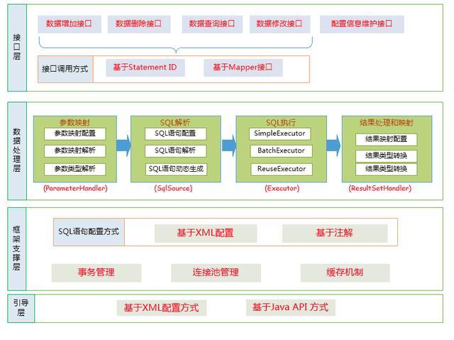
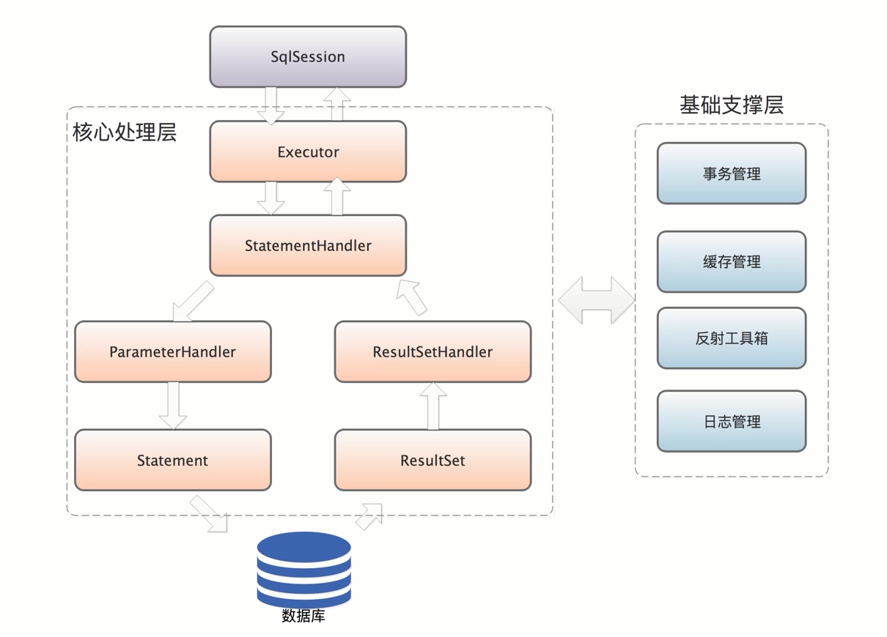
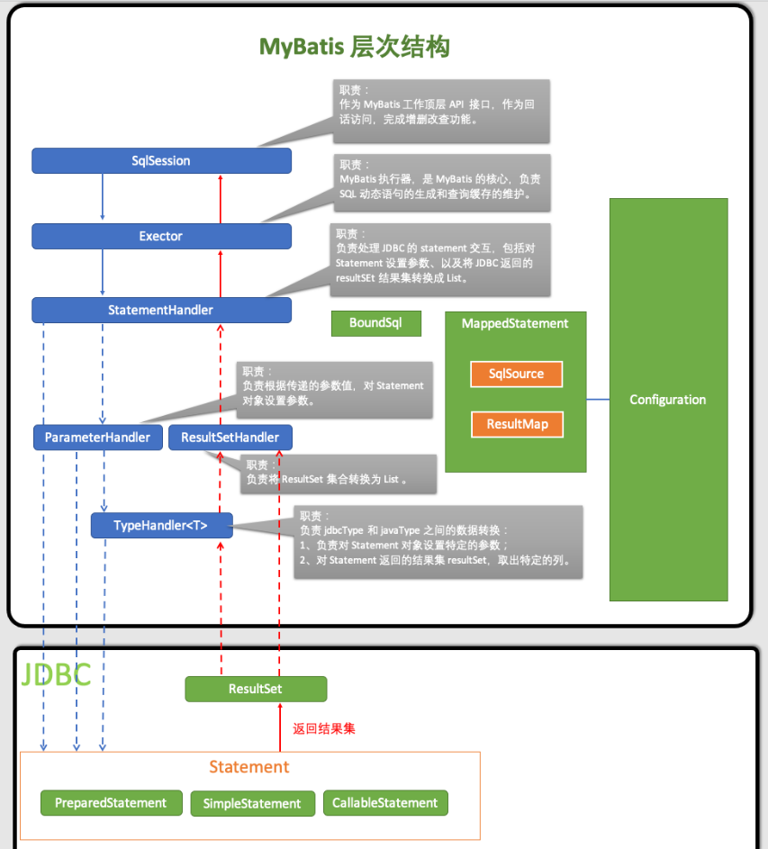
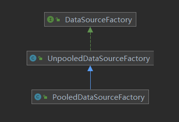

# 架构图

# 总体架构




# 执行顺序



# 层次结构



1. *SqlSession*：作为MyBatis工作的主要顶层API，表示和数据库交互的会话，完成必要数据库增删改查功能
2. *Executor*：MyBatis执行器，是MyBatis 调度的核心，负责SQL语句的生成和查询缓存的维护
3. *StatementHandler*：封装了JDBC Statement操作，负责对JDBC statement 的操作，如设置参数、将Statement结果集转换成List集合
4. *ParameterHandler*：负责对用户传递的参数转换成JDBC Statement 所需要的参数
5. *ResultSetHandler*：负责将JDBC返回的ResultSet结果集对象转换成List类型的集合
6. *TypeHandler*： 
7. *MappedStatement*：MappedStatement维护了一条<select|update|delete|insert>节点的封装
8. *SqlSource*：负责根据用户传递的parameterObject，动态地生成SQL语句，将信息封装到BoundSql对象中，并返回
9. *BoundSql*：表示动态生成的SQL语句以及相应的参数信息
10. *Configuration*：MyBatis所有的配置信息都维持在Configuration对象之中

# 相关反射类

## Reflector

```java
 // 对应的Class 类型 
  private final Class<?> type;
  // 可读属性的名称集合 可读属性就是存在 getter方法的属性，初始值为null
  private final String[] readablePropertyNames;
  // 可写属性的名称集合 可写属性就是存在 setter方法的属性，初始值为null
  private final String[] writablePropertyNames;
  // 记录了属性相应的setter方法，key是属性名称，value是Invoker方法
  // 他是对setter方法对应Method对象的封装
  private final Map<String, Invoker> setMethods = new HashMap<>();
  // 属性相应的getter方法
  private final Map<String, Invoker> getMethods = new HashMap<>();
  // 记录了相应setter方法的参数类型，key是属性名称 value是setter方法的参数类型
  private final Map<String, Class<?>> setTypes = new HashMap<>();
  // 和上面的对应
  private final Map<String, Class<?>> getTypes = new HashMap<>();
  // 记录了默认的构造方法
  private Constructor<?> defaultConstructor;
  // 记录了所有属性名称的集合
  private Map<String, String> caseInsensitivePropertyMap = new HashMap<>();
```

## ReflectorFactory

```java
public interface ReflectorFactory {
  // 检测该ReflectorFactory是否缓存了Reflector对象
  boolean isClassCacheEnabled();
  // 设置是否缓存Reflector对象
  void setClassCacheEnabled(boolean classCacheEnabled);
  // 创建指定了Class的Reflector对象
  Reflector findForClass(Class<?> type);
}
```

## 调用示例

```java
ReflectorFactory factory = new DefaultReflectorFactory();
Reflector reflector = factory.findForClass(Student.class);
System.out.println("可读属性:"+Arrays.toString(reflector.getGetablePropertyNames()));
System.out.println("可写属性:"+Arrays.toString(reflector.getSetablePropertyNames()));
System.out.println("是否具有默认的构造器:" + reflector.hasDefaultConstructor());
System.out.println("Reflector对应的Class:" + reflector.getType());
```

# 解析过程
## 描述

1.获取sessionFactory

2.获取session

3.对namespace+id的xml进行sql操作

4.一个sqlsession代表与数据库交互的一次会话，由它操作数据库，其实他的底层就是connection，它是非线程安全的，用完则关闭

5 mybatis-config.xml是全局配置文件，包含了数据库连接池信息，事务管理器等，它也可以不用配置文件方式，直接用对象的方式进行设置

```java
@Test
public void test1() throws Exception{
    //获取sessionfactory
    String resource = "mybatis-config.xml";
    InputStream inputStream = Resources.getResourceAsStream(resource);
    SqlSessionFactory sqlSessionFactory = new SqlSessionFactoryBuilder().build(inputStream);

    SqlSession session = sqlSessionFactory.openSession();
    try {
        User user = session.selectOne("org.mybatis.example.UserMapper.selectUser", 1);
        System.out.println(user.toString());
    } finally {
        session.close();
    }
}
```

## 源码解析

初始化SqlSessionFactory所做的事

- 获取xml的配置的流
- 进入build方法 -->XMLConfigBuilder构造方法-->XPathParser方法-->createDocument构造方法

- 采用DocumentBuilderFactory解析xml获取Document
- 调用org.apache.ibatis.builder.xml.XMLConfigBuilder#parse方法， 从xml中获取配置信息和sql
- 获取xml中配置的Mapper,将mapper的namespace的class当成是MapperRegistry的里面的map的key


# 属性解析工具

## PropertyTokenizer

将属性表达式解析为Bean的字段

## PropertyCopier

类似beancopy

## MetaClass

封装的是Class元信息

## objectWrapper

封装的则是对象元信息

# 类型转换

## 配置方式

1、通过 <package> 配置 多个 typeHandler所在的包路径，通过扫包的方式批量设置

2、通过 <typeHandler> 标签，一个一个进行 typeHandler 配置

## TypeHandlerRegistry

`TypeHandlerRegistry` 类型处理器注册表注册了类型转换时需要用到的各种处理器以及与Java类型和Jdbc类型的映射关系。

```java
private <T> void register(Type javaType, TypeHandler<? extends T> typeHandler) {
    // 从处理器定义中获取 @MappedJdbcTypes 的标注
    MappedJdbcTypes mappedJdbcTypes = typeHandler.getClass().getAnnotation(MappedJdbcTypes.class);
    if (mappedJdbcTypes != null) {
        // 解析注解中定义的 JdbcType 并注册
        for (JdbcType handledJdbcType : mappedJdbcTypes.value()) {
            register(javaType, handledJdbcType, typeHandler);
        }
        // 注解中还声明要注册一个 null 的 JdbcType
        if (mappedJdbcTypes.includeNullJdbcType()) {
            register(javaType, null, typeHandler);
        }
    } else {
        //没有解析到 JdbcType，直接注册一个 null 的 JdbcType
        register(javaType, null, typeHandler);
    }
}
```

如果使用包扫描注册用户自定义处理器，需要配合使用注解 `@MappedTypes`、`@MappedJdbcTypes`，分别指定要注册的 Java 类型和 Jdbc 类型。

- 若只用了 `@MappedTypes`，则注册进去的 Java 类型为 null
- 若只用了 `@MappedJdbcTypes`，则注册进去的 Jdbc 类型为 null

# 日志模块

## BaseJdbcLogger


## ResultSetLogger

# 数据源

## DataSource

是java 所有的数据源实现的接口，mybatis的数据源（PooledDataSource/数据库连接池缓存，UnpooledDataSource）也要实现这个接口

两个数据源通过工厂类创建



以后有新的数据源，只需实现mybatis提供的<b id="blue">DataSourceFactory</b>接口即可

## 数据库连接池时几种特殊场景

1. 如果连接池中维护的总连接数达到上限，且所有连接都已经被调用方占用，则后续获取数据库连接的线程将会被阻塞（进入阻塞队列中等待)，直至连接池中出现可用的数据库连接，这个可用的连接是由其他使用方释放得到的
2. 如果连接池中空闲连接数达到了配置上限，则后续返回到池中的空闲连接不会进入连接池缓存，而是直接关闭释放掉，这主要是为了减少维护空闲数据库连接带来的压力，同时减少数据库的资源开销

# Mapper

## MapperRegistry

MapperRegistry用于将所有的mapper接口添加到内存中

- MapperRegistry#config
- MapperRegistry#knownMappers
  - 维护了所有解析到的Mapper接口以及MapperProxyFactory 工厂对象之间的映射关系


```
在调用XXXMapper.xx()方法的时候，
MyBatis 会先从MapperRegistry中获取XXXMapper接口的代理对象这里就使用到MapperRegistry.getMapper()方法

```

## MapperProxy

一个包装类,本身不做任何事情,它最主要的作用就是维系着<Method,MapperMethod>集合,这样mapper接口就知道即将执行的是哪种SQL语句了,然后委托给Sqlsession进行查询了

## SqlCommand#resolveMappedStatement

返回对应的解析好的sql定义相关

```java
private MappedStatement resolveMappedStatement(Class<?> mapperInterface, String methodName, Class<?> declaringClass,
                                               Configuration configuration) {
    //将Mapper接口名称和方法名称拼接起来作为sQL语句唯一标识
    String statementId = mapperInterface.getName() + "." + methodName;
    if (configuration.hasStatement(statementId)) {
        //检测configuration中是否包含相应的Mappedstatement对象
        return configuration.getMappedStatement(statementId);
    }
    if (mapperInterface.equals(declaringClass)) {
        return null;
    }
    for (Class<?> superInterface : mapperInterface.getInterfaces()) {
        if (declaringClass.isAssignableFrom(superInterface)) {
            MappedStatement ms = resolveMappedStatement(superInterface, methodName, declaringClass, configuration);
            if (ms != null) {
                return ms;
            }
        }
    }
    return null;
}
}
```

## MapperMethod.MethodSignature


-  paramNameResolver：通过@Param注解指定一个参数名称，如果没有特别指定，则默认使用参数列表中的变量名称作为其名称


```java
  public Object getNamedParams(Object[] args) {
    final int paramCount = names.size();
    if (args == null || paramCount == 0) {
      return null;
    }
    if (!hasParamAnnotation && paramCount == 1) {
      Object value = args[names.firstKey()];
      return wrapToMapIfCollection(value, useActualParamName ? names.get(names.firstKey()) : null);
    } else {
      final Map<String, Object> param = new ParamMap<>();
      int i = 0;
      for (Map.Entry<Integer, String> entry : names.entrySet()) {
        param.put(entry.getValue(), args[entry.getKey()]);
        // add generic param names (param1, param2, ...)
        final String genericParamName = GENERIC_NAME_PREFIX + (i + 1);
        // ensure not to overwrite parameter named with @Param
        if (!names.containsValue(genericParamName)) {
          param.put(genericParamName, args[entry.getKey()]);
        }
        i++;
      }
      return param;
    }
  }
```

# BaseBuilder


# 解析流程

1. XMLConfigBuilder#parse方法触发了mybatis-config.xml配置文件的解析