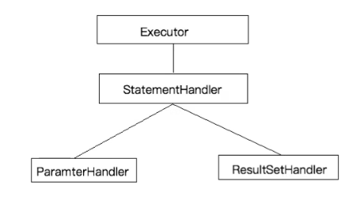

# 四大接口



> Executor
>
> `执行器Executor (update、query. commit、rollback等方法)`


> StatementHandler
>
> `SQL语法构建器StatementHandler (prepare、parameterize、batch、update、query等方法)`


> ResultSetHandler
>
> `参数处理器ParameterHandler (getParameterObject、setParameters方法)`


> ParameterHandler
>
> `结果集处理器ResultSetHandler (handleResultSets、handleOutputParameters等方法)`

# 原理

在四大对象创建的时候：

- 每个创建出来的对象不是直接返回的，而是interceptorChain.pluginAll(parameterHandler);
- 获取到所有的Interceptor（拦截器）（插件需要实现的接口）调用interceptor.plugin(target);返回target包装后的对象
- 插件机制，我们可以使用插件为目标对象创建一个代理对象；AOP（面向切面），我们的插件可以为四大对象创建出代理对象；代理对象就可以拦截到四大对象的每一个执行；

# 插件示例

1. *创建插件类*

```java
/**
 * type:拦截的接口
 * method:拦截的方法，可以到type(StatementHandler)中寻找
 * args：方法的参数
 *
 * @author lao xiao
 * @create 2022年06月07日 21:15:00
 */
@Intercepts({
        @Signature(type= StatementHandler.class,
                method="parameterize",
                args=java.sql.Statement.class)
        })
public class MyFirstPlugin implements Interceptor {

    /**
     * 拦截方法：只要被拦截的目标对象执行，就会执行这个方法
     * @param invocation
     * @return
     * @throws Throwable
     */
    @Override
    public Object intercept(Invocation invocation) throws Throwable {
        System.out.println("MyFirstPlugin...intercept:"+invocation.getMethod());
        //动态的改变一下sql运行的参数：以前1号员工，实际从数据库查询3号员工
        //获取拦截到的目标对象
        Object target = invocation.getTarget();
        System.out.println("当前拦截到的对象："+target);
        //拿到：StatementHandler==>ParameterHandler===>parameterObject
        //拿到target的元数据（它可以拿到StatementHandler里面的属性值）
        MetaObject metaObject = SystemMetaObject.forObject(target);
        Object value = metaObject.getValue("parameterHandler.parameterObject");
        System.out.println("sql语句用的参数是："+value);
        //修改完sql语句要用的参数
        metaObject.setValue("parameterHandler.parameterObject", 11);
        //执行目标方法（这里一定要注意）
        Object proceed = invocation.proceed();
        //返回执行后的返回值
        return proceed;
    }

    /**
     * 把当前拦截器类生成代理，存入拦截器链中
     * @param target
     * @return
     */
    @Override
    public Object plugin(Object target) {
        //我们可以借助Plugin的wrap方法来使用当前Interceptor包装我们目标对象
        System.out.println("MyFirstPlugin...plugin:mybatis将要包装的对象"+target);
        Object wrap = Plugin.wrap(target, this);
        //返回为当前target创建的动态代理
        return wrap;
    }

    /**
     * 获取配置文件的参数
     * @param properties
     */
    @Override
    public void setProperties(Properties properties) {
        System.out.println("插件配置的信息："+properties);
    }
}
```

2. *配置插件类*

```xml
<plugins>
	<plugin interceptor="com.atguigu.mybatis.dao.MyFirstPlugin">
			<property name="username" value="root"/>
			<property name="password" value="123456"/>
	</plugin>
</plugins>
```


