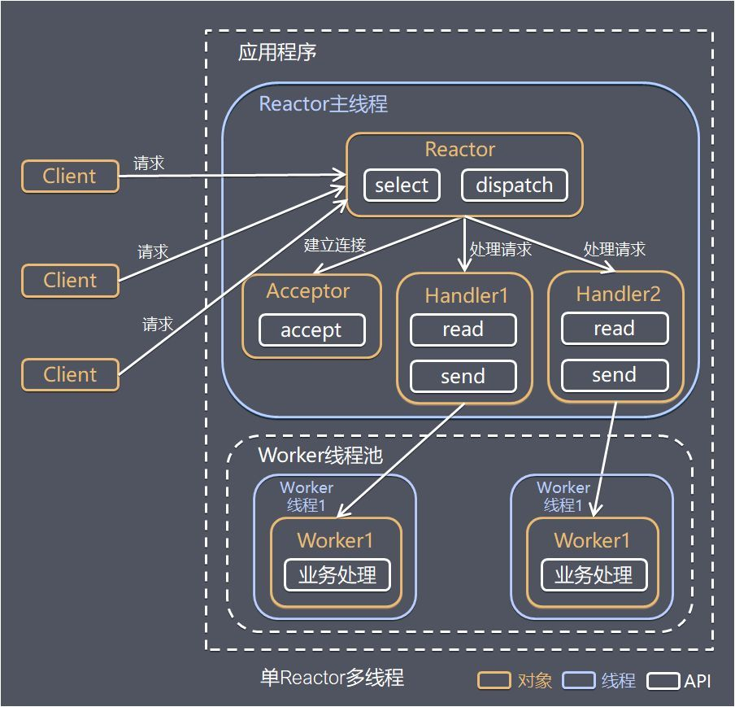
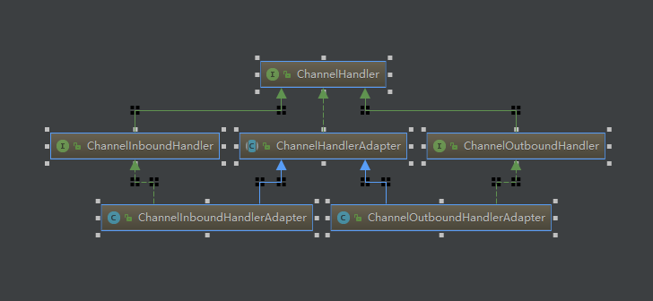
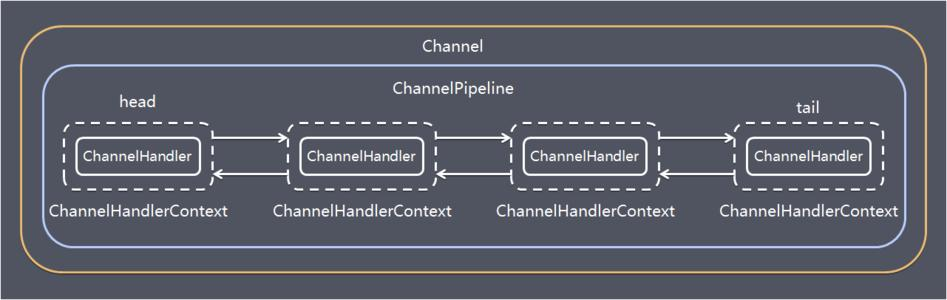

# NIO编程

## 无selector示例

- 可以看到，accept是阻塞的，read也是阻塞的
- 如果没有selector的配置，那么线程会一直阻塞，知道有连接产生，有数据发送

```java
ByteBuffer buffer = ByteBuffer.allocate(16);
try (ServerSocketChannel socketChannel = ServerSocketChannel.open();) {
    socketChannel.bind(new InetSocketAddress(80));
    while (true) {
        log.debug("连接中....");
        //连接的过程中是阻塞的，只有有连接了才会进行下一步操作
        SocketChannel channel = socketChannel.accept();
        log.debug("连接完成");
        //read的过程也是阻塞的
        channel.read(buffer);
        buffer.flip();
        log.debug("获取到客户端数据: {}", new String(buffer.array()));
        buffer.clear();
    }
} catch (Exception e) {
}
```

## 非阻塞模式

- 当没有连接时，socketChannel.accept()返回为null
- read方法也变成非阻塞的，只有i>0时，表示有数据读取

```java
socketChannel.configureBlocking(false);
while (true) {
    SocketChannel channel = socketChannel.accept();
    int i = channel.read(buffer);
```

- 非阻塞的缺点：没有连接和数据传输，也一直在循环

## NIO网络编程原理

- 客户端连接，通过serversocketChannel 得到 socketChannel
- socketChannel注册到selector上


- NIO server


## NIO和BIO比较

- NIO 以块的方式处理数据，BIO以流的方式处理

# NIO多线程版 

# Netty介绍

netty是一个基于异步的，基于事件的网络应用框架

- 基于一个事件，这个事件可能是连接，或者断开,然后寻找对应的方法做对应的事情
- 异步：在服务器操作一些事情的时候，客户端不等待。等服务器有响应的时候进行回调

# Netty设计

## 线程模型

- 传统阻塞IO模型
  - 每个客户端都创建线程请求
  - 当服务器端的数据没有可读时，处于阻塞状态
  - 当并发数越大，服务器端线程越多


- Reactor模式

Reactor模式是处理并发I/O常见的一种模式，用于同步I/O，其中心思想是将所有要处理的I/O事件注册到一个中心I/O多路复用器上，同时主线程阻塞在多路复用器上，一旦有I/O事件到来或是准备就绪，多路复用器将返回并将相应 `I/O`事件分发到对应的处理器中

- 单reactor单线程


- 单reactor多线程
  - reactor监控客户端请求
  - 发生连接，穿件一个handler
  - 如果不是连接，则reactor分发连接对应的handler
  - handler只负责响应，不做业务处理
  - worker线程池分配独立线程池完成真正的业务,并将结果返回handler



- 主从reactor多线程
  - 可以让reactor在多线程中运行
  - **main负责连接，sub负责其他**
  - Reactor 主线程 MainReactor 对象通过 Select 监控建立连接事件，收到事件后通过 Acceptor 接收，处理建立连接事件。
  - Acceptor 处理建立连接事件后，MainReactor 将连接分配 Reactor 子线程给 SubReactor 进行处理。
  - SubReactor 将连接加入连接队列进行监听，并创建一个 Handler 用于处理各种连接事件。
  - 当有新的事件发生时，SubReactor 会调用连接对应的 Handler 进行响应。
  - 一个mian可以管理多个sub


## Netty模型

### 简单版

- BossGroup 线程维护Selector, 只关注Accecpt。
- 当接收到Accept事件，获取到对应的SocketChannel, 封装成 NIOScoketChannel并注册到Worker 线程(事件循环), 并进行维护。
- 当Worker线程监听到selector 中通道发生自己感兴趣的事件后，就进行处理(就由handler)， 注意handler 已经加入到通道。


### 详细版

- 两组group，这两个group都属于NIOEventLoopGroup
  - boss  负责客户端连接
  - worker  负责网络读写
- NIOEventLoop表示不断循环的执行处理任务的 线程, 每个NIOEventLoopGroup都有一个Selector，同于监听其绑定的socket网络通道（channel）
- NIOEventLoopGroup可以有多个NIOEventLoop（多个线程）
- 处理业务时，会使用pipeline


## TCP代码

- 服务器端

```java
public static void main(String[] args) throws InterruptedException {
    //管理连接
    EventLoopGroup bossGroup = new NioEventLoopGroup();
    EventLoopGroup workGroup = new NioEventLoopGroup();

    //服务器启动对象
    ServerBootstrap bootstrap = new ServerBootstrap();
    //设置两个线程组
    bootstrap.group(bossGroup, workGroup)
            //选择通道类型
            .channel(NioServerSocketChannel.class)
            //设置线程队列得到的连接数
            .option(ChannelOption.SO_BACKLOG, 128)
            //保持活动连接状态
            .childOption(ChannelOption.SO_KEEPALIVE, true)
            //设置一个处理事情的工作handler
        	//ChannelInitializer负责添加别的handler
            .childHandler(new ChannelInitializer<SocketChannel>() {
                @Override
                protected void initChannel(SocketChannel socketChannel) throws Exception {
                    socketChannel.pipeline().addLast(new NettyServerHandler());
                }
            });
    //绑定一个端口并且同步
    ChannelFuture sync = bootstrap.bind(6666).sync();
    //对关闭通道进行监听
    sync.channel().closeFuture().sync();
}
```

- 服务器端业务处理

```java
public class NettyServerHandler extends ChannelInboundHandlerAdapter {


    /**
     * 从客户端读取数据
     * @param ctx 上下文，含pipeline，channel, 客户端送的数据
     * @param msg
     * @throws Exception
     */
    @Override
    public void channelRead(ChannelHandlerContext ctx, Object msg) throws Exception {
        System.out.println("客户端地址："+ctx.channel().remoteAddress());
        //msg是一个buf类型
        ByteBuf buf = (ByteBuf) msg;
        System.out.println("客户端发送的消息："+ buf.toString(CharsetUtil.UTF_8));
    }

    /**
     * 读取数据完毕，往客户端发送数据
     * @param ctx
     * @throws Exception
     */
    @Override
    public void channelReadComplete(ChannelHandlerContext ctx) throws Exception {
        //write+flush方法
        //写入缓存，并冲刷
        ctx.writeAndFlush(Unpooled.copiedBuffer("hello : "+ ctx.channel().remoteAddress(), CharsetUtil.UTF_8));
    }
}
```

- 客户端

```java
public static void main(String[] args) throws InterruptedException {
    EventLoopGroup loopGroup = new NioEventLoopGroup();
    try {

        Bootstrap bootstrap = new Bootstrap();
        bootstrap.group(loopGroup)
                .channel(NioSocketChannel.class)
                .handler(new ChannelInitializer<SocketChannel>() {
                    @Override
                    protected void initChannel(SocketChannel socketChannel) throws Exception {
                        socketChannel.pipeline().addLast(new NettyClientHandler());
                    }
                });
        ChannelFuture future = bootstrap.connect("127.0.0.1", 6666).sync();
        future.channel().closeFuture().sync();
    } finally {
        loopGroup.shutdownGracefully();
    }
}
```

- 客户端业务处理

```java
public class NettyClientHandler extends ChannelInboundHandlerAdapter {
    @Override
    public void channelActive(ChannelHandlerContext ctx) throws Exception {
        System.out.println("启动客户端，发送消息....");
        ctx.writeAndFlush(Unpooled.copiedBuffer("hello serve:", CharsetUtil.UTF_8));
    }

    @Override
    public void channelRead(ChannelHandlerContext ctx, Object msg) throws Exception {

        ByteBuf buf = (ByteBuf) msg;
        System.out.println("服务端发送： "+ ctx.channel().remoteAddress() + " : " + buf.toString(CharsetUtil.UTF_8));
    }
}
```

## 执行一个初步流程


## 源码分析

### 工作线程

- workgroup里面的线程分配客户端是循环分配的过程，如果分配满了，又从头开始分配
- LoopGroup使用EventExecutor来管理线程
- group包含多个NioEventLoop

  - NioEventLoop包含一个selector，一个taskqueue
  - 一个selector可以注册多个NioChannel
  - 每个NioChannel只会绑定他对应的selector上（N:1）


### 上下文分析

- 每个context包含一个pipeline和channel
- channel中包含了pipeline


- pipeline本质是一个双向链表（包含head和tail）,也包含了channel

## 异步执行

服务器端中，如果handler中的执行业务时间很久，就会与客户端阻塞

1. 解决方案1：使用eventloop中的taskqueue执行(用户程序自定义的普通任务)

```java
@Override
public void channelRead(ChannelHandlerContext ctx, Object msg) throws Exception {
    ctx.channel().eventLoop().execute(() -> {
        try {
            Thread.sleep(10*1000);
            ctx.writeAndFlush(Unpooled.copiedBuffer("hello1 : "+ ctx.channel().remoteAddress(), CharsetUtil.UTF_8));
        } catch (InterruptedException e) {
            e.printStackTrace();
        }
    });
}
```

2. 解决方案2：用户定时任务（提交到scheduleTaskQueue中执行）

- 新建 runnable 用于执行调度

```java
//延时5秒执行
ctx.channel().eventLoop().schedule(() -> {
    try {
        Thread.sleep(1*1000);
        ctx.writeAndFlush(Unpooled.copiedBuffer("hello1 time : "+ ctx.channel().remoteAddress(), CharsetUtil.UTF_8));
    } catch (InterruptedException e) {
        e.printStackTrace();
    }
}, 5, TimeUnit.SECONDS);
```

3. 解决方案3：非当前Reactor线程调用Channel的各种方法


# Netty核心组件

## 常用组件

### EventLoop

- EventLoop本质是一个单线程执行器（同时维护了一个Selector)，里面有run方法处理Channel上源源不断的io事件。


### EventLoopGroup 

- 时间循环组，一组EventLoop

- NioEventLoopGroup可以处理io事件，普通任务，定时任务

- NioEventLoopGroup默认的子线程线程数是：cpu核心数*2，new NioEventLoopGroup构造方法默认使用了NettyRuntime.availableProcessors() * 2

  如果构造参数有值，则使用构造参数的线程数,


- **不过我们一般bossGroup设置为1个**
- 获取下一个eventLoop

```java
EventLoopGroup workGroup = new NioEventLoopGroup();
EventLoop eventLoop = workGroup.next();
```

- 执行一个普通任务

```java
NioEventLoopGroup executors = new NioEventLoopGroup();
executors.next().submit(() -> {
    System.out.println(Thread.currentThread().getId());
});
```

- 执行一个定时任务

```java
executors.next().scheduleAtFixedRate(() -> {
    log.debug("定时任务");
}, 0, 1, TimeUnit.SECONDS);
```

### ServerBootstrap，Bootstrap

1. 意思是引导，一个Netty应用通常由一个Bootstrap开始，主要作用是配置整个Netty程序，串联各个组件，Netty中 Bootstrap类是客户端程序的启动引导类
2. ServerBootstrap是服务端启动引导类

- 用于设置EventLoopGroup

```java
EventLoopGroup bossGroup = new NioEventLoopGroup(1);
EventLoopGroup workGroup = new NioEventLoopGroup();
try {
    ServerBootstrap bootstrap = new ServerBootstrap();
    bootstrap.group(bossGroup, workGroup)
```

- channel:设置服务器端通道的实现

```java
.channel(NioServerSocketChannel.class)
```

- option 给serverchannel添加配置

```java
//设置线程队列得到的连接数
                .option(ChannelOption.SO_BACKLOG, 128)
```

- childHandler: 用于添加workergroup对应的自定义的handler

```java
//设置一个处理事情的工作handler
.childHandler(new ChannelInitializer<SocketChannel>() {
    @Override
    protected void initChannel(SocketChannel socketChannel) throws Exception {
        socketChannel.pipeline().addLast(new NettyServerScheduleHandler()).addLast();
    }
});
```

- handler：添加bossgroup对应的handler

### Channel

- Netty 网络通信的组件，能够用于执行网络I/O操作
- 通过Channel可获得当前网络连接的通道的状态
- 通过Channel可获得网络连接的配置参数（例如接收缓冲区大小)
- Channel提供异步的网络l/О操作(如建立连接，读写，绑定端口)
- channel类型与协议有关

### Selector

- Netty基于Selector对象实现I/O多路复用，通过Selector一个线程可以监听多个连接的Channel事件。
- 当向一个Selector中注册 Channel后，Selector内部的机制就可以自动不断地查询(Select)这些注册的Channel是否有已就绪的l/O事件（例如可读，可写，网络连接完成等)，这样程序就可以很简单地使用一个线程高效地管理多个Channel

### ChannelHandler

- ChannelHandler是一个接口，处理I/O事件或拦截I/О操作，并将其转发到其ChannelPipeline(业务处理链)中的下一个处理程序。

ChannelInboundHandler:负责出站（客户端发送到服务器端）

```tex
//通道就绪事件
ChannelInboundHandlerAdapter#channelActive
//通道读取事件
ChannelInboundHandlerAdapter#channelRead
//读取完成
ChannelInboundHandlerAdapter#channelReadComplete
//通道发生异常
ChannelInboundHandlerAdapter#exceptionCaught
```

ChannelOutboundHandler: 负责入站


- 出站入站的顺序

1. 调用顺序：head -> i1 ->i2 -> o4 -> o3 -> tail

```java
ch.pipeline().addLast("I1",new ChannelInboundHandlerAdapter() {
    @Override
    public void channelRead(ChannelHandlerContext ctx, Object msg) throws Exception {
        log.debug("I1");
        super.channelRead(ctx,msg);
    }
});
ch.pipeline().addLast("I2",new ChannelInboundHandlerAdapter() {
    @Override
    public void channelRead(ChannelHandlerContext ctx, Object msg) throws Exception {
        log.debug("I2");
        super.channelRead(ctx,msg);
        ctx.channel().writeAndFlush(ctx.alloc().buffer().writeBytes("server...".getBytes()));
    }
});
ch.pipeline().addLast("o3",new ChannelOutboundHandlerAdapter() {
    @Override
    public void write(ChannelHandlerContext ctx, Object msg, ChannelPromise promise) throws Exception {
        log.debug("o3");
        super.write(ctx,msg,promise);
    }
});
ch.pipeline().addLast("o4",new ChannelOutboundHandlerAdapter() {
    @Override
    public void write(ChannelHandlerContext ctx, Object msg, ChannelPromise promise) throws Exception {
        log.debug("o4");
        super.write(ctx,msg,promise);
    }
});
```

- super.channelRead(ctx,msg);表示将数据处理好后，交给下一个入站处理器
- out通道中，必须要有数据，才会触发

- writeAndFlush的调用方式不同，则处理结果也不同，如：

1. ctx调用，他是从当前节点往前找有没有出站handler
   1. 假如代码顺序是： i1 -> o3 -> i2 ->o4，则此时，I2往前调用用，只发现了o3是out可以调用

```java
log.debug("I2");
super.channelRead(ctx,msg);
ctx.writeAndFlush(ctx.alloc().buffer().writeBytes("server...".getBytes()));
```

2. channel调用，则是tail节点往前推送，发现out则调用

### 测试Handller

- 在开发中，启动服务端很耗时，可以借助netty提供的工具来测试handler的出站和入站

```java
EmbeddedChannel embeddedChannel = new EmbeddedChannel(i1, i2, o3, o4);
//测试入站操作
embeddedChannel.writeInbound(ByteBufAllocator.DEFAULT.buffer().writeBytes("hello".getBytes()));
//测试出站
embeddedChannel.writeOutbound(ByteBufAllocator.DEFAULT.buffer().writeBytes("hello".getBytes()));
```

### 线程安全的Handller

- netty在他内置的handler里标记了一个注解，表示这个handler是可以共享的

如：

```java
@Sharable
public class LoggingHandler
```

### PipeLine

ChannelPipeline：

- 也可以这样理解:ChannelPipeline是保存ChannelHandler的 List，用于处理或拦截Channel的入站事件和出站操作

pipeline是一个包含头和尾的类似双向链表



### ChannelHandlerContext

- ChannelHandlerContext中包含一个具体的事件处理器ChannelHandler ,同时ChannelHandlerContext中也绑定了对应的 pipeline和 Channel的信息，方便对ChannelHandler进行调用

```tex
### 
ChannelOutboundInvoker#write(java.lang.Object)
###
ChannelOutboundInvoker#flush
```

### ChannelOption

- ChannelOption.SO_BACKLOG
  - 对应TCP/IP协议listen函数中的backlog 参数，用来初始化服务器可连接队列大小。服务端处理客户端连接请求是顺序处理的，所以同一时间只能处理一个客户端连接。多个客户端来的时候，服务端将不能处理的客户端连接请求放在队列中等待处理，backlog 参数指定了队列的大小。
- ChannelOption.SO_KEEPALIVE
  - 一直保持连接活动状态

## EventLoop详解

- 每个EventLoopGroup会对应一个Selector
- 通常是OP_ACCEPT事件，然后将接收到的SocketChannel交给WorkerEventLoopGroup
- WorkerEventLoopGroup会由next选择其中一个EventLoopGroup来将这个SocketChannel注册到其维护的Selector并对其后续的IO事件进行处理


- 当客户端的一个channel和服务端的EventLoop建立绑定，那么，服务器处理这个channel的EventLoop则一直是同一个
- boss EventLoop只会ServerSocketChannel绑定

### 额外的线程组处理业务

- 有时候，一个handler执行的业务时间特别长，这时，肯定会影响同一个EventLoop的其他channel的工作，此时，我们需要将此业务放入一个非IO的EventLoop中，防止它影响其他channel的使用
- 如下，我们造DefaultEventLoopGroup一个线程组，让handler2在其上执行，注意，需要调用ctx.fireChannelRead(msg);将消息传递这个里面

```java
//非IO的线程组
EventLoopGroup defaultEventLoop = new DefaultEventLoopGroup();
new ServerBootstrap()
        .group(new NioEventLoopGroup(1), new NioEventLoopGroup())
        .channel(NioServerSocketChannel.class)
        .childHandler(new ChannelInitializer<NioSocketChannel>() {
            @Override
            protected void initChannel(NioSocketChannel ch) throws Exception {
                ch.pipeline().addLast("handler1",new ChannelInboundHandlerAdapter() {
                    @Override
                    public void channelRead(ChannelHandlerContext ctx, Object msg) throws Exception {
                        log.debug("handler1 进入 : {}", Thread.currentThread().getName());
                        //将消息传递给下一个handler
                        ctx.fireChannelRead(msg);
                    }
                });
                ch.pipeline().addLast(defaultEventLoop, "handler2", new ChannelInboundHandlerAdapter() {
                    @Override
                    public void channelRead(ChannelHandlerContext ctx, Object msg) throws Exception {
                        log.debug("handler2 是个很长的业务 {}", Thread.currentThread().getName());
                    }
                });
            }
        }).bind(80);
```


## 异步模型

- Netty的异步模型是建立在future上的
- 异步过程，调用者不能马上获取结果，等处理组件处理完后，通过状态、通知、回调来通知调用者
- Netty中的I/O操作是异步的，包括Bind、Write、Connect等操作会简单的返回一个ChannelFuture.
- Netty的异步模型是建立在future和 callback的之上的。
- ChannelFuture是一个接口，我们可以在此添加监听器

例如：添加一个监听，判断是否绑定端口成功

```java
//绑定一个端口并且同步
ChannelFuture sync = bootstrap.bind(6666).sync();
sync.addListener((future) -> {
    if(future.isSuccess()) {
        System.out.println("绑定端口 6666 成功....");
    }
});
```

### Connect说明

- 这段代码是异步非阻塞的
- main线程调用，真正去建立连接的是NIO相关的线程

```java
bootstrap.connect("127.0.0.1", 80)
```

- sync表示，mian线程等待nio线程建立连接后，返回结果

```java
bootstrap.connect("127.0.0.1", 80).sync()
```

- 如果不想使用sync的方式获取channel，亦可以采用监听的方式

```java
ChannelFuture future = bootstrap.connect("127.0.0.1", 80);
future.addListener(new ChannelFutureListener() {
    @Override
    public void operationComplete(ChannelFuture future) throws Exception {
        Channel channel = future.channel();
        log.debug("channel：{}", channel);
        channel.writeAndFlush("我是监听发过来的");
    }
});
```

1. 


# ByteBuf

- 创建

```java
//创建初始容量为10
ByteBuf buffer = ByteBufAllocator.DEFAULT.buffer(10);
```

- 直接内存 vs 堆内存

```java
ByteBuf buffer = ByteBufAllocator.DEFAULT.heapBuffer(10);
//默认使用的直接内存
ByteBuf buffer = ByteBufAllocator.DEFAULT.directBuffer(10);
```

## 池化功能

- 池化的最大意义在于可以重用 ByteBuf（有点类似连接池的思想）

- 池化功能是否开启，可以通过下面的系统环境变量来设置

  ```java
  -Dio.netty.allocator.type={unpooled|pooled}
  ```

- 4.1 以后，非 Android 平台默认启用池化实现，Android 平台启用非池化实现

- 4.1 之前，池化功能还不成熟，默认是非池化实现


## 扩容

再写入一个 int 整数时，容量不够了（初始容量是 10），这时会引发扩容

```java
buffer.writeInt(6);
log(buffer);
```

扩容规则是

* 如何写入后数据大小未超过 512，则选择下一个 16 的整数倍，例如写入后大小为 12 ，则扩容后 capacity 是 16
* 如果写入后数据大小超过 512，则选择下一个 2^n，例如写入后大小为 513，则扩容后 capacity 是 2^10=1024（2^9=512 已经不够了）
* 扩容不能超过 max capacity 会报错


## Unpooled 

- 提供了非池化的 ByteBuf 创建、组合、复制等操作

- 通过两个指针，readerIndex与writerIndex分别指向已经读到的位置和写入的位置，比JDK提供的ByteBuffer 省了flip操作

```java
//创建一个buff长度为10的对象
ByteBuf buffer = Unpooled.buffer(10);
//插入数据
Stream.iterate(0, i -> i+1)
        .limit(10)
        .forEach(buffer::writeByte);
for(int i=0; i<buffer.capacity(); i++) {
    System.out.println(buffer.getByte(i));
}
```

- readerindex---writerIndex , 可读的区域
- writerIndex -- capacity,可写的区域

### Unpooled相关Api

```tex
## 创建一个buff
Unpooled#copiedBuffer(byte[])
## 返回当前数组内容
ByteBuf#array
```

## ByteBuf 优势

* 池化 - 可以重用池中 ByteBuf 实例，更节约内存，减少内存溢出的可能
* 读写指针分离，不需要像 ByteBuffer 一样切换读写模式
* 可以自动扩容
* 支持链式调用，使用更流畅
* 很多地方体现零拷贝，例如 slice、duplicate、CompositeByteBuf

# Netty中的零拷贝

## slice

对原始 ByteBuf 进行切片成多个 ByteBuf，切片后的 ByteBuf 并没有发生内存复制，还是使用原始 ByteBuf 的内存

- 此时，buf1/buf2和buf是同一内存，所以，修改buf1的值会影响buf的值
- 切片后的对象容量不允许再添加，也就是buf1/buf2不能扩容

```java
ByteBuf buf = ByteBufAllocator.DEFAULT.buffer(6);
buf.writeBytes(new byte[] {'a', 'b', 'c', 'd', 'e', 'f'});
//采用切片的方式
ByteBuf buf1 = buf.slice(0, 3);
ByteBuf buf2 = buf.slice(3, 3);
```

- 切片后，buf调用release回收内存会有影响，配合buf1.retain则buf.release不会报错，这样buf1/buf2和buf都需要调用release方法进行回收

## CompositeByteBuf

- 将小的bytebuf合并成新的bytebuf

```java
ByteBuf buf1 = ByteBufAllocator.DEFAULT.buffer(5);
buf1.writeBytes(new byte[]{1, 2, 3, 4, 5});
ByteBuf buf2 = ByteBufAllocator.DEFAULT.buffer(5);
buf2.writeBytes(new byte[]{6, 7, 8, 9, 10});

CompositeByteBuf buf3 = ByteBufAllocator.DEFAULT.compositeBuffer();
// true 表示增加新的 ByteBuf 自动递增 write index, 否则 write index 会始终为 0
buf3.addComponents(true, buf1, buf2);
```


# 心跳机制

## 空闲检测

IdleStateHandler是netty处理空闲状态的处理器(用来判断读和写的空闲时间太长)

- readerIdleTime:多久时间没读，发送一个心跳检测包，是否连接
- writerIdleTime：多久时间没写，发送一个心跳检测包
- allIdleTime：多久时间没有读写

如果上面的三个条件达到，则会触发相应的事件，所以，我们需要创建一个双向的handler（入站和出站处理器）

```java
EventLoopGroup bossGroup = new NioEventLoopGroup(1);
EventLoopGroup workGroup = new NioEventLoopGroup();
try {

    ServerBootstrap bootstrap = new ServerBootstrap();
    bootstrap.group(bossGroup, workGroup)
            .channel(NioServerSocketChannel.class)
            .handler(new LoggingHandler(LogLevel.INFO))
            .childHandler(new ChannelInitializer<SocketChannel>() {
                @Override
                protected void initChannel(SocketChannel ch) throws Exception {
                    ChannelPipeline pipeline = ch.pipeline();
                    //在pipeline中 加入解码器
                    pipeline.addLast(new IdleStateHandler(3,5,7, TimeUnit.SECONDS));
                    pipeline.addLast(new IdleStateServerHandler());
                }
            });
    log.debug("==>聊天服务器端启动");
    ChannelFuture sync = bootstrap.bind(this.port).sync();
    sync.channel().closeFuture().sync();
} finally {
    bossGroup.shutdownGracefully();
    workGroup.shutdownGracefully();
}
```

```java
public class IdleStateServerHandler extends ChannelInboundHandlerAdapter {
    /**
     *
     * @param ctx 上下文
     * @param evt 事件
     * @throws Exception
     */
    @Override
    public void userEventTriggered(ChannelHandlerContext ctx, Object evt) throws Exception {
        //如果是心跳检测机制
        if(evt instanceof IdleStateEvent ) {
            IdleStateEvent event = (IdleStateEvent) evt;
            String msg = null;
            switch (event.state()) {
                case ALL_IDLE:
                    msg = "读写空闲";
                    break;
                case READER_IDLE:
                    msg = "读空闲";
                    break;
                case WRITER_IDLE:
                    msg = "写空闲";
                    break;
            }
            log.info(msg);
        }
    }
}
```

## 心跳数据包

- 一般写的空闲时间要比读的空闲时间少2-3秒
- 隔了一定时间没有写数据，发送一个心跳包给客户端

# websorcket

- websocket数据以 帧frame传输

```java
EventLoopGroup bossGroup = new NioEventLoopGroup(1);
EventLoopGroup workGroup = new NioEventLoopGroup();
try {

    ServerBootstrap bootstrap = new ServerBootstrap();
    bootstrap.group(bossGroup, workGroup)
            .channel(NioServerSocketChannel.class)
            .handler(new LoggingHandler(LogLevel.INFO))
            .childHandler(new ChannelInitializer<SocketChannel>() {
                @Override
                protected void initChannel(SocketChannel ch) throws Exception {
                    ChannelPipeline pipeline = ch.pipeline();
                    //使用http解码和编码
                    pipeline.addLast(new HttpServerCodec());
                    //以块方式进行读写
                    pipeline.addLast(new ChunkedWriteHandler());
                    //http传输是分段的，HttpObjectAggregator多段聚合
                    //所以在http传输中，大量数据会有多个http请求
                    pipeline.addLast(new HttpObjectAggregator(8192));
                    // 浏览器访问 ws://127.0.0.1/hello
                    //WebSocketServerProtocolHandler 将http升级 为 websocket
                    pipeline.addLast(new WebSocketServerProtocolHandler("/hello"));
                    //以文本帧的方式进行处理
                    pipeline.addLast(new TextWebSocketFrameHandler());

                }
            });
    log.debug("===>服务器端启动");
    ChannelFuture sync = bootstrap.bind(this.port).sync();
    sync.channel().closeFuture().sync();
} finally {
    bossGroup.shutdownGracefully();
    workGroup.shutdownGracefully();
}
```

# 编解码

## Protobuf

- 支持跨平台夸语言的编解码
- 很时候RPC或者数据存储

## 生成代码

- 引入pom

```xml
<dependency>
    <groupId>com.google.protobuf</groupId>
    <artifactId>protobuf-java</artifactId>
    <version>3.4.0</version>
</dependency>
```

- 下载生成客户端工具

[https://github.com/protocolbuffers/protobuf/releases](https://github.com/protocolbuffers/protobuf/releases)

# netty出站入站机制

- channelPipeline 提供了 channelhandler链的容器
- 写入 socket叫 出站，读socket叫入站
- netty发送或者 接受一个消息，会发生一次解码、编码
- 出站 需要 编码，  入站 需要解码


## 解码器

- ByteToMessageCodec

由于不可能知道远程节点是否会一次性发送完整的信息，所有tcp可能会出现粘包拆包问题，这个类会对入站数据进行缓冲，知道他完全被处理好


举例：

有个int类型的解码器

重写decode方法，socket发送两个int数据，入站解码开始解码，读到四个字节就将其转化为int放入list中，直到全部读完

然后丢给下一个handler执行


# TCP粘包拆包

TCP是面向连接的，面向流的，提供高可靠性服务。收发两端（客户端和服务器端）都要有一一成对的socket，因此，发送端为了将多个发给接收端的包，更有效的发给对方，使用了优化方法（Nagle算法），将多次间隔较小且数据量小的数据，合并成一个大的数据块，然后进行封包。这样做虽然提高了效率，但是接收端就难于分辨出完整的数据包了，因为面向流的通信是无消息保护边界的

- 因为TCP的消息是有应答的，所以每次消息发出都会要有响应，这样带来了吞吐量的问题
- 所以TCP将详细封装成一个大的数据块，发给服务器端（Nagle算法）
- TCP的滑动窗口也会造成这个现象

## 基本介绍

- 服务端分别收到了D1和D2，没有粘包和拆包
- 服务端一次性收到了D1和D2，称为TCP粘包
- 服务端两次读取到了两个数据包，第一次读到了D1的完整部分和D2的部分数据，第二次读到了D2的剩余部分。 这称为TCP拆包
- 服务端两次读取到两个数据包，第一次是D1的部分，第二次是D1的剩余部分和D2的完整部分。


## 解决方案

- 短连接
  - 可以解决粘包问题，不能解决拆包问题

- 定长的消息解码器
  - io.netty.handler.codec.FixedLengthFrameDecoder
  - 需要注意的是，定长一定要客户端发送消息的最大长度
- 分割符解码器 
  - io.netty.handler.codec.LineBasedFrameDecoder
- 基于字段长度（LTC）

  - io.netty.handler.codec.LengthFieldBasedFrameDecoder

# netty源码解析

## netty启动过程

- 先看example下的示例代码

EchoServer
EchoServerHandler
EchoClient
EchoClientHandler

### EchoServer

```java
EventLoopGroup bossGroup = new NioEventLoopGroup(1);
EventLoopGroup workerGroup = new NioEventLoopGroup();
```

bossGroup用于接收TCP请求，他会将请求交给workgroup，workgroup获取真正的连接进行通信

EventLoopGroup是一个时间循环组（线程组）， 含有多个EventLoop

MultithreadEventExecutorGroup
------ MultithreadEventExecutorGroup()方法

```
//创建时间循环组
children = new EventExecutor[nThreads];
```

引导类

```
ServerBootstrap b = new ServerBootstrap();
```

channel方法目的通过反射创建channelFactory

```
b.group(bossGroup, workerGroup)
 .channel(NioServerSocketChannel.class)
```

### EventLoopGroup

## EventLoop组件

- 一个EventLoopGroup 包含一个或者多个EventLoop；
- 一个EventLoop 在它的生命周期内只和一个Thread 绑定；
- 所有由EventLoop 处理的I/O 事件都将在它专有的Thread 上被处理；
- 一个Channel 在它的生命周期内只注册于一个EventLoop；
- 一个EventLoop 可能会被分配给一个或多个Channel。

NioEventLoopGroup对象可以理解为一个线程池，内部维护了一组线程，每个线程负责处理多个Channel上的事件，而一个Channel只对应于一个线程，这样可以回避多线程下的数据同步问题。


# 更换编解码

## Google 的 ProtoBuf
# 搭建Http服务

- SimpleChannelInboundHandler可以快速的过滤msg的类型

```java
public static void main(String[] args) {
    EventLoopGroup bossGroup = new NioEventLoopGroup(1);
    EventLoopGroup workGroup = new NioEventLoopGroup();
    try {
        ServerBootstrap bootstrap = new ServerBootstrap();
        bootstrap.group(bossGroup, workGroup)
                .channel(NioServerSocketChannel.class)
                .childHandler(new HttpServerInitializer());
        ChannelFuture channelFuture = bootstrap.bind(new InetSocketAddress(6666)).sync();
        channelFuture.channel().closeFuture().sync();
    } catch (Exception e) {

    } finally {
        bossGroup.shutdownGracefully();
        bossGroup.shutdownGracefully();
    }
}
```

```
 * @Description 在某个Channel注册到EventLoop后，对这个Channel执行一些初始化操作
 * @createTime 2020年09月16日 09:23:00
 */
public class HttpServerInitializer extends ChannelInitializer<SocketChannel> {
    /**
     * 向管道加入处理器
     * @param socketChannel
     * @throws Exception
     */
    @Override
    protected void initChannel(SocketChannel socketChannel) throws Exception {
        ChannelPipeline pipeline = socketChannel.pipeline();
        pipeline.addLast("httpServerCodec", new HttpServerCodec());
        pipeline.addLast("httpServerHandler", new HttpServerHandler());
    }
}
```

```java
* @Description HttpObject:客户端与服务器端通讯的工具封装成：HttpObject
 * @createTime 2020年09月16日 09:38:00
 */
@Slf4j
public class HttpServerHandler extends SimpleChannelInboundHandler<HttpObject> {

    /**
     * 读取数据
     * @param ch
     * @param object
     * @throws Exception
     */
    @Override
    protected void channelRead0(ChannelHandlerContext ch, HttpObject object) throws Exception {
        if(object instanceof HttpRequest) {
            log.debug("msg: {} ", object.getClass());
            log.debug("客户端地址: {} ", ch.channel().remoteAddress());
            ByteBuf content = Unpooled.copiedBuffer("netty, 服务器", CharsetUtil.UTF_8);
			//设置版本等
            DefaultFullHttpResponse response = new DefaultFullHttpResponse(HttpVersion.HTTP_1_1, HttpResponseStatus.OK, content);
            response.headers().set(HttpHeaderNames.CONTENT_TYPE, "text/plain; charset=UTF-8");
            //告诉相应的结果长度
            response.headers().set(HttpHeaderNames.CONTENT_LENGTH, content.readableBytes());
            ch.writeAndFlush(response);
        }
    }
}
```

# 自定义协议

* 魔数，用来在第一时间判定是否是无效数据包（如：jvm字节码以cafebaby开头）
* 版本号，可以支持协议的升级
* 序列化算法，消息正文到底采用哪种序列化反序列化方式，可以由此扩展，例如：json、protobuf、hessian、jdk
* 指令类型，是登录、注册、单聊、群聊... 跟业务相关
* 请求序号，为了双工通信，提供异步能力（如：发送123，消息不一定以123这个顺序来发）
* 正文长度
* 消息正文

# Netty参数调优

- 参数配置说明

1. 客户端 ：在option配置参数

```java
bootstrap.group(loopGroup)
        .option()
```

2. 服务器端
   1. option():设置的是SocketChannal 参数
   2. childOption(): 设置的是NioServerSocketChannel的参数

## CONNECT_TIMEOUT_MILLIS

* 属于 SocketChannal 参数
* 用在客户端建立连接时，如果在指定毫秒内无法连接，会抛出 timeout 异常

* SO_TIMEOUT 主要用在阻塞 IO，阻塞 IO 中 accept，read 等都是无限等待的，如果不希望永远阻塞，使用它调整超时时间

```java
bootstrap.group(loopGroup)
        .option(ChannelOption.CONNECT_TIMEOUT_MILLIS, 500)
```

源码解析：在io.netty.channel.nio.AbstractNioChannel.AbstractNioUnsafe#connect中，有一个定时任务，如果超过设置的时间段，就会检测是否连接成功

```java
int connectTimeoutMillis = config().getConnectTimeoutMillis();
if (connectTimeoutMillis > 0) {
    connectTimeoutFuture = eventLoop().schedule(new Runnable() {
        @Override
        public void run() {
            ChannelPromise connectPromise = AbstractNioChannel.this.connectPromise;
            ConnectTimeoutException cause =
                    new ConnectTimeoutException("connection timed out: " + remoteAddress);
            if (connectPromise != null && connectPromise.tryFailure(cause)) {
                close(voidPromise());
            }
        }
    }, connectTimeoutMillis, TimeUnit.MILLISECONDS);
}
```

## SO_BACKLOG

- 配置 TCP的 **待连接队列**大小
- linux中，通过 /proc/sys/net/core/somaxconn 指定，在使用 listen 函数时，内核会根据传入的 backlog 参数与系统参数，取二者的较小值
- 所以我们需要将参数配置的比linux默认值小才生效

```java
option(ChannelOption.SO_BACKLOG, 值)
```

## 打开文件数

- 属于linux一个进程能打开的文件数
- 临时调整(在linux脚本中)

```shell
ulimit -n 
```

## TCP_NODELAY

- 属于 SocketChannal 参数
- TCP模式开启（false），合并数据包（nagle算法）发送，建议设置为true（不进行合并）

## ALLOCATOR

- netty中ByteBuf 类型设置(池化或者非池化)
- 可以在io.netty.buffer.ByteBufUtil中看到相关配置代码

```java
String allocType = SystemPropertyUtil.get(
        "io.netty.allocator.type", PlatformDependent.isAndroid() ? "unpooled" : "pooled");
allocType = allocType.toLowerCase(Locale.US).trim();

ByteBufAllocator alloc;
if ("unpooled".equals(allocType)) {
    alloc = UnpooledByteBufAllocator.DEFAULT;
    logger.debug("-Dio.netty.allocator.type: {}", allocType);
} else if ("pooled".equals(allocType)) {
    alloc = PooledByteBufAllocator.DEFAULT;
    logger.debug("-Dio.netty.allocator.type: {}", allocType);
} else {
    alloc = PooledByteBufAllocator.DEFAULT;
    logger.debug("-Dio.netty.allocator.type: pooled (unknown: {})", allocType);
}
```

## RCVBUF_ALLOCATOR

* 属于 SocketChannal 参数
* 控制 netty 接收缓冲区大小
* 负责入站数据的分配，决定入站缓冲区的大小（并可动态调整），统一采用 direct 直接内存，具体池化还是非池化由 allocator 决定

# 源码解析

## 启动流程

- 启动流程最主要的事情是在这个io.netty.bootstrap.AbstractBootstrap#doBind方法中执行的

1. init
   1. 创建NioServerSocketChannel
   2. 添加NioserverSocketChannel初始化handler（这里面做的事情是：向nio ssc 加入了acceptor handler (在accept事件发生后建立连接）

```java
private ChannelFuture doBind(final SocketAddress localAddress) {
    final ChannelFuture regFuture = initAndRegister();
    final Channel channel = regFuture.channel();
    if (regFuture.cause() != null) {
        return regFuture;
    }
    if (regFuture.isDone()) {
        ChannelPromise promise = channel.newPromise();
        doBind0(regFuture, channel, localAddress, promise);
        return promise;
    } else {
        final PendingRegistrationPromise promise = new PendingRegistrationPromise(channel);
        regFuture.addListener(new ChannelFutureListener() {
            @Override
            public void operationComplete(ChannelFuture future) throws Exception {
                Throwable cause = future.cause();
                if (cause != null) {
                    promise.setFailure(cause);
                } else {
                    promise.registered();

                    doBind0(regFuture, channel, localAddress, promise);
                }
            }
        });
        return promise;
    }
}
```

1. 关键代码 `io.netty.bootstrap.AbstractBootstrap#initAndRegister`

```java
final ChannelFuture initAndRegister() {
    Channel channel = null;
    try {
        channel = channelFactory.newChannel();
        // 1.1 初始化 - 做的事就是添加一个初始化器 ChannelInitializer
        init(channel);
    } catch (Throwable t) {
        // 处理异常...
        return new DefaultChannelPromise(new FailedChannel(), GlobalEventExecutor.INSTANCE).setFailure(t);
    }

    // 1.2 注册 - 做的事就是将原生 channel 注册到 selector 上
    ChannelFuture regFuture = config().group().register(channel);
    if (regFuture.cause() != null) {
        // 处理异常...
    }
    return regFuture;
}
```

2. 在io.netty.bootstrap.ServerBootstrap#init中，设置了一个初始化的ChannelInitializer

- register
  - 启动nio boss线程

1. io.netty.channel.AbstractChannel.AbstractUnsafe#register中将方法交给eventLoop去执行，而不是main线程去执行

```java
eventLoop.execute(new Runnable() {
    @Override
    public void run() {
        register0(promise);
    }
});
```

2. io.netty.channel.AbstractChannel.AbstractUnsafe#register0的io.netty.channel.nio.AbstractNioChannel#doRegister中，回去将NioServerSocketChannel注册到selector上

```java
protected void doRegister() throws Exception {
    boolean selected = false;
    for (;;) {
        try {
            selectionKey = javaChannel().register(eventLoop().unwrappedSelector(), 0, this);
            return;
        }
    }
}
```

- regFuture的回调doBind0
  - 原生ServerSocketChannel绑定

1. io.netty.bootstrap.AbstractBootstrap#doBind0

```java
channel.eventLoop().execute(new Runnable() {
    @Override
    public void run() {
        if (regFuture.isSuccess()) {
            channel.bind(localAddress, promise).addListener(ChannelFutureListener.CLOSE_ON_FAILURE);
        } else {
            promise.setFailure(regFuture.cause());
        }
    }
});
```

2. 查看channel.bind方法，一路执行到io.netty.channel.AbstractChannel.AbstractUnsafe#bind方法

```java
try {
    //绑定jdk的socket 和端口
    doBind(localAddress);
}

if (!wasActive && isActive()) {
    invokeLater(new Runnable() {
        @Override
        public void run() {
            //触发head的channel，去绑定accept事件
            //调用每个handler的active方法
            pipeline.fireChannelActive();
        }
    });
}
```

3. 在io.netty.channel.nio.AbstractNioChannel#doBeginRead中执行了accept的事件绑定

## NioEventLoop

- NioEventLoop的重要组成: selector，线程，任务队列
- NioEventLoop既会处理io事件，也会处理普通任务和定时任务

1. 在构造方法时创建selector

```java
NioEventLoop(NioEventLoopGroup parent, Executor executor, SelectorProvider selectorProvider,
             SelectStrategy strategy, RejectedExecutionHandler rejectedExecutionHandler,
             EventLoopTaskQueueFactory queueFactory) {
    super(parent, executor, false, newTaskQueue(queueFactory), newTaskQueue(queueFactory),
            rejectedExecutionHandler);
    this.provider = ObjectUtil.checkNotNull(selectorProvider, "selectorProvider");
    this.selectStrategy = ObjectUtil.checkNotNull(strategy, "selectStrategy");
    final SelectorTuple selectorTuple = openSelector();
    this.selector = selectorTuple.selector;
    this.unwrappedSelector = selectorTuple.unwrappedSelector;
}
```

```
private SelectorTuple openSelector() {
    final Selector unwrappedSelector;
    try {
    	//这个才是将来nio真正底层的selector
        unwrappedSelector = provider.openSelector();
    } 
```

2. eventloop 的nio线程在何时启动
   1. 当首次调用execute方法时

测试代码：

```java
EventLoop eventLoop = new NioEventLoopGroup().next();
eventLoop.execute(() ->{
    log.debug("hello");
});
```

最终调试：io.netty.util.concurrent.SingleThreadEventExecutor#execute(java.lang.Runnable, boolean)

```java
private void execute(Runnable task, boolean immediate) {
    boolean inEventLoop = inEventLoop();
    addTask(task);
    if (!inEventLoop) {
        startThread();
```

最终在：io.netty.util.concurrent.SingleThreadEventExecutor#doStartThread中，有个run方法，一直循环查询有没有执行事件

```java
private void doStartThread() {
    assert thread == null;
    executor.execute(new Runnable() {
        @Override
        public void run() {
        	//
            thread = Thread.currentThread();
            if (interrupted) {
                thread.interrupt();
            }

            boolean success = false;
            updateLastExecutionTime();
            try {
                //循环查询有没有执行事件发生
                SingleThreadEventExecutor.this.run();
```

