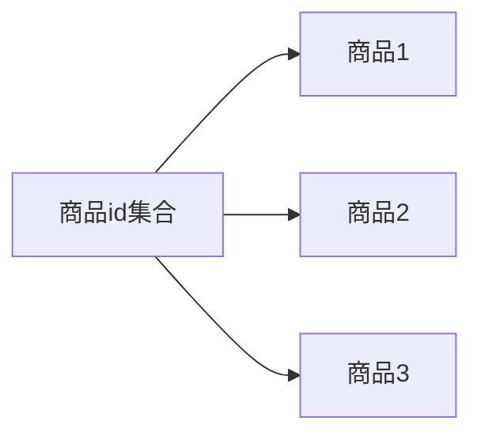

# 高并发下的挑战

## 维度

1. 高性能:提供快速的访问体验。
2. 高可用:网站服务7*24正常访问。

2. 可伸缩:硬件弹性增加/减少能力(快速扩容与释放)。
3. 扩展性:方便地增加/减少新的功能/模块(迭代与服务降级)。
4. 安全性:安全访问和数据加密、安全存储等策略。
5. 敏捷性:快速应对突发情况的能力(灾备等)。

## 内部瓶颈

1. 木桶效应:水管最细的地方决定流量，水桶最低的地方决定容量（QPS压测调优为例)

2. CPU:序列化和反序列化、高频日志输出、大量反射、大量线程的应用
3. 内存:使用内存的中间件或服务，如redis，memcache,jvm大量对象堆积内存的应用等
   1. 是否有人查询数据库一次性查出了所有字段
4. 网络带宽:大流量高并发环境下，双11用户访问量激增，造成网络拥堵
5. 磁盘IO:文件上砖下载，数据库频繁读写，不合理或大批量的日志输出
   1. 日志不要写中文
6. 数据库连接数:应对双11，应用服务器连接池大批扩容，警惕底层数据库、Redis等连接数瓶颈

# 过期订单

> 应用范围

如果数据库有一批数据，超时处理

## 定时任务

> 原理

通过定时任务轮询扫描订单表，超时的批量修改状态

> 缺点

1. 大量数据集，对服务器内存消耗大。
2. 数据库频繁查询，订单量大的情况下，IO是瓶颈。
3. 存在延迟，间隔短则耗资源，间隔长则时效性差，两者是一对矛盾。
4. 不易控制，随着定时业务的增多和细化，每个业务都要对订单重复扫描，引发查询浪费

## DelayQueue

> 原理

通过DelayQueue，每下一单，放入一个订单元素并实现getDelay()方法，方法返回该元素距离失效还剩余的时间，当<=0时元素就失效，就可以从队列中获取到。启用线程池对数据监听，一旦捕获失效订单，取出之后，调用取消逻辑进行处理。

> 优点

基于jvm内存，效率高，任务触发时间延迟低。

> 缺点

1. 存在jvm内存中，服务器重启后，数据全部丢失。依赖代码硬编码，集群扩展麻烦
2. 依赖jvm内存，如果订单量过大，无界队列内容扩充，容易出现OOM需要代码实现，多线程处理业务，复杂度较高
3. 多线程处理时，数据频繁触发等待和唤醒，多了无谓的竞争

## 消息队列

> 原理

如果采用的是RabbitMQ，其本身没有直接支持延迟队列功能，可以针对Queue和Message设置×-message-ttl，用消息的生存时间，和死信队列来实现，具体有两种手段，A:通过队列属性设置，队列中所有消息都有相同的过期时间，粗粒度，编码简单B:对消息进行单独设置，每条消息TTL可以不同，细粒度，但编码稍微复杂。

> 优点

1. 可以随时在队列移除，实现实时取消订单，及时恢复订单占用的资源（如商品)
2. 消息存储在mq中，不占用应用服务器资源
3. 异步化处理，一旦处理能力不足，consumer集群可以很方便的扩容

> 缺点

1. 可能会导致消息大量堆积
2. mq服务器一旦故障重启后，持久化的队列过期时间会被重新计算，造成精度不足

## redis实现  

> 原理

利用redis的notify-keyspace-events，该选项默认为空，改为Ex开启过期事件，配置消息监听。每下一
单在redis中放置一个key（如订单id），并设置过期时间。  

> 优点

1. 消息都存储在Redis中，不占用应用内存。
2. 外部redis存储，应用down机不会丢失数据。
3. 做集群扩展相当方便
4. 依赖redis超时，时间准确度高  

> 缺点

订单量大时，每一单都要存储redis内存，需要大量redis服务器资源  

## 被动取消  

> 原理

在每次用户查询订单的时候，判断订单时间，超时则同时完成订单取消业务(贼不靠谱)  

> 缺点

延迟度不可控，如果用户一直没触发查询，则订单一直挂着，既不支付也未取消，库存也就被占着  

# 营销

## 价格分摊  

满减或平台券等优惠，在多个商品下单时，涉及到金额的分摊。即 优惠总额度/购物车总额 ，得到比例
后再按比例均分到每个商品。只有分摊才能在发生部分退款时退回真实金额。
但是这会涉及到一个精度问题。举例如下：满99减9活动，假设用户购买了 30+40+50=120，3件商品
应付111元。按比例折算的话，9/99取4位小数是0.9090，那么分摊后为
30x0.9090+40x0.9090+50x0.9090=109.08与实际支付金额出现偏差。这会造成财务无法平账。
解决方案：记账时在订单明细记录，**将误差 111-109.08=1.92计入金额最大的明细，也就是50元商品**
上。那么最终记账为：30x0.9090 + 40x0.9090 +（50*0.909+1.92）= 111  

# 数据库优化

在大促开始前梳理耗时查询业务，对关键业务压测。
开启mysql的慢查询日志（两种方式）  

```sql
#配置文件方式，需要重启mysql
#日志文件位置
log-slow-queries=/opt/data/slowquery.log
#超时时间，默认10s
long_query_time=2
#临时开启，不需要重启
set global slow_query_log=on;
set global long_query_time=10;
set global slow_query_log_file=‘/opt/data/slow_query.log’
```

使用mysqldumpslow命令解析mysql慢查询日志  

```sql
-- 慢查询日志以文本打开，可读性很高
-- 查询次数，耗时，锁时间，返回结果集条数（扫描行数），执行者
Count: 1 Time=10.91s (10s) Lock=0.00s (0s) Rows=1000.0 (1000),
mysql[mysql]@[10.1.1.1]
SELECT * FROM order_history
```

# 缓存

## 热点数据预热 

常规缓存设计趋向于懒加载，大促期间的热点数据尽量做到预热加载。比如某个促销专题，不要等待活动开始的一瞬间再读库加缓存，搞不好引发击穿。  

## 细粒度设计  

集合与单体分开存储，缓存结构细粒度化。

如某个橱窗的推荐商品列表，常规存储一个key，value为整个商品集合。

优化为列表与每个商品详细信息设置两个独立缓存值，在查询环节组装，可以降低发生修改时对缓存的冲击。新增一个推荐则失效列表，修改商品则仅仅失效当前商品缓存。  

如： 

- 商品id集合是一个缓存粒度
- 每个商品又是一个缓存粒度




