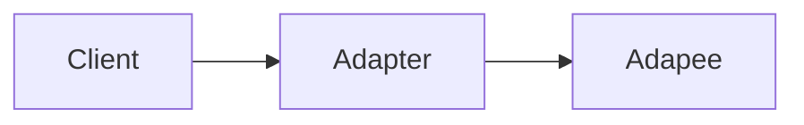

# 设计模式

设计模式的核心就是，封装变化，隔离可变性

# 高质量编程规范

## 命名

> 命名长度

-  类名这种作用域比较大， 推荐用长的命名方式 
-  对于作用域比较小的变量，我们可以使用相对短的命名 

> 利用类的上下文简化命名

- 如一个user类的变量命名，可以是name，不是username，不必重复user这个命名
- 如方法可以借助方法名来简化参数命名

> 勿用方法参数来控制逻辑

-  对于需要参数控制方法内部逻辑的，建议将其拆成两个方法，可读性上也要更好 

# 单例模式

## 饿汉式

不需要加同步标识，加载类是一个天然线程安全的，所以调用的效率高，类加载时就建立对象，如果这个对象不用就造成了浪费

```java
public class SingletonDemo1 {
    private static SingletonDemo1 singletonDemo1 = new SingletonDemo1();
    private SingletonDemo1(){

    }
    public static SingletonDemo1 getInstance(){
        return singletonDemo1;
    }
}
```


## 懒汉式

需要加同步标识，调用效率低，但是是懒加载（好处是不使用就不会去创建这个对象，不会造成浪费）

```java
public class SingletonDemo2 {
    private static SingletonDemo2 singletonDemo2;
    private SingletonDemo2(){

    }

    public static SingletonDemo2 getInstance(){
        synchronized (SingletonDemo2.class){
            if(singletonDemo2 == null){
                singletonDemo2 = new SingletonDemo2();
            }
        }
        return singletonDemo2;
    }
}
```

> 双层检测模式

```java
public class SingletonDemo2 {
    private static SingletonDemo2 singletonDemo2;
    private SingletonDemo2(){

    }

    public static SingletonDemo2 getInstance(){
        if(singletonDemo2 == null){
         	synchronized (SingletonDemo2.class){
                if(singletonDemo2 == null){
                    singletonDemo2 = new SingletonDemo2();
                }
        	}   
        }
        return singletonDemo2;
    }
}
```

## 静态内部类实现

线程安全的，懒加载的，在初始化外部类时，不会去初始化内部类（**静态内部类和非静态内部类一样，都是在被调用时才会被加载**）、

当调用getInstance方法时才会加载SingleDemo4

```java
public class SingleDemo3 {
    private static class SingleDemo4{
        private static final SingleDemo3 SINGLE_DEMO_3 = new SingleDemo3();
    }
    private SingleDemo3(){

    }
    public static SingleDemo3 getInstance(){
        return SingleDemo4.SINGLE_DEMO_3;
    }
}

```

## 枚举类型实现

枚举本身就是单例模式（天然的单例）。由JVM从根本上提供保障 ！避免通过反射和反序列化的漏洞 ！但是无延迟加载

```java
public enum SingletonDemo4 {
    //这个枚举的元素，它就代表了Singleton的一个实例
    SINGLETON_DEMO_4;

    public void operation(){

    }
}
```

## 通过反射破解单例

可以看到前面两个hash值相等，后面两个hash值不等

```java
/**
     * 通过反射破解单例
     * @throws Exception
     */
    @Test
    public void test1() throws Exception{
        SingletonDemo2 singletonDemo2_1 = SingletonDemo2.getInstance();
        SingletonDemo2 singletonDemo2_2 = SingletonDemo2.getInstance();
        System.out.println(singletonDemo2_1.hashCode());
        System.out.println(singletonDemo2_2.hashCode());
        Class<SingletonDemo2> clazz = (Class<SingletonDemo2>)Class.forName("com.xiao.Singleton.SingletonDemo2");
        //获取他的无参构造函数
        Constructor<SingletonDemo2> constructor = clazz.getDeclaredConstructor(null);
        //跳过权限设置，这样，就能直接访问这个类的private属性了
        constructor.setAccessible(true);
        SingletonDemo2 singletonDemo2_3 = constructor.newInstance();
        SingletonDemo2 singletonDemo2_4 = constructor.newInstance();
        System.out.println(singletonDemo2_3.hashCode());
        System.out.println(singletonDemo2_4.hashCode());
    }
```

解决方案

```java
public class SingletonDemo2 {
    private static SingletonDemo2 singletonDemo2;
    private SingletonDemo2(){
        //解决反射跳过私有权限
        if(singletonDemo2!=null){
            throw new RuntimeException();
        }
    }
    public static SingletonDemo2 getInstance(){
        synchronized (SingletonDemo2.class){
            if(singletonDemo2 == null){
                singletonDemo2 = new SingletonDemo2();
            }
        }
        return singletonDemo2;
    }
}
```

## 单例模式多线程下的测试

```java
@Test
public void test2() throws Exception {
    int threadCount = 10;
    final CountDownLatch countDownLatch = new CountDownLatch(threadCount);
    long start = new Date().getTime();
    for(int i=0; i<threadCount; i++){
        new Thread(new Runnable() {
            public void run() {
                for (int i=0; i<=10000; i++) {
                    Object o = SingletonDemo2.getInstance();
                }
                //一个线程结束，则-1
                countDownLatch.countDown();
            }
        }).start();
    }
    countDownLatch.await();
    System.out.println(new Date().getTime() - start);
}
```

# 工厂模式

设计模式是基于面向对象的


开闭原则（ocp）：有新的功能，尽量新增类，不去修改原有的类。

迪米特法则 （LoD ）：只与你直接的朋友通信，而避免和陌生人通信。 如：只与factory类通信，而不与具体类通信

## 简单工厂模式

## 抽象工厂模式

 针对的是产品族（如 轮胎，发动机等是一个产品族），如果只想增加一个产品，使用简单工厂模式

1 建立引擎两个类族

```java
package com.xiao.abstraFactory;

/**
 *
 * 引擎接口（发动机）
 * Created by root on 2019/5/20.
 */
public interface Engine {
    void run();
    void start();
}

/**
 * 种类A的引擎
 */
class TypeAEngine implements  Engine {
    @Override
    public void run() {
        System.out.println("跑的快");
    }

    @Override
    public void start() {
        System.out.println("启动快");
    }
}

/**
 * 种类B的引擎
 */
class TypeBEngine implements  Engine {
    @Override
    public void run() {
        System.out.println("跑的慢");
    }

    @Override
    public void start() {
        System.out.println("启动慢");
    }
}
```

2 建立座位的两个类族

```java
package com.xiao.abstraFactory;

/**
 * 座椅接口
 * Created by root on 2019/5/21.
 */
public interface Seat {
    void massage();
}

class LuxurySeat implements Seat {

    @Override
    public void massage() {
        System.out.println("可以自动按摩！");
    }

}
class LowSeat implements Seat {

    @Override
    public void massage() {
        System.out.println("不能按摩！");
    }

}
```

我们把TypeAEngine和LuxurySeat归为一个类族，建立其工厂类，同时暴露造a类引擎和座位的方法

```java
public class AcarFactory implements CarFactory {
    @Override
    public Engine createEngine() {
        return new TypeAEngine();
    }

    @Override
    public Seat createSeat() {
        return new LuxurySeat();
    }
}
```

客户端

```java
public static void main(String[] args) {
    //创建类型A类族的工厂
    CarFactory carFactory = new AcarFactory();
    Engine an = carFactory.createEngine();//创建a的引擎
    Seat as = carFactory.createSeat(); //创建a的座位
    an.start();
    as.massage();
}
```

# 建造者模式

场景：
– 我们要建造一个复杂的产品。比如：神州飞船,Iphone。这个复杂的产品的创建。有这样
一个问题需要处理：
• 装配这些子组件是不是有个步骤问题?
– 实际开发中，我们所需要的对象构建时，也非常复杂，有很多步骤需要处理时。 

**Product（产品角色）：** 一个具体的产品对象。

**Builder（抽象建造者）：** 创建一个Product对象的各个部件指定的抽象接口。

**ConcreteBuilder（具体建造者）：** 实现抽象接口，构建和装配各个部件。

**Director（指挥者）：** 构建一个使用Builder接口的对象。它主要是用于创建一个复杂的对象。它主要有两个作用，一是：隔离了客户与对象的生产过程，二是：负责控制产品对象的生产过程。

---

建立一个具体产品角色，飞机，这个飞机包括发动机和座位两个配件

```java
public class FlyShip {
    //座位
    private Engine engine;
    //发动机
    private Seat seat;

    public Engine getEngine() {
        return engine;
    }
    public void setEngine(Engine engine) {
        this.engine = engine;
    }
    public Seat getSeat() {
        return seat;
    }
    public void setSeat(Seat seat) {
        this.seat = seat;
    }
    public void go(){
        System.out.print("发动起启动"+engine+"座位准备："+seat);
    }
}

//发动机类
class Engine{
    private String name;
    public Engine(String name) {
        this.name = name;
    }
}

class Seat {
    private String name;
    public Seat(String name) {
        this.name = name;
    }
}
```

构建飞机的配置的相关类

```java
public interface FlyShipBuilder {
    public Engine builderEngine();
    public Seat builderSeat();
}
```

```java
public class FlyShipBuilderImpl implements FlyShipBuilder {
    @Override
    public Engine builderEngine() {
        //可以用工厂方式来构造这些配件
        return new Engine("构造发动机");
    }

    @Override
    public Seat builderSeat() {
        return new Seat("构造座位");
    }
}
```

将这些配件组件成飞机

```java
public class FlySirectorImpl implements FlyDirector {
    private FlyShipBuilder flyShipBuilder;


    public  FlySirectorImpl(FlyShipBuilder flyShipBuilder) {
        this.flyShipBuilder = flyShipBuilder;
    }

    /**
     * 组件飞机，这个装配过程可能配件的装配顺序等都有不同
     * @return
     */
    @Override
    public FlyShip flyShipDirector() {
        Engine engine = flyShipBuilder.builderEngine();
        Seat seat = flyShipBuilder.builderSeat();
        FlyShip flyShip = new FlyShip();
        flyShip.setEngine(engine);
        flyShip.setSeat(seat);
        return flyShip;
    }
}
```

客户端

```java
public static void main(String[] args) {
    FlyShipBuilder flyShipBuilder = new FlyShipBuilderImpl();
    FlyDirector flyDirector = new FlySirectorImpl(flyShipBuilder);
    FlyShip flyShip = flyDirector.flyShipDirector();//将组件组装
    flyShip.go();//客户端生成飞机后进行运行
}
```

抽象工厂与建造者模式对比

---

抽象工厂模式实现对产品家族的创建，一个产品家族是这样的一系列产品：具有不同分类维度的产品组合，采用抽象工厂模式不需要关心构建过程，只关心什么产品由什么工厂生产即可。而建造者模式则是要求按照指定的蓝图建造产品，它的主要目的是通过组装零配件而产生一个新产品。

---

# 原型模式

使用场景：如果创建对象需要消耗大量时间，并且需要创建大量对象，则使用

 浅克隆：如果对象里面有other对象，那么clone的对象里的对象和之前的对象里的对象指向内存相同

```java
public class Sheep implements Cloneable, Serializable {
    private String name;
    private Date date;
    public Sheep(String name, Date date) {
        this.name = name;
        this.date = date;
    }
    @Override
    protected Object clone() throws CloneNotSupportedException {
        return super.clone();
    }
    @Override
    public String toString() {
        return name+"======="+date.toString();
    }
}
```

输出结果：修改可控对象里的对象指向的内存值，两个类都会修改，修改克隆类的string属性，被克隆对象不会修改

多利一号=======Fri May 24 18:21:37 CST 2019
多利一号=======Fri May 24 18:21:37 CST 2019
多利一号=======Fri May 24 18:21:38 CST 2019
多利二号=======Fri May 24 18:21:38 CST 2019

```java
public static void main(String[] args) throws Exception {
    Date date = new Date();
    String name = "多利一号";
    Sheep sheep = new Sheep(name,date);
    Sheep clone = (Sheep)sheep.clone();
    System.out.println(sheep.toString());
    System.out.println(clone.toString());
    date.setTime(date.getTime()+1111);
    clone.setName("多利二号");
    System.out.println(sheep.toString());
    System.out.println(clone.toString());
}
```

深克隆：相反

```java
public class Sheep2 implements Cloneable, Serializable {
    private String name;
    private Date date;
    public Sheep2(String name, Date date) {
        this.name = name;
        this.date = date;
    }

    public void setName(String name) {
        this.name = name;
    }
    @Override
    protected Object clone() throws CloneNotSupportedException {
        Sheep2 sheep = (Sheep2) super.clone();
        //将对象里的对象也进行克隆
        sheep.date=(Date) this.date.clone();
        return sheep;
    }
    @Override
    public String toString() {
        return name+"======="+date.toString();
    }
}
```

```java
public static void main(String[] args) throws Exception {
    Date date = new Date();
    String name = "多利一号";
    Sheep2 sheep = new Sheep2(name,date);
    Sheep2 clone = (Sheep2)sheep.clone();
    System.out.println(sheep.toString());
    System.out.println(clone.toString());
    date.setTime(date.getTime()+1111);
    clone.setName("多利二号");
    System.out.println(sheep.toString());
    System.out.println(clone.toString());
}
```

# 适配器模式

现有的client无法直接调用目标类，需要经历一系列的转换再调用目标类

- 如图所示，client通过adapter 调用Adapee




## 示例1

我们可以看到，Adapee和Target是没有关系的

当是我们客户端是通过 Target去调用Adapee

> 目标类

```java
public class Adapee {
    public void request(){
        System.out.print("原本要操作的方法");
    }
}
```

> 适配类

```java
public interface Target {
    public void handleReq();
}
```

```java
public class Adapter implements Target {
    private Adapee adapee;

    public Adapter(Adapee adapee) {
        this.adapee = adapee;
    }

    @Override
    public void handleReq() {
        adapee.request();
    }
}
```

> client

```java
public class Client {
    public static void main(String[] args) {
        //建立原始要调用的类
        Adapee adapee = new Adapee();
        //将其传入适配的类中
        Target target = new Adapter(adapee);
        //运行
        target.handleReq();
    }
}
```

# 代理模式

## 应用场景

– 安全代理：屏蔽对真实角色的直接访问。
– 远程代理：通过代理类处理远程方法调用(RMI)
– 延迟加载：先加载轻量级的代理对象，真正需要再加载真实对象。
• 比如你要开发一个大文档查看软件，大文档中有大的图片，有可能一个图片有100MB，在打开文件时不可能将所有的图片都显示出来，这样就可以
使用代理模式，当需要查看图片时，用proxy来进行大图片的打开。 （客户端->代理类返回一个压缩版的小图片，真正看是，代理类执行真正方法，返回大图）

如aop，

## 分类

– 静态代理(静态定义代理类)
– 动态代理(动态生成代理类)
	• JDK自带的动态代理
	• javaassist字节码操作库实现
	• CGLIB
	• ASM(底层使用指令，可维护性较差) 

## 静态代理

定义一个接口

```java
/**
 * 定义一个与明星交互的接口
 * Created by root on 2019/5/30.
 */
public interface Star {
    public void confer();//签协议方法
    public void signContract();//签合同
    public void sing(); //唱歌
}
```

定义一个代理类一个真实类，都实现接口,在代理类中调用真实类方法，或者在代理类中直接执行操作

```java
/**
 * 定义真实的明星类
 * Created by root on 2019/5/30.
 */
public class RealStar implements Star {
    @Override
    public void confer() {

    }

    @Override
    public void signContract() {

    }

    @Override
    public void sing() {
        System.out.println("真人在唱歌");
    }
}
```

```java
/**
 * 代理类
 * Created by root on 2019/5/30.
 */
public class ProxyStar implements Star {
    private Star star;

    public ProxyStar(Star star) {
        this.star = star;
    }

    @Override
    public void confer() {
        System.out.println("代理人在签协议");
    }

    @Override
    public void signContract() {
        System.out.println("代理人在签合同");
    }

    @Override
    public void sing() {
        star.sing();
    }
}
```

## 动态代理

### 使用jdk自带动态代理 

代理类：如aop思想，invoke方法在客户端调用任何方法，都会走这一块待， invoke中的操作是共用的，这就是一个切面块

```java
public class StarHandler implements InvocationHandler {
    private RealStar realStarStar;
    public StarHandler(RealStar realStarStar) {
        super();
        this.realStarStar = realStarStar;
    }

    /**
     * 代理执行方法
     * @param proxy   --
     * @param method  --要执行的方法
     * @param args
     * @return
     * @throws Throwable
     */
    @Override
    public Object invoke(Object proxy, Method method, Object[] args) throws Throwable {
        Object object = null;
        System.out.println("真正的方法执行前！");
        System.out.println("开启事务等等");
        if(method.getName().equals("sing")){
            object = method.invoke(realStarStar, args);
        }
        System.out.println("真正的方法执行后！");
        System.out.println("提交事务等等");
        return object;
    }
}
```

客户端调用：创建真实执行的类，将其传入实现了jdk代理接口的对象中，执行方法，就会去执行handler的代理方法invoke

```java
public class Client {
    public static void main(String[] args) {
       RealStar realStar = new RealStar();
       StarHandler starHandler = new StarHandler(realStar);
       Star proxy =  (Star)Proxy.newProxyInstance(ClassLoader.getSystemClassLoader(),
                new Class[]{Star.class}, starHandler);

       proxy.sing();
    }
}
```

## 示例1

> 代理模式针对不同文件上传不同服务器

1. 定义枚举类型，来实现不同的文件类型，对应不同的上传服务的bean
2. 定义一个代理类，来实现根据上传的文件，来调用不同的bean

[]: https://gitee.com/xiaojihao/learning/blob/master/demo-spring-boot/src/main/java/com/xiao/gof/upload/UploadProxy.java	"代码地址"


# 桥接模式

以电脑为例：

销售电脑：销售联想台式、联想笔记本，联想是品牌维度，台式、笔记本是种类

接口类：用于品牌维度和种类维度实现其操作方法

```java
//电脑接口类
public interface Implementor {
    //销售方法
    public void sale();
}
```

品牌维度：

```java
public class Brand implements Implementor {
    @Override
    public void sale() {
        System.out.println("品牌角色被访问" );
    }
}
```

种类维度：

```java
//电脑类型的维度
public class Computer implements Implementor {
    @Override
    public void sale() {
        System.out.println("电脑角色被访问" );
    }
}
```

桥接类的抽象方法

```java
//用于拓展的操作角色
public abstract class Abstraction {
    protected Implementor imple;
    protected Abstraction(Implementor imple){
        this.imple=imple;
    }
    //真正的操作角色
    public abstract void Operation();
}
```

桥接类

```java
public class RefinedAbstraction extends Abstraction {

    protected RefinedAbstraction(Implementor imple) {
        super(imple);
    }
    @Override
    public void Operation() {
        imple.sale();
    }
}
```

要想出售电脑，需要品牌和种类一起，如出售联系笔记本

```java
public class Client {
    public static void main(String[] args) {
        RefinedAbstraction refinedAbstraction1 = new RefinedAbstraction(new Computer());
        RefinedAbstraction refinedAbstraction2 = new RefinedAbstraction(new Brand());
        refinedAbstraction1.Operation();
        refinedAbstraction2.Operation();
    }
}
```

## 适用场景(多个维度)

银行日志管理：本地日志和异地日志两个维度

部门管理:行政部门，开发部门


# 组合模式

如果一个结构类似于树状图，多层递归的操作，可以考虑组合结构

如果有子节点，称为容器，没有则称为叶子

大致结构：

```java
public interface Component {
    void operation();
}

//叶子组件
interface Leaf extends Component {
}
//容器组件
interface Composite extends Component {
    void add(Component c);
    void remove(Component c);
    Component getChild(int index);
}
```

模拟杀毒软件查杀磁盘

```java
public interface AbstractFile {
    //建立一个抽象结构，
    //下面的叶子以及容器都有操作这个的方法
    public void kill();
}
//磁盘下面有文件夹(相当于容器)
class Forder implements AbstractFile {
    private String name;//文件名字
    private List<AbstractFile> list = new ArrayList<>();
    public Forder(String name){
        this.name=name;
    }
    @Override
    public void kill() {
        for(AbstractFile abstractFile : list){
            abstractFile.kill();
        }
        System.out.println("杀掉文件夹--"+name);
    }
    public void add(AbstractFile abstractFile){
        list.add(abstractFile);
    }
}
//图片文件,模拟叶子
class ImageFile implements AbstractFile {
    private String name;
    public ImageFile(String name){
        this.name = name;
    }
    @Override
    public void kill() {
        System.out.println("杀掉图片-"+name);
    }
}
```

```java
public class Client {
    public static void main(String[] args) {
        Forder a1 = new Forder("顶层文件夹");
        AbstractFile a2 = new ImageFile("图片1");
        AbstractFile a3 = new ImageFile("图片1");
        a1.add(a2);
        a1.add(a3);
        //从顶层文件启动,一层一层查杀
        a1.kill();
    }
}
```

# 装饰模式

> 定义

动态的向一个现有的对象添加新的功能，同时又不改变其结构,它属于结构型模式。

## 适配器模式与装饰器模式的区别

装饰器与适配器都有一个别名叫做 包装模式(Wrapper)，它们看似都是起到包装一个类或对象的作用，但是使用它们的目的很不一一样。适配器模式的意义是要将一个接口转变成另一个接口，它的目的是通过改变接口来达到重复使用的目的。
而装饰器模式不是要改变被装饰对象的接口，而是恰恰要保持原有的接口，但是增强原有对象的功能，或者改变原有对象的处理方式而提升性能

## 示例

订单下单，计算价格，MoneySum获取最基础的价格

- 用抽象方法来拓展装饰者

- Full是满减的装饰者增强类（full装饰的是基础价格计算）
- Vip是vip用户满减的装饰器（vip需要先满减，在进行vip计算，所以，vip装饰的是full）

代码地址：


# 享元模式

在很多对象中，某些对象都是一致的属性，创建那么多的对象将会耗费很多的系统资源，它是系统性能提高的一个瓶颈。例如，围棋和五子棋中的黑白棋子，图像中的坐标点或颜色，局域网中的路由器、交换机和集线器，教室里的桌子和凳子等。这些对象有很多相似的地方，如果能把它们相同的部分提取出来共享，则能节省大量的系统资源，这就是享元模式的产生背景。

享元模式的主要优点是：相同对象只要保存一份，这降低了系统中对象的数量，从而降低了系统中细粒度对象给内存带来的压力。

其主要缺点是：

1. 为了使对象可以共享，需要将一些不能共享的状态外部化，这将增加程序的复杂性。
2. 读取享元模式的外部状态会使得运行时间稍微变长。

```JAVA
//享元模式的接口
public interface Flyweight {
    public void operation(UnsharedConcreteFlyweight unsharedConcreteFlyweight);
}

//非享元角色，一般作为参数传入享元操作方法里的接口
class UnsharedConcreteFlyweight {
    private String name;

    public UnsharedConcreteFlyweight(String name) {
        this.name = name;
    }
    public String getName() {
        return name;
    }
    public void setName(String name) {
        this.name = name;
    }
}

//具体的享元角色
class ConcreteFlyweight implements Flyweight {
    private String name;

    public ConcreteFlyweight(String name) {
        this.name = name;
    }

    public String getName() {
        return name;
    }

    public void setName(String name) {
        this.name = name;
    }

    @Override
    public void operation(UnsharedConcreteFlyweight unsharedConcreteFlyweight) {
        System.out.println(unsharedConcreteFlyweight.getName()+"：使用非享元数据");
        System.out.println(name+"：使用享元角色数据");
    }
}
//享元工厂类，用获取享元类
class FlyweightFactory {
    //存储享元角色
    Map<String, Flyweight> map = new HashMap<>();

    public Flyweight getFlyweight(String key){
        Flyweight flyweight = map.get(key);
        if(flyweight==null){
            flyweight = new ConcreteFlyweight("享元"+key+"号");
            System.out.println("享元1号建立"+key);
            map.put(key,flyweight);
            return flyweight;
        }else {
            return flyweight;
        }

    }
}
```


client调用：

```java
public static void main(String[] args) {
    FlyweightFactory flyweightFactory = new FlyweightFactory();
    //获取同样的对象，直接在享元类里获取
    Flyweight flyweight1 =  flyweightFactory.getFlyweight("1");
    Flyweight flyweight2 =  flyweightFactory.getFlyweight("1");

    UnsharedConcreteFlyweight unsharedConcreteFlyweightA = new UnsharedConcreteFlyweight("A");
    UnsharedConcreteFlyweight unsharedConcreteFlyweightB = new UnsharedConcreteFlyweight("B");
    flyweight1.operation(unsharedConcreteFlyweightA);
    flyweight2.operation(unsharedConcreteFlyweightB);
}
```

输出结果：

```console
享元1号建立1
A：使用非享元数据
享元1号：使用享元角色数据
B：使用非享元数据
享元1号：使用享元角色数据
```

## 使用案例

- 享元模式可以是针对局部的数据共享
  - 如：接口访问之后，我们需要用户信息，我们可以从进入接口时，将用户信息放入threadlocal中，之后不用每次都去缓存中取

# 责任链模式

当我们接受到一个请求时，当前的程序暂时无法处理这个请求，于是就需要把请求给别人去处理

Support：超类

NoSupport：不处理问题类

OddSupport：处理基数问题类

```java
public abstract class Support {
    private  String name;
    private Support support;

    public Support(String name) {
        this.name = name;
    }

    public Support setNext(Support support){
        this.support=support;
        return support;
    }
    //处理问题入口
    public final void support(int i) {
        if(resolve(i)) { //判断是否满足条件
            done(i);
        } else if (support != null) {
            support.support(i); //不满足进入下一个处理类
        } else {
            fail(i);
        }
    }
    //用来判断是否满足本类处理条件
    protected abstract boolean resolve(int number);

    protected void done(int i) {
        System.out.println(i + " 正在被处理 " + this + ".");
    }

    protected void fail(int  i) {  // 未解决
        System.out.println(i + " 没有被处理");
    }

    @Override
    public String  toString() {
        return "Support{" +
                "name='" + name + '\'' +
                '}';
    }
}

//不处理问题的类
class NoSupport extends  Support {
    public NoSupport(String name) {
        super(name);
    }

    @Override //永远不处理问题，则返回为false
    protected boolean resolve(int number) {
        return false;
    }
}

//如果是基数，则进行处理
class OddSupport extends Support {
    public OddSupport(String name) {
        super(name);
    }
    @Override
    protected boolean resolve(int i) {
        if(i % 2 == 1)
            return true;
        return false;
    }
}
```

客户端类

setNext:将当前类指向下一个类，在support里面，不满足则进入下一流程

```java
public class Client {
    public static void main(String[] args) {
        Support support1 = new NoSupport("NoSupport");
        Support support2 = new OddSupport("OddSupport");

        support1.setNext(support2);
        for(int i=1; i<=10 ; i++){
            support1.support(i);
        }
    }
}
```

# 迭代器模式


# 中介者模式


# 观察者模式

当一个对象发生变化时，其他对象跟着做相应的反应

```java
//观察者接口
public interface Observer {
    public void updateStatus(String status);
}

//几个观察者类
class ObserverA implements  Observer{
    private String name;

    public ObserverA(String name) {
        this.name = name;
    }

    public void updateStatus(String status) {
        System.out.println("更改了["+this.name+"] status: ["+status+"]");
    }
}
class ObserverB implements  Observer{
    private String name;

    public ObserverB(String name) {
        this.name = name;
    }

    public void setName(String name) {
        this.name = name;
    }
    public void updateStatus(String status) {
        System.out.println("更改了["+this.name+"] status: ["+status+"]");
    }
}
```

```java
//被观察者接口
public  class Subject {
    private List<Observer> list = new ArrayList<Observer>();
        //注册观察者
     public void registerObserver(Observer observer){
        list.add(observer);
     }
        //移除观察者
     public   void removeObserver(Observer observer){

     }
        //通知观察者
     public  void notifyObservers(String msg){
        for(Observer observer : list){
            observer.updateStatus(msg);
        }
     }
}


class client{
    public static void main(String[] args) {
        Observer observera = new ObserverA("A");
        Observer observerb = new ObserverB("B");
        Subject subject = new Subject();
        subject.registerObserver(observera);
        subject.registerObserver(observerb);
        subject.notifyObservers("开始");
    }
}
```