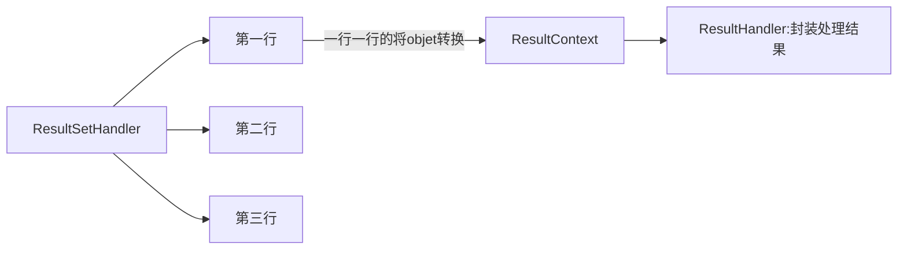
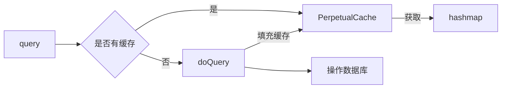
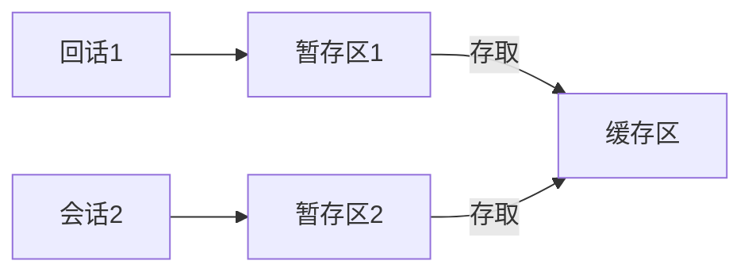
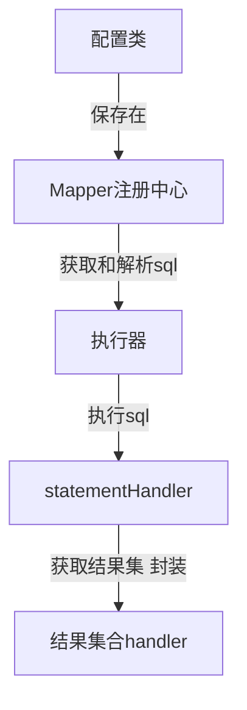

# 原生JDBC

## 步骤

- 加载JDBC驱动程序
  - 为啥要执行 Class.forName("com.mysql.jdbc.Driver");
  - 查看Driver源码，得知他只是为了将Driver加载jvm中，执行静态代码块
  - ps:JDK不负责和数据库连接打交道，也没必要，只提供一个具体的接口Driver，告诉所有第三方，要连接数据库，就去实现这个接口，然后通过DriverManager注册一下，到时候连接某个数据库的时候，你已经在我这里注册了，我会调用你注册进来的Driver里面的方法去对指定数据库进行连接的。然后Mysql就实现自己的Driver，Oracle就实现自己的Driver，通过static块注册一下，再然后，就没有然后了

```java
static {
    try {
        java.sql.DriverManager.registerDriver(new Driver());
    } catch (SQLException E) {
        throw new RuntimeException("Can't register driver!");
    }
}
```

- 创建数据库的连接  
  - DriverManager获取连接
  - DataSource数据源方式获取连接
- 创建一个preparedStatement
  - 要执行SQL语句，必须获得java.sql.Statement实例，Statement实例分为以下3 种类型：    
          1、执行静态SQL语句。通常通过Statement实例实现。    
          2、执行动态SQL语句。通常通过PreparedStatement实例实现。    
          3、执行数据库存储过程。通常通过CallableStatement实例实现。  
- 执行SQL语句 ， Statement接口提供了三种执行SQL语句的方法：executeQuery 、executeUpdate和execute
- 遍历结果集
- 处理异常，关闭JDBC对象资源  

```java
Connection connection = null;
Statement statement = null;
ResultSet resultSet = null;
try {
    Class.forName("com.mysql.jdbc.Driver");
    connection = DriverManager.getConnection(url, username, password);
    statement = connection.createStatement();
    resultSet = statement.executeQuery(sql);
    while (resultSet.next()) {
        System.out.println(resultSet.getString(1)+" "
                +resultSet.getString(2));
    }
} finally {
    resultSet.close();
    statement.close();
    connection.close();
}
```

## DatabaseMetaData

- 获取数据源信息
- 确定数据源是否支持某一特性或功能
- 获取数据源的限制
- 确定数据源包含哪些SQL对象以及这些对象的属性
- 获取数据源对事务的支持

# 入门


## 接口开发

1.接口类路径与xml namespace相同

2.接口方法名与type相同

3.返回的是一个**代理对象**，由这个代理对象执行一系列操作

```java
//定义接口
public interface UserMapper {
    public User selectUser(Integer id) throws Exception;
}
```

```java
@Test
public void testInterface() throws Exception{
    String resource = "mybatis-config.xml";
    InputStream inputStream = Resources.getResourceAsStream(resource);
    SqlSessionFactory sqlSessionFactory = new SqlSessionFactoryBuilder().build(inputStream);
    SqlSession session = sqlSessionFactory.openSession();
    try {
        UserMapper mapper = session.getMapper(UserMapper.class);
        System.out.println(mapper.selectUser(1).toString());
    } finally {
        session.close();
    }
}
```

## ScriptRunner执行脚本

执行对应的脚本文件

```java
ScriptRunner scriptRunner = new ScriptRunner(connection);
scriptRunner.runScript(Resources.getResourceAsReader("create-table.sql"));
```

## 反射工具类

### MetaObject

- 是MyBatis中的反射工具类

- 使用MetaObject工具类，我们可以很优雅地获取和设置对象的属性值

### MetaClass

- ### MetaClass用于获取类相关的信息

- 使用MetaClass判断某个类是否有默认构造方法，还可以判断类的属性是否有对应的Getter/Setter方法

# MyBatis核心组件

## Configuration

- MyBatis的主配置信息，其他组件需要获取配置信息时，直接通过Configuration对象获取
- Executor、StatementHandler、ResultSetHandler、ParameterHandler组件的工厂类

- mapperRegistry：用于注册Mapper接口信息，建立Mapper接口的Class对象和MapperProxyFactory对象之间的关系，其中MapperProxyFactory对象用于创建Mapper动态代理对象。
  - interceptorChain：用于注册MyBatis插件信息，MyBatis插件实际上就是一个拦截器
  - keyGenerators：用于注册KeyGenerator，KeyGenerator是MyBatis的主键生成器，MyBatis中提供了3种KeyGenerator，即Jdbc3KeyGenerator（数据库自增主键）、NoKeyGenerator（无自增主键）、SelectKeyGenerator（通过select语句查询自增主键，例如oracle的sequence）
  
- MappedStatement
  - MappedStatement用于描述Mapper中的SQL配置信息，是对Mapper XML配置文件中<select|update|delete|insert>等标签或者@Select/@Update等注解配置信息的封装

## Executor

> 基本概念

- SqlSession是MyBatis提供的操作数据库的API(门面模式)，但是真正执行SQL的是Executor组件


- SimpleExecutor是基础的Executor，能够完成基本的增删改查操作
- ResueExecutor对JDBC中的Statement对象做了缓存，当执行相同的SQL语句时，直接从缓存中取出Statement对象进行复用，避免了频繁创建和销毁Statement对象
- BatchExecutor则会对调用同一个Mapper执行的update、insert和delete操作，调用Statement对象的批量操作功能
- **当MyBatis开启了二级缓存功能时，会使用CachingExecutor对SimpleExecutor、ResueExecutor、BatchExecutor进行装饰**

>执行器使用示例

- 此处使用SimpleExecutor，如果执行两次，则需要进行两次预编译（PreparedStatement的创建）
- 真正执行的方法是doquery方法

```java
String resource = "mybatis-config.xml";
InputStream inputStream = Resources.getResourceAsStream(resource);
SqlSessionFactory sqlSessionFactory = new SqlSessionFactoryBuilder().build(inputStream);
SqlSession sqlSession = sqlSessionFactory.openSession();
//获取配置信息
Configuration configuration = sqlSession.getConfiguration();
//获取statement, 里面包含执行的xml，接口等信息
MappedStatement mappedStatement = configuration.getMappedStatement("com.xiao.dao.StudentMapper.selectStudent");
//获取执行器（传入配置信息和事务）
JdbcTransaction jdbcTransaction = new JdbcTransaction(sqlSession.getConnection());
Executor executor = new SimpleExecutor(configuration, jdbcTransaction);
//执行我们对应的命名空间的语句
List<Object> query = executor.doQuery(mappedStatement, 2, RowBounds.DEFAULT, Executor.NO_RESULT_HANDLER);
log.debug(cn.hutool.core.util.ArrayUtil.toString(query));
```

> ReuseExecutor

- 可重用的执行器，他的用一个命名空间的sql预编译只会有一次
- **只要sql相同，就会重用sql预编译**

>  BatchExecutor

- 批处理执行器
- 只会针对修改操作
- 执行完成后，**需要手动的刷新操作**

> 执行器怎么和缓存关联

- 一级缓存

1. 执行器调用query方法，先回根据key（CacheKey对象）获取结果
2. 如果没有获取到结果，再执行doQuery查询的操作

- 二级缓存

1.  CachingExecutor
2. 他对BaseExecutor进行了一层装饰

```java
//采用装饰者模式，delegate指向Executor
public CachingExecutor(Executor delegate) {  
    this.delegate = delegate;  delegate.setExecutorWrapper(this);
}
```

3. 对二级缓存进行装饰
4. 二级缓存想要生效，必须有commit操作，才会使用二级缓存

## StatementHandler

StatementHandler组件封装了对JDBC Statement的操作，例如设置Statement对象的fetchSize属性、设置查询超时时间、调用JDBC Statement与数据库交互等


```java
public interface StatementHandler {  
    //基于连接创建statement
    Statement prepare(Connection connection, Integer transactionTimeout) 
```

>  PreparedStatementHandler

> > 能够做什么事

预编译，设置参数，执行jdbc，将结果集封装成javabean

### 参数处理器

将javabean ----> jdbc 处理对象

> ParamNameResolver#getNamedParams

进行参数的map集合获取

> DefaultParameterHandler#setParameters

将参数设置进入TypeHandler中

## TypeHandler

处理JDBC类型与Java类型之间的转换，如给PreparedStatement设置占位符

```java
public interface TypeHandler<T> {
 //设置参数
  void setParameter(PreparedStatement ps, int i, T parameter, JdbcType jdbcType) throws SQLException;
	//根据列名获取参数
  T getResult(ResultSet rs, String columnName) throws SQLException;
	//根据下表获取参数
  T getResult(ResultSet rs, int columnIndex) throws SQLException;

  T getResult(CallableStatement cs, int columnIndex) throws SQLException;

}
```

- MyBatis通过TypeHandlerRegistry建立JDBC类型、Java类型与TypeHandler之间的映射关系

```java
//可以通过这种方式来注册参数
TypeHandlerRegistry typeHandlerRegistry = configuration.getTypeHandlerRegistry();
typeHandlerRegistry.register(LocalDateTimeTypeHandler.class);
```

- 在TypeHandlerRegistry中，通过Map对象保存JDBC类型、Java类型与TypeHandler之间的关系

# SqlSession

- 作用：降低调用额复杂性

> 调用顺序

1. sqlsession 调用CachingExecutor
2. CachingExecutor调用对应的BaseExecutor

```java
SqlSession sqlSession = sqlSessionFactory.openSession();Object o = sqlSession.selectOne("com.xiao.dao.StudentMapper.selectStudent", 1);System.out.println(o);
```

# 全局配置文件


## 别名处理器

typeAliases：为java类起别名，这样在select等标签中就可以直接使用别名，而不使用全类名

如：

```xml
<typeAliases>
    <typeAlias type="com.xiao.mybatis.entity.User" alias="user"></typeAlias>
</typeAliases>
```

我们还可以批量起别名，为某个包下所有类起别名，那么，他的别名就是这个包下的类名，它不区分大小写

```xml
<typeAliases>
    <package name="com.xiao.mybatis.entity" ></package>
</typeAliases>
```

也可以使用注解方式，提供别名

```java
@Alias("user")
public class User {
```

mybaitis还为很多java基本类型起了别名

## 环境配置（environments）

起到快速切换生产或者测试类型

只需要default配置好，就能找到对应的配置的id=default的environment

```xml
<environments default="development">
    <environment id="development">
        <transactionManager type="JDBC"/>
        <dataSource type="POOLED">
            <property name="driver" value="com.mysql.jdbc.Driver"/>
            <property name="url" value="jdbc:mysql://192.168.94.130:3306/mytest1"/>
            <property name="username" value="root"/>
            <property name="password" value="123456"/>
        </dataSource>
    </environment>
</environments>
```

## 事务配置

mybatis有两种配置：type=”[JDBC|MANAGED]”

其实这两个都是别名，他们分别代表了两个类

我们也可以自定义事务，只需要继承TransactionFactory接口

```java

public class Configuration {
public Configuration() {
    typeAliasRegistry.registerAlias("JDBC", JdbcTransactionFactory.class);
    typeAliasRegistry.registerAlias("MANAGED", ManagedTransactionFactory.class);
```

## 数据源类型

 type=”[UNPOOLED|POOLED|JNDI]”

**UNPOOLED**– 这个数据源的实现只是每次被请求时打开和关闭连接

**POOLED**– 这种数据源的实现利用“池”的概念将 JDBC 连接对象组织起来

**JNDI** – 这个数据源的实现是为了能在如 EJB 或应用服务器这类容器中使用，容器可以集中或在外部配置数据源

也可以自定义数据源类型：实现：DataSourceFactory接口，实现DataSource getDataSource();的方法，返回对应的数据源（c3p0等）

## 多数据库厂商配置

作用就是得到数据库厂商的标识(驱动getDatabaseProductName())，mybatis就能根据数据库厂商标识来执行不同的sql

```xml
<databaseIdProvider type="DB_VENDOR">
		<!-- 为不同的数据库厂商起别名 -->
		<property name="MySQL" value="mysql"/>
		<property name="Oracle" value="oracle"/>
		<property name="SQL Server" value="sqlserver"/>
	</databaseIdProvider>
```

在写sql语句时，根据别名来操作不同数据库厂商的语句

```xml
<select id="getEmpById" resultType="Employee"
	databaseId="mysql">
	select * from tbl_employee where id = #{id}
</select>
<select id="getEmpById" resultType="Employee"
	databaseId="oracle">
	select EMPLOYEE_ID id,LAST_NAME	lastName,EMAIL email 
	from employees where EMPLOYEE_ID=#{id}
</select>
```

## mapper注册sql映射文件

mybatis加载mapper有三种方式

mapper属性：

- resource：引用类路径下的sql映射文件

```xml
<mappers>
    <mapper resource="org/mybatis/example/BlogMapper.xml"/>
</mappers>
```

- url：引用网路路径或者磁盘路径下的sql映射文件
- class：引用（注册）接口（一般基于注解版的）
  - 有sql映射文件，映射文件名必须和接口同名，并且放在与接口同一目录下
  - 没有sql映射文件，所有的sql都是利用注解写在接口上

如果使用注解版的，还可以使用批量注册

```xml
<mappers>
   <package name="com.xx.mybatis.dao"/>
</mappers>
```

# 映射文件

## Mapper接口

1. 执行查询的过程

```java
String resource = "mybatis-config.xml";
InputStream inputStream = Resources.getResourceAsStream(resource);
SqlSessionFactory sqlSessionFactory = new SqlSessionFactoryBuilder().build(inputStream);
SqlSession sqlSession = sqlSessionFactory.openSession();
StudentMapper studentMapper = sqlSession.getMapper(StudentMapper.class);
Student student = studentMapper.selectStudent(2l);
```

2. 可以看到studentMapper对象为org.apache.ibatis.binding.MapperProxy@346d61be代理对象
3. MapperProxy类实现动态代理

- invoke方法片段

```java
 final MapperMethod mapperMethod = cachedMapperMethod(method);
 return mapperMethod.execute(sqlSession, args);
```

4. MapperMethod.execute具体执行对应的sql
5. SqlCommand对象用于获取SQL语句的类型、Mapper的Id等信息

- 类似代码

```java
interface BlogMapper {
    @Select("SELECT name FROM blog WHERE id = #{id}")
    String selectBlog(int id);
}


@org.junit.Test
public void testMybatisMapper() {
    //通过反射的方式，执行对应的sql
    BlogMapper blogMapper = (BlogMapper)Proxy.newProxyInstance(ClassLoader.getSystemClassLoader(), new Class[] {BlogMapper.class}, (proxy, method, args) -> {
        Select select = method.getAnnotation(Select.class);
        String[] value = select.value();
        System.out.printf(ArrayUtil.toString(value));
        System.out.println(ArrayUtil.toString(args));
        return "执行结果";
    });
    String blog = blogMapper.selectBlog(1);
    System.out.println(blog);
}
```

```sequence
participant MapperProxy
participant MapperMethod
participant SqlCommand

MapperProxy -> MapperMethod:mapperMethod.execute
SqlCommand -> SqlCommand:获取方法的签名信息
MapperMethod -> SqlCommand:转换sql参数

```


## 增删改

m··ybatis允许增删改直接定义返回以下类型

​	interger long  boolean void

## 获取自增主键值

mysql支持自增主键，自增主键值的获取

useGeneratedKeys="true"；使用自增主键获取主键值策略

keyProperty；指定对应的主键属性，也就是mybatis获取到主键值以后，将这个值封装给javaBean的哪个属性

例如：

```xml
<insert id="addEmp" parameterType="com.atguigu.mybatis.bean.Employee"
	useGeneratedKeys="true" keyProperty="id" databaseId="mysql">
insert into tbl_employee(last_name,email,gender) 
values(#{lastName},#{email},#{gender})
</insert>
```

## 获取非自增的主键

Oracle不支持自增；Oracle使用序列来模拟自增

keyProperty:查出的主键值封装给javaBean的哪个属性

order="BEFORE":当前sql在插入sql之前运行
			   AFTER：当前sql在插入sql之后运行

resultType:查出的数据的返回值类型
BEFORE运行顺序：
	先运行selectKey查询id的sql；查出id值封装给javaBean的id属性
	在运行插入的sql；就可以取出id属性对应的值
AFTER运行顺序：
			先运行插入的sql（从序列中取出新值作为id）；
			再运行selectKey查询id的sql；

例如：
```
<insert id="addEmp" databaseId="oracle">
		<!-- 
		keyProperty:查出的主键值封装给javaBean的哪个属性
		order="BEFORE":当前sql在插入sql之前运行
			   AFTER：当前sql在插入sql之后运行
		resultType:查出的数据的返回值类型
		

​```xml
<selectKey keyProperty="id" order="BEFORE" resultType="Integer">
  <!-- 编写查询主键的sql语句 -->
	<!-- BEFORE-->
	select EMPLOYEES_SEQ.nextval from dual 
	<!-- AFTER：
	select EMPLOYEES_SEQ.currval from dual -->
</selectKey>
	
	<!-- 插入时的主键是从序列中拿到的 -->
	<!-- BEFORE:-->
	insert into employees(EMPLOYEE_ID,LAST_NAME,EMAIL) 
	values(#{id},#{lastName},#{email<!-- ,jdbcType=NULL -->}) 
	<!-- AFTER：
	insert into employees(EMPLOYEE_ID,LAST_NAME,EMAIL) 
	values(employees_seq.nextval,#{lastName},#{email}) -->
</insert>
```
## 方法参数说明

单个参数：mybatis不会做特殊处理，
	#{参数名/任意名}：取出参数值。
	
多个参数：mybatis会做特殊处理。
	多个参数会被封装成 **一个map**，
		key：param1...paramN,或者参数的索引也可以
		value：传入的参数值
	#{}就是从map中获取指定的key的值；

```xml
操作：
		方法：public Employee getEmpByIdAndLastName(Integer id,String lastName);
		取值方式：#{param1},#{param2}
```


【命名参数】：明确指定封装参数时map的key；@Param("id")
	多个参数会被封装成 一个map，
		key：使用@Param注解指定的值
		value：参数值
	#{指定的key}取出对应的参数值

例：

```java
public Employee getEmp(@Param("id")Integer id,String lastName);
	取值：id==>#{id/param1}   lastName==>#{param2}

public Employee getEmp(Integer id,@Param("e")Employee emp);
	取值：id==>#{param1}    lastName===>#{param2.lastName/e.lastName}

##特别注意：如果是Collection（List、Set）类型或者是数组，
		 也会特殊处理。也是把传入的list或者数组封装在map中。
			key：Collection（collection）,如果是List还可以使用这个key(list)
				数组(array)
public Employee getEmpById(List<Integer> ids);
	取值：取出第一个id的值：   #{list[0]}
```

## 执行mapper源码解析

先进入一个mapper代理类的invoke方法中

```java
public class MapperProxy<T> implements InvocationHandler, Serializable {
public Object invoke(Object proxy, Method method, Object[] args) throws Throwable {
    final MapperMethod mapperMethod = cachedMapperMethod(method);
    //真正的执行方法
    return mapperMethod.execute(sqlSession, args);
```

MapperMethod类：进入execute方法

```java
public class MapperMethod {
    public Object execute(SqlSession sqlSession, Object[] args) {
```


param封装的源码

```java
public class ParamNameResolver {
public Object getNamedParams(Object[] args) {
  final int paramCount = names.size();
  if (args == null || paramCount == 0) {
    return null;
  } else if (!hasParamAnnotation && paramCount == 1) {
    return args[names.firstKey()];
  } else {
    final Map<String, Object> param = new ParamMap<Object>();
    int i = 0;
    for (Map.Entry<Integer, String> entry : names.entrySet()) {
      param.put(entry.getValue(), args[entry.getKey()]);
      // add generic param names (param1, param2, ...)
      final String genericParamName = GENERIC_NAME_PREFIX + String.valueOf(i + 1);
      // ensure not to overwrite parameter named with @Param
      if (!names.containsValue(genericParamName)) {
        param.put(genericParamName, args[entry.getKey()]);
      }
      i++;
    }
    return param;
  }
}
```

## 参数的值获取

#{}:是以预编译的形式，将参数设置到sql语句中；PreparedStatement；防止sql注入
		${}:取出的值直接拼装在sql语句中；会有安全问题；
		大多情况下，我们去参数的值都应该去使用#{}；

原生jdbc不支持占位符的地方我们就可以使用${}进行取值
比如分表、排序。。。；按照年份分表拆分

#{}:更丰富的用法：

jdbcType通常需要在某种特定的条件下被设置：(具体可看：JDBCType类)
		在我们数据为null的时候，有些数据库可能不能识别mybatis对null的默认处理。比如Oracle（报错）；
JdbcType OTHER：无效的类型；因为mybatis对所有的null都映射的是原生Jdbc的OTHER类型，oracle不能正确处理;
由于全局配置中：jdbcTypeForNull=OTHER；oracle不支持；两种办法
1、#{email,jdbcType=NULL};
2、jdbcTypeForNull=NULL
<setting name="jdbcTypeForNull" value="NULL"/>

## select 元素

返回一个map类型，以user对象的id为key

```java
@MapKey("id")
public Map<Integer, User> selectMap();
```

```xml
<select id="selectMap" resultType="java.util.Map" >
    select * from t_user
</select>
```

## resultMap结果集映射

### 多对一的查询

查询用户与部门，用户与部门为多对已

1、直接封装resultmap

```java
public class User {

    private Long id;
    private String name;
    private Integer age;
    private String email;
    private Dept dept;
```

使用**dept.属性**的方式，进行设置

```xml
<resultMap id="user1" type="com.xiao.mybatis.entity.User">
    <id column="id" property="id"></id>
    <result column="name" property="name"></result>
    <result column="age" property="age"></result>
    <result column="email" property="email"></result>
    <!--对user对象的Dept对象属性进行设值-->
    <result column="did" property="dept.id"></result>
    <result column="deptname" property="dept.deptName"></result>
</resultMap>

<select id="selectUser1" resultMap="user1" >
    select tu.id,tu.name,tu.age,td.id did, td.deptname
    from t_user tu INNER JOIN t_dept td on tu.did=td.id
</select>
```

2、使用association定义关联的单个对象

```xml
<resultMap id="user2" type="com.xiao.mybatis.entity.User">
    <id column="id" property="id"></id>
    <result column="name" property="name"></result>
    <result column="age" property="age"></result>
    <result column="email" property="email"></result>
    <!--
		property="user对象的dept对象属性"
	-->
    <association property="dept" javaType="com.xiao.mybatis.entity.Dept" >
        <id column="did" property="id"></id>
        <result column="deptname" property="deptName" ></result>
    </association>
</resultMap>

<select id="selectUser1" resultMap="user2" >
    select tu.id,tu.name,tu.age,td.id did, td.deptname
    from t_user tu INNER JOIN t_dept td on tu.did=td.id
</select>
```

3、使用association进行分步查询，先查user表，再查did表

在deptmapper端写对应的查询

```xml
<select id="getDeptById" resultType="com.xiao.mybatis.entity.Dept" parameterType="java.lang.Integer" >
    select * from t_dept where id=#{id}
</select>
```

在usermapper

select:指定第二次查询的方法

column 指定传入的参数值

​			**多列的值传递过去**：
​			将多列的值封装map传递；
​			column="{key1=column1,key2=column2}"

```xml
<resultMap id="user3" type="com.xiao.mybatis.entity.User">
    <id column="id" property="id"></id>
    <result column="name" property="name"></result>
    <result column="age" property="age"></result>
    <result column="email" property="email"></result>
    <association property="dept" select="com.xiao.mybatis.Mapper.DeptMapper.getDeptById"
        column="did">
    </association>
</resultMap>
<select id="selectUser1" resultMap="user3" >
   select tu.id,tu.name,tu.age,tu.did
   from t_user tu
</select>
```

### 一对多查询

dept类

```java
public class Dept {
    private Integer id;
    private String deptname;
    private List<User> users;
```

collection会将联合查询的数据封装到集合中

```xml
<resultMap id="dept1" type="com.xiao.mybatis.entity.Dept" >
    <id column="id" property="id"></id>
    <result column="deptname" property="deptname" ></result>
    <collection property="users" ofType="com.xiao.mybatis.entity.User" >
        <id column="uid" property="id"></id>
        <result column="name" property="name"></result>
        <result column="age" property="age"></result>
        <result column="email" property="email"></result>
    </collection>
</resultMap>
<select id="getDeptBy" resultMap="dept1" parameterType="java.lang.Integer" >
    select td.id id, td.deptname, tu.id uid,tu.name,tu.age  from t_dept td
    left join t_user tu on tu.did=td.id
    where td.id=#{id}
</select>
```

## 动态sql

if:判断

### choose

 (when, otherwise):分支选择；带了break的swtich-case

```xml
<select id="getEmpsByConditionChoose" resultType="com.atguigu.mybatis.bean.Employee">
	 	select * from tbl_employee 
	 	<where>
	 		<!-- 如果带了id就用id查，如果带了lastName就用lastName查;只会进入其中一个 -->
	 		<choose>
	 			<when test="id!=null">
	 				id=#{id}
	 			</when>
	 			<when test="lastName!=null">
	 				last_name like #{lastName}
	 			</when>
	 			<when test="email!=null">
	 				email = #{email}
	 			</when>
	 			<otherwise>
	 				gender = 0
	 			</otherwise>
	 		</choose>
	 	</where>
	 </select>
```

### trim

可以解决 where标签不能解决 后面多出的and或者or 
	 	prefix="":前缀：trim标签体中是整个字符串拼串 后的结果。
	 			prefix给拼串后的整个字符串加一个前缀 
	 	prefixOverrides="":
	 			前缀覆盖： 去掉整个字符串前面多余的字符
	 	suffix="":后缀
	 			suffix给拼串后的整个字符串加一个后缀 
	 	suffixOverrides=""
	 			后缀覆盖：去掉整个字符串后面多余的字符


添加前缀where， 如果 后缀多了and，则去掉

```xml
<select id="getEmpsByConditionTrim" resultType="com.atguigu.mybatis.bean.Employee">
	 	select * from tbl_employee
	 	<!-- 自定义字符串的截取规则 -->
	 	<trim prefix="where" suffixOverrides="and">
	 		<if test="id!=null">
		 		id=#{id} and
		 	</if>
		 	<if test="lastName!=null &amp;&amp; lastName!=&quot;&quot;">
		 		last_name like #{lastName} and
		 	</if>
		 	<if test="email!=null and email.trim()!=&quot;&quot;">
		 		email=#{email} and
		 	</if> 
		 	<!-- ognl会进行字符串与数字的转换判断  "0"==0 -->
		 	<if test="gender==0 or gender==1">
		 	 	gender=#{gender}
		 	</if>
		 </trim>
	 </select>
```

### set(与where对应)

封装修改条件

```xml
 <update id="updateEmp">
	 	<!-- Set标签的使用 -->
	 	update tbl_employee 
		<set>
			<if test="lastName!=null">
				last_name=#{lastName},
			</if>
			<if test="email!=null">
				email=#{email},
			</if>
			<if test="gender!=null">
				gender=#{gender}
			</if>
		</set>
		where id=#{id} 
<!-- 		
		Trim：更新拼串
		update tbl_employee 
		<trim prefix="set" suffixOverrides=",">
			<if test="lastName!=null">
				last_name=#{lastName},
			</if>
			<if test="email!=null">
				email=#{email},
			</if>
			<if test="gender!=null">
				gender=#{gender}
			</if>
		</trim>
		where id=#{id}  -->
	 </update>
```

### foreach遍历集合

collection：指定要遍历的集合：
list类型的参数会特殊处理封装在map中，map的key就叫list
item：将当前遍历出的元素赋值给指定的变量
separator:每个元素之间的分隔符
open：遍历出所有结果拼接一个开始的字符
close:遍历出所有结果拼接一个结束的字符
index:索引。遍历list的时候是index就是索引，item就是当前值
遍历map的时候index表示的就是map的key，item就是map的值
	 		
#{变量名}就能取出变量的值也就是当前遍历出的元素

```xml
<!--public List<Employee> getEmpsByConditionForeach(List<Integer> ids);  -->
	 <select id="getEmpsByConditionForeach" resultType="com.atguigu.mybatis.bean.Employee">
	 	select * from tbl_employee
	 	<foreach collection="ids" item="item_id" separator=","
	 		open="where id in(" close=")">
	 		#{item_id}
	 	</foreach>
	 </select>
```

## 两个内置参数

不只是方法传递过来的参数可以被用来判断，取值。。。
mybatis默认还有两个内置参数：
	_parameter:代表整个参数
	单个参数：_parameter就是这个参数
	多个参数：参数会被封装为一个map；_parameter就是代表这个map
	 	
_databaseId:如果配置了databaseIdProvider标签。
_databaseId就是代表当前数据库的别名oracle


```xml
<!--public List<Employee> getEmpsTestInnerParameter(Employee employee);  -->
	  <select id="getEmpsTestInnerParameter" resultType="com.atguigu.mybatis.bean.Employee">
	  		<if test="_databaseId=='mysql'">
	  			select * from tbl_employee
	  			<if test="_parameter!=null">
	  				where last_name like #{lastName}
	  			</if>
	  		</if>
	  		<if test="_databaseId=='oracle'">
	  			select * from employees
	  			<if test="_parameter!=null">
	  				where last_name like #{_parameter.lastName}
	  			</if>
	  		</if>
	  </select>
```

## bind

可以将OGNL表达式的值绑定到一个变量中，方便后来引用这个变量的值

```xml
<!--public List<Employee> getEmpsTestInnerParameter(Employee employee);  -->
	  <select id="getEmpsTestInnerParameter" resultType="com.atguigu.mybatis.bean.Employee">
	  		<!-- bind：可以将OGNL表达式的值绑定到一个变量中，方便后来引用这个变量的值 -->
	  		<bind name="_lastName" value="'%'+lastName+'%'"/>
	  		<if test="_databaseId=='mysql'">
	  			select * from tbl_employee
	  			<if test="_parameter!=null">
	  				where last_name like #{_lastName}
	  			</if>
	  		</if>
	  </select>
```

## 抽取可重用的sql片段

```xml
<sql id="insertColumn">
	<if test="_databaseId=='oracle'">
	  employee_id,last_name,email
	</if>
	<if test="_databaseId=='mysql'">
	  last_name,email,gender,d_id
	</if>
</sql>
```

# 结果集处理

> ResultHandler

- 结果集处理流程



## 上下文

如：我们结果集有10行，我们只需要5行，可以调用stop方法

```java
List list = new ArrayList();
ResultHandler handler = new ResultHandler() {    
    @Override    
    public void handleResult(ResultContext resultContext) {
        if(resultContext.getResultCount() > 2) {            
            resultContext.stop();       
        }        
        list.add(resultContext.getResultObject());    
    }};
sqlSession.select("com.xiao.dao.StudentMapper.selectAll", handler);
log.debug("获取到结果集大小：{}", list.size());
```

## 结果集转换

- 在DefaultResultSetHandler#handleResultSets 处理结果集
- 如果只有一个结果集处理则只会调用DefaultResultSetHandler#handleResultSet方法
- 如果没有循环嵌套的情况，则调用DefaultResultSetHandler#handleRowValuesForSimpleResultMap进行结果集的封装
- DefaultResultSetHandler#handleRowValuesForSimpleResultMap

- 遍历结果集：DefaultResultSetHandler#getRowValue
  - 创建空对象：createResultObject
  - 填充熟悉：applyAutomaticMappings（自动映射），applyPropertyMappings（手动映射）


# 缓存

## 一级缓存

sqlSession级别的缓存。一级缓存是一直开启的

与数据库同一次会话期间查询到的数据会放在本地缓存中。
以后如果需要获取相同的数据，直接从缓存中拿，没必要再去查询数据库；

> 一级缓存失效情况

没有使用到当前一级缓存的情况，效果就是，还需要再向数据库发出查询

1、sqlSession不同。
2、sqlSession相同，查询条件不同.(当前一级缓存中还没有这个数据)
3、sqlSession相同，两次查询之间执行了增删改操作(这次增删改可能对当前数据有影响)

​     调用了增删改的操作就会直接清空缓存

4、sqlSession相同，手动清除了一级缓存（缓存清空）

```java
sqlSession.clearCache();
```

5. localCacheScope设置成`STATEMENT`(缓存作用于作用于statement)

> 一级缓存命中的情况

1. sql 和参数必须相同
2. 必须是相同的statementid（方法名）
3. sqlsession 必须相同
4. RowBound 必须相同（返回行范围必须相同）


**在分布式环境下，务必将MyBatis的localCacheScope属性设置为STATEMENT，避免其他应用节点执行SQL更新语句后，本节点缓存得不到刷新而导致的数据一致性问题。**

### 一级缓存原理




## 二级缓存

- 基于namespace级别的缓存：一个namespace对应一个二级缓存(应用级别的缓存，作用于整个应用)
- 他能个跨线程的使用

> 二级缓存需要满足的点

1. 存储:用什么方式存储
2. 过期清理
3. 线程安全
4. 命中率统计
5. 序列化

> 设计思路

装饰器+责任链方式进行缓存处理

### 工作机制

一个会话，查询一条数据，这个数据就会被放在当前会话的一级缓存中

如果会话关闭；一级缓存中的数据会被保存到二级缓存中；新的会话查询信息，就可以参照二级缓存中的内容

### 使用

开启全局二级缓存配置：	<setting name="cacheEnabled" value="true"/>

去mapper.xml中配置使用二级缓存：<cache></cache>

我们的POJO需要实现序列化接口

### 缓存代码使用

- 一个小示例，不是真实的存在

```java
SqlSession sqlSession = sqlSessionFactory.openSession();   
Configuration configuration = sqlSession.getConfiguration();    
Cache cache = configuration.getCache("com.xiao.dao.StudentMapper");   
cache.putObject("laoxiao", new Student());    
cache.getObject("laoxiao");
```

### 命中条件

1. 必须是session commit之后才能命中
2. sql相同、statementid， rowbound相同（二级缓存的key和一级缓存的key相同的）

### 流程




## 缓存有关的设置/属性

cacheEnabled=true：false：关闭缓存（二级缓存关闭）(一级缓存一直可用的)

每个select标签都有useCache="true"：

- false：不使用缓存（一级缓存依然使用，二级缓存不使用）

每个增删改标签的：flushCache="true"：（一级二级都会清除）

- 增删改执行完成后就会清楚缓存；

localCacheScope：本地缓存作用域：（一级缓存SESSION）；当前会话的所有数据保存在会话缓存中；

STATEMENT：可以禁用一级缓存；

## 缓存实现类

org.apache.ibatis.cache.Cache


# 运行原理

## sqlsessionFactory解析

```java
SqlSessionFactory sqlSessionFactory = new SqlSessionFactoryBuilder().build(inputStream);
```

先解析配置文件后解析mapper

```java
 private void buildStatementFromContext(List<XNode> list, String requiredDatabaseId) {
    for (XNode context : list) {
//获取到解析的sql语句
      final XMLStatementBuilder statementParser = new XMLStatementBuilder(configuration, builderAssistant, context, requiredDatabaseId);
        try {
        statementParser.parseStatementNode();
      } catch (IncompleteElementException e) {
       //将结果添加到 Configuration configuration;中   configuration.addIncompleteStatement(statementParser);
      }
```

最终将所有的信息封装到Configuration中

- sql语句封装，包括sql语句等，以类全类名+方法名为键

Map<String, MappedStatement> mappedStatements

- mapper的代理类信息，以mapper全类class为键

MapperRegistry mapperRegistry

## openSession流程

```java
private SqlSession openSessionFromDataSource(ExecutorType execType, TransactionIsolationLevel level, boolean autoCommit) {
  Transaction tx = null;
  try {
      //获取环境信息
    final Environment environment = configuration.getEnvironment();
      //创建事务
    final TransactionFactory transactionFactory = getTransactionFactoryFromEnvironment(environment);
    tx = transactionFactory.newTransaction(environment.getDataSource(), level, autoCommit);
      //根据全局配置创建对应executor
    final Executor executor = configuration.newExecutor(tx, execType);
    return new DefaultSqlSession(configuration, executor, autoCommit);
  } catch (Exception e) {
    closeTransaction(tx); // may have fetched a connection so lets call close()
    throw ExceptionFactory.wrapException("Error opening session.  Cause: " + e, e);
  } finally {
    ErrorContext.instance().reset();
  }
}
```

最终返回包含了executor和Configuration的DefaultSqlSessionFactory

## Mapper方法调用过程

``` java
SqlSession sqlSession = sqlSessionFactory.openSession();
StudentMapper studentMapper = sqlSession.getMapper(StudentMapper.class);
Student student = studentMapper.selectStudent(2l);
```

- 为了执行Mapper接口中定义的方法，先需要调用SqlSession对象的getMapper()方法获取一个动态代理对象
- getMapper->configuration.getMapper->MapperRegistry.getMapper(type, sqlSession)
- 

## getMapper流程

先调用configration的configuration.<T>getMapper(type, this);方法


```java
public <T> T getMapper(Class<T> type, SqlSession sqlSession) {
    //获取到对应的代理类工厂
  final MapperProxyFactory<T> mapperProxyFactory = (MapperProxyFactory<T>) knownMappers.get(type);
    //获取具体的代理类（InvocationHandler）
    return mapperProxyFactory.newInstance(sqlSession);
```

## 执行方法流程

进入MapperProxy的invoke方法

然后执行mapperMethod.execute(sqlSession, args);方法

```java
//拿到封装号的参数
Object param = method.convertArgsToSqlCommandParam(args);
result = sqlSession.selectOne(command.getName(), param);
```

执行DefaultSqlSession的executor.query(ms, wrapCollection(parameter), rowBounds, Executor.NO_RESULT_HANDLER);方法

先执行二级缓存，再执行一级缓存

再调用BaseExecutor.doQuery

创建StatementHandler对象，它能创建出

在创建这个对象时会**执行statementHandler = (StatementHandler) interceptorChain.pluginAll(statementHandler)拦截器链**

```java
public <E> List<E> doQuery(MappedStatement ms, Object parameter, RowBounds rowBounds, ResultHandler resultHandler, BoundSql boundSql) throws SQLException {
  Statement stmt = null;
  try {
    Configuration configuration = ms.getConfiguration();     
    StatementHandler handler = configuration.newStatementHandler(wrapper, ms, parameter, rowBounds, resultHandler, boundSql);
     //进行预编译
    stmt = prepareStatement(handler, ms.getStatementLog());
    return handler.<E>query(stmt, resultHandler);
  } finally {
    closeStatement(stmt);
  }
}
```

预编译过程：

调用handler.parameterize(stmt);方法

调用**ParameterHandler**的setParameters方法,设置参数，ParameterHandler对象在构造器中穿件，同时还会创建**ResultSetHandler**对象

最后调用DefaultParameterHandler.setParameters方法进行预编译参数

查询出数据后，使用ResultSetHandler处理结果

## 查询流程总结

代理对象->DefaultSqlSession->Executor->StatementHandler（处理sql语句预编译，设置参数等相关工作）->

- ParameterHandler设置参数
- ResultSetHandler处理结果集

TypeHandler，在整个过程中，进行数据库类型和javabean类型的映射

# 插件开发

## 四大接口

>  拦截执行器的方法

Executor (update, query, flushStatements, commit, rollback,getTransaction, close, isClosed)

> 拦截参数的处理

ParameterHandler (getParameterObject, setParameters) 

> 拦截结果集的处理

ResultSetHandler (handleResultSets, handleOutputParameters) 

> 拦截Sql语法构建的处理

StatementHandler (prepare, parameterize, batch, update, query) 


## 原理

在四大对象创建的时候

- 每个创建出来的对象不是直接返回的，而是interceptorChain.pluginAll(parameterHandler);
- 获取到所有的Interceptor（拦截器）（插件需要实现的接口）调用interceptor.plugin(target);返回target包装后的对象
- 插件机制，我们可以使用插件为目标对象创建一个代理对象；AOP（面向切面），我们的插件可以为四大对象创建出代理对象；代理对象就可以拦截到四大对象的每一个执行；

## 插件举例

创建动态代理时，按照插件配置顺序创建层层代理对象，执行目标方法之后，按照逆向反向执行

```java
/**
 * 完成插件签名：
 *		告诉MyBatis当前插件用来拦截哪个对象的哪个方法
 	parameterize:拦截设置参数的方法
 */
@Intercepts(
		{			@Signature(type=StatementHandler.class,method="parameterize",args=java.sql.Statement.class)
		})
public class MyFirstPlugin implements Interceptor{

	/**
	 * intercept：拦截：
	 * 		拦截目标对象的目标方法的执行；
	 */
	@Override
	public Object intercept(Invocation invocation) throws Throwable {
		// TODO Auto-generated method stub
		System.out.println("MyFirstPlugin...intercept:"+invocation.getMethod());
		//动态的改变一下sql运行的参数：以前1号员工，实际从数据库查询3号员工
        //获取拦截到的目标对象
		Object target = invocation.getTarget();
		System.out.println("当前拦截到的对象："+target);
		//拿到：StatementHandler==>ParameterHandler===>parameterObject
		//拿到target的元数据（它可以拿到StatementHandler里面的属性值）
		MetaObject metaObject = SystemMetaObject.forObject(target);
		Object value = metaObject.getValue("parameterHandler.parameterObject");
		System.out.println("sql语句用的参数是："+value);
		//修改完sql语句要用的参数
		metaObject.setValue("parameterHandler.parameterObject", 11);
		//执行目标方法（这里一定要注意）
		Object proceed = invocation.proceed();
		//返回执行后的返回值
		return proceed;
	}

	/**
	 * plugin：
	 * 		包装目标对象的：包装：为目标对象创建一个代理对象
	 */
	@Override
	public Object plugin(Object target) {
		// TODO Auto-generated method stub
		//我们可以借助Plugin的wrap方法来使用当前Interceptor包装我们目标对象
		System.out.println("MyFirstPlugin...plugin:mybatis将要包装的对象"+target);
		Object wrap = Plugin.wrap(target, this);
		//返回为当前target创建的动态代理
		return wrap;
	}

	/**
	 * setProperties：
	 * 		将插件注册时 的property属性设置进来
	 */
	@Override
	public void setProperties(Properties properties) {
		// TODO Auto-generated method stub
		System.out.println("插件配置的信息："+properties);
	}

}

```

配置开发的插件

```xml
<plugins>
	<plugin interceptor="com.atguigu.mybatis.dao.MyFirstPlugin">
			<property name="username" value="root"/>
			<property name="password" value="123456"/>
	</plugin>
</plugins>
```

# 基础原理

在创建一个Mapper的时候，其实实现的就是代理模式，通过invoke获取配置文件，或者注解获取其sql来执行

## 基础代码

```java

```

## 设计图



## session

- 将原生的jdbc连接等一系列操作封装成了会话 session

- SqlSession是一个接口

- 通过这个接口，您可以执行命令、获取映射器和管理事务。

# 工具类

## MetaObject

1. 直接操作属性
2. 操作子属性
3. 查找属性名，支持驼峰命名

```java
//对于mybatis，他不知道具体的类
Object obj = new Student();
Configuration configuration = new Configuration();
MetaObject metaObject = configuration.newMetaObject(obj);
//输出：phoneNumber
log.debug("获取驼峰属性名称：{}", metaObject.findProperty("phone_number", true));
```

