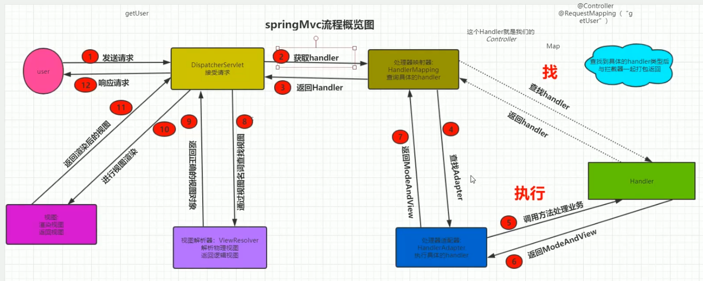

# 请求流程

- 初始化时，将controller和requestmapping的注解以map形式存入handler中
- 查找适配器：处理不同方式注册的controller，找到对应的controller后，调用对应的方法，返回对应的modeandview
- 通过viewresolver来解析视图



# DispatcherServlet


我们发现，FrameworkServlet都实现了doget方法，最终走processRequest这个方法

```java
public abstract class FrameworkServlet extends HttpServletBean implements ApplicationContextAware {
    @Override
	protected final void doGet(HttpServletRequest request, HttpServletResponse response)
			throws ServletException, IOException {

		processRequest(request, response);
	}
	@Override
	protected final void doPost(HttpServletRequest request, HttpServletResponse response)
			throws ServletException, IOException {

		processRequest(request, response);
	}
```

processRequest最终进入doDispatch方法

```java
protected void doDispatch(HttpServletRequest request, HttpServletResponse response) throws Exception {
    try {
        //检查是否时文件上传
		processedRequest = checkMultipart(request);
        //寻找controller
        mappedHandler = getHandler(processedRequest);
        //获取具体的适配器
        HandlerAdapter ha = getHandlerAdapter(mappedHandler.getHandler());
        //执行业务逻辑
        mv = ha.handle(processedRequest, response, mappedHandler.getHandler());
```

getHandler方法获取对应的controller

```java
@Override
public final HandlerExecutionChain getHandler(HttpServletRequest request) throws Exception {
   Object handler = getHandlerInternal(request);
   if (handler == null) {
      handler = getDefaultHandler();
   }
   if (handler == null) {
      return null;
   }
   // Bean name or resolved handler?
   if (handler instanceof String) {
      String handlerName = (String) handler;
      handler = getApplicationContext().getBean(handlerName);
   }

   HandlerExecutionChain executionChain = getHandlerExecutionChain(handler, request);
   if (CorsUtils.isCorsRequest(request)) {
      CorsConfiguration globalConfig = this.globalCorsConfigSource.getCorsConfiguration(request);
      CorsConfiguration handlerConfig = getCorsConfiguration(handler, request);
      CorsConfiguration config = (globalConfig != null ? globalConfig.combine(handlerConfig) : handlerConfig);
      executionChain = getCorsHandlerExecutionChain(request, executionChain, config);
   }
   return executionChain;
}
```

# 三种不同的注册方式

- 实现contoller接口、
- httprequesthandler接口
- @Controller注解

## HandlerAdapter执行方式

- 如果时继承了接口方式，就通过spring注解调用固定的方法
- 如果时注解方式，则通过反射调用 

## 如何通过反射执行

在这个方法中执行


```java
public class RequestMappingHandlerAdapter extends AbstractHandlerMethodAdapter
		implements BeanFactoryAware, InitializingBean {
protected ModelAndView invokeHandlerMethod(HttpServletRequest request,
      HttpServletResponse response, HandlerMethod handlerMethod) throws Exception {
      invocableMethod.invokeAndHandle(webRequest, mavContainer);
```

```java
public void invokeAndHandle(ServletWebRequest webRequest, ModelAndViewContainer mavContainer,
      Object... providedArgs) throws Exception {

   Object returnValue = invokeForRequest(webRequest, mavContainer, providedArgs);
```

```
public Object invokeForRequest(NativeWebRequest request, ModelAndViewContainer mavContainer,
      Object... providedArgs) throws Exception {
	//获取方法所需要的数组
   Object[] args = getMethodArgumentValues(request, mavContainer, providedArgs);
```

