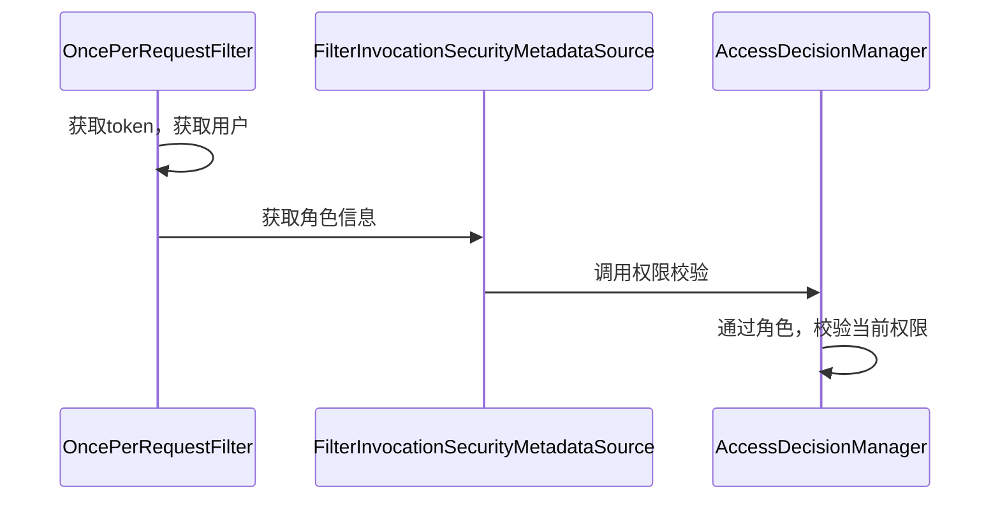

#  基础

## demo搭建

- 引入jar包

```xml
<dependency>
    <groupId>org.projectlombok</groupId>
    <artifactId>lombok</artifactId>
</dependency>

<dependency>
    <groupId>org.springframework.boot</groupId>
    <artifactId>spring-boot-starter-web</artifactId>
</dependency>
<dependency>
    <groupId>org.springframework.boot</groupId>
    <artifactId>spring-boot-starter-security</artifactId>
</dependency>
```

- 运行访问
  - 默认用户名为user
  - 密码为启动的时候的日志：Using generated security password: 57fee683-efaf-4e38-9a18-02dad9703f17

## 基本原理

- security本质是一个过滤器链

### 常见过滤器

- FilterSecurityInterceptor
  - 方法级别的权限过滤器
  - 位于过滤链的最底层

- ExceptionTranslationFilter
  - 处理认证过程中抛出的异常
- UsernamePasswordAuthenticationFilter


## 登录方式

### 配置文件方式

```yaml
spring:
  security:
    user:
      name: test
      password: test
```

### 配置类的方式

```java
@Configuration
public class SecurityConfig extends WebSecurityConfigurerAdapter {
    @Override
    public void configure(AuthenticationManagerBuilder auth) throws Exception {
        BCryptPasswordEncoder passwordEncoder = new BCryptPasswordEncoder();
        String password = passwordEncoder.encode("123");
        //设置用户名test,密码123，角色为admin
        auth.inMemoryAuthentication().withUser("test").password(password).roles("admin");
    }

    /**
     * 密码加密方式
     * @return
     */
    @Bean
    public PasswordEncoder passwordEncoder() {
        return new BCryptPasswordEncoder();
    }
}
```

### 自定义模式

- 实现service，返回用户名密码角色
  - 当登录的时候，传入username，通过username查询出用户，返回，交给框架权限判断

```java
@Service
public class MyUserDetailsServiceImpl implements UserDetailsService {
    @Override
    public UserDetails loadUserByUsername(String username) throws UsernameNotFoundException {
        List<GrantedAuthority> role = AuthorityUtils.commaSeparatedStringToAuthorityList("role");
        return new User("test", new BCryptPasswordEncoder().encode("1234"), role);
    }
}
```


# 核心概念

## 核心类

| 类名                   | 描述                                                         |
| ---------------------- | ------------------------------------------------------------ |
| AuthenticationManager  | 用户认证的管理的接口，所有的认证请求（比如login）都会提交给AuthenticationManager.authenticate()方法来实现,当然事情肯定不是它来做，具体校验动作会由AuthenticationManager将请求转发给具体的实现类来做。根据实现反馈的结果再调用具体的Handler来给用户以反馈 |
| AuthenticationProvider | 认证的具体实现类，一个provider是一种认证方式的实现,一个AuthenticationManager可以包含多个Provider，每个provider通过实现一个support方法来表示自己支持哪种Token的认证 |
| UserDetailService      | 用户认证通过Provider来做，UserDetailService提高认证的用户    |
| AuthenticationToken    | 所有提交给AuthenticationManager的认证请求都会被封装成一个Token的实现 |
| SecurityContext        | 当用户通过认证之后，就会为这个用户生成一个唯一的SecurityContext，里面包含用户的认证信息Authentication。通过SecurityContext我们可以获取到用户的标识Principle和授权信息GrantedAuthrity。在系统的任何地方只要通过SecurityHolder.getSecruityContext()就可以获取到SecurityContext |

## 核心过滤器

| 拦截器                                  | 释义                                                         |
| --------------------------------------- | ------------------------------------------------------------ |
| HttpSessionContextIntegrationFilter     | **位于过滤器顶端，第一个起作用的过滤器**。用途一，在执行其他过滤器之前，率先判断用户的session中是否已经存在一个SecurityContext了。如果存在，就把SecurityContext拿出来，放到SecurityContextHolder中，供Spring Security的其他部分使用。如果不存在，就创建一个SecurityContext出来，还是放到SecurityContextHolder中，供Spring Security的其他部分使用。用途二，在所有过滤器执行完毕后，清空SecurityContextHolder，因为SecurityContextHolder是基于ThreadLocal的，如果在操作完成后清空ThreadLocal，会受到服务器的线程池机制的影响。 |
| LogoutFilter                            | 只处理注销请求，默认为/j_spring_security_logout。用途是在用户发送注销请求时，销毁用户session，清空SecurityContextHolder，然后重定向到注销成功页面。可以与rememberMe之类的机制结合，在注销的同时清空用户cookie。 |
| AuthenticationProcessingFilter          | 处理form登陆的过滤器，与form登陆有关的所有操作都是在此进行的。默认情况下只处理/j_spring_security_check请求，这个请求应该是用户使用form登陆后的提交地址此过滤器执行的基本操作时，通过用户名和密码判断用户是否有效，如果登录成功就跳转到成功页面（可能是登陆之前访问的受保护页面，也可能是默认的成功页面），如果登录失败，就跳转到失败页面。 |
| DefaultLoginPageGeneratingFilter        | 此过滤器用来生成一个默认的登录页面，默认的访问地址为/spring_security_login，这个默认的登录页面虽然支持用户输入用户名，密码，也支持rememberMe功能，但是因为太难看了，只能是在演示时做个样子，不可能直接用在实际项目中。 |
| BasicProcessingFilter                   | 此过滤器用于进行basic验证，功能与AuthenticationProcessingFilter类似，只是验证的方式不同。 |
| SecurityContextHolderAwareRequestFilter | 此过滤器用来包装客户的请求。目的是在原始请求的基础上，为后续程序提供一些额外的数据。比如getRemoteUser()时直接返回当前登陆的用户名之类的。 |
| RememberMeProcessingFilter              | 此过滤器实现RememberMe功能，当用户cookie中存在rememberMe的标记，此过滤器会根据标记自动实现用户登陆，并创建SecurityContext，授予对应的权限。 |
| AnonymousProcessingFilter               | 为了保证操作统一性，当用户没有登陆时，默认为用户分配匿名用户的权限。 |
| ExceptionTranslationFilter              | 此过滤器的作用是处理中FilterSecurityInterceptor抛出的异常，然后将请求重定向到对应页面，或返回对应的响应错误代码 |
| SessionFixationProtectionFilter         | 防御会话伪造攻击。有关防御会话伪造的详细信息                 |
| FilterSecurityInterceptor               | 用户的权限控制都包含在这个过滤器中。功能一：如果用户尚未登陆，则抛出AuthenticationCredentialsNotFoundException“尚未认证异常”。功能二：如果用户已登录，但是没有访问当前资源的权限，则抛出AccessDeniedException“拒绝访问异常”。功能三：如果用户已登录，也具有访问当前资源的权限，则放行。我们可以通过配置方式来自定义拦截规则 |

# 自定义模式


## 自定义登录

- 新建登录页

```html
<!DOCTYPE html>
<html lang="en" xmlns:th="http://www.w3.org/1999/xhtml">
<head>
    <meta charset="UTF-8">
    <title>第一个HTML页面</title>
</head>
<html lang="en">
<head>
    <meta charset="UTF-8">
    <title>Title</title>
</head>
<body>
自定义表单验证:
<form name="f" action="/demo/login" method="post">
    <br/>
    用户名:
    <input type="text" name="username" placeholder="name"><br/>
    密码:
    <input type="password" name="password" placeholder="password"><br/>
    <input name="submit" type="submit" value="提交">
</form>
</body>
</html>
```

- 在config中配置登录事项

```java
@Override
protected void configure(HttpSecurity http) throws Exception {
    http.formLogin()
        .loginPage("/login.html")  //自定义登录页面
        .loginProcessingUrl("/demo/login") //登录提交的地址
        .successForwardUrl("/demo/login")//登录成功访问
        .failureForwardUrl("/demo/error"); //登录失败
    http.authorizeRequests()
            //不需要认证的页面
            .antMatchers("/login.html").permitAll()
            //所有请求都必须通过认证
            .anyRequest().authenticated();

    http.csrf().disable();
}
```

## 自定义登录参数名

在默认登录中，必须是post请求，并且参数是username password

这是因为有默认的登录过滤器

UsernamePasswordAuthenticationFilter

```java
public class UsernamePasswordAuthenticationFilter extends
      AbstractAuthenticationProcessingFilter {
    //默认参数
   public static final String SPRING_SECURITY_FORM_USERNAME_KEY = "username";
   public static final String SPRING_SECURITY_FORM_PASSWORD_KEY = "password";

   private String usernameParameter = SPRING_SECURITY_FORM_USERNAME_KEY;
   private String passwordParameter = SPRING_SECURITY_FORM_PASSWORD_KEY;
   //请求方式
   private boolean postOnly = true;
```

- 如果想自定义参数名，可以在配置类如此修改

```java
@Override
    protected void configure(HttpSecurity http) throws Exception {
        http.formLogin()
                .usernameParameter("username123")
                .passwordParameter("password123")
```

## 使用自定义认证

- 创建一个类继承UsernamePasswordAuthenticationFilter
  - 重写attemptAuthentication方法
    - 这个方法主要就是用来做认证的
  - successfulAuthentication方法：认证成功
  - unsuccessfulAuthentication方法：认证失败
- UserDetailsService
  - 查询数据库和密码的方法写在这个接口

## 自定义登陆成功跳转

## 自定义跳转外链

- 查看源码

```java
.successForwardUrl("/demo/login")//登录成功访问
```

```java
public FormLoginConfigurer<H> successForwardUrl(String forwardUrl) {
   successHandler(new ForwardAuthenticationSuccessHandler(forwardUrl));
```

```java
public void onAuthenticationSuccess(HttpServletRequest request, HttpServletResponse response, Authentication authentication) throws IOException, ServletException {
   request.getRequestDispatcher(forwardUrl).forward(request, response);
}
```

- 他其实就是实现了AuthenticationSuccessHandler进行请求装发

- 我们自己也可以实现

```java
public class MyAuthenticationSuccessHandler implements AuthenticationSuccessHandler {
    private String url;

    public MyAuthenticationSuccessHandler(String url) {
        this.url = url;
    }

    @Override
    public void onAuthenticationSuccess(HttpServletRequest request, HttpServletResponse response, Authentication authentication) throws IOException, ServletException {
        //进行重定向
        response.sendRedirect(url);
    }
}
```

- 在配置类中配置

```
//.successForwardUrl("/demo/login")//登录成功访问
.successHandler(new MyAuthenticationSuccessHandler("www.baidu.com"))
```

##  Authentication authentication

```java
//获取权限
Collection<? extends GrantedAuthority> getAuthorities();
//获取权限 密码
Object getCredentials();
```

## 替换默认过滤器

- filter替换的过滤器
- 被替换的过滤器

```java
HttpSecurity addFilterAt(Filter filter, Class<? extends Filter> atFilter) 
```

# 授权

## anyRequest

- 表示所有请求

- anyRequest必须在antMatchers之后（放最后），他是有顺序执行的

```java
//不需要认证的页面
.antMatchers("/login.html").permitAll()
//所有请求都必须通过认证
.anyRequest().authenticated();
```

## antMatchers

- 通配符有三种：
  ? 匹配任何单字符
  \* 匹配0或者任意数量的字符
  ** 匹配0或者更多的目录

## regexMatchers

- 正则匹配 

## 内置控制方法

```java
static final String permitAll = "permitAll";
//禁止
private static final String denyAll = "denyAll";
//匿名
private static final String anonymous = "anonymous";
//认证
private static final String authenticated = "authenticated";
// 输入了用户密码登录的
private static final String fullyAuthenticated = "fullyAuthenticated";
// 免登陆需要进入这些路径
private static final String rememberMe = "rememberMe";
```

# 权限控制

- 拥有某某权限

```java  
.antMatchers("/demo/index").hasAnyAuthority("index")
```

## 自定义403

- 定义一个异常处理handler

```java
@Component
public class MyAccessDeniedHandler implements AccessDeniedHandler {
    @Override
    public void handle(HttpServletRequest request, HttpServletResponse response, AccessDeniedException accessDeniedException) throws IOException, ServletException {
        response.setStatus(HttpServletResponse.SC_FORBIDDEN);
        PrintWriter writer = response.getWriter();
        writer.write("error");
        writer.flush();
        writer.close();
    }
}
```

- 注入到处理器中

```java
http.exceptionHandling().accessDeniedHandler(accessDeniedHandler);
```

## 基于access控制

- 上面的hasAnyAuthority本质上都是基于access表达式来控制的
- 具体有哪些表达式可以官网查询


- 使用示例

```java
.antMatchers("/demo/index.html").access("hasAnyAuthority('index')")
```

## 自定义access

```java
@Component
public class MyServiceImpl implements MyService {

    @Override
    public Boolean hasPermission(HttpServletRequest request, Authentication authentication) {
        Collection<? extends GrantedAuthority> authorities = authentication.getAuthorities();
        //判断权限
        return authorities.contains(new SimpleGrantedAuthority("role1"));
    }
}
```

```java
//所有权限都走自定义认证
.anyRequest().access("@myServiceImpl.hasPermission(request, authentication)");
```

## 异常处理

- **ExceptionTranslationFilter** 能够捕获来自 FilterChain 所有的异常
- 但是它只会处理两类异常：
  AuthenticationException 和 AccessDeniedException，其它的异常它会继续抛出

# 基于注解开发


# 源码分析

## 配置类加载

- 在EnableWebSecurity中，启动了EnableWebSecurity配置
- 在*WebSecurityConfiguration*配置类，会创建一个名为SpringSecurityFilterChain的Servlet过滤器，类型为
  org.springframework.security.web.FilterChainProxy，它实现了javax.servlet.Filter，因此外部的请求会经过此类


- FilterChainProxy是一个代理，真正起作用的是FilterChainProxy中SecurityFilterChain所包含的各个Filter
- Filter不直接进行直接的认证操作和权限判断操作，它们交给了认证管理器（AuthenticationManager）和决策管理器 （AccessDecisionManager）进行处理


## Filter顺序

- 在webSecurity.build()的时候，调用HttpSecurity#performBuild方法，进行filter的排序


- 在FilterComparator中的构造方法中，会初始化filter信息


## 过滤器初始化

- springboot已经通过自动装配配置了这些过滤器
- springboot通过org.springframework.web.filter.DelegatingFilterProxy来加载的过滤器的
- 项目启动后，访问连接，进入这个DelegatingFilterProxy类
- 在这个类的doFilter方法中

```java
if (delegateToUse == null) {
   WebApplicationContext wac = findWebApplicationContext();
   if (wac == null) {
      throw new IllegalStateException("No WebApplicationContext found: " +
            "no ContextLoaderListener or DispatcherServlet registered?");
   }
   delegateToUse = initDelegate(wac);
}
```

- 有一个doFilter ---> initDelegate方法
  - 在初始化方法中，从wac.getBean获取org.springframework.security.web.FilterChainProxy的过滤器

```
protected Filter initDelegate(WebApplicationContext wac) throws ServletException {
   String targetBeanName = getTargetBeanName();
   Assert.state(targetBeanName != null, "No target bean name set");
   Filter delegate = wac.getBean(targetBeanName, Filter.class);
   if (isTargetFilterLifecycle()) {
      delegate.init(getFilterConfig());
   }
   return delegate;
}
```

- FilterChainProxy --->doFilter调用doFilterInternal方法
- doFilterInternal

```java
FirewalledRequest fwRequest = firewall
				.getFirewalledRequest((HttpServletRequest) request);
HttpServletResponse fwResponse = firewall
    .getFirewalledResponse((HttpServletResponse) response);
//获取过滤器链的集合
List<Filter> filters = getFilters(fwRequest);
```

- doFilterInternal---->getFilters

# 自定义Token校验

## 认证流程


## 校验流程




## 登录模块

### 封装登录请求实体

```java
public class JwtLoginToken extends AbstractAuthenticationToken {

    //用户主体
    private final Object principal;
    //用户密码
    private Object credentials;


    public JwtLoginToken(Object principal, Object credentials) {
        super(null);
        this.principal = principal;
        this.credentials = credentials;
        setAuthenticated(false);
    }
    
    public JwtLoginToken(Object principal, Object credentials,
                         Collection<? extends GrantedAuthority> authorities) {
        super(authorities);
        this.principal = principal;
        this.credentials = credentials;
        super.setAuthenticated(true);
    }

    @Override
    public Object getCredentials() {
        return credentials;
    }
    @Override
    public Object getPrincipal() {
        return principal;
    }
}
```


### 登录拦截器

- 获取参数username,password 来获取提交的用户名和密码
- getAuthenticationManager().来获取用户认证的管理类 

```java
public class JwtLoginFilter extends UsernamePasswordAuthenticationFilter {

    @Override
    public Authentication attemptAuthentication(HttpServletRequest request, HttpServletResponse response) throws AuthenticationException {
        String username = super.obtainUsername(request);
        String password = super.obtainPassword(request);
        //创建未认证的凭证
        JwtLoginToken jwtLoginToken = new JwtLoginToken(username, password);
        //设置请求地址，sessionid
        jwtLoginToken.setDetails(new WebAuthenticationDetails(request));
        //生成已认证的凭证
        Authentication authenticate = super.getAuthenticationManager().authenticate(jwtLoginToken);
        return authenticate;
    }
}
```

### 用户认证

- 校验动作会由`AuthenticationManager`将请求转发给具体的实现类来做。我们这里的实现类即 `JwtAuthenticationProvider`
- authenticate进行认证校验
- 如果UserDetails.getPassword() 与 JwtLoginToken 的 credentials 不匹配，则抛出BadCredentialsException异常

```java
public class JwtAuthenticationProvider implements AuthenticationProvider {

    private UserDetailsService userDetailsService;

    private PasswordEncoder passwordEncoder;

    public JwtAuthenticationProvider(UserDetailsService userDetailsService, PasswordEncoder passwordEncoder) {
        this.userDetailsService = userDetailsService;
        this.passwordEncoder = passwordEncoder;
    }
    @Override
    public Authentication authenticate(Authentication authentication) throws AuthenticationException {
        UserDetails userDetails = userDetailsService.loadUserByUsername(authentication.getName());
        log.debug("==> 获取用户密码");
        //转换authentication
        JwtLoginToken jwtLoginToken = (JwtLoginToken) authentication;
        //构造已认证的authentication
        JwtLoginToken authenticatedToken = new JwtLoginToken(userDetails, jwtLoginToken.getCredentials(), userDetails.getAuthorities());
        authenticatedToken.setDetails(jwtLoginToken.getDetails());
        return authenticatedToken;
    }

    /**
     * 查看当前authentication是否JwtLoginToken
     * @param authentication
     * @return
     */
    @Override
    public boolean supports(Class<?> authentication) {
        return JwtLoginToken.class.isAssignableFrom(authentication);
    }
}
```

### 查询用户的基本信息

```java
public class JwtUserDetailsService implements UserDetailsService {

    @Autowired
    private PasswordEncoder passwordEncoder;

    @Override
    public UserDetails loadUserByUsername(String username) throws UsernameNotFoundException {
        List<GrantedAuthority> role = AuthorityUtils.commaSeparatedStringToAuthorityList("role");
        return new User("admin", passwordEncoder.encode("123456"), role);
    }
}
```

### 登录成功

- 签发token

```java
@Component
public class JwtLoginSuccessHandler extends SimpleUrlAuthenticationSuccessHandler {

    @Override
    public void onAuthenticationSuccess(HttpServletRequest request, HttpServletResponse response, Authentication authentication) throws IOException {
        response.setContentType("application/json;charset=UTF-8");
        //签发token
        response.getWriter().write("{\"data\": \"aaaaa\"}");
    }

}
```

## token请求

### token过滤器

- 从request中获取token
- 解析出用户实体信息
- 将实体信息封装到上下文中SecurityContextHolder.getContext().setAuthentication(jwtLoginToken);
- 转发

```
public class JwtTokenFilter extends OncePerRequestFilter {
    @Override
    protected void doFilterInternal(HttpServletRequest request, HttpServletResponse response, FilterChain filterChain) throws ServletException, IOException {

        JwtLoginToken jwtLoginToken = new JwtLoginToken("user", null, null);
        jwtLoginToken.setDetails(new WebAuthenticationDetails(request));
        SecurityContextHolder.getContext().setAuthentication(jwtLoginToken);
        filterChain.doFilter(request, response);
    }
}
```

### 获取角色

- 获取当前资源（url）能够访问的角色，将其封装返回

```java
@Component
public class JwtFilterInvocationSecurityMetadataSource implements FilterInvocationSecurityMetadataSource {
    @Override
    public Collection<ConfigAttribute> getAttributes(Object object) throws IllegalArgumentException {
        List<ConfigAttribute> list = SecurityConfig.createList(new String[]{"admin"});
        return list;
    }

    @Override
    public Collection<ConfigAttribute> getAllConfigAttributes() {
        return null;
    }

    @Override
    public boolean supports(Class<?> clazz) {
        return FilterInvocation.class.isAssignableFrom(clazz);
    }
}
```

### 权限校验

- 如果权限不足，抛出AccessDeniedException异常

```java
@Component
@Slf4j
public class JwtAccessDecisionManager implements AccessDecisionManager {
    /**
     *
     * @param authentication 当前用户凭证 -- > JwtTokenFilter中将通过验证的用户保存在Security上下文中, 即传入了这里
     * @param object 当前请求路径
     * @param configAttributes 当前请求路径所需要的角色列表 -- > 从 JwtFilterInvocationSecurityMetadataSource 返回
     * @throws AccessDeniedException
     * @throws InsufficientAuthenticationException
     */
    @Override
    public void decide(Authentication authentication, Object object, Collection<ConfigAttribute> configAttributes) throws AccessDeniedException, InsufficientAuthenticationException {
        log.debug("==> 权限校验{}", configAttributes.toString());
    }

    @Override
    public boolean supports(ConfigAttribute attribute) {
        return false;
    }

    @Override
    public boolean supports(Class<?> clazz) {
        return false;
    }
}
```

## 配置

```java
@Configuration
@EnableWebSecurity
@EnableGlobalMethodSecurity(prePostEnabled = true)
public class SecurityConfig extends WebSecurityConfigurerAdapter {

    @Autowired
    @Qualifier("jwtUserDetailsService")
    private UserDetailsService userDetailsService;

    @Autowired
    private PasswordEncoder passwordEncoder;

    @Autowired
    private FilterInvocationSecurityMetadataSource metadataSource;

    @Autowired
    private AccessDecisionManager accessDecisionManager;

    @Autowired
    private AuthenticationSuccessHandler authenticationSuccessHandler;


    @Bean
    public PasswordEncoder passwordEncoder() {
        return new BCryptPasswordEncoder();
    }

    @Bean
    public JwtUserDetailsService jwtUserDetailsService() {
        return new JwtUserDetailsService();
    }

    @Override
    protected void configure(HttpSecurity http) throws Exception {
        //自定义登录拦截器
        JwtLoginFilter jwtLoginFilter = new JwtLoginFilter();
        jwtLoginFilter.setAuthenticationManager(authenticationManagerBean());
        jwtLoginFilter.setAuthenticationSuccessHandler(authenticationSuccessHandler);

        //用于自定义校验
        JwtAuthenticationProvider jwtAuthenticationProvider = new JwtAuthenticationProvider(userDetailsService, passwordEncoder);
        http.authenticationProvider(jwtAuthenticationProvider)
                .authorizeRequests()
                .withObjectPostProcessor(new ObjectPostProcessor<FilterSecurityInterceptor>() {
                    @Override
                    public <O extends FilterSecurityInterceptor> O postProcess(O object) {
                        //初始化获取到有资格访问当前页面的角色列表
                        object.setSecurityMetadataSource(metadataSource);
                        //初始化校验当前用户是否具备所需要的角色
                        object.setAccessDecisionManager(accessDecisionManager);
                        return object;
                    }
                }).anyRequest().authenticated()
                .and()
                .formLogin()
                .and()
                .sessionManagement()
                //禁用session
                .sessionCreationPolicy(SessionCreationPolicy.STATELESS)
                .and()
                .csrf().disable()
                .addFilterAt(jwtLoginFilter, UsernamePasswordAuthenticationFilter.class)
                .addFilterAfter(new JwtTokenFilter(), JwtLoginFilter.class);;
    }
}
```


# OAUTH2协议

## 名词定义

（1） **Third-party application**：第三方应用程序，又称"客户端"（client）

（2）**HTTP service**：HTTP服务提供商，简称"服务提供商"

（3）**Resource Owner**：资源所有者，又称"用户"（user）。

（4）**User Agent**：用户代理，一般就是指浏览器。

（5）**Authorization server**：认证服务器，即服务提供商专门用来处理认证的服务器。

（6）**Resource server**：资源服务器，即服务提供商存放用户生成的资源的服务器。它与认证服务器，可以是同一台服务器，也可以是不同的服务器。

## 运行流程java

1. 用户打开客户端以后，客户端要求用户给予授权。

2. 用户同意给予客户端授权。

3. 客户端使用上一步获得的授权，向认证服务器申请令牌。

4. 认证服务器对客户端进行认证以后，确认无误，同意发放令牌。

5. 客户端使用令牌，向资源服务器申请获取资源。

6. 资源服务器确认令牌无误，同意向客户端开放资源


## 授权模式

- 授权码模式（authorization code）
  - 如qq登录，跳转到qq授权中心，点授权之后，跳转到第三方应用，获取code
- 简化模式（implicit）
- 密码模式（resource owner password credentials）
  - 如：docker
  - 使用用户名/密码作为授权方式从授权服务器上获取令牌，一般不支持刷新令牌。
- 客户端模式（client credentials）
  - 内部应用一般采用

### 授权码模式

```text
owner: 用户
user-agent: 浏览器
authorization：认证服务器
client：第三个应用
```


## 刷新令牌

## 认证服务器


- 引入jar包

```java
<dependencies>
        <dependency>
            <groupId>org.springframework.cloud</groupId>
            <artifactId>spring-cloud-starter-oauth2</artifactId>
        </dependency>
        <dependency>
            <groupId>org.springframework.boot</groupId>
            <artifactId>spring-boot-starter-web</artifactId>
        </dependency>
    </dependencies>
```

### 自定义密码

```java
@Service
public class MyUserDetailsServiceImpl implements UserDetailsService {

    @Autowired
    private PasswordEncoder passwordEncoder;

    @Override
    public UserDetails loadUserByUsername(String username) throws UsernameNotFoundException {
        List<GrantedAuthority> role = AuthorityUtils.commaSeparatedStringToAuthorityList("admin");
        return new User("test", passwordEncoder.encode("1234"), role);
    }
}
```

### 开启security的认证配置

- 必须要对oauth等路径放行

```java
@Configuration
@EnableWebSecurity
@EnableGlobalMethodSecurity(prePostEnabled = true, securedEnabled = true, jsr250Enabled = true) //全局方法拦截
public class WebSecurityConfig extends WebSecurityConfigurerAdapter {

    @Bean
    public PasswordEncoder passwordEncoder() {
        return new BCryptPasswordEncoder();
    }
    @Override
    protected void configure(HttpSecurity http) throws Exception {
        http.formLogin().permitAll()
                .and().authorizeRequests()
                .antMatchers("/login", "/oauth/authorize", "/oauth/token").permitAll()
                .anyRequest().authenticated()
                .and().csrf().disable();
    }

}

```

## 认证服务器配置

### 基于内存

- 开启认证服务

```java
@Configuration
@EnableAuthorizationServer
public class AuthorizationServerConfig extends AuthorizationServerConfigurerAdapter {

    @Autowired
    private PasswordEncoder passwordEncoder;

    @Override
    public void configure(ClientDetailsServiceConfigurer clients) throws Exception {
        clients.inMemory()
                //clientid
                .withClient("alonelyxiao")
                //秘钥
                .secret(passwordEncoder.encode("1212"))
                //授权范围
                .scopes("all")
                //重定向地址
                .redirectUris("http://www.baidu.com")
                //授权模式
                .authorizedGrantTypes("authorization_code");
    }
}
```

- 在浏览器输入地址http://localhost:81/oauth/authorize?client_id=alonelyxiao&response_type=code
- 进入登录页，输入密码后调整到认证页面，选择允许认证
- 页面调整到百度页面（上面配置的）https://www.baidu.com/?code=awaudB
- 拿到code，在postman使用

### PostMan使用

#### 获取token

- http://192.168.10.36:81/oauth/token
- Basic Auth 相当于 在head中，传入   Authorization   Basic base64(username:password)

- body

```
code:ElsgHm
grant_type:authorization_code
```


- 也可以如此传输


#### 获取资源


### 基于数据库


### Token存储redis

- 采用TokenStore

- 生成redisstorebean

```java
@Bean
public TokenStore tokenStore(RedisConnectionFactory redisConnectionFactory) {
    return new RedisTokenStore(redisConnectionFactory);
}
```

- 注入使用

```java
private DefaultTokenServices createDefaultTokenServices() {
    DefaultTokenServices tokenServices = new DefaultTokenServices();
    tokenServices.setTokenStore(tokenStore);
    tokenServices.setSupportRefreshToken(true);
    tokenServices.setReuseRefreshToken(true);
    return tokenServices;
}

@Override
public void configure(AuthorizationServerEndpointsConfigurer endpoints) throws Exception {
    endpoints.tokenServices(createDefaultTokenServices());
}
```

## 资源服务器

```java
@Configuration
@EnableResourceServer
public class ResourceConfig extends ResourceServerConfigurerAdapter {

       @Override
       public void configure(HttpSecurity http) throws Exception {
           http.authorizeRequests().anyRequest().authenticated()
                   .and().requestMatchers().antMatchers("/user/**");
       }

}
```

## 认证服务源码分析

- AuthorizationServerConfigurerAdapter 

```java
public class AuthorizationServerConfigurerAdapter implements AuthorizationServerConfigurer {

   @Override
   public void configure(AuthorizationServerSecurityConfigurer security) throws Exception {
       //配置AuthorizationServer安全认证的相关信息，创建ClientCredentialsTokenEndpointFilter核心过滤器
   }

   @Override
   public void configure(ClientDetailsServiceConfigurer clients) throws Exception {
       //配置OAuth2的客户端相关信息
   }

   @Override
   public void configure(AuthorizationServerEndpointsConfigurer endpoints) throws Exception {
       //配置AuthorizationServerEndpointsConfigurer众多相关类，包括配置身份认证器，配置认证方式，TokenStore，TokenGranter，OAuth2RequestFactory
   }

}
```