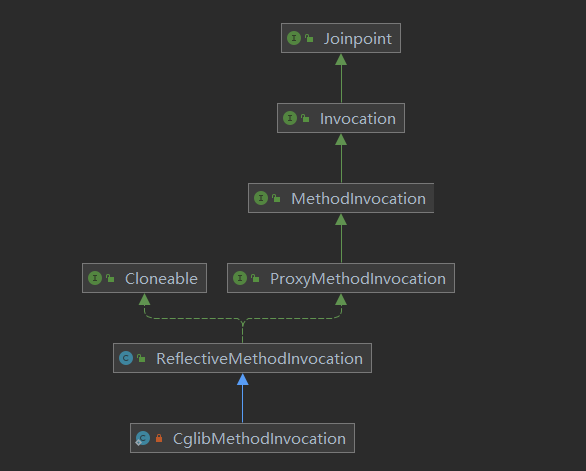

# Spring 对Aspectj的支持，是它的注解的支持，不是对它的编译器和语法的支持

# Aop Api整体设计

## Joinpoint

`org.aopalliance.intercept.Joinpoint`   
用于执行对应的方法



-  CglibMethodInvocation

基于cglib

-  ReflectiveMethodInvocation

基于反射

## Pointcut

- joinpoint 条件接口
- **所以它主要包含两个过滤**，一个是方法过滤，一个是类型过滤

两个

```java
public interface Pointcut {
   //判断类是不是符合
   ClassFilter getClassFilter();
   //判断方法是否符合
   MethodMatcher getMethodMatcher();
```

### 便利实现

> 静态：StaticMethodMatcherPointcut

实现他的matches方法，在这个方法里写条件，来判断是否拦截方法

如：

```java
public class EchoMatcherService extends StaticMethodMatcherPointcut {
    @Override
    public boolean matches(Method method, Class<?> targetClass) {
        return true;
    }
}
```

> 正则表达式：JdkRegexpMethodPointcut


> 控制流： ControlFlowPointcut

## AspectJ实现

> 实现类：org.springframework.aop.aspectj.AspectJExpressionPointcut

> 表达式：PointcutExpression

- 里面有两种匹配模式: 方法和构造器
- spring只实现了方法级别

`spring桥接了AspectJ的语法`

## Advice

- 执行动作接口

- spring对其做前置动作还是后置动作还是围绕动作的api

- 所有的advice的底层实现都是MethodInterceptor落地实现的

>  Interceptor

首先它本身就是Advice

其实他相当于around advice

> BeforeAdvice

- 具体实现：org.springframework.aop.framework.adapter.MethodBeforeAdviceInterceptor

- 所有的beforeadvice拦截都来自于MethodBeforeAdviceInterceptor
- 有多少个beforeadvice就会有多少个MethodBeforeAdviceInterceptor
- 执行beforeadvice就是下面方法的调用

```java
@Override
public Object invoke(MethodInvocation mi) throws Throwable {
   this.advice.before(mi.getMethod(), mi.getArguments(), mi.getThis());
   return mi.proceed();
}
```

> BeforeAdvice 的 AspectJ实现

- 目标实现：AspectJMethodBeforeAdvice

> AfterAdvice

- 具体实现：

org.springframework.aop.framework.adapter.ThrowsAdviceInterceptor

> 如何筛选执行的方法
>
> AspectJ根据表达式寻找对应的方法，在org.springframework.aop.aspectj.AbstractAspectJAdvice中


>  AfterReturning 是如何被调用的

- 如果：@AfterReturning是怎么被调用的

```java
@AfterReturning("anyPublicMethod()")
public void afterReturningMethod() {
    System.out.println("afterReturning method");
}
```

 AspectJAfterReturningAdvice = AfterReturningAdvice

 AfterReturningAdviceInterceptor 关联了 AfterReturningAdvice(AfterReturningAdvice最终会变成AfterReturningAdviceInterceptor ),如下：

```java
public class AfterReturningAdviceInterceptor {

   private final AfterReturningAdvice advice;
```

AfterReturningAdviceInterceptor = MethodInterceptor

所有的MethodInterceptor都会被spring 调用

*最终调用逻辑*：

AfterReturningAdviceInterceptor 

->调用 AspectJAfterReturningAdvice#afterReturning 

->调用 AbstractAspectJAdvice#invokeAdviceMethodWithGivenArgs


## Advisor

- Advice 容器接口
- 包含了一个advice
- 可以结合pointcut来做一个接口上的约束

>  PointcutAdvisor

将pointCut和 advice关联起来 

spring的底层通过这个接口的实现来获取pointcut 和 advice


## Introduction

>  Introduction与 Advisor的连接器

接口：org.springframework.aop.IntroductionAdvisor

**IntroductionAdvisor只关心类的过滤，其他类下面的所有方法，默认都是true**

> 使用场景

当我们一个类	，实现了A B 两个接口，如果我们只需要代理A接口，此时，我们就可以使用Introduction

## AdvisorAdapter

```java
//是否支持这个advice
boolean supportsAdvice(Advice advice);

MethodInterceptor getInterceptor(Advisor advisor);
```

> 实现示例

- supportsAdvice提供所支持的advice
- getInterceptor提供MethodBeforeAdviceInterceptor

```java
class MethodBeforeAdviceAdapter implements AdvisorAdapter, Serializable {

   @Override
   public boolean supportsAdvice(Advice advice) {
      return (advice instanceof MethodBeforeAdvice);
   }

   @Override
   public MethodInterceptor getInterceptor(Advisor advisor) {
      MethodBeforeAdvice advice = (MethodBeforeAdvice) advisor.getAdvice();
      return new MethodBeforeAdviceInterceptor(advice);
   }

}
```

> AdvisorAdapter的注册

org.springframework.aop.framework.adapter.DefaultAdvisorAdapterRegistry

可以通过DefaultAdvisorAdapterRegistry#registerAdvisorAdapter注册新的AdvisorAdapter

## AopProxy

>  AopProxyFactory

默认实现：DefaultAopProxyFactory

我们也可以根据org.springframework.aop.framework.ProxyCreatorSupport#ProxyCreatorSupport(org.springframework.aop.framework.AopProxyFactory)来动态替换默认实现


## AdvisedSupport

- 包含了一些ProxyConfig必要信息

> 三大特性

1. 配置
2. 产生代理对象
3. 事件关联

## AdvisedSupportListener

事件监听器


```java
//激活
void activated(AdvisedSupport advised);
//advice变更时调用
void adviceChanged(AdvisedSupport advised);
```

## ProxyFactory

- AdvisedSupport的标准实现

## AspectJProxyFactory


>  AspectFactory读取注解的方式，进行方法的拦截

```java
//被代理对象
Map<String, String> map = new HashMap<>();
AspectJProxyFactory aspect = new AspectJProxyFactory(map);
//添加配置类
aspect.addAspect(AspectConfiguration.class);
//获取代理对象
Map<String, String> proxy = aspect.getProxy();
//我们在执行代理对象的方法时候，能够执行AspectConfiguration配置的类
proxy.put("laoxiao", "laoxiao");
```

- 配置类

```java
@Aspect
public class AspectConfiguration {
    /**
     * 定义一个point cut 可以拦截public 任何方法
     */
    @Pointcut("execution(public * *(..))")
    private void anyPublicMethod() {
    }
    /**
     * 定义拦截前的方法执行
     */
    @Before("anyPublicMethod()")
    public void beforeMethod() {
        System.out.println("before method");
    }
}
```

> >  aspect.addAspect(AspectConfiguration.class)解析

- 进入addAspect方法
- 调用createAspectMetadata方法
  - 获取AspectMetadata元信息
- 调用createAspectInstanceFactory方法
  - 调用getSingletonAspectInstance方法
    - 获取配置类的实例
- 调用addAdvisorsFromAspectInstanceFactory方法
  - 调用ReflectiveAspectJAdvisorFactory#getAdvisors 方法
    - 调用getAdvisorMethods方法
      - 获取advice挑选的执行方法
      - 如果是同一个advice则通过order注解来进行排序
    - 调用getAdvisor方法
      - 调用ReflectiveAspectJAdvisorFactory#getPointcut方法

# IOC容器自动代理

## 标准实现

org.springframework.aop.framework.autoproxy.AbstractAutoProxyCreator

> 三个实现

1. 默认实现：DefaultAdvisorAutoProxyCreator
2. bean名称实现：BeanNameAutoProxyCreator
   1. 通过bean的名称进行配置拦截
3. Infrastructure实现：InfrastructureAdvisorAutoProxyCreator

## Aspectj实现

 AspectJAwareAdvisorAutoProxyCreator

**AspectJAwareAdvisorAutoProxyCreator是在解析< aop:config/>AOP标签时注册的一个bean定义，专门用于创建代理对象，实现AOP的核心功能**


## AopInfrastructureBean

- 一个标记接口
- 它的实现不会被再次代理

# Aop辅助工具类

## 上下文辅助类

org.springframework.aop.framework.AopContext

- 可以用来在代理方法中获取当前的代理对象（但是前提是需要将这个aop设置为可暴露到上下文）】

## 工厂工具类


## AOP工具类

 AopUtils

-  isAopProxy：是否为代理对象
-  isJdkDynamicProxy： 是否为jdk代理对象
-  isCglibProxy： 是否为CGLIB代理对象
-  getTargetClass： 从对象中获取目标类型
-  invokeJoinpointUsingReflection：使用Java反射调用Joinpoint(目标方法)


