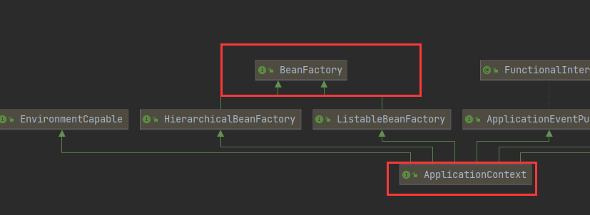

# IOC容器的职责

- 实现与应用解耦

- 依赖处理
  - 依赖查找：如通过名称去查找
  - 依赖注入

# IOC和DI的区别

- IOC是站在对象的角度，对象实例化及其管理的权利交给了（反转)给了容器
- 容器会把对象依赖的其他对象注入(送进去)，比如A对象实例化过程中因为声明了一个B类型的属性，那么就需要容器把B对象注入给A

# IOC依赖来源

- 自定义bean：我们自定义的bean
- 内建的bean
- 容器内建依赖：beanfactory
- IoC中，依赖查找和依赖注入的数据来源并不一样。因为BeanFactory、ResourceLoader、ApplicationEventPublisher、ApplicationContext这四个并不是Bean，它们只是一种特殊的依赖项，无法通过依赖查找的方式来获取，只能通过依赖注入的方式来获取。

## ApplicationContext

- applicationContext是BeanFactory子接口
- 他提供了获取上下文，监听的方法



- 查看源码可以得知，application有个getBeanFactory的方法
- 他将BeanFactory组合进来了，所以，applicationContext虽然实现了BeanFactory,但他们是两个东西，一般我们需要beanfactory时，通常用ApplicationContext.getBeanFactory()

## BeanFactory与FactoryBean

- BeanFactory是IOC最基本的**容器**，负责管理bean，它为其他具体的IOC容器提供了最基本的规范
  - 如<b id="blue">ApplicationContext</b>都是BeanFactory的子接口
- FactoryBean是`创建bean的一种方式`，帮助实现负责的初始化操作


> 工厂bean使用

它可以用来创建某个类型的Bean实例，可以让我们自定义Bean的创建过程

```java
public class TestFactoryBean implements FactoryBean<TestBean> {
    //创建对象注入ioc容器中
    public TestBean getObject() throws Exception {
        return new TestBean();
    }

    //是否单例模式
    public boolean isSingleton() {
        return false;
    }

    public Class<?> getObjectType() {
        return TestBean.class;
    }
}
```

```java
@Bean
public TestFactoryBean testFactoryBean(){
    return new TestFactoryBean();
}
```

```java
@Test
public void testBeanConfig2(){

    ApplicationContext applicationContext = new AnnotationConfigApplicationContext(MainConfig.class);
    //TestBean testBean = (TestBean)applicationContext.getBean("testBean");
    System.out.println("容器已加载完");
    //TestBean testBean = (TestBean)applicationContext.getBean("testBean");
    TestBean testBean = (TestBean)applicationContext.getBean("testFactoryBean");
    System.out.println(testBean.getClass());
}
```

输出结果，可以看到虽然获取的是testFactoryBean，但其类型时testbean类型

容器已加载完
class com.xiao.entry.TestBean ...

# 注入方式

- 手动模式
  - xml资源模式  <bean name></bean>
  - java注解模式 @Bean
  - API配置原信息：applicationContext.registerBeanDefinition(name, beanDefinitionBuilder.getBeanDefinition());

```tex
 命名的方式： registry.registerBeanDefinition(name, beanDefinitionBuilder.getBeanDefinition());
 非命名方式： BeanDefinitionReaderUtils.registerWithGeneratedName(beanDefinitionBuilder.getBeanDefinition(), registry);
```


```java
public static void main(String[] args) {
    AnnotationConfigApplicationContext applicationContext = new AnnotationConfigApplicationContext(AnnotationBeanDefinitionDemo.class);

    //命名的方式注册
    registryBeanDefinition(applicationContext, "my-person");
    //非命名的方式
    registryBeanDefinition(applicationContext);

    //获取bean信息
    System.out.println(applicationContext.getBeansOfType(Person.class));
    applicationContext.close();
}

private static void registryBeanDefinition(BeanDefinitionRegistry registry, String name) {
    //1. 定义相关类的元信息
    BeanDefinitionBuilder beanDefinitionBuilder 
        = BeanDefinitionBuilder.genericBeanDefinition(Person.class);
    beanDefinitionBuilder
        .addPropertyValue("name", "张三")
        .addPropertyValue("age", 12);
    if(StringUtils.isEmpty(name)) {
        //2.将元信息注入进入容器中
        BeanDefinitionReaderUtils.registerWithGeneratedName(beanDefinitionBuilder.getBeanDefinition(), registry);
        return;
    }
    //2.将元信息注入进入容器中
    registry.registerBeanDefinition(name, beanDefinitionBuilder.getBeanDefinition());

}

private static void registryBeanDefinition(BeanDefinitionRegistry registry) {
    registryBeanDefinition(registry, null);
}
```
*日志显示*
可以看到，非命名的方式#0，带了序号

```log
{my-person=Person(name=张三, age=12), com.xiao.pojo.Person#0=Person(name=张三, age=12)}
```


- 构造器注入 constructor
- setter注入的缺陷：setter注入是无序的，构造器注入是有序的
- 字段注入


> @Autowired

自动装配位置：构造函数、set方法上、参数上

在有参构造方法中，默认会寻找参数所注入的bean，如：这个时候，默认注入的就是testBean

```java
@Service
public class TestService {
    private TestBean testBean;

    public TestService(TestBean testBean) {
        this.testBean = testBean;
    }
```


## 接口回调注入

*Aware系列回调*：一般有Aware结尾的，都会有回调的方法，在bean初始化过程会去回调实现类aware接口的类

- BeanFactoryAware
- ApplicationContextAware：<b id="blue">BeanFactory</b>可以通过<b id="blue">ApplicationContextAware</b>来获取，也可以通过<b id="blue">BeanFactoryAware</b>回调来获取


```java
@Component
public class Red implements ApplicationContextAware, BeanNameAware,EmbeddedValueResolverAware {

    public void setApplicationContext(ApplicationContext applicationContext) throws BeansException {
        System.out.println("获取容器信息:"+applicationContext.getClass());
    }

    public void setBeanName(String s) {
        System.out.println("获取该类的beanname："+s);
    }

    public void setEmbeddedValueResolver(StringValueResolver stringValueResolver) {
        System.out.println("取出容器加载配置文件的属性值："+stringValueResolver.resolveStringValue("${testBean.realName}"));
    }
}
```

输出结果：

获取该类的beanname：red
取出容器加载配置文件的属性值：真实的张三
获取容器信息:class org.springframework.context.annotation.AnnotationConfigApplicationContext


## 限定注入

*使用注解@Qualifier限定*：通过Bean名称限定，通过分组限定

如下：因为<b id="gray"> private List<Person> persons2</b>标注了`@Qualifier`注解，所以它只会注入标注了`@Qualifier`的bean

```java
public class QualifierDependencyDemo {

    @Autowired
    private List<Person> persons;
    @Autowired
    @Qualifier
    private List<Person> persons2;
    public static void main(String[] args) {
        AnnotationConfigApplicationContext applicationContext = new AnnotationConfigApplicationContext();
        applicationContext.register(QualifierDependencyDemo.class);
        applicationContext.refresh();

        QualifierDependencyDemo bean = applicationContext.getBean(QualifierDependencyDemo.class);
        //person person1 person2
        System.out.println(bean.persons);
        //person2
        System.out.println(bean.persons2);
        applicationContext.close();
    }
    @Bean
    public SuperPerson superPerson() {
        return new SuperPerson();
    }
    @Bean
    public Person person1() {
        return new Person(1);
    }
    @Bean
    @Qualifier
    public Person person2() {
        return new Person(2);
    }
}
```

*基于注解@Qualifier拓展限定*：

1. 定义一个注解，它标注了Qualifier

```java
@Target({ElementType.FIELD, ElementType.METHOD, ElementType.PARAMETER, ElementType.TYPE, ElementType.ANNOTATION_TYPE})
@Retention(RetentionPolicy.RUNTIME)
@Inherited
@Documented
@Qualifier
public @interface GroupBean {
}
```

2. 使用GroupBean注解(可以看到，GroupBean注解的只有对应的bean，Qualifier有Qualifier和GroupBean注解对应分组的bean)

```java
public class QualifierDependencyDemo {

    @Autowired
    private List<Person> persons;

    @Autowired
    @Qualifier
    private List<Person> persons2;

    @Autowired
    @GroupBean
    private List<Person> persons3;
    public static void main(String[] args) {
        AnnotationConfigApplicationContext applicationContext = new AnnotationConfigApplicationContext();
        applicationContext.register(QualifierDependencyDemo.class);
        applicationContext.refresh();
        QualifierDependencyDemo bean = applicationContext.getBean(QualifierDependencyDemo.class);
        //person person1 person2
        System.out.println(bean.persons);
        //person2, person3
        System.out.println(bean.persons2);
        //person3
        System.out.println(bean.persons3);
        applicationContext.close();
    }
    @Bean
    @GroupBean
    public Person person3() {
        return new Person(3);
    }
}
```

## 优先注入

> @Primary首选bean

@autowired注解注入bean时，默认的时先找同class类型的bean，如果有多个bean，则按照名称注入，此时可以指定@qualifile来注入，但如果不想这样写时，可以用@Primary方式，让这个产生的bean优先注入

```
@Bean
@Primary
public TestBean testBean(){
   return  new TestBean();
}
```

在@bean中，也可以为参数默认注入bean，这个@autowired可以省略

```java
@Bean
@Primary
public TestBean testBean(@Autowired Cat cat){
   return  new TestBean();
}
```

# Spring加载

## Xml方式

1. 定义一个xml的配置文件

```properties
<?xml version="1.0" encoding="UTF-8"?>
<beans xmlns="http://www.springframework.org/schema/beans"
       xmlns:xsi="http://www.w3.org/2001/XMLSchema-instance"
       xmlns:persons="http://www.xiao.org/schema/persons"
       xsi:schemaLocation="http://www.springframework.org/schema/beans
        http://www.springframework.org/schema/beans/spring-beans.xsd
">

    <bean id="person" class="com.xiao.pojo.Person">
        <property name="age" value="12"></property>
        <property name="name" value="老肖"></property>
    </bean>

</beans>
```

2. 加载xml（自定义环境）

```java
ClassPathXmlApplicationContext context
        = new ClassPathXmlApplicationContext("classpath:/META-INF/my-bean.xml");
context.refresh();
Person person = context.getBean(Person.class);
System.out.println(person);
context.close();
```

## 注解方式


## 注解加载XMl

在classpath下建立spring文件，然后在启动类加载配置，就会加载spring文件，产生对应的bean

```java
@ImportResource(locations = "classpath:test.xml")
@SpringBootApplication
public class App2
```


# Bean 作用域
## 原生作用域
> singleton

1. 主要是由BeanDefinition#isSingleton来进行元信息的判断
2. singleton 查找和注入都是同一个同一个对象
3. prototype 查找和注入 都是新生成的对象
4. singleton 有init和destroy  
5. prototype只有init

> request scope

1. 每次返回前端的bean是新生成的
2. 但是后端的bean是cglib提升的，单例的

> ApplicationScope
1. API:ServletContextScope

## 自定义作用域

- 实现scope

```java
public class ThreadLocalScope implements Scope {

    public static final String SCOPE_NAME="thread-local";

    private final NamedThreadLocal<Map<String, Object>> threadLocal = new NamedThreadLocal("thread-local-scope") {
        @Override
        protected Object initialValue() {
            //没有获取到对象是兜底返回
            return new HashMap<>();
        }
    };

    @Override
    public Object get(String name, ObjectFactory<?> objectFactory) {
        Map<String, Object> context = threadLocal.get();
        Object object = context.get(name);
        if(ObjectUtils.isEmpty(object)) {
            object = objectFactory.getObject();
            context.put(name, object);
        }
        return object;
    }

    @Override
    public Object remove(String name) {
        return threadLocal.get().remove(name);
    }

    @Override
    public void registerDestructionCallback(String name, Runnable callback) {

    }

    @Override
    public Object resolveContextualObject(String key) {
        return threadLocal.get().get(key);
    }

    @Override
    public String getConversationId() {
        return String.valueOf(Thread.currentThread().getId());
    }
}
```

- 注入scope

```java
public class ThreadLocalScopeDemo {

    @Bean
    @Scope(ThreadLocalScope.SCOPE_NAME)
    public Person person() {
        return new Person(String.valueOf(Thread.currentThread().getId()));
    }

    public static void main(String[] args) throws Exception {
        AnnotationConfigApplicationContext applicationContext = new AnnotationConfigApplicationContext();
        applicationContext.register(ThreadLocalScopeDemo.class);
        applicationContext.addBeanFactoryPostProcessor(beanFactory -> {
            beanFactory.registerScope(ThreadLocalScope.SCOPE_NAME, new ThreadLocalScope());
        });

        applicationContext.refresh();
        for(int i=0; i<3; i++) {
            new Thread(() -> {
                Person bean = applicationContext.getBean(Person.class);
                System.out.println(bean);
                Person bean1 = applicationContext.getBean(Person.class);
                System.out.println(bean1);
            }).start();
        }
        Thread.sleep(Integer.MAX_VALUE);
        applicationContext.close();
    }
}
```

