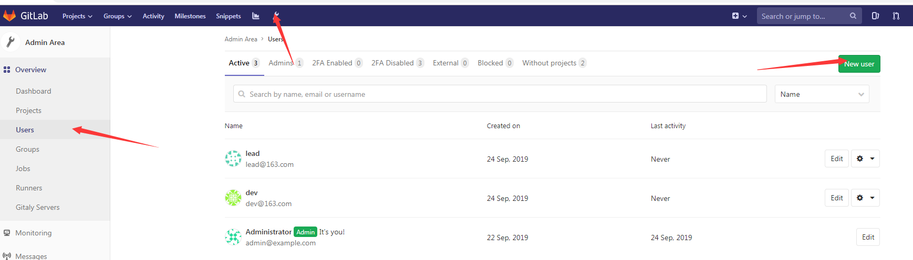
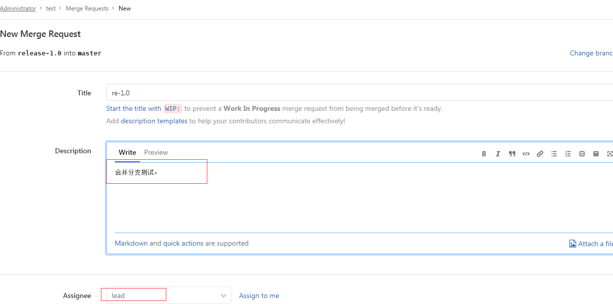

# 持续交付

- 版本控制系统
- 持续集成工具
- 部署工具

# GitLab

GitLab 分布式版本控制

## GitLab安装

```shell
#关闭防火墙
[root@localhost ~]# systemctl stop firewalld
#禁止防火墙开机启动
[root@localhost ~]# systemctl disable firewalld
Removed symlink /etc/systemd/system/multi-user.target.wants/firewalld.service.
Removed symlink /etc/systemd/system/dbus-org.fedoraproject.FirewallD1.service.

```

```shell
##关闭selinux,将里面SELINUX=disabled的值改为disabled，重启linux
[root@localhost ~]# vi /etc/sysconfig/selinux
#重启后查看是否关闭
[root@localhost ~]# getenforce 
Disabled
```

```shell
# 安装依赖
[root@localhost ~]# yum install curl policycoreutils openssh-server openssh-clients postfixs	
```

或者去这个网站下载https://packages.gitlab.com/gitlab/gitlab-ce
```shell
##下载gitlab
[root@localhost ~]# curl https://packages.gitlab.com/install/repositories/gitlab/gitlab-ce/script.rpm.sh | sudo bash

```

```shell
#开启postfix
[root@localhost ~]# systemctl start postfix
[root@localhost ~]# systemctl enable postfix
```

```shell
#启动gitce
[root@localhost ~]# yum -y install gitlab-ce 
```

```shell
# 创建gitlab证书
[root@localhost ~]# mkdir -p /etc/gitlab/ssl
# 创建本地私钥
[root@localhost ~]# openssl genrsa -out "/etc/gitlab/ssl/gitlab.example.com.key" 2048
## 创建证书
[root@localhost gitlab]# openssl req -new -key "/etc/gitlab/ssl/gitlab.example.com.key" -out "/etc/gitlab/ssl/gitlab.example.com.csr"

```

```
You are about to be asked to enter information that will be incorporated
into your certificate request.
What you are about to enter is what is called a Distinguished Name or a DN.
There are quite a few fields but you can leave some blank
For some fields there will be a default value,
If you enter '.', the field will be left blank.
-----
Country Name (2 letter code) [XX]:cn
State or Province Name (full name) []:bj
Locality Name (eg, city) [Default City]:bj
Organization Name (eg, company) [Default Company Ltd]:gitlab.example.com
Organizational Unit Name (eg, section) []:
Common Name (eg, your name or your server's hostname) []:gitlab.example.com
Email Address []:

Please enter the following 'extra' attributes
to be sent with your certificate request
A challenge password []:123456
An optional company name []:

```

```shell
#查询是否创建成功
[root@localhost ssl]# ls
gitlab.example.com.csr  gitlab.example.com.key
#创建crt证书
[root@localhost ssl]# openssl x509 -req -days 365 -in "/etc/gitlab/ssl/gitlab.example.com.csr" -signkey "/etc/gitlab/ssl/gitlab.example.com.key" -out "/etc/gitlab/ssl/gitlab.example.com.crt"
#查看创建成功
[root@localhost ssl]# ll
总用量 12
-rw-r--r-- 1 root root 1184 9月  19 23:38 gitlab.example.com.crt
-rw-r--r-- 1 root root 1025 9月  19 23:01 gitlab.example.com.csr
-rw-r--r-- 1 root root 1679 9月  19 22:54 gitlab.example.com.key
#创建PEM证书
[root@localhost ssl]# openssl dhparam -out /etc/gitlab/ssl/dhparans.pem 2048

[root@localhost ssl]# ll
总用量 16
-rw-r--r-- 1 root root  424 9月  19 23:40 dhparans.pem
-rw-r--r-- 1 root root 1184 9月  19 23:38 gitlab.example.com.crt
-rw-r--r-- 1 root root 1025 9月  19 23:01 gitlab.example.com.csr
-rw-r--r-- 1 root root 1679 9月  19 22:54 gitlab.example.com.key
#修改权限
[root@localhost ssl]# chmod 600 *
[root@localhost ssl]# ll
总用量 16
-rw------- 1 root root  424 9月  19 23:40 dhparans.pem
-rw------- 1 root root 1184 9月  19 23:38 gitlab.example.com.crt
-rw------- 1 root root 1025 9月  19 23:01 gitlab.example.com.csr
-rw------- 1 root root 1679 9月  19 22:54 gitlab.example.com.key
#标记gitlab配置文件
vi /etc/gitlab/gitlab.rb
##找到这一行，将http改成https
external_url 'https://gitlab.example.com'
##将其更改为true
nginx['redirect_http_to_https'] = true
#将其改为gitlab.example.com.crt
nginx['ssl_certificate'] = "/etc/gitlab/ssl/gitlab.example.com.crt"
nginx['ssl_certificate_key'] = "/etc/gitlab/ssl/gitlab.example.com.key"
nginx['ssl_dhparam'] = /etc/gitlab/ssl/dhparams.pem

##重新初始化配置
[root@localhost gitlab]# gitlab-ctl reconfigure
```

```shell
#更改nginx文件
[root@localhost gitlab]# vi /var/opt/gitlab/nginx/conf/gitlab-http.conf
#重定向所有gitlab请求
server_name gitlab.example.com;
rewrite ^(.*)$ https://$host$1 permanent;

#重启gitlab
[root@localhost gitlab]# gitlab-ctl restart
```

在自己的电脑上host配置

192.168.94.132 gitlab.example.com

浏览器直接访问地址

第一次进入先设置管理员密码 12345678

输入gitlab默认管理员账号root/12345678

点击d顶部+图标，new project，创建一个新的仓库

创建一个test仓库

```shell
#将仓库clone下来
$ git -c http.sslVerify=false clone https://gitlab.example.com/root/test.git
#新建
$ vi test.java
##推送仓库
Administrator@PC-20190425JQWU MINGW64 /d/gitlab/test (master)
$ git add .
warning: LF will be replaced by CRLF in test.java.
The file will have its original line endings in your working directory.

Administrator@PC-20190425JQWU MINGW64 /d/gitlab/test (master)
$ git commit -m "first"
[master (root-commit) 7e37d48] first
 1 file changed, 2 insertions(+)
 create mode 100644 test.java

Administrator@PC-20190425JQWU MINGW64 /d/gitlab/test (master)
$ git -c http.sslVerify=false push origin master
Username for 'https://gitlab.example.com': root

```

## gitlab应用

## 合并分支

创建一个普通用户：dev

创建一个领导账号：lead



进入创建的测试仓库，将创建好的两个用户添加到仓库中，点击**Manage access**进行添加

dev-developer

lead-master

用dev用户domn下来代码

```shell
$ git -c http.sslVerify=false clone https://gitlab.example.com/root/test.git

#创建一个新版本的分支，进入分支
$ cd test/
$ git checkout -b release-1.0
Switched to a new branch 'release-1.0'
#修改java代码，将其推送到release-1.0中
$ git add .
$ git commit -m "re-1.0"
$ git -c http.sslVerify=false push origin release-1.0

```

使用dev登录gitlab，然后点击create merge requests进行合并分支，发送给lead



使用lead账号登录，发现一条合并申请，点击merge进行合并，此时，代码已经合并

# ansible

## 配合安装virtualenv

推荐使用git源代码安装（保证在python独立的环境下工作）

防火墙等关掉

```shell
[root@localhost ~]# systemctl stop firewalld
[root@localhost ~]# systemctl disable firewalld
[root@localhost ~]# getenforce
Disabled
```

安装python

```shell
[root@localhost ~]# wget https://www.python.org/ftp/python/3.6.5/Python-3.6.5.tar.xz
```

解压python

安装python

```shell
[root@localhost Python-3.6.5]# ./configure --prefix=/usr/local --with-ensurepip=install --enable-shared LDFLAGS="-Wl,-rpath /usr/local/lib"

[root@localhost Python-3.6.5]# make && make altinstall
#查看安装路径
[root@localhost Python-3.6.5]# which pip3.6
/usr/local/bin/pip3.6
#建立软连接
[root@localhost Python-3.6.5]# ln -s /usr/local/bin/pip3.6 /usr//local/bin/pip
#安装virtualenv
root@localhost ~]# pip install -i https://pypi.tuna.tsinghua.edu.cn/simple virtualenv

##创建一个用户
[root@localhost ~]# useradd deploy
[root@localhost ~]# su - deploy

#创建一个env实例来集成ansible2.5版本
[deploy@localhost ~]$ virtualenv -p /usr/local/bin/python3.6 .py3-a2.5-env

#查看是否安装git
[deploy@localhost root]$ cd /home//deploy/.py3-a2.5-env/
[deploy@localhost .py3-a2.5-env]$ which git
#没安装Git，进入root用户
#安装git
[root@localhost ~]# yum -y install git nss curl
#进入deploy用户，下载ansible源码
[root@localhost ~]# su - deploy
上一次登录：五 10月 11 22:19:20 CST 2019pts/0 上
[deploy@localhost ~]$ git clone https://github.com/ansible/ansible.git
#加载env环境
[deploy@localhost ~]$ source /home/deploy/.py3-a2.5-env/bin/activate
(.py3-a2.5-env) [deploy@localhost ~]$ 
# 安装依赖包
[deploy@localhost ~]$ pip install -i https://pypi.tuna.tsinghua.edu.cn/simple paramiko PyYAML jinja2
#
[deploy@localhost ~]$ mv ansible .py3-a2.5-env/
#将ansible切换到2.5版本
(.py3-a2.5-env) [deploy@localhost ~]$ cd .py3-a2.5-env/ansible/
(.py3-a2.5-env) [deploy@localhost ansible]$ git checkout stable-2.5
分支 stable-2.5 设置为跟踪来自 origin 的远程分支 stable-2.5。
切换到一个新分支 'stable-2.5'
#加载2.5版本环境
[deploy@localhost ansible]$ source /home/deploy/.py3-a2.5-env/ansible/hacking/env-setup -q
#查看版本
[deploy@localhost ansible]$ ansible --version
ansible 2.5.15 
```

如果我们已经安装好，后续想要使用ansible

```shell
#1
[root@localhost ~]# su deploy
#2
[deploy@localhost home]$ source /home/deploy/.py3-a2.5-env/bin/activate
#3
(.py3-a2.5-env) [deploy@localhost home]$ source /home/deploy/.py3-a2.5-env/ansible/hacking/env-setup -q
#4
(.py3-a2.5-env) [deploy@localhost home]$ ansible --version

```

## ansible playbooks

一种ansible编排语言的框架

在ansible主机中

```shell
(.py3-a2.5-env) [deploy@localhost ~]$ mkdir test_playbooks
(.py3-a2.5-env) [deploy@localhost ~]$ cd test_playbooks/
(.py3-a2.5-env) [deploy@localhost test_playbooks]$ ls
(.py3-a2.5-env) [deploy@localhost test_playbooks]$ mkdir inventory
(.py3-a2.5-env) [deploy@localhost test_playbooks]$ mkdir roles
(.py3-a2.5-env) [deploy@localhost test_playbooks]$ cd inventory/
(.py3-a2.5-env) [deploy@localhost inventory]$ vi testenv

```

testenv内容

```shell
[testserevers]
test.example.com

[testserevers:vars]
server_name=test.example.com
user=root
output=/root/test.txt                      
```

创建testbox的主任务文件

```shell
(.py3-a2.5-env) [deploy@localhost roles]$  mkdir testbox
(.py3-a2.5-env) [deploy@localhost roles]$ cd testbox/
(.py3-a2.5-env) [deploy@localhost testbox]$ ls
(.py3-a2.5-env) [deploy@localhost testbox]$ mkdir tasks
(.py3-a2.5-env) [deploy@localhost testbox]$ cd tasks/
(.py3-a2.5-env) [deploy@localhost tasks]$ vi main.yml

```

main.yml内容

```shell
- name: Print server name and user to remote testbox
  shell: "echo 'Currently {{ user }} is logining {{ server_name }} > {{ output }}'"

```

编辑deploy文件

```shell
(.py3-a2.5-env) [deploy@localhost test_playbooks]$ ls
inventory  roles
(.py3-a2.5-env) [deploy@localhost test_playbooks]$ vi deploy.yml

```


```yaml
#对应我们testenv下的testservers子标签
- hosts: "testservers"
  gather_facts: true
  # 告诉ansible我们在目录下使用root权限进行操作
  remote_user: root
  # 任务目录task下为testbox
  roles:
    - testbox

```

查看目录（框架范例）

```shell
[deploy@localhost ~]$ tree .
.
└── test_playbooks
    ├── deploy.yml ## 入口文件
    ├── inventory
    │   └── testenv ##
    └── roles
        └── testbox ## 任务名称
            └── tasks
                └── main.yml #主任务文件，保存我们远程执行的任务

5 directories, 3 files

```

### 免秘钥登录

使用root用户登录ansible主机，修改hosts,192.168.94.129为测试textbox的主机ip

```shell
192.168.94.129 test.example.com

```

进入deploy用户,生成秘钥

```shell
[deploy@localhost ~]$ ssh-keygen -t rsa
[deploy@localhost ~]$ ssh-copy-id  -i /home/deploy/.ssh/id_rsa.pub root@test.example.com 

```

### 执行playbooks命令

```shell
(.py3-a2.5-env) [deploy@localhost test_playbooks]$ ansible-playbook -i inventory/testenv ./deploy.yml
```

## playbooks常用模块

### File模块

在目录主机创建文件或目录，并赋予其系统权限

```yaml
- name: create file ## 描述干什么
# path：目标路径  state:touch  mode:权限 
　file: 'path=/tmp/test.txt state=touch mode=0755 owner=user01 group=user01'
```

### Copy模块

实现Ansible服务端到目标主机的文件传送

```yaml
- name: copy file
  copy: 'remote_src=no src=/tmp/test.txt dest=/tmp/test.txt mode=0644 force=yes'
```

### Stat模块

获取远程文件状态信息

```yaml
- name: check if text.txt exists
  stat: 'path=/tmp/text.txt' ##查询文件类容，赋值给stat
  register: script_stat   # 将stat结果赋值给 script_stat
```

### Debug模块

打印语句到Ansible执行输出

```yaml
- debug: msg=text.txt exists
  when: script_stat.stat.exists　　# 跟Stat模块配合使用
```

### Command/Shell模块

用来执行Linux目标主机命令，区别为：Shell —— 会调用系统中的/bin/bash，这样就可以使用系统中的环境变量，例如重新向，管道符。

```yaml
- name: run a script
  command: 'echo "hello world" > test.txt'
```

### Template模块

实现Ansible服务端到目标主机的jinja2模板传送

```yaml
- name: write the nginx config file
  template: src=/tmp/nginx.conf.j2 dest=/etc/nginx/nginx.conf
```

### Packaging模块

调用目标主机系统包管理工具（yum, apt）进行安装

```yaml
# centos系统
- name: ensure nginx is at the latest version
  yum: pkg=nginx state=latest
# ubuntu
- name: ensure nginx is at the latest version
  apt: pkg=nginx state=latest
```

### Service模块

管理目标主机系统服务

```yaml
- name: start nginx service
  service: name=nginx state=started
```

## playbooks模块使用

编辑main.yml

```shell
(.py3-a2.5-env) [deploy@localhost test_playbooks]$ vi roles/testbox/tasks/main.yml
```

```yaml

- name: Print server name and user to remote testbox
  shell: "echo 'Currently {{ user }} is logining {{ server_name }} > {{ output }}'"
- name: create file
  file: 'path=/home/111.txt state=touch mode=0755 owner=root group=root'

```

# jenkins

## docker方式安装

```shell
[root@localhost ~]# docker pull jenkins/jenkins
    [root@localhost home]# chmod 777 /home/jenkins_node

## 创建并启动容器
[root@localhost ~]# docker run -d -p 8080:8080 -p 10241:50000 -v /home/jenkins_node:/var/jenkins_home -v /etc/localtime:/etc/localtime --name jenkins jenkins/jenkins
33672d81b57f697caa35b7f3e3620fa9196280a24443b1558fe3c8ffaf51728d

```

- 说明

```shell
-d 后台运行镜像

-p 8080:8080 将镜像的8080端口映射到服务器的10240端口。

p 10241:50000 将镜像的50000端口映射到服务器的10241端口

-v /home/jenkins_node:/var/jenkins_home /home/jenkins_home目录为容器jenkins工作目录，我们将硬盘上的一个目录挂载到这个位置，方便后续更新镜像后继续使用原来的工作目录。这里我们设置的就是上面我们创建的 /home/jenkins_node目录

-v /etc/localtime:/etc/localtime让容器使用和服务器同样的时间设置。

--name jenkins 给容器起一个别名
```

- 查看容器日志获取初始化密码

```shell
[root@localhost home]# docker logs jenkins

```


```shell
Please use the following password to proceed to installation:

7de7268eb5d34f78ba2f1810b1f161d1

```

- 配置证书

```shell
wget https://cdn.jsdelivr.net/gh/lework/jenkins-update-center/rootCA/update-center.crt -O update-center-rootCAs/update-center.crt
```

```shell
[root@localhost jenkins_node]# chmod 777  update-center-rootCAs
```

- 修改插件配置文件（启动后，生成配置文件，修改此文件，重启jenkins）


```shell
[root@localhost jenkins_node]# vim hudson.model.UpdateCenter.xml 
```

```xml
<?xml version='1.1' encoding='UTF-8'?>
<sites>
  <site>
    <id>default</id>
    <url>https://cdn.jsdelivr.net/gh/lework/jenkins-update-center/updates/huawei/update-center.json</url>
  </site>
</sites>

```


## 插件配置

访问：http://192.168.1.134:8080/

由于jenkins 插件安装蛮，所以跳过插件安装直接点击 

- 选择插件安装

- 选择 无 -> 安装
- 初始化管理账号 ： admin/123456
- 进入jenkins主界面

### 修改国内插件下载地址

- 进入/home/jenkins_node/updates文件替换default.json的源地址

```shell
sed -i 's/http:\/\/updates.jenkins-ci.org\/download/https:\/\/mirrors.tuna.tsinghua.edu.cn\/jenkins/g' default.json && sed -i 's/http:\/\/www.google.com/https:\/\/www.baidu.com/g' default.json
```

- jenkins -> Manage Jenkins -> Manage Plugins -> advanced
- 修改Update Site

```html
https://mirrors.tuna.tsinghua.edu.cn/jenkins/updates/update-center.json
```

- 点击submit
- http://192.168.1.134:8080/restart 重启jenkins

### 安装汉化插件

- jenkins -> Manage Jenkins -> Manage Plugins -> advanced
- 搜索Chinese
- 安装Localization: Chinese (Simplified)插件
- 选择下载后重启（这个插件需要重启）

### 用户权限插件

- 搜索Role

- Role-based Authorization Strategy

- 选择直接安装

- 进入：jenkins -> Manage Jenkins -> 全局安全配置

- 授权策略：Role-Based Strategy ->  保存

- 进入角色管理：jenkins -> Manage Jenkins ->  Manage and Assign Roles

- Item roles： 项目角色，

  - -Pattern：添加角色后能访问的项目通配符
  - 如：dev.*  匹配 dev_01等任务

- Node roles： 节点角色，应用jenkins主从

  - Role to add：添加角色

  

### 凭证管理

管理docker私有仓库，git密码，需要密文保护的数据库密码

- 安装 Credentials Binding 插件
- 进入Manage credentials, 添加凭证

### 从git上拉取代码

- 安装git插件
- docker安装git

```shell
[root@localhost ~]# yum install git -y
```

- jenkins配置密码，在任务配置里选择git，填入git仓库地址，选择对应密码

- 在构建日志的控制台输出中可以看到对应的构建日志

```shell
Building in workspace /var/jenkins_home/workspace/dev_01
The recommended git tool is: NONE
using credential edeabfcb-f7c2-486c-8ba7-e722516e6a0b
Cloning the remote Git repository
Cloning repository https://gitee.com/lonelyxiao/learning.git
 > git init /var/jenkins_home/workspace/dev_01 # timeout=10
Fetching upstream changes from https://gitee.com/lonelyxiao/learning.git
 > git --version # timeout=10
 > git --version # 'git version 2.11.0'
using GIT_ASKPASS to set credentials gitee
```


## Maven配置

### 配置java和maven

- 进入：jenkins -> Manage Jenkins -> 全局工具配置
  - 新增JDK
  - 去掉自动安装
  - 别名：jdk1.8
  - JAVA_HOME:/usr/lib/jvm/java-1.8.0-openjdk
  - 新增maven

### 配置环境变量

- 添加全局变量：（这些键值对每个节点上的每个应用都有效.它们可以在Jenkins配置(如$key或者${key})中使用, 并且在每个构建启动时被加入到环境变量中.）
  - 进入：jenkins -> Manage Jenkins -> 系统配置
  - 全局属性
  - JAVE_HOME: /usr/lib/jvm/java-1.8.0-openjdk
  - M2_HOME:/home/maven
  - PATH+EXTRA:$M2_HOME/bin
- git代码拉取后，进行构建
- 点击构建，执行shell脚本
- 输入脚本测试环境是否正常

```shell
#!/bin/bash
echo "mvn clean package"
mvn clean package
```

## maven风格项目

- 安装[Maven Integration](https://plugins.jenkins.io/maven-plugin)插件

- 新建任务，多了一个构建maven项目的选项
- 与自由风格不同的是，他的构建是基于pom构建

## 流水线类型项目

- 安装[Pipeline](https://plugins.jenkins.io/workflow-aggregator)插件
- 创建一个PipeLine任务
- pipeLine语法
#### 声明式

```shell
pipeline {
	//环境
    agent any
	//阶段
    stages {
        stage('Hello') {
            steps {
                echo 'Hello World'
            }
        }
    }
}
```

一个stages里可以有多个stage

一个stage相当于一个步骤

如:拉取代码一个步骤，编译一个步骤

steps：步骤，可以编写shell脚本

- 点击流水线语法可以自动生成对应的代码
  - 拉取代码：选择checkout
  - 编译maven：选择shell script， 填入对应的打包命令
- 将生成的语法填入对应的steps中

### sh脚本语句

 每个sh相当于一个sh脚本，所以他们的作用域都是隔离的

```shell
## 直接使用这个
sh 'mvn clean package -Dmaven.test.skip=true '
```

```shell
sh '''
	脚本语句
'''
```


#### 将pipeline语法写入项目文件中

- 语法配置在任务中不好管理，所以可以选择将部署代码写在项目中
- 在项目根目录新建Jenkinsfile文件
- 任务配置->流水线->scm->git->脚本路径:Jenkinsfile 

## 构建触发器

- 触发远程构建
  - 输入token，当get `JENKINS_URL`/job/dev_pipe_pipeline/build?token=`TOKEN_NAME`时，会触发

## 参数化构建

## 邮件服务

- 安装[Email Extension Template](https://plugins.jenkins.io/emailext-template)插件
- 系统管理->系统配置->Extended E-mail Notification

- Content Token Reference可以查看具体html中的邮件模板参数
- 在pipleline脚本中添加post
- 在流水线->generator 生成post模板

```shell
post {
  unstable {
    // One or more steps need to be included within each condition's block.
  }
}
```

## 代码审查

## 远程SSH

- 安装[Publish Over SSH](https://plugins.jenkins.io/publish-over-ssh)插件
- 系统配置->Publish over SSH
  - 生成公钥

```shell
jenkins@effa534ebc42:/$ ssh-keygen
jenkins@effa534ebc42:/$ cd /var/jenkins_home/.ssh/
jenkins@effa534ebc42:~/.ssh$ ls
id_rsa	id_rsa.pub
##将公钥拷贝到131服务器
jenkins@effa534ebc42:~/.ssh$ ssh-copy-id root@192.168.1.131
```

- 在131服务器上看到对应的公钥文件

```shell
cd ~/.ssh/
[root@localhost .ssh]# ls
authorized_keys
```

- 在jenkins上配置ssh
  - jenkins -> 系统配置 -> publish over ssh
  - path to key (私钥路径): /var/jenkins_home/.ssh/id_rsa


- 插件按照后需要重启
- 流水线选择sshpublisher,生成pipeline模板， 在execCommand里面写入代码

- pipeline模板，注意定义的参数在代码中要“” (双引号)

```shell
node {
    def branch = '*/master'
    def command = 'echo "aaa" > aaa.txt'
    stage('pull code') { // for display purposes
        checkout([$class: 'GitSCM', branches: [[name: "${branch}"]], doGenerateSubmoduleConfigurations: false, extensions: [], submoduleCfg: [], userRemoteConfigs: [[credentialsId: 'edeabfcb-f7c2-486c-8ba7-e722516e6a0b', url: 'https://gitee.com/lonelyxiao/learning.git']]])
    }
    stage('Build') {
        sh 'mvn clean package -Dmaven.test.skip=true '
    }
    stage('publish code') {
        sshPublisher(publishers: [sshPublisherDesc(configName: '131', transfers: [sshTransfer(cleanRemote: false, excludes: '', execCommand: "${command}", execTimeout: 120000, flatten: false, makeEmptyDirs: false, noDefaultExcludes: false, patternSeparator: '[, ]+', remoteDirectory: '', remoteDirectorySDF: false, removePrefix: '', sourceFiles: '')], usePromotionTimestamp: false, useWorkspaceInPromotion: false, verbose: false)])
    }
}
```

## 远程文件

- removePrefix: 上传的远程文件夹
- removePrefix：上传后删除的文件
- sourceFiles：本地文件
- 将target下所有输送目标服务器

```
def remote_directory = '/home/jar'
def source_files = 'esearch/es-jd/target/**'
```

```shell
  sshPublisher(publishers: [sshPublisherDesc(configName: '131', transfers: [sshTransfer(cleanRemote: false, excludes: '', execCommand: "", execTimeout: 120000, flatten: false, makeEmptyDirs: false, noDefaultExcludes: false, patternSeparator: '[, ]+', remoteDirectory: '', remoteDirectorySDF: false, removePrefix: '', sourceFiles: '')], usePromotionTimestamp: false, useWorkspaceInPromotion: false, verbose: false)])
```

- removePrefix:如果不指定路径，则目标路径会全路径

```shell
sshPublisher(publishers: [sshPublisherDesc(configName: '131', transfers: [sshTransfer(cleanRemote: false, excludes: '', execCommand: 'nohup java -jar es-jd-1.0-SNAPSHOT.jar >> catalina.out 2>&1 &', execTimeout: 120000, flatten: false, makeEmptyDirs: false, noDefaultExcludes: false, patternSeparator: '[, ]+', remoteDirectory: '/home/jar/', remoteDirectorySDF: false, removePrefix: 'esearch/es-jd/target', sourceFiles: 'esearch/es-jd/target/es-jd-1.0-SNAPSHOT.jar')], usePromotionTimestamp: false, useWorkspaceInPromotion: false, verbose: false)])
```

## nodejs

```shell
stage('Build') {
      nodejs("nodejs"){
		sh '''
			cd dym-sales-web-saas
			pwd
			node -v && npm -v
			npm config set registry http://registry.npm.taobao.org/
			npm config get registry
			npm i
			npm run build
		'''
        }
    }
```

