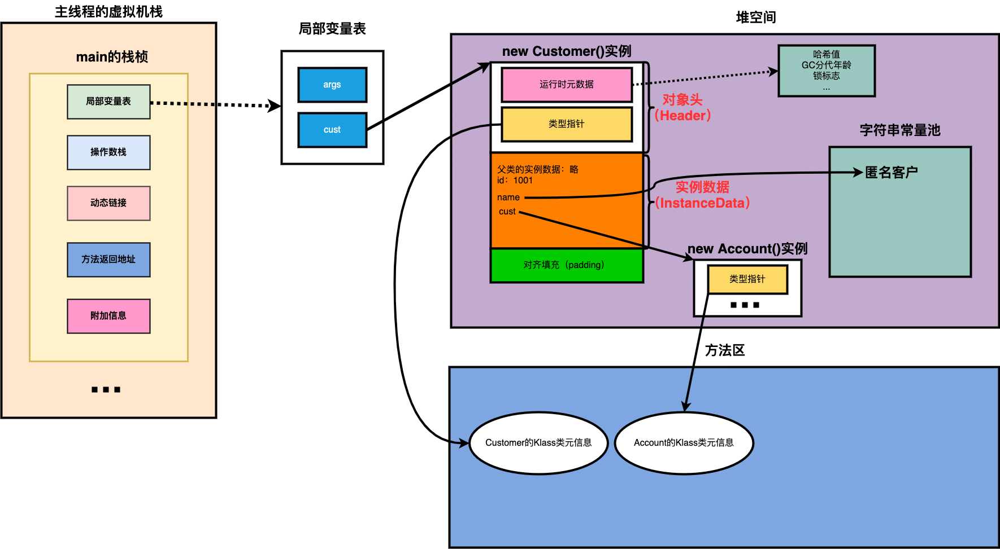
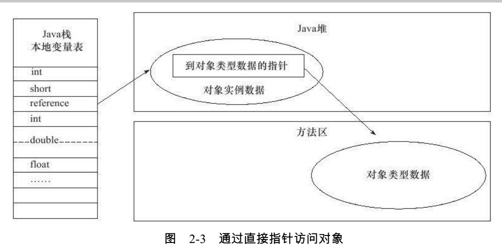
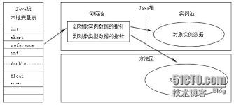
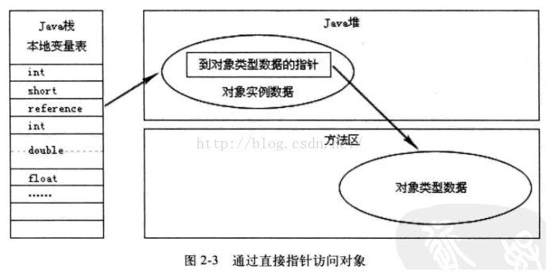

- 先给idea装jclasslib ByteCode Viewer插件

# jvm结构

多线程中

方法区和堆是共享的

每个线程独有一份计数器和栈

java的指令是基于栈实现的（**主要考虑夸平台性**）


## 执行引擎

- 解释器
  - 逐行解释字节码进行执行
- JIT
  - 寻找热点代码进行缓存，然后编译执行


## HotSpot VM


# 类加载

- 虚拟机启动
  - 引导类加载器创建一个初始类来完成的
- 虚拟机的执行
  - 执行一个java程序时，才是真正的执行一个叫java虚拟机的进程
- 虚拟机的退出

## 类加载子系统

- 类加载子系统只负责从文件系统加载class文件
- 加载的类信息存在方法区的内存空间，方法区还存放运行是的常量池信息

- 它只负责加载，能不能运行由执行引擎决定

## 链接过程

- 验证
  - 所有的字节码起始开头都是 CA FE BA BE
  - 保证加载类的正确性
- 准备
  - 一开始定义变量，如int类型，一开始才是0
  - 为**类变量**分配内存并且设置该类的初始值

- 解析
  - 一个类可能会引用很多其他类

## 初始化过程

```java
class A {
    static{
        //clinit
    }
}
```


- 他只有类存在静态代码时才会有

- 就是执行类构造器clinit方法的过程
- 虚拟机保证每个类的clinit在多线程下都是同步加锁的
- 如果存在父类，会先执行父类的clinit

## 类加载类

- 系统类加载器

```java
//获取系统类加载器
ClassLoader systemClassLoader = ClassLoader.getSystemClassLoader();
System.out.println(systemClassLoader);
//获取自定义类加载器（可以发现他默认使用的是系统类加载器）
ClassLoader classLoader = ClassLoaderTest1.class.getClassLoader();
System.out.println(classLoader);
```

- 引导类加载器（启动类加载器）
  - 它用来加载java的核心库
  - 没有父类加载器

```java
//String 类使用引导类加载器
//java核心库使用引导类加载器
ClassLoader str = String.class.getClassLoader();
//输出null（凡是这里是null的都是引导类加载器）
System.out.println(str);
```

- ·什么时候需要自定义类加载器
  - 隔离加载器
  - 修改类的加载方式
  - 扩展加载源
  - 防止源码泄露
- 获取类加载器的方式

1. Clasz.getClassLoader()

```java
Class.forName("java.lang.String").getClassLoader();
```

2. 线程的方式获取上下文的loader

```java
Thread.currentThread().getContextClassLoader()
```

3. 获取当前系统类加载器

```java
ClassLoader.getSystemClassLoader()
```

## 双亲委派机制

### 原理

- 如果一个类加载器收到请求，它不会自己先去加载，二十把这个加载委托给父类的加载器，如果父类加载器还存在父类加载器，就会依次递归，直到最顶层的启动类加载器
- 如果父类加载器加载返回失败，则子类才会自己尝试去加载


例1：

如果new一个java.lang.String类，则一开始就会是引导类加载器加载

如果new一个其他的类，首先引导类加载器加载，它发现它不能加载这个类，则会丢给子类加载器去加载

### 判断同一个类条件

- 包目录类名相同
- 类加载器相同

---

# 运行时数据区

---

# 栈


Runtime

每个jvm，只有一个Runtime

## jvm线程

- 虚拟机线程
- 周期任务线程
- GC线程（后台线程/守护线程）

## 程序计数器（PC Registery）

- 用来存储指向下一条指令的地址
- 一个很小的内存空间
- 线程私有的

### 举例

```java
public static void main(String[] args) {
    int a=10;
    int b=20;
    String c ="abc";
}
```

反编译class,最左边的数字就是偏移地址，中间的是操作指令

当执行到5时（**程序计数器记录的是左边的序号**）

执行引擎读取操作指令，操作栈结构，局部变量表，实现存取计算等

将字节码指令翻译成机器指令，到cpu做计算

```java
0 bipush 10
2 istore_1
3 bipush 20
5 istore_2
6 ldc #2 <abc>
8 astore_3
9 return

```

### 常见问题

- 为什么要使用pc寄存器记录当前线程的执行地址

cpu需要不停的切换线程，这个时候切换回来，知道它执行到哪了

- pc寄存器为什么是线程私有的

如果不是私有，那么寄存器公有，则切换线程时，是无法找到切换回来的线程下个执行的步骤的

## 虚拟机栈

- 一个栈针对应着一个方法
- 生命周期和线程一致
- 主要用于保存方法的局部变量和部分结果和返回

### 栈常见异常

- stackoverflowerror
  - 栈如果是固定的，栈满了，就会抛出
  - 一般递归
- outofmemoryerror
  - 栈如果是动态扩展，如果去申请内存，没有内存了就会抛出

### 设置栈大小

https://docs.oracle.com/en/java/javase/11/tools/tools-and-command-reference.html

-main tools -java 

找到xss

```shell
-Xss size
##举例
-Xss1m
-Xss1024k
-Xss1048576

```

## 栈的存储单位

- 栈的数据是以栈帧的格式存在的
- 每个方法对应一个栈针

### 栈帧的内部结构

- 局部变量表
- 操作数栈
- 动态链接
  - 指向运行时常量吃的方法引用
- 方法返回地址
- 一些附加信息

**一个栈能放多少个栈帧取决于栈针的大小**

### 局部变量表

- 也称局部变量数组
- 一个数字数组（存放**基本数据类型、对象引用地址**）

### 从jclasslib看

看class

- linenumbertable
  - 编译后的字节码对应的编号（start pc）与java代码的对应行号关系

- localvaribletable
  - 局部变量相关信息
  - start pc 变量起始的位置
  - index，slot存储坐标

### slot

- 局部变量表最基本存储单元slot（槽）
- 32位类型占一个slot，64位占两个槽
- 局部变量安装声明顺序存储
- 如果是非static方法，this存放到0的位置（**为什么static不能使用this，因为static 的局部变量表中不存在this**）
- **局部变量表中的变量是重要的垃圾回收根节点，只要被局部变量表中直接或者间接引用的对象，就不会被回收**

```java
//java的非static方法的local
LocalVariableTable:
        Start  Length  Slot  Name   Signature
            0       4     0  this   LDataTest1;
            3       1     1     a   Ljava/lang/String;

```

###  slot重复利用问题

定义一个代码

```java
public void test1(){
    int a = 1;
    {
        int b=0;
        b=a+1;
    }
    int c = a+2;
}
```

查看，发现局部变量b先使用了slot，然后c又使用了b的slot

因为b在代码块结束就销毁了，但是slot长度编译时就定义了，不能减少

```java
 Start  Length  Slot  Name   Signature
            4       4     2     b   I
            0      13     0  this   LDataTest1;
            2      11     1     a   I
           12       1     2     c   I

```

### 操作数栈操作演示

```java
public void test2() {
    byte i = 15;
    int b = 10;

    int j = i+b;
}
```

```shell
  stack=2, locals=4, args_size=1
  		## 将15入栈，
         0: bipush        15
         #弹出操作数栈栈顶元素，保存到局部变量表第1个位置
         2: istore_1
         3: bipush        10
         5: istore_2
         # 第1，2个变量从局部变量表压入操作数栈
         6: iload_1
         7: iload_2
         ## 出栈相加，放入操作数栈中
         8: iadd
         9: istore_3
        10: return

```


### i++ ++i 区别


## 动态链接

栈帧中的一个引用

在字节码文件中，有个constant pool（常量池，当运行时，就会将其存储到方法区），编译后，所有的变量和方法引用都作为符号引用（#开头的数字），保存到class文件的常量池中

当方法调用另一个方法时，就用常量池的指向方法的符号引用表示

**作用就是将符号引用转化为直接引用**

### 方法的调用

- 静态链接
  - 如果被调用方法，在编译期间就可以确定符号引用，那么它就是静态链接
- 动态链接

### 虚方法与非虚方法

- ### 非虚方法

  - 编译期就确定了调用的版本
  - 静态方法，私有方法、final方法，实例构造器，父类方法都是非虚方法

- 虚方法

  - 不确定调用的方法，如重写的方法

### invokedynamice

### 动态语言与静态语言区别

静态语言定义变量是根据类型来确定变量类型的

动态语言是根据值来确定类型的，如js

## 方法返回地址

- 存放调用该方法的pc寄存器的值
- 本质上，方法的退出就是当前栈帧出栈的过程，此时需要恢复上层方法的局部变量表、操作数栈，将返回值压入调用者栈针的操作数栈，设置pc寄存器等（将返回值返回给调用的方法）

## 本地方法

native 方法，是一个java方法，但是是由非java语言实现的

用native修饰的方法是本地方法

本地方法栈

# 堆


## 堆的核心概述

- 堆是线程共享的，但还是有划分私有的堆空间

## 内存细分

- 7以前：新生代+老年代+永久区
  - 新生代：
- 8以后：新生代+老年代+元空间

## 设置堆空间大小

**建议设置xms和xmx设置一样大**，避免GC之后造成堆内存减少，消耗性能

- 设置的是年轻代+老年代
- -X：jvm运行参数，ms是memory start

- -Xms:堆区的起始内存，默认 物理/64
- -Xmx:堆区最大的内存， 默认 物理/4

```java
public static void main(String[] args) {
    //堆内存总量
    long totalMemory = Runtime.getRuntime().totalMemory() / 1024 / 1024;
    //最大堆内存
    long maxMemory = Runtime.getRuntime().maxMemory() / 1024 / 1024;

    System.out.println("-Xms:" + totalMemory + "M");
    System.out.println("-Xmx:" + maxMemory + "M");

    System.out.println("系统内存大小:" + totalMemory*64 + "M");
    System.out.println("系统内存大小:" + maxMemory*4 + "M");
}
```

查看gc

- 方式1

```shell
C:\Users\alonePc>jps
12192
14296 Jps
15192 HeapSpace
9720 Launcher
# 老年代， OC:总量 OU：使用的数量（kb）/1024=M
C:\Users\alonePc>jstat -gc 15192
 S0C    S1C    S0U    S1U      EC       EU        OC         OU       MC     MU    CCSC   CCSU   YGC     YGCT    FGC    FGCT     GCT
10752.0 10752.0  0.0    0.0   65536.0   5243.8   175104.0     0.0     4480.0 781.2  384.0   75.9       0    0.000   0      0.000    0.000
```

- 方式2

设置启动参数

```shell
-XX:+PrintGCDetails
```

### 年轻代老年代

- 存储jvm中的java对象可以被划分为两类
  - 一类是生命周期短
  - 一类是生命周期长，甚至与jvm生命周期保持一致
- 堆区细分的话，分为年轻代和老年代
- 年轻代分为eden区/S0区，S1区（有时叫from和to区）
  - 比例2：1


## 内存分配策略

- 优先分配Eden
- 大对象直接分配到老年代
  - 尽量避免程序出现过多的大对象
  - 尤其是那种朝生即死的大对象
- 长期存活的对象存入老年代（15岁）
- s区相同年龄的对象大小大于s区的一半，则直接进入老年代

## 为对象分配TLAB

- 为每个线程在Eden区分配了一部分（默认eden的1%）私有的内存区
- 增加内存吞吐量
- 避免线程安全问题
- 不是所有对象都能在tlab区分配对象（他比较少）
- 命令行 jinfo -flag UseTLAB 进程号  可以查看是否开启

## GC过程

- Eden区内存满时，这时候触发一次Minor GC，把Eden区的存活对象转移到From区，非存活对象进行清理，然后给新创建的对象分配空间，存入Eden区

- 随着分配对象的增多，Eden区的空间又不足了，这时候再触发一次Minor GC，清理掉Eden区和S1区的死亡对象，把存活对象转移到S2区，然后再给新对象分配内存

- From区和To区是相对的关系，哪个区中有对象，哪个区就是From区，比如，再进行一次Minor GC，会把存活对象转移到S1区，再为转移之前，S2区是From区，S1区是To区，转移后，S2区中没有存活对象，变为To区，而S1区变为From区
- 大对象直接进入老年代）假设新创建的对象很大，比如为5M(这个值可以通过PretenureSizeThreshold这个参数进行设置，默认3M)，那么即使Eden区有足够的空间来存放，也不会存放在Eden区，而是直接存入老年代

- 长期存活的对象将进入老年代（15岁）
- 如果某个(些)对象(原来在内存中存活的对象或者新创建的对象)由于以上原因需要被移动到老年代中，而老年代中没有足够空间容纳这个(些)对象，那么会触发一次Full GC

总结：**复制之后有交换，谁空谁是to.**(Eden采用复制算法)

## GC算法

- 年轻代（YoungGeneration）的回收算法（回收主要以Copying为主）
  1. 所有新生成的对象首先都是放在年经代的。年轻代的目标就是尽可能快速的收集掉那些生命周期短的对象
  2. 新生代内存按照8:1:1的比例分为一个eden区和两个survivor(s0,s1）区。大部分对象在eden区中生成．回收时先将eden区存活对象复制到一个s0区，然后清空eden区，当下一次eden区又满了时，则将eden区和s0区存活对象复制到另一个s1区，然后清空eden和这个s0区，此时s0区是空的，然后将s0区和s1区交换，即保持s1区为空，如此往复.(**谁空谁是to**））。
  3. 当s1区不足以存放eden和survivoro的存活对象时，就将存活对象直接存放到老年代。若是老年代也满了就会触发一次fulIGC(MajorGC)，也就是新生代、老年代都进行回收．
  4. 新生代发生的GC也叫做MinorGC,MinorGC发生频率比较高（不一走等Eden区满了才触发）.
- 老年代（OldGeneration）的回收算法（回收主要以Mark一Colnpact为主）
     1. 在年轻代中经历了N次垃圾回收后仍然存活的对象，就会被放到年老代中．因此，可以认为年老代中存放的都是一些生命周期较长的对象。
     2. 内存比新生代也大很多（大概比例是1:2)，当老年代内存满时触发MajorGC，发生频率比较低，老年代对象存活时间比较长，存活率标记高。
- 持久代（pernlallentGelleration）的回收算法
  用于存放静态文件，如java类、方法等。持久代对垃圾回收没有显著影响，但是有些应用可能动态生成或者调用一些dass，例如Hibernate等，在这种时侯需要设置一个比较大的持久代空间来存放这些运行过程中新增的类。持久代也称方法区

### Minor GC

- 只是新生代的垃圾回收
- 当年轻代**Eden区**空间不足，触发gc，回收eden和s0
- Minor GC时会引发STW，暂停其他用户线程

### Major GC

- 只是老年代的收集
  - CMS GC会单独收集老年代行为
  - 很多时候Major GC会和Full GC混淆使用，需要区分是老年代收集还是整堆收集
- 执行时间是Minor的10倍以上，停顿时间更长

### Full GC

- 整堆的收集
- 老年代空间不足，方法区空间不足，触发

## 算法优劣

### 复制算法

当这一块的内存用完了，就将还存活着的对象复制到另外一块内存上面，然后再把已使用过的内存空间一次清理掉

### 标记清除

首先标记出所需回收的对象，在标记完成后统一回收掉所有被标记的对象，**它的标记过程其实就是前面的可达性分析算法中判定垃圾对象的标记过程**

## 常用参数

```
-Xms 设置堆的初始值(默认物理内存的1/64)
-Xmx 设置堆的最大值（默认物理内存的1/4）
-Xmn 设置新生代的大小
-XX:NewRatio 新生代与老年代的比例
-XX:+PrintGCDetails 打印 垃圾回收 的细节
```

## 逃逸分析

一个对象，如果没有发生逃逸，则他的内存可以在堆上分配

判断逃逸：如果一个方法里的对象，可能被其他方法调用，则new 的对象发生逃逸

结论

能使用局部变量的，不要在方法外定义（堆上分配不需要GC）

# 方法区

https://docs.oracle.com/javase/specs/jvms/se8/html/index.html

## 栈堆方法区交互关系

- 类结构放在方法区

- new的对象放在堆空间

- 对象所在的方法的栈帧存在栈区

## 方法区介绍

- 线程共享的
- 方法区（Metaspace）大小，决定系统可以保存多少个类

## 设置固定大小

https://docs.oracle.com/javase/8/docs/technotes/tools/unix/java.html#BGBCIEFC

设置元空间最大值

-XX:MaxMetaspaceSize=size

设置初始大小

-XX:MetaspaceSize=size

## 方法区的溢出

方法区存的是类的定义

可以通过ClassWriter来动态生成类

## 方法去存储内容

- 类型信息
  - 类class，接口。枚举，注解
- 常量
- 静态变量

## 方法区演进过程

- hotspot才存在永久代概念
- 1.6 有永久代，静态变量存放在永久代上
- 1.7 去永久代，运行时常量池的字符串常量，静态变量(引用名)移除，保存在堆中
- 1.8 无永久代， 类型信息，字段，方法，常量保存在本地内存的元空间中，但字符串常量池，静态变量保存在堆中

## 为什么要用元空间替代永久代

- 永久代设置的空间大小难以确定
- 永久代调优比较困难

## String table为什么要变化

永久代GC频率低，导致String table回收效率不高，导致永久代不足

## static final 常量

```java
static int a=1;
static final int b=2;
```

这种常量在编译阶段就已经赋值了

其他static 变量在init阶段赋值

## 运行时常量池

- constant pool 

  - 字面量信息
  - 类型、域、方法的符号引用

- 为什么需要常量池

  - jvm 在栈帧(frame) 中进行操作数和方法的动态链接(link)，为了便于链接，jvm 使用常量池来保存跟踪当前类中引用的其他类及其成员变量和成员方法。

    每个栈帧(frame)都包含一个运行常量池的引用，这个引用指向当前栈帧需要执行的方法，jvm使用这个引用来进行动态链接

## 方法区GC

虚拟机规范并没有要求方法区GC

方法去GC收集主要回收：

- 常量池废弃的常量
- 不再使用的类型

# 对象

### 对象实例化

### 方式

- new 
  - 变形1：xxx的静态方法
  - 变性2：xxxbuilder/xxxfactory
- Class的newInstance()，反射的方式，只能调用空参的构造器，权限必须是public
- Constructor的newInstance()
- 使用clone
- 使用反序列化

### 创建对象步骤

- 判断对应的类是否加载、链接、初始化
  - 判断这个类是不是在内存中已经有了
  - 有了就直接使用
  - 没有，在双亲委派模式下加载
- 为对象分配内存
- 处理并发安全问题
  - 采用CAS
  - 每个线程分配一个TLAB
- 初始化分配到空间(属性的默认初始化，零值初始化)
- 设置对象头
  - 记录当前所属的类
  - 记录hash值
- 执行init方法进行初始化(类构造器<init>)

## 对象内存布局

### 对象头

- 运行是元数据
  - hash值
  - GC分代年龄
  - 锁状态标志
- 类型指针
  - 指向类元数据instanceKlass，确定该对象的类型

## 实例数据（instance data）

- 说明
  - 他是对象的真正存储有效信息
- 规则
  - 相同宽度的字段总是被分配在一起
  - 父类定义的变量会出现在子类之前

## 对齐填充

## 图示

```java
public class CustomerTest {
    public static void main(String[] args) {
        Customer cust = new Customer();
    }
}
```



## 对象访问定位

- jvm如何通过栈帧中的对象引用访问到对象的实例?
  - 通过栈上reference访问



- 对象访问方式

  - 句柄访问(效率低) 

  

  - 直接访问(hotspot)

  

# 执行引擎

## 概述

- jvm主要任务
  - 负责装载字节码到期内部
- 执行引擎任务
  - 将字节码指令解释/翻译为平台上的本地机器指令

为什么java是半编译半解释语言？

因为java既可以用解释器解释

又可以用JIT编译器编译

- 机器码
  - 机器指令码，就是010101这种
  - 和cpu密切相关
- 指令
  - 把0 1 简化成对应的指令，如： mov inc等
- 指令集
- 汇编
  - 用助记符代替机器指令的操作码
  - 用地址符号和标号代替指令或者操作数的地址
  - 汇编需要翻译成机器指令码才能识别
- 高级语言
  - 翻译成汇编（编译过程）->机器指令（汇编过程）->cpu

## JIT编译器和解释器

JIT及时翻译成机器指令，翻译后速度快

解释器，程序启动，翻译成机器指令，节省运行时编译时间，响应快

# 常用调优工具

## jprofiler

- 先装jprofiler
- 再在idea上装jprofiler插件
- 在启动项目旁边有个jprofiler启动工具