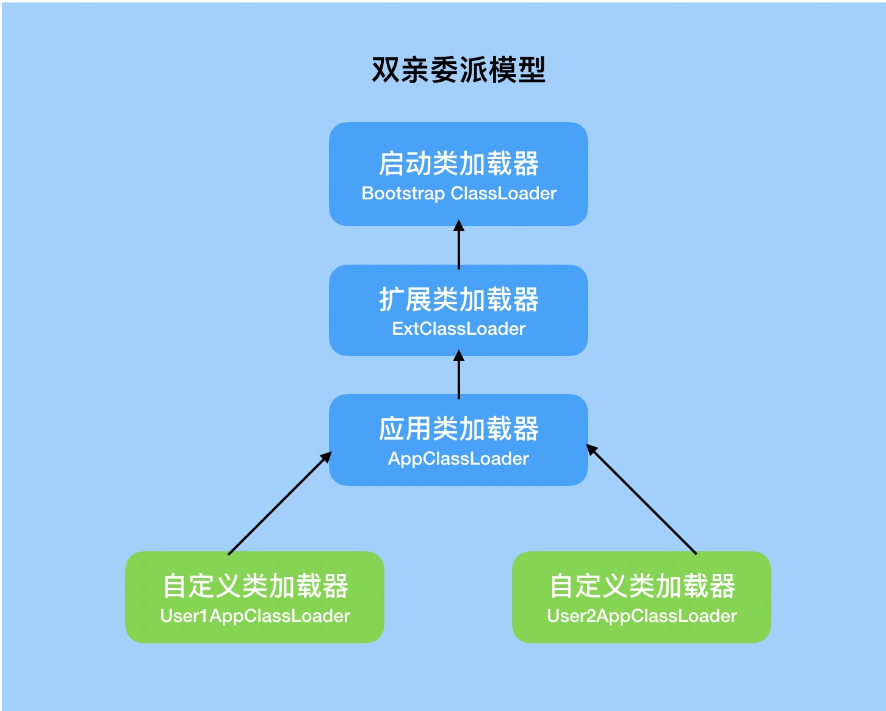
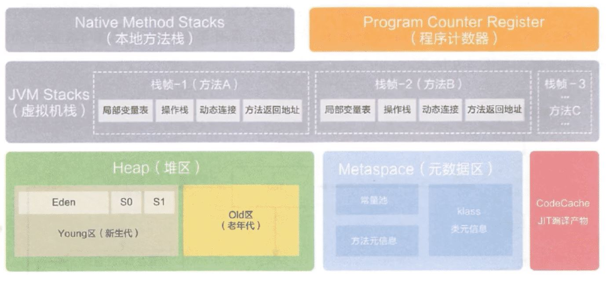
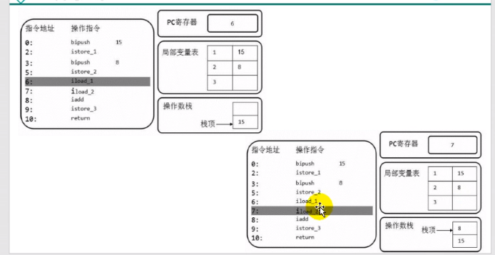
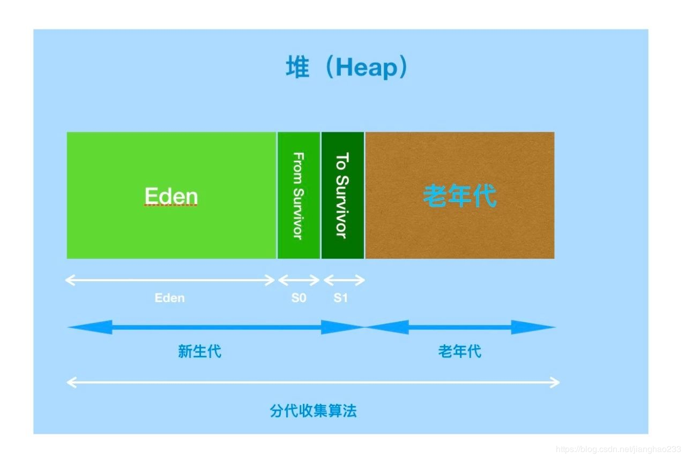

- 先给idea装jclasslib ByteCode Viewer插件

# jvm结构

多线程中

方法区和堆是共享的

每个线程独有一份计数器和栈

java的指令是基于栈实现的（**主要考虑夸平台性**）


## 执行引擎

- 解释器
  - 逐行解释字节码进行执行
- JIT
  - 寻找热点代码进行缓存，然后编译执行


## HotSpot VM


# 类加载

- 虚拟机启动
  - 引导类加载器创建一个初始类来完成的
- 虚拟机的执行
  - 执行一个java程序时，才是真正的执行一个叫java虚拟机的进程
- 虚拟机的退出

## 类加载子系统

- 类加载子系统只负责从文件系统加载class文件
- 加载的类信息存在方法区的内存空间，方法区还存放运行是的常量池信息

- 它只负责加载，能不能运行由执行引擎决定

## 链接过程

- 验证
  - 所有的字节码起始开头都是 CA FE BA BE
  - 保证加载类的正确性
- 准备
  - 一开始定义变量，如int类型，一开始才是0
  - 为**类变量**分配内存并且设置该类的初始值

- 解析
  - 一个类可能会引用很多其他类

## 初始化过程

```java
class A {
    static{
        //clinit
    }
}
```


- 他只有类存在静态代码时才会有

- 就是执行类构造器clinit方法的过程
- 虚拟机保证每个类的clinit在多线程下都是同步加锁的
- 如果存在父类，会先执行父类的clinit

## 类加载类

- 系统类加载器

```java
//获取系统类加载器
ClassLoader systemClassLoader = ClassLoader.getSystemClassLoader();
System.out.println(systemClassLoader);
//获取自定义类加载器（可以发现他默认使用的是系统类加载器）
ClassLoader classLoader = ClassLoaderTest1.class.getClassLoader();
System.out.println(classLoader);
```

- 引导类加载器（启动类加载器）
  - 它用来加载java的核心库
  - 没有父类加载器

```java
//String 类使用引导类加载器
//java核心库使用引导类加载器
ClassLoader str = String.class.getClassLoader();
//输出null（凡是这里是null的都是引导类加载器）
System.out.println(str);
```

- ·什么时候需要自定义类加载器
  - 隔离加载器
  - 修改类的加载方式
  - 扩展加载源
  - 防止源码泄露
- 获取类加载器的方式

1. Clasz.getClassLoader()

```java
Class.forName("java.lang.String").getClassLoader();
```

2. 线程的方式获取上下文的loader

```java
Thread.currentThread().getContextClassLoader()
```

3. 获取当前系统类加载器

```java
ClassLoader.getSystemClassLoader()
```

## 双亲委派机制

### 原理

- 如果一个类加载器收到请求，它不会自己先去加载，二十把这个加载委托给父类的加载器，如果父类加载器还存在父类加载器，就会依次递归，直到最顶层的启动类加载器
- 如果父类加载器加载返回失败，则子类才会自己尝试去加载



例1：

如果new一个java.lang.String类，则一开始就会是引导类加载器加载

如果new一个其他的类，首先引导类加载器加载，它发现它不能加载这个类，则会丢给子类加载器去加载

### 判断同一个类条件

- 包目录类名相同
- 类加载器相同

---

# 运行时数据区

---

# 栈



Runtime

每个jvm，只有一个Runtime

## jvm线程

- 虚拟机线程
- 周期任务线程
- GC线程（后台线程/守护线程）

## 程序计数器（PC Registery）

- 用来存储指向下一条指令的地址
- 一个很小的内存空间
- 线程私有的

### 举例

```java
public static void main(String[] args) {
    int a=10;
    int b=20;
    String c ="abc";
}
```

反编译class,最左边的数字就是偏移地址，中间的是操作指令

当执行到5时

执行引擎读取操作指令，操作栈结构，局部变量表，实现存取计算等

将字节码指令翻译成机器指令，到cpu做计算

```java
0 bipush 10
2 istore_1
3 bipush 20
5 istore_2
6 ldc #2 <abc>
8 astore_3
9 return

```

### 常见问题

- 为什么要使用pc寄存器记录当前线程的执行地址

cpu需要不停的切换线程，这个时候切换回来，知道它执行到哪了

- pc寄存器为什么是线程私有的

如果不是私有，那么寄存器公有，则切换线程时，是无法找到切换回来的线程下个执行的步骤的

## 虚拟机栈

- 一个栈针对应着一个方法
- 生命周期和线程一致
- 主要用于保存方法的局部变量和部分结果和返回

### 栈常见异常

- stackoverflowerror
  - 栈如果是固定的，栈满了，就会抛出
  - 一般递归
- outofmemoryerror
  - 栈如果是动态扩展，如果去申请内存，没有内存了就会抛出

### 设置栈大小

https://docs.oracle.com/en/java/javase/11/tools/tools-and-command-reference.html

-main tools -java 

找到xss

```shell
-Xss size
##举例
-Xss1m
-Xss1024k
-Xss1048576

```

## 栈的存储单位

- 栈的数据是以栈帧的格式存在的
- 每个方法对应一个栈针

### 栈帧的内部结构

- 局部变量表
- 操作数栈
- 动态链接
  - 指向运行时常量吃的方法引用
- 方法返回地址
- 一些附加信息

**一个栈能放多少个栈帧取决于栈针的大小**

### 局部变量表

- 也称局部变量数组
- 一个数字数组（存放**基本数据类型、对象引用地址**）

### 从jclasslib看

看class

- linenumbertable
  - 编译后的字节码对应的编号（start pc）与java代码的对应行号关系

- localvaribletable
  - 局部变量相关信息
  - start pc 变量起始的位置
  - index，slot存储坐标

### slot

- 局部变量表最基本存储单元slot（槽）
- 32位类型占一个slot，64位占两个槽
- 局部变量安装声明顺序存储
- 如果是非static方法，this存放到0的位置（**为什么static不能使用this，因为static 的局部变量表中不存在this**）
- **局部变量表中的变量是重要的垃圾回收根节点，只要被局部变量表中直接或者间接引用的对象，就不会被回收**

```java
//java的非static方法的local
LocalVariableTable:
        Start  Length  Slot  Name   Signature
            0       4     0  this   LDataTest1;
            3       1     1     a   Ljava/lang/String;

```

###  slot重复利用问题

定义一个代码

```java
public void test1(){
    int a = 1;
    {
        int b=0;
        b=a+1;
    }
    int c = a+2;
}
```

查看，发现局部变量b先使用了slot，然后c又使用了b的slot

因为b在代码块结束就销毁了，但是slot长度编译时就定义了，不能减少

```java
 Start  Length  Slot  Name   Signature
            4       4     2     b   I
            0      13     0  this   LDataTest1;
            2      11     1     a   I
           12       1     2     c   I

```

### 操作数栈操作演示

```java
public void test2() {
    byte i = 15;
    int b = 10;

    int j = i+b;
}
```

```shell
  stack=2, locals=4, args_size=1
  		## 将15入栈，
         0: bipush        15
         #弹出操作数栈栈顶元素，保存到局部变量表第1个位置
         2: istore_1
         3: bipush        10
         5: istore_2
         # 第1，2个变量从局部变量表压入操作数栈
         6: iload_1
         7: iload_2
         ## 出栈相加，放入操作数栈中
         8: iadd
         9: istore_3
        10: return

```



### i++ ++i 区别


## 动态链接

栈帧中的一个引用

在字节码文件中，有个constant pool（常量池，当运行时，就会将其存储到方法区），编译后，所有的变量和方法引用都作为符号引用（#开头的数字），保存到class文件的常量池中

当方法调用另一个方法时，就用常量池的指向方法的符号引用表示

**作用就是将符号引用转化为直接引用**

### 方法的调用

- 静态链接
  - 如果被调用方法，在编译期间就可以确定符号引用，那么它就是静态链接
- 动态链接

### 虚方法与非虚方法

- ### 非虚方法

  - 编译期就确定了调用的版本
  - 静态方法，私有方法、final方法，实例构造器，父类方法都是非虚方法

- 虚方法

  - 不确定调用的方法，如重写的方法

### invokedynamice

### 动态语言与静态语言区别

静态语言定义变量是根据类型来确定变量类型的

动态语言是根据值来确定类型的，如js

## 方法返回地址

- 存放调用该方法的pc寄存器的值
- 本质上，方法的退出就是当前栈帧出栈的过程，此时需要恢复上层方法的局部变量表、操作数栈，将返回值压入调用者栈针的操作数栈，设置pc寄存器等（将返回值返回给调用的方法）

## 本地方法

native 方法，是一个java方法，但是是由非java语言实现的

用native修饰的方法是本地方法

本地方法栈

# 堆


## 堆的核心概述

- 堆是线程共享的，但还是有划分私有的堆空间

## 内存细分

- 7以前：新生代+老年代+永久区
  - 新生代：
- 8以后：新生代+老年代+元空间

## 设置堆空间大小

**建议设置xms和xmx设置一样大**，避免GC之后造成堆内存减少，消耗性能

- 设置的是年轻代+老年代
- -X：jvm运行参数，ms是memory start

- -Xms:堆区的起始内存，默认 物理/64
- -Xmx:堆区最大的内存， 默认 物理/4

```java
public static void main(String[] args) {
    //堆内存总量
    long totalMemory = Runtime.getRuntime().totalMemory() / 1024 / 1024;
    //最大堆内存
    long maxMemory = Runtime.getRuntime().maxMemory() / 1024 / 1024;

    System.out.println("-Xms:" + totalMemory + "M");
    System.out.println("-Xmx:" + maxMemory + "M");

    System.out.println("系统内存大小:" + totalMemory*64 + "M");
    System.out.println("系统内存大小:" + maxMemory*4 + "M");
}
```

查看gc

- 方式1

```shell
C:\Users\alonePc>jps
12192
14296 Jps
15192 HeapSpace
9720 Launcher
# 老年代， OC:总量 OU：使用的数量（kb）/1024=M
C:\Users\alonePc>jstat -gc 15192
 S0C    S1C    S0U    S1U      EC       EU        OC         OU       MC     MU    CCSC   CCSU   YGC     YGCT    FGC    FGCT     GCT
10752.0 10752.0  0.0    0.0   65536.0   5243.8   175104.0     0.0     4480.0 781.2  384.0   75.9       0    0.000   0      0.000    0.000
```

- 方式2

设置启动参数

```shell
-XX:+PrintGCDetails
```

### 年轻代老年代

- 存储jvm中的java对象可以被划分为两类
  - 一类是生命周期短
  - 一类是生命周期长，甚至与jvm生命周期保持一致
- 堆区细分的话，分为年轻代和老年代
- 年轻代分为eden区/S0区，S1区（有时叫from和to区）
  - 比例2：1

