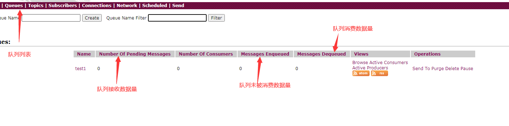

**笔记为观看周阳老师所书**

# 概述

## 消息中间件作用

- 解耦
- 拓展性：
- 削峰
- 缓冲
- 异步通信

## 特点

- 完全支持JMS1.1和J2EE 1.4规范(持久化，XA消息,事务)支持多种传送协议:in-VM, TCP,SSL, NIO,UDP,JGroups,JXTA
- 多种语言和协议编写客户端。语言:Java,C, C++, C#, Ruby, Perl, Python, PHP从设计上保证了高性能的集群，客户端-服务器，点对点
- 可以很容易的和Spring结合使用
- 支持通过JDBC和journal提供高速的消息持久化
- 支持与Axis的整合

## 安装

- 服务器安装

```shell
#1、解压
[root@localhost opt]# tar -zxvf apache-activemq-5.15.10-bin.tar.gz 
[root@localhost opt]# mkdir activemq
[root@localhost opt]# mv apache-activemq-5.15.10 activemq/activemq
#2、启动
[root@localhost activemq]# ./bin/activemq start
#3、查看默认端口 
[root@localhost activemq]# ps -ef | grep 61616
[root@localhost activemq]# lsof -i:61616
```

## 控制台访问

由于默认无法对外访问，所以需要先修改jetty的配置文件（jetty.xml）

```xml
<bean id="jettyPort" class="org.apache.activemq.web.WebConsolePort" init-method="start">
    <!-- the default port number for the web console -->
    <property name="host" value="0.0.0.0"/>
    <property name="port" value="8161"/>
</bean>

```

<http://192.168.94.129:8161/admin/>

密码admin/admin

- 控制台说明



# 两种模式

## 点对点

- sender->queue->porential receiver
- **如启动了多个消费者，则他们的消费方式为平均分配**

### 生产者

```java
public static void main(String[] args) throws JMSException {
    ActiveMQConnectionFactory factory = new ActiveMQConnectionFactory("tcp://192.168.94.129:61616");
    Connection connection = factory.createConnection();
    connection.start();
    //创建session， 事务，是否签收
    Session session = connection.createSession(false, Session.AUTO_ACKNOWLEDGE);
    //创建目的地
    Queue queue = session.createQueue("queue1");
    //创建消息的生产者
    MessageProducer producer = session.createProducer(queue);
    //生产三条消息
    for(int i=0; i<3; i++){
        //消息发送mq
        producer.send(session.createTextMessage("msg+"+i));
    }
    //关闭资源
    producer.close();
    session.close();
    connection.close();
}
```

- 执行完成之后，可以在操作界面看到对应的队列（queue1）已经创建了三条消息

### 消费者

- 有两种方式：1、同步阻塞 receive 2、异步非阻塞 监听

#### 同步阻塞

```java
public static void main(String[] args) throws Exception {
    ActiveMQConnectionFactory factory = new ActiveMQConnectionFactory("tcp://192.168.94.129:61616");
    Connection connection = factory.createConnection();
    connection.start();
    //创建session， 事务，是否签收
    Session session = connection.createSession(false, Session.AUTO_ACKNOWLEDGE);
    //创建目的地
    Queue queue = session.createQueue("queue1");
    //创建生产者
    MessageConsumer consumer = session.createConsumer(queue);
    while (true){
        //如果receive带上时间参数，则等待为有时间的阻塞
        TextMessage message = (TextMessage) consumer.receive();
        if(message==null){
            break;
        }else{
            System.out.println(message.getText());
        }
    }
    consumer.close();
    session.close();
    connection.close();
}
```

#### 监听的方式消费数据

```java
consumer.setMessageListener((message)->{
    if(message!=null && message instanceof TextMessage){
        TextMessage textMessage = (TextMessage) message;
        try {
            System.out.println(textMessage.getText());
        }catch (Exception e){

        }
    }
});
//保持控制台状态
System.in.read();
```

- 目的地destination
	主要包括主题和队列
	
- publish-and-subscribe(订阅-发布)
  publish->topic->subscribe(多个)

## 发布订阅

1、生产者将消息发送到topic上，每个消息可以有多个消费者，属于1:n的关系

2、消费者订阅后才能收到**订阅后**的消息

3、topic不保存消息，如无人消费，则是一条无用消息

### 生产者

```java
public static void main(String[] args) throws JMSException {
    ActiveMQConnectionFactory factory = new ActiveMQConnectionFactory("tcp://192.168.94.129:61616");
    Connection connection = factory.createConnection();
    connection.start();
    //创建session， 事务，是否签收
    Session session = connection.createSession(false, Session.AUTO_ACKNOWLEDGE);
    //创建目的地
    Topic topic = session.createTopic("topic-1");
    //创建消息的生产者
    MessageProducer producer = session.createProducer(topic);
    //生产三条消息
    for(int i=0; i<3; i++){
        //消息发送mq
        producer.send(session.createTextMessage("msg+"+i));
    }
    //关闭资源
    producer.close();
    session.close();
    connection.close();
}
```

### 消费者

```java
public static void main(String[] args) throws Exception {
    ActiveMQConnectionFactory factory = new ActiveMQConnectionFactory("tcp://192.168.94.129:61616");
    Connection connection = factory.createConnection();
    connection.start();
    //创建session， 事务，是否签收
    Session session = connection.createSession(false, Session.AUTO_ACKNOWLEDGE);
    //创建目的地
    Topic topic = session.createTopic("topic-1");
    //创建生产者
    MessageConsumer consumer = session.createConsumer(topic);

    consumer.setMessageListener((message)->{
        if(message!=null && message instanceof TextMessage){
            TextMessage textMessage = (TextMessage) message;
            try {
                System.out.println(textMessage.getText());
            }catch (Exception e){

            }
        }
    });
    //保持控制台状态
    System.in.read();
    consumer.close();
    session.close();
    connection.close();
}
```

## topic模式与queue模式对比

| ****                 | Topic                                                        | Queue                                                        |
| -------------------- | ------------------------------------------------------------ | ------------------------------------------------------------ |
| **概要**             | Publish  Subscribe messaging 发布订阅消息                    | Point-to-Point  点对点                                       |
| **有无状态**         | topic数据默认不落地，是无状态的。                            | Queue数据默认会在mq服务器上以文件形式保存，比如Active MQ一般保存在$AMQ_HOME\data\kr-store\data下面。也可以配置成DB存储。 |
| **完整性保障**       | 并不保证publisher发布的每条数据，Subscriber都能接受到。      | Queue保证每条数据都能被receiver接收。                        |
| **消息是否会丢失**   | 一般来说publisher发布消息到某一个topic时，只有正在监听该topic地址的sub能够接收到消息；如果没有sub在监听，该topic就丢失了。 | Sender发送消息到目标Queue，receiver可以异步接收这个Queue上的消息。Queue上的消息如果暂时没有receiver来取，也不会丢失。 |
| **消息发布接收策略** | 一对多的消息发布接收策略，监听同一个topic地址的多个sub都能收到publisher发送的消息。Sub接收完通知mq服务器 | 一对一的消息发布接收策略，一个sender发送的消息，只能有一个receiver接收。receiver接收完后，通知mq服务器已接收，mq服务器对queue里的消息采取删除或其他操作。 |

# JMS

## 概念

- JMS是什么
  - JMS Java Message Service，Java消息服务，是JavaEE中的一个技术
- JMS规范
  - JMS定义了Java中访问消息中间件的接口，并没有给予实现，实现JMS接口的消息中间件称为JMS Provider，例如ActiveMQ
- JMS Message
  - 消息头:每个消息头字段都有相应的getter和setter方法
  - 消息属性:如果需要除消息头字段以外的值，那么可以使用消息属性
  - 消息体:封装具体的消息数据

## JMS Message

### Messge消息头

1. JMSDestination

消息发送的目的地，主要是指queue和topic

2. DeliveryMode

持久模式/非持久模式

持久模式：JMS出现故障，消息不会丢失，会在服务器恢复后再次传递

非持久模式：最多会传送一次，JMS出现故障，消息会丢失

3. JMSPriority

优先级，一共0-9， 0-4是普通消息， 5-9是加急消息，JMS要求，加急消息一定要优先于普通消息，其他可以随意

4. JMSMessageID

唯一识别的消息标识

### Message消息体

1. 封装具体的消息数据

2. 五种消息体格式

```tex
TextMessage
MapMessage
ObjectMessage
BytesMessage
StreamMessagg
```

- 发送和接受的消息体类型必须一致到位

### 消息属性

如果需要去除消息头字段以外的值，那么可以使用消息属性

**识别/去重/重点标注**等操作非常有用的方法

- 自定义属性

```java
//消息属性设置（provider）
TextMessage textMessage = session.createTextMessage("msg+" + i);
textMessage.setStringProperty("testP1", "111234");
producer.send(textMessage);
```

- JMS定义属性
  - 使用“JMSX”作为属性名的前缀

```java
Enumeration jmsxPropertyNames = connection.getMetaData().getJMSXPropertyNames();
while (jmsxPropertyNames.hasMoreElements()) {
    System.out.println(jmsxPropertyNames.nextElement());;
}
```

## JMS可靠性机制

主要从多节点、持久性、事务、签收这几个方面来保证JMS的可靠性

### 消息接收确认

- JMS消息只有在被确认之后，才认为已经被成功地消费了。消息的成功消费通常包含三个阶段:客户接收消息、客户处理消息和消息被确认。

#### 事务（偏生产者）

- 事务的消息是异步推送的（消息开启了持久化是同步的，但在事务的开启下，是异步的）

- 生产者事务

```java
//创建session， 事务，是否签收
Session session = connection.createSession(false, Session.AUTO_ACKNOWLEDGE);
//如果是false，send就会直接进入队列
producer.send(session.createTextMessage("msg+"+i));
//如果是true，则必须commit，才会提交队列
session.commit();
```

- 消费者事务
  - 如果消费者开启事务，没有commit，则会同一条消息一直重复消费
  - 这里重复消费，指的是没启动一个消费端消费一次

```java
Session session = connection.createSession(true, Session.AUTO_ACKNOWLEDGE);
//提交事务（放在消费的监听里）
session.commit();
```

#### 签收（偏消费者）

- 签收类型

```java
public interface Session extends Runnable {
    //自动签收
    int AUTO_ACKNOWLEDGE = 1;
    //手动签收
    int CLIENT_ACKNOWLEDGE = 2;
    int DUPS_OK_ACKNOWLEDGE = 3;
    int SESSION_TRANSACTED = 0;
```

- 无事务手动签收
  - 签收针对的是客户端，每条消息如果没有ack，则这个消息还会被其他客户端消费

```java
Session session = connection.createSession(false, Session.CLIENT_ACKNOWLEDGE);
//消费者需要调用ack进行签收，否则，会一直消费重复数据.
System.out.println(textMessage.getText());
textMessage.acknowledge();
```

- 有事务的签收

如果按照事务来消费，就认为是自动签收了，没有acknowledge也一样不会有重复消费问题（**只要有commit**），如果没有commit，无论是否acknowledge，都会有重复消费问题

结论：**事务>签收**

### 消息持久化

- PERSISTENT:持久性（队列默认是持久）
- 生产者设置订阅消息持久化

```java
//设置非持久（服务器宕机，消息不存在）
producer.setDeliveryMode(DeliveryMode.NON_PERSISTENT);
//设置持久（服务器宕机，消息存在）
producer.setDeliveryMode(DeliveryMode.PERSISTENT);
```

#### Topic的持久化(持久化订阅)

（当注册过，如果它离线了，再登录，消费者能收到消息）

```tex
非持久订阅只有当客户端处于激活状态，也就是和JMS Provider保持连接状态才能收到发送到某个主题的消息，而当客户端处于离线状态，这个时间段发到主题的消息将会丢失，永远不会收到。

持久订阅时，客户端向JMS注册一个识别自己身份的ID，当这个客户端处于离线时，JMS Provider会为这个ID保存所有发送到主题的消息，当客户再次连接到JMSProvider时，会根据自己的ID得到所有当自己处于离线时发送到主题的消息。
```

- 生产者

```java
//创建session， 事务，是否签收
Session session = connection.createSession(false, Session.AUTO_ACKNOWLEDGE);
//创建目的地
Topic topic = session.createTopic("topic-1");
//创建消息的生产者
MessageProducer producer = session.createProducer(topic);
//设置持久
producer.setDeliveryMode(DeliveryMode.PERSISTENT);
//设置一个持久化主题后再启动
connection.start();
```

- 消费者
  - 订阅者需要往JMS注册一个clientId

```java
ActiveMQConnectionFactory factory = new ActiveMQConnectionFactory("tcp://192.168.94.129:61616");
Connection connection = factory.createConnection();
//设置持久化订阅的客户端id（当注册过，如果它离线了，再登录，消费者能收到消息）
connection.setClientID("zs");
//创建session， 事务，是否签收
Session session = connection.createSession(false, Session.AUTO_ACKNOWLEDGE);
//创建目的地
Topic topic = session.createTopic("topic-1");
//订阅持久化主题
TopicSubscriber subscriber = session.createDurableSubscriber(topic, "remark...");

connection.start();
Message receive = subscriber.receive();
while(receive!=null){
    TextMessage textMessage = (TextMessage) receive;
    System.out.println("持久化topic:"+ textMessage.getText());
    receive=subscriber.receive();
}
```

## prefetch机制

ActiveMQ 在发送一些消息之后，开启2个消费者去处理消息。会发现一个消费者处理了所有的消息，另一个消费者根本没收到消息。原因在于ActiveMQ的prefetch机制。当消费者去获取消息时，不会一条一条去获取，而是一次性获取一批，默认是1000条。这些预获取的消息，在还没确认消费之前，在管理控制台还是可以看见这些消息的，但是不会再分配给其他消费者，此时这些消息的状态应该算作“已分配未消费”，如果消息最后被消费，则会在服务器端被删除，如果消费者崩溃，则这些消息会被重新分配给新的消费者。但是如果消费者既不消费确认，又不崩溃，那这些消息就永远躺在消费者的缓存区里无法处理。更通常的情况是，消费这些消息非常耗时，你开了10个消费者去处理，结果发现只有一台机器吭哧吭哧处理，另外9台啥事不干。

解决方案：`将prefetch设为1，每次处理1条消息，处理完再去取`

- 在消费端设置prefetch

```java
ActiveMQConnectionFactory factory = new ActiveMQConnectionFactory(URL);
ActiveMQPrefetchPolicy p = new ActiveMQPrefetchPolicy();
// 设置prefetch 值(多个消费者有用)
p.setQueuePrefetch(1);
factory.setPrefetchPolicy(p);
```

# ActiveMq Broker

它其实就是用代码形式的启动mq嵌入到了java代码中，也就是说java代码可以启动mq

activemq默认的启动文件是activemq.xml,如果我们想指定对应的配置文件，则可以这样启动

```shell
[root@localhost conf]# ../bin/activemq start xbean:file:/opt/activemq/activemq/conf/activemq01.xml 
#查看启动结果
[root@localhost conf]# lsof -i:61616
COMMAND  PID USER   FD   TYPE DEVICE SIZE/OFF NODE NAME
java    9788 root  132u  IPv6  46536      0t0  TCP *:61616 (LISTEN)
```

 

## 嵌入式启动

在java中建立一个迷你activemq，

作用**可以在activemq挂掉后，启动这个迷你的activemq**

```java
public class Broker {

    public static void main(String[] args) throws Exception {
        //在vm中通信基于嵌入式的broker
        
        BrokerService brokerService = new BrokerService();
        brokerService.setUseJmx(true);
        brokerService.addConnector("tcp://localhost:61616");
        brokerService.start();
    }
}
```

# 整合Spring

## 引入pom

```xml
<dependency>
    <groupId>org.springframework</groupId>
    <artifactId>spring-jms</artifactId>
    <version>5.2.6.RELEASE</version>
</dependency>
<dependency>
    <groupId>org.apache.activemq</groupId>
    <artifactId>activemq-pool</artifactId>
    <version>5.15.15</version>
</dependency>
```

## 整合队列

### 配置

```java
/**
 * 配置生产者
 * @return
 */
@Bean
public PooledConnectionFactory jmsFactory(){
    PooledConnectionFactory pooledConnectionFactory = new PooledConnectionFactory();
    Properties properties = new Properties();
    properties.setProperty("brokerURL", "tcp://192.168.94.129:61616");
    pooledConnectionFactory.setProperties(properties);
    //最大连接数
    pooledConnectionFactory.setMaxConnections(100);
    return pooledConnectionFactory;
}


/**
 * 队列的目的地，点对点的
 * @return
 */
@Bean
public ActiveMQQueue destinationQueue() {
    //设置目的地的队列名称
    ActiveMQQueue activeMQQueue = new ActiveMQQueue("spring-activemq-queue");
    return activeMQQueue;
}

@Bean
public JmsTemplate jmsTemplateQueue(PooledConnectionFactory jmsFactory, ActiveMQQueue destinationQueue) {
    JmsTemplate jmsTemplate = new JmsTemplate();
    //设置jms的配置
    jmsTemplate.setConnectionFactory(jmsFactory);
    //设置目的地
    jmsTemplate.setDefaultDestination(destinationQueue);
    jmsTemplate.setMessageConverter(new SimpleMessageConverter());
    return jmsTemplate;
}
```

### 生产者

```java
@Autowired
private JmsTemplate jmsTemplateQueue;

//与spring整合的生产者
@Test
public void testSpringProducer(){
    jmsTemplateQueue.send((session)->{
        TextMessage testSpringQueue = session.createTextMessage("testSpringQueue");
        return testSpringQueue;
    });
}
```

### 消费者

```java
@Autowired
private JmsTemplate jmsTemplateQueue;

//与spring整合的消费者
@Test
public void testSpringConsumer(){
    String str = jmsTemplateQueue.receiveAndConvert().toString();
    System.out.println(str);
}
```

## 整合主题

整合主题其他方面都和队列一致，只是要使用ActiveMQTopic来配置template

```java
@Bean
    public ActiveMQTopic destinationTopic() {
        //设置目的地的队列名称
        ActiveMQTopic activeMQTopic = new ActiveMQTopic("spring-activemq-Topic");
        return activeMQTopic;
    }

@Bean
public JmsTemplate jmsTemplateTopic(PooledConnectionFactory jmsFactory, ActiveMQTopic destinationTopic) {
    JmsTemplate jmsTemplate = new JmsTemplate();
    //设置jms的配置
    jmsTemplate.setConnectionFactory(jmsFactory);
    //设置目的地
    jmsTemplate.setDefaultDestination(destinationTopic);
    jmsTemplate.setMessageConverter(new SimpleMessageConverter());
    return jmsTemplate;
}
```

## 监听模式

这种方式，就不需要启动消费者，直接用监听器去消费数据

### 实现监听

```java
@Component("messageListner")
public class MessageListner implements MessageListener {
    @Override
    public void onMessage(Message message) {
        if(message!=null && message instanceof TextMessage){
            TextMessage textMessage = (TextMessage)message;
            try {
                System.out.println(textMessage.getText());
            } catch (JMSException e) {
                e.printStackTrace();
            }
        }
    }
}
```

### 配置监听器

```java
@Bean
public DefaultMessageListenerContainer jmsListener(PooledConnectionFactory jmsFactory,
                                                   ActiveMQQueue destinationQueue,
                                                   MessageListner messageListner) {
    DefaultMessageListenerContainer container = new DefaultMessageListenerContainer();
    container.setConnectionFactory(jmsFactory);
    container.setDestination(destinationQueue);
    container.setMessageListener(messageListner);
    return container;
}
```

# 整合SpringBoot 

## 配置

```yaml
spring:
  activemq:
  ## 配置地址
    broker-url: tcp://192.168.94.129:61616
    user: admin
    password: admin
  jms:
  # 是队列还是主题， false:queue,true:topic
    pub-sub-domain: false

#定义队列名称
myqueue: boot-activemq-queue
```

```java
@Component
@EnableJms
public class BaseConfig {
    @Value("${myqueue}")
    private String myqueue;

    @Bean
    public Queue queue(){
        return new ActiveMQQueue(myqueue);
    }
}
```

## 生产者

```java
@Autowired
private JmsMessagingTemplate jmsMessagingTemplate;
@Autowired
private Queue queue;
//与spring整合的生产者
@Test
public void testSpringProducer(){
    //将随机字符串发送队列
    jmsMessagingTemplate.convertAndSend(queue, UUID.randomUUID());
}
```

## 消费者

消费者配置监听的方式，只需要启动类就行

```java
@Component
public class TestConsumer {

    /**
     * 监听queue队列
     * @param textMessage
     * @throws Exception
     */
    @JmsListener(destination = "${myqueue}")
    public void receive(TextMessage textMessage) throws Exception {
        System.out.println(textMessage.getText());
    }
}
```

# ActiveMq传输协议

支持这些协议：tcp、NIO、UDP、SSL、https、vm

## 协议查看

```shell
#在conf目录下、修改配置文件
[root@localhost conf]# pwd
/opt/activemq/activemq/conf
[root@localhost conf]# vim activemq.xml

```

看到这一段内容

```xml
    <!--
            The transport connectors expose ActiveMQ over a given protocol to
            clients and other brokers. For more information, see:

            http://activemq.apache.org/configuring-transports.html
        -->
        <transportConnectors>
            <!-- DOS protection, limit concurrent connections to 1000 and frame size to 100MB -->
            <transportConnector name="openwire" uri="tcp://0.0.0.0:61616?maximumConnections=1000&amp;wireFormat.maxFrameSize=104857600"/>
            <transportConnector name="amqp" uri="amqp://0.0.0.0:5672?maximumConnections=1000&amp;wireFormat.maxFrameSize=104857600"/>
            <transportConnector name="stomp" uri="stomp://0.0.0.0:61613?maximumConnections=1000&amp;wireFormat.maxFrameSize=104857600"/>
            <transportConnector name="mqtt" uri="mqtt://0.0.0.0:1883?maximumConnections=1000&amp;wireFormat.maxFrameSize=104857600"/>
            <transportConnector name="ws" uri="ws://0.0.0.0:61614?maximumConnections=1000&amp;wireFormat.maxFrameSize=104857600"/>
        </transportConnectors>

```

## TCP

1、默认的Broker实例配置、TCPclient监听端口61616

2、在网络传输数据前，必须要序列化数据，消息是通过一个叫wire protocol的来序列化成字节流。默认情况下，ActiveMQ把wire protocol叫做OpenWire，它的目的是促使网络上的效率和数据快速交互。

3、TCP连接的URI形式：**tcp://hostname:port**?key=value&key=value, 加粗部分是必须的。（key可以是属性，如超时时间等）

4、TCP传输的优点：

　　（1） TCP协议传输可靠性高，稳定性强。

　　（2） 高效性：字节流方式传递，效率很高

　　（3） 有效性：可用性：应用广泛，支持任何平台

5、 所有关于Transport协议的可配置参数，可以参考

<http://activemq.apache.org/protocols>

## NIO

1、 NIO协议和TCP协议类似，但是NIO更侧重于底层的访问操作。它允许开发人员对同一资源可有更多的client调用和服务器端有更多的负载。

2、适合使用NIO协议的场景

　（1） 可能有大量的Client去连接到Broker上，一般情况下，大量的Client去连接到Broker是被操作系统的线程数所限制的。因此，NIO的实现比TCP需要更少的线程去运行，所以建议使用NIO协议。

　（2） 可能对于Broker有一个很迟钝的网络传输，NIO比TCP提供了更好的性能。

　3、 Transport Connector配置示例：

新增一个NIO协议监听61617端口

```xml
<transportConnector name="openwire" uri="tcp://0.0.0.0:61616?maximumConnections=1000&amp;wireFormat.maxFrameSize=104857600"/>
            <transportConnector name="nio" uri="nio://0.0.0.0:61617?maximumConnections=1000&amp;wireFormat.maxFrameSize=104857600"/>
```

代码配置

将tcp改成nio

```java
ActiveMQConnectionFactory factory = new ActiveMQConnectionFactory("nio://192.168.94.129:61616");
```

## NIO增强

一开始我们是BIO_TCP协议，后面是NIO_TCP协议，现在我们要调整为NIO+多种协议

配置auto+nio(auto表示支持其他的协议)，这样，61608支持nio也支持tcp协议，表示一个接口管理了四个类型的接口

```xml
<transportConnector name="auto+nio" uri="auto+nio://0.0.0.0:61608?maximumConnections=1000&amp;wireFormat.maxFrameSize=104857600&amp;org.apache.activemq.transport.nio.SelectorManager.corePoolSize=20&amp;org.apache.activemq.transport.nio.SelectorManager.maximumPoolSize=50" />
```

# mq的高可用

1 事务

2 持久

3 签收

4 可持久化

# activeMq 持久化

<http://activemq.apache.org/persistence>

发送者将消息发送出去后，消息中心首先将消息存储到本地数据文件或者内存数据库等地方，再将消息发送给接收者，发送成功则将消息从存储中删除

总结：mq要是down机了，消息不会丢失

## [KahaDB](http://activemq.apache.org/kahadb) 

目前(5.4以后)默认的持久化db，他是基于日志的append的机制

在配置文件中可以看到这个，所以他是默认的持久机制

```xml
<persistenceAdapter>
   <kahaDB directory="${activemq.data}/kahadb"/>
</persistenceAdapter>

```

### 存储原理

存储地址的文件，他使用一个事务日志文件和仅仅一个索引文件来存储他所有的地址

db-1.log ：操作日志文件

db.data：保护持久化的BTree索引，指向log文件

db.redo：用于消息恢复，恢复BTree索引

lock：文件锁，表示当前获取kahadb读写权限的broker

```shell
[root@localhost kahadb]# ls
db-1.log  db.data  db.redo  lock

```

## mysql持久化

1、将mysql驱动包拷贝到activemq的lib文件夹下

2、修改配置文件,并建立数据库

createTablesOnStartup是否在启动的时候创建数据表，默认值是true，这样每次启动都会去创建数据表了，一般是第一次启动的时候设置为true，之后改成false

org.apache.commons.dbcp2.BasicDataSource是默认的数据源连接

可以换c3p0

```xml
<persistenceAdapter>
    <!-- <kahaDB directory="${activemq.data}/kahadb"/>-->
    <!--将配置引用的数据源-->
    <jdbcPersistenceAdapter dataSource="#mysql-ds" createTablesOnStartup="true"/>
</persistenceAdapter>
```

将数据源配置在broker标签之外

```xml
 </broker>
   <bean id="mysql-ds" class="org.apache.commons.dbcp2.BasicDataSource" destroy-method="close">
    <property name="driverClassName" value="com.mysql.jdbc.Driver"/>
    <property name="url" value="jdbc:mysql://192.168.94.130:3306/activemq?relaxAutoCommit=true"/>
    <property name="username" value="root"/>
    <property name="password" value="123456"/>
    <property name="poolPreparedStatements" value="true"/>
  </bean>

```

- 生成的三张表

---

ACTIVEMQ_MSGS：

CONTAINER：消息的目的地（队列/topic）

MSGID_PROD:消息发送者的主键

MSGID_SEQ：发送消息的顺序

EXPIRATION：消息的过期时间

MSG：消息本体，二进制数据

PRIORITY：优先级，越大优先级越高

---

ACTIVEMQ_ACKS：主要用于存储订阅关系

CLIENT_ID：订阅者id

- 代码验证

先必须要设置持久化

## JDBC 高速缓存配置

它使用了高速缓存写入速度，大大提升了性能

当消费者的消费速度能够及时跟上生产者消息的生产速度时候，journal文件能够大大减少写入db中的消息

如：如果写入速度很慢，先写入jornal文件，这时消费了这个数据，他就不会写入db数据库了

# ActiveMq集群（高可用）

<http://activemq.apache.org/masterslave>

一主多从

# 异步投递

- ActiveMq支持同步、异步两种发送模式将消息发送到broker

- 默认使用异步发送模式 

- 在使用明确指定同步发送或者**未使用事务的前提下发送持久化消息**（每一次发送都是同步发送的且会阻塞producer直到broker返回一个确认,），是同步的

- 在userAsyncSend=true情况下，客户端需要融入消息丢失的可能（生产者生产快，能够接受消息丢失的情况）

  - 开启方法（三种方法）

  1.  URl的方式

  ```java
  new ActiveMQConnectionFactory("tcp://locahost:61616?jms.useAsyncSend=true");
  ```

  2. factory设置

  ```java
  ((ActiveMQConnectionFactory)connectionFactory).setUseAsyncSend(true);
  
  ```

  3. connection设置

  ```java
  ((ActiveMQConnection)connection).setUseAsyncSend(true);
  ```

  

**异步消息怎么确保发送成功**

使用回调方法的方式，在生产端来确认消息是否发送成功，

- 生产者代码
  - 可以根据MessageID来判断哪条消息
  - onException:可能需要重新发送

```java
//创建消息的生产者
ActiveMQMessageProducer producer = (ActiveMQMessageProducer)session.createProducer(queue);
TextMessage textMessage = null;
//生产三条消息
for(int i=0; i<3; i++){
    textMessage = session.createTextMessage("msg+" + i);    
    textMessage.setJMSMessageID(UUID.randomUUID().toString());
    //获取message的唯一id
    String msgId = textMessage.getJMSMessageID();
    //消息发送mq,使用异步回调方法确认消息是否发送成功
    producer.send(textMessage, new AsyncCallback() {
        @Override
        public void onSuccess() {
            System.out.println(msgId+"成功");
        }
        @Override
        public void onException(JMSException exception) {
            System.out.println(msgId+"失败");
        }
    });
}
```

## 延迟投递和定时投递

- 如：延迟发送消息

延迟投递：方法执行后，延迟N秒投递消息

定时投递：

1、需要修改activemq.xml的配置文件，schedulerSupport="true"设置

```xml
<broker xmlns="http://activemq.apache.org/schema/core" brokerName="localhost" dataDirectory="${activemq.data}" schedulerSupport="true">

```


2、代码编写：在消息发送的时候，设置属性

```java
for(int i=0; i<3; i++){
    textMessage = session.createTextMessage("msg+" + i);
    textMessage.setJMSMessageID(UUID.randomUUID().toString());
    //获取message的唯一id
    String msgId = textMessage.getJMSMessageID();
    //延迟 delay 秒执行
    textMessage.setLongProperty(ScheduledMessage.AMQ_SCHEDULED_DELAY, delay);
    //每 period 秒执行一次
    textMessage.setLongProperty(ScheduledMessage.AMQ_SCHEDULED_PERIOD, period);
    //执行 repeat 次
    textMessage.setIntProperty(ScheduledMessage.AMQ_SCHEDULED_REPEAT, repeat);
    producer.send(textMessage);
}
```

# 重试机制

- 哪些情况会引起消息重复

1. client使用了事务且在session中调用了rollback()
   1. 客户端事务回滚了

2. client使用了事务、且在commit前关闭或者没有commit
   1. 客户端没有调用commit

3. client在CLIENT_ACKNOWLEDGE模式下，session中调用了recover

```java
Session session = connection.createSession(false, Session.CLIENT_ACKNOWLEDGE);
session.recover();
```


- 默认重复6次，间隔1s
- 如果消息重复超过6次，broker会把这个消息放到DLQ（死信队列）中

在**生产端**修改重试次数

```java
RedeliveryPolicy redeliveryPolicy = new RedeliveryPolicy();
redeliveryPolicy.setMaximumRedeliveries(3);
factory.setRedeliveryPolicy(redeliveryPolicy);
```

# 死信队列

- 当客户端接受消息没确认，超过次数后，broker会把这个消息放到DLQ（死信队列）中


- 默认不会把**非持久的消息**发送到死信队列中
- 一般生产环境中在使用MQ的时候设计两个队列:一个是核心业务队列，一个是死信队列。

- 队列私有的私信队列
  - 如：一个queue的名字是order,那么order超过限制的消息进入order独有的队列中
- 删除过期的消息，而不是进入死信队列中
  - 有时需要直接删除过期的消息而不需要发送到死队列中，“processExpired”表示是否将过期消息放入死信队列，默认为true;

- 非持久的放入死信队列中
  - 默认情况下，Activemq不会把非持久的死消息发送到死信队列中。
  - processNonPersistent”表示是否将“非持久化”消息放入死信队列，默认为false。

 # 重复消费问题

- 准备一个第三服务方来做消费记录。以redis为例，给消息分配一个全局id，只要消费过该消息，将<id,message>以K-V形式写入redis。那消费者开始消费前，先去redis中查询有没消费记录即可。

