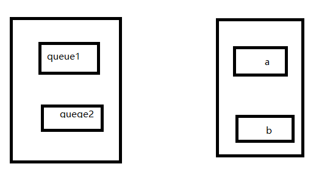
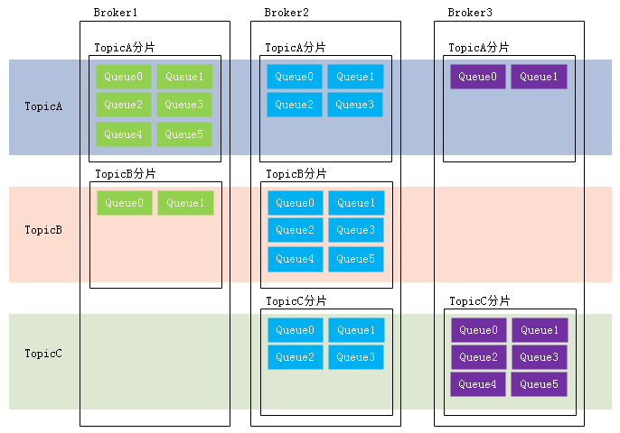
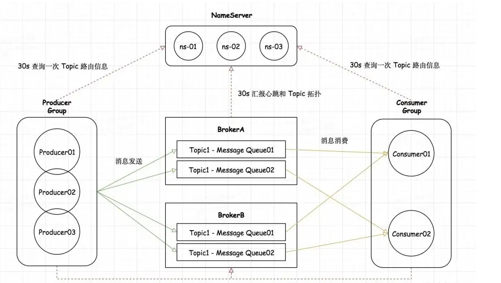
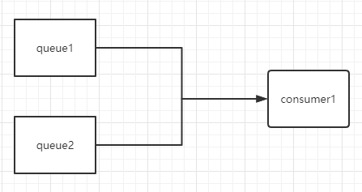
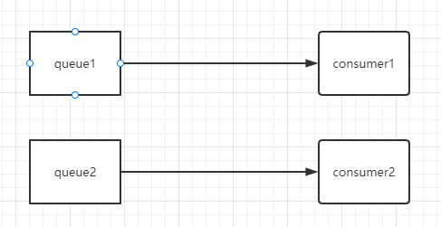
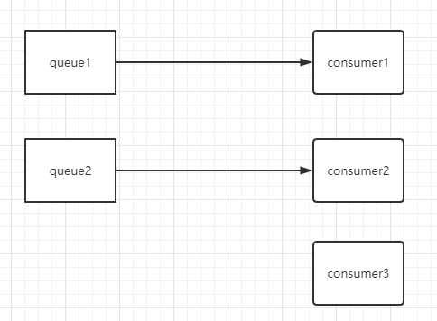
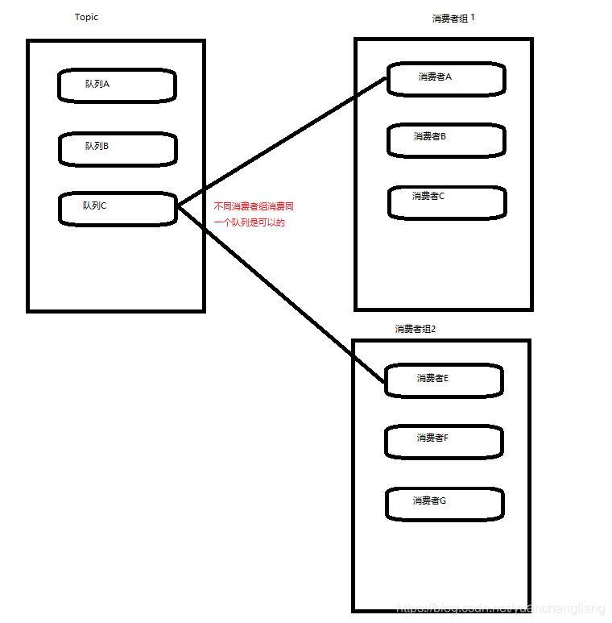

# 基本概念

> 消息(Message)

消息是指，消息系统所传输信息的物理载体，生产和消费数据的最小单位，每条消息必须属于一个主题(topic)。  

> 主题（Topic）

1. Topic表示一类消息的集合，每个主题包含若干条消息，每条消息只能属于一个主题，是RocketMQ进行消息订阅的基本单位。 topic:message 1:n  
2. 一个生产者可以同时发送多种Topic的消息；而一个消费者只对某种特定的Topic感兴趣，即只可以订阅和消费一种Topic的消息  

> 队列（Queue） 

存储消息的物理实体。一个Topic中可以包含多个Queue，每个Queue中存放的就是该Topic的消息。一个Topic的Queue也被称为一个Topic中消息的分区（Partition）  

- 同一个topic的queue可以被**多个组**的消费者消费，但不可以被**同一个组**的多个消费者消费
- 即queue1不能同时被a, b消费，但是queue1和queue2同时被a消费

> 分片

如图：TopicA 在 broker1 broker2 broker3上都有分片

> 消息标识（MessageId/Key）  

RocketMQ中每个消息拥有唯一的MessageId，且可以携带具有业务标识的Key，以方便对消息的查询。不过需要注意的是，MessageId有两个：**在生产者send()消息时会自动生成一个MessageId（msgId)**，当消息到达Broker后，Broker也会自动生成一个MessageId(offsetMsgId)。msgId offsetMsgId与key都
称为消息标识。  

- msgId：由producer端生成，其生成规则为  
  - producerIp + 进程pid + MessageClientIDSetter类的ClassLoader的hashCode +当前时间 + AutomicInteger自增计数器 (**可能重复**：如,修改了时间，或者自增计数器)
- offsetMsgId：由broker端生成，其生成规则为：
  - brokerIp + 物理分区的offset（Queue中的偏移量）（**重复几率更大**）
- key：由用户指定的业务相关的唯一标识 

# 架构

## Producer

消息发布的角色，支持分布式集群方式部署。Producer通过MQ的负载均衡模块选择相应的Broker集群队列进行消息投递，投递的过程支持快速失败并且低延迟。

## Consumer

- 消息消费的角色，支持分布式集群方式部署。支持以push推，pull拉两种模式对消息进行消费。同时也支持集群方式和广播方式的消费，它提供实时消息订阅机制，可以满足大多数用户的需求
  - RocketMQ中的消息消费者都是以消费者组（Consumer Group）的形式出现的。消费者组是同一类消费者的集合，这类Consumer消费的是同一个Topic类型的消息  

## 集群消费特点

1. 如果消费组里只有一个消费者，那么他只能：queue1,queue2轮询的消费

2. 如果他一个消费组有两个消费者，那么它会一人一个queue来消费

3. 消费者组中Consumer的数量应该小于等于订阅Topic的Queue数量。**如果超出Queue数量，则多出的Consumer将不能消费消息**。

4. 不同的消费组，可以消费同一个topic(同一个消息，会发送给A,E)

## 注意项

1. 一个消费者组只能消费一个Topic的消息，不能同时消费多个Topic消息
2. 一个消费者组中的消费者必须订阅完全相同的Topic

# Name Server
