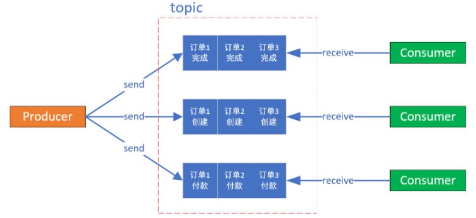

 # 消息发送

*同步发送*:

同步发送消息是指，Producer发出⼀条消息后，会在收到MQ返回的ACK之后才发下⼀条消息。该方式的消息可靠性最高，但消息发送效率太低。  

*异步发送*:

异步发送消息是指，Producer发出消息后无需等待MQ返回ACK，直接发送下⼀条消息。该方式的消息可靠性可以得到保障，消息发送效率也可以。  

`可以通过回调异步的收到ACK响应`

*单向发送消息*:

单向发送消息是指，Producer仅负责发送消息，不等待、不处理MQ的ACK。该发送方式时MQ也不返回ACK。该方式的消息发送效率最高，但消息可靠性较差。  

## 简单代码

1. jar包引入

```xml
<dependency>
    <groupId>org.apache.rocketmq</groupId>
    <artifactId>rocketmq-client</artifactId>
</dependency>
```

*同步发送*:

```java
//定义一个消息
Message msg = new Message(TOPIC /* Topic */,
        "TagA" /* Tag */,
        ("Hello RocketMQ ").getBytes(RemotingHelper.DEFAULT_CHARSET) /* Message body */
);
//会返回同步返回ack状态
SendResult sendResult = producer.send(msg);
System.out.printf("%s%n", sendResult);
producer.shutdown();
```

*异步发送*: 当成功时，会调用<b id="blue">onSuccess</b>的方法

```java
Message msg = new Message(TOPIC,
        "TagA",
        "OrderID188",
        "Hello world".getBytes(RemotingHelper.DEFAULT_CHARSET));
producer.send(msg, new SendCallback() {
    @Override
    public void onSuccess(SendResult sendResult) {
        log.debug("消息： {}",  sendResult.getMsgId());
    }
    @Override
    public void onException(Throwable e) {
        e.printStackTrace();
    }
});
Thread.sleep(10000l);
producer.shutdown();
```

# 消息消费

## 示例代码

```java
//定义一个push模式的消费者
DefaultMQPushConsumer consumer = new DefaultMQPushConsumer("CG");
consumer.setNamesrvAddr(ProductBase.ADDRESS);
consumer.subscribe(ProductBase.TOPIC, "*");
//设置从第一个消息开始消费
consumer.setConsumeFromWhere(ConsumeFromWhere.CONSUME_FROM_FIRST_OFFSET);
//设置消费模式：默认集群
consumer.setMessageModel(MessageModel.CLUSTERING);
//注册监听
consumer.registerMessageListener(new MessageListenerConcurrently() {
    @Override
    public ConsumeConcurrentlyStatus consumeMessage(List<MessageExt> msgs,
                                                    ConsumeConcurrentlyContext context) {
        //如果broker有消息，就会触发这个方法
        log.debug("{} Receive New Messages: {}", Thread.currentThread().getName(), msgs);
        //返回mq需要的消费状态
        return ConsumeConcurrentlyStatus.CONSUME_SUCCESS;
    }
});
consumer.start();
```

## 消费模式

*Topic模式*:

广播消费模式下，`相同`Consumer Group的每个Consumer实例都接收同一个Topic的全量消息。即每条消息都会被发送到Consumer Group中的**每个Consumer **

*集群模式*

集群消费模式下，相同Consumer Group的每个Consumer实例平均分摊同一个Topic的消息。即每条消息只会被发送到Consumer Group中的某个Consumer。  不同的Group则，都会收到topic的消息

# 顺序消息

指的是严格按照消息的发送顺序进行消费

默认情况下生产者会把消息以Round Robin<b id="blue">轮询方式</b>发送到不同的Queue分区队列；而消费消息时会从多个Queue上拉取消息，这种情况下的发送和消费是不能保证顺序的。

如果将消息仅发送到`同一个Queue`中，消费时也只从这个Queue上拉取消息，就严格保证了消息的顺序性。  

*全局有序*:

当发送和消费参与的Queue只有**一个**时所保证的有序是整个Topic中消息的顺序， 称为全局有序


*分区有序*:

1. 在创建producer的时候，我们创建queue选择器，指定投放的queue是哪个(`可以实现MessageQueueSelector  接口来选择当前生产者投递的队列` )
2. 在消费端使用<b id="gray">MessageListenerOrderly</b>进行消息消费
3. 这样，我们就保证了队列的顺序性



> Producer
>
> `按照某种规则投递到指定的队列中`

```java
Message msg = new Message("TOPIC",
        "TagA",
        "SortOrderID188",
        "Sort Hello world".getBytes(RemotingHelper.DEFAULT_CHARSET));
Integer orderId = 1;
//模拟指定的orderId发送指定的队列之中
SendResult send = producer.send(msg, new MessageQueueSelector() {
    @Override
    public MessageQueue select(List<MessageQueue> mqs, Message msg, Object arg) {
        Integer id = (Integer) arg;
        int index = id % mqs.size();
        return mqs.get(index);
    }
}, orderId);
producer.shutdown();
```

> Consumer
>
> `consumer使用`<b id="blue">MessageListenerOrderly</b>来进行并发的顺序消费

```java
//注册监听
consumer.registerMessageListener(new MessageListenerOrderly() {
    @Override
    public ConsumeOrderlyStatus consumeMessage(List<MessageExt> msgs, ConsumeOrderlyContext context) {
        //进行消息的消费
        return ConsumeOrderlyStatus.SUCCESS;
    }
});
```

## 与并发消息比较

<b id="blue">MessageListenerConcurrently</b>是拉取到新消息之后就提交到线程池去消费，而<b id="blue">MessageListenerOrderly</b>则是通过加分布式锁和本地锁保证同时只有一条线程去消费一个队列上的数据。

## MessageListenerOrderly的加锁机制

1. 消费者在进行某个队列的消息拉取时首先向Broker服务器申请队列锁，如果申请到琐，则拉取消息，否则放弃消息拉取，等到下一个队列负载周期(20s)再试。这一个锁使得一个MessageQueue同一个时刻只能被一个消费客户端消费，防止因为队列负载均衡导致消息重复消费。
2. 假设消费者对messageQueue的加锁已经成功，那么会开始拉取消息，拉取到消息后同样会提交到消费端的线程池进行消费。但在本地消费之前，会先获取该messageQueue对应的锁对象，每一个messageQueue对应一个锁对象，获取到锁对象后，使用synchronized阻塞式的申请线程级独占锁。这一个锁使得来自同一个messageQueue的消息在本地的同一个时刻只能被一个消费客户端中的一个线程顺序的消费。
3. 在本地加synchronized锁成功之后，还会判断如果是广播模式，则直接进行消费，如果是集群模式，则判断如果messagequeue没有锁住或者锁过期(默认30000ms)，那么延迟100ms后再次尝试向Broker 申请锁定messageQueue，锁定成功后重新提交消费请求。

## 顺序消费问题

> 性能上的问题

1. 使用了很多的锁，降低了吞吐量。
2. 前一个消息消费阻塞时后面消息都会被阻塞。如果遇到消费失败的消息，会自动对当前消息进行重试（每次间隔时间为1秒），无法自动跳过，重试最大次数是Integer.MAX_VALUE，这将导致当前队列消费暂停，因此通常需要设定有一个最大消费次数，以及处理好所有可能的异常情况。

> 消息投递问题

1. 采用队列选择器的方法不能保证消息的严格顺序，我们的目的是将消息发送到同一个队列中
2. 如果某个broker挂了，那么队列就会减少一部分
3. 如果增加了服务器，那么也会造成短暂的造成部分消息无序