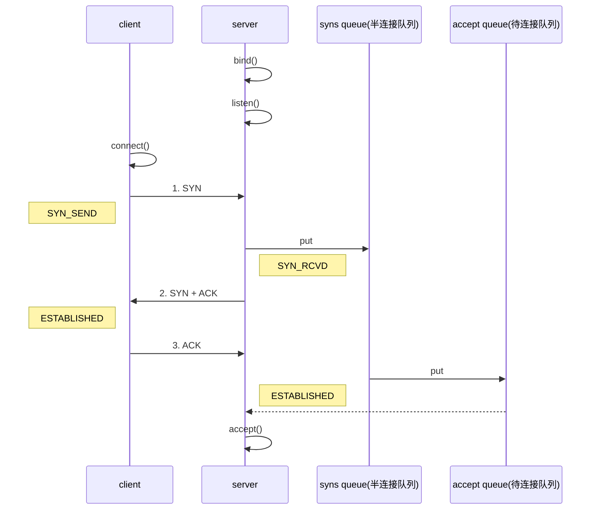

# 网络分层模型

> 浏览器打开网址做了哪些事
>
> > DNS解析

1. 输入域名，浏览器查询本地缓存，看域名有没有对应的ip
2. 如果没有，去host里查询，没有则发起一个DNS请求
3. 通过的是UDP协议向DNS的53端口发起请求，这个请求是递归的请求，也就是运营商的DNS服务器必须得提供给我们该域名的IP地址
4. 得到了这个IP后，本地域名服务器返回IP给操作系统，同时将IP缓存下来，操作系统在还给浏览器，同时缓存IP

> > 与服务器建立连接

> > ##### 发起HTTP连接

> > ##### 服务器响应HTTP请求，浏览器得到html代码

> > ##### 浏览器解析html代码，并请求html代码中的资源

> > ##### 浏览器对页面进行渲染呈现给用户

> > ##### TCP断开连接

# TCP

## 三次握手



1. 客户端到服务端: 我要连接  
   1. 客户端向服务端发送SYN标志位，目的是与服务端建立连接 
2. 服务端到客户端: 好的，已经连接上了  
   1. 服务端向客户端发送 SYN ACK 标志位，其中ACK标志位表示是对收到的数据包的确
      认，说明服务端接收到了客户端的连接  
3. 服务端到客户端: 好的，已经连接上了  
   1. 客户端向服务端发送的ACK标志位为1 

## 四次挥手

1. 客户端到服务端：我关了  
2. 服务端到客户端：好的，收到  
3. 服务端到客户端：我也关了  
4. 客户端到服务端：好的，收到  

# 套接字

## 简介

套接字Socket=（IP地址：端口号）  

```tex
Socket其实并不是一个协议，而是为了方便使用TCP或UDP而抽象出来的一层，是位于应用层和传输控制层之间的一组接口
提供一套调用TCP/IP协议的API。
```


# BIO

## 简介

- 阻塞型IO,同一时间内，线程只能处理一个socket（同一个线程连接到断开期间不能处理其他socket）
- 一个线程对应一个连接,并发量上来了，线程开销就大了
- 线程切换成本高
- 适用于连接数少，短连接的场景（http）


## 代码步骤

1. 创建ServerSocket对象，用于客户端连接  
2. 创建ServerSocket对象，用于客户端连接  
3. 调用Socket对象的方法获取输入流对象  
4. 关闭资源  

> 代码示例

com.xiao.bio.MyServerSocket

com.xiao.bio.MyClientSocket

# NIO

## 简介

- 同步非阻塞（channel连接后，没有发生事件，当前线程可以处理其他的）
- server端启动一个线程，线程维护一个selector
- selector一直轮询，查询通道有没有连接事件(selector负责监听这通道的所有事件)
- 一个selector负责拖个channel
- 也可以有多个线程维护selector
- 适合连接数多且连接比较短，如聊天服务器，弹幕系统，（如果一个channel发送了很长的数据，那么，其他channel可能就要等待很久）


## 核心模块

1. NIO有三个核心部分channel(通道)， buffer(缓冲区), selector(选择器)
2. 每一个channel对应一个buffer，channel可以通过buffer进行读写，程序只与buffer进行交互

